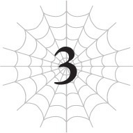

# Chương 3: Đi bắt trộm
*(To Catch a Thief)*

---

Có đứa trẻ hư nào ở đââây không ta?

Nếu bị tôi tìm thấy là rắc rốối toó đấy nhé!

Đã vài ngày trôi qua kể từ khi đám người khả nghi đó đột nhập vào dinh thự của gia đình nhóc hút máu sơ sinh.

Trong khoảng thời gian này, Ma Vương vẫn đang ru rú ở [Tầng đáy] của [Mê cung Lớn Elroe].

Mụ ta đang làm cái quái gì dưới đó thế nhỉ?

Tôi cũng tò mò lắm, nhưng nếu mụ ta không chịu nhúc nhích thì tôi cũng chẳng dại gì mà phàn nàn, vì như thế nghĩa là tôi không cần phải nơm nớp lo sợ chuyện mụ ta bắt kịp mình nữa.

Nên là, nhân lúc hiếm hoi được thư giãn một chút, tôi đã dành thời gian rảnh rỗi của mình để đi giải quyết bọn cướp.

Nếu các anh nhìn cái cách cỗ xe ngựa của nhóc hút máu bị tấn công thì hẳn cũng biết rồi đấy, thế giới này có cực kỳ nhiều cướp.

Sống bên ngoài thành phố, chúng chuyên khủng bố người qua đường để cướp bóc lương thực và tiền bạc.

Lũ cướp này rất hiếu chiến nhưng lại khôn lỏi đến bất ngờ.

Chúng chỉ bắt nạt kẻ yếu nhưng lại thừa khôn ngoan để giữ khoảng cách với kẻ mạnh.

Vì sống ngoài thị trấn nên băng nhóm của chúng phải đủ mạnh để tiêu diệt quái vật trong khu vực mà không gặp vấn đề gì, điều đó khiến chúng nhìn chung còn nguy hiểm hơn cả quái vật địa phương.

Đó là một đoạn trích từ cuốn "Sách hướng dẫn minh họa về sinh vật nguy hiểm" do Tòa soạn Nhện xuất bản.

Nhưng mà thật thế đấy nhé. Lũ cướp thực sự còn tệ hơn cả quái vật ở vùng này.

Bởi vì chúng chủ động tấn công con người một cách ác ý.

Ý tôi là, ít ra lũ quái vật tấn công các sinh vật sống khác một cách bừa bãi chỉ là đang tuân theo bản năng sinh tồn của chúng thôi.

--- PAGE BREAK ---

Trên hết, lũ cướp ở vùng này dường như có liên hệ trực tiếp với tổ chức Elf đang săn lùng nhóc hút máu sơ sinh.

Một tên trong số đám Elf đó cứ lén lén lút lút bên ngoài thị trấn để gặp gỡ trao đổi với chúng các thứ.

Đúng như tôi nghi ngờ, đám cướp tấn công xe ngựa hôm trước có liên quan đến âm mưu của tộc Elf.

Nhưng mà sao tộc Elf lại hành xử như băng nhóm mafia thế kia chứ?

Tôi cứ tưởng Elf phải là những kẻ yêu hòa bình, yêu thiên nhiên và chuyên đi ôm cây cơ chứ.

Nhưng đám Elf này chẳng thèm ôm cây tí nào cả!

Cuối cùng, tôi quyết định rằng nếu lũ cướp này đã cấu kết với tổ chức Elf hắc ám kia, thì tiện tay ném thẳng chúng vào sọt rác luôn cho rảnh nợ.

Chuyện này cũng có lợi cho tôi nữa chứ bộ.

Con người mang lại cả đống điểm kinh nghiệm luôn.

Bởi vì điểm EXP của chính họ có xu hướng dồn vào kỹ năng nhiều hơn là chỉ số cơ bản.

Con người thường có chỉ số thấp hơn quái vật, nhưng bù lại họ sở hữu nhiều kỹ năng hơn nhiều.

Nghĩa là lượng EXP họ cung cấp khá là cao nếu xét theo độ yếu ớt của họ.

Đặc biệt là lũ cướp đã phải cày cuốc kỹ năng điên cuồng để sinh tồn bên ngoài thị trấn.

Những kẻ giết người khác cũng cho thêm điểm bonus nữa cơ.

Dù sao thì chúng cũng đã tích lũy được hàng tá EXP từ việc giết những con người giàu EXP khác mà.

Nhưng giờ đến lượt chúng hiến tế EXP cho tôi rồi!

Nếu tôi giết lũ cướp, người dân trong thị trấn sẽ vui vẻ, gia đình nhóc Dracula cũng hạnh phúc vì bớt đi kẻ thù.

Còn tôi thì sướng rơn vì kiếm được cả rổ kinh nghiệm trong quá trình đó.

Đâu chỉ là một mũi tên trúng hai đích. Chuyện này phải là trúng tận ba bốn đích ấy chứ.

Không làm thì đúng là đồ ngốc!

Thế là tôi bật [Vạn Lý Nhãn] lên quét xung quanh để lùng sục lũ cướp.

Và ôi trời đất ơi, tìm thấy cả đống luôn chứ lị.

Chúng ta đang nói đến con số hàng trăm đấy nhé, đủ mọi kích cỡ và chủng loại.

Sao mà nhiều dữ thần vậy trời?

Thế này thì chắc chắn là quá tải rồi.

Lũ này bộ là dịch chuột hay sao thế?

--- PAGE BREAK ---

Nói thật, khu vực này mất an ninh quá thể đáng.

Hay đây là chuyện bình thường ở dị giới này nhỉ?

Nếu vậy thì nơi này đáng sợ thật đấy.

Những kẻ địch này mạnh hơn quái vật, lại còn bu đông bu đỏ thành bầy đàn.

Cái thể loại game bất khả thi gì thế này?

Thực ra, điều tôi muốn biết nhất là tại sao tất cả lũ này ngay từ đầu lại đi làm cướp.

Nhưng tôi nghĩ mình cũng chẳng cần phải biết quá khứ của chúng làm gì cho mệt.

Để chuẩn bị cho nhiệm vụ tiêu diệt lũ cướp này, tôi đã sắm thêm một vài kỹ năng mới.

Vì tôi đã có khả năng sử dụng Tà Nhãn ngay cả trên các mục tiêu cực kỳ xa khi [Thiên Lý Nhãn] tiến hóa thành [Vạn Lý Nhãn], tôi tự nhủ chi bằng tậu thêm một hai cái Tà Nhãn mới luôn cho rồi.

Tôi đã mua [Phong Ấn Tà Nhãn] với giá ba trăm điểm kỹ năng, [Kháng Ma Tà Nhãn] cũng với giá ba trăm điểm, và thậm chí chơi lớn tậu luôn [Bóp Méo Tà Nhãn] với giá tận năm trăm điểm kỹ năng.

Nếu cộng ba cái này với bốn cái tôi đã có sẵn, cộng thêm [Tương Lai Nhãn] nữa, thì vừa vặn đủ tám con mắt luôn.

Giờ thì tất cả các mắt của tôi đều đã được nạp đầy đạn.

Cuối cùng tôi đã hoàn thành tổ hợp mà mình hằng mơ ước kể từ lần đầu tiên biết đến Tà Nhãn!

Và đây là ba cái tôi vừa mới tậu:

`<Phong Ấn Tà Nhãn: Gây sát thương thuộc tính Phong Ấn lên bất kỳ thứ gì nằm trong tầm nhìn của người sử dụng.>`

`<Kháng Ma Tà Nhãn: Gây sát thương thuộc tính Kháng Ma lên bất kỳ thứ gì nằm trong tầm nhìn của người sử dụng.>`

`<Bóp Méo Tà Nhãn: Gây sát thương thuộc tính Không Gian lên bất kỳ thứ gì nằm trong tầm nhìn của người sử dụng.>`

Đấy, tôi biết mà. Mấy cái giải thích này chẳng giải thích được cái vẹo gì cả.

Trước hết, hóa ra "phong ấn" là một trạng thái bất thường có thể ngăn chặn mục tiêu sử dụng kỹ năng.

Nghe thì có vẻ đầy triển vọng đấy, nhưng dựa trên kinh nghiệm của tôi từ trước tới giờ, tôi đoán là trên thực tế sẽ khá khó để áp dụng.

Nhưng tôi vẫn mua nó với hy vọng sau này có thể phong ấn kỹ năng [Vô hiệu Trạng thái bất thường] của đối phương.

Nếu làm được như vậy, tôi sẽ thực sự có cơ hội trút cơn thịnh nộ từ các Tà Nhãn khác lên đầu chúng.

--- PAGE BREAK ---

Bản thân Phong Ấn cũng là một trạng thái bất thường, nên rất có khả năng ngay từ đầu nó đã không hoạt động rồi, nhưng tôi nghĩ cũng đáng để thử một lần.

Tiếp theo là [Kháng Ma Tà Nhãn], đúng như tên gọi, nó ngăn chặn mục tiêu niệm ma pháp.

Cái này cũng không khác mấy so với mấy cái kỹ năng vảy rồng từng khiến tôi khốn đốn trong quá khứ.

Tôi cũng có một phiên bản cấp thấp của các kỹ năng đó hấp thụ từ Mẹ gọi là [Long Mạc].

Nhưng điểm hay ho của [Kháng Ma Tà Nhãn] là anh có thể bắt đầu ức chế việc sử dụng ma pháp của đối phương ngay khi nhìn thấy chúng.

Nói cách khác, các kỹ năng như [Long Lân] hay [Long Mạc] làm suy giảm sức mạnh của ma pháp đã được niệm, còn [Kháng Ma Tà Nhãn] lại khiến việc bắt đầu niệm ma pháp ngay từ đầu trở nên khó khăn hơn.

Tựu trung lại, tôi có thể dùng [Kháng Ma Tà Nhãn] để cản trở đối phương niệm phép, rồi chặn đứng câu chú chưa hoàn chỉnh đó bằng [Long Mạc].

Kết hợp với chỉ số phòng ngự ma pháp cơ bản vốn siêu cao của mình, thế này nghĩa là về cơ bản tôi sẽ không còn nhận sát thương từ ma pháp nữa sao?

Dù sao thì, cuối cùng nhưng không kém phần quan trọng là [Bóp Méo Tà Nhãn].

Cái thứ hiểm độc này có thể bóp méo không gian ở bất cứ nơi nào tôi nhìn thấy.

Tôi đã thử nghiệm một chút, và nó siêu khó kiểm soát luôn.

Nhưng vì tôi đã khá quen thuộc với việc điều khiển [Ma pháp Không gian] nên khi đã quen tay, tôi có thể bóp méo mọi thứ khá tự do.

[Bóp Méo Tà Nhãn] cũng được coi là một phép tấn công thuộc tính không gian, nên nếu có bất kỳ thứ gì nằm trong vùng không gian bị bóp méo, nó cũng sẽ bị vặn xoắn theo.

Rắc! Nhẹ nhàng như thế.

Tôi đã thử nghiệm lên một cái cây, và nó đục rỗng cả thân cây luôn.

Rắc! Nhẹ nhàng như thế.

Tàn nhẫn thật sự.

Mà cái này tôi có thể dùng từ khoảng cách cực kỳ xa nhờ có [Vạn Lý Nhãn].

Và không giống như hầu hết các Tà Nhãn khác, cái này nhắm vào không gian chứ không phải sinh vật sống, nên tôi có thể bóp méo bất cứ thứ gì mình muốn.

Thế chẳng phải nghĩa là tôi có thể đục rỗng bên trong đầu của ai đó nếu tôi muốn sao?

Rắc! Nhẹ nhàng như thế.

Mặc dù, vì mục tiêu của nó là không gian nên điều đó có nghĩa là nó thực sự có thể bị né tránh, không giống như các Tà Nhãn khác của tôi.

--- PAGE BREAK ---

Được cái này thì mất cái kia thôi, tôi đoán vậy.

Nếu các anh thắc mắc tại sao tôi lại tậu cái Tà Nhãn thuộc tính Không Gian này dù đã có [Ma pháp Không gian], thì đó là vì các đòn tấn công của [Ma pháp Không gian] khó dùng đến điên người.

Chắc chắn là có các phép tấn công trong [Ma pháp Không gian].

Kiểu như cắt đứt không gian hay mấy thứ tương tự thế.

Nhưng để sử dụng [Ma pháp Không gian], không giống như bất kỳ loại ma pháp nào khác, anh phải thiết lập một vùng mục tiêu được chỉ định.

Về cơ bản là xác định nơi ma pháp sẽ được kích hoạt, nhưng việc đó cũng cực kỳ phiền phức.

Vì anh phải làm việc đó song song với phần còn lại của quá trình niệm chú, nên nó chậm hơn bất kỳ loại ma pháp nào khác mà tôi sở hữu.

Thế cũng được đi, vì bù lại nó đi kèm với phép [Dịch chuyển] quá đỗi hữu dụng.

Nhưng trong chiến đấu, nơi mà một khoảnh khắc chậm trễ có thể quyết định sinh tử, việc sử dụng các đòn tấn công ma pháp khác thay vì [Ma pháp Không gian] thường sẽ an toàn hơn.

Thành ra hầu như tôi chẳng có đòn tấn công thuộc tính Không Gian nào ra hồn cả.

Đó là lý do tại sao tôi tậu một con Tà Nhãn có thuộc tính Không Gian, mặc dù về mặt lý thuyết tôi đã sở hữu loại ma pháp này rồi.

Giờ thì cuối cùng tôi đã có một đòn tấn công thuộc tính Không Gian có thể kích hoạt ngay tức thì.

Đem mấy con Tà Nhãn mới đi chạy thử nghiệm, tôi đã quét sạch một băng cướp lớn.

Và giờ là lúc để đưa ra vài đánh giá ban đầu!

Đầu tiên là [Phong Ấn Tà Nhãn].

Nó ngu ngốc và khó dùng kinh khủng!

Phải tốn một khoảng thời gian siêu lâu, và khi xong xuôi thì nó chỉ phong ấn được duy nhất một kỹ năng.

Một cái!

Tôi biết có lẽ là do cấp độ kỹ năng còn thấp, nhưng thế thì tệ hại quá thể đáng.

Tệ đến mức tôi có chút hối hận vì ngay từ đầu đã mua nó.

Tiếp theo, [Kháng Ma Tà Nhãn].

Chàaa, về cái đó thì. Vì tôi dùng [Vạn Lý Nhãn] để tấn công từ xa, nên tôi thực sự không có cơ hội thử nghiệm nó.

Ý tôi là, mục tiêu còn chẳng nhìn thấy tôi cơ mà, hiểu không?

Nên dĩ nhiên chúng không niệm ma pháp, và dĩ nhiên tôi cũng chẳng có cơ hội để chạy thử [Kháng Ma Tà Nhãn] rồi.

--- PAGE BREAK ---

Ừm. Tạm thời hoãn đánh giá!

Cuối cùng là [Bóp Méo Tà Nhãn].

Cái này hơi khó để nhận xét một cách chính xác.

Không giống như các đòn tấn công Tà Nhãn khác, cái này nhắm vào không gian trong tầm nhìn của tôi chứ không phải nhắm trực tiếp vào kẻ địch.

Nên nó không có khả năng trúng đích 100% như các Tà Nhãn khác.

Nếu kẻ địch di chuyển ra khỏi vùng không gian mà tôi đang nhắm tới để tấn công, đòn đó sẽ hụt.

Thêm vào đó, nếu có vật thể trong không gian tôi nhắm tới, độ cứng của vật thể đó càng cao thì việc vặn xoắn nó càng khó khăn hơn.

Đôi khi sự chậm trễ đó khiến mục tiêu di chuyển trước khi ma pháp kịp kích hoạt.

Dù vậy, việc có thể tấn công trực tiếp vào cơ thể đối thủ vẫn khá là tuyệt vời.

Chỉ cần nhắm vào những chỗ không quá cứng, ví dụ như mô não chẳng hạn. Chỉ cần vặn nhẹ một cái. Đúng nghĩa đen là hại não luôn!

Đúng vậy, khá là hiểm độc đấy.

Hiện tại thì [Chú Oán Tà Nhãn] vẫn mạnh mẽ và tiện lợi hơn nhiều, nhưng ai mà biết được chứ? Biết đâu khi cấp độ của kỹ năng này tăng lên, nó sẽ có những công dụng riêng của mình.

Vậy là xong phần phân tích các Tà Nhãn mới của tôi.

Tôi cũng không biết nên vui hay buồn nữa, thật đấy.

Nhờ tiêu diệt cả đống cướp trong quá trình này, tôi đã thu hoạch được một lượng kinh nghiệm khổng lồ và thậm chí còn lên cấp nữa chứ.

Như thế coi như thắng lợi rồi.

Không biết sắp tới có thêm toán cướp nào xuất hiện nữa không nhỉ?

---

[◀ Chương trước: Chương S3: Trận chiến Làng Elf bắt đầu](s3_the_battle_of_the_elf_village_begins.md) | [Chương tiếp theo: Chương đặc biệt: Kẻ chủ mưu: Giáo hoàng của Thần Ngôn Giáo ▶](special_chapter_the_conspirators_the_pontiff_of_the_word_of_god.md)
