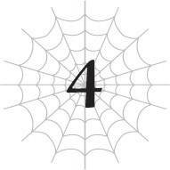

# Chương 4: Hãy thờ phụng tôi đêêê!
*(Worship Meee!)*

---

Sao chuyện này lại xảy ra được nhỉ?

Một đám người đang phủ phục sát đất trước cửa rừng.

Đồ hiến tế cũng chất đống lên rồi kìa.

Và tất cả những thứ này là dành cho... tôi.

Vì lý do nào đó mà tôi đang được thờ phụng.

Kiểu như tôi là thổ địa hay thần hộ mệnh địa phương gì đó không biết.

Nghiêm túc đấy, làm sao chuyện này lại xảy ra được hả trời?

Tôi đoán lời giải thích duy nhất là một loạt các yếu tố khác nhau đã tạo ra một phản ứng hóa học dẫn đến tình huống kỳ quặc này.

Trước hết, lẽ ra tôi không nên quét sạch toàn bộ lũ cướp đó.

Nếu cả một băng cướp lớn đột nhiên bốc hơi, tất nhiên người ta sẽ sinh nghi rồi.

Một khi lãnh chúa của hạt bắt đầu điều tra nguyên nhân, việc họ phát hiện ra tôi chỉ còn là vấn đề thời gian.

Nếu mọi chuyện chỉ dừng lại ở đó thì cũng không đến nỗi tệ.

Ngài Lãnh chúa, người ngẫu nhiên cũng là cha của nhóc hút máu sơ sinh, dường như coi tôi là một thực thể nguy hiểm, nên ông ta hành động cực kỳ thận trọng.

Tôi vốn chẳng định làm gì trừ khi họ thực sự chọc giận tôi, thế nên tôi cũng không phiền nếu họ canh chừng mình, miễn là họ vẫn giữ thái độ lịch sự.

Nhưng rồi tôi lại bị một nhóm mạo hiểm giả phát hiện.

Nếu họ đi ra từ thị trấn thì đã đành một nhẽ, đằng này tôi không ngờ họ lại xuất hiện từ phía sau mình.

Hóa ra họ đến từ một quốc gia lân cận với nhiệm vụ tìm ra nguyên nhân của một đợt bùng phát quái vật bất thường.

Hoặc tôi đoán chính xác hơn thì phải gọi là nguồn gốc của một cuộc di cư quái vật bất thường.

--- PAGE BREAK ---

Ừm. Đó là lỗi của tôi.

Kỹ năng [Uy Áp] của tôi đã dọa một lũ quái vật sợ khiếp vía, khiến chúng phải bỏ chạy thục mạng sang tận nước láng giềng.

Nên suy cho cùng, việc các mạo hiểm giả điều tra hiện tượng đó lần mò đến tận đây cũng là điều tự nhiên thôi, vì nguồn cơn không ai khác ngoài chính tôi chứ đâu.

Lẽ ra tôi nên dùng [Dịch chuyển] để tạm thời lẩn trốn họ. Trên thực tế, tôi đang bận chút việc dưới [Mê cung Lớn Elroe] khi họ tiến vào rừng, nên lúc tôi dịch chuyển trở lại thì đâm sầm ngay vào họ.

Cảm giác y như là bị tai nạn giao thông vậy.

Các mạo hiểm giả đã tìm thấy tôi như thế đấy, nhưng điều thực sự làm tôi ngạc nhiên là trong số họ có cả mấy đứa tân thủ mà tôi từng cứu trước đây trong [Mê cung Lớn Elroe].

Các anh biết đấy, mấy đứa mà tôi tình cờ thấy bị dồn vào đường cùng bởi một con rắn ở [Tầng trên] hồi đó ấy?

Từ đó đến nay tôi đã tiến hóa nên ngoại hình trông hơi khác một chút, nhưng họ vẫn lập tức nhận ra tôi chính là ân nhân nhện cứu mạng của mình.

Thế là họ ngăn mấy đồng nghiệp mạo hiểm giả khác định tấn công tôi. Rồi không hiểu kiểu gì, họ dâng trái cây cho tôi.

Tôi nghĩ bụng dù sao thì nhận cũng có mất mát gì đâu, đúng không? Nhưng nghĩ lại thì, lẽ ra tôi nên cân nhắc kỹ hơn một chút.

Bởi vì bây giờ tất cả bọn họ dường như đều nghĩ rằng chỉ cần dâng trái cây hay đại loại thế là tôi sẽ ngoan ngoãn chơi chung.

Từ đó, ừm, chuyện này bắt cầu sang chuyện kia, và tiếp theo như các anh thấy đấy, chúng ta thành ra thế này đây.

Các anh không hiểu hả?

Đến bản thân tôi còn chả nắm rõ chi tiết nữa là.

Mấy mạo hiểm giả đi vào thị trấn.

Họ kể với mọi người rằng có một con quái vật nhện trong rừng, chính là tôi đấy.

Bằng cách nào đó, tin đồn lan truyền rằng con quái vật này cũng chính là kẻ đã xử lý toàn bộ lũ cướp.

Và bây giờ họ nghĩ tôi là hóa thân tái thế của Thần Thú dưới quyền Nữ Thần hay cái gì đó tương tự?

Dẫn đến việc tôi đang được thờ phụng như hiện tại.

Ừm. Nghe vẫn chả hợp lý chút nào.

--- PAGE BREAK ---

Theo những gì tôi thu thập được, giáo lý Nữ Thần Giáo mà người dân thị trấn này tôn sùng có điều răn rằng loài nhện là sinh vật linh thiêng, và vị Nữ Thần kia từng có một hầu cận gọi là Thần Thú.

...Tôi hình như nhớ mang máng có một vị ma vương nào đó sở hữu danh hiệu [Thần Thú Thượng Cổ], nhưng chắc là tôi tưởng tượng ra thôi.

Đúng vậy, chắc chắn là tôi hoang tưởng rồi! Cứ quyết định thế đi.

Nhưng tạm quên người bạn ma vương nhện đó đi.

Lý do ban đầu họ bắt đầu thờ phụng tôi là vì họ phát hiện ra tôi chính là kẻ đã tiêu diệt lũ cướp.

Mà tôi cũng đoán được nguyên nhân tại sao rồi.

Chắc chắn là do phu nhân lãnh chúa, mẹ của nhóc hút máu sơ sinh.

Đúng vậy. Bà ta hoàn toàn phớt lờ yêu cầu giữ im lặng của chồng mình, đi khắp thị trấn kể cho bất kỳ ai chịu lắng nghe về vụ tấn công đó.

Kiểu như, “Thần Thú đã cứu tôi khỏi tay bọn cướp!”

Và chắc bà ta đã nghe chồng kể rằng tôi là kẻ đã giết sạch lũ cướp rình rập ngoài kia, vì bà ta cũng bô bô chuyện đó cho tất cả mọi người luôn.

Một khi người phụ nữ quyền lực nhất thị trấn đã gọi tôi là Thần Thú, thì các anh cũng thấy mọi chuyện diễn tiến tiếp theo thế nào rồi đấy.

Đã thế, mấy mạo hiểm giả được tôi cứu cũng rêu rao khắp thị trấn về cuộc gặp gỡ ngắn ngủi giữa họ với tôi.

Các anh không tin nổi mọi người tin sái cổ chuyện tôi là Thần Thú nhanh đến mức nào sau đó đâu.

Có lẽ chỉ vì ngay từ đầu họ đều đã là những kẻ cuồng tín Nữ Thần Giáo, nhưng tôi phải nói thật, tôi hơi lo ngại khi họ lại dễ dàng tin tưởng một con quái vật như thế.

Tôi thấy tội nghiệp cho vị lãnh chúa tội nghiệp phải đau đầu giải quyết đống bòng bong này.

Nếu hỏi tôi, ông ta mới là người đúng đắn khi muốn cảnh giác với một con quái vật.

Trời ạ, sức mạnh của tôn giáo đáng sợ thật.

Dù sao thì, khi tình huống này mới bắt đầu, họ chỉ thờ phụng tôi từ đằng xa.

Cầu nguyện trước cửa rừng, thỉnh thoảng đặt ít trái cây làm lễ vật, thế thôi.

Người cũng không nhiều lắm. Chỉ có những tín đồ đặc biệt sùng đạo của Nữ Thần Giáo, các mạo hiểm giả cầu bình an, và mấy người tương tự vậy.

Làm sao trên đời này chuyện đó lại biến thành một đám đông khổng lồ tụ tập lảng vảng quanh khu rừng thế kia?

--- PAGE BREAK ---

Ồ, làm việc thiện thì thường gặp báo oán mà.

Mấy mạo hiểm giả chắc đã loan tin rằng tôi biết dùng [Ma pháp Trị liệu], thế là tiếp theo các anh biết gì không, một người mẹ đã bồng đứa con bị bệnh của mình đến tìm tôi.

Khóc lóc thảm thiết, giơ đứa trẻ lên, làm đủ trò.

Tôi đã lờ đi một lúc, nhưng bà mẹ cứ gào khóc một từ mang tông giọng cầu xin tha thiết, nên cuối cùng tôi đành phải nhượng bộ.

Tôi [Thẩm định] đứa trẻ và phát hiện ra nó đang mắc một căn bệnh khá nghiêm trọng.

Loại bệnh mà trị liệu bình thường không thể chữa khỏi.

Tôi nghi ngờ thế giới fantasy này làm gì có công nghệ chữa bệnh ung thư.

Đúng thế. Đứa trẻ bị ung thư gan.

Làm sao một đứa trẻ lại bị ung thư gan được, các anh hỏi thế chứ gì?

Ban đầu tôi cũng tự hỏi vậy, nhưng nhìn vào bảng trạng thái của nó thì tôi cũng hiểu ra phần nào.

Nó sở hữu danh hiệu [Kẻ Ăn Uế Tạp], giống hệt như tôi.

Tôi đoán gia đình họ chắc nghèo lắm.

Họ có lẽ đã phải ăn rất nhiều thức ăn ôi thiu bẩn thỉu do nghèo đói, bao gồm cả những thứ có độc.

Tôi đoán hiệu ứng của danh hiệu đã bảo vệ các cơ quan tiêu hóa của nó, nhưng lá gan thì không chịu nổi lượng độc tố tích tụ.

Mẹ của nó cũng thế, các cơ quan nội tạng cũng ở trong tình trạng thảm hại tương tự.

Không phải tôi có nghĩa vụ gì phải giúp họ, nhưng tôi cũng chẳng có việc gì tốt hơn để làm, nên quyết định chữa trị cho cả hai mẹ con luôn.

Chỉ dùng [Ma pháp Trị liệu] thông thường sẽ không có tác dụng, nên tôi phải dùng vài phương pháp khá là bạo lực.

Cơ bản là tôi ru họ ngủ, khoét bỏ các cơ quan nội tạng bị bệnh, rồi dùng [Ma pháp Trị liệu] để ép cơ thể họ tái tạo cái mới.

Nếu một bác sĩ từ Trái Đất nhìn thấy cảnh đó, chắc họ ngất xỉu tại chỗ luôn quá.

Nhưng tôi đoán đây chính là điểm đặc trưng của dị giới.

Mặc dù vậy, hành động đó cũng gieo cho tôi chút rắc rối sau này.

Bởi vì bắt đầu từ ngày hôm sau, một đống người bệnh tật và bị thương kéo đến tìm tôi để được chữa trị.

Đến nước này thì tôi nghĩ cũng chả còn cách nào khác, nên tặc lưỡi chữa trị cho từng người một luôn.

Và đó là lý do tại sao bây giờ tôi lại được thờ phụng thế này.

--- PAGE BREAK ---

Hừm.

Nói thế thì chuyện này một nửa là do lỗi của tôi, một nửa là do giáo lý của Nữ Thần Giáo.

Nhưng hiện tại nó cũng chẳng gây hại gì, nên tôi nghĩ cũng không có gì to tát.

Ma Vương, người rất có thể mới là Thần Thú thực sự, vì lý do nào đó vẫn đang ru rú ở [Tầng đáy] của [Mê cung Lớn Elroe].

Mụ ta định làm kẻ tự kỷ ru rú trong nhà luôn đấy à? Cứ tự nhiên ở đó mãi mãi luôn đi nhé, được không?

Xem xét mọi khía cạnh, có vẻ như ít nhất tôi cũng có thể thư giãn một thời gian.

Nếu không thì tôi đã chuồn lẹ khỏi đây ngay giây phút đống điên rồ này bắt đầu diễn ra rồi.

Thực ra, miễn là mối đe dọa từ Ma Vương không treo lơ lửng trên đầu, thì cái vụ được thờ phụng này tính ra cũng không tệ lắm.

Cái lợi đầu tiên là tôi nhận được cả đống đồ ăn hiến tế.

Từ trước đến giờ tôi hầu như chẳng được ăn thứ gì ngon lành tử tế cả, nên thành thật mà nói, tôi khá là xúc động trước cái vụ dâng lễ vật này.

Hầu hết là trái cây, nhưng có đủ chủng loại đa dạng để tôi không bị ngấy.

Hồi còn sống trong mê cung, tôi chưa bao giờ dám mơ đến việc được ăn đồ ngọt ngào thế này mỗi ngày.

Đỉnh của chóp luôn!

Nếu có thể, tôi cũng không ngại ăn thêm các món khác ngoài trái cây đâu, nhưng của cho thì không được đòi hỏi, đúng không.

Nên chế độ ăn uống phong phú mới chắc chắn là điểm cộng lớn nhất, nhưng bên cạnh đó vẫn còn vài lợi ích khác nữa.

Vì tôi liên tục chữa trị cho đám người bệnh tật và bị thương lao vào mình không ngừng nghỉ, tôi đã nhận được một số danh hiệu.

Chính xác là năm cái.

[Kẻ Cứu Trợ], [Nhà Luyện Dược], [Thánh Nhân], [Đấng Cứu Thế], và [Kẻ Bảo Vệ].

> **[Kẻ Cứu Trợ]**: Nhận các kỹ năng [Ma pháp Trị liệu Cấp 1] [Quang ma pháp Cấp 1]. Điều kiện đạt được: Tích lũy được một lượng điểm thanh tẩy nhất định. Hiệu quả: Tăng cường hiệu quả trị liệu. Giải thích: Danh hiệu dành cho những người cứu giúp người khác.

> **[Nhà Luyện Dược]**: Nhận các kỹ năng [Tổng hợp Thuốc Cấp 1] [Ma pháp Trị liệu Cấp 1]. Điều kiện đạt được: Sử dụng một lượng thuốc nhất định. Hiệu quả: Tăng cường hiệu quả của thuốc. Giải thích: Danh hiệu dành cho những người sử dụng thuốc.

> **[Thánh Nhân]**: Nhận các kỹ năng [Kỳ Tích Ma Pháp Cấp 1] [Thánh Quang Ma Pháp Cấp 1]. Điều kiện đạt được: Tích lũy được một lượng điểm thanh tẩy nhất định. Hiệu quả: Tăng cường cực đại hiệu quả trị liệu. Giải thích: Danh hiệu dành cho những người cứu giúp nhiều người khác.

--- PAGE BREAK ---

> **[Đấng Cứu Thế]**: Nhận các kỹ năng [Nhân Ái] [Anh Hùng Cấp 1]. Điều kiện đạt được: Tích lũy được một lượng điểm thanh tẩy nhất định. Hiệu quả: Tăng cường cực đại hiệu suất thuộc tính Quang. Giải thích: Danh hiệu dành cho những người cứu giúp vô số người khác.

> **[Kẻ Bảo Vệ]**: Nhận các kỹ năng [Thiết Phòng Ngự Cấp 1] [Khiên Thuật Cấp 1]. Điều kiện đạt được: Bảo vệ một số lượng người nhất định. Hiệu quả: Gia tăng mạnh chỉ số phòng ngự và kháng tính. Giải thích: Danh hiệu dành cho những người bảo vệ người khác.

Tôi nhận được danh hiệu [Nhà Luyện Dược] nhờ sử dụng [Tổng hợp Thuốc] kết hợp với [Ma pháp Trị liệu].

Mặc dù vào lúc tôi nhận được nó thì cả kỹ năng [Tổng hợp Thuốc] lẫn [Ma pháp Trị liệu] của tôi đều đã đạt cấp tối đa rồi, nên tính ra tôi chẳng được lợi lộc gì thêm.

Thành thật mà nói, tôi cũng không hiểu lắm tại sao mình lại nhận được danh hiệu [Kẻ Bảo Vệ].

Có lẽ vì tôi đã bảo vệ thị trấn khỏi lũ cướp, hoặc bảo vệ mọi người khỏi bệnh tật, hay đại loại thế.

[Thiết Phòng Ngự] giúp tăng chỉ số phòng thủ của tôi, cái này khá là tiện lợi.

Còn [Khiên Thuật] giúp tăng cường sức bền của khiên và khả năng sử dụng nó khi tôi trang bị khiên.

Nhưng mà, ừm... hiểu không?

Tôi mà trang bị khiên á?

Liệu tôi có thể trang bị vũ khí và giáp trụ không thế?

Được rồi, kỹ năng này vô dụng. Tuyệt vời.

Dù sao thì, các danh hiệu [Kẻ Cứu Trợ], [Thánh Nhân] và [Đấng Cứu Thế] đều đạt được bằng cách tích lũy một thứ gọi là điểm thanh tẩy.

Cơ bản là tích điểm bằng cách làm việc thiện hay đại loại vậy.

Tôi đã chữa trị cho cả đống người bệnh nặng và bị thương, chủ yếu bằng cách dùng chỉ số ma lực siêu cao của mình để đè bẹp tất cả. Điều đó giải thích tại sao tôi lại kiếm được nhiều điểm như thế.

Mỗi danh hiệu này cũng giúp tăng hiệu quả trị liệu của tôi, khiến tôi chữa trị ngày càng xịn hơn, thế thì tốt quá.

Chữa bệnh cứu người, nhận danh hiệu, tăng hiệu năng trị liệu, rồi lại tiếp tục chữa trị.

Cơ bản là tôi đã bị cuốn vào một vòng lặp trị liệu vô tận khá là tốt đẹp.

Các kỹ năng mới tôi nhận được từ những danh hiệu này là [Quang ma pháp], [Kỳ Tích Ma Pháp], [Thánh Quang Ma Pháp], [Anh Hùng] và [Nhân Ái].

Đúng như tên gọi, [Quang ma pháp] dùng để điều khiển ánh sáng.

[Thánh Quang Ma Pháp] là dạng nâng cấp cao hơn của [Quang ma pháp].

[Kỳ Tích Ma Pháp] là phiên bản xịn sò hơn của Ma pháp Phục hồi, nên tôi cũng chả hiểu sao mình không nhận được nó khi max kỹ năng [Ma pháp Trị liệu] nữa.

--- PAGE BREAK ---

Nó hoàn toàn xứng danh với cái tên của mình khi sở hữu khả năng trị liệu cực khủng, cho phép tôi chữa trị hầu như mọi thứ miễn là mục tiêu chưa chết.

Tiếp theo là kỹ năng [Anh Hùng].

Nó dường như tạo thành một cặp bài trùng với kỹ năng [Ma Vương]. Giống như kỹ năng đó, nó nhân toàn bộ chỉ số của tôi lên gấp một trăm lần cấp độ kỹ năng, đồng thời tăng cường các kháng tính.

Ủa, mà tôi có thực sự được phép sở hữu kỹ năng [Anh Hùng] khi đã có kỹ năng [Ma Vương] không vậy trời?

Chúng sẽ không bài xích lẫn nhau rồi làm tôi nổ tung từ bên trong hay gì đấy chứ?

Hay đây là kiểu thiết lập kiểu như khi anh hùng và ma vương kết hợp sức mạnh thì sẽ vô địch thiên hạ gì đó chăng?

Nếu vậy thì thôi cứ nhận luôn vậy.

Nhưng đến giờ vẫn chưa có chuyện gì xảy ra, nên chắc là ổn thôi.

[Quang ma pháp], [Thánh Quang Ma Pháp], [Kỳ Tích Ma Pháp] và [Anh Hùng].

Toàn là mấy kỹ năng nghe chính nghĩa thiện lương vãi cả chưởng đối với một con nhện.

Khá là siêu thực đấy chứ hả?

Và kỹ năng [Nhân Ái] chính là cú chốt hạ giáng xuống lưng con nhện này.

Nó lại là một kỹ năng siêu cấp lỗi game giống như [Kiên trì].

Tại sao chỉ một danh hiệu mà lại cho tôi cái kỹ năng bá đạo điên khống thế này chứ?

Các anh không thấy chuyện này kỳ lạ lắm sao?

Và dĩ nhiên, tôi cũng đạt luôn được danh hiệu [Kẻ Thống Trị Nhân Ái].

Thế là tổng cộng tôi có tận sáu danh hiệu Kẻ Thống Trị rồi.

Đến nước này thì tôi chỉ biết cười trừ thôi chứ biết sao giờ.

> **[Nhân Ái]**: n% sức mạnh để đạt tới thần giới. Áp dụng hiệu ứng tương đương với [Tự hồi phục HP siêu tốc] lên người sử dụng và bất kỳ ai được công nhận là đồng minh của người sử dụng. Ngoài ra, người sử dụng sẽ nhận được khả năng vượt qua hệ thống W và can thiệp vào trường MA.

> **[Kẻ Thống Trị Nhân Ái]**: Nhận các kỹ năng [Kỳ Tích Ma Pháp Cấp 10] [Dâng Hiến]. Điều kiện đạt được: Sở hữu kỹ năng [Nhân Ái]. Hiệu quả: Gia tăng các chỉ số MP, ma lực và kháng tính + hiệu chỉnh tăng độ thuần thục của kỹ năng hỗ trợ. Ban đặc quyền kẻ thống trị. Giải thích: Danh hiệu dành cho người đã chinh phục được lòng nhân ái.

Nói nghiêm túc đấy hả?!

[Kỳ Tích Ma Pháp] của tôi đạt cấp tối đa chỉ trong một nốt nhạc.

Và hiệu ứng của [Nhân Ái] cũng quá là ảo diệu luôn.

Nó không giúp ích gì nhiều cho tôi vì tôi là kẻ độc hành cô độc trăm phần trăm, nhưng nếu tướng lĩnh của một đội quân sở hữu cái này thì bùm! Anh sẽ có một đội quân bất tử trong tay.

Đáng tiếc, vì tôi là kẻ bị xã hội ruồng bỏ nên cái này coi như bị lãng phí hoàn toàn.

--- PAGE BREAK ---

Mặc dù tôi đoán mình vẫn có thể dùng được nó nếu đống trứng tôi đẻ dưới [Mê cung Lớn Elroe] hôm nọ nở thành công.

Cuộc sống mới dưới thân phận đối tượng được thờ phụng của tôi vẫn tiếp diễn, nhưng nó đang trở thành một vấn đề khá nan giải.

Tiếp xúc với con người đáng sợ lắm.

Tôi đã bảo tôi là kẻ cô độc rồi, nhớ không?

Kiếp trước tôi đã là kẻ bị cô lập, và ở kiếp này tính đến thời điểm hiện tại thì lại càng thảm hại hơn!

Bản tính tôi nó thế rồi!

Nói nghiêm túc thì tôi chưa bao giờ giỏi giao tiếp với người khác cả.

Tôi dành phần lớn thời gian một mình, và khi có người cố bắt chuyện, tôi thường chọn cách im lặng luôn vì chả biết phải trả lời thế nào.

Tôi cũng từng bị bắt nạt, có lẽ vì lý do đó.

Có một đứa con gái rất nổi bật trong lớp chuyên giấu đồ của tôi rồi nói mấy lời khó nghe các thứ.

Nhưng đó là kiểu bắt nạt khá nhẹ nhàng, nên dù sao thì tôi cũng chẳng bận tâm mấy.

Hầu hết thời gian, nó chỉ gồm việc cô ta tiến đến chỗ tôi, nói vài lời cay độc rồi bỏ đi.

Như thế thì có được gọi là bắt nạt không ta?

Tôi chả rõ nữa, nhưng tôi biết mình cực kỳ lạc lõng trong lớp.

Tôi hầu như chưa từng nói chuyện tử tế với ai cả.

Thế nên tôi chả biết phải đối phó thế nào trước đám đông người cứ ồ ạt xông về phía mình một cách hung hãn thế này.

Mặc dù vậy, tôi đã ít nhiều học được ngôn ngữ ở đây rồi.

Trong thời gian ở gần thị trấn này, tôi đã chăng vài sợi tơ vô hình, về cơ bản là dùng như điện thoại ống lon để nghe lén mọi người.

Tôi đã giao cho các [Phân thân Tư duy] cật lực phân tích để giải mã ngôn ngữ.

Nhờ đó, tôi đang dần tiến tới mức có thể hiểu được sơ bộ các cuộc hội thoại cơ bản.

Đó là lý do tại sao tôi biết chuyện phu nhân lãnh chúa đi rêu rao tin đồn các thứ.

--- PAGE BREAK ---

Giờ tôi đã hiểu được ngôn ngữ.

Đó là bước đầu tiên để có thể trò chuyện.

Bây giờ tất cả những gì tôi cần làm là tậu thêm [Thần giao cách cảm], rồi dùng nó để gửi suy nghĩ và lời thoại của mình đến mọi người.

Khi đó hy vọng tôi có thể được công nhận là một sinh vật thông minh, chứ không chỉ là một con quái vật cần phải tiêu diệt.

Nếu chúng tôi có thể trò chuyện, tôi có thể tìm ra những cách mới để hòa hợp với con người.

Ngoại trừ vấn đề lớn mang tên Ma Vương ra, tôi thậm chí còn có thể sống chung hòa bình với xã hội nhân loại không chừng.

Tuy nhiên tôi vẫn chưa thể hạ quyết tâm bước qua ranh giới đó, vì tôi quá sợ việc tương tác với người khác.

Trò chuyện thì phải làm thế nào mới được cơ chứ?!

Bộ cứ mở đầu bằng việc bàn luận thời tiết là xong hả?!

Rồi tiếp theo nói cái gì nữa?!

Tôi hoàn toàn có thể hình dung ra cảnh mình nói: “Hôm nay thời tiết đẹp quá nhỉ?” rồi sau đó chìm trong đống mồ hôi của chính mình vì chả nghĩ ra được gì khác để nói tiếp, hiểu không?!

Người ta sẽ nghĩ gì nếu một con nhện đột nhiên bắt chuyện hỏi han thời tiết rồi đứng hình cứng đờ ra chứ?!

Tôi cá chắc là ai cũng sẽ sợ khiếp vía cho mà xem!

Là tôi thì tôi cũng chả muốn ở gần kẻ lập dị như thế đâu!

Ngay cả bây giờ, khi không phải hé răng nửa lời, tôi vẫn thấy sợ phát khiếp nếu có ai đó đến quá gần mình!

Kẻ bị cô lập luôn sợ hãi khi xung quanh có quá nhiều người, hiểu không!

Hiện tại, với việc mọi người cứ lao đến van nài xin trị liệu các thứ, có lẽ tôi đã cuốn gói chuồn khỏi đây ngay lập tức nếu ông lãnh chúa không cấm người dân tiến vào rừng rồi!

Ông ta chắc cũng muốn cấm mọi người đến gần tôi lắm, nhưng vì cả thị trấn hiện đang phát cuồng vì vị “thổ địa” này, ông ta chắc phải đầu hàng từ bỏ rồi.

Dù sao thì, tôi cũng phải cảm ơn ông đấy, ngài Lãnh chúa.

Ít ra tôi còn có thể chạy trốn vào sâu trong rừng nếu cần lánh mặt mọi người.

Họ không biết việc làm cho một kẻ như tôi phải bỏ chạy là điên rồ đến mức nào đâu.

--- PAGE BREAK ---

Nhưng điều đó vẫn để lại cho tôi một vấn đề nan giải. Liệu tôi có phải bắt đầu giao thiệp với con người nhiều hơn mức này nữa không?

Không đời nào, xin miễn giùm cho, cảm ơn rất nhiều!

Không, tạm thời tôi cứ giữ mọi chuyện diễn ra như hiện tại vậy.

Dù sao thì, để con người hiểu được nhau vốn dĩ đã là chuyện vô cùng khó khăn rồi.

---

[◀ Chương trước: Chương O2: Hãy cùng chiến đấu](o2_let_us_fight.md) | [Chương tiếp theo: Chương S4: Cuộc đối đầu định mệnh ▶](s4_fateful_confrontation.md)
