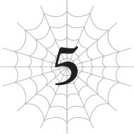

# Chương 5: Những mưu đồ trỗi dậy
*(Machinations in Motion)*

---

Cái gã phiền phức kia cứ lải nhải làm phiền tôi mãi, thế nên tôi hình như... kiểu như... hơi hơi lỡ tay giết gã rồi.

Ối, lỡ tay!

Ý tôi là, nếu gã chỉ phiền phức thôi thì đã đành một nhẽ, nhưng gã định tấn công tôi thì gã mong đợi điều gì nữa chứ?

Phải thừa nhận là việc gã cứ xuất hiện mỗi ngày, lải nhải cằn nhằn với tôi, rồi nổi giận đùng đùng trước khi đi về vì một lý do vớ vẩn nào đó đã đủ mệt mỏi lắm rồi.

Tôi vẫn chưa hiểu hoàn toàn ngôn ngữ ở đây, nên có vài chỗ nghe không lọt tai lắm, nhưng đại khái là gã cứ tỏ vẻ kiêu ngạo và nói mấy câu kiểu như: "Giờ ngươi là thú cưng của ta! Hãy nghe lời ta!"

Kiểu như, gã thực sự nghĩ cái trò đó sẽ hiệu quả à?

Đầu óc gã này có bình thường không vậy?

Và rồi trong khi tôi chỉ biết đơ mặt ra nhìn, gã kia lại bắt đầu giãy nảy lên ăn vạ.

Mà có gì để nổi giận đâu cơ chứ?

Chuyện này y hệt như đứa con gái hay quấy nhiễu tôi ở kiếp trước vậy. Tại sao việc tôi im lặng nhìn người ta với vẻ mặt hoang mang lúc nào cũng khiến họ tức điên lên thế nhỉ?

Tôi chịu chả hiểu nổi.

Thế rồi, ngay khi tôi bắt đầu phát ngán cái trò xía mũi vào chuyện của tôi mỗi ngày của lão già ngốc nghếch này, lão ta ra lệnh cho đám thuộc hạ tấn công tôi.

Chắc lão định dùng vũ lực bắt cóc tôi hay đại loại thế, nhưng thành thật mà nói tôi thấy hơi tội nghiệp cho đám tay sai tội nghiệp được cử đi làm nhiệm vụ này.

Lũ đó làm gì có cửa bắt cóc được tôi chứ.

Họ có biết điều đó mà vẫn lên đường với tâm thế sẵn sàng hy sinh để hoàn thành nhiệm vụ đến cùng, hay họ chỉ đơn giản là ngu ngốc thôi nhỉ?

--- PAGE BREAK ---

Ừm, dù sao đi nữa thì tôi cũng quét sạch toàn bộ bọn chúng rồi.

Sẵn tiện, tôi giải quyết nốt lão già đã cử bọn chúng bằng cách dùng các Tà Nhãn của mình.

Và tiếp theo như mọi người biết đấy, cả thị trấn nhốn nháo hết cả lên.

Hóa ra lão này là nhân vật tầm cỡ nào đó của nước khác hay sao ấy.

Vì lão chết ở thị trấn này dưới những tình huống mờ ám, tôi đoán việc này có thể trở thành một vụ bê bối quốc tế lớn đối với quốc gia của thị trấn này.

Ngài Lãnh chúa và cánh tay phải của ông ta trông khá là căng thẳng khi thảo luận về chuyện đó.

Tôi xin lỗi, được chưa?

Tôi đoán đây phần nào là lỗi của tôi.

Nhưng nghe này, tôi không hối hận một chút nào hết!

Nếu có kẻ định ra tay với tôi, tôi sẽ tiễn chúng lên đường trước!

Đó mới là phong cách sống của tôi!

Hơn nữa, tôi cá chắc việc một lão già ngốc nghếch lăn ra chết cũng chả phải chuyện gì to tát lắm đâu.

Thế nhưng, ôi trời đất ơi, tôi đã nhầm to rồi.

Đã vài ngày trôi qua kể từ khi gã đó chết.

Nói cụ thể hơn thì, người dân hiện đang chuẩn bị cho trận chiến.

Kiểu như, cái quái gì thế này?!

Tại sao chứ?!

Một đống binh lính và các thứ đang tập hợp trong thị trấn.

Cũng có rất nhiều cuộc thảo luận về hậu cần nữa. Vẻ như ai nấy đều hăm hở muốn đánh nhau lắm rồi.

Họ hoàn toàn đang chuẩn bị ra trận làm một trận chiến lớn.

Người duy nhất có vẻ phiền lòng về chuyện này là ngài Lãnh chúa của thị trấn.

Có vẻ như ông ta đã hy vọng tránh được chiến tranh bằng mọi giá, nhưng thay vào đó bây giờ ông ta lại bị đẩy lên đầu chiến tuyến.

Tinh thần của những người khác thì cực kỳ cao.

Làm sao mọi chuyện lại thành ra thế này được nhỉ?

Ồ, chắc chắn không liên quan gì đến tôi đâu, đó là điều chắc chắn.

--- PAGE BREAK ---

Đúng thế. Tôi chắc chắn trăm phần trăm là chả liên quan gì đến nó hết.

Tôi cũng chẳng nghe ai nói về việc đi đập tan xác lũ khốn dám cả gan định cướp Thần Thú của họ hay bất kỳ điều gì tương tự vậy đâu.

Không hề, chắc chắn là không nhé.

Cái gì cơ. Thật không thể tin nổi.

Hóa ra lý do dẫn đến chiến tranh là vì tôi đã khử gã già phiền phức kia.

Đất nước của gã, tôi đoán tên là Ohts hay gì đó, vốn dĩ từ xưa đến nay đã có mối quan hệ rất tệ với đất nước này, tức Sariella.

Hình như nguyên nhân là do sự khác biệt về niềm tin tôn giáo hay đại loại thế, nhưng tôi chả rõ chi tiết lắm.

Vậy là quý ngài bảnh chọe từ Ohts đã đi đời nhà ma.

Nguyên nhân: tôi.

Nếu gã chỉ đơn giản bị một con quái vật bình thường tấn công và giết chết, họ có lẽ đã dàn xếp ổn thỏa được rồi, nhưng hiện tại Sariella coi tôi như một Thần Thú, thế nên cuộc trao đổi đang diễn biến kiểu như thế này:

"Thần Thú của các người đã đập chết người của chúng tôi; các người định tính sao đây?"

"Đừng có giả điên; thuộc hạ của các người định đụng vào Thần Thú của chúng tôi trước chứ bộ!"

"Cái gì hả lũ ranh con kia? Muốn chiến đúng không?"

"Nhào vô kiếm ăn đi, đồ khốn!"

Đại khái nội dung cuộc đối thoại là vậy, theo như tôi đoán.

Họ chắc là không dùng ngôn từ kiểu giang hồ chợ búa thời xưa thế đâu, nhưng nghiêm túc đấy, mọi người hiểu ý tôi rồi đấy.

Ha... ha... ha.

Sao loài người lại có thể ngốc nghếch đến mức này được nhỉ?

Đừng có khơi mào chiến tranh vì một chuyện như thế chứ. Không đời nào.

Lý do xàm xí vãi chưởng!

Tôi đang bị sốc văn hóa trước việc người thế giới này quyết định tàn sát lẫn nhau dễ dàng đến thế đấy!

Ý tôi là, đây có phải một vụ ẩu đả nhỏ nhặt đâu cơ chứ.

Đây là chiến tranh đấy, hiểu không?

Có nên khơi mào chiến tranh một cách thản nhiên như thế không vậy trời?

Mà, tôi đoán một kẻ ngoài cuộc như tôi thì không có tư cách nói câu đó, vả lại tôi cũng chả có cách nào nói chuyện được với họ.

Nhưng tôi cũng đâu hẳn là kẻ ngoài cuộc hoàn toàn ở đây.

--- PAGE BREAK ---

Thực tế thì tôi đang ở trong một vị trí khá kỳ quặc: vừa là kẻ ngoài cuộc, lại vừa có liên quan ở mức độ nào đó.

Hừm. Hừmmmm.

Giờ tôi nên làm gì đây nhỉ?

Ý tôi là, nếu họ muốn chiến tranh, bình thường tôi sẽ bảo họ cứ tự nhiên đi, nhưng tôi cảm thấy hơi kỳ kỳ khi chuyện này xảy ra là vì tôi.

Đúng rồi, đúng rồi.

Tôi biết mà, được chưa?

Đúng thế, về mặt kỹ thuật tôi là nguyên nhân, nhưng đó thực chất chỉ là một cái cớ thôi.

Nghĩ mà xem, không đời nào họ lại cử một gã lùn phiền phức như thế đi làm một nhiệm vụ quan trọng như đưa tôi về nước của họ.

Lời giải thích duy nhất là gã chỉ là một con tốt được cử đến đây để gây sự giữa hai nước.

Một khi kế hoạch đó đổ bể, họ sẽ dùng nó làm cái cớ để tấn công Sariella.

Tôi đoán họ đã đạt được điều mình muốn.

Bằng chứng là vị Lãnh chúa vốn đã nỗ lực hết mình để tránh chiến tranh cuối cùng cũng đã bỏ cuộc.

Theo những gì tôi nghe ngóng được, quân đội đã bắt đầu tập hợp ở Ohts.

Không chỉ thế, các đồng minh của họ cũng đang gửi viện binh đến.

Bọn họ thực sự đang chực chờ xung trận rồi.

Nếu ngay từ đầu có kẻ đã định khơi mào chiến tranh, thì anh chả thể nói hay làm gì để ngăn cản nó được đâu.

Và cơ bản là họ đã dùng tôi làm bia đỡ đạn để bắt đầu cuộc chiến nhỏ của mình.

Hừ!

Tôi không phải kẻ thích đi răn đe người khác khi nào được phép hay không được phép chiến tranh, nhưng nếu tôi bị lợi dụng trong quá trình đó, điều đó làm tôi thấy hơi bực mình đấy nhé.

Hừm. Làm thế nào để trút cơn giận này đây nhỉ?

Ồ, khoan đã. Sao tôi không tham gia chiến tranh luôn cho rồi? Như thế thì đơn giản quá còn gì.

Dù sao thì Ohts cũng là quốc gia đã dùng tôi làm bia đỡ đạn.

Và đó cũng là kẻ mà Sariella sắp sửa tuyên chiến.

Với tư cách là Thần Thú yêu quý của họ, tôi có thể tham gia chiến tranh để bảo vệ Sariella.

Ừm, nghe hoàn toàn hợp lý đấy chứ.

Hơn nữa, nếu tham chiến, điều đó có nghĩa là tôi sẽ kết liễu rất nhiều người.

Con người mang lại nhiều điểm kinh nghiệm hơn quái vật nhiều.

--- PAGE BREAK ---

Ừm, món hời thế này sao nỡ từ chối được chứ.

Nếu nhìn dưới góc độ đó, chiến tranh có vẻ như là một cách tuyệt vời để cày EXP.

Tôi hiện tại vẫn chưa đủ mạnh để đối đầu với Ma Vương.

Nếu muốn rút ngắn khoảng cách đó một chút, ừm, kiếm một lượng kinh nghiệm khổng lồ không phải là một ý kiến tồi.

Chưa kể, nếu tôi chiến đấu trong chiến tranh, danh tiếng của tôi ở Sariella sẽ tăng vọt như diều gặp gió.

Càng nghĩ lại càng thấy xuôi tai.

Nếu tôi rời khỏi khu vực thị trấn này, lũ Elf có thể sẽ định giở trò gì đó, nhưng thôi cứ để nước đến chân rồi nhảy sau.

Miễn là tôi quét sạch toàn bộ lũ Elf đang ở trong thị trấn này trước khi đi, tôi tin chắc là ổn thôi.

Kế hoạch này thật hoàn hảo.

Quá hoàn hảo luôn!

Nó làm tôi muốn trưng ra cái bộ mặt gian xảo rồi thốt lên câu: "Đúng như kế hoạch!"

Hắc hắc hắc.

Tôi đã quyết định xong rồi. Không quay đầu lại nữa.

Đã đến lúc đi tham chiến thôi.

Và chúng ta đang ở đây, truyền hình trực tiếp từ chiến trường!

Người, người, người, đông như kiến cỏ tràn ngập khắp nơi!

Nếu phải diễn tả bằng lời, tôi sẽ bảo nó làm tôi liên tưởng đến cái sự kiện Comi-gì-đó diễn ra ở Nhật Bản vào mỗi mùa hè và mùa đông!

Nói nhỏ một chút, tôi chưa từng một lần đặt chân lên chiến trường cụ thể đó đâu nhé!

Điều này có thể làm một số khán giả bất ngờ, nhưng mọi người thực sự nghĩ tôi có thể chịu nổi một đám đông khổng lồ như thế à?!

Tôi chắc chắn sẽ bị ngộp thở rồi ngất xỉu tại chỗ luôn quá!

Thực tế thì, tôi cảm thấy mình sắp ngất xỉu ngay bây giờ rồi đây này!

Bản tin của tôi hôm nay đến đây là hết!

...Tôi ngất được chưa thế?

Ý tôi là, nghiêm túc đấy.

Khi binh lính bắt đầu di chuyển, tôi đã lẻn theo để thám thính tình hình, và bùm! Một đống người lúc nhúc khắp nơi.

Bọn họ ai nấy đều mang áo giáp và trang bị đầy đủ lách cách rộn ràng.

Nhìn qua thì khó mà nói chính xác có bao nhiêu người, nhưng cả hai bên

--- PAGE BREAK ---

đều có quân số lên đến hàng chục nghìn người.

Thế không phải là quá nhiều sao?

Tôi kích hoạt kỹ năng [Phát hiện] của Giáo sư Trí Tuệ để lấy một con số chính xác hơn.

Phía Sariella: bốn mươi hai nghìn người.

Phía Liên minh Ohts: năm mươi ba nghìn người.

Được rồi, tôi hiểu rồi.

Tức là bằng khoảng một nửa quy mô của trận Sekigahara chứ gì.

Ha ha... ha.

Quá là nhiều luôn ấy chứ!

Có thật không vậy trời?!

Đây là cuộc chiến mà các người dùng tôi làm ngòi nổ đấy à?

Bởi vì đối với tôi, nó có vẻ giống một trận quyết chiến một mất một còn hơn.

Ực, chuyện này tự dưng làm tôi thấy hơi đau dạ dày đấy nhé.

Tất nhiên là giả định loài nhện cũng có thể bị đau dạ dày.

Ghê thật.

Trận chiến này lớn hơn tôi tưởng tượng rất nhiều.

Tôi vốn chỉ mong đợi một cuộc đụng độ nhỏ nhặt thôi, ai ngờ lại thành ra thế này.

Mơ đi mà đòi nhảy vào chiến trường rồi tung hoành múa kiếm oanh liệt.

Nếu tôi làm thế ở đây, mọi chuyện sẽ trở nên cực kỳ kỳ quặc chỉ trong một nốt nhạc cho xem.

Giờ tôi phải làm gì đây?

Chưa kể, với ngần này người xung quanh, tôi hoàn toàn có thể ngất xỉu thật đấy.

Hay là đi về nhà nhỉ?

Nhưng ngay khi tôi đang nghiêm túc cân nhắc ý định đó, cả hai quân đoàn bắt đầu tiến lên.

Dù ở khoảng cách rất xa, những tiếng la hét vang dội của cuộc chiến vẫn khiến cơ thể tôi rùng mình ớn lạnh.

Đ-đáng sợ thật.

Tôi đã chiến đấu với đủ loại quái vật trong Mê cung Lớn Elroe, nhưng tôi chưa bao giờ chứng kiến một cuộc chiến tranh quy mô lớn như thế này giữa con người với nhau.

Nếu chỉ xét riêng về chỉ số, lũ người này đều thua xa tôi, nhưng với số lượng khổng lồ như thế kia, sức mạnh của họ cũng không thể coi thường được đâu.

Hai bên quân đội lao vào nhau.

Nếu tôi cứ đứng trơ mắt nhìn mà không làm gì trong khi cố gắng đưa ra quyết định, Sariella chắc chắn sẽ bại trận.

Sự chênh lệch về quân số là quá lớn.

--- PAGE BREAK ---

Tôi không rõ chỉ số cụ thể của đám binh lính ra sao, nhưng chỉ dựa vào quy mô quân đội, Sariella rõ ràng đang ở thế yếu.

Đã thế, nơi họ đang giao chiến lại là một vùng đồng bằng rộng lớn bằng phẳng.

Quân đội hai bên chẳng có đội hình chiến thuật tinh vi nào cả. Họ chỉ lao thẳng vào nhau một cách thô bạo.

Theo những gì tôi thấy, Sariella không có cách nào để bù đắp cho sự thiếu hụt về quân số.

Các đòn tấn công ma pháp từ phía sau của họ chắc chắn đang thắp sáng chiến trường, nhưng quy mô có vẻ không đủ để làm Liên minh Ohts nao núng nhiều.

Cứ đà này, Sariella sẽ bị tiêu diệt hoàn toàn mất.

Hừm.

Nếu Sariella thua cuộc ở đây, tôi có cảm giác việc đó sẽ mang lại rắc rối lớn cho tôi.

Quốc gia Ohts chắc chắn sẽ không để tôi yên ổn đâu.

Dù sao thì họ cũng đổ vấy toàn bộ cuộc chiến này cho sự tồn tại của tôi, thế nên nếu sau đó họ không làm gì tôi thì trông chả ra làm sao cả.

Tôi không biết chính xác họ sẽ tiếp cận tôi bằng cách nào, nhưng tôi nghi ngờ việc mình có thể tiếp tục được thờ phụng như từ trước đến nay.

Đúng vậy, thế thì phiền phức lắm.

Và cách dễ dàng nhất để tránh rắc rối đó là đảm bảo Sariella giành chiến thắng trong cuộc chiến này.

Được rồi. Không có thời gian để do dự nữa.

Lên luôn nào! Zôôô!

Làm phụ nữ thì phải có bản lĩnh! Việc gì phải bận tâm xem người khác nghĩ gì chứ!

Tôi thực sự nhảy xổ vào trận chiến, bay lơ lửng trên không trung ngay phía trên khu vực hai bên đang đụng độ.

Một vài kẻ chú ý đến tôi và đang ngước nhìn lên, nhưng tôi chỉ cần phớt lờ bọn chúng.

Phớt lờ đi!

Nghiêm túc đấy, nếu tôi chú ý quá nhiều đến chuyện đó thì coi như xong đời!

Chủ yếu là vì tôi rất có thể sẽ ngất xỉu luôn tại chỗ mất!

Tôi phóng ma pháp về phía lực lượng của Liên minh Ohts.

Đòn [Ma pháp Hắc ám] diện rộng của tôi đập thẳng vào quân đội của họ, quét sạch lực lượng của đối phương chỉ trong nháy mắt.

Ồ.

Đòn đó vừa kết liễu bao nhiêu người thế nhỉ? Khoảng ba nghìn người chăng?

Chỉ trong tích tắc, một khoảng trống khổng lồ xuất hiện giữa hàng ngũ quân Ohts, nơi mà lúc trước vẫn còn người đứng nhung nhúc.

--- PAGE BREAK ---

Vùuu. Chiến trường bỗng chốc lặng phắt.

Tất cả mọi người bắt đầu dồn mắt nhìn tôi.

...Tôi có làm gì sai không ta?

Hình như tôi hơi quá tay rồi hả?

Một sự im lặng ngượng ngùng đến đau đớn bao trùm khắp khu vực.

Cả chiến trường im thin thít như tờ, ngoại trừ một âm thanh duy nhất mà chỉ có tôi nghe thấy: tiếng tôi đang lên cấp liên tục không ngừng.

Con người thực sự cho nhiều kinh nghiệm vãi chưởng.

Chỉ một đòn tấn công đó có vẻ đã giúp tôi thăng cấp kha khá.

Trong khi mồ hôi tuôn ra như tắm bên trong và hoang mang không biết phải làm gì tiếp theo, cuối cùng một tiếng động đã phá vỡ bầu không khí im lặng kinh hoàng kia.

Một trong số các binh lính của Liên minh Ohts bắt đầu bỏ chạy.

Ngay khi có một kẻ bỏ chạy, những kẻ khác lập tức nối gót theo sau.

Đám binh lính thi nhau tháo chạy nhanh nhất có thể.

Đến lúc này, binh lính Sariella mới bừng tỉnh khỏi cơn kinh ngạc.

Trong cơn hỗn loạn, họ bắt đầu đuổi theo đám tàn quân Ohts đang chạy trốn.

Cảnh tượng trở nên vô cùng nhốn nháo.

Vẫn có một số nhóm giữ vững phòng tuyến, có vẻ vì họ có một chỉ huy giỏi.

Dù vậy, cục diện trận chiến giờ đây đã hoàn toàn nghiêng về phía Sariella.

......Đúng như kế hoạch!

Được rồi, cứ quyết định thế đi nhé.

Đòn tấn công hủy diệt duy nhất của tôi đã nghiền nát ý chí chiến đấu của Liên minh Ohts, mang lại chiến thắng cho Sariella.

Đó chính xác là những gì tôi đã mường tượng trong đầu đấy!

Thế nên, nhân cơ hội này, tôi nghĩ mình nên chuồn lẹ khỏi đây thôi.

Tiếp tục làm tâm điểm chú ý thế này thêm một giây nào nữa sẽ không tốt cho sức khỏe tinh thần của tôi chút nào.

Xem xét tình thế đã thay đổi nhiều như thế này, tôi nghi ngờ việc Ohts có thể lật ngược thế cờ bằng một phép màu nào đó.

Tôi sẽ quay về trước và chờ đón sự trở lại đầy thắng lợi của các binh lính Sariella.

Với ý nghĩ đó, tôi bắt đầu kích hoạt kỹ năng [Dịch chuyển].

Thế nhưng, ngay khi tôi chuẩn bị kích hoạt nó, tôi cảm nhận được có thứ gì đó đang dịch chuyển đến ngay trước mặt mình trước.

--- PAGE BREAK ---

Có thứ gì đó đang đến.

Bây giờ tôi thực sự đang vã mồ hôi hột, nhưng theo một nghĩa hoàn toàn khác với lúc nãy.

Cảm giác đặc biệt này quá đỗi quen thuộc.

Đó chính là người mà tôi đã gặp ở Tầng trung của Mê cung Lớn Elroe, ngay sau khi tôi hạ gục con hỏa long đó.

Gã đàn ông màu đen bí ẩn kia.

Tại sao gã lại xuất hiện vào thời điểm như thế này chứ?

Thế nhưng linh cảm của tôi đã sai bét.

Theo cách tồi tệ nhất có thể.

"Xin lỗi vì đã cắt ngang cuộc vui của ngươi nhé."

Cô gái xuất hiện trước mặt tôi cất lời bằng một giọng điệu vô cùng thản nhiên.

"Giờ thì ta phải yêu cầu ngươi đi chết thôi, được chứ?"

Với một nụ cười rạng rỡ trên môi, cô ta tuyên án tử cho tôi.

Hệ thống cảnh báo trong đầu tôi lập tức réo chuông báo động ở mức âm lượng tối đa.

Tất nhiên là phải réo rồi.

Bởi vì người đang đứng ngay trước mặt tôi chính là kẻ đã truy đuổi tôi suốt từ bấy đến nay.

Ma Vương, Ariel.

---

[◀ Chương trước: Chương S5: Tổ đội Anh hùng đối đầu Công chúa Ma cà rồng](s5_hero_party_vs_vampire_princess.md) | [Chương tiếp theo: Đoạn phụ: Ma Vương và Quản trị viên ▶](interlude_the_demon_lord_and_the_administrator.md)
