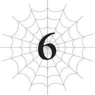

# Chương 6: Nhện vs Ma Vương vs Anh hùng
*(Spider vs Demon Lord vs Hero)*

---

Khôngggg!

Sao chuyện này lại xảy ra cơ chứ?!

Trước mắt tôi chính là kẻ thù truyền kiếp của mình, Ma Vương.

Cô ta hiện đang tấn công tôi dồn dập ngay giữa chiến trường hỗn loạn ngập tràn tiếng la hét và sự hủy diệt.

Giờ đây chẳng còn ranh giới phân biệt giữa quân Sariella và binh lính Liên minh Ohts nữa. Cuộc đọ sức giữa tôi với Ma Vương đã đẩy toàn bộ cục diện vào một mớ hỗn độn.

Trận chiến ư?

Ừ thì, gọi thế cũng được đi.

Dù tôi hoàn toàn ở thế phòng thủ, nhưng ít nhất tôi vẫn đang trụ vững.

Lần đầu tiên chạm trán, tôi đã bị thổi bay thành tro bụi chỉ bằng một đòn duy nhất, nhưng kể từ khi hấp thụ sức mạnh của Mẹ, các chỉ số của tôi đã tăng lên đến mức điên rồ.

Tôi sẽ không bị tiêu diệt hoàn toàn một cách dễ dàng như lần trước đâu!

Mặc dù tôi vẫn đang phải còng lưng ra phòng thủ!

Tôi bắn một tia [Quang ma pháp] đơn lẻ về phía Ma Vương.

Bản thân cô ta đã kích hoạt [Thần Long Mạc] bao phủ khắp khu vực này rồi, nên tôi không thể thi triển bất kỳ thuật thức ma pháp phức tạp nào.

Đồng nghĩa với việc tôi không thể dùng phép [Dịch chuyển], và ngay cả việc sử dụng ma pháp tấn công mạnh mẽ hơn thế này cũng vô cùng khó khăn.

Tất cả những gì tôi có thể thực hiện lúc này chỉ là những đòn tấn công bắn phát một đơn giản.

Và vì các chỉ số kháng tính cực cao của Ma Vương có thể vô hiệu hóa hầu hết các thuộc tính, nên chúng vốn chẳng hề hấn gì đối với cô ta cả.

Hy vọng duy nhất của tôi là dòng ma pháp thuộc hệ Quang mà tôi đã học được khi đi chữa bệnh dạo quanh thị trấn lúc trước.

Nhưng ngay cả khi đạn [Quang ma pháp] của tôi bắn trúng đích, chúng cũng chỉ gây ra vỏn vẹn 1 sát thương, và lượng máu đó lại được cô ta phục hồi gần như ngay lập tức!

--- PAGE BREAK ---

### --- TRANG 129 ---

Ma Vương cứ thế lao thẳng về phía tôi, phớt lờ hoàn toàn những tia [Quang ma pháp] đang bắn vào người mình, vậy nên tôi dựng lên một bức tường bằng [Thổ ma pháp] để cầm chân cô ta.

Vì loại ma pháp này tác động lên nền đất chứ không nhắm vào đối thủ, nên ngay cả [Thần Long Mạc] cũng gặp khó khăn trong việc ngăn chặn nó.

Một bức tường đất nhô lên chắn ngang đà lao tới của Ma Vương.

Thế nhưng, bức tường đó biến mất kèm theo một tiếng nhai răng rắc.

Ma Vương vẫn tiếp tục di chuyển, miệng nhai nhóp nhép cái gì đó trông thấy rõ.

Sau đó cô ta nuốt chửng nó cái ực, và thanh thể lực SP của cô ta lại được hồi phục.

Thôi thế là đủ rồi đấy nhé!

Bất kể tôi có làm gì hay không làm gì, kết cục cũng chỉ biến thành nguồn hồi phục SP cho Ma Vương mà thôi!

Nguyên nhân của điều này là do hiệu ứng hoàn toàn lỗi của một trong những kỹ năng của Ma Vương: [Bạo Thực].

`<[Bạo Thực]: n% sức mạnh để đạt tới thần giới. Cho phép người sử dụng ăn bất cứ thứ gì và tích trữ nó dưới dạng năng lượng thuần khiết. Ngoài ra, người sử dụng sẽ nhận được khả năng vượt qua hệ thống W và can thiệp vào trường MA.>`

`<[Kẻ Thống Trị Bạo Thực]: Nhận được kỹ năng [Vận May Cấp 1] [Thăng Hoa]. Điều kiện đạt được: Sở hữu kỹ năng [Bạo Thực]. Hiệu quả: Tăng HP, MP, và SP + hiệu chỉnh độ thuần thục kỹ năng sức mạnh. Cấp đặc quyền kẻ thống trị. Mô tả: Danh hiệu dành cho kẻ đã chinh phục bạo thực.>`

Nói một cách đơn giản, Ma Vương có thể ăn theo đúng nghĩa đen là bất cứ thứ gì.

Từ đất cát cho đến mọi thứ có thực thể vật lý.

Không, thậm chí cô ta còn ăn được cả những thứ vô hình như ma pháp nữa kìa!

Tôi kích hoạt [Long Mạc] để chống lại [Thần Long Mạc] của Ma Vương.

Tôi đã hy vọng việc này có thể phần nào vô hiệu hóa [Thần Long Mạc] của cô ta để tôi có thể sử dụng ma pháp bình thường, nhưng vô ích.

Thứ nhất, kết giới của tôi không mạnh bằng của Ma Vương, và thứ hai, Ma Vương có thể ăn luôn kết giới của tôi.

Cô ta có thể tiêu hóa cả những thứ không có hình dạng vật lý và hấp thụ chúng thành sức mạnh của riêng mình.

Xét đến việc cô ta đã sở hữu các chỉ số ở đẳng cấp cheat code, việc bổ sung thêm kỹ năng lỗi game này khiến cô ta gần như bất bại.

Tôi chịu chết chẳng nghĩ ra cách nào để đấu lại nổi!

Khốn kiếp!

Làm sao tôi có thể chiến đấu với con quái vật này đây?!

--- PAGE BREAK ---

### --- TRANG 130 ---

Ma Vương vung tay, nện thẳng vào người tôi.

Hự?!

Có chất lỏng gì đó đang phun ra từ miệng tôi kìa!

Là máu đấy, đồ ngốc ạ!

Tôi bị đánh bay đi với tốc độ nhanh đến mức nực cười và lăn lông lốc trên mặt đất, cuốn phăng theo đám binh lính trên đường đi.

Những người lính không may nằm trên đường lăn của tôi đều bị nghiền nát thành thịt băm.

Nếu phòng thủ của tôi thấp hơn, có lẽ kết cục của tôi cũng chẳng khá khẩm hơn họ là bao.

Đúng là có chỉ số cao vẫn là tuyệt nhất.

Nhưng tôi chẳng còn thời gian để mà tấm tắc khen ngợi các chỉ số cao của mình nữa.

Đuổi theo hướng tôi đang lăn đi, Ma Vương từ trên trời lao xuống.

Tôi vội vàng né tránh đôi chân cô ta khi đáp xuống, nhưng vụ nổ tạo ra từ cú va chạm mặt đất của cô ta lại thổi bay tôi đi một lần nữa.

Đúng vậy đấy. Cô ta đạp chân xuống đất mạnh đến mức tạo ra một vụ nổ lớn.

Nói thật, chính tôi cũng chẳng hiểu nổi cái kiểu gì nữa.

Xin lỗi nhé Ma Vương tiểu thư, cô có chắc là mình không đi nhầm truyện không thế?

Bởi vì đối với tôi, có vẻ như một nhân vật bước ra từ một bộ manga shonen lạm phát sức mạnh điên cuồng nào đó đã đi lạc vào thế giới fantasy này rồi.

Tôi lồm cồm bò ra khỏi cái hố sâu hoắm do Ma Vương tạo ra.

Binh lính từ cả hai phe đang tháo chạy toán loạn khắp nơi, cuộc chiến của họ về cơ bản đã bị bỏ dở hoàn toàn.

Nói nghiêm túc thì, sao mọi chuyện lại thành ra thế này?!

Thực ra, lý do duy nhất giúp tôi sống sót sau đống sát thương đã nhận là nhờ những người xung quanh.

Có vẻ như tôi đang nhận được điểm kinh nghiệm từ những kẻ bị chết do dư chấn từ đòn đánh.

Nhờ vậy mà tôi có thể lên cấp và hồi phục hoàn toàn.

Xin lỗi nhé các chú lính mà tôi còn chẳng biết tên!

Cái chết của các anh chính là lý do giúp tôi được sống tiếp đấy!

Cảm ơn nhiều nha!

Nhưng đáng tiếc là, quá trình lột xác và hồi phục sau khi lên cấp của tôi không còn hoàn hảo nữa.

Vì chỉ số của tôi hiện tại đã quá cao, nên nó không thể hồi máu hoàn toàn cho tôi nữa, và mỗi lần lột da là tôi lại bị vướng víu mất vài giây.

Vả lại, số người xung quanh cũng đang ngày một thưa dần vì những lý do hiển

--- PAGE BREAK ---

### --- TRANG 131 ---

nhiên.

Cứ đà này, sự hồi phục khi lên cấp sẽ không thể bắt kịp lượng sát thương nhận vào, và tôi chắc chắn sẽ thua.

Tôi phải tìm cách trốn thoát trước khi chuyện đó xảy ra!

“Ta sẽ là đối thủ của ngươi, con quái vật kia!”

Một giọng nam dũng cảm nhưng vô cùng non nớt lọt vào tai tôi.

Thú thật, tôi chẳng rảnh mà để tâm đến chuyện này đâu, nhưng tôi vẫn không cưỡng lại được mà liếc mắt nhìn xem kẻ nào đang nói.

Thế rồi tôi phải ngoảnh lại nhìn kỹ lần nữa.

Ủa, sao lại có một đứa con nít ở đây thế này?

Đó là một đứa trẻ thực sự, ăn mặc khá sang trọng và trông hoàn toàn lạc quẻ giữa chiến trường này.

Cậu bé vừa run rẩy đứng chắn trước mặt tôi, tay lăm lăm thanh kiếm.

Hả? Chính xác thì chuyện gì đang diễn ra thế này?

Ai đó làm ơn giải thích giùm đi!

“Anh hùng?”

Thật kỳ lạ, kẻ lên tiếng giải đáp thắc mắc thầm kín của tôi lại chính là Ma Vương.

Cô ta đang nhìn chằm chằm vào cậu bé đó.

Đờ người ra, tôi liền Thẩm định đứa trẻ.

Và quả nhiên, trước sự ngạc nhiên tột độ của tôi, cậu nhóc thực sự là một anh hùng.

`<Chủng tộc: Con người Cấp 14 Tên: Julius Zagan Analeit>`

| Chỉ số | Giá trị |
| :--- | :--- |
| **HP** | 476/476 (lục) (chi tiết) |
| **MP** | 497/497 (lam) (chi tiết) |
| **SP (vàng)** | 455/455 (chi tiết) |
| **SP (đỏ)** | 401/455 (chi tiết) |
| **Sức tấn công trung bình** | 469 (chi tiết) |
| **Sức phòng ngự trung bình** | 465 (chi tiết) |
| **Sức ma pháp trung bình** | 488 (chi tiết) |
| **Khả năng kháng tính trung bình** | 476 (chi tiết) |
| **Tốc độ trung bình** | 435 (chi tiết) |

**Kỹ năng:**
[Cảm nhận Ma lực Cấp 10] [Thao tác Ma lực Tỉ mỉ Cấp 1] [Ma đấu pháp Cấp 9] [Truyền Ma Lực Cấp 8] [Siêu công kích Ma lực Cấp 1] [Tự hồi phục MP nhanh Cấp 1] [Giảm tiêu hao MP Cấp 1] [Kiếm thuật Cấp 7] [Tăng cường Hủy diệt Cấp 6] [Tăng cường Cắt Cấp 2] [Tăng cường Va chạm Cấp 1] [Ý chí chiến đấu Cấp 4] [Truyền Năng lượng Cấp 2] [Tập trung Cấp 9] [Đánh trúng Cấp 5] [Né tránh Cấp 5] [Quang ma pháp Cấp 10] [Thánh Quang Ma Pháp Cấp 1] [Tăng cường Thị giác Cấp 9] [Tăng cường Thính giác Cấp 8] [Tăng cường Khứu giác Cấp 6] [Tăng cường Vị giác Cấp 2] [Tăng cường Xúc giác Cấp 5] [Sinh mệnh Cấp 9] [Ma Lượng Tích Trữ Cấp 2] [Bộc phát lực Cấp 8] [Bền Bỉ Cấp 8] [Sức mạnh Cấp 9] [Cứng cáp Cấp 9] [Tu sĩ Cấp 2] [Hộ Phù Cấp 1] [Chạy Cấp 7] [Anh hùng Cấp 3]

--- PAGE BREAK ---

### --- TRANG 132 ---

Hết Ma Vương rồi giờ lại đến Anh hùng xuất hiện là sao?!

Khoan đã, nhưng có phải do tôi hoang tưởng không, chứ các chỉ số của cậu nhóc này trông yếu xìu vậy?

Tôi đoán đối với một đứa con nít thì thế này có lẽ là khá lắm rồi, nhưng vẫn thế thôi.

Mà thực ra, chỉ số của cậu ta vẫn vượt trội hơn hẳn so với hầu hết binh lính ở đây.

Cơ mà cũng chỉ đến thế mà thôi.

Có lẽ do vẫn còn là trẻ con nên cậu ta chưa học được nhiều kỹ năng chăng?

Được rồi, bây giờ không phải là lúc rảnh rỗi đứng đây phân tích mấy cái này!

Ma Vương đang làm gì vậy?

Hử? Trông cô ta có vẻ đang đề phòng cậu nhóc Anh hùng kia kìa?

Tại sao chứ?

Một tình thế đối đầu tay ba gượng gạo diễn ra, khi cả cậu nhóc Anh hùng, Ma Vương và tôi đều đứng chôn chân tại chỗ.

Tôi không hiểu vì sao Ma Vương lại lo lắng về cậu nhóc này như vậy.

Âm thầm khởi động Giáo sư Trí Tuệ, tôi thực hiện một tìm kiếm cho từ khóa “Anh hùng”.

`<[Anh hùng]: Hiệu ứng ẩn của danh hiệu, tạm thời ban khả năng đánh bại Ma Vương.>`

A haaa!

Đây đúng là kiểu lỗ hổng hệ thống mà tôi thích thấy đây!

Hóa ra Ma Vương quá dè chừng hiệu ứng ẩn này nên mới không dám động thủ với cậu nhóc Anh hùng!

Tôi không nghĩ “khả năng đánh bại” có nghĩa là chắc chắn thắng, nhưng ít ra thì bây giờ tôi đã có một quân bài để đối phó với Ma Vương rồi!

--- PAGE BREAK ---

### --- TRANG 133 ---

Các chỉ số của cậu nhóc Anh hùng đúng là thảm hại khi so sánh với tôi, chứ chưa thèm nói đến Ma Vương.

Thế nhưng, Ma Vương chắc chắn đang e ngại hiệu ứng ẩn kỳ lạ này của Anh hùng.

Liệu tôi có thể lợi dụng điều đó để cải thiện tình hình hiện tại theo cách nào đó không nhỉ?

Trong lúc tôi đang vắt óc suy nghĩ xem nên làm thế nào, tình thế đối đầu vẫn tiếp diễn.

Thứ cuối cùng phá vỡ thế bế tắc này không phải do tôi, Ma Vương, hay thậm chí là cậu nhóc Anh hùng.

Không, đó là một quả cầu lửa khổng lồ đang từ trên trời rơi xuống.

Tôi không biết quân đội của phe nào đã phóng nó ra, nhưng bộ họ đang định tiêu diệt cả ba chúng tôi cùng một lúc hay sao vậy?!

Tất nhiên, một phép thuật như thế không đời nào xuyên qua được [Thần Long Mạc] của Ma Vương rồi.

Nhưng cậu nhóc Anh hùng thì không biết điều đó, nên cậu ta chỉ biết kinh hoàng ngước nhìn ngọn lửa đang lao xuống.

Ma Vương lập tức chớp lấy thời cơ đó để hành động.

Cụ thể là, cô ta bắt đầu niệm một phép thuật nhắm vào tôi.

Tiêu rồi!

Phép thuật đó cực kỳ nguy hiểm!

Ma pháp mà cô ta đang thi triển là [Ma pháp Vực sâu].

Thứ ma pháp có thể tiêu diệt cả linh hồn.

[Ma pháp Vực sâu] không phải là ma pháp tấn công thông thường.

Nó cũng có một hiệu ứng ẩn: phân hủy linh hồn.

Đó là ma pháp hành quyết tối thượng, nghiền nát linh hồn thành từng mảnh vụn cho đến khi không thể đầu thai được nữa.

Nếu trúng đòn đó, ngay cả kỹ năng [Bất tử] cũng không cứu nổi tôi khi linh hồn đã bị hủy diệt hoàn toàn.

Nhưng tôi không còn đủ thời gian để chạy trốn nữa.

Đành liều mạng vậy, tôi quyết định đánh một canh bạc sinh tử.

[Ma pháp Vực sâu] của Ma Vương kích hoạt, và một thứ trông giống như toàn bộ bóng tối của thế giới ngưng tụ lại một điểm lao thẳng về phía tôi.

Không thể né tránh, cơ thể tôi bị nuốt chửng hoàn toàn trong màn đêm tăm tối và phân hủy rã rời mà chẳng thể kháng cự nổi lấy một chút nào.

---

[◀ Chương trước: Đoạn phụ: Ma Vương và Quản trị viên](interlude_the_demon_lord_and_the_administrator.md) | [Chương tiếp theo: Chương S6: Cuộc hội ngộ kinh hoàng ▶](s6_a_terrible_reunion.md)
