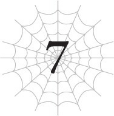

# Chương 7: Hồi sinh
*(Resurrection)*

---

---

Gwaaaaah!

Gào thét vô nghĩa trong tâm trí, tôi đập vỡ lớp vỏ trứng trước mặt.

Cơ thể tôi chuyển động thật vụng về và yếu ớt.

Ngay cả việc phá vỡ lớp vỏ mỏng manh này cũng tốn kha khá thời gian.

Cuối cùng, tôi cũng thành công nứt vỏ chui ra ngoài.

Nhìn quanh, bao bọc tôi là những thứ trông giống như trứng.

Cùng loại với quả trứng tôi vừa chui ra.

Cảnh tượng này chắc chắn rất giống lúc tôi mới đầu thai vào thế giới này, nhưng những quả trứng xung quanh tôi vẫn chưa nở.

Tuy nhiên, chúng đang lắc lư nhẹ, có lẽ cũng sắp nở rồi.

Hiện tại tôi đang ở đâu? À thì, nơi nào đó nằm giữa Tầng trung và Tầng trên của [Mê cung Lớn Elroe].

Nói cách khác, chính là nơi căn nhà cũ của tôi từng tọa lạc.

Mẹ biết vị trí này, nghĩa là nếu Ma Vương cũng biết thì cũng chẳng có gì đáng ngạc nhiên, nhưng đây là nơi đầu tiên hiện lên trong đầu tôi như một điểm thoát thân khẩn cấp.

Dù sao thì, ký ức của tôi về nơi này cũng khá sâu đậm.

Nếu các anh đang thắc mắc làm thế nào tôi thoát khỏi [Ma pháp Vực sâu] của Ma Vương, nói ngắn gọn là tôi đã bỏ lại cơ thể của mình và tái sinh.

Giải thích thế vẫn chưa thỏa đáng ư?

Vâng, tôi biết. Nhưng chuyện đã xảy ra đúng là như vậy đấy.

Để giải thích chi tiết hơn, tôi đã sử dụng kỹ năng [Đẻ Trứng] nhận được từ Mẹ cách đây không lâu.

Đúng như tên gọi, nó rõ ràng cho phép tôi đẻ trứng. Và khi trứng nở, tôi có thể bắt lũ con làm việc dưới tư cách là quyến thuộc của mình.

Tôi đã thử nghiệm nó ngay lập tức, nhưng các anh biết đấy, chúng vẫn chỉ là những quả trứng.

--- PAGE BREAK ---

Phải mất một thời gian chúng mới nở được.

Tôi đã để lại đống trứng sản xuất hàng loạt này ở một khu vực hy vọng là an toàn, chính là căn cứ hoạt động cũ của tôi trong [Mê cung Lớn Elroe].

Điểm đặc biệt của kỹ năng này là, như các anh có thể đoán từ việc tôi tự đẻ trứng một mình, nó thực chất giống như đang tạo ra những bản thể nhỏ của tôi hơn là sinh con đẻ cái.

Về cơ bản, nó là một kỹ năng tạo ra các bản sao hạ cấp của chính mình với tâm trí độc lập.

Tuy nhiên, xét đến việc lũ con của Mẹ đều là [Tiểu Taratect Thứ cấp], tôi nghĩ chúng hơi bị hạ cấp quá mức rồi.

Lúc ấy tôi suy luận là, nếu kỹ năng này có thể tạo ra các bản sao hạ cấp của tôi, vậy chẳng phải nghĩa là tôi có thể cấy [Phân thân Tư duy] của mình vào chúng sao?

Đó chắc chắn không phải là cách sử dụng vốn có của kỹ năng này, nhưng khi nói đến [Phân thân Tư duy], tôi thường vận hành vượt xaaaaaaaa khuôn khổ định sẵn.

Tôi nghĩ cũng đáng để thử cho biết.

Nói thật lòng, những [Phân thân Tư duy] hiện tại của tôi đã bắt đầu xuất hiện những bất đồng quan điểm với bản thể gốc (tức là tôi), có lẽ đây là tác động từ việc ăn linh hồn của Mẹ.

Ý tôi là, cho đến trước lúc đó, về cơ bản nó giống như có một lũ tôi ở trong đầu vậy.

Chuyện này đối với một người bình thường có lẽ rất khó hình dung, nhưng tôi cũng chẳng biết giải thích thế nào khác nữa.

Nhưng giờ đây, những [Phân thân Tư duy] đã khác đi rồi.

Cảm giác như có những kẻ khác đang ở trong tôi vậy, thật không mấy dễ chịu.

Nếu có thể, tôi cũng không ngại tống khứ chúng đi đâu.

Tôi có thể giải quyết chuyện đó bằng cách tắt kỹ năng [Phân thân Tư duy], nhưng làm thế cơ bản chẳng khác nào giết chết các [Phân thân Tư duy] của mình, điều đó khiến tôi cảm thấy hơi tội lỗi.

Hơn nữa, nếu tắt nó đi, rất có thể chính tôi cũng sẽ bị khuất phục trước sự ảnh hưởng từ bên ngoài đó.

Tôi tuyệt đối không muốn vậy.

Thế nên tôi đã quyết định cấy các [Phân thân Tư duy] của mình vào vài quả trứng sắp nở này.

Hãy xem này, ngay khi chúng nở ra, linh hồn của chúng tôi sẽ được kết nối nhờ [Điều khiển Đồng loại].

Tôi đoán khả năng này khá khả thi.

--- PAGE BREAK ---

Nhưng trước khi kịp thử nghiệm, cuộc chiến đó đã nổ ra.

Bản thân cuộc chiến thì không nói, nhưng tại sao Ma Vương lại phải xuất hiện ngay đúng khoảnh khắc đó chứ?

Thật không thể tin nổi.

Vì vậy, khi có vẻ như Ma Vương sắp giết tôi đến nơi, một bóng đèn bỗng lóe lên trong đầu tôi.

Nếu tôi có thể cấy [Phân thân Tư duy] của mình, chẳng lẽ tôi lại không thể cấy chính mình đi cùng chúng sao?

Cấy ghép một phần hay cấy ghép toàn bộ thì cũng đâu có khác biệt gì mấy, đúng không?

Trong trường hợp đó, nếu tôi chuyển toàn bộ ý thức của mình đi, chẳng phải nghĩa là tôi có thể trốn thoát sao?

Thế là tôi liền thử nghiệm, và bùm, tôi đã được tái sinh.

Không còn nghi ngờ gì nữa, [Ma pháp Vực sâu] của Ma Vương chắc chắn đã làm bốc hơi cơ thể gốc của tôi.

Nhưng đoán xem! Ý thức của tôi vẫn sống sót trong một cơ thể hoàn toàn khác!

Hắc hắc hắc.

Giữa kỹ năng [Bất tử] và kỹ thuật hồi sinh bằng trứng này, cả thể xác lẫn linh hồn của tôi đều là bất hoại!

Ha ha ha! Giờ thì đố ai giết được tôi đấy!

À thì, ngoại trừ việc tôi bị mất cảnh giác và ăn trọn một đòn [Ma pháp Vực sâu] hay gì đó tương tự.

Thế nên tốt nhất tôi không nên quá kiêu ngạo.

Hù, hú hồn.

May mà chiêu này thành công dù tôi còn chưa thèm thử nghiệm trước. Nếu không, lần đó tôi đã thực sự đi chầu ông bà rồi.

Eo ơi, nghĩ lại vẫn thấy nổi da gà.

Vậy giờ tôi phải làm gì đây?

Trước tiên, tốt hơn hết tôi nên kiểm tra xem cơ thể hiện tại của mình thế nào đã.

Ngay lúc này, tôi chỉ là một con nhện con mới chào đời, mới toanh vừa đập hộp.

Kết quả là, cơ thể này nhỏ hơn rất nhiều so với cơ thể cũ.

Tôi đang nói đến kích thước của một con nhện tarantula ở Trái Đất ấy, đủ nhỏ để nằm gọn trong lòng bàn tay con người.

Tôi đoán đó là vì cơ thể cũ của tôi không thể đẻ ra những quả trứng khổng lồ như Mẹ được.

Về mặt lý thuyết mà nói, đẻ ra những quả trứng to gần bằng chính mình là điều bất khả thi.

Cho dù thế giới này có phép thuật và đủ thứ đi chăng nữa, thì các quy luật vật lý cũng không tự dưng biến mất được.

--- PAGE BREAK ---

Kết quả là, những quả trứng tôi đẻ ra cũng không lớn hơn trứng gà là mấy.

Nhỏ hơn trứng đà điểu chăng?

Thế nên cơ thể của tôi có kích thước tương đương cũng là điều hợp lý, vì tôi vừa mới nở ra từ một trong số những quả trứng đó mà.

Vậy chỉ số của tôi trông thế nào đây?

Phụt?!

Tôi không khỏi phun cả nước bọt khi nhìn vào chỉ số của mình thông qua [Thẩm định].

Tất cả chỉ số của tôi đều ở mức 3.

3.

Không có nếu, và, hay nhưng gì cả. Chỉ duy nhất con số 3 tròn trĩnh.

May thay, các chỉ số gốc của tôi vẫn được liệt kê dưới dạng giá trị tối đa, kèm theo một dòng ghi chú bên cạnh trạng thái rằng chúng hiện đang bị suy giảm.

Điều đó có nghĩa là chỉ số của tôi bị giảm tạm thời do thay đổi cơ thể sao?

Các kỹ năng của tôi vẫn giữ nguyên, nhưng tôi chắc chắn không thể chiến đấu trong tình trạng này được.

Chà, thế này thì không ổn rồi.

Làm sao tôi có thể kiếm được thức ăn trong tình trạng này đây?

Tôi đúng là có vài nhu yếu phẩm dự trữ trong [Lưu trữ Không gian] nhờ [Ma pháp Không gian], nhưng tôi thậm chí còn không có đủ MP để kích hoạt nó.

Ít nhất nếu tôi hồi phục lại được lượng MP tối đa, tôi có thể sử dụng ma pháp trở lại, nhưng tôi hơi lo là mình sẽ chết đói trước khi kịp làm điều đó.

Trong trường hợp xấu nhất, tôi có nên ăn thứ bên trong những quả trứng này không?

Mẹ cũng từng làm vậy, nên về mặt lý thuyết, tôi đoán mình có thể hy sinh một vài đứa con để tự sinh tồn.

Tuy nhiên, chúng ta sẽ để dành phương án đó làm giải pháp cuối cùng.

Vài rồi tôi vẫn còn một lựa chọn khác.

Đúng vậy, tôi vẫn còn một cách.

Nhưng tôi khá chắc chắn đó sẽ là một canh bạc thực sự.

Hãy xem này, cấp độ hiển thị trong kết quả [Thẩm định] của tôi là 50.

Và bên cạnh đó là dấu hiệu cho thấy tôi có thể tiến hóa.

Bước tiến hóa tiếp theo là thứ tôi đã khao khát từ rất lâu rồi: Arachne.

--- PAGE BREAK ---

Tôi thực sự, thực sự rất muốn tiến hóa.

Nhưng khi tiến hóa, nó sẽ tiêu tốn một lượng SP khổng lồ.

Và các anh biết SP hiện tại của tôi là bao nhiêu không?

Đúng rồi đấy: 3.

Tôi có thể dễ dàng chết đói trong quá trình tiến hóa mất.

Một khi tiến hóa hoàn tất, chỉ số của tôi có thể sẽ phục hồi, giúp tôi dùng ma pháp để lấy nhu yếu phẩm ra khỏi [Lưu trữ Không gian], nhưng tôi không biết liệu cơ thể nhỏ bé mỏng manh này có thể sống sót qua đợt tiến hóa ngay từ đầu hay không.

Nên là, vâng, đúng là một canh bạc.

Hừm. Tôi nên làm gì đây?

Nếu tiến hóa thành công, các chỉ số của tôi có lẽ sẽ hồi phục, và mọi vấn đề của tôi sẽ được giải quyết.

Vấn đề là, tôi không biết liệu nó có thành công hay không.

Trời ạ, tôi chẳng biết phải làm sao nữa.

Trong lúc tôi còn đang phân vân lưỡng lự, tôi cảm nhận được một sự dao động trong không khí.

Có ai đó đang cố dịch chuyển đến đây!

Máu trong người tôi như đông cứng lại.

Chẳng lẽ Ma Vương đã đuổi theo tôi sao?

Nếu thế thì tôi tiêu đời nhà ma rồi.

Tôi không thể hồi sinh vào một quả trứng khác nếu tất cả trứng ở đây bị phá hủy.

Lúc đó tôi sẽ thực sự chết thẳng cẳng.

Tôi sẽ bị giết.

Nhưng vượt ngoài dự liệu, kẻ xuất hiện không phải là Ma Vương.

Thay vào đó, một người đàn ông hiện ra từ hư không.

Một cơ thể mảnh khảnh dường như đã hợp nhất với bộ giáp của mình.

Toàn thân được bao phủ từ đầu đến chân bằng một màu đen tuyền.

Tôi mới chỉ gặp người đàn ông hắc ám này duy nhất một lần trước đây.

Tại Tầng trung của [Mê cung Lớn Elroe] sau khi tôi đánh bại hỏa long.

[Quản trị viên Güliedistodiez].

Một trong những vị thần cai trị thế giới này.

“**ật đ** ngạc **iên. Ta **ông n** ngươi c** s**ng.”

Tôi vẫn chưa thể nghe hiểu toàn bộ hoàn toàn, nhưng tôi đã học được một lượng kha khá ngôn ngữ thế giới này rồi.

Tôi có thể tự điền vào những phần còn thiếu bằng trí tưởng tượng của mình.

Anh ta đang nói rằng anh ta ngạc nhiên vì tôi còn sống, đúng không?

A! Phải rồi!

Ma Vương không có [Ma pháp Không gian]!

Nghĩa là cô ta có thể dịch chuyển đến chỗ tôi là nhờ gã này sao?!

--- PAGE BREAK ---

Điều đó đồng nghĩa với việc hắn ta cũng là kẻ thù của tôi!

“K**ông c** ph** c**nh g**c th** th**. H**iện t**i ta k**ông c** ý đ**nh l**m h**i ngươi.”

[Quản trị viên Güliedistodiez]— Ugh, dài dòng quá, cứ gọi anh ta là Güli-güli đi.

Tôi không cảm nhận được bất kỳ ác ý nào từ Güli-güli.

Miễn là anh ta không có ý định giết tôi thì tạm thời có vẻ vẫn ổn, đúng không?

“Ngươi có hiểu ta nói thế này không?”

Đột nhiên, tôi nghe thấy một giọng nói nhỏ nhẹ dường như được truyền trực tiếp vào đầu mình.

Nó hơi giống với [Lời của Thần (tạm gọi)].

Và cũng giống như người bạn [Lời của Thần (tạm gọi)] kia, nó truyền đến tôi bằng tiếng Nhật.

Tôi im lặng gật đầu.

“Ta đã chỉnh sửa một kỹ năng do D tạo ra để thêm chức năng dịch thuật. Bằng cách này, thần giao cách cảm của ta sẽ nghe như ngôn ngữ của ngươi đối với ngươi, và lời nói của ngươi cũng sẽ truyền đến ta bằng ngôn ngữ của ta.”

Hử.

Làm được thế luôn sao?

Có cách nào để luôn bật tính năng dịch thuật này suốt không nhỉ?

“Nhân tiện, ta đang cưỡng ép triển khai chức năng này. Ban đầu nó không phải là một chức năng của kỹ năng này, nên có lẽ sẽ rất khó để ngươi tự mình thực hiện.”

Ồ thế à?

Tiếc thật đấy.

Chà, có lẽ tôi cũng nên bắt đầu hỏi vài câu hỏi.

Tôi cũng muốn thế lắm chứ, nhưng tôi giao tiếp tệ đến mức từ ngữ cứ nghẹn lại chẳng thể thốt ra nổi!

“Ngươi chắc hẳn thấy kỳ lạ. Rằng ta đã gửi Ariel đến chỗ ngươi nhưng giờ đây ta lại đến đây để trò chuyện với ngươi thế này. Hãy để ta bắt đầu bằng việc giải thích.”

Tuyệt vời, cảm ơn nhé.

Anh Güli-güli là nhất đấy, đoán trước được những gì tôi muốn biết ngay cả khi tôi chưa kịp nói ra.

“Ariel và ta là những người bạn cũ, có mối liên kết sâu sắc. Ta đã quyết định sẽ giúp cô ấy một lần duy nhất. D đã ra lệnh cho ta không được can thiệp vào những người tái sinh, nhưng trong trường hợp này ta không trực tiếp làm điều đó.”

Hừm.

Đó chẳng phải là lách luật sao?

Nhưng tôi cũng phần nào hiểu được suy nghĩ của anh, Güli-güli.

--- PAGE BREAK ---

Nếu một người quen của anh gặp rắc rối, dĩ nhiên anh sẽ muốn giúp đỡ họ.

Nhưng lần này, chuyện suýt nữa đã khiến tôi mất mạng đấy!

Tôi sẽ không chỉ tặc lưỡi kiểu “Ồ, thế thì không sao đâu!” được đâu nhé.

“Cơn giận của ngươi là điều dễ hiểu. Vì vậy, dù điều đó không thể bào chữa cho hành động của ta, ta muốn tặng ngươi thứ này.”

Güli-güli đưa tay vào một không gian khác và lôi ra thứ gì đó.

Một thứ siêu to khổng lồ!

Đó là xác chết khổng lồ của một con rồng. Không, thực ra là vài con luôn.

“Những con rồng này đã chiến đấu vì lợi ích của ngươi. Ta chắc chắn rằng chúng cũng sẽ cảm thấy vinh dự khi được hiến dâng xương thịt của mình cho ngươi.”

Có một thoáng buồn rầu hiện lên trong đôi mắt của Güli-güli.

Tôi thực sự không biết anh đang nói về chuyện gì, nhưng điều đó nghĩa là tôi có thể ăn những thứ này, đúng không?

“Đây là lần cuối cùng ta giúp đỡ Ariel. Kể từ giờ trở đi, ta thề sẽ không bao giờ can thiệp vào bất kỳ người tái sinh nào nữa.”

Ồ vậy sao?

Nghe mừng ghê.

Nghĩa là Ma Vương sẽ không tự dưng dịch chuyển đến chỗ tôi nữa.

Hy vọng là chỉ cần tôi theo dõi vị trí của cô ta bằng [tính năng đánh dấu] của [Giáo sư Trí Tuệ], cô ta sẽ không thể đánh úp tôi thêm lần nào nữa.

“Đây là hành động thể hiện thiện chí của cá nhân ta, cũng như là lời tạ lỗi đối với những rắc rối ta đã gây ra cho ngươi.”

Hừm. Thành thật mà nói, xét đến những gì tôi đã mất mát, tôi không thực sự chắc món này có thể bù đắp được hết hay không, nhưng thôi kệ đi.

Tôi cũng không muốn đòi hỏi thêm để chuốc lấy rắc rối làm gì.

“Ngoài ra, ta có một yêu cầu ích kỷ.”

Hửm?

“Liệu có cách nào ta có thể thuyết phục ngươi ngừng can thiệp vào Ariel không?”

Hử?

Can thiệp vào Ma Vương?

Tôi đâu có làm chuyện đó, đúng không?

Đối với tôi, bây giờ Mẹ đã chết, mối liên kết giữa chúng tôi đã bị cắt đứt, và chúng tôi không cần phải làm phiền nhau nữa.

“Ta biết mình đang đưa ra một yêu cầu quá đáng. Nếu ngươi muốn từ chối yêu cầu của ta, ta sẽ không ép buộc thêm.”

--- PAGE BREAK ---

Tôi, ơ, cái gì cơ?

Can thiệp vào Ma Vương, can thiệp, can thiệp...

A!

Lẽ nào là do nó đứng sau chuyện này sao?!

[Phân thân Tư duy] từng là não thể xác cũ của tôi!

Phải rồi! Nó đã chuyển sang tấn công Ma Vương!

Tôi hoàn toàn quên béng mất chuyện đó!

Ma Vương đột ngột xuất hiện khi tôi đang hạ gục Mẹ.

Để đối phó với cô ta, một trong những [Phân thân Tư duy] của tôi đã đi qua để bắt đầu tấn công trực tiếp vào linh hồn của Ma Vương.

Đó chính là não thể xác cũ.

Nhưng khi Mẹ chết, mối liên kết giữa Mẹ và tôi đã biến mất.

Kết quả là, mối kết nối mà tôi có với Ma Vương thông qua Mẹ cũng bị đứt, nghĩa là [Phân thân Tư duy] được cử đến chỗ Ma Vương không thể quay trở lại với tôi được nữa.

Tôi thậm chí còn không thể liên lạc với não thể xác cũ. Nó hoàn toàn bị cô lập.

Tôi không hề biết chuyện gì xảy ra với não thể xác cũ sau đó, nhưng nếu những gì Güli-güli nói là sự thật, thì bấy lâu nay nó đã tự mình chiến đấu kiên cường chống lại Ma Vương.

Thật không thể tin nổi.

Tôi cứ tưởng Ma Vương đuổi cùng giết tận tôi là để trả thù cho việc tôi giết Mẹ, hóa ra cô ta cố giết tôi là vì não thể xác cũ của tôi đã tấn công cô ta suốt thời gian qua!

Nghĩa là tất cả chuyện này đều là lỗi của cưng đấy nhé, não thể xác cũ!

Ốp, kiềm chế lại nào.

Tôi không nên quá giận não thể xác cũ.

Nó đã chiến đấu đến cùng dù đã mất đường về.

Dù sao thì, tôi nên trả lời Güli-güli thế nào đây?

Tốt nhất có lẽ là nên thành thật, thế là tôi làm vậy.

“Tôi không làm được.”

Đó là sự thật. Tôi thực sự không thể.

Tôi thậm chí còn không liên lạc được với não thể xác cũ, chứ đừng nói là mang nó trở lại.

Thế nên tôi có muốn cũng không thể ngăn cản sự can thiệp của nó từ nơi này được.

Tôi cố gắng truyền đạt điều này cho Güli-güli, dù có hơi lộn xộn.

--- PAGE BREAK ---

Xin lỗi vì tôi đã mất quá nhiều thời gian để giải thích.

Chỉ là tôi thực sự rất dở khoản ăn nói với người khác.

“Ta hiểu rồi. Vậy là ta đã đòi hỏi điều bất khả thi ở ngươi trong khi không rõ sự tình. Ta xin lỗi.”

Không, không sao đâu.

Dù gì anh cũng đã cung cấp cho tôi vài thông tin quý giá trong quá trình này, nên coi như chúng ta hòa nhau đi.

Giờ đây tôi đã có một tia hy vọng nho nhỏ tuyệt vời rằng nếu tôi cứ tiếp tục chạy trốn, biết đâu não thể xác cũ cuối cùng sẽ hạ gục Ma Vương hộ tôi luôn.

“Ta còn một chuyện nữa muốn yêu cầu ngươi.”

Hửm? Gì nữa đây?

“Ta muốn ngươi ngừng can thiệp vào con người kể từ thời điểm này. Nếu có thể, xin hãy sống yên lặng ở một nơi bí mật từ bây giờ.”

Cái gì cơ?

“D đã cho ta bản tóm tắt tình hình của ngươi. Ta muốn gửi lời xin lỗi vì ngươi đã bị kéo vào hoàn cảnh ngặt nghèo của thế giới này. Ta xin lỗi. Ta cũng yêu cầu ngươi không được can thiệp vào thế giới này thêm nữa. Ta biết rất rõ đây là một yêu cầu bất lịch sự. Nhưng hiện tại, ngươi đã là một trong những sinh vật mạnh mẽ nhất thế giới này. Mỗi hành động ngươi thực hiện đều mang lại một làn sóng hậu quả quá lớn để có thể ngó lơ. Nó đe dọa sẽ nhấn chìm thế giới này vào hỗn loạn. Một lần nữa, ta biết đây là một yêu cầu lớn đối với ngươi. Nhưng liệu ngươi có thể cân nhắc nó không?”

Tôi có thể nhận ra Güli-güli đang vô cùng chân thành.

“Ta có thể nghe câu trả lời của ngươi chứ?”

Hừm.

Vì anh ta đã thẳng thắn như thế, tôi cũng nên phản hồi với sự chân thành tương tự.

“Xin lỗi, nhưng không.”

Tôi ghét việc phải thô lỗ với Güli-güli, nhưng tôi không thể đồng ý với điều đó.

Ý tôi là, về cơ bản anh ta đang yêu cầu tôi mặc kệ cư dân thế giới này xử lý mọi việc, còn tôi thì chỉ việc trốn tiệt vào một cái hang nào đó.

Nhưng con người ở thế giới này quá thảm hại để tự mình gánh vác bất kỳ việc gì, đó là lý do tại sao nó đang trên bờ vực hủy diệt.

Rõ ràng, không thể tin tưởng giao phó mọi chuyện cho bọn họ tự giải quyết từ nay về sau được.

Hiện tại tôi có thể đang bận rộn đối phó với Ma Vương, nhưng tôi cũng có kế hoạch hành động của riêng mình.

Thế nên, việc tôi đầu hàng và trốn biệt đi là điều không tưởng.

--- PAGE BREAK ---

“Ngươi sẽ không cân nhắc lại chứ?”

Với vẻ mặt đăm chiêu, Güli-güli dường như đang đưa ra xác nhận cuối cùng.

Tôi im lặng lắc đầu.

“Ta hiểu rồi.”

Güli-güli ngước nhìn lên bầu trời.

“Dưới góc nhìn của một kẻ đến từ thế giới khác, những gì ta đang làm trông có nực cười đối với ngươi không?”

Hắn ta cau mày hỏi qua thần giao cách cảm.

Vẻ mặt của hắn giống như một người đàn ông kiệt quệ và đau khổ, nhưng dù vậy vẫn quyết tâm tiếp tục tiến bước.

Tôi thực sự không thể trả lời câu hỏi đó của anh ta.

Dù sao thì, đó cũng là việc riêng của anh ta thôi.

Nhưng tôi có thể nói thế này.

“Anh cứ làm bất cứ điều gì anh cảm thấy là tốt nhất đi.”

Cuối cùng thì mọi chuyện cũng chỉ có vậy.

Bạn phải tiếp tục tiến lên trên con đường mà mình tin tưởng.

Đó là tất cả những gì tôi thực sự có thể nói cho một câu hỏi không có đáp án đúng.

“Ta hiểu rồi. Có lẽ ngươi nói đúng.”

Güli-güli trông hơi ngạc nhiên, rồi gật đầu.

“Vậy thì ta sẽ làm những gì ta cho là tốt nhất. Dù vậy, D cũng có phần trong các hành động của ngươi. Trước mắt, ta sẽ không làm hại ngươi. Nhưng ngươi nên nhớ kỹ điều này. Nếu hành động của ngươi dẫn đến kết quả đi ngược lại với ta, thì có khả năng ngươi sẽ thấy ta đứng chặn đường đấy.”

Hợp lý.

Nhưng tôi hy vọng chuyện sẽ không diễn ra như vậy.

“Hôm nay công việc của chúng ta đến đây là xong. Tạm biệt.”

Cứ như thế, Güli-güli dịch chuyển biến mất.

---

[◀ Chương trước: Chương S6: Cuộc hội ngộ kinh hoàng](s6_a_terrible_reunion.md) | [Chương tiếp theo: Chương S7: Quỷ nhân nhe nanh ▶](s7_the_ogre_bares_his_fangs.md)
