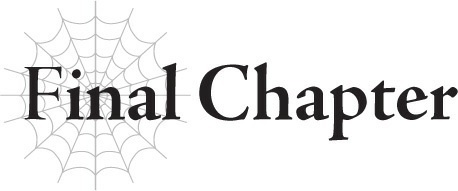

# Chương cuối: Hành trình mới bắt đầu
*(A New Journey Begins)*

Ở phía xa, thị trấn đang rực cháy dữ dội.

Hai ánh mắt chăm chú dõi theo những ngọn lửa.

Đó là Mera và đứa bé ma cà rồng trong vòng tay anh ta.

Đứa bé nhìn thị trấn nơi mình được sinh ra và lớn lên đang bị thiêu rụi hoàn toàn.

Mera cũng vậy, anh đã thề trung thành với cha mẹ của đứa bé ma cà rồng này.

Tôi không cách nào biết được hai người bọn họ đang nghĩ gì khi nhìn thị trấn bốc cháy.

Nhưng tôi nghĩ mình cứ để họ nhìn bao lâu tùy thích.

Ma Vương đang đứng lảng vảng gần đó.

Kẻ thù lâu năm của tôi, người mà tôi đã chọn bắt tay hợp tác cùng.

“Sao thế? Có định trả lời ta không đây?”

Ma Vương cười rạng rỡ.

Nhưng ánh mắt của cô ta thì hoàn toàn không có chút gì là vui vẻ.

Tôi không biết chuyện gì sẽ xảy ra với mình nếu tôi từ chối.

Ma Vương coi tôi như một loài quái vật bất tử vô lý nào đó, nhưng đâu phải tôi thực sự có thể hồi sinh vô hạn.

Cô ta không cần biết chuyện này, nhưng tôi thực sự không chắc liệu kỹ thuật hồi sinh bằng trứng của mình có hoạt động vào lúc này hay không.

Lũ trứng của tôi đều đã nở hết rồi, nên tất cả lũ nhện con đó đang tự do đi lại theo ý chí riêng của chúng.

Liệu tôi có thể cướp xác của một trong những đứa bé đó để hồi sinh cơ thể mình hay không?

Tôi không chắc. Thậm chí tôi cảm thấy khả năng cao là không được.

Có lẽ ban đầu nó hoạt động được chỉ vì con non đó chưa được nở ra,

--- PAGE BREAK ---

nên nó chưa hề hình thành tâm trí hay ý thức riêng cho bản thân.

Điều đó có nghĩa là nếu Ma Vương giết tôi lúc này, tôi có thể sẽ không hồi sinh lại được nữa.

Thế nếu tôi phải chiến đấu với cô ta thì sao?

Tôi sẽ thua, chắc chắn thế.

Nghĩa là con đường đó chỉ dẫn đến ngõ cụt.

A-ha-ha... ha... ha.

Tôi đúng nghĩa là không thể nói lời từ chối!

Nhưng nếu suy nghĩ kỹ lại, đây thực ra không phải là một ý kiến tồi, phải không?

Ma Vương có thể để mắt sát sao tới tôi, kẻ thù không thể giết chết đầy bí ẩn của cô ta.

Còn tôi thì có thể dùng Ma Vương làm vệ sĩ.

Cả hai chúng tôi đều coi đối phương là một mối đe dọa nghiêm trọng, vì vậy việc bắt tay hợp tác sẽ có lợi cho cả hai hơn là tiếp tục chiến đấu chống lại nhau.

Hơn thế nữa, Ma Vương nghĩ rằng tôi hoàn toàn bất tử.

Hy vọng điều đó có nghĩa là cô ta sẽ không mạo hiểm phá vỡ hiệp ước hòa bình bằng cách tấn công tôi lần nữa.

Nói cách khác, Ma Vương sẽ không phản bội tôi.

Dù cho tôi hoàn toàn có thể phản bội cô ta bất cứ lúc nào!

Là do tôi tự tưởng tượng, hay là cái hiệp ước này thực sự đang có lợi cho tôi hơn nhỉ?

Đặc biệt là khi cân nhắc cách cô ta diễn đạt. “Bắt tay hợp tác.”

Tôi không thích ý nghĩ phải làm việc dưới quyền ai đó, nhưng nếu là bắt tay hợp tác, điều đó có nghĩa là chúng tôi đứng trên cương vị bình đẳng.

Tôi sẽ không cần phải lo lắng về việc Ma Vương là kẻ thù đáng sợ nhất của mình nữa.

Cô ta cũng không cần phải tiếp tục chiến đấu với một đối thủ khó lường.

Và cả hai chúng tôi đều có thêm một đồng minh mạnh mẽ và đáng tin cậy.

Đây chẳng phải là tình huống đôi bên cùng có lợi sao?

Trong trường hợp xấu nhất, nếu mọi chuyện không diễn ra suôn sẻ, tôi luôn có thể lợi dụng Ma Vương cho đến khi tìm được cách đánh bại cô ta, rồi sau đó phản bội cô ta.

Mặt khác, cô ta khó lòng phản bội tôi vì cô ta nghĩ tôi bất tử, nên tôi không cần lo lắng về chuyện đó.

Nó chắc chắn hợp lý hơn nhiều so với việc từ chối lời đề nghị của cô ta, quay lại làm kẻ thù và sống cả đời trong cảnh trốn chạy.

Sau khi thực hiện tất cả những tính toán này chỉ trong vài giây, tôi lặng lẽ nắm lấy

--- PAGE BREAK ---

tay Ma Vương.

Sau đó, Mera đi xác nhận số phận của ông chủ và phu nhân của mình.

Vị lãnh chúa và vợ của ông đã bị sát hại trước cả khi tôi lao đến hiện trường.

Potimas đã giết họ.

Mera chắc chắn đã nghi ngờ điều đó, nhưng tôi nghĩ anh ta muốn tự mắt xác nhận.

Nếu không, anh ta có lẽ không thể hoặc không muốn tin vào chuyện đó.

Anh ta ôm chặt đứa bé ma cà rồng vào ngực nhưng che mắt con bé lại khi nhìn vào thi thể của lãnh chúa và phu nhân.

Dĩ nhiên, Mera không biết rằng đứa bé ma cà rồng này là một người tái sinh và đã có ý thức phát triển đầy đủ.

Nhưng hành động ngăn một đứa trẻ nhìn thấy thi thể bị sát hại dã man của cha mẹ vẫn nói lên rất nhiều điều về nhân cách của anh ta.

Cả cách khuôn mặt vốn dĩ luôn nghiêm túc của anh ta méo xệch đi khi anh ta khóc nức nở nữa.

Tiếc là chúng tôi không thể nán lại nơi này quá lâu.

Vì quân đội Ohts đang khép chặt vòng vây quanh dinh thự từ mọi phía.

Ma Vương và tôi có thể dễ dàng quét sạch một đội quân loài người cỏn con mà không cần tốn chút sức lực nào.

Nhưng chúng tôi sẽ không làm thế.

Chẳng có ích lợi gì cả.

Lãnh chúa và phu nhân của dinh thự đã qua đời, và thị trấn hầu như đã bị phá hủy hoàn toàn.

Ngay cả khi chúng tôi tàn sát quân đội của chúng bây giờ thì cũng đã quá muộn.

Trút giận lên bọn chúng chỉ là hành vi bạo lực vô nghĩa.

Vì Ma Vương và tôi không có mối liên kết sâu sắc nào với thị trấn này, nên việc đó thậm chí còn không được coi là trả thù.

Người dân trong thị trấn có thể muốn trả thù Ohts, nhưng với tôi, việc chúng tôi làm thay họ có gì đó không đúng cho lắm.

Thay vào đó, chúng tôi quyết định rút lui.

Cuối cùng, Mera cũng dời mắt khỏi thị trấn đang rực cháy.

--- PAGE BREAK ---

“Xong chưa?”

“Vâng.”

Giọng anh ta run rẩy khi trả lời Ma Vương.

Nhưng đằng sau đó, tôi nghĩ mình cảm nhận được một ý chí không thể bị khuất phục.

“Xin hãy nhận lời cảm ơn của tôi vì sự giúp đỡ của các vị, dù có hơi muộn màng.”

Mera lịch sự cúi đầu chào Ma Vương và tôi.

Nhưng khi anh ta ngẩng đầu lên, trong mắt anh ta có chút nghi ngờ.

“Tôi xin lỗi vì đã hỏi một câu hỏi khiếm nhã như vậy sau khi các vị vừa cứu mạng chúng tôi, nhưng tôi có thể mạn phép hỏi các vị là ai không?”

À, phải rồi.

Chúng tôi có thể đã cứu mạng anh ta, nhưng tôi vẫn là một Arachne nửa người nửa nhện.

And dựa trên màn xuất hiện của cô ta, Ma Vương trông có vẻ còn kỳ quái hơn nữa.

Một Ma Vương Ma Pháp sao? Thôi đi...

Trông mờ ám hết chỗ nói.

Cũng không thể trách anh ta sinh nghi được.

“Ta chính là Ma Vương độc nhất vô nhị, Ariel bằng xương bằng thịt đây. Còn đây là con quái vật nhện mà các ngươi vẫn tôn sùng là Thần Thú cho đến gần đây đấy — hay nói đúng hơn là dạng tiến hóa của nó.”

“Thần Thú sao?!” Mera kinh ngạc nhìn tôi.

Ơ, thế là anh định lờ tịt đi phần giới thiệu cô ta là Ma Vương luôn đấy à?

“Hừm. Thôi nào, ta là Ma Vương ở đây đấy nhé. Bộ ta không xứng đáng nhận được chút tôn trọng nào sao?”

Ma Vương bĩu môi giận dỗi.

Kỳ lạ là trông có vẻ khá trẻ con nhưng cũng rất dễ thương.

“Có lẽ ta nên thể hiện rõ ràng hơn một chút vậy.”

Luồng uy áp đáng sợ của Ma Vương đột ngột tăng mạnh.

Cô ta hẳn đã bật kỹ năng Uy Áp của mình lên.

Nó không có nhiều tác dụng với tôi, nhưng hiệu quả tổng thể thì chắc chắn là cực kỳ ấn tượng.

Toàn thân Mera vã mồ hồ hột.

Vẻ mặt anh ta đông cứng vì sợ hãi.

Nhân tiện, tôi có thể cảm nhận thấy tất cả các sinh vật sống xung quanh chúng tôi đồng loạt bỏ chạy cùng một lúc.

“Ta là một Ma Vương hàng thật giá thật đấy nhé. Ma Vương Ariel là tên của ta. Rất vui được gặp các ngươi.”

--- PAGE BREAK ---

Trời ạ. Khi cô ta ngừng hành xử kỳ quặc thì đúng là một Ma Vương đáng sợ thực sự.

Tôi chắc chắn Mera lúc này cũng đã nhận thức rõ ràng điều đó.

Tôi nghi ngờ trên đời này không có nhiều kẻ có thể tỏa ra luồng uy áp đáng sợ đến mức này.

“Ma Vương... Nhưng... tại sao chứ?”

Anh ta có lẽ muốn hét lên và chạy trốn ngay lập tức, nhưng Mera vẫn đứng chôn chân tại chỗ, ôm chặt đứa bé ma cà rồng để bảo vệ.

Hơn nữa, anh ta còn dám hỏi một câu, dù giọng anh ta có hơi run.

Gã này cũng có gan đấy chứ.

“À thì, chuyện dài lắm, nhưng tóm lại là...”

Rồi Ma Vương giải thích về mối quan hệ giữa chúng tôi.

Cô ta kể cho Mera nghe việc cô ta và tôi từng là kẻ thù cho đến gần đây, và trong lúc cô ta truy đuổi tôi, cô ta thấy kẻ thù truyền kiếp Potimas của mình đang ở đây nên quyết định can thiệp.

“Hắn là kẻ tồi tệ nhất trên đời này đấy. Hễ thấy hắn là ta phải nghiền nát hắn ngay. Nhưng thứ lúc nãy chỉ là một con rối được hắn điều khiển từ xa thôi, nên có phá bao nhiêu lần thì chúng vẫn cứ xuất hiện lại thôi.”

Một thứ kinh tởm như vậy vẫn sẽ tiếp tục xuất hiện lại sao?

Đáng sợ thật.

“Nên thực ra chỉ là tình cờ ta cứu các ngươi thôi. Ta không hề có ý định cứu mạng các ngươi hay gì đâu. Nhưng nàng Nhện này thì chắc là có đấy,” cô ta nói thêm, liếc nhìn tôi đầy ngụ ý.

Nhận thấy điều đó, Mera cũng nhìn về phía tôi.

Ưưư.

Bộ tôi thực sự phải nói chuyện lúc này sao?

Tôi không nghĩ mình có thể giải thích mọi chuyện trôi chảy đâu...

“Phải rồi. Nên tóm lại, ta đoán cô ấy cứu các ngươi vì cô ấy đến từ cùng một nơi với đứa bé mà ngươi đang ôm đấy. Đúng không?”

Thấy tôi im lặng, Ma Vương quyết định nói thay tôi.

Tôi đoán thế cũng tốt, dù tôi không thích việc cô ta tự ý xen vào chuyện của tôi cho lắm.

“Cùng một nơi sao?”

“Đúng thế đấy. Được rồi, đến giờ đặt câu hỏi rồi. Tên em là gì thế, cô bé?”

--- PAGE BREAK ---

Ma Vương cười rạng rỡ khi ghé sát mặt nhìn đứa bé ma cà rồng.

“Thưa ngài Ariel, tiểu thư vẫn chưa biết nói ạ.”

“Ồ, ra vậy, ra vậy. Cái miệng nhỏ vẫn chưa thể mấp máy cử động được nhỉ? Thế thì để ta kết nối với em bằng [Thần giao cách cảm] nhé?”

“Tôi không nghĩ đó là vấn đề...”

“Vấn đề đấy chứ. Vì đứa nhóc này là người đầu thai từ thế giới khác, giống như cô bạn Nhện ở đây này.”

Ma Vương thản nhiên tiết lộ bí mật lớn nhất của đứa bé ma cà rồng và tôi.

“Người tái sinh sao?”

Mera nhíu mày. Anh ta có lẽ không quen thuộc với khái niệm này.

“Này nhé, có một tên ngốc ở thế giới này đã làm chuyện ngu ngốc và gây ra rắc rối cho thế giới khác.”

“Dạ?”

“Cứ nghe đi đã. Tóm lại là có một nhóm trẻ em ở thế giới đó đã chết vì vấn đề của thế giới này. Và vị thần ở đó cảm thấy áy náy, nên đã thu thập linh hồn của những đứa trẻ đã chết đó và đưa chúng sang thế giới này để đầu thai thành những đứa trẻ sơ sinh. Nói cách khác, là người tái sinh.”

“Ra vậy...”

Vẻ mặt của Mera thể hiện rõ ràng anh ta chẳng hiểu Ma Vương đang nói cái quái gì cả.

À thì đúng vậy. Không thể tự dưng ném một câu chuyện điên rồ như thế vào mặt ai đó được.

“Những người tái sinh này được sinh ra cùng với ký ức từ kiếp trước của họ. Và họ cũng nhận được một chút đặc ân nhỏ từ vị thần đó nữa. Ta không chắc có phải vì thế không, nhưng ta khá chắc chắn những kẻ tấn công các ngươi đang nhắm vào những người tái sinh đấy.”

Hửm?

Khoan, thật sao?

Điều đó có nghĩa là gã Elf Potimas đó đang săn lùng những người tái sinh à?

“Xin thứ lỗi, nhưng câu chuyện này thì có liên quan gì đến...?”

“Hửm? Sao ngươi chậm hiểu thế nhỉ. Ta đang bảo đứa bé kia chính là một trong những người tái sinh đó đấy.”

“Hả?!”

“Đúng vậy không, Sophia? Thế nào? Tên kiếp trước của em ở thế giới bên kia là gì?”

Đứa bé ma cà rồng trông rõ ràng là đang bối rối trước những

--- PAGE BREAK ---

câu hỏi của Ma Vương.

“Shouko Negishi.”

Sau một hồi im lặng, con bé tiết lộ tên mình qua thần giao cách cảm.

“Tuyệt vời, có tên rồi nhé! Vậy em thực sự là người tái sinh, lại còn là ma cà rồng nữa chứ! Chà, đúng là rắc rối chồng chất mà. Dù sao thì, cô Nhện đằng kia cũng là người tái sinh, giống như đứa bé này. Nên ta đoán cô ấy đã dõi theo con bé vì cảm giác đồng hương, cố gắng bảo vệ con bé khỏi đống rắc rối đó. Ta nói đúng chứ?” Cô ta lại nhìn tôi lần nữa.

Hửm. Hừm.

Tôi đoán mình cũng có ý bảo vệ con bé, nên cô ta nói thế cũng không hẳn là sai?

Từ chối thì phiền phức lắm, nên tôi chỉ gật đầu xác nhận.

“Được rồi, giờ các ngươi đã nắm rõ toàn bộ tình hình của chúng ta rồi. Đến lượt ta hỏi đây. Tiếp theo các ngươi định làm gì?”

Cả Mera và đứa bé ma cà rồng đều tỏ vẻ bối rối trước câu hỏi của Ma Vương.

Mera có lẽ vẫn còn đang sốc trước tiết lộ rằng tiểu thư ma cà rồng của mình thực chất là một người tái sinh, và tôi nghi ngờ anh ta không biết phải làm gì tiếp theo.

“Nếu hỏi ta, các ngươi có vài lựa chọn ở đây. Thứ nhất, có thể chuyển đến một thị trấn khác ở Sariella. Thứ hai, trốn sang một quốc gia khác. Thứ ba, đến Ohts. Được rồi, cái thứ ba không phải là lựa chọn tốt, nhưng ta thực sự cũng không khuyến khích hai cái đầu tiên đâu.”

Ma Vương thản nhiên tiếp tục.

“Hai người các ngươi giờ đã là ma cà rồng chứ không phải con người nữa rồi. Các ngươi có tưởng tượng nổi việc sinh sống trong xã hội loài người sẽ khó khăn thế nào khi hầu hết mọi người đều coi các ngươi là những sinh vật quái dị bước ra từ truyền thuyết không?”

Thay vì Mera, chính đứa bé ma cà rồng mới là người tái mét mặt mày khi nghe điều đó.

“Merazophis, em xin lỗi. Em đã biến anh thành ma cà rồng. Lúc đó em chỉ có thể nghĩ ra cách đó thôi.”

Đứa bé có vẻ cảm thấy tội lỗi vì đã biến Mera thành ma cà rồng, làm thay đổi cuộc đời anh ta mãi mãi.

Nhưng tôi không nghĩ con bé có nhiều lựa chọn.

Biến anh ta thành ma cà rồng để chiến đấu bảo vệ cả hai là cách duy nhất để họ thoát khỏi tình thế hiểm nghèo đó.

Nếu ở vị trí của con bé, tôi chắc chắn sẽ hút máu Mera để biến anh ta thành ma cà rồng mà không thèm suy nghĩ đến lần thứ hai.

“Xin tiểu thư đừng xin lỗi. Nếu có ai phải làm thế, thì người đó chính là tôi.”

--- PAGE BREAK ---

“Sao cơ? Tại sao chứ?”

“Vì tôi đã không thể bảo vệ được tiểu thư. Tôi vô cùng xin lỗi.”

Mera cúi đầu tạ lỗi với đứa bé ma cà rồng trong tay.

“Hơn nữa, nếu tiểu thư không làm vậy, tôi đã chết rồi. Tôi chỉ có thể biết ơn tiểu thư vì điều đó.”

“Nhưng giờ anh đã là ma cà rồng rồi. Anh không thể sống như một con người được nữa...”

“Không sao cả. Thực tế, như thế này có lẽ lại tốt hơn để tôi có thể bảo vệ tiểu thư tốt hơn.”

“Merazophis... anh vẫn muốn bảo vệ em sao?”

“Lãnh chúa và phu nhân đã tin tưởng giao phó tiểu thư cho tôi, thưa tiểu thư. Vì vậy, tôi sẽ bảo vệ tiểu thư cho đến khi nào tôi còn thở. Dù tiểu thư là ma cà rồng, là người tái sinh hay là bất cứ thứ gì đi nữa, đối với tôi chuyện đó cũng không có gì khác biệt.”

“Merazophis...!”

Trước lời tuyên bố kiên định của Mera, đứa bé ma cà rồng gọi tên anh ta như thể đang dâng trào cảm xúc.

Hừm. Quả là một cảnh tượng cảm động.

Mặc dù tôi không chắc liệu Ma Vương có cần phải khóc sướt mướt ngay bên cạnh tôi thế này không?

Ý tôi là, tôi biết cảnh đó rất cảm động, nhưng đến mức phải khóc ư?

Tôi không biết nữa. Có lẽ tôi là kẻ vô cảm chăng.

“Ôi, cảm động quá đi mất! Hai người các ngươi đi cùng ta đi. Ta sẽ bảo hộ các ngươi!”

Chà chà. Có vẻ như họ đã vô tình chạm đúng dây cảm xúc của cô ta rồi.

Mà thôi, thế cũng tốt.

Tôi cũng sẽ cảm thấy hơi cắn rứt nếu cứu họ xong rồi lại bỏ mặc họ tự sinh tự diệt.

“Một thỏa thuận khá hời đấy chứ? Ý ta là, ta là Ma Vương mà. Cho các ngươi biết nhé, trên đời này hầu như không có ai có thể đánh bại được ta đâu. Được ta bảo vệ thì các ngươi quá may mắn rồi còn gì? Với lại, chắc các ngươi cũng nhận ra rồi, những kẻ tấn công các ngươi không phải là những tên cướp thông thường đâu. Nhưng ta có thể dễ dàng đẩy lùi chúng. Và ở lãnh thổ ma tộc mà ta cai trị, sẽ không có ai làm khó các ngươi chỉ vì các ngươi là ma cà rồng cả. Như thế các ngươi vừa an toàn trước tộc Elf, vừa có thể tự do sống như ma cà rồng. Một mũi tên trúng hai đích luôn! Thế nào? Có muốn đến lãnh thổ ma tộc với ta không?”

Mera và đứa bé ma cà rồng nhìn nhau.

“Tôi sẽ nghe theo bất kỳ lựa chọn nào của tiểu thư.”

--- PAGE BREAK ---

“Được rồi. Xin hãy để cháu suy nghĩ một chút ạ.”

“Được thôi, không vấn đề gì! Cứ thong thả suy nghĩ đi. Nhưng trước mắt cứ đi cùng ta một chuyến đi thử xem sao nhé? Ta chắc chắn các ngươi không muốn bị tấn công lại ngay lập tức đâu. Chúng ta hướng về thủ đô của Sariella nhé? Khi đến đó, các ngươi đưa ra quyết định cũng chưa muộn.”

Với lời tuyên bố đó, Ma Vương quyết định hành trình tiếp theo của chúng tôi.

Chúng tôi sẽ đi đến thủ đô của Sariella.

Ở đó, đứa bé ma cà rồng và Mera sẽ quyết định xem họ có muốn tiếp tục đi cùng Ma Vương hay không.

Và, ơ kìa, hình như tôi cũng bị lôi đi cùng luôn thì phải?

Tôi cảm thấy gần đây mình cứ bị cuốn theo dòng đời đưa đẩy, nhưng tôi đoán thế cũng được.

Dù nhóc ma cà rồng quyết định thế nào, tôi cũng nên theo sát vụ này đến cùng, vì dù sao tôi cũng đã đi xa đến mức này rồi.

Khi mối nguy hiểm từ Ma Vương đã được giải quyết ổn thỏa, tôi cũng chẳng có kế hoạch cụ thể nào tiếp theo cả.

Ồ, nhưng tôi muốn đẻ một ít trứng ở đâu đó.

Phải chuẩn bị sẵn vài bản sao lưu phòng trường hợp cần sử dụng kỹ thuật hồi sinh bằng trứng.

Nghĩ lại thì, mình nên làm gì với các Phân thân Tư duy và lũ nhện con khác mà mình để lại ở Mê cung Lớn Elroe nhỉ?

Chắc là cứ để mặc chúng tự xoay sở vậy.

Tôi chắc chắn chúng tự sinh tồn ổn thôi.

...Tôi sẽ phải hối hận vì lựa chọn đó.

Tôi đã đánh giá quá thấp việc các Phân thân Tư duy đã trở nên xa cách tôi đến mức nào.

Và trong tương lai, tôi sẽ phải trả giá cực kỳ đắt cho sai lầm đó.

“Được rồi mọi người, chuẩn bị xuất phát thôi. Chúng ta có cả núi việc phải làm nếu muốn quét sạch toàn bộ nhân loại và ma tộc đấy!”

““““““““Rõ!””””””””

---

[◀ Chương trước: Đoạn phụ: Cuộc đụng độ của các thực thể cổ xưa](interlude_clash_of_the_ancients.md) | [Chương tiếp theo: Lời bạt của tác giả ▶](afterword.md)
