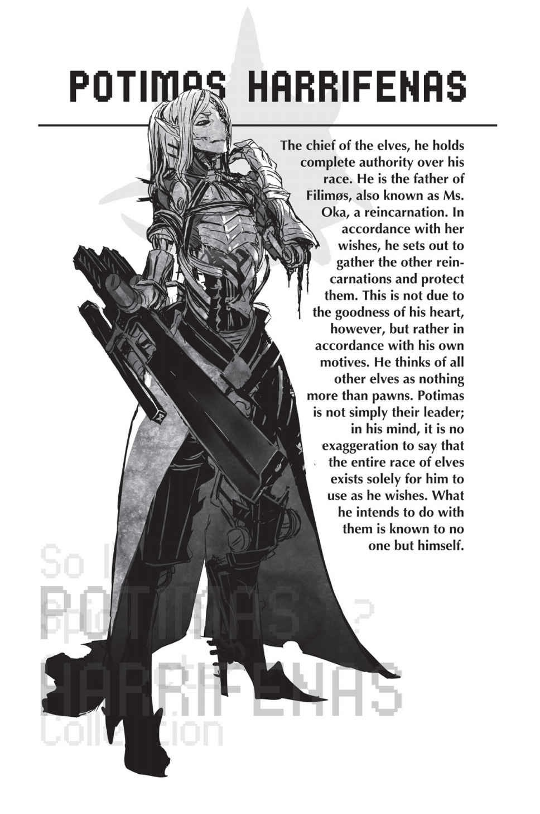

# Đoạn phụ: Cuộc đụng độ của các thực thể cổ xưa
*(Clash of the Ancients)*

Tôi vẫn nhớ lần đầu tiên tôi và White bắt đầu đồng hành cùng nhau.

Cô ấy cứ sống trơ trơ ra dù tôi có giết bao nhiêu lần đi chăng nữa, thế nên giải pháp duy nhất tôi có thể nghĩ ra lúc ấy là đề xuất một thỏa thuận đình chiến và cố gắng kéo cô ấy về phe mình.

Việc không chết nhờ kỹ năng [Bất tử] là một chuyện.

Nhưng White vẫn có thể sống lại ngay cả khi tôi đánh cô ấy bằng [Ma pháp Vực sâu], thứ ma pháp mà đáng lý ra kỹ năng [Bất tử] cũng không thể cứu nổi cô ấy.

Thế là quá đủ rồi.

Đến thời điểm đó, một phần của White ở bên trong tôi — Phân thân Tư duy từng được gọi là “não thể xác” — đã hoàn toàn dung hợp với tôi, tạo nên bản thân tôi của hiện tại.

Một khi đã chắc chắn rằng sẽ không có thêm sự thay đổi nào xảy ra nữa, ít nhất là không trái với ý muốn của tôi, thì tôi chẳng còn lý do gì để tiếp tục coi White là kẻ thù.

Tôi đoán là tôi vẫn còn hơi cay cú chuyện cô ấy tiêu diệt Nữ hoàng, quân đoàn của nó, rồi lũ nhện rối của tôi, vân vân và mây mây, nhưng chiến đấu với cô ấy nữa cũng chẳng mang lại lợi lộc gì.

Hơn nữa, chẳng hiểu vì sao tôi lại có linh cảm rằng rốt cuộc kẻ ngã xuống sẽ là mình.

Vì vậy, tôi từ bỏ việc tìm cách đánh bại White mà chuyển hướng sang cố gắng chiêu mộ cô ấy.

Tôi tuy mất đi Nữ hoàng, nhưng lại có được một kẻ siêu mạnh đã đánh bại nó.

Bên cạnh việc biến một kẻ thù nguy hiểm thành đồng minh, điều này còn giúp tôi có thể để mắt sát sao tới cô ấy mọi lúc mọi nơi.

Đó là một canh bạc mạo hiểm, vì lúc đó cô ấy cũng nguy hiểm chẳng kém bây giờ, nhưng tôi không còn lựa chọn nào khác.

Cứ cái đà đó, chắc chắn một ngày nào đó tôi sẽ bị White giết mất.

--- PAGE BREAK ---

Tôi đã thắng canh bạc đó và có được một đồng minh vô giá trong quá trình này.

Đúng vậy, quả thực là một đồng minh vô cùng quan trọng và vô giá.

Thấm thoắt đã hơn mười năm trôi qua kể từ ngày đó.

Hai chúng tôi đã cùng nhau nỗ lực rất nhiều để đi đến vị trí ngày hôm nay.

“Đó quả là một hành trình dài.”

Đây là điều tôi đã hằng mong ước từ rất lâu, rất lâu về trước.

Và hôm nay, cuối cùng nó cũng sẽ đơm hoa kết trái.

Khi nghĩ về khoảng thời gian dài đằng đẵng đó, mười năm tôi gắn bó với White dường như chỉ trôi qua trong chớp mắt.

Mặc dù đó là mười năm đầy rẫy biến cố.

Khi cảm xúc nhất thời ùa về, tôi ngước nhìn lên và thấy một mối đe dọa cơ giới hóa đáng lý không nên tồn tại trên thế giới này đang chặn đường tôi.

Sinh vật duy nhất sử dụng những thiết bị như thế này chỉ có thể là tộc Elf.

Nói chính xác hơn, tôi đoán chỉ có kẻ tên Potimas mà thôi.

“Ông vẫn nhớ những gì tôi đã nói trước đây chứ?”

“Ai mà biết được? Ta làm gì có thời gian để ghi nhớ mọi lời nói phát ra từ miệng một cô bé.”

Giọng của Potimas vang lên qua chiếc loa phát thanh của con robot dẫn đầu quân đoàn máy móc của hắn.

Tôi đối đầu với quân đoàn đó bằng một nụ cười khẩy.

“Ông nghĩ đống đồ chơi con nít này có thể cản được tôi sao? Chẳng phải ông nên phái tên Anh hùng tới đuổi theo tôi thì hơn à?”

Dù chuyện đó cũng chẳng quan trọng lắm, vì lúc này đáng lẽ White đang trên đường tới chỗ tên Anh hùng đó rồi.

“Anh hùng chỉ đơn thuần là món đồ chơi của lũ quản trị viên mà thôi. Ta chẳng có nhu cầu với những thứ vụn vặt như thế.”

“Để xem vài phút nữa ông có còn nghĩ như thế được nữa không.”

Một đàn quái vật nhện tập hợp lại phía sau tôi, đông đảo tới mức đủ để đối đầu với lực lượng cơ giới của Potimas.

Toàn bộ loài Taratect sống ở Rừng Lớn Garam đã tụ hội về đây, dẫn đầu là một con Taratect Nữ Vương khổng lồ.

Quân đội Đế quốc và ngay cả quân đội Ma tộc ở đây chỉ là để làm cho cân bằng quân số mà thôi.

Lực lượng thực sự của tôi chính là đàn nhện này, bao gồm cả Taratect Nữ Vương.

Chưa kể đến một vài cộng sự vô cùng đáng tin cậy, đặc biệt là White.

--- PAGE BREAK ---

Với tất cả sự chuẩn bị này, tôi phải đảm bảo chúng tôi sẽ thành công, ông hiểu chứ?

“Potimas. Tôi nói lại lần nữa nhé. Hôm nay, tôi sẽ kết liễu bản thể thật của ông.”

“Để rồi xem.”

Đội quân cơ giới kích hoạt kết giới của chúng.

Thứ kết giới triệt tiêu chính Hệ thống đang chi phối thế giới này.

Nhưng một thứ ngớ ngẩn như vậy sẽ không thể ngăn tôi tiến bước về phía trước.

--- PAGE BREAK ---

---

[◀ Chương trước: Chương 9: Tên Elf tồi tệ nhất lịch sử!](09_worst_elf_ever.md) | [Chương tiếp theo: Chương cuối: Hành trình mới bắt đầu ▶](final_chapter_a_new_journey_begins.md)
