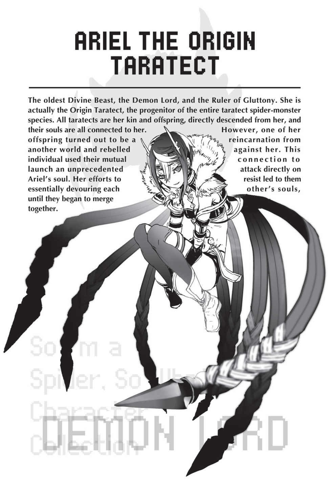

# Đoạn phụ: Ma Vương và Quản trị viên
*(The Demon Lord and the Administrator)*

---

Ta đã sống một cuộc đời rất dài và cũng đã cận kề cái chết không ít lần.

Nhưng ta chưa từng chiến đấu với một đối thủ kỳ lạ nào như thế này trước đây.

Ta biết đến sự tồn tại của nó lần đầu tiên khi nhận được tín hiệu cầu cứu khẩn cấp từ một trong những thuộc hạ của mình, một Taratect Nữ Vương.

Theo báo cáo mà nó gửi cho ta qua [Điều khiển Đồng loại], nó đang có nguy cơ bị ăn thịt bởi chính một đứa con của mình.

Ta không biết phải nghĩ sao về chuyện đó, nhưng từ trạng thái hoảng loạn của Taratect Nữ Vương, ta biết đây không phải là chuyện nhỏ.

Chuyện này xảy ra vào một thời điểm quan trọng đối với ta, vì ta vừa mới bắt đầu công việc làm Ma Vương, nhưng ta không thể từ chối lời cầu cứu từ quyến thuộc quý giá của mình.

Ta lập tức đến Mê cung Lớn Elroe để tìm hiểu thêm chi tiết từ chính miệng Taratect Nữ Vương.

Và điều đó lại càng làm ta hoang mang hơn.

Đúng như những gì ta đã được nghe kể, kẻ thủ ác là một trong vô số con non của Taratect Nữ Vương.

Nó đã rời bỏ Nữ Vương, tự mình tiến hóa và cuối cùng là tự giải thoát khỏi sự kiểm soát của bà ta.

Đây là lần đầu tiên một chuyện bất thường như vậy xảy ra.

Tuy nhiên, điều đó không hẳn là bất khả thi.

Dù hệ thống dạo này đã ít lỗi hơn, nhưng một số lỗi từ thời kỳ đầu thiết lập toàn bộ hệ thống này vẫn còn tồn tại.

Ta kết luận rằng đây hẳn là một lỗi hệ thống như vậy, và nghĩ rằng tình hình sẽ được khắc phục chỉ cần ta loại bỏ thực thể dị thường đó.

Nhưng ta đã quá ngây thơ.

--- PAGE BREAK ---

Ta đã kiêu ngạo tự phụ rằng dù nó có tiến hóa vài lần đi nữa thì cũng chẳng có gì to tát.

Nhưng chẳng bao lâu sau, ta đã nhận ra sai lầm của mình.

Ban đầu ta không hoàn toàn hiểu ngay được tại sao Nữ Vương lại phải cầu xin ta giúp đỡ.

“Tìm thấy rồi.”

Khi tìm thấy thực thể đó, ta nhanh chóng nhận ra nó nguy hiểm hơn ta tưởng rất nhiều.

<Không thể Thẩm định>

Kết quả Thẩm định đã vạch trần thực tế phũ phàng đó.

Chỉ có các Kẻ Thống Trị mới có thể can thiệp vào việc Thẩm định.

Kẻ Thống Trị sở hữu các kỹ năng Thống trị, và hơn thế nữa, họ được kết nối trực tiếp với hệ thống.

Ngay cả Nữ Vương cũng chưa đạt được vị thế đó, vậy mà thực thể này đã làm được.

“Chào nhóc. Ta là bà ngoại của cháu đây.”

Ta nói đùa để tự giới thiệu, vừa tiến lại gần một cách thân thiện.

“Xin lỗi vì đột nhiên lại hỏi thế này, nhưng cháu có thể dừng việc tấn công Nữ Vương lại được không?”

Nghe vậy, thực thể kia nghiêng đầu, rồi ngoe nguẩy một chiếc chân từ bên này sang bên kia.

Nó từ chối.

Chắc nó nghiêng đầu để tỏ ý rằng nó không hiểu tại sao ta lại đi hỏi một chuyện như vậy.

“Ta hiểu rồi. Vậy thì ta không còn lựa chọn nào khác.”

Không phải là ta không nghĩ đến việc lôi kéo Kẻ Thống Trị này về phe mình.

Tuy nhiên, ta phán đoán rằng để mặc thứ này tự tác tự oai là quá nguy hiểm.

Nếu nó đã không nghe lời ta, ta chỉ việc nghiền nát nó ngay tại chỗ.

“Ấy thế mà duyên phận lại ngắn ngủi thế. Tạm biệt nhé.”

Với một cái phẩy tay, ta nghiền nát thực thể đó.

Dù có là Kẻ Thống Trị hay không thì nó cũng chỉ mới sống được một thời gian ngắn.

Không thể chống đỡ đòn tấn công của ta, nó chết gần như ngay tức khắc.

Hoặc là ta đã nghĩ thế.

--- PAGE BREAK ---

Nhưng cuộc tấn công nhắm vào Nữ Vương vẫn tiếp diễn.

Đó là một cuộc tấn công trực tiếp ăn mòn linh hồn, điều đáng lý ra không một kỹ năng nào có thể làm được.

Ta đã tiêu diệt nguồn gốc, vậy mà cuộc tấn công vẫn tiếp tục.

Ta không biết nó đã sử dụng mánh khóe gì, nhưng điều đó có nghĩa là nó vẫn chưa chết.

Kể từ đó, ta đã truy đuổi nó khắp nơi.

Ta vẫn tiếp tục làm vậy bất chấp việc bản thân gặp bất lợi lớn, vì thực thể này là một bậc thầy [Ma pháp Dịch chuyển].

Hơn thế nữa, có những dấu hiệu cho thấy nó có thể theo dõi hành tung của ta.

Ngay cả với [Điều khiển Đồng loại], ta cũng chỉ nắm được vị trí mơ hồ của Nữ Vương, chứ đừng nói đến thực thể này.

Không có gì vô nghĩa hơn việc đuổi theo một thứ mà bạn không bao giờ có thể bắt kịp.

Và làm một việc mà bản thân biết rõ là vô nghĩa thực sự vô cùng mệt mỏi.

Trong lúc đó, chúng ta không chỉ mất đi thuộc hạ của Nữ Vương, mà ngay cả những Taratect con rối của chính ta cũng bị tiêu diệt.

Sẽ rất nguy hiểm nếu tiếp tục chiến tranh với thực thể đó.

Thế nhưng Nữ Vương tối quan trọng vẫn liên tục bị tấn công mà không có cách nào trốn thoát.

Và rồi Nữ Vương đã chết.

Ta đã biết từ lâu rằng đó là kết cục dễ xảy ra nhất, nhưng khi thực sự mất đi một trong những Nữ Vương của mình, nó đã xé toạc một khoảng trống lớn trong tim ta.

Một quyến thuộc đã cùng ta chiến đấu suốt bao nhiêu năm qua, nay đã ra đi.

Đây là một tổn thất khổng lồ.

Ta đã đến Tầng đáy của Mê cung Lớn Elroe, nơi Nữ Vương băng hà.

Nhưng ta thậm chí không thể tìm thấy xác của nó ở bất kỳ đâu.

Linh hồn ta run rẩy.

Một cơn thịnh nộ dữ dội mà lâu lắm rồi ta chưa từng cảm nhận được bùng cháy trong tim.

Không bao giờ.

Ta sẽ không bao giờ tha thứ cho nó vì chuyện này.

Ta sẽ tiêu diệt thứ đó, không chỉ vì nó đã chĩa nanh vuốt ăn mòn linh hồn vào ta.

May mắn thay, cuộc tấn công này yếu hơn nhiều so với cuộc tấn công nhắm vào Nữ Vương.

Ngay cả linh hồn vốn đã cận kề cái chết của ta hiện tại vẫn có thể chịu đựng được nó.

“Có vẻ ngài đang gặp không ít rắc rối nhỉ.”

--- PAGE BREAK ---

Ở Tầng đáy, một con địa long trò chuyện với ta bằng [Thần giao cách cảm].

Đó là hộ vệ của khu vực này, thủ lĩnh của loài địa long, Địa Long Gakia.

Phía sau ông ta là vài con địa long mạnh mẽ nhất trong số những con địa long vốn đã vô cùng hùng mạnh.

Và ta có thể cảm nhận được sự thù địch dữ dội tỏa ra từ chúng nhắm vào mình.

“Mà nếu có thì sao chứ? Các ngươi biết là nếu can thiệp vào chuyện của ta thì sẽ vi phạm hiệp ước, đúng không?”

“Đó là hiệp ước giữa ngài và chủ thượng của chúng tôi. Chúng tôi dĩ nhiên sẽ tuân lệnh chủ thượng, nhưng đáng tiếc là chúng tôi không hề nhận được mệnh lệnh cấm chúng tôi đối đầu với ngài.”

Ta nghĩ đến chủ thượng của loài địa long, Gülie.

Rõ ràng là ông ta đã không dạy dỗ thuộc hạ của mình tử tế.

“Thật là khôn lách. Vậy thì sao? Điều gì khiến các ngươi muốn chiến đấu với ta đến mức sẵn sàng đi ngược lại cả ý muốn của chủ thượng thế?”

“Ngài có đồng ý rằng đã đến lúc những kẻ già cỗi cần phải được đào thải không?”

“Ý ngươi là sao?”

“Một làn gió mới đang thổi. Ngài là Thần Thú cổ xưa nhất. Những kẻ già cỗi như chúng ta chẳng phải nên rút lui khỏi thế giới này để nhường chỗ cho cái mới hay sao?”

Có phải “làn gió mới” mà ông ta đang lảm nhảm chính là thực thể mà ta đang chiến đấu hay không?

“Nực cười. Cái gì mà nhường chỗ cho đám lính mới chứ? Ngay từ đầu chính cái suy nghĩ đó đã đẩy chúng ta vào hoàn cảnh này rồi. Nếu không thì tại sao một kẻ cổ xưa như ta lại phải nhúng tay vào cơ chứ?”

Nếu vậy thì đây hoàn toàn không phải là trò đùa.

Liệu ông ta có biết tại sao thực thể kỳ lạ kia lại được sinh ra không?

Không đời nào một thứ như vậy lại xuất hiện một cách tự nhiên.

Ta phải giả định rằng có một lý do đằng sau việc đó.

Liệu lũ rồng này có biết lý do đó là gì không?

“Hỡi Thần Thú Cổ Xưa Nhất. Chúng tôi không hiểu vì sao ngài lại săn đuổi thực thể đó. Tuy nhiên, chúng tôi đoán rằng ngài đang bị dồn vào chân tường. Có phải thực thể đó là kẻ đã dồn ép ngài? Hay là chúng tôi đã lầm?”

Ta biết ngay mà.

Lũ này biết về thực thể kia.

Chúng biết, và chúng đặt kỳ vọng vào nó.

Rốt cuộc thực thể đó là thứ quái quỷ gì vậy?

--- PAGE BREAK ---

“Sức mạnh của thực thể đó lớn đến mức đã đánh bại đồng loại của chúng tôi. Ngài không thể chỉ đơn giản là đến muộn rồi dễ dàng làm tổn hại đến nó đâu.”

“Bởi vậy ta mới nói, đây chính là vấn đề của lũ rồng các ngươi...”

Rồng, đặc biệt là địa long, coi trọng sức mạnh một cách thái quá. Chúng tôn kính bất kỳ ai mạnh mẽ, bất kể đó là ai.

Ngay cả khi sức mạnh đó được dùng để tàn sát chính đồng loại của chúng.

“Sức mạnh như thế phải được tôn kính. Đặc biệt là thực thể đó, nó chỉ mất một thời gian ngắn để có thể đánh bại đồng loại của chúng tôi.”

Tôn kính?

Cho cái thứ đó á?

“Còn lâu nháaa.”

Những từ đó tự dưng buột ra khỏi miệng ta ngoài ý muốn.

Nó khiến ngay cả ta cũng phải sững sờ.

Ta vừa nói cái gì thế này?

Có gì đó thật kỳ lạ, cứ như thể suy nghĩ của ai khác đã len lỏi vào tâm trí ta.

Ta đang bị xâm lấn.

Cuộc tấn công vào linh hồn của thực thể đó đang chậm rãi nhưng chắc chắn ăn mòn ta từ bên trong.

Một kẻ thống trị [Bạo Thực] như ta mà lại đang bị nuốt chửng.

Nhận ra sự trớ trêu đó, ta không khỏi bực bội gãi đầu.

“Vậy thì sao? Lũ các ngươi có chịu tránh đường không hả?”

Sự bực bội đó lộ rõ trong thái độ của ta đối với bầy rồng.

“Chúng tôi sẽ không tránh. Chúng tôi cũng là những sinh vật già cỗi đã đến lúc phải lụi tàn. Tôi không thể nghĩ ra một sân khấu nào đẹp đẽ và phù hợp hơn cho sự kết thúc của chúng tôi bằng việc câu giờ trước Thần Thú cổ xưa nhất.”

“Cứ nói cho bản thân ngươi đi. Ta vẫn có ý định nuốt chửng mọi thứ.”

Lời nói của ta cũng chính là một lời hứa.

Ta tiến lên một bước để nuốt chửng bầy địa long.

Chuyện đó đã xảy ra từ một thời gian trước rồi.

Gần như không thể cảm nhận được dòng chảy thời gian trong bóng tối của mê cung, thế nên ta hoàn toàn không biết đã bao lâu trôi qua kể từ khi trận chiến của chúng ta bắt đầu.

“Tuyệt vời.”

--- PAGE BREAK ---

Địa Long Gakia ngã xuống.

“Ta cũng định nói điều tương tự với các ngươi đấy.”

Họ thực sự rất tuyệt vời.

Bất chấp sự chênh lệch cực lớn về sức mạnh giữa hai bên, Gakia và bầy địa long của ông ta vẫn khiến ta phải trầy trật.

Ngoại trừ đối thủ đặc biệt mà ta đang phải đối phó hiện tại, đã từ rất lâu rồi ta mới gặp nhiều khó khăn đến thế trong một trận chiến trực diện.

“Tôi... mãn nguyện rồi.”

Ánh sáng lụi tắt trong đôi mắt Gakia.

Cuộc đời dài đằng đẵng của ông ta cuối cùng cũng đi đến hồi kết.

Ta nhìn chằm chằm vào cái xác đã ngã xuống của Gakia.

Ta vốn không có tình cảm đặc biệt gì với ông ta.

Tuy nhiên, khi biết một trong những con rồng cổ xưa đã hy sinh, ta cảm thấy một nỗi niềm khó tả.

Lại thêm một kẻ cựu trào nữa ra đi.

Nỗi đau đó càng nhân lên gấp bội vì chính tay ta đã tiễn ông ta đi.

Ta rũ bỏ thứ cảm xúc vô nghĩa đó.

Vẫn còn việc ta phải làm.

Ta phải nuốt chửng xác của Gakia, cũng như xác của những con địa long khác.

Bởi vì trận chiến đã kéo chúng ta đi khắp Tầng đáy, xác của những con rồng ngã xuống dọc đường nằm rải rác ở khắp nơi.

Dù có phiền phức thế nào thì ta cũng phải đi thu gom và ăn hết chúng.

Để lại đồ thừa là đi ngược lại nguyên tắc của ta.

Khoan đã.

Thật kỳ lạ.

Có phải lúc nào ta cũng giữ nguyên tắc đó không?

Hửm...?

Mà thôi, không sao.

Không.

Không ổn chút nào.

Chẳng ổn chút nào cả.

Suy nghĩ của ta đang ngày càng xa rời bản ngã ban đầu.

Ta cảm nhận được có thứ gì đó đang trộn lẫn vào linh hồn mình.

Chính là thực thể đang gặm nhấm linh hồn ta, thứ cảm giác tương tự như trước khi trận chiến này bắt đầu.

--- PAGE BREAK ---

Có vẻ như quá trình đó đã tiến triển đáng kể trong suốt trận chiến.

Tuy nhiên, cảm giác có chút khác biệt.

Trước khi ta bắt đầu chiến đấu với bầy địa long, cảm giác như thể ta đang bị tấn công, nhưng giờ đây nó giống như hai linh hồn đang hòa quyện vào nhau hơn.

Chúng ta đang trở thành một.

Ta không biết điều đó là tốt hay xấu.

Nhưng trong quá trình ấy, ký ức của thực thể độc nhất vô nhị đó đã hòa nhập vào ý thức của ta.

Một người tái sinh, một thế giới khác, và cuộc sống của nó ở thế giới này cho đến nay.

Dù chỉ là những mảnh vụn vụn vặt, nhưng giờ ta đã hiểu bằng cách nào và tại sao thực thể đó lại tấn công Nữ Vương.

Mặc dù chuyện đó không có nghĩa là ta có ý định tha thứ cho nó.

Hiện tại ta không thực sự hiểu rõ tình trạng của chính mình.

Ta là ta, nhưng một phần trong ta lại không phải, khiến ta tự hỏi liệu mình có thực sự là chính mình nữa hay không.

Đó không phải là một cảm giác dễ chịu.

Dù vậy, ta vẫn đang hoạt động bình thường như chính mình mà không gặp bất kỳ trở ngại nào.

Đến thời điểm này, ta không thể biết liệu mình có đang bảo vệ thành công bản ngã của mình hay không.

Thế nhưng, ta lại không cảm thấy quá bất an.

Ý nghĩ duy nhất mà ta có thể nghĩ ra lúc này là một câu vô tư: “Ồ, kiểu gì chăng nữa thì mọi chuyện cũng sẽ ổn thôi, cá đấy.”

Có lẽ ngay cả tính cách của ta giờ đây cũng đã bị thay đổi bởi đòn tấn công tinh thần kia rồi.

Ta có thể chỉ đơn giản là tự cảm thấy mình vẫn là chính mình, trong khi thực tế thì ta gần như đã bị nuốt chửng hoàn toàn.

Thành thật mà nói, phần ý nghĩ tin rằng mọi thứ rồi sẽ ổn đó... lại làm ta thấy sợ hãi.

Nhưng có bận tâm về nó cũng chẳng ích gì.

Rõ ràng, việc không ăn bầy địa long hiện tại không phải là một lựa chọn của ta.

Dẫu sao thì ta cũng đang đói bụng thật, và xem xét hiệu quả của [Bạo Thực], ăn tụi nó dĩ nhiên vẫn là tốt nhất.

Vậy thì không có lý do gì để chần chừ nữa.

“Đến giờ ăn rồi.”

“Không phải đâu.”

Ai đó cất tiếng trả lời câu độc thoại của ta.

--- PAGE BREAK ---

Quay người lại, ta nhìn thấy Gülie đang đứng đó với vẻ mặt phiền muộn.

Người đàn ông ngăm đen mà một số kẻ gọi là “Hắc”, nhà quản trị Güliedistodiez.

Một trong những vị thần điều hành hệ thống của thế giới này.

“Hiện tại cô là ai?” ông ta hỏi ngắn gọn.

Ta suy nghĩ một lát rồi đáp lại. “Ông thấy tôi giống bên nào hơn?”
Ta đang trả lời một câu hỏi bằng một câu hỏi, nhưng ta không còn lựa chọn nào khác.

Bởi vì chính bản thân ta cũng không biết câu trả lời cho điều ông ta vừa hỏi.

“Vừa là cả hai, mà cũng không phải cả hai. Hai người đã hòa vào nhau đến mức ta không còn phân biệt được nữa. Dù vậy, ý thức của cô có vẻ nghiêng về Ariel nhiều hơn.”

“Ủa, thật á?”

Ta vừa gãi đầu vừa nở nụ cười.

Ta cũng đoán như vậy, nhưng khi có người khác chỉ ra, ta không khỏi nghĩ: Ồ, ra là thế thật.

“Nhưng giọng điệu của cô thì lại giống người kia hơn.”

“Ừa. Mà sẵn tiện thì tôi cũng thấy suy nghĩ của mình đang lệch dần về phía đó luôn rồi.”

Nếu không thì sao tôi có thể lạc quan đến thế này được.

Bản thân tôi trước đây vốn rất thận trọng, thậm chí là nhút nhát.

Việc tôi đang trải qua quá trình đánh mất bản thân mà vẫn có thể bình thản chịu đựng thế này chính là minh chứng rõ ràng nhất.

“Vậy cô định làm gì tiếp theo?”

“Tôi cũng chẳng biết nữa.”

Tôi thật sự không biết.

Giờ đây khi linh hồn của cả hai đã quyện chặt vào nhau như thế này, có lẽ đã quá muộn ngay cả khi tôi tiêu diệt được bản thể thật của nó.

Và vấn đề lớn nhất là, dẫu sao tôi vẫn chưa có ý tưởng nào để đánh bại bản thể đó cả.

Không hiểu bằng cách nào nó vẫn có thể hồi sinh ngay cả khi bị giết, và vì nó sở hữu [Dịch chuyển], ban đầu việc bắt được nó vốn đã không hề dễ dàng gì.

Lý do duy nhất tôi có thể bắt được nó trước đây chỉ là vì may mắn, và vì bản thể chính kia là một kẻ ngốc.

Tôi không thể bắt được nó bằng cách đuổi theo xung quanh, và ngay cả khi bắt được, tôi cũng không thể thực sự giết được nó.

Dù có thể đi nữa, tôi cũng không nghĩ mình có thể quay trở lại làm bản thân trước đây.

Tôi còn không biết liệu quá trình xói mòn linh hồn này có dừng lại hay không.

Tôi đang lâm vào thế tiến thoái lưỡng nan.

--- PAGE BREAK ---

“Thật lòng mà nói, tôi gần như đã thua cuộc rồi. Cơ hội giữ lại ý thức về bản ngã chỉ là năm mươi - năm mươi, nhưng tôi thậm chí còn không biết có thể nói như vậy không khi bản thân hiện tại đã không còn là tôi nữa. Theo một nghĩa nào đó, thực thể được gọi là Ariel đã bị thay đổi rồi. Cô ấy có lẽ đã biến mất.”

Tôi sẽ không nói rằng Ariel đã chết.

Tôi vẫn giữ lại những cảm xúc và ký ức của Ariel.

Tuy nhiên, tiến trình suy nghĩ của tôi đã rất khác so với trước đây.

Trong hoàn cảnh như thế này, tôi có thực sự là chính mình nữa không?

Đó là một câu hỏi không có câu trả lời chính xác.

“Gülie này, người tái sinh là gì vậy?”

Gạt bài tập suy nghĩ khó nhằn này sang một bên, tôi hỏi Gülie một câu hỏi mà ông ta chắc chắn phải biết câu trả lời.

“Ta nghĩ cách tốt nhất để mô tả họ là những vị khách được Quản trị viên D mời đến thế giới này.”

“Được mời đến sao?”

Có thứ gì đó bên trong tôi đang phản kháng lại thông tin đó.

Tất cả những gì tôi biết về Quản trị viên D chỉ là những gì nghe được từ Gülie.

Theo ông ta, D là một vị thần sở hữu sức mạnh vượt xa Gülie rất nhiều.

Và giờ đây, vào một thời điểm thế này, vị thần đó lại cố tình chào đón những linh hồn mới từ thế giới khác.

Có lẽ D đang muốn gọi một làn gió mới vào thế giới này, giống như những gì Địa Long Gakia đã nói.

Để thay đổi vận mệnh của thế giới đang lao dốc về phía hủy diệt này.

“Mà, tôi không biết D đang nghĩ gì, và tôi cũng chẳng quan tâm. Tôi sẽ đòi lại món nợ này, chỉ thế thôi.”

Tôi sẽ chiến đấu với thực thể đó một lần nữa.

Chỉ thế thôi.

“Ông nghĩ khả năng tôi có thể tồn tại là bao nhiêu, Gülie?”

“Thực sự là năm mươi - năm mươi. Đến nước này, ngay cả ta cũng không thể chia tách linh hồn hai người ra được nữa. Dù thế nào đi nữa, ta tin rằng sự tồn tại của cô vẫn sẽ tiếp diễn dưới một hình thức nào đó, nhưng ta không thể hình dung ra hình thức đó sẽ ra sao.”

“Tôi hiểu rồi.”

“Có vẻ như ngay cả kẻ đang giằng co với linh hồn cô cũng không thể dừng việc dung hợp ý chí của chính nó lại nữa. Ta không thể biết suy nghĩ của ai sẽ giành chiến thắng cuối cùng. Cô thậm chí có thể bị biến thành một người hoàn toàn khác khi quá trình dung hợp hoàn tất.”

--- PAGE BREAK ---

Tôi hy vọng điều đó sẽ không xảy ra.

Tôi muốn giữ lại nhiều nhất có thể bản ngã của mình và chống cự nhiều nhất có thể.

“Hừm. Được rồi, để ta bù đắp cho việc thuộc hạ của mình đã gây rắc rối cho cô. Ta sẽ gửi cô đến thẳng vị trí của thực thể đó.”

Trước lời đề nghị đó, cằm tôi suýt rớt xuống đất trong chốc lát.

“Ông chắc là không sao chứ? Ngay cả khi rõ ràng nó đang nhận được sự ưu ái của quản trị viên?”

“Không, dĩ nhiên là có sao. D đã đặc biệt chỉ thị cho ta không được can thiệp vào chuyện của những người tái sinh. Dù là gián tiếp hay trực tiếp, D có thể sẽ trừng phạt ta vì đã đẩy một người tái sinh vào thế bí.”

Có vẻ như việc giúp tôi một tay đối với Gülie còn nguy hiểm hơn tôi tưởng rất nhiều.

“Vậy thì tại sao—?”

Gülie cắt ngang lời tôi. “Dù vậy, ta vẫn muốn giúp đỡ con gái của người bạn cũ nếu có thể.”

“Bày đặt tỏ ra ngầu lòi gớm. Sao ông không bao giờ thể hiện mặt đó trước mặt ngài Sariel đi?”

“Muốn nói gì thì tùy cô.”

Gülie bắt đầu niệm phép [Dịch chuyển].

“Nhưng phải trở về sống sót đấy.”

“Tôi biết rồi.”

Dù thắng hay bại, tôi cũng không biết liệu mình có còn là chính mình nữa không.

Nhưng tôi phải thắng nếu muốn tiếp tục bước tiếp.

Ma pháp [Dịch chuyển] của Gülie kích hoạt, đưa tôi đến một địa điểm khác.

Khi tôi đến nơi, tôi đang ở một nơi giống như chiến trường.

Thực thể kỳ lạ kia ngay trước mắt tôi, đang tàn phá bầy người.

“Xin lỗi vì đã cắt ngang cuộc vui nhé.”

Tôi thẳng thắn xin lỗi vì đã làm gián đoạn bất cứ chuyện gì đang diễn ra ở đây.

“Giờ thì ta phải yêu cầu ngươi đi chết thôi, được chứ?”

Và rồi tôi tuyên chiến.

Ồ, tôi vừa nhận ra. Tôi quên ăn thịt bầy địa long rồi.

--- PAGE BREAK ---

---

[◀ Chương trước: Chương 5: Những mưu đồ trỗi dậy](05_machinations_in_motion.md) | [Chương tiếp theo: Chương 6: Nhện vs Ma Vương vs Anh hùng ▶](06_spider_vs_demon_lord_vs_hero.md)
