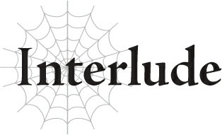
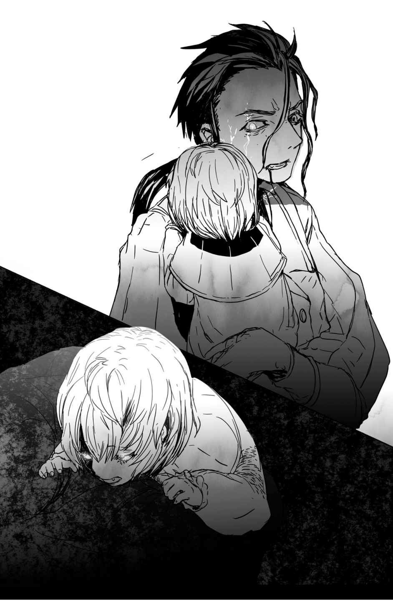

# Đoạn phụ: Nỗ lực của người hầu
*(The Servant's Struggle)*

---

Tôi là một người hầu của gia tộc Keren.

Tôi sống để phục vụ Lãnh chúa, Phu nhân, và tiểu thư của họ.

Vì vậy, thật không thể tưởng tượng nổi việc tôi lại bị đánh bại bởi đám cướp hay để Phu nhân và đứa con của bà rơi vào nguy hiểm.

Một sai lầm cực kỳ không thể chấp nhận.

Thế nhưng thay vì trách phạt tôi, Lãnh chúa lại lo lắng cho sự an nguy của tôi.

Tôi thật may mắn khi được phụng sự một người đàn ông tuyệt vời như vậy.

Chính vì thế, ngài ấy hoàn toàn xứng đáng để tôi hi sinh cả tính mạng này.

“Merazophis. Việc di tản thị dân thế nào rồi?”

“Thưa Lãnh chúa, tiếc là mọi chuyện có vẻ không được suôn sẻ.”

“Ta hiểu rồi.”

Khuôn mặt Lãnh chúa tràn đầy vẻ đau xót.

Binh lính Ohts đã xâm chiếm thị trấn thân yêu của ngài.

Chúng hẳn là một nhánh quân tách ra khỏi đại quân để tấn công thẳng vào thị trấn.

Ohts đã thực hiện một chiến thuật hèn hạ nhắm vào những thị dân vô tội mà không hề chớp mắt.

Lãnh chúa có lẽ định ở lại cho đến phút cuối cùng.

Ngài có tinh thần trách nhiệm rất cao.

Đối với ngài, việc chạy trốn trong khi người dân của mình vẫn còn kẹt lại là điều không thể dung thứ.

Vì ngài ở lại, Phu nhân cũng quyết định ở lại.

Bà muốn kề cận bên ngài cho đến khoảnh khắc cuối cùng.

Họ thực sự là một đôi phu thê hoàn mỹ.

Đó là lý do tôi đã chôn chặt tình cảm nhỏ nhoi của mình dành cho Phu nhân.

Được chết khi phục vụ họ là một vinh dự đối với tôi.

--- PAGE BREAK ---

“Merazophis. Hãy chăm sóc con gái ta... Sophia.”

Lời của Lãnh chúa đã chấm dứt sự buông xuôi của tôi.

Ngài muốn tôi chạy trốn và mang theo Tiểu thư.

“Thưa Lãnh chúa, tôi không thể—”

“Merazophis. Ngươi là người ta tin tưởng nhất. Ta muốn giao phó tính mạng con bé vào tay ngươi.”

“Ta cũng nghĩ như vậy. Trăm sự nhờ ngươi.”

Lãnh chúa và Phu nhân đang thỉnh cầu tôi.

Không phải là một mệnh lệnh. Mà là một lời thỉnh cầu.

“Tôi hiểu rồi. Tôi sẽ bảo vệ Tiểu thư bằng mọi giá.”

Tôi tự hỏi lúc này khuôn mặt mình trông như thế nào?

Chắc chắn là nó đang nhếch nhác đến mức không nên để họ nhìn thấy.

Tôi dùng tay áo lau đi những giọt nước mắt đang làm mờ tầm nhìn.

Rồi tôi đón lấy Tiểu thư từ vòng tay của Phu nhân.

Ngay khoảnh khắc đó, ai đó đột nhập qua cửa sổ.

“Chạy đi!”

Lãnh chúa đẩy mạnh vào lưng tôi, ép tôi chạy ra khỏi phòng.

Tôi chạy qua hành lang và đến được đại sảnh lối vào.

Thế nhưng lại có thêm nhiều kẻ đột nhập khác ở đó, cung tên đã giương sẵn như thể đang phục kích.

Tôi vội quay người hướng về phía cửa sau, nhưng rồi một cơn đau dữ dội giáng thẳng vào lưng.

Tôi nghiến răng cố chạy tiếp, nhưng ngay khi vừa bước bước đầu tiên, một mũi tên đã găm thẳng vào chân tôi.

Tôi ngã nhào xuống đất.

Vì cố gắng bảo vệ đứa trẻ sơ sinh trong lòng, tư thế ngã của tôi rất tệ.

Cánh tay đập xuống đất phát ra một tiếng động khô khốc, kinh hoàng.

Cơn đau khủng khiếp ập đến như muốn làm tôi ngất đi.

Có lẽ cánh tay tôi đã gãy rồi.

Thế nhưng đám đột nhập không cho tôi thời gian để hồi phục.

Nén chặt lưng vào tường, tôi bằng cách nào đó vẫn gượng đứng dậy.

Hậu quả là vật cắm trên lưng tôi, có lẽ là một mũi tên, lại càng bị ấn sâu hơn.

Tôi ôm chặt Tiểu thư bằng cánh tay đã gãy, dùng tay còn lại rút kiếm ở thắt lưng ra, chuẩn bị đối mặt với kẻ thù.

Tổng cộng có bốn kẻ.

--- PAGE BREAK ---

Tất cả chúng đều trùm mũ kín mặt.

Bên ngoài cánh cửa đại sảnh đang mở toang, tôi thấy các hộ vệ của dinh thự đều đã nằm rạp trên mặt đất.

Có vẻ tôi không thể trông chờ vào viện binh nữa rồi.

Với tình trạng hiện tại, tôi không khác gì một kẻ sắp chết.

Chắc chẳng ai nghĩ tôi còn cơ hội sống sót.

Dù vậy, tôi không có lựa chọn nào khác.

Như để chế giễu quyết tâm của tôi, những kẻ đột nhập giương cung.

Lưng tựa vào tường, tôi không thể di chuyển dù chỉ một bước.

Giá như chúng chịu bước vào tầm kiếm, ít nhất tôi cũng có thể chống cự đôi chút, dù chỉ là vô ích.

Ngay cả điều đó tôi cũng không được phép làm sao?!

Sự bất lực của bản thân khiến tôi suýt rơi nước mắt.

Đúng lúc đó, tôi cảm thấy một cơn đau nhói ở cổ.

Nhìn xuống, tôi thấy Tiểu thư đang cắn mình.

Không chỉ vậy, những chiếc răng của em đã đâm xuyên qua da tôi, và em đang uống dòng máu chảy ra từ vết thương.

Tôi còn chưa kịp thắc mắc chuyện gì đang xảy ra thì cơ thể đã trải qua một sự biến đổi kinh ngạc.

Bằng cách nào đó, cơ thể tôi dần ấm lên tỷ lệ thuận với lượng máu bị mất.

Sức mạnh trào dâng trong tôi, và cơn đau từ các vết thương bắt đầu dịu đi.

Giống như lượng máu chảy ra bao nhiêu, thì lại có một thứ khác chảy ngược vào cơ thể tôi bấy nhiêu.

Một cảm giác tràn đầy năng lượng bao trùm lấy toàn thân tôi.

Tôi cảm giác như mình đang biến thành một người khác, không còn là chính mình nữa.

Trong hoàn cảnh bình thường thì điều đó thật kinh khủng, nhưng tâm trí tôi hiện đã quá say sưa trong một sự tê dại ngọt ngào.

Không hiểu vì sao, tôi cảm thấy bây giờ mình có thể chiến thắng.

Tôi di chuyển đôi chân, ngay cả bên chân vốn đã bất động vì trúng tên.

Bất chấp mọi thứ, tôi bước lên một bước, và ngay lập tức xuất hiện ngay trước mặt một tên đối thủ.

Rồi tôi đâm thẳng kiếm vào khuôn mặt đang kinh ngạc của hắn.

Vì lý do nào đó, những giọt máu phun ra tung tóe trên mặt tôi lại vô cùng hấp dẫn.

--- PAGE BREAK ---

--- PAGE BREAK ---

Mùi hương của nó kích thích khứu giác của tôi tựa như hương thơm của một loại rượu vang thượng hạng.

Có điều gì đó kỳ lạ đang xảy ra với tôi.

Nhưng tôi không thắc mắc sâu xa làm gì.

Dù có chuyện gì đi nữa, nó đã ban cho tôi sức mạnh để bảo vệ vị chủ nhân nhỏ của mình.

Tại sao tôi lại không tận dụng sức mạnh đó hết mức có thể chứ?

Khi đám đột nhập lùi lại kinh ngạc trước sự thay đổi đột ngột của tôi, thanh kiếm của tôi vung lên chém chúng không chút nương tay.

Thế nhưng ngay khi tôi chuẩn bị kết liễu tên cuối cùng, một lực tác động cực mạnh giáng thẳng vào lưng tôi.

Cứ như thể nó đang đánh vỡ vụn toàn bộ cơ thể tôi vậy.

Không thể chịu đựng nổi, tôi ngã nhào về phía trước.

Tiểu thư văng khỏi vòng tay tôi, lăn lộn trên sàn nhà.

“Một ma cà rồng à? Hàng mới nên chỉ số vẫn còn thấp, nhưng sẽ khá phiền phức nếu để nó trưởng thành đấy.”

Tôi cố ngoảnh đầu lại nhìn người đàn ông vừa đánh lén tôi từ phía sau.

Không giống như những kẻ khác, khuôn mặt hắn không bị che bởi mũ trùm.

Hắn trông giống như một thanh niên.

Nhưng không thể đánh giá tuổi thật của hắn qua diện mạo.

Bởi vì đôi tai đang lộ rõ của hắn rất dài và nhọn.

Đặc điểm đặc trưng của tộc Elf trường thọ.

Tại sao tộc Elf lại hợp tác với Ohts? Nhưng hơn cả thế, điều làm tôi lo lắng nhất chính là hướng mà hắn đang đi tới.

Hắn đi tới từ hướng căn phòng mà tôi vừa nhìn thấy Lãnh chúa và Phu nhân lần cuối.

Có chuyện gì đã xảy ra với họ sao?

Kịch bản tồi tệ nhất thoáng qua trong đầu tôi.

“Vậy ra đứa bé đó là Chân Tổ sao.”

“Chúng ta nên làm gì?”

“Giết đi.”

Tên trùm mũ sống sót đang nói chuyện với tên Elf.

Tôi không thể để chúng thực hiện lời nói đó.

“Ngài có chắc chắn không, thưa ngài?”

“Cứ bảo với Oka là nó bị cuốn vào trận chiến và chúng ta không đến cứu kịp. Để một ma cà rồng sống sót sẽ chỉ đem lại rắc rối về sau mà thôi.”

--- PAGE BREAK ---

“Tôi rõ rồi.”

Tên trùm mũ tiến lại gần vị chủ nhân nhỏ của tôi.

Tôi ngay lập tức nhỏm dậy, chặn bàn tay đang vươn về phía đứa trẻ.

“Tôi không cho phép các ngươi đụng một ngón tay vào Tiểu thư.”

Tên trùm mũ chùn bước.

Thế nhưng tên Elf kia chỉ nhìn tôi bằng đôi mắt lạnh lùng, híp lại.

“Đầu hàng đi, ta sẽ ban cho ngươi cái chết không đau đớn. Tại sao phải bảo vệ đứa trẻ đó đến mức này chứ? Nó là một ma cà rồng. Nó sẽ chỉ mang lại tai ương cho thế giới mà thôi.”

Ma cà rồng sao?

Sinh vật hút máu trong những câu chuyện cổ tích ấy à?

Điều đó có nghĩa Tiểu thư là một ma cà rồng sao?

Nếu vậy, nó giải thích được sự thay đổi đột ngột trên cơ thể tôi.

Nhưng chuyện đó chẳng thay đổi được gì cả.

“Điều đó không quan trọng. Tôi đã hứa sẽ bảo vệ Tiểu thư bằng cả mạng sống này. Em ấy đã được giao phó cho tôi.”

Thực hiện di nguyện của Lãnh chúa và Phu nhân.

Đó là nghĩa vụ duy nhất của tôi.

Tiểu thư có là ma cà rồng hay không cũng không có gì khác biệt.

“Thật ngu xuẩn.”

Tên Elf tụ ma lực vào tay.

Cho đến khi bất thình lình, hắn bị tấn công bởi một Cơn Ác Mộng màu trắng.

---

[◀ Chương trước: Chương 8: Tiến hóa, Phân tách, Sinh sôi](08_evolution_division_propagation.md) | [Chương tiếp theo: Chương 9: Tên Elf tồi tệ nhất lịch sử! ▶](09_worst_elf_ever.md)
