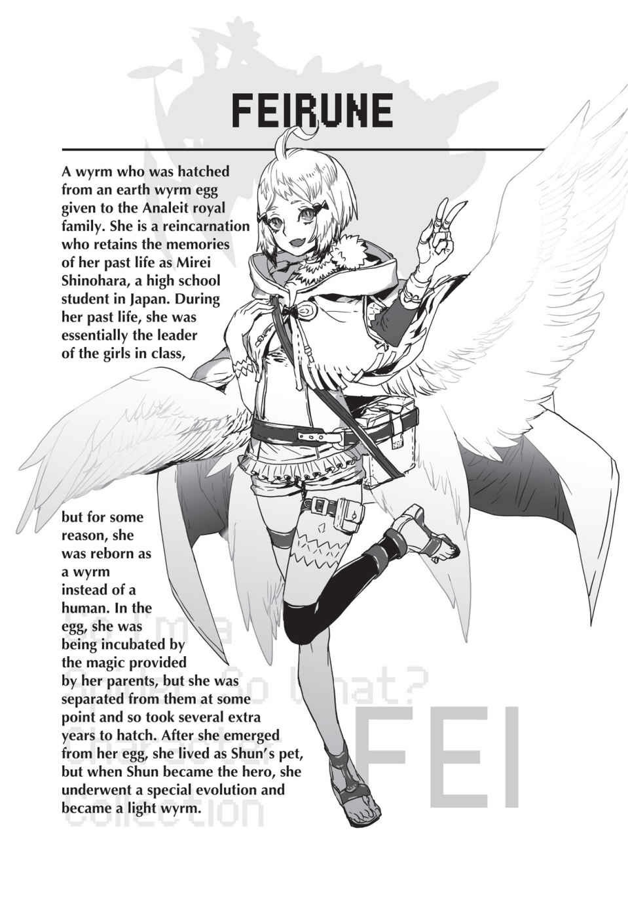

# Đoạn phụ: Phi Long và Bán Elf
*(The Wyrm and the Half Elf)*

---

Cuộc họp chiến thuật kết thúc rồi.

Haizz, mỏi đơ cả vai.

Tôi đập đập đôi cánh trên lưng vài cái rồi vươn vai.

Trời đất, tôi cũng buồn ngủ nữa chứ.

Dù là giờ học hay phòng họp đi nữa, có vẻ mấy cái buổi kiểu đó vẫn luôn làm tôi buồn ngủ.

Ý tôi là, tôi thừa biết đó là một cuộc nói chuyện thực sự quan trọng, được chưa?

Nhưng điều đó không có nghĩa là tôi sẽ không buồn ngủ. Chỉ là nói thế thôi mà.

Chắc chắn, về mặt lý thuyết thì đó là một cuộc họp chiến thuật, nhưng chẳng có gì thực sự quan trọng được quyết định cả.

Thực sự thì chúng tôi chỉ việc túc trực gần các điểm dịch chuyển thôi.

Ý tôi là, chúng tôi quả thực đã báo cho Kuni và Kushitani biết về việc của Negishi này nọ, nên tôi đoán cuộc họp này không hoàn toàn phí thời gian, nhưng mà vẫn...

Negishi... Hừm.

Shun nghiêm túc nghĩ rằng cậu ấy có thể đánh bại cô ta thật sao?

Tôi đoán đây chẳng phải lần đầu tiên cậu ấy tự ép bản thân quá sức.

anh Hyrince cũng biết điều đó, chắc vì thế nên anh ấy mới cố ngăn cản cậu ấy, nhưng tôi không biết liệu có tác dụng gì không nữa.

Hy vọng là Katia có thể giữ cậu ấy lại, nhưng cô ấy không hiểu được Negishi đáng sợ thế nào, nên rốt cuộc có khi cô ấy cũng muốn tin rằng Shun sẽ thắng được cô ta.

Dẫu sao thì, tình yêu là mù quáng mà.

Cô ấy có một niềm tin phi lý vào Shun, nghĩa là tôi có lẽ không trông cậy được gì nhiều vào cô ấy rồi.

Haizz...

Tôi đúng là khá đen đủi mà, phải không?

--- PAGE BREAK ---

Cả anh Hyrince cũng vậy nữa.

Tôi quay về căn phòng được phân sau cuộc họp, nhưng giờ chẳng hiểu sao bụng tôi lại quặn đau không ngủ được.

Chắc tôi sẽ đi dạo một lát.

Vừa mở cửa bước ra ngoài, hai gã đàn ông người Elf đã túc trực sẵn ở đó, như thể đang đợi tôi vậy.

Tôi suýt chút nữa là không kìm được cái cau mày.

Thay vào đó, tôi lờ họ đi và tiếp tục bước đi, hai tên đó lẳng lặng bám theo sau.

Để tôi yên giùm cái coi?

Phiền phứcccc quá đi.

Rốt cuộc lũ người này bị làm sao thế nhỉ?

Chúng tôi đâu phải tội phạm chứ.

Tôi không hiểu nổi vì sao họ cứ phải giám sát chúng tôi mọi lúc mọi nơi như vậy.

Trong lúc bực dọc đi dạo quanh, tôi phát hiện một đám đông đang tụ tập gần đó.

Nghe như thể họ còn đang cười cợt nữa.

Kỳ lạ thật.

Suốt khoảng thời gian chúng tôi ở làng Elf này, tôi chưa từng thấy một người Elf nào cười một lần nào cả.

Họ thậm chí còn không mỉm cười; lúc nào mặt cũng nhăn nhó, cau có.

Nhưng đám người trước mặt tôi lại đang cười phá lên.

Có chuyện gì vui lắm sao?

Tôi tò mò ngó thử một cái, cũng chẳng mong đợi gì nhiều.

Ở đó, tôi nhìn thấy Anna đang co rúm người lại, má cô ấy sưng đỏ lên.

Hả?

Khoan đã, cái gì thế? Chuyện gì đang xảy ra ở đây vậy?

Vết hằn trên má Anna là do bị đấm sao?

Có kẻ đã đánh cô ấy à?

Và đám người này đang cười cợt chuyện đó sao?

“Này, lũ kia! Các người nghĩ mình đang làm cái trò gì thế hả?!”

Ngay lập tức, tôi quát lớn vào mặt bọn họ.

Lũ Elf lập tức ngừng cười và quay lại nhìn tôi chằm chằm bằng ánh mắt đờ đẫn.

Những gương mặt đơ như máy của chúng chỉ càng khiến tôi điên tiết hơn.

“Đây là chuyện nội bộ giữa người Elf chúng ta. Kẻ ngoài cuộc đừng có chĩa mũi vào nơi không phận sự,” một tên Elf lạnh lùng nói.

Hắn ta có vẻ là kẻ cầm đầu nhóm này.

--- PAGE BREAK ---

“Thế thì để tôi nói rõ một điều nhé. Anna là bạn của chúng tôi. Điều đó có nghĩa tôi không phải kẻ ngoài cuộc, vậy nên tôi có quyền xía vào chứ nhỉ?”

Tôi bước tới trước mặt hắn và túm lấy cổ áo hắn.

“Hay là tôi chĩa nắm đấm vào mặt các người nhé?”

Tôi nắm chặt bàn tay còn lại thành đấm và thủ thế chuẩn bị vung.

Tôi thèm đấm thẳng vào bản mặt tự mãn của tên Elf đó lắm rồi, nhưng vẫn phải tự kìm chế.

Hai gã lính gác bám đuôi tôi đã rút vũ khí ra sau lưng tôi.

Ôi thôi nào!

Tôi đang cố giữ bình tĩnh rồi đấy, sao các người cứ phải chọc điên người ta lên thế hả?

“Các người có chắc là muốn chĩa vũ khí vào tôi không? Nên nhớ tôi là thành viên trong tổ đội của Anh hùng đích thực đấy nhé. Các người thực sự muốn đối đầu với Anh hùng sao?”

Tôi nói với tất cả lũ Elf có mặt ở đó, chứ không chỉ riêng hai tên sau lưng mình.

Tên Elf bị tôi túm áo gạt mạnh tay tôi ra.

“Đi thôi.”

Lũ Elf quay lưng định bỏ đi.

“Đứng lại đó.”

Tôi chộp lấy vai tên cầm đầu giữ lại.

“Xin lỗi đi.”

“Không cần thiết.”

“Có thể đối với các người thì không, nhưng chúng tôi thì không nghĩ thế. Xin lỗi. Ngay lập tức.”

Tên cầm đầu tộc Elf lại cố gạt tay tôi ra lần nữa.

Tôi bấm mạnh ngón tay vào vai hắn, vừa đủ lực để ghim hắn tại chỗ.

Mặt tên Elf nhăn nhó vì đau đớn.

“Mày thực sự nghĩ hành động của mình sẽ không bị trừng trị sao, con nhóc kia?”

“Các người mới là kẻ động thủ với Anna trước, đúng không? Chỉ cần các người xin lỗi, tôi sẽ thả ra ngay. Làm đi chứ.”

Hắn vẫn bướng bỉnh không chịu mở miệng.

Tôi nhún vai và bắt đầu tăng thêm lực bóp lên vai hắn.

Chẳng mấy chốc, lực nhấn đã đạt đến mức nếu tôi siết thêm chút nữa thì xương cốt hắn sẽ gãy vụn mất.

“Được rồi, được rồi! Xin lỗi!”

Cuối cùng, hắn cũng chịu xin lỗi.

--- PAGE BREAK ---

Khi tôi buông tay ra, hắn lườm tôi một cái đầy căm giận nhưng rồi lầm lũi bỏ đi không nói thêm lời nào.

Chẳng mấy chốc, nơi đó chỉ còn lại Anna, bốn gã Elf canh giữ chúng tôi, và tôi.

Hai tên gác của Anna chắc chắn đã ở đó khi vụ bạo hành bắt đầu.

Nếu chúng chỉ đứng trơ mắt nhìn mà không thèm giúp cô ấy, thì rốt cuộc chúng canh gác chúng tôi để làm cái quái gì từ đầu chứ?

“Cảm ơn cô. Tôi xin lỗi vì đã gây ra rắc rối.”

“Không có gì đâu. Chỉ có lũ ăn hại vô tích sự mới đứng giương mắt nhìn mà không làm gì giúp đỡ thôi,” tôi đáp lại, cố tình ném cái nhìn xéo sắc về phía đám lính gác.

Chân mày của bọn họ khẽ giật giật, cho thấy đòn xỉa xói của tôi đã trúng hồng tâm.

“Mà này, còn cô thì sao hả Anna? Bình thường lúc huấn luyện chúng tôi cô dữ dằn lắm kia mà. Sao cô không tẩn cho lũ hề đó một trận ra trò đi?”

Tôi quá rõ sự đáng sợ của Anna rồi.

Dẫu sao thì, chính cô ấy là người đã hỗ trợ tôi cày cấp khi tôi còn nhỏ mà.

Tôi sẽ không bao giờ quên những buổi huấn luyện địa ngục mà cô ấy đã bắt tôi trải qua hồi đó.

Mấy chuyện đó thì không nói làm gì, đằng này cô ấy còn tin sái cổ vào cái quan niệm mê tín rằng ăn thịt quái vật mạnh sẽ giúp bản thân mạnh lên tương ứng, nên hồi đó cô ấy toàn ép tôi phải nghẹn ngào nuốt trửng mấy món kinh tởm đó vào bụng.

Ký ức ùa về làm tôi chỉ biết nở một nụ cười đau khổ.

“Nếu có thể làm như vậy, tôi đã không phải chật vật thế này.”

Anna liếc nhìn bốn tên Elf còn lại.

À. Ra là vậy.

Ngay cả khi muốn than vãn, cô ấy cũng chẳng thể nói ra được vì lũ người này đang ở đây.

“Nhưng tôi không thể tin nổi bọn họ lại hùa nhau bắt nạt một cô gái như thế! Mang tiếng có tuổi thọ dài lâu, vậy mà lũ Elf cư xử chẳng khác gì con nít. Ngay cả trẻ con loài người thời nay cũng không làm trò trẻ con như vậy đâu.”

Vì Anna không thể nói ra nỗi lòng của mình, tôi quyết định càm ràm thay cô ấy.

...Cơ mà tôi cũng chẳng có tư cách gì để nói người khác, vì chính tôi kiếp trước cũng là một kẻ bắt nạt.

“Lũ Elf lúúúc nào cũng thế à? Tôi đoán bọn họ vẫn chưa chịu lớn rồi. Chứ không thì tại sao lại làm một việc mà ngay cả đứa trẻ cũng biết là sai trái chứ? Tôi chắc chắn cái nhóm người Elf đó hẳn là cực kỳ ngu xuẩn.”

Hự, phát đó thốn thật!

--- PAGE BREAK ---

Tôi xin lỗi được chưa?! Tôi tự hiểu mà! Kiếp trước chính tôi cũng cực kỳ ngu ngốc và trẻ con!

“Nhưng tôi tin từ giờ trở đi sẽ ổn thôi! Dẫu sao thì nếu chuyện này tái diễn, hai anh đây chắc chắn sẽ bảo vệ cô mà. Chắc lúc nãy họ chỉ quá sốc khi thấy đồng bào của mình lại làm trò bỉ ổi như vậy nên mới đơ người ra không động đậy nổi thôi, phải không các anh?”

Tôi nở một nụ cười rạng rỡ với hai tên Elf đang gác cho Anna, khiến mặt của chúng co giật liên hồi.

Có vẻ chúng đã nhận ra giọng điệu mỉa mai đầy sâu cay của tôi rồi.

Nhưng chúng thừa hiểu rằng nếu dám cãi lại, chúng sẽ vô tình thừa nhận rằng tất cả người Elf thực sự bỉ ổi như thế.

Dù sao thì đó cũng là cái bẫy mà tôi đã nhắm sẵn.

Xem kìa, tôi cũng muốn tin là người Elf không thực sự ngu ngốc đến thế chứ.

Rằng bọn họ biết việc họ làm là không thể chấp nhận được về mặt xã hội.

Nhưng hóa ra lòng tự tôn của người Elf lại cao một cách lố bịch.

Nên dù tôi có chế giễu thế nào đi nữa, chúng cũng sẽ không bao giờ chịu nhận rằng, ừ, mình ngu xuẩn vậy đó.

Vì thế, nếu hỏi tôi thì cách duy nhất chúng có thể làm lúc này là đồng tình thôi.

“Được rồi. Chúng tôi sẽ thông báo cho các tộc nhân khác không được làm hoen ố thanh danh của chủng tộc chúng ta.”

Tôi gần như có thể nhìn thấy gân xanh nổi đầy trên trán chúng, nhưng cuối cùng chúng vẫn phải nhượng bộ.

Ngon lành, thành công rồi!

Dù cho trong quá trình đó tôi cũng tự đâm vào tim mình vài nhát đau điếng.

Kiếp trước, tôi đã bắt nạt một cô gái rất nhiều.

Mặc dù tôi không chắc liệu có thể gọi đó đơn thuần là bắt nạt hay không.

Cô ấy tên là Wakaba Hiiro.

Con hồ ly tinh đã cướp mất hồn vía người tôi thích bằng vẻ ngoài xinh đẹp một cách vô lý của cô ta.

Chỉ cần nghĩ lại thôi cũng đủ khiến tôi nổi điên rồi.

Tôi đã phải lấy hết can đảm để tỏ tình với anh tiền bối đó. Hãy tưởng tượng tôi đã cảm thấy thế nào khi anh ta đáp lại: “Xin lỗi, anh thích Wakaba mất rồi”!

Tôi biết đó chẳng phải lỗi của cô ấy, nhưng lúc đó tôi không kiềm chế nổi.

Khi tôi đầm đìa nước mắt chạy đến chất vấn cô ấy, cô ấy chẳng làm gì ngoài việc nhìn chằm chằm tôi

--- PAGE BREAK ---

bằng đôi mắt lạnh lùng đó.

Tôi nghĩ vào khoảnh khắc đó, thứ gì đó bên trong tôi đã đứt phựt.

Kể từ đó, tôi bắt đầu coi Wakaba Hiiro là kẻ thù truyền kiếp của mình, và hễ có cơ hội là tôi lại kiếm chuyện gây sự với cô ấy.

Tôi thường xuyên lăng mạ thẳng vào mặt cô ấy.

Tôi giấu hoặc phá đồ đạc của cô ấy.

Tôi bỏ cả lưỡi dao lam vào hộc bàn của cô ấy.

Các bạn biết đấy, toàn mấy trò bắt nạt kinh điển.

Nhưng bất kể tôi làm gì, cô ấy chỉ phớt lờ với vẻ mặt lạnh tanh.

Điều đó lại càng khiến tôi điên máu hơn, và mọi chuyện có lẽ đã leo thang hơn nữa nếu đám bạn không cản tôi lại.

“Wakaba đáng sợ lắm đó. Cậu tốt nhất đừng có dồn cậu ta đi quá xa.”

Cả Ai và Himi đều nghiêm túc nói với tôi như vậy, và những người bạn khác của tôi cũng khuyên tương tự.

Bản thân tôi cũng biết cô ấy có gì đó bất thường, nhưng tôi chỉ là không thể dừng lại được.

Mỗi khi Wakaba nhìn tôi bằng đôi mắt như thể xuyên thấu qua tâm can ấy, tôi lại không kiềm được sự giận dữ.

Đôi mắt đó như thể đang nói rằng tôi thậm chí còn chẳng đáng để lọt vào tầm mắt cô ấy.

Đến một lúc nào đó, nguyên nhân không còn là vì anh tiền bối tôi thích nữa. Tôi chỉ đơn giản là không tài nào chịu nổi ánh mắt của cô ấy.

Dù sao thì tôi cũng đâu có hẹn hò với anh ta, và Wakaba có vẻ cũng chẳng thích anh ta, nên ngay từ đầu cô ấy cũng đâu có cướp anh ta khỏi tay tôi.

Có lẽ tôi đang phải nhận quả báo vì đã làm những trò như thế.

Tôi đã suy nghĩ về chuyện đó suốt một thời gian dài khi còn ở trong trứng.

Thành thật mà nói, tôi không nhớ rõ lắm về khoảng thời gian ở trong trứng.

Giờ nghĩ lại nó cứ như một giấc mơ vậy, nhỉ?

Nhưng tôi nhớ mang máng là mình đã bị nhốt ở một nơi tối tăm và chật hẹp.

Và đến khi tôi cuối cùng cũng thoát ra khỏi cái nơi kinh khủng đó, tôi đã là một con phi long rồi.

Đầu tiên tôi chết mà thậm chí còn chẳng nhận ra, rồi sau đó tôi lại đầu thai làm một con rồng thú cưng của ai đó.

Đó chắc chắn là sự trừng phạt của thần linh rồi, đúng không?

Khi biết tin các bạn học khác của mình cũng ở thế giới này, tôi đã hạ quyết tâm sẽ xin lỗi Wakaba Hiiro khi gặp lại cô ấy.

Để xin lỗi vì tất cả những trò ngu xuẩn mà mình đã làm.

Nhưng rồi tôi lại nghe tin Wakaba Hiiro đã chết.

--- PAGE BREAK ---

Nghĩa là tôi sẽ phải ôm nỗi dằn vặt này suốt phần đời còn lại.

Có lẽ đó mới là sự trừng phạt thực sự dành cho tôi.

“Anna này, cô thừa biết chuyện như vậy sẽ xảy ra mà, đúng không? Tại sao cô lại lặn lội theo Shun đến tận đây dù biết họ sẽ gây khó dễ cho mình chứ?”

Cuối cùng tôi cũng hỏi ra điều thắc mắc bấy lâu nay.

Tôi vẫn luôn biết Anna đang tự ép mình quá sức khi đi theo chúng tôi.

Nhưng tôi không thể hiểu nổi tại sao cô ấy lại bướng bỉnh khăng khăng đòi đi bằng được.

Đặc biệt là vào lúc này.

Cô ấy thừa biết tộc Elf ghét bỏ bán Elf thế nào, và hẳn phải biết rằng mình sẽ chịu khổ nếu đến đây.

“Tôi đã thề sẽ trung thành với hoàng gia Analeit. Nếu vì bản thân mà ở lại phía sau, điều đó sẽ phản bội lại lời thề đó.”

Tôi không thể biết được bao nhiêu phần trong câu trả lời của cô ấy là cảm xúc thực, và bao nhiêu phần chỉ là nghi thức xã giao.

Cá nhân tôi nghĩ cô ấy có tình cảm đặc biệt dành cho Shun, chẳng liên quan gì đến lời thề đó cả.

Mặc dù tôi không nghĩ đó là tình cảm nam nữ hay gì đâu.

Có khi nó giống như bản năng làm mẹ hơn chăng?

Phải rồi, cách giải thích đó nghe hợp lý vô cùng.

Tôi nghĩ Anna xem Shun như con ruột của mình vậy.

Người mẹ nào mà chẳng muốn bảo vệ con mình, đó là lẽ tự nhiên thôi.

Cô ấy đang cố gắng bảo vệ Shun khỏi mọi đau khổ, bất kể bản thân có phải chịu khổ cực thế nào.

Đó không chỉ đơn thuần là lòng trung thành. Chắc chắn cô ấy muốn giúp đỡ Shun bằng mọi giá vì tình mẫu tử dành cho cậu ấy, đúng không?

Suy nghĩ theo hướng đó giúp tôi thấy nhẹ lòng hơn nhiều.

Anna giống như cha mẹ nuôi của Shun vậy.

Cậu may mắn thật đấy, Katia.

Hóa ra người này không phải đối thủ cạnh tranh của cậu rồi.

Tuy nhiên, theo một nghĩa nào đó, sợi dây liên kết này thậm chí còn bền chặt hơn.

Tình mẫu tử vô cùng mạnh mẽ mà.

Nó thậm chí có thể thể hiện mãnh liệt hơn cả tình yêu đôi lứa.

--- PAGE BREAK ---

Bản thân Shun đã hay tự ép mình rồi, nhưng nếu cậu ấy lâm vào tình cảnh nguy hiểm, Anna có lẽ sẽ bảo vệ cậu ấy ngay cả khi phải đánh đổi bằng mạng sống của mình.

Họ không có quan hệ huyết thống, nhưng về cơ bản họ vẫn là gia đình.

Nghĩa là lại có thêm một người nữa có thể sẽ lao đầu vào hiểm nguy.

Trời ạ, tôi thực sự chỉ muốn để mặc anh Hyrince lo liệu hết mấy chuyện này...

Nhưng chắc tôi cũng sẽ can thiệp nếu cần thiết vậy.

Nếu đó là điều bắt buộc để đảm bảo tất cả mọi người đều sống sót.

--- PAGE BREAK ---

---

[◀ Chương trước: Chương S2: Một ngày trước trận chiến](s2_the_day_before_the_battle.md) | [Chương tiếp theo: Chương S3: Trận chiến Làng Elf bắt đầu ▶](s3_the_battle_of_the_elf_village_begins.md)
