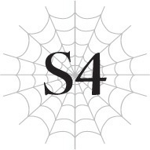

# Chương S4: Cuộc đối đầu định mệnh
*(Fateful Confrontation)*

---



Vào lúc Fei thả chúng tôi xuống khu vực biên giới nơi kết giới từng ngự trị, tộc Elf và quân đội Đế quốc đã bắt đầu giao tranh dữ dội.

Quân đội Elf tận dụng triệt để lợi thế của khu rừng, dùng thân cây làm khiên chắn và bệ đỡ chân để bắn ma pháp cùng cung tên từ xa vào kẻ địch.

Ngược lại, quân đội Đế quốc đang bị cản bước bởi vô số rễ cây trồi lên từ mặt đất cùng bộ giáp sắt nặng nề của chính họ.

Thoạt nhìn, có vẻ như tộc Elf đang chiếm thế thượng phong.

Tuy nhiên, chỉ bấy nhiêu thôi thì không thể ngăn cản quân đội Đế quốc.

Trừ phi tôi đánh bại kẻ đang đứng trước mặt mình ngay lúc này.

“Ồ, xem kìa xem kìa. Mày cũng ở đây cơ à?”

Hugo nhếch mép cười đầy khó ưa.

“Phải. Đến để đánh bại mày.”

“Ha! Nực cười thật đấy! Mày đòi đánh bại tao á? Mơ giữa ban ngày à!!”

Những làn sóng uy áp cuồn cuộn tỏa ra từ người Hugo, như thể cậu ta muốn chế ngự toàn bộ khu vực này.

“Yuri có sao không?”

Không thèm đếm xỉa đến cậu ta trong chốc lát, tôi hướng mắt ra sau vai Hugo.

Yuri đang nằm trên mặt đất, máu chảy ra nhiều đến mức đáng sợ.

Vừa dứt lời, tôi cảm thấy cô Oka đang run rẩy ở phía sau mình.

Nhìn vào tình hình này, chắc chắn cô chính là người đã hạ gục Yuri.

“Bọn tôi đang trị liệu cho cô ta rồi, ít nhất thì cũng không chết được đâu,” Sophia thản nhiên đáp.

Một cậu thiếu niên mà tôi chưa từng gặp bao giờ đang cứu chữa cho Yuri.

“Wald, ngoan ngoãn đưa cô ta đến nơi nào an toàn sau khi trị liệu xong nhé?”

--- PAGE BREAK ---

“...Được rồi.”

Cậu thiếu niên tên Wald tỏ vẻ bất mãn nhưng cuối cùng vẫn chấp nhận và gật đầu.

“Các người thực sự nghĩ chúng tôi sẽ để các người đưa cô ấy đi dễ dàng thế sao?” tôi vặn hỏi.

“Ồ? Hay cậu muốn bỏ mặc một cô gái bất tỉnh ngay trên chiến trường thế này? Với tôi thì thế nào cũng được thôi.”

Tôi không có câu trả lời nào thỏa đáng cho việc đó.

Nếu cứ để Yuri nằm lại trên chiến trường, cô ấy chắc chắn sẽ gặp nguy hiểm.

“Này, đừng có phớt lờ tao!”

Hugo chen vào giữa Sophia và tôi.

“Này, Natsume. Lâu rồi không gặp nhỉ?”

Tagawa cất tiếng gọi đầy thản nhiên, hoàn toàn ngó lơ cơn giận của Hugo.

“Hả? Mày là thằng nào?”

“Gì thế, tao đây mà. Tagawa Kunihiko.”

Hugo trông bỗng bối rối một cách kỳ lạ.

“Tagawa Kunihiko... Tagawa Kunihiko. Tagawa?”

Có chuyện gì thế này? Hugo đang cư xử rất lạ, ngay cả đối với cậu ta.

Lẽ nào cậu ta thực sự không nhớ Tagawa?

“Mà thôi kệ đi. Kẻ duy nhất tao có việc cần giải quyết ở đây là Shun. Câm miệng và cút sang một bên.”

Cảm thấy phẫn nộ vì bị gạt qua một bên dễ dàng như thế, Tagawa định bước lên trước nhưng tôi đã đưa tay ra ngăn lại.

Tôi phải tự mình đối mặt với Hugo.

“Hugo. Để tôi hỏi cậu một câu. Cậu không có ý định đầu hàng đúng không?”

“Tại sao tao phải đầu hàng? Tao sẽ dần mày một trận ra bã ngay tại đây, rồi bắt mụ Oka phải nếm mùi địa ngục trần gian.”

“Tôi hiểu rồi. Được thôi.”

Rõ ràng là không thể thương lượng hay thuyết phục cậu ta được nữa.

“Xin... xin hãy dừng lại,” cô Oka cất tiếng yếu ớt. “Cô phải tự tay giải quyết Hugo. Các em không được xen vào.”

Tôi lắc đầu. “Xin lỗi cô, nhưng em không còn lựa chọn nào khác.”

Cô Oka đã bị thương.

Dù vết thương trông không nguy hiểm đến tính mạng, nhưng rõ ràng cô không thể chiến đấu được nữa.

“Anna, làm ơn hãy trị liệu cho cô Oka.”

“Tuân lệnh Điện hạ.”

Tôi giao cô giáo cho Anna chăm sóc rồi bước một bước về phía Hugo.

--- PAGE BREAK ---

“Đợi đã!”

“Em không thể. Cô Oka, Hugo không chỉ là vấn đề của riêng cô. Em cũng phải tự mình giải quyết dứt điểm với cậu ta.”

Tôi nghe thấy cô Oka đang cố vùng vẫy ở phía sau, nhưng Katia đã giữ cô lại.

Cô ấy hẳn đã hạ quyết tâm chiến đấu với Hugo bằng cả mạng sống.

Nếu tôi chen ngang và chiến đấu thay cô, đó có thể là một sự sỉ nhục đối với quyết tâm ấy.

Nhưng tôi không thể lùi bước.

Tôi có nhiều lý do để chiến đấu với Hugo hơn cả cô Oka.

“Anh Hyrince, làm ơn hãy bảo vệ Anna và cô Oka.”

“Giao cho tôi.”

Bình thường, tôi chắc chắn anh ấy sẽ ngăn cản tôi tự ý đối mặt với đại tướng địch một mình.

Nhưng lần này thì tôi không thể nhường cho bất kỳ ai khác giải quyết được.

Tôi nghĩ Hyrince cũng hiểu điều đó.

“Sophia. Đừng có xen vào.”

“Lại thế nữa à? Lần này cho dù cậu có sắp chết tôi cũng không cứu đâu đấy nhé, rõ chưa?”

“Phải. Thế là được rồi.”

Tôi không ngờ Hugo lại bảo Sophia đừng can thiệp.

Thành thật mà nói, tôi nhẹ cả người.

Sophia rất mạnh.

Nếu cô ta không can thiệp, tôi có thể hoàn toàn tập trung vào Hugo.

“Mọi người, các cậu cũng đừng can thiệp nhé,” tôi bảo các đồng đội của mình.

Trong khi tiếng giao tranh dữ dội giữa tộc Elf và quân đội Đế quốc vang dội khắp bốn phía, Hugo và tôi đối đầu nhau trong im lặng.

Tay thủ thế kiếm, tôi dùng [Thẩm định] lên Hugo.

```
<Nhân tộc LV 61 Tên: Hugo Baint Renxandt
Trạng thái: HP: 3.169/4.831 (xanh lá) (chi tiết)
SP: 2.577/2.577 (vàng) (chi tiết)
MP: 1.542/1.711 (xanh dương) (chi tiết)
SP (đỏ): 2.663/3.255 +0 (chi tiết)

| Chỉ số | Giá trị |
|---|---|
| Sức tấn công vật lý trung bình | 3.889 (chi tiết) +400 |
| Sức công kích ma pháp trung bình | 998 (chi tiết) +200 |
| Sức phòng ngự vật lý trung bình | 1.255 (chi tiết) +200 |
| Kháng tính trung bình | 2.384 +200 (chi tiết) |
| Tốc độ trung bình | 2.939 (chi tiết) +400 |

Kỹ năng:
[Tự hồi phục HP LV 6] [Tốc độ hồi phục MP LV 2] [Giảm tiêu hao MP LV 2] [Tự hồi phục SP nhanh LV 7] [Giảm tiêu hao SP LV 7] [Cảm nhận Ma lực LV 3] [Thao tác Ma lực LV 2] [Ma Thần Đấu Pháp LV 2] [Truyền Ma Lực LV 2] [Ma lực Công kích LV 1] [Tăng cường Hủy diệt LV 4] [Tăng cường Cắt LV 4] [Tăng cường Va chạm LV 2] [Tăng cường Đâm LV 1] [Tăng cường Sốc LV 1] [Ngoại đạo Công kích LV 4] [Đấu Thần Đấu Pháp LV 2] [Truyền Năng lượng LV 2] [Năng lượng Công kích LV 5] [Cực ý Kiếm thuật LV 4] [Ném LV 2] [Cơ động Không gian LV 2] [Hợp tác LV 2] [Thống lĩnh LV 4] [Tập trung LV 10] [Gia tốc Tư duy LV 3] [Dự đoán LV 1] [Xử lý Tính toán LV 1] [Ký ức LV 1] [Đánh trúng LV 8] [Né tránh LV 8] [Ẩn mật LV 3] [Vô thanh LV 1] [Vô hương LV 1] [Thẩm định LV 10] [Chinh Phục] [Đờ Đẫn] [Thủy Ma pháp LV 1] [Lôi ma pháp LV 1] [Chú ma pháp LV 1] [Ma pháp Dị giáo LV 2] [Ma Vương LV 1] [Tôn Nghiêm LV 2] [Phẫn Nộ LV 4] [Phàm ăn LV 3] [Tham Lam] [Ái Dục] [Kháng Hủy diệt LV 1] [Kháng Va chạm LV 2] [Kháng Cắt LV 2] [Kháng Trạng thái bất thường LV 3] [Kháng Ngoại đạo LV 4] [Kháng Đau LV 7] [Tăng cường Thị giác LV 3] [Tăng cường Thính giác LV 2] [Tăng cường Khứu giác LV 2] [Tăng cường Vị giác LV 2] [Tăng cường Xúc giác LV 2] [Mở rộng Thần giới LV 3] [Sinh mệnh Tối thượng LV 10] [Ma Lượng Tích Trữ LV 2] [Bộc phát lực LV 5] [Bền bỉ LV 5] [Cự lực LV 8] [Vững chãi LV 4] [Thuật Giả LV 2] [Bảo hộ LV 2] [Chạy LV 9] [Cấm kỵ LV 9] [n% I = W]

Điểm kỹ năng: 217
Danh hiệu:
[Kẻ diệt quái vật] [Kẻ Thống Trị Tham Lam] [Kẻ diệt đồng minh] [Kẻ diệt nhân tộc] [Kẻ Thống Trị Ái Dục] [Kẻ tàn sát nhân tộc] [Kẻ Vô tình] [Kẻ tàn sát quái vật] [Bậc Thầy Điên Loạn] [Quán Quân] [Chỉ Huy] [Lãnh Chúa]
>
```

--- PAGE BREAK ---

Chỉ số của cậu ta loạn cào cào hết cả lên.

Xét tổng thể thì các chỉ số khá thấp, nhưng cậu ta lại sở hữu vô số kỹ năng.

Điểm kỹ năng của cậu ta là một con số lẻ kỳ lạ.

Đây là sức mạnh mà Hugo đã tích lũy được nhờ sử dụng [Tham Lam].

Chắc chắn cậu ta đã có được những kỹ năng mạnh mẽ hơn nhờ các danh hiệu.

Các danh hiệu [Kẻ Thống Trị Ái Dục] và [Kẻ Thống Trị Tham Lam] hẳn đã ban cho cậu ta những kỹ năng bá đạo, cùng với danh hiệu [Bậc Thầy Điên Loạn] mà tôi chưa từng nghe thấy bao giờ.

Điều thực sự làm tôi bận tâm là kỹ năng [Ma Vương].

Kỹ năng [Ma Vương] và [Anh Hùng] chỉ có thể đạt được bằng cách tiêu tốn một lượng điểm kỹ năng khổng lồ, hoặc tích lũy đủ độ thuần thục.

Vì Hugo luôn tự xưng mình là anh hùng chân chính, tôi không nghĩ cậu ta lại chủ động đi mua kỹ năng [Ma Vương] làm gì.

Có nghĩa là cậu ta đã nhận được nó thông qua việc tích lũy độ thuần thục.

Hiện tại, tôi vẫn chưa biết làm cách nào để tích lũy độ thuần thục cho kỹ năng [Ma Vương].

Nhưng với kỹ năng [Anh Hùng], nghe nói người ta có thể nhận được nó bằng cách hành xử đúng mực như một anh hùng thực sự.

Hyrince là một ví dụ, anh ấy đã có được kỹ năng [Anh Hùng] nhờ tích lũy độ thuần thục.

Thế nên có thể suy đoán rằng kỹ năng [Ma Vương] cũng có yêu cầu đạt được tương tự.

Và Hugo đã đáp ứng được những yêu cầu đó.

Cậu ta rốt cuộc đã gây ra những tội ác tày trời gì rồi?

Tôi kích hoạt [Ý chí chiến đấu] cùng [Đấu Thần Đấu Pháp] rồi nhìn thẳng vào mắt Hugo.

Nụ cười của cậu ta giống hệt như một kẻ đã hóa điên.

Như một kẻ không còn đường lui dù có muốn đi chăng nữa.

Im lặng, tôi giương kiếm hướng về phía người bạn học cũ của mình.

“Đến đây.”

--- PAGE BREAK ---

“Nhanh lên đi!”

Hugo ngoắc tay ra hiệu, thế là tôi lao thẳng lên trước.

Tôi vung kiếm chém xuống, nhưng Hugo đã dùng lưỡi kiếm của mình để đỡ đòn.

“Hự!”

Kiếm của chúng tôi ghì chặt vào nhau trong tích tắc, rồi Hugo dùng lực đẩy tôi ra và vung một đòn phản công về phía tôi.

Tôi lợi dụng đà đó để nhảy lùi lại né tránh, nhưng một luồng khói đen bỗng phun ra từ thanh kiếm của Hugo và đuổi theo tôi bén gót.

Dù bất ngờ nhưng tôi vẫn kịp dùng kiếm gạt phăng luồng khói đó đi.

Ra là vũ khí của Hugo là một thanh ma kiếm.

Có vẻ nó còn mang cả hiệu ứng thuộc tính Hắc ám.

Thế nhưng, uy lực của nó cũng chẳng có gì quá ấn tượng.

Thanh ma kiếm của Tagawa có lẽ còn mạnh hơn nhiều.

Tôi bao phủ thanh kiếm của mình bằng ánh sáng để đối phó với cậu ta.

Đây là đòn cường hóa bằng ma pháp của chính tôi, chứ không phải chức năng đi kèm của thanh kiếm.

Thanh kiếm bọc ánh sáng của tôi va chạm với luồng hắc ám từ kiếm của Hugo.

Luồng ánh sáng chém rách bóng tối và đánh bật thanh kiếm của Hugo ra sau.

“Cái gì?!”

Hugo loạng choạng thối lui, và tôi lập tức dùng chuôi kiếm thúc mạnh vào ngực cậu ta.

Cú đánh khiến cậu ta mất thăng bằng và ngã uỵch xuống đất.

“Cậu đã chịu đầu hàng chưa?”

Tôi chỉ mũi kiếm vào cổ cậu ta, cho Hugo thêm một cơ hội để quy hàng.

“Hừ! Đừng có tinh tướng chỉ vì ăn may được một đòn!”

Hugo gạt mũi kiếm của tôi ra, nhỏm dậy thật nhanh rồi lập tức thủ thế lại.

Thế rồi, với sự nhanh nhạy của một con thú dại, cậu ta lao vào tôi một cách điên cuồng.

Tôi bình tĩnh quan sát đường đi từ thanh kiếm đang vung loạn xạ của cậu ta rồi nghiêng mình né tránh đòn tấn công.

Rồi tôi lại gạt phăng thanh kiếm của cậu ta ra và quật ngã cậu ta xuống đất, hệt như lần trước.

“Cậu chịu đầu hàng chưa?” tôi lặp lại câu hỏi.

Cậu ta nhìn tôi với vẻ mặt không thể tin nổi, nhưng rồi một nụ cười toe toét lại hiện lên.

Tuy nhiên, nụ cười ấy cũng nhanh chóng vụt tắt.

--- PAGE BREAK ---

“Vô ích thôi. Ma pháp của cậu không có tác dụng với tôi đâu.”

Tôi có thể nhận ra cậu ta vừa cố thi triển một loại ma pháp nào đó lên tôi.

Tôi đoán cậu ta đã cố dùng [Chú ma pháp].

Tôi không rõ phép thuật đó có hiệu ứng gì, nhưng điều đó chẳng quan trọng.

Sức tấn công ma pháp của Hugo quá yếu, còn phòng ngự ma pháp của tôi lại quá cao.

Chưa kể, tôi còn sở hữu kỹ năng [Long Lực] nhận được khi đánh bại con địa long trong [Mê cung Lớn Elroe].

Chỉ cần tôi kích hoạt nó để làm suy giảm uy lực phép thuật, các đòn ma pháp của Hugo sẽ không thể chạm vào tôi.

“Đầu hàng đi.”

“Đầu hàng cái con khỉ!”

Hugo lại gượng dậy, vung kiếm loạn xạ.

Không còn một chút logic nào trong các động tác của cậu ta nữa; cậu ta chỉ đang quơ quào vũ khí một cách vô định.

Trông chẳng khác gì một đứa trẻ đang ăn vạ.

Thanh kiếm lao về phía tôi, và tôi né tránh nó trong gang tấc.

Tôi giáng một đòn chuẩn xác vào bàn tay đang cầm kiếm của Hugo, khiến thanh kiếm văng khỏi tay cậu ta.

Tiếp theo, tôi siết chặt nắm đấm tay trái rồi thụi thẳng vào ngực của Hugo khi cậu ta đã hoàn toàn không còn khả năng tự vệ.

“Hự!”

Hugo rên rỉ đau đớn rồi gục xuống đất.

Nhìn cậu ta ôm hông rên rỉ, lòng tôi không khỏi dấy lên một chút cảm giác nhẹ nhõm.

“Không thể nào. Thế giới này tồn tại là vì tao cơ mà? Tại sao tao lại không thể thắng chứ?”

Vẫn quỳ sụp dưới đất, Hugo điên cuồng lẩm bẩm một mình.

Lẽ nào cậu ta thực sự vẫn tin vào điều đó sao?

“Thế giới này không phải của cậu. Nó thuộc về tất cả những sinh mệnh đang sinh sống trên đó, chứ không thuộc về bất kỳ một cá nhân nào. Đặc biệt là cậu đấy.”

Hugo lường tôi đầy giận dữ.

Nhưng rõ ràng là cậu ta vẫn chưa thể đứng dậy nổi do cú đấm vào bụng trước đó của tôi.

“Ồ? Nghe hay ho và cao thượng đấy chứ. Nhưng vì các cậu chẳng hề hay biết gì về sự thật, nên nghe mới nực cười làm sao.”

Người vừa cất tiếng bước lên phía trước với một nụ cười đầy khinh bỉ.

--- PAGE BREAK ---

Sophia Keren.

Một người tái sinh giống như chúng tôi.

Và theo như những gì cô Oka nói, cô ta là kẻ thù đã đứng về phe của những kẻ được gọi là các quản trị viên.

Khi Sophia tiến lên, Katia, Tagawa và Kushitani cũng lập tức bước lên kề vai sát cánh bên tôi.

Vũ khí tuốt vỏ, sẵn sàng chiến đấu.

Họ đã chuẩn bị để tham chiến bất cứ lúc nào.

Tuy nhiên, Sophia chỉ đứng đó một cách ung dung, cùng với một nam một nữ đứng ở hai bên.

“Sophia!” Hugo gầm lên khi vẫn nằm bò trên đất. “Giết sạch bọn chúng đi!”

“Hừm. Tôi nên làm thế nào bây giờ ta?”

Trông Sophia có vẻ rất thích thú.

Ánh mắt của cô ta giống như đang nhìn một con côn trùng đáng ghét.

Nhưng tôi cứ tưởng hai người bọn họ là đồng minh chứ?

“Đến nước này rồi mà còn đùa giỡn hả!”

“Phải rồi, nhưng cậu không nhớ mình đã nói gì với tôi sao? Tôi cứ tưởng là cậu cấm tôi xen vào cơ đấy.”

“Ư...”

Hugo giật nảy mình.

“Hơn nữa, bọn tôi cũng chả còn giá trị lợi dụng gì từ cậu nữa rồi,” Sophia thản nhiên nói tiếp.

Cô ta nói điều đó một cách nhẹ nhàng đến mức ban đầu không ai trong chúng tôi hiểu được ý nghĩa của nó.

Cứ như thể cô ta chỉ đang buôn chuyện phiếm thông thường vậy.

“C-cái gì?”

Chính Hugo là người đầu tiên phản ứng trước những lời nói lạnh gáy ấy.

“Merazophis, tình hình thế nào rồi?”

Sophia ngó lơ Hugo và cất tiếng gọi một người khác.

Ban đầu tôi tưởng cô ta đang nói chuyện với một trong hai người đứng cạnh mình, nhưng tôi đã lầm.

“Chúng tôi đã bắt đầu cuộc xâm lăng rồi.”

“Vậy sao? Hơi sớm quá không đấy?”

Người đàn ông xuất hiện đột ngột như thể vừa chui ra từ cái bóng của Sophia vậy.

Không còn cách nào khác để mô tả sự xuất hiện bất thình lình của ông ta.

Ông ta sở hữu gương mặt cực kỳ nghiêm nghị cùng làn da nhợt nhạt của một kẻ trông như thể sắp chết đến nơi bất cứ lúc nào.

“Hả?! Sao ông lại ở đây?!”

--- PAGE BREAK ---

Tagawa kinh ngạc la lớn.

“Cậu biết người đó à?”

“Hắn ta là một thống lĩnh của quân đội ma tộc.”

Tôi nín thở.

Một thống lĩnh của quân đội ma tộc ư?

Một kẻ như thế xuất hiện ở đây để làm gì chứ?

Lẽ nào ma tộc đã biết trước việc Hugo mất kiểm soát và chọn đúng thời điểm này để tấn công?

Không, xét về mặt chiến lược thì điều đó hoàn toàn vô lý.

Thế rồi, tôi bỗng nhiên hiểu ra ý nghĩa đằng sau những lời của Sophia.

“Chả còn giá trị lợi dụng.” Điều đó chỉ có thể mang một ý nghĩa duy nhất.

Họ đã âm thầm giật dây từ phía sau, thao túng Hugo để điều khiển quân đội Đế quốc.

“Các người thuộc phe ma tộc sao?!”

“Nhạy bén đấy. Nhưng nhận ra điều đó vào lúc này thì hơi muộn rồi. Dù sao thì cuộc xâm lăng cũng đã bắt đầu.”

Bảo sao tôi thấy tiếng động giao tranh xung quanh có vẻ dữ dội hơn bình thường.

Nếu Sophia nói thật, quân đội ma tộc đã chính thức phát động đợt tấn công.

Quân đội Đế quốc chỉ là mồi nhử.

Trong lúc tộc Elf bận đối phó với bọn họ, quân ma tộc đã tung ra một đòn tập kích bất ngờ.

“Sophia, con cặn bã kia, mày dám lợi dụng tao!!”

Sophia hoàn toàn ngó lơ tiếng la hét của Hugo.

Cứ như thể cô ta không muốn lãng phí thời gian với cậu ta vậy.

Không, cứ như thể sự tồn tại của cậu ta vốn dĩ chả có ý nghĩa gì.

“Shun, chúng ta phải làm gì đây?” Katia khẽ hỏi tôi.

Tôi cũng chả biết phải làm sao trong tình cảnh này.

Nhưng tôi biết rõ chúng tôi không thể để mặc Sophia tự ý lộng hành.

Cô ta là thực thể mạnh nhất mà tôi từng đối đầu từ trước đến nay.

Tôi không thể cứ thế để cô ta muốn làm gì thì làm.

“Chúng ta phải đánh bại Sophia.”

“Ái chà, tuyên bố hùng hồn ghê nhỉ.”

Sophia bật cười đầy chế giễu.

Nụ cười của cô ta lộ rõ vẻ tự tin tuyệt đối rằng chúng tôi hoàn toàn không đủ sức làm điều đó.

--- PAGE BREAK ---

“Cậu quả thực đã hạ gục được con rối nhỏ này của bọn tôi, nhưng nếu cậu nghĩ tôi cũng chỉ cùng đẳng cấp với nó thì cậu sẽ phải hối hận đấy.”

Giọng điệu của cô ta nghe có vẻ nhẹ nhàng và bông đùa, nhưng trong ánh mắt thì chẳng có lấy một tia vui vẻ nào.

Đúng lúc đó, cậu thiếu niên tên Wald bế Yuri lên rồi cùng cô rút lui.

Nhìn theo bóng họ rời đi, người đàn ông tên Merazophis liền rút thanh kiếm của mình ra.

Cô gái còn lại chỉ đơn giản là đứng im ở phía sau Sophia, không hề nhúc nhích.

“Được rồi, nếu cậu đã tha thiết muốn thế, tôi sẽ chơi với các cậu một lát.”

Sophia dang rộng hai tay, thản nhiên mời gọi chúng tôi lao lên.

Không bỏ lỡ cơ hội, tôi lao thẳng lên phía trước.

---

[◀ Chương trước: Chương 4: Hãy thờ phụng tôi đêêê!](04_worship_meee.md) | [Chương tiếp theo: Đoạn phụ: Nỗi u sầu của Lãnh chúa ▶](interlude_the_lords_anguish.md)
