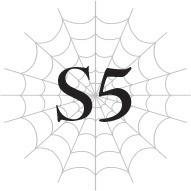
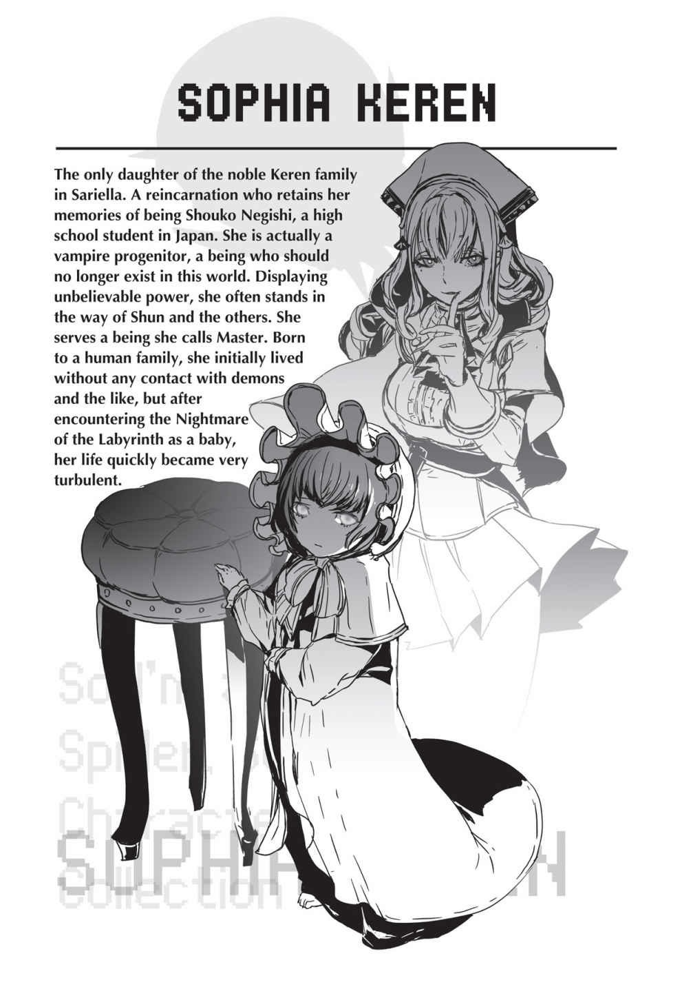

# Chương S5: Tổ đội Anh hùng đối đầu Công chúa Ma cà rồng
*(Hero Party vs Vampire Princess)*

---

---

Tôi không biết nhiều về Sophia.

Cả ở thế giới này lẫn kiếp trước cũng vậy.

Tôi chỉ biết kiếp trước tên cô ta là Negishi Shouko, nhưng nếu hỏi tôi cô ta là người thế nào, tôi không nghĩ mình có thể trả lời chắc chắn được bất kỳ điều gì.

Mối quan hệ giữa chúng tôi ít ỏi đến thế đấy.

Tôi không nghĩ chúng tôi từng có một cuộc trò chuyện thực sự nào.

Thực chất, cuộc đối thoại vừa rồi có lẽ là lần giao tiếp dài nhất giữa chúng tôi từ kiếp trước cho đến nay.

Tôi chẳng biết gì về cô ta cả.

Cả khi đó lẫn bây giờ.

Tôi không biết cô ta nghĩ gì khi quyết định nhúng tay vào tất cả những chuyện này.

Nhưng những gì cô ta đã làm cho thấy sự coi thường mạng sống con người đến tột cùng.

Cô ta đã tiếp tay gieo rắc tai ương xuống đầu những người mà anh Julius từng liều mạng bảo vệ.

Tôi không thể tha thứ cho cô ta vì điều đó.

Thế nên, tôi phải ngăn cô ta lại ngay tại đây.

Tôi rút kiếm ra và lao lên với tất cả quyết tâm, nhưng cô ta dễ dàng gạt phăng đòn đánh của tôi bằng thanh kiếm bản to của mình.

“Hự!”

Một giây trước cô ta còn chưa cầm thanh kiếm bản to này, nó chỉ vừa xuất hiện từ trong bóng của cô ta.

Tôi cứ ngỡ đó là [Ma pháp Bóng tối], nhưng có vẻ không phải.

Đó có lẽ là hiệu ứng từ một kỹ năng bí ẩn nào đó của cô ta.

Dường như cô ta cũng cất giữ thanh kiếm bản to trong bóng của mình bằng cách nào đó, hệt như người đàn ông tên Merazophis vừa chui ra từ cái bóng ấy cách đây không lâu.

--- PAGE BREAK ---

Thanh đại kiếm hai tay khổng lồ trông có vẻ không hề hợp với vóc dáng nhỏ nhắn của Sophia.

Thế mà cô ta lại vung nó chỉ bằng một tay.

Cơ thể tôi bị đánh bật ra sau như thể hoàn toàn không có chút trọng lượng nào.

Tôi nhanh chóng xoay người trên không trung để đáp xuống bằng hai chân, nhờ vậy không phải chịu chút sát thương nào.

Tuy nhiên, tôi có thể cảm nhận khoảng cách sức mạnh giữa hai bên rõ rệt đến mức nhức nhối.

Tôi đã lao lên với toàn bộ sức lực, vậy mà cô ta chỉ đỡ đòn và gạt tôi ra một cách dễ dàng.

Có thể chắc chắn rằng Sophia sở hữu một kỹ năng có thể triệt tiêu ma pháp.

Nếu vậy, cách duy nhất để đánh bại cô ta là cận chiến vật lý.

Thế nhưng, cuộc chạm trán ngắn ngủi vừa rồi đã làm sáng tỏ một điều.

Tôi không thể thắng nổi cô ta.

Dù không thể [Thẩm định] được cô ta, tôi biết khoảng cách chỉ số giữa chúng tôi chắc chắn là một trời một vực.

Nhưng tôi đã chuẩn bị tinh thần cho thực tế đó.

Kể từ lần đầu tiên chạm trán ở hoàng đô, tôi đã thừa hiểu rằng Sophia mạnh hơn tôi rất nhiều.

Nhưng dù chỉ số của cô ta có cao hơn, tôi vẫn sẽ tìm cách chiến thắng.

“Shun! Đừng có lao lên một mình như thế chứ!”

Katia bước lên đứng bên cạnh tôi.

“Tớ và Asaka sẽ giữ chân Merazophis. Phần còn lại trông cậy vào các cậu đấy.”

Tagawa và Kushitani lao về phía Merazophis, người cũng đã vào tư thế sẵn sàng chiến đấu.

“Shun, cô cũng có thể chiến đấu.”

Cô Oka đứng dậy, giương sẵn cánh cung.

Anna cũng đã trị liệu xong, giúp cô ấy rảnh tay để quay lại tiền tuyến.

Cả anh Hyrince, người vừa bảo vệ hai người họ, cũng bước lên.

Đúng vậy.

Tôi không cô đơn một mình.

Có thể bản thân tôi không làm được, nhưng nếu mọi người cùng đồng lòng, tôi biết chúng tôi có thể chiến thắng.

“Xem ra là năm chọi hai rồi. Hy vọng cô không phiền,” anh Hyrince bước lên trước, giương khiên phòng thủ.

“Ồ, tôi không phiền chút nào đâu. Thực ra, năm chọi một đi cho tiện,” Sophia liếc nhìn cô gái phía sau mình.

Cô gái kia cau mặt tỏ vẻ khó chịu nhưng nhanh chóng rút lui.

--- PAGE BREAK ---

> **SOPHIA KEREN**
> Con gái duy nhất của gia tộc quý tộc Keren ở Sariella. Một người tái sinh vẫn giữ được ký ức kiếp trước là Negishi Shouko, một học sinh trung học ở Nhật Bản. Thực chất cô là một ma cà rồng Chân Tổ, một thực thể lẽ ra không nên tồn tại trên thế giới này nữa. Sở hữu sức mạnh khó tin, cô thường xuyên cản bước Shun và những người khác. Cô phục vụ cho một thực thể mà cô gọi là Chủ nhân. Sinh ra trong một gia đình nhân tộc, ban đầu cô sống mà không hề có bất kỳ liên hệ nào với ma tộc hay những loài tương tự, nhưng sau khi chạm trán với Cơn Ác Mộng của Mê Cung khi còn là một đứa trẻ sơ sinh, cuộc đời cô đã nhanh chóng trở nên đầy sóng gió.

---

“Trông cô có vẻ chẳng lo lắng chút nào nhỉ.”

“Tôi không lo một chút nào hết,” Sophia thản nhiên đáp lại.

Muốn lợi dụng lúc cô ta đang chủ quan, cô Oka bắn một mũi tên về phía Sophia.

Một đòn tập kích hoàn hảo ngay giữa cuộc đối thoại.

Trong thoáng chốc, hành động đó có vẻ hơi hèn hạ đối với tôi, nhưng tôi phải tự nhắc nhở bản thân rằng cô Oka cũng đang tuyệt vọng như tất cả chúng tôi.

Hơn nữa, một đòn tập kích không thể bị coi là chơi bẩn nếu nó hoàn toàn vô dụng.

Sophia đưa bàn tay rảnh rỗi còn lại ra và bắt gọn mũi tên.

Phản xạ của cô ta thật đáng sợ.

Lẽ ra cô ta không cần phải bắt lấy mũi tên thay vì né tránh.

Tôi chắc chắn rằng né tránh sẽ nhanh và dễ dàng hơn nhiều.

Nhưng cô ta chọn bắt lấy nó có lẽ là để phô trương sức mạnh áp đảo của mình rõ ràng hơn.

Tuy nhiên, dù bất lợi có rõ ràng đến đâu, vẫn có những trận chiến mà ta tuyệt đối không thể lùi bước.

Anh Hyrince lao lên, đẩy mạnh tấm khiên về phía trước.

Sophia ném mũi tên sang một bên rồi dùng cả hai tay siết chặt thanh kiếm bản to.

Ngay lập tức, một tiếng va chạm kim loại đanh tai vang lên giữa không trung.

Sophia đã đỡ gọn cú tông mạnh của anh Hyrince bằng thanh kiếm bản to.

Vóc dáng mảnh mai của cô ta không hề lay chuyển dù chỉ một phân trước bộ giáp sắt nặng nề của anh Hyrince.

Nhưng ngay lập tức, Katia và tôi từ hai bên sườn anh Hyrince bồi thêm đòn tấn công.

Thanh kiếm của tôi và thanh kiếm liễu của Katia đồng thời đâm về phía cô ta.

Thế rồi, trong tích tắc, tôi không hiểu chuyện gì đã xảy ra với mình nữa.

Tầm nhìn đảo lộn, tôi đập mạnh người xuống đất mà không kịp kiểm soát đà rơi của mình.

Dù còn đang hoang mang, tôi vẫn lập tức bật dậy.

Một cơn đau ê ẩm chạy dọc bàn tay tôi, như thể nó đang dần tê dại đi.

Khi nhìn thấy Katia và anh Hyrince cũng bị đánh ngã nhào dưới đất giống mình, còn Sophia đang thu thế sau một đường vung kiếm, tôi liền hiểu ra mọi chuyện.

Sophia đã dùng thanh kiếm bản to đánh bật cả ba chúng tôi ra sau.

Và chỉ bằng một đường kiếm duy nhất.

Chắc chắn nó đã đánh trúng anh Hyrince trước, sau đó tiếp đà đánh trúng Katia và tôi chỉ vài phần giây sau đó.

--- PAGE BREAK ---

Katia vẫn chưa thể gượng dậy nổi, và thanh kiếm liễu của cô ấy đã gãy vụn dưới đất.

Sophia hẳn là đã nhắm vào vũ khí của chúng tôi.

Thanh kiếm của tôi may mắn chống đỡ được đòn đánh, nhưng dư chấn chấn động dữ dội đã làm tổn thương nghiêm trọng đến cổ tay tôi.

Thú thật, việc tôi không để rơi thanh kiếm gần như là một phép màu.

Nhưng chuyện gì sẽ xảy ra nếu Sophia không nhắm vào vũ khí mà chém thẳng vào người chúng tôi?

Hình ảnh Katia và tôi bị chém đứt làm đôi xẹt qua tâm trí.

Tôi rùng mình run sợ trong thoáng chốc.

Cô ta chắc chắn có thể làm được điều đó.

Sophia hẳn là đã cố ý nhắm vào vũ khí để tránh giết chết chúng tôi.

Cô Oka tiếp tục bắn thêm nhiều mũi tên và Anna niệm ma pháp về phía cô ta, nhưng cô ta chỉ khẽ nghiêng đầu né mũi tên, còn đòn ma pháp thì bị triệt tiêu hoàn toàn trước khi kịp chạm vào người cô ta.

“Ồ, phải rồi. Một bán Elf sao? Lạ lẫm thật đấy,” Sophia hướng ánh mắt về phía Anna.

Anh Hyrince đứng dậy, giương chiếc khiên lên như để chắn tầm nhìn của cô ta, nhưng Sophia có vẻ vẫn đang mải suy nghĩ điều gì đó, hoàn toàn ngó lơ anh.

Nhân lúc cô ta có vẻ lơ là, tôi lao về phía cô ta với thanh kiếm trong tay.

Nhưng tôi biết rõ cô ta không thực sự mất tập trung; chỉ là cô ta không thèm bận tâm mà thôi.

Một lần nữa, cô ta dễ dàng né tránh đòn tập kích.

Tuy nhiên, tôi đã lường trước điều đó.

Tôi lập tức thay đổi quỹ đạo kiếm của mình, chém ngược lại phía Sophia.

Vì thanh kiếm bản to của cô ta rất lớn và nặng, nó không được thiết kế để xoay xở trong không gian hẹp.

Dựa vào sức mạnh của cô ta mà tôi chứng kiến từ đầu đến giờ, cô ta vẫn có thể xoay xở khá nhanh với nó, nhưng chắc chắn phải có giới hạn.

Nếu không thể đánh bại cô ta bằng sức mạnh cơ bắp thuần túy, chúng tôi sẽ thắng bằng tốc độ!

Tôi dịch chuyển thanh kiếm của mình chuẩn xác nhất có thể, cẩn thận kiểm soát lực tay.

Bằng cách thực hiện liên tiếp nhiều đường đâm kiếm nhất có thể, tôi cố gắng kìm hãm chuyển động của thanh kiếm bản to kia.

Đúng như dự đoán, thanh đại kiếm dài không thích hợp cho các đòn phản công nhanh liên tục, và Sophia bắt đầu phải dùng bản dẹt của lưỡi kiếm để tự vệ.

Sau đó cô Oka bắn thêm nhiều mũi tên phụ trợ, ép cô ta lùi sâu hơn nữa.

Lần này, Sophia buộc phải né tránh những mũi tên vì không còn thời gian để bắt lấy chúng.

--- PAGE BREAK ---

Tôi dồn dập tấn công bằng kiếm nhiều hơn, cố gắng dồn cô ta vào thế bí.

Thế này có thể hiệu quả!

Nhưng ngay khi ý nghĩ đó xẹt qua đầu, tôi nhìn thấy chân của Sophia di chuyển từ góc mắt.

Ngay giây tiếp theo, một lực tác động cực mạnh giáng thẳng vào bụng tôi.

“Hự!”

Một tiếng rên bật ra khỏi miệng tôi, bị tống ra ngoài cùng toàn bộ không khí trong lồng ngực.

Cơ thể tôi bị bắn bay đi, nhưng cú ngã đau điếng đập lưng xuống đất đã không xảy ra.

Nhìn lên, tôi thấy gương mặt anh Hyrince.

Anh ấy chắc chắn đã đỡ được tôi khi tôi bị bắn bật ra sau.

“Cậu không sao chứ?!”

“Vâng, em cám ơn anh.”

Thực ra tôi không hề ổn chút nào, nhưng tôi giữ kín chuyện đó trong lòng.

Bụng tôi vẫn đau nhói âm ỉ khi tôi nhanh chóng thoát khỏi vòng tay đỡ của anh Hyrince.

Quá rõ ràng chuyện gì đã xảy ra lần này rồi.

Cô ta đã đá tôi.

Tôi chưa bao giờ nghĩ cô ta có thể tung một cú đá trong tình huống đó.

“Đường kiếm của cậu không tệ, nhưng kiếm thuật của cậu quá khuôn sáo và bài bản rồi đấy. Cậu có biết như thế sẽ dễ bị dính đòn bẩn kiểu này không hả?”

Giọng nói của Sophia tỏ vẻ thờ ơ, thậm chí có phần như đang nói chuyện thân mật.

Im lặng, tôi lại giơ thanh kiếm của mình lên.

Cô ta nói đúng, tất nhiên rồi.

Tôi có nhiều kinh nghiệm luyện tập và chiến đấu với quái vật, nhưng lại có rất ít kinh nghiệm thực chiến với con người.

Điều đó có nghĩa là tôi rất yếu trước những đòn tấn công bất ngờ và cũng dễ dàng bị bắt bài.

Giờ đây, tôi thực sự nhận thức được một cách đau đớn rằng khoảng cách giữa tôi và Sophia còn lớn hơn nhiều so với những gì tôi tưởng tượng.

Nó không chỉ nằm ở chỉ số.

Cô ta đã chứng kiến nhiều cảnh đổ máu hơn tôi và trải qua nhiều trận chiến sinh tử thực tế hơn rất nhiều.

Điều đó hiển hiện cực kỳ rõ ràng, dù cuộc đối đầu của chúng tôi từ đầu đến giờ diễn ra rất ngắn ngủi.

Ở ngay gần đó, tôi có thể nghe thấy âm thanh Tagawa và Kushitani đang giao chiến với Merazophis.

--- PAGE BREAK ---

Tuy nhiên, tôi không thể phân tâm ngoảnh lại nhìn.

Tôi không thể rời mắt khỏi Sophia dù chỉ một tích tắc.

Chỉ cần lơ là cảnh giác dù chỉ một giây, tôi có cảm giác đáng sợ rằng tất cả sẽ chấm dứt.

Dẫu vậy, tôi vẫn kịp nhận thấy ánh mắt của Katia.

Vẫn đang quỳ rạp dưới đất, cô ấy dường như đang cố gắng dùng ánh mắt để báo hiệu điều gì đó cho tôi.

Hiểu được ý đồ của cô ấy, tôi tập trung cao độ tinh thần chờ đợi thời cơ.

“Hửm. Mình nên làm thế nào đây ta? Mình biết mình phải tiêu diệt toàn bộ tộc Elf ngoại trừ cô Oka, nhưng bán Elf thì nằm ở đâu trong phương trình này nhỉ?”

Sophia hoàn toàn không nhận ra.

Chúng tôi đang ở giữa trận chiến sinh tử, thế mà đầu óc cô ta rõ ràng đang phiêu du nơi khác, thản nhiên như không có chuyện gì.

Chính vào lúc đó, Katia hoàn thành câu ma pháp của mình.

Ngay khoảnh khắc ấy, tôi lập tức lao lên.

Katia đã thi triển một câu thần chú [Thổ Ma pháp].

Thay vì tấn công trực tiếp vào Sophia, nó làm rung chuyển mặt đất bên dưới chân chúng tôi.

Khả năng triệt tiêu ma pháp của Sophia dường như vô dụng đối với loại ma pháp tác động lên địa hình đất cát thay vì tấn công trực diện vào cô ta, nên câu chú đã thành công.

Mặt đất rung chuyển dữ dội, khiến tư thế đứng của Sophia hơi loạng choạng một chút.

Tôi lập tức nhắm vào sơ hở ngắn ngủi đó.

Đây là cơ hội chiến thắng duy nhất còn sót lại của chúng tôi!

Sophia đón nhận đòn tấn công quyết định của tôi bằng một nụ cười.

Như thể cô ta đang giễu cợt nỗ lực thảm hại của chúng tôi.

Nhưng rồi, nụ cười ấy chợt tắt ngấm.

Lướt qua người tôi, mũi tên của cô Oka lao vun vút về phía Sophia.

Cô ta không thể nhìn thấy mũi tên đó từ trước, vì nó đã được ẩn giấu trong bóng của tôi.

Chúng tôi không hề lên kế hoạch trước, nhưng chắc chắn cô Oka đã nhận ra sơ hở mà Katia tạo ra.

Vẫn chưa kịp lấy lại thăng bằng, Sophia không thể né tránh mũi tên.

Cô ta không còn cách nào khác ngoài việc dùng kiếm chặn nó lại, rồi tìm cách đỡ đòn của tôi.

Lần này, nụ cười của Sophia hoàn toàn biến mất.

Bởi chiếc khiên của anh Hyrince đã tông mạnh vào thanh kiếm của cô ta.

Một cú ném khiên.

Khiên của anh Hyrince không chỉ là một giáp vệ. Nó còn là một vũ khí tuyệt vời.

--- PAGE BREAK ---

Chỉ riêng trọng lượng của chiếc khiên đã biến nó thành một món vũ khí va chạm thượng hạng, và khi ném đi, nó chẳng khác nào một quả đại pháo.

Tấm khiên của anh Hyrince tông trúng ngay vào khoảnh khắc Sophia đang cố gắng lấy lại tư thế sau khi đỡ mũi tên của cô Oka.

Ngay cả cô ta cũng không thể chống đỡ lực va chạm đó, thanh kiếm bản to trong tay cô ta bị hất văng ra sau.

Nhìn cô ta hoàn toàn mất đà thăng bằng, tôi vung thanh kiếm chém mạnh xuống cơ thể Sophia.

“Vừa rồi cậu thực sự nên nhắm vào cổ tôi chứ nhỉ, đúng không?”

Lời nhận xét thản nhiên ấy khiến tôi kinh ngạc đến mức câm lặng.

Thanh kiếm của tôi chắc chắn đã chém trúng cơ thể Sophia.

Nhưng cô ta dường như không phải chịu chút tổn thương nào.

Lưỡi kiếm bị chặn lại bởi một vật gì đó cực kỳ cứng ngay dưới đường chém.

Khi nhìn vào cổ của Sophia từ khoảng cách cực kỳ gần, tôi liền hiểu cô ta ám chỉ điều gì.

Phía sau gáy của cô ta được che chở bởi một thứ gì đó lấp lánh như kim loại.

Giống hệt như lớp vảy cứng cáp của phi long hay rồng vậy.

“Tôi phải thừa nhận là đòn đó cũng không tệ đâu. Nhưng mà nó không có tác dụng,” Sophia vung chân đá tôi một cú nữa.

Tôi không thể hoàn toàn chống đỡ được cú đá đó, nó lại đánh bật tôi ra sau như lần trước, cho đến khi được anh Hyrince đỡ lấy một lần nữa.

Nhưng lần này, tôi chưa thể gượng dậy thoát khỏi vòng tay anh Hyrince ngay được.

Tôi đã dồn toàn bộ sức mạnh vào đường kiếm vừa rồi.

Phải, tôi đã né tránh các vị trí hiểm huyệt để không giết chết cô ta, nhưng tôi hoàn toàn không hề nương tay.

Thế mà đòn tấn công đó lại chẳng hề gây ra cho cô ta bất kỳ một chút đau đớn nào.

Cô ta chiếm thế thượng phong tuyệt đối về cả chỉ số lẫn kỹ năng, vậy mà chúng tôi đã bằng cách nào đó tạo ra được một cơ hội hoàn hảo ngắn ngủi.

Nhưng giờ đây, nụ lực đó đã trở nên hoàn toàn vô nghĩa.

Nếu chỉ đơn thuần là thất bại, có lẽ chúng tôi vẫn có thể tạo ra một cơ hội tương tự khác.

Nhưng chiêu này sẽ không hiệu quả lần thứ hai.

Ma pháp không có tác dụng với Sophia.

Thế nên Anna, người vốn chỉ biết dùng ma pháp để chiến đấu, hoàn toàn không thể chạm vào cô ta dù chỉ một sợi tóc.

--- PAGE BREAK ---

Nếu ma pháp vô dụng, hy vọng duy nhất của chúng tôi là cận chiến vật lý.

Nhưng đòn tấn công dồn toàn lực của tôi thậm chí chẳng hề hấn gì đối với Sophia.

Điều đó có nghĩa là cả ma pháp lẫn đòn đánh vật lý đều không thể đả thương nổi cô ta.

Nếu cả hai đều vô dụng, nếu khả năng phòng ngự của cô ta bất khả xâm phạm đến thế, thì chúng tôi biết chiến đấu thế nào đây?

Lần đầu tiên trong đời, tôi cảm nhận được nỗi kinh hoàng khi bản thân thực sự bất lực.

--- PAGE BREAK ---

---

[◀ Chương trước: Đoạn phụ: Nỗi u sầu của Lãnh chúa](interlude_the_lords_anguish.md) | [Chương tiếp theo: Chương 5: Những mưu đồ trỗi dậy ▶](05_machinations_in_motion.md)
