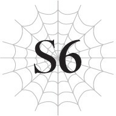

# Chương S6: Cuộc hội ngộ kinh hoàng
*(A Terrible Reunion)*

---

---

Tôi phải làm sao đây?

Làm sao tôi có thể thắng được Sophia?

Không, nói đúng hơn là làm thế nào tôi mới có thể gây được sát thương cho Sophia đây?

Liệu tôi có thể đánh bại cô ta được không?

Trong lúc vẫn được anh Hyrince đỡ lấy, tôi vắt óc suy nghĩ cho đến khi đôi cánh lớn của Fei đột ngột che khuất tầm mắt của tôi khỏi Sophia.

“Gì đây? Cuối cùng cũng quan sát xong rồi hả?”

Nghe những lời của Sophia, tôi mới nhận ra từ đầu trận chiến đến giờ Fei hoàn toàn không hề tham chiến.

Tôi từng nghĩ rằng cậu ấy cho rằng cơ thể rồng khổng lồ của mình sẽ gây cản trở cho chúng tôi, nhưng có lẽ tôi đã nhầm.

“Đúng vậy đấy.”

Giao tiếp thông qua [Thần giao cách cảm], giọng nói của Fei nghe có vẻ khác hẳn so với thường ngày.

“Dù sao thì, tôi muốn đầu hàng. Cô có thể tha mạng cho chúng tôi được chứ?”

Tôi ngơ ngác nhìn tấm lưng của Fei mà không thể tin vào mắt mình.

Không thể nào.

Chuyện này hoàn toàn không giống cậu ấy chút nào.

Ngay cả ở kiếp trước, Fei luôn là một kẻ bướng bỉnh và cực kỳ hiếu thắng.

Tôi không thể tin được rằng cậu ấy lại chấp nhận nhận thua trước cả khi chiến đấu.

Nhưng đồng thời, dù có mâu thuẫn thế nào đi nữa, một phần trong tôi lại nghĩ đây chính xác là những gì Fei sẽ làm.

Thực ra Fei rất quan tâm đến chúng tôi.

Có lẽ khi nhìn thấy tôi không thể động được vào người Sophia, cậu ấy đã xác định rằng chúng tôi không thể thắng trận này, và đó là lý do cậu ấy giơ cờ trắng.

Để bảo vệ chúng tôi.

--- PAGE BREAK ---

“Hửm.”

Sophia khẽ gõ nhẹ vào cằm đầy suy tư trước lời tuyên bố của Fei.

Một nụ cười thoáng qua trên khuôn mặt cô ta, như thể cô ta thấy chuyện này vô cùng thú vị.

“Nên cô có thể biết điều gì sẽ xảy ra nếu cố chiến đấu với tôi, hửm?”

“Đại khái thế,” Fei đáp lời.

Điều đó có nghĩa là cậu ấy đã biết ngay từ trước khi trận chiến bắt đầu rằng chúng tôi không bao giờ có thể đánh bại được Sophia.

“Chà, chắc chắn không phải nhờ Thẩm định rồi. Trực giác của loài rồng chăng?”

“Đại loại vậy. Giống như linh cảm thôi, không phải thứ tôi có thể giải thích rõ ràng được, cô biết đấy?”

Fei biết rõ Sophia mạnh đến mức nào.

Ngay giây phút đầu tiên nhìn thấy cô ta ở thủ đô, cậu ấy đã lập tức chọn cách bỏ chạy mà không hề chiến đấu.

Chắc hẳn cậu ấy đã biết từ thời điểm đó rằng chúng tôi không thể thắng nổi Sophia.

“Nếu cô biết họ không có cơ hội thắng, sao cô không ngăn cản bạn mình lại?” Sophia gặng hỏi.

“Dù tôi có nói thì Shun cũng sẽ không nghe đâu.”

Câu trả lời của cậu ấy giáng một đòn chí mạng vào tâm can tôi hơn bất kỳ điều gì khác.

Là lỗi của tôi sao?

Đúng vậy, kể cả khi Fei có cố bảo tôi rằng chúng tôi không thể thắng, tôi chắc chắn vẫn sẽ nói những câu đại loại như dù thế nào cũng phải chiến đấu và tiếp tục dẫn cả nhóm lao vào cuộc chiến.

Và đây là kết cục của quyết định đó.

Có lẽ Fei đã dự đoán được tất cả chuyện này và chỉ đang chờ đợi thời điểm thích hợp để đầu hàng.

Tôi thật xấu hổ làm sao.

Tôi đã lôi kéo bạn bè của mình vào một trận chiến mà chúng tôi không hề có cơ hội thắng, và giờ đây một người trong số họ phải đứng ra bảo vệ tôi và cầu xin tha mạng.

Tôi xấu hổ đến mức muốn chết đi được.

“Cái gì? Thật nực cười,” Sophia nói đầy nghi ngờ.

Vẻ mặt của cô ta lộ rõ rằng cô ta thực sự, thực sự không thể hiểu nổi cái logic này.

Tôi đoán chỉ những người bạn thực sự hiểu tôi mới có thể cảm nhận được.

“Nói nôm na thì đó là lòng kiêu hãnh của một người đàn ông.”

“Lòng kiêu hãnh sao…?”

Phản ứng của Sophia trước lời giải thích của Fei nghiêm túc một cách đáng ngạc nhiên.

--- PAGE BREAK ---

Tôi cứ ngỡ cô ta sẽ chế giễu điều đó nhiều hơn chứ.

“Mạng sống và lòng kiêu hãnh. Tôi đoán là đôi khi người ta phải chiến đấu vì lòng kiêu hãnh hơn là vì mạng sống của mình. Dù bản thân tôi chưa bao giờ làm thế,” Sophia lẩm bẩm đầy suy tư. “Được rồi. Tôi sẽ tôn trọng lòng kiêu hãnh đó mà tha mạng cho các người. Mà thực ra, ngay từ đầu tôi cũng không hề có ý định lấy mạng bất kỳ người tái sinh nào ở đây cả.”

Cô ta khúc khích cười, không khác gì một đứa trẻ vừa mới bày ra một trò đùa tinh nghịch thành công.

Vốn dĩ sở hữu những đường nét thanh tú sẵn có, nụ cười ấy tạo nên một vẻ mặt xinh đẹp đến bất ngờ, nhưng điều đó chỉ khiến tôi cảm thấy tồi tệ hơn nữa.

“À, cảm ơn vì điều đó nhé. Mặc dù chúng tôi không cần cô tha.”

Ngay khi giọng nói của Tagawa vang lên, cơ thể Merazophis rơi phịch xuống chân Sophia một cách thảm hại.

Cơ thể ông ta rách nát tả tơi.

Tuy nhiên, thứ rỉ ra từ các vết thương của ông ta không phải là máu, mà là một thứ giống như làn sương mù màu đen.

“Ồ? Ông bị họ hạ rồi sao?”

“Tôi vô cùng xin lỗi.”

Vẫn đang quỳ rạp trên mặt đất, Merazophis cúi đầu tạ lỗi đầy cung kính.

“Bản thể thật của ông thì không nói, nhưng ông thực sự nghĩ có thể ngăn được chúng tôi bằng một thế thân sao?”

Tagawa lườm Merazophis một cách bực bội.

Hay nói đúng hơn, rõ ràng đó là một bản sao của ông ta được tạo ra bằng một loại kỹ năng nào đó.

Không giống như phân thân của Kusama lúc nãy, rõ ràng kỹ năng này tạo ra các bản sao đủ mạnh để có thể tự chiến đấu độc lập.

Tagawa và Kushitani cũng không phải là không hề hấn gì.

Áo giáp của Tagawa nhuốm máu ở vài chỗ, và những tia lôi điện màu tím vẫn còn lách tách dọc theo lưỡi kiếm của cậu ấy.

Dù tôi không nhìn thấy vết thương nào trên người Kushitani khi cậu ấy cầm cây trượng được bao bọc bởi gió, nhưng cậu ấy chắc chắn đang thở dốc, hai vai phập phồng liên tục.

Qua những gì quan sát được, tôi có thể biết họ đã trải qua một trận chiến vô cùng gian khổ để chống lại thế thân của Merazophis.

Và đó mới chỉ là thế thân thôi đấy.

Vậy bản thể thật sự của ông ta còn mạnh đến mức nào nữa?

“Xin hãy thứ lỗi cho sự vô dụng của tôi khi không thể bảo vệ được tiểu thư.”

Merazophis vẫn giữ vẻ mặt vô cảm, nhưng giọng nói của ông ta lại lộ rõ vẻ đau đớn.

“Ông vẫn luôn bảo vệ tôi mà, Merazophis. Đừng nói mình vô dụng như vậy chứ,”

--- PAGE BREAK ---

Sophia đáp lại bằng một vẻ mặt dịu dàng mà tôi chưa từng thấy ở cô ta trước đây.

Tôi không biết nhiều về hai người họ, nhưng qua cuộc đối thoại đó, rõ ràng là họ có một mối quan hệ chủ tớ vô cùng tin cậy lẫn nhau.

“Được rồi. Việc của chúng ta ở đây đại khái là xong rồi. Ông hãy tập trung chỉ huy quân đội đi.”

“Tuân lệnh, thưa tiểu thư.”

Cơ thể của Merazophis biến mất, tan chảy vào lòng đất.

“Merazophis thật hiện đang đi dẫn đầu quân xâm lược rồi đấy. Nếu các người muốn đấu với ông ấy, sao không đi qua hướng đó đi?”

“Phải. Chúng tôi sẽ xử lý việc đó sau. Nhưng trước tiên, chúng tôi sẽ đánh bại cô đã.”

Tagawa và Kushitani đối mặt với Sophia.

Họ thực sự định chiến đấu với cô ta sao?

Cả hai người họ chắc chắn đều rất mạnh.

Nhưng các chỉ số của họ cũng không khác mấy so với tôi. Thực tế là còn thấp hơn.

Họ không thể đánh bại được Sophia.

Và chắc chắn họ cũng tự ý thức được điều đó.

Thế nhưng, đôi mắt của họ vẫn rực cháy, sẵn sàng cho trận chiến.

“Tớ xin lỗi, Fei. Tớ nghĩ mình không thể từ bỏ được.”

Được truyền cảm hứng từ hai người họ, tôi thoát khỏi vòng tay đỡ của anh Hyrince và đứng dậy.

Đúng vậy.

Tôi đã biết ngay từ đầu là mình không thể thắng.

Tôi đã biết điều đó kể từ khi chúng tôi bỏ chạy ở thủ đô.

Nhưng kể từ đó đến nay, tôi vẫn không thể buông bỏ được chuyện này.

Tôi không thể ngăn bản thân cảm thấy rằng mình phải vượt qua cô ta bằng mọi giá.

Tôi không biết làm cách nào để thắng.

Dù vậy, tôi vẫn phải đối mặt với cô ta.

Chỉ đơn giản là thế thôi.

Tôi chắc chắn rằng hoàng huynh Julius sẽ không bỏ chạy vào những lúc thế này.

Đồng nghĩa với việc tôi cũng không thể chạy trốn.

“Chà, được rồi.”

Cảm nhận được quyết tâm của tôi, Fei cũng bước vào tư thế sẵn sàng chiến đấu.

Nhìn thấy nhóm chúng tôi chuẩn bị đánh tiếp, Sophia nở một nụ cười ngọt ngào.

“Nếu các người đã khăng khăng như thế. Vậy tôi đoán mình sẽ chơi đùa với các người thêm một lát nữ—”

“Không có thời gian cho việc đó đâu.”

Trong một khoảnh khắc, tôi còn chưa kịp hiểu chuyện gì vừa xảy ra.

--- PAGE BREAK ---

Máu đột ngột phụt ra từ người Tagawa khi cậu ấy ngã quỵ xuống, và Kushitani cũng ngã xuống đất cùng lúc đó.

Đứng trước cơ thể nằm rạp của hai người họ lúc này là một người đàn ông vốn không hề có mặt ở đó chỉ một tích tắc trước.

Tôi phải mất vài giây mới nhận thức được chuyện gì đang xảy ra.

Và thậm chí còn mất nhiều thời gian hơn để bộ não của tôi có thể hoàn toàn xử lý được tình huống này.

Người đàn ông đó đã lao xuống từ trên cao và chém Tagawa.

Tagawa đã phản ứng rất nhanh và đỡ được đòn, nhưng cậu ấy vẫn bị chém gục cùng với thanh ma kiếm chế tác từ rồng của mình.

Bên cạnh cơ thể đã gục ngã của Tagawa, thanh ma kiếm gãy đôi nằm lăn lóc.

Sau khi chém gục Tagawa, người đàn ông dùng tay kia tóm lấy Kushitani và nện thẳng cậu ấy xuống đất.

Chỉ đơn giản như thế, cả hai người họ đã hoàn toàn mất khả năng chiến đấu.

Hai đồng minh mạnh mẽ bị hạ gục chỉ trong chớp mắt.

“Hửm? Ôi chao, cậu đến sớm thế.”

“Không, tôi không hề đến sớm. Chỉ tại cô quá lề mề thôi.”

Người đàn ông trò chuyện với Sophia bằng một tông giọng thản nhiên, như thể anh ta không hề vừa mới hạ đo ván Tagawa và Kushitani.

Thế nhưng, cặp đôi đang nằm bất động trên đất cùng luồng sát khí cuồn cuộn khủng khiếp tỏa ra từ người đàn ông vừa ra tay cho tôi biết đây hoàn toàn không phải là ảo ảnh.

Có một khoảng cách đáng sợ giữa giọng điệu tĩnh lặng của anh ta và sự hiện diện mạnh mẽ áp đảo kia, khiến người ta cảm thấy hãi hùng chỉ bằng việc nhìn vào.

Nếu sự hiện diện của Sophia mang sắc thái của một sức mạnh ẩn sâu khó lường, thì của người đàn ông này lại giống như một thanh kiếm đã tuốt trần.

“Cậu không giết họ đấy chứ?”

“Không, họ chưa chết đâu. Nhưng để họ làm mất thêm thời gian thì phiền phức lắm, nên tôi quyết định khiến họ im lặng một lát.”

Tuy nhiên, những lý do đó không phải là nguyên nhân khiến tôi kinh ngạc trước sự xuất hiện đột ngột của người đàn ông này.

Cũng không phải vì việc anh ta đủ mạnh để hạ gục Tagawa và Kushitani trong tích tắc hay sự sắc bén đến áp đảo trong sự hiện diện của anh ta.

Không, lý do là vì chính người này lại đang đứng ở đây.

“Chào cậu, lâu rồi không gặp nhỉ. Hay là cậu đã quên tớ sau chừng ấy năm rồi?”

Người đàn ông quay đầu nhìn tôi và nói bằng một giọng điệu vô cùng quen thuộc.

Làm sao tôi có thể quên được cơ chứ.

Nhiều ký ức ở thế giới cũ của tôi đã phai mờ, nhưng tôi vẫn nhớ

--- PAGE BREAK ---

khuôn mặt của anh ta cực kỳ rõ ràng.

Tôi đã tìm kiếm anh ta suốt bấy lâu nay.

Và sau những gì cô Oka kể với chúng tôi, tôi cũng đã có phần chuẩn bị tâm lý trước.

Tôi từng nghĩ chuyện này có khả năng sẽ xảy ra.

Và giờ đây anh ta đang đứng ở ngay trước mắt tôi.

“Kyouya.”

Người bạn thân nhất của Katia và tôi ở kiếp trước, Sasajima Kyouya.

Đó chính là người đàn ông đang đứng trước mặt chúng tôi lúc này.

Đứng cùng một phe với Sophia, bên phía các quản trị viên.

---

[◀ Chương trước: Chương 6: Nhện vs Ma Vương vs Anh hùng](06_spider_vs_demon_lord_vs_hero.md) | [Chương tiếp theo: Chương 7: Hồi sinh ▶](07_resurrection.md)
