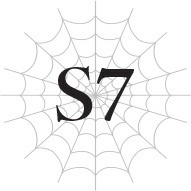

# Chương S7: Quỷ nhân nhe nanh
*(The Ogre Bares His Fangs)*

---

---

Khi tôi và Katia hội ngộ, cả hai chúng tôi đều thở phào nhẹ nhõm.

Bị tái sinh ở một thế giới song song không rõ lý do và buộc phải bắt đầu lại cuộc đời từ thời trẻ sơ sinh là một trải nghiệm cô độc và đau khổ.

Gặp lại người bạn thân nhất kiếp trước của mình giữa hoàn cảnh đó là một sự kiện vô cùng trọng đại.

Katia và tôi có thể hỗ trợ lẫn nhau, tìm thấy sự an ủi từ thực tế rằng mình không hề đơn độc.

Cậu ấy chính là minh chứng sống cho thấy những ký ức về Trái Đất của tôi là có thật, chứ không phải chỉ là trí tưởng tượng.

Đồng thời, sự hội ngộ này cũng tiếp thêm cho tôi lòng dũng cảm để quyết tâm sống trọn vẹn cuộc đời thứ hai của mình.

Sau đó, tôi đã gặp những người khác như Fei, cô Oka, Yuri và Hugo, và lại được trải nghiệm những sợi dây liên kết từ thời Trái Đất.

Những người bạn cùng lớp cũ của tôi đều ở thế giới này.

Nếu đã vậy, Kyouya chắc chắn cũng phải ở đâu đó quanh đây.

Chắc chắn chúng tôi sẽ có ngày gặp lại nhau.

Tôi thường mơ về ngày chúng tôi hội ngộ với Kyouya. Chúng tôi sẽ cùng nhau ôn lại những kỷ niệm cũ thời Trái Đất và nói về cuộc sống ở thế giới này cho đến nay.

Thế nhưng, cảnh tượng trước mắt lại nói cho tôi biết điều đó sẽ không xảy ra.

“Tuyệt thật, cậu vẫn nhớ tớ à. Tớ cứ tưởng cậu sẽ không nhận ra cơ, vì giờ trông tớ có hơi khác một chút.”

Tông giọng của Kyouya hoàn toàn thân thiện.

Tuy nhiên, Tagawa và Kushitani đang nằm rạp dưới chân cậu ta.

Nếu những gì Kyouya nói là thật, thì họ chưa chết, nhưng điều đó không làm thay đổi những gì cậu ta đã làm và ý nghĩa của hành động đó.

--- PAGE BREAK ---

Kyouya là kẻ thù của chúng tôi.

“Kyouya... thật sự là cậu sao?” tôi hỏi, dù đã biết rõ câu trả lời.

“Ừ. Sasajima Kyouya đây, người thật việc thật nhé. Đã lâu không gặp, Shun, Kanata.”

Tôi không muốn tin đó là sự thật, nhưng thực tế là vậy.

Ngay cả khi cậu ta không trả lời, tôi vẫn biết.

Linh cảm của tôi đã mách bảo rằng người này không thể là ai khác ngoài Kyouya.

Tông giọng dịu dàng và cả khuôn mặt của cậu ta vẫn không hề thay đổi so với kiếp trước.

Tất cả những điều đó khiến ký ức ùa về như thác lũ.

Cậu ta không phải là giả mạo hay ảo ảnh.

Khuôn mặt cậu ta giống hệt như thời ở Trái Đất.

Và nguyên nhân nằm ngay trên trán cậu ta.

Hai chiếc sừng.

Hai chiếc sừng giống như ác quỷ mọc ra từ trán cậu ta.

Rất có thể, cậu ta không phải con người hay ma tộc, mà là một con quái vật có hình dáng nhân tộc.

Nếu lấy Fei làm ví dụ, thì khi một người tái sinh dưới dạng quái vật chuyển sang dạng người, họ dường như sẽ mang khuôn mặt giống hệt kiếp trước.

Dĩ nhiên, trông cậu ta không hoàn toàn giống hệt.

Ở thế giới cũ, Kyouya khá thấp bé, nhưng giờ cậu ta cao hơn đáng kể, với cơ bắp săn chắc như thép nguội.

Cậu ta mảnh khảnh, nhưng bằng cách nào đó lại gợi cho tôi nhớ đến một lưỡi kiếm.

Một lưỡi kiếm không bao giờ gãy và sẽ chém làm đôi bất cứ thứ gì chạm vào nó.

“Tại sao chứ?”

Một câu hỏi vô nghĩa khác lại buột ra khỏi miệng tôi.

“Hửm? Tớ tưởng chuyện đó quá rõ ràng rồi chứ. Để tiêu diệt tộc Elf.”

“Cái gì?!”

Câu trả lời của Kyouya khiến tôi hoàn toàn bất ngờ.

Tôi không biết mình đã mong đợi cậu ta nói gì trước câu hỏi mơ hồ của mình.

Nhưng tôi không thể không ngạc nhiên, mặc dù lẽ ra tôi phải biết từ trước.

“Nếu có gì thắc mắc, thì chính tớ mới là người không hiểu nổi tại sao các cậu lại đi giúp tộc Elf ngay từ đầu đấy. Tớ đoán chắc các cậu đã bị họ dụ dỗ rồi.”

“Ý cậu là sao?”

Tôi lại buột miệng hỏi một câu khác.

Không phải là tôi chưa bao giờ nghi ngờ.

Katia luôn bày tỏ sự không tin tưởng đối với cô Oka, và Sophia cũng từng ám chỉ những điều tương tự.

--- PAGE BREAK ---

Nhưng tôi vẫn không thể tha thứ cho những gì Hugo đã làm, và vì Sophia cùng đồng bọn của cô ta đứng sau giật dây hắn, điều đó có nghĩa là tôi cũng không thể tin tưởng bọn họ.

Nhưng người đang đứng trước mắt tôi lúc này từng là bạn thân nhất của tôi ở kiếp trước.

Tôi có nên lắng nghe những gì cậu ta nói không?

“Các cậu biết tộc Elf chẳng mang lại gì ngoài tai họa cho thế giới này đúng không? Đi bảo vệ họ thì đúng là điên rồ rồi. Vẫn chưa quá muộn để—”

“Đừng để cậu ta lừa các em!”

Cô Oka lớn tiếng cắt ngang lời Kyouya.

“Cô không biết các quản trị viên đang âm mưu điều gì, nhưng chắc chắn chẳng có gì tốt đẹp cả! Shun, em không được quên những gì họ đã làm với vương quốc của em!”

Cô nói rất có lý.

Chính họ là những kẻ đã dùng Hugo để lật đổ vương quốc của tôi.

Lấy tư cách gì mà họ dám bảo tộc Elf mới là kẻ gây hại, sau những gì chính họ đã làm chứ?

“Chuyện đó là—”

“Hơn nữa!”

Kyouya định nói, nhưng cô Oka vẫn chưa xong.

“Chính quân đội ma vương đã sát hại Anh hùng Julius! Có đúng không?! Thống lĩnh Quân đoàn 8, Wrath!”

Cô Oka chỉ tay thẳng vào Kyouya.

Cậu ta là một trong những thống lĩnh của quân đội ma vương sao?

Và tên của cậu ta là Wrath...?

Thông tin này giáng vào tôi như một cú đấm cực mạnh vào bụng.

Lẽ ra tôi không nên ngạc nhiên đến thế, vì Sophia cũng thuộc quân đội ma vương, nhưng chuyện liên quan đến Kyouya thì hoàn toàn khác.

Quân đội ma vương đã giết anh trai Julius của tôi.

Người bạn thân nhất của tôi lại là một phần trong số đó.

Tôi chóng mặt đến mức đứng không vững.

“Xem ra tớ không thể thông suốt được cho các cậu rồi,” Kyouya nói đầy vẻ không vui.

“Đúng như Chủ nhân đã nói. Bà cô giáo bé nhỏ của chúng ta đã lừa họ hoàn toàn rồi, nên họ sẽ không nghe lời chúng ta đâu.”

Một làn sóng nghi ngờ mới đối với tộc Elf lại trỗi dậy trong tâm trí tôi.

Khi Sophia nói, mắt cô Oka cũng trợn tròn.

--- PAGE BREAK ---

Tôi cảm nhận được một chút do dự từ cô ấy.

Chẳng lẽ cô Oka cũng không hoàn toàn tin tưởng tộc Elf sao?

Bên cạnh cô, Anna trông có vẻ bối rối, trong khi Katia và anh Hyrince đang cảnh giác quan sát Kyouya, Sophia, và thậm chí cả cô Oka.

Fei đang quay lưng về phía tôi, nên tôi không thể thấy được biểu cảm của cậu ấy.

Chúng tôi nên làm gì đây?

Nước đi đúng đắn lúc này là gì?

Nhưng trước khi tôi kịp đưa ra quyết định, tình thế đã tự mình chuyển biến.

[Quang ma pháp] trút xuống từ trên trời, nuốt chửng Kyouya và những người khác.

“Cái gì thế?!”

Tôi ngước lên tìm kiếm nguồn gốc.

Ở đó, tôi thấy vài Elf đang lơ lửng trên bầu trời.

“Ngài Anh hùng! Hãy lập tức trở lại làng!” một kẻ trong số đó hét lên.

“Này, mấy người kia! Các người nghĩ mình đang làm cái gì thế hả?!” Katia hét trả lại bọn họ.

Tagawa và Kushitani đang nằm ngay gần Kyouya.

Katia cũng ở tương đối gần họ, nên cậu ấy suýt chút nữa cũng đã bị cuốn vào đòn tấn công của các Elf.

Không đời nào các Elf lại không nhận ra điều đó trước khi tấn công.

“Thưa ngài Anh hùng, Ma Vương đang tiến gần đến làng rồi! Vì ngài sở hữu danh hiệu Anh hùng, ngài là người duy nhất có thể đối phó với Ma Vương!”

Các Elf phớt lờ những lời cáo buộc của Katia và tiếp tục nói thẳng với tôi.

Ma Vương đang hướng về phía làng Elf sao?

Những người tái sinh vẫn còn ở trong làng lập tức hiện lên trong tâm trí tôi.

“Hãy giao khu vực này cho chúng tôi, và mau chóng đến đó ngay đi!”

Tôi không biết có nên nghe theo lời các Elf hay không.

Đủ loại suy nghĩ quay cuồng trong đầu tôi, khiến tôi rất khó xác định mình phải làm gì.

“Anh hùng, đi cùng tôi đi. Tôi có thể sử dụng dịch chuyển.”

Một Elf tiếp cận tôi, chìa tay ra trong lúc tôi còn đang do dự.

“Chuyện đó không xảy ra đâu.”

Đột nhiên, một lưỡi kiếm đâm xuyên qua ngực tên Elf từ phía sau.

Hắn ngã gục chết ngay trước mắt tôi.

Phía sau hắn, tôi thấy Kyouya, người đã ném thanh kiếm.

Tagawa và Kushitani vẫn đang nằm dưới chân cậu ta, nhưng tôi thở phào nhẹ nhõm khi thấy họ khẽ cựa quậy một chút.

--- PAGE BREAK ---

Tuy nhiên, tôi vẫn vô cùng sốc khi thấy Kyouya giết một Elf không chút do dự.

“Toàn đội, tấn công!”

Phía sau cô Oka và Anna, một nhóm Elf xuất hiện với đội hình hoàn hảo.

Họ bắn ma pháp và tên bay vun vút về phía Kyouya và Sophia.

“Đừng có xen vào.”

Sophia vung cánh tay.

Các đòn tấn công của các Elf lập tức bị thổi bay cùng một lúc, và một chất lỏng màu đỏ phun ra từ cánh tay cô ta, phân tán vào không trung.

Chất lỏng đó chuyển động như thể có ý thức riêng, lao về phía các Elf.

Đến lúc tôi kịp hành động để ngăn chặn thì đã quá muộn. Tất cả những Elf bị chất lỏng đó chạm vào bắt đầu tan chảy, phát ra âm thanh và mùi hôi thối kinh hoàng.

“Á?!”

Quay người lại, tôi thấy anh Hyrince đã chặn được một phần chất lỏng bằng khiên của mình.

Chất lỏng màu đỏ dường như đang cố quấn quanh khiên của anh, cố gắng che phủ nó hoàn toàn.

Phía sau anh là Anna và cô Oka.

Các Elf trên bầu trời cố gắng tấn công Kyouya bằng ma pháp và cung tên của họ.

“Lùi lại đi.”

Đòn tấn công của cậu ta tiếp cận họ trước khi họ kịp khai hỏa.

Những thanh kiếm.

Một lượng kiếm khổng lồ xuất hiện từ hư không, đâm xiên qua các Elf như những xiên thịt.

Nhìn kỹ hơn, tôi có thể thấy những thanh kiếm đang được tạo ra xung quanh Kyouya, rồi lao thẳng lên trời với tốc độ chóng mặt để tấn công các Elf.

Cậu ta chắc chắn đang mang chúng ra từ một chiều không gian khác bằng [Ma pháp Không gian].

Và tôi đoán cậu ta đang sử dụng kỹ năng [Bài xuất] để bắn chúng đi nhanh đến vậy.

Nhưng phần đáng sợ nhất chính là bản thân những lưỡi kiếm đó.

Một khi chúng đâm xuyên qua các Elf, chúng sẽ phát nổ.

Vụ nổ còn gây thương tích cho cả những Elf xung quanh dù họ không bị đâm trúng.

Trông chúng giống như những thanh kiếm, nhưng thực chất lại giống tên lửa hơn.

Đó chính là loại kiếm mà Kusama đã dùng để làm nổ tung các điểm dịch chuyển.

--- PAGE BREAK ---

Những thanh kiếm phát nổ nguy hiểm này đang bay lượn khắp mọi nơi.

Các Elf hoàn toàn không có cách nào để đối phó với hỏa lực phòng không mạnh mẽ như vậy.

“Dừng lại mau!”

Không kịp suy nghĩ, tôi vung kiếm lao về phía Kyouya.

Đó không phải là ý định của tôi. Cơ thể tôi chỉ tự động di chuyển.

“Nực cười. Cậu thực sự nghĩ mình có thể chém được ai bằng một thanh kiếm cùi bắp như vậy sao?”

Kyouya gạt phăng lưỡi kiếm của tôi một cách dễ dàng.

Phía trên chúng tôi, loạt mưa kiếm tên lửa vẫn tiếp tục trút xuống.

Dưới đất, chất lỏng màu đỏ của Sophia nuốt chửng các Elf, làm họ tan chảy thành hư vô.

Bằng cách nào đó, Fei đã loại bỏ được chất lỏng màu đỏ khỏi khiên của anh Hyrince.

Nhưng không có thời gian để thở phào.

Chiến trường xung quanh chúng tôi đã biến thành một cảnh tượng địa ngục.

“Xin lỗi nhé Shun, nhưng tớ cần cậu đi ngủ một lát.”

Thanh kiếm trong tay Kyouya vung về phía tôi.

Trong khoảnh khắc đó, tôi cảm thấy mọi thứ như đang diễn ra ở chế độ quay chậm.

“Shun!”

Tôi nghe tiếng Katia hét lên.

Nhưng tôi không có thời gian để né tránh thanh kiếm của Kyouya.

Tôi nghiến răng, chuẩn bị tinh thần đón nhận cơn đau sắp tới.

Nhưng thay vào đó, một bóng người lách vào ngay trước mặt tôi.

Máu tươi bắn tung tóe giữa không trung.

Một cơ thể khác đổ sụp lên người tôi.

Đó là cơ thể của Anna, người đã đỡ nhát kiếm của Kyouya thay cho tôi.

“A… Anna?”

Tôi đỡ lấy cơ thể đang ngã xuống của cô ấy, toàn thân nhuốm máu.

Cô ấy không trả lời.

“Thôi nào, tớ đâu có ý định giết cậu đâu. Nếu cô ta không đỡ đòn cho cậu như thế, cô ta đã không phải chết rồi.”

Giọng nói lạnh lùng của Kyouya vang lên vô hồn bên tai tôi.

Cô ấy chết rồi.

Anna đã chết.

Cô ấy chết để bảo vệ tôi.

Ngay giây phút nhận ra điều đó, tôi kích hoạt kỹ năng [Từ Bi] của mình không một chút do dự.

--- PAGE BREAK ---

Tôi không thể để Anna chết như thế này được!

Cô ấy đã đi cùng chúng tôi suốt chặng đường dài này chỉ vì cảm giác tội lỗi khi bị Hugo tẩy não.

Có lẽ đây là sự chuộc lỗi đối với cô ấy, nhưng đó là điều cuối cùng tôi mong muốn!

<Độ thuần thục đã đạt đến mức yêu cầu. Kỹ năng [Cấm Kỵ LV 9] đã trở thành [Cấm Kỵ LV 10].>

<Điều kiện thỏa mãn. Kích hoạt hiệu ứng của [Cấm Kỵ]. Thông tin đang được cài đặt.>

Ngay khi tôi hồi sinh Anna, một thứ gì đó tràn ngập vào tâm trí tôi.

“Á á á á á?!”

Đầu tôi đau nhức dữ dội.

Cảm giác như đầu tôi sắp vỡ làm đôi, nhưng thực chất không phải.

Tôi quằn quại trên mặt đất khi dòng thông tin ấy tràn vào người một cách không thương tiếc.

Katia chạy đến bên tôi. “Shun! Tỉnh lại đi!”

Cậu ấy thi triển [Ma pháp Trị liệu] cho tôi.

Nhưng vô ích.

Đây không phải là loại đau đớn mà [Ma pháp Trị liệu] có thể giải quyết được.

“Hai người kia! Các người đã làm gì Shun thế hả?!”

Fei lườm Kyouya và Sophia đầy giận dữ, nhưng cả hai bọn họ chỉ tỏ vẻ bối rối.

Dĩ nhiên là vậy rồi. Họ chẳng liên quan gì đến tình trạng hiện tại của tôi.

Đây là hình phạt dành cho tôi vì đã nâng cấp kỹ năng [Cấm Kỵ] lên tối đa.

<Quá trình cài đặt hoàn tất.>

Và giờ đây, tôi đã biết ý nghĩa thực sự của [Cấm Kỵ].

“Chết đi!”

Nhưng thời gian sẽ không dừng lại để đợi tôi xử lý quá trình biến đổi này.

Trong lúc Sophia vẫn đang nhìn tôi ngơ ngác, một gã đàn ông nhận thấy đây là cơ hội hoàn hảo.

Đó là Hugo, kẻ cuối cùng cũng bò dậy khỏi mặt đất sau khi bị tôi đánh gục.

Hắn nén thở, chờ đợi cơ hội để giáng một đòn trả thù lên Sophia vì tội phản bội hắn.

Nhưng lưỡi kiếm của hắn không bao giờ chạm được vào người cô ta.

Sophia chặn đứng đòn đánh dễ dàng bằng thanh đại kiếm của mình và hất ngược trở lại, thổi bay hắn.

“Khốn kiếp! Chết đi! Mày vẫn chỉ là con Rihoko đần độn mà thôi!”

“Hửm?”

Khoảnh khắc Hugo thốt ra cái tên đó, sát khí ngút trời lập tức tỏa ra từ cơ thể Sophia.

--- PAGE BREAK ---

Khi cô ấy còn là Negishi Shouko, đây chính là biệt danh mà mọi người dùng để chế giễu cô sau lưng.

“Real Horror Girl”, hay viết tắt là “Rihoko”.

Cô ấy bị đặt biệt danh này vì thân hình gầy trơ xương và luôn mang khuôn mặt u ám.

Cái tên đó hầu như không còn chút liên quan nào tới Sophia của thế giới này, người sở hữu ngoại hình và khí chất hoàn toàn khác biệt so với Shouko Negishi năm xưa.

Có vẻ đây chính là giới hạn nhạy cảm của cô ấy, vì hiện tại cô ấy đang tỏa ra sát khí ngút ngàn hướng về phía Hugo.

Dù nó không nhắm vào tôi, tôi vẫn phải cố gắng lắm mới giữ cho mình không run rẩy.

Tuy nhiên, bản thân cô ta lại không tấn công Hugo bằng vật lý.

Thay vào đó, một bàn tay trắng muốt, thon gọn đột nhiên tóm lấy sau đầu Hugo.

Ngay khoảnh khắc tiếp theo, thứ gì đó ngoằn ngoèo chui ra từ tai Hugo rồi biến mất vào bàn tay của người đang đứng sau lưng cậu ta.

Hugo đổ sụp xuống như một con rối bị đứt dây.

Người vừa ra tay lặng lẽ đứng phía trên cậu ta.

Cô ấy nhắm nghiền đôi mắt, không hề có thêm bất kỳ động tác nào.

Tôi hoàn toàn không biết cô ấy đã đứng đó từ lúc nào.

“Chủ nhân, ngài có thể đừng xen ngang như thế được không?”

Nếu có một từ để mô tả người mà Sophia gọi là Chủ nhân, thì đó sẽ là “trắng”.

Một cô gái nhỏ nhắn màu trắng.

Không có cách nào khác để mô tả cô gái này ngoài từ “trắng”.

Tóc trắng.

Da trắng.

Trang phục trắng.

Gần như không có bất kỳ màu sắc nào khác trên người cô ấy ngoài màu trắng.

Nhìn thấy cô gái đó, mắt anh Hyrince trợn tròn.

Tôi cũng nhận ra cô ấy.

Không thể nhầm lẫn đi đâu được từ những gì anh Hyrince đã mô tả.

Người cuối cùng mà Julius đã chiến đấu cùng.

Người đã sát hại anh ấy.

Nhưng tôi biết cô ấy còn vì một lý do khác nữa.

--- PAGE BREAK ---

Fei cũng đang nhìn cô ấy trân trối, không thốt nên lời.

Tôi hiểu lý do tại sao.

Dù sao thì, chúng tôi đã được bảo rằng cô gái này đã chết.

Cô Oka, người ban đầu đã cung cấp thông tin đó cho Katia, trông còn sốc hơn cả Fei.

Có vẻ như chính cô Oka cũng chưa từng mảy may nghi ngờ về cái chết của cô ấy.

“Nhưng… làm thế nào chứ?”

Cô Oka thầm thì trong sự hoài nghi.

Đáp lại, cô gái màu trắng cúi đầu.

“Đã lâu không gặp cô, cô Oka.”

Cô gái màu trắng đó, kẻ thù của anh trai tôi.

Tôi đã từng thấy gương mặt cô ấy trước đây, mặc dù màu sắc khi đó có hơi khác.

Ngay cả khi cô ấy đang nhắm mắt, tôi vẫn không thể nào nhầm lẫn được.

Tôi đã nhìn thấy gương mặt này rất nhiều lần ở kiếp trước.

Trong lớp chúng tôi kiếp trước, có một vài người đặc biệt nổi bật.

Natsume Kengo, thủ lĩnh của đám con trai.

Shinohara Mirei, thủ lĩnh của đám con gái.

Negishi Shouko, người nổi bật theo nghĩa tiêu cực với biệt danh Rihoko.

Nhưng có một người duy nhất còn nổi bật hơn tất cả bọn họ.

Tất cả con trai đều ngưỡng mộ cô ấy vì ngoại hình xinh đẹp, trong khi con gái chỉ biết đứng từ xa quan sát.

Ngoại trừ Shinohara Mirei, người luôn bắt nạt cô ấy, những người khác đều rất khó bắt chuyện vì cô ấy trông quá khó gần.

“Wakaba...”

Người đang đứng trước mắt chúng tôi không ai khác chính là Wakaba Hiiro, người tái sinh đáng lẽ đã chết từ lâu.

---

[◀ Chương trước: Chương 7: Hồi sinh](07_resurrection.md) | [Chương tiếp theo: Chương 8: Tiến hóa, Phân tách, Sinh sôi ▶](08_evolution_division_propagation.md)
