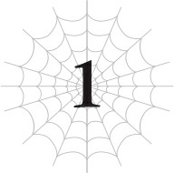

# Chương 1: Đồng bệnh tương lân
*(Misery Loves Company)*

---

Bầu trời không một gợn mây.

Ánh mặt trời ấm áp chiếu xuống, cùng một làn gió nhẹ thoang thoảng giúp thời tiết không bị quá nóng.

Thời tiết không thể nào đẹp hơn được nữa.

Hôm nay đúng là một ngày hoàn hảo để đi dã ngoại!

“Hự… Hự…”

Nhưng đáng tiếc thay, hiện thực lại không hề ngọt ngào như vậy.

Bất chấp thời tiết lý tưởng, khu rừng rậm rạp bao quanh đã che khuất toàn bộ ánh nắng chiếu tới chúng tôi.

Và rồi có một đứa trẻ sơ sinh — hay đúng hơn là một đứa bé — đang đứng mấp mé trước cửa tử.

Tiếng thở khò khè của con bé nghe bắt đầu hơi kỳ lạ rồi, nhưng chúng ta không cần bận tâm đến chuyện đó đâu.

Tiện thể thì, hãy cứ lờ đi việc con bé đang lạch bạch bước đi trên con đường núi này dù thực chất chỉ là một đứa bé sơ sinh.

Một đứa bé sơ sinh đi đứng với gương mặt như sắp chết trông cứ như cảnh phim kinh dị ấy nhỉ? Ý tôi là, đó thường không phải cảnh tượng mà bạn có thể bắt gặp hàng ngày.

Nhưng tất nhiên, đứa trẻ đang vừa bước đi vừa đón nhận vô số lời khen ngợi kia không phải là một đứa bé bình thường.

Con bé là người tái sinh giống tôi, và còn được khuyến mãi thêm thân phận ma cà rồng Chân Tổ nữa.

Nhân tiện, bảng chỉ số của con bé trông thế này:

| Chỉ số | Giá trị |
| :--- | :--- |
| **HP** | 23/37 (lục) |
| **MP** | 3/62 (lam) (chi tiết) |
| **SP (đỏ)** | 19/86 (chi tiết) |
| **SP (vàng)** | 0/86 (chi tiết) |
| **Sức tấn công trung bình** | 34 (chi tiết) |
| **Sức phòng ngự trung bình** | 41 (chi tiết) |
| **Sức ma pháp trung bình** | 59 (chi tiết) |
| **Khả năng kháng tính trung bình** | 61 (chi tiết) |
| **Tốc độ trung bình** | 33 (chi tiết) |

**Kỹ năng:**
[Ma Cà Rồng Cấp 2] [Thân Thể Bất Tử Cấp 1] [Tự hồi phục HP Cấp 4] [Tốc độ hồi phục MP Cấp 2] [Giảm tiêu hao MP Cấp 1] [Tốc độ hồi phục SP Cấp 3] [Giảm tiêu hao SP Cấp 3] [Cảm nhận Ma lực Cấp 3] [Thao tác Ma lực Cấp 3] [Phát hiện Hiện diện Cấp 4] [Ma đấu pháp Cấp 1] [Ý chí chiến đấu Cấp 1] [Ẩn mật Cấp 4] [Vô thanh Cấp 2] [Điều khiển Đồng loại Cấp 1] [Thần giao cách cảm Cấp 7] [Tập trung Cấp 5] [Xử lý Tính toán Cấp 2] [Ký ức Cấp 3] [Tư duy Song song Cấp 5] [Dự đoán Cấp 2] [Thẩm định Cấp 3] [Thủy Ma pháp Cấp 1] [Băng Ma pháp Cấp 1] [Kháng Thối Rữa Cấp 1] [Kháng Trạng thái bất thường Cấp 5] [Kháng Sợ hãi Cấp 5] [Dạ Nhãn Cấp 7] [Tăng cường Ngũ quan Cấp 4] [Sinh mệnh Cấp 2] [Ma lượng Cấp 3] [Bộc phát lực Cấp 4] [Bền bỉ Cấp 4] [Sức mạnh Cấp 2] [Cứng cáp Cấp 2] [Người dùng Chiêu thức Cấp 3] [Bảo hộ Cấp 3] [Chạy Cấp 2] [Ác ý Cấp 4] [n% I = W]

**Điểm kỹ năng:** 73.800

**Danh hiệu:**
[Ma Cà Rồng] [Chân Tổ] [Thủy Tổ] [Kẻ ăn tạp]

Dù vẫn chỉ là một đứa trẻ sơ sinh, chỉ số của con bé đã ngang ngửa với một quái vật cấp thấp.

Con bé cũng sở hữu hàng tá kỹ năng.

Tuy có lẽ không có đủ kỹ năng thiên về chiến đấu để thực sự hạ gục một con quái vật trong thực chiến, nhưng thế này vẫn là quá nhiều rồi.

Tốc độ phát triển này đúng là kinh ngạc thật!

Tôi đoán đây chính là minh chứng cho thấy việc giáo dục sớm cho một đứa trẻ năng khiếu có hiệu quả lớn thế nào.

Đúng vậy. Hiện tại tôi đang chịu trách nhiệm giáo dục cho Dơi con.

Trước hết, tôi muốn làm rõ một điều là tôi không hề ác ý khi làm vậy đâu nhé.

Thoạt nhìn, có vẻ như con bé có thể ngã quỵ bất cứ lúc nào, nhưng đôi chân nhỏ bé vẫn lạch bạch bước đi không ngừng.

Mà con bé muốn dừng cũng không được.

Bởi vì tơ của tôi đang quấn quanh tứ chi của con bé, bắt nó phải tiếp tục bước đi như một con rối.

Hắc hắc. Con bé có lẽ đã đạt đến giới hạn, nhưng với phương pháp này, nó có thể phá vỡ mọi giới hạn đó để tiếp tục huấn luyện!

Bạn muốn trở nên mạnh mẽ hơn nhưng lại thiếu ý chí để kiên trì khi gặp khó khăn? Vậy thì đây chính là phương pháp huấn luyện hoàn hảo dành cho bạn!

Đăng ký ngay bây giờ, bạn sẽ được miễn phí buổi học đầu tiên!

Nói chung là, tôi bắt con bé tập đi như thế này là để nâng cao chỉ số vật lý và các kỹ năng của nó.

Về mặt thể chất, con bé vẫn là một đứa trẻ sơ sinh, nên việc bị giật dây bắt đi lại thế này cũng là một bài tập thể dục cực kỳ nặng đô, đồng nghĩa với việc chỉ số và kỹ năng của nó sẽ tăng lên với tốc độ khá ấn tượng.

Dẫu sao thì, ở độ tuổi này bình thường con bé làm sao mà biết đi được.

Điều này chỉ khả thi vì nó là người tái sinh, cộng thêm lợi thế từ các chỉ số phi thường sẵn có.

Vật lý là như thế, nhưng tất nhiên tôi cũng khóa chặt cả mảng ma pháp nữa.

Tôi đã bảo con bé dùng điểm kỹ năng để mua Thủy Ma pháp và Băng Ma pháp để có cái mà thực hành. Thêm vào đó, con bé còn phải vận dụng Ma đấu pháp trong khi đi để cải thiện các chỉ số ma pháp của mình.

Bạn hỏi tại sao tôi lại huấn luyện Dơi con ngay từ đầu ấy hả? Tất nhiên là vì tôi đang chán phát điên trên chuyến hành trình này rồi.

Hiện tại, chúng tôi đang hướng về phía thủ đô của Sariella.

Nhưng vì tôi giờ đã là một Arachne nửa người nửa nhện, tôi chắc chắn sự xuất hiện của mình sẽ gây ra một vụ náo động kinh hoàng.

Hơn nữa, người hầu trung thành của Dơi con là Mera cũng là ma cà rồng, nên sẽ rắc rối to nếu mọi người phát hiện ra thân phận của anh ta.

Để thêm phần kịch tính, bọn Elf có vẻ như đang nhắm vào mạng sống của Dơi con vì một lý do nào đó.

Điều đó giải thích tại sao chúng tôi phải trốn tránh sự chú ý không mong muốn bằng cách di chuyển qua các khu rừng và đồi núi.

Nếu bạn cũng bị kẹt trong việc cuốc bộ qua đống cây cối rậm rạp suốt cả ngày, bạn cũng sẽ chán đến mức phát điên cho mà xem!

Để giết thời gian trên đường đi, tôi quyết định làm người hướng dẫn cho Dơi con.

Tất cả những gì tôi phải làm chỉ là bắt con bé đi bộ, nên việc này khá là nhàn!

Đáng tiếc là con bé trông có vẻ như sắp chạm giới hạn thực sự rồi, nên tốt nhất tôi nên dừng lại vào lúc này.

MP, SP và ngay cả HP của nó đều đã bắt đầu sụt giảm.

Tôi thả sợi tơ đang giữ con bé ra. Ngay lập tức, con bé đổ rầm xuống đất, y hệt như một con rối bị cắt đứt dây.

Ái chà, ngã cắm đầu xuống đất luôn kìa. Liệu có sao không ta?

Nhóc ma cà rồng sơ sinh nằm sấp mặt không thèm nhúc nhích lấy một cái, khiến Mera hốt hoảng lao tới. “Tiểu thư?! Tiểu thư! Người có nghe tôi nói không, tiểu thư?!”

Mera nhấc cơ thể bé nhỏ của con bé lên, lật ngửa lại rồi lắc nhẹ.

Không phản hồi. Con bé đã hoàn toàn ngất lịm.

Anh ta nhanh chóng kiểm tra xem con bé còn thở hay không.

Thôi nào. Con bé vẫn còn sống nhăn răng, okay?

Tôi đã dừng lại ngay trước vạch giới hạn có thể thực sự giết chết con bé rồi, hiểu không hả?

Ý tôi là, ừ thì, mắt con bé có vẻ trợn ngược lên và khóe miệng có sùi bọt mép một chút thật, nhưng con bé ổn màaa. Đừng lo lắng thái quá thế chứ.

Trong lúc Mera tiếp tục thực hiện các biện pháp sơ cứu khẩn cấp, tôi chuyển sang việc tiếp theo.

Nhiệm vụ kế tiếp: chuẩn bị đồ ăn!

Tôi gom vài cành củi khô xung quanh, ném thêm đống tơ của mình vào đó rồi bắt đầu nhóm lửa.

Trừ khi được cường hóa kháng tính, tơ của tôi bắt lửa cực kỳ dễ.

Điểm này từng khiến tôi gặp vô số rắc rối ở Tầng Trung của Mê cung Lớn Elroe, nhưng tùy hoàn cảnh mà đôi khi điểm yếu cũng có thể biến thành điểm mạnh.

Sau khi lửa đã cháy đượm, tôi dùng Ma pháp Không gian để lôi một chiếc chảo rán cùng một số nguyên liệu ra khỏi [Lưu trữ Không gian] và chuẩn bị nấu ăn.

Hắc hắc hắc. Giờ tôi đã là một Arachne sở hữu đôi tay người, cuối cùng tôi đã có thể thực sự nấu ăn rồi!

Đáng tiếc là kiếp trước tôi chỉ biết dùng lò vi sóng để hâm nóng thức ăn hoặc đun nước sôi, nên tôi chẳng thể làm món gì quá cầu kỳ.

Ở thế giới này làm gì có lò vi sóng hay mì cốc, nên đống kỹ năng nấu nướng cũ của tôi hoàn toàn vô dụng.

Cái gì cơ?

Bạn bảo việc dùng lò vi sóng hay đun nước sôi không được tính là kỹ năng nấu ăn thực thụ á?

Đó chỉ là ý kiến cá nhân của bạn thôi nhé, được chứ?

Đối với tôi, đó là những nguyên tắc cơ bản nhất của việc nấu ăn.

Nhân tiện, đống dụng cụ nấu ăn này là đồ tôi mượn từ nhà cũ của Dơi con.

Nơi đó đằng nào cũng đang cháy nghi ngút, nên tôi chỉ tự tiện lấy một ít nguyên liệu và đồ dùng gia đình thôi.

Nghe thì giống như hôi của thật đấy, nhưng lãnh chúa và phu nhân của dinh thự đều đã qua đời, và người thừa kế duy nhất — đứa bé — đã cho phép tôi lấy, nên chẳng có vấn đề gì cả.

Tôi đã được sự đồng ý của cả Mera lẫn Dơi con rồi đấy nhé, được chưa?

Ấy thế mà tôi vẫn bị nhận một kỹ năng gọi là [Cướp Đoạt].

Thật là vô lý hết sức.

Mà thôi, bỏ qua chuyện đó đi, tôi lấy một ít thịt từ [Lưu trữ Không gian] ra, thảy lên chảo rán và bắt đầu nấu.

Đừng hỏi đây là thịt của con gì đấy nhé, được chứ?

Tôi biết trông nó có vẻ như chứa cực độc, nhưng đừng nghĩ ngợi nhiều làm gì.

Tôi thêm gia vị đại khái một chút rồi bày thịt đã chín ra đĩa.

Tèn ten.

Dơi con tỉnh dậy ngay khi tôi vừa nấu xong, nên tôi đưa cho con bé một đĩa.

Tôi cũng đưa cho Mera một đĩa, rồi tiếp tục quay lại nấu nướng.

Lần này, phần thịt tôi đang nấu trông giống thức ăn bình thường hơn, không phải loại có độc.

Khi mùi thơm bắt đầu tỏa ra ngào ngạt, mắt Dơi con cứ đảo qua đảo lại giữa phần thịt trong chảo rán và đống thức ăn trông kinh tởm trên đĩa của mình.

Thôi đi nhé. Cái này là phần của tôi, okay?

Đừng có nhìn chằm chằm vào đồ của người khác một cách thèm thuồng như thế chứ.

“Cô Bạch, tôi có thể mạo muội xin cô chuẩn bị một phần thức ăn bình thường cho tiểu thư được không?” Mera lịch sự hỏi.

“Bạch” (White) là biệt danh Ma Vương tự ý đặt cho tôi.

Cái tên nghe có hơi kỳ lạ, nhưng phàn nàn vào lúc này cũng vô ích nên tôi đành tặc lưỡi mặc kệ.

Nhưng chuyện đó để sau đi. Bây giờ tôi cần phải trả lời Mera đã.

Ừm...

Chờ chút đã nào.

Xin hãy đợi một chút!

Ước gì người ta đừng có đột ngột bắt chuyện với tôi như thế.

Khả năng giao tiếp của tôi tệ đến mức tôi chẳng bao giờ biết phải phản hồi ra sao!

Ôi trời ơi. Nghiêm túc đấy, giờ tôi phải làm sao đây?

Được rồi, bình tĩnh lại nào.

Những lúc thế này, người ta thường đếm các số nguyên tố để lấy lại bình tĩnh đúng không?

Một, hai, ba... Áaaa!

Sai bét rồi!

Số một thậm chí còn không phải là số nguyên tố!

Ủa, nãy anh ta hỏi mình cái gì ấy nhỉ?

Đúng rồi, anh ta muốn tôi chia sẻ đồ ăn không độc cho Dơi con đúng không?

Nhưng tôi đâu có cho con bé ăn đồ chứa độc vì ác ý gì đâu, biết chưa?

Như họ có lẽ đã đoán được thông qua màu sắc, phần ăn của cả Mera lẫn đứa trẻ thực sự có chứa độc tố.

Nhưng việc đó chỉ là để gia tăng kháng độc của họ mà thôi.

Nếu họ tiếp tục ăn nó, kháng tính của họ sẽ tăng lên, và họ thậm chí sẽ nhận được danh hiệu [Kẻ ăn tạp].

Điểm trừ duy nhất là nó có vị siêu tệ, nhưng chỉ thế thôi. Nên chẳng có lý do gì để không ăn cả!

Dù vậy thì tôi đã có sẵn kỹ năng [Vô hiệu Trạng thái bất thường] rồi, nên tôi sẽ không ăn đâu!

Được rồi. Vậy thì. Tôi chỉ cần bảo anh ta “không” là xong.

Bắt đầu nào.

Tôi sẽ nói ra.

Tôi sẽ đếm ngược từ mười, rồi tôi sẽ nói.

Mười, chín, tám, bảy, sáu, năm, tư, ba, hai, một.

“Không sao đâu, Merazophis. Em cá là cô ta sẽ không thèm nghe lời anh đâu.”

Ngay khi tôi vừa mới hé miệng định nói, Dơi con đã chen ngang bằng [Thần giao cách cảm].

Mera cũng có vẻ như đã bỏ cuộc, anh ta quay đi thở dài.

A, chết tiệt thật.

Mọi nỗ lực nho nhỏ của tôi thế là đổ sông đổ bể.

Ừ. Chuyện thường tình thế đấy.

Đối với tôi, việc nói ra dù chỉ một từ duy nhất cũng tiêu tốn một lượng lớn thời gian và nỗ lực phi thường.

Nhưng dường như chẳng một ai hiểu được điều đó.

Kết quả là, dù tôi có cố nói cái gì đi nữa, thường thì tôi vẫn bị dập tắt trước khi kịp hé môi giống như thế này.

Do đó, cho đến nay tôi vẫn chưa thể thực hiện nổi một cuộc trò chuyện ra hồn.

Tôi cuối cùng cũng đã có chiếc miệng của con người rồi, vậy mà chẳng bao giờ có cơ hội để cất lời!

Nhưng nếu có thể vượt qua mà không cần nói chuyện, tôi nghĩ nó cũng chẳng phải vấn đề gì to tát.

Giờ Mera và Dơi con đã nhìn đi hướng khác, nên tôi quay lại với công việc nấu nướng của mình.

Thịt đã chín, tôi kẹp nó vào giữa hai lát bánh mì cùng với một ít rau củ rồi đưa cho người bạn đồng hành còn lại của mình.

“Cảm ơn nhé.” Ma Vương Ariel đón lấy chiếc bánh sandwich với một nụ cười rạng rỡ, ngây ngô.

Bạn có tin nổi chuyện này không?

Cô bé trông giống như mới bước vào độ tuổi thiếu niên này thực chất lại là một ma vương?

Vậy mà cô ta mạnh đến mức có thể thổi bay tôi chỉ bằng một cú đấm duy nhất?

Mới cách đây không lâu, chúng tôi còn đang chơi một trò đuổi bắt tử thần, nơi mà tôi chắc chắn sẽ mất mạng nếu bị cô ta tóm được.

Tại sao tôi lại đi du lịch cùng một người như thế chứ?

Đúng là một bí ẩn.

Tôi cũng tự làm một chiếc bánh mì kẹp thịt và rau cho mình, rồi bắt đầu ăn.

Mmmm! Nhiều nước thật đấy!

Nhóm bốn người kỳ lạ này bắt đầu đồng hành cùng nhau sau một cuộc nổi loạn tại thị trấn mà cha của Dơi con từng cai quản.

Tóm tắt tình hình lúc đó là, lãnh địa của cha con bé đã thua trận trong cuộc chiến chống lại quốc gia lân bang, và thị trấn đã bị thất thủ.

Rồi hàng tá chuyện khác xảy ra, kết cục là bốn người chúng tôi lại tụ họp đi chung một con đường.

Vâng, tôi biết chứ. Chuyện này chẳng có chút logic nào cả, đúng không?

Chính tôi cũng có hiểu nổi đâu!

Làm thế quái nào mà chuyện này lại xảy ra được chứ?!

Ý tôi là, việc Dơi con và Mera đi cùng tôi thì còn có thể hiểu được.

Nói thật thì, tôi cũng có một phần lỗi nhỏ trong việc hai người họ mất đi gia đình và quê hương.

Nhưng thị trấn đó, hay đúng hơn là toàn bộ đất nước Sariella, vốn dĩ từ lâu đã có mâu thuẫn sâu sắc với nước láng giềng là Vương quốc Ohts.

Nhưng như hóa ra, Ohts lại ngẫu nhiên là nơi có lối vào Mê cung Lớn Elroe.

Nên đó cũng chính là nơi tôi đã thổi bay một pháo đài khi lần đầu tiên thoát ra khỏi mê cung...

Mặt khác, người dân Sariella lại theo một tôn giáo thờ phụng một con nhện nhất định làm Thần Thú.

Ừ, tôi đã được họ tôn sùng cuồng nhiệt như thế đấy.

Thế là Ohts kiểu: “Cái gì cơ? Các người thờ phụng một con quái vật đã thổi bay pháo đài của chúng tôi á? Muốn gây chiến hay gì?”

Còn Sariella thì: “Câm mồm đi lũ thua cuộc! Thích thì chiến luôn, bước ra đây!”

Đại khái là kiểu vậy đấy.

Dù thế, tôi vẫn không thể tin nổi là họ thực sự đi đến chiến tranh. Cái thế giới này điên rồ thật!

Ha ha ha. Thực sự không vui chút nào đúng không?

Thật không thể tin nổi.

Kiểu như là, tôi cũng chẳng biết nói sao nữa.

Tôi đoán sự thật là tôi cảm thấy tồi tệ khi việc mình chuyển đến khu vực đó lại vô tình gây ra quá nhiều rắc rối cho thị trấn.

Ý tôi là, Sariella và Ohts vốn dĩ đã chuẩn bị lao vào cắn xé nhau rồi, nên tôi hiểu họ chỉ mượn tôi làm cái cớ để chính thức khai chiến mà thôi... Nhưng đồng thời, bảo tôi hoàn toàn không cảm thấy tội lỗi chút nào thì cũng không đúng.

Tất cả những điều đó có nghĩa là tôi không thể khoanh tay đứng nhìn đứa bé và Mera khi họ đã mất đi tất cả.

Mặc dù lỗi lầm không hoàn toàn nằm trên vai tôi hay gì, nhưng tôi vẫn sẵn lòng chăm sóc họ một chút.

Nhưng rồi chúng tôi lại có thêm một người bạn đồng hành khác, chính là Ma Vương Ariel.

Tôi thực sự không hiểu nổi bằng cách nào mà tôi lại đồng hành cùng cô ta.

Cô ta là một ma vương, và chúng tôi từng là kẻ thù không đội trời chung, vậy tại sao chúng tôi lại đang hợp tác với nhau?!

Chẳng có tí logic nào cả!

Nhưng không. Nói đi cũng phải nói lại, thực ra tôi biết rõ lý do tại sao mọi chuyện lại ra nông nỗi này.

Chúng tôi cuối cùng đã đạt đến một thế cân bằng nơi không bên nào có thể chạm tới bên kia, nên chúng tôi nghĩ rằng đi cùng nhau thế này là cách tốt nhất để giám sát đối phương.

Đúng vậy. Trận chiến giữa tôi và Ma Vương chưa thực sự kết thúc đâu.

Cả hai chúng tôi đều đang âm thầm quan sát và chờ đợi thời cơ, nên tình trạng này giống như một hiệp định đình chiến tạm thời hơn.

Hoặc bạn cũng có thể gọi nó là một cuộc Chiến tranh Lạnh.

Về phần mình, tôi đơn giản là không có cửa thắng Ma Vương trừ phi tôi trở nên mạnh mẽ hơn rất, rất nhiều.

Mặt khác, Ma Vương lại không biết bí mật đằng sau khả năng bán bất tử của tôi, và cô ta muốn ngăn việc quân đội của mình phải chịu thêm thương vong.

Cuối cùng, chúng tôi miễn cưỡng đồng ý đình chiến.

Mặc dù khi cô ta lần đầu đề xuất thỏa thuận này, khả năng bán bất tử của tôi đã bị hạn chế phần nào, nên tôi chẳng có lựa chọn nào khác ngoài việc gật đầu đồng ý.

Số là, bí mật đằng sau sự “bất tử” của tôi là sự kết hợp giữa kỹ năng [Bất tử] thực tế và kỹ thuật hồi sinh từ trứng. Trong đó, tôi sử dụng kỹ năng [Đẻ Trứng] rồi chuyển giao ý thức của mình vào một quả trứng như một kiểu giả tái sinh.

Kết quả là, về cơ bản tôi không thể bị giết.

Kỹ năng [Bất tử], đúng như tên gọi của nó, giúp tôi không thể chết trong phạm vi hệ thống của thế giới này.

Tuy nhiên, quy tắc đó vẫn có vài kẽ hở.

Đó là lý do tại sao tôi phải bổ sung nó bằng kỹ thuật hồi sinh từ trứng.

Ngay cả khi có thứ gì đó bỏ qua kỹ năng [Bất tử] và hủy diệt cơ thể tôi, tôi vẫn có thể bỏ lại cơ thể đó và hồi sinh.

Với bộ đôi này, tôi gần như không thể chết, chấm hết.

Nhưng khi Ma Vương đề xuất đình chiến, lúc đó tôi đã dùng sạch đống trứng của mình, nên tôi thực sự không thể sử dụng kỹ thuật hồi sinh từ trứng.

Hơn thế nữa, Ma Vương lại có cách để vượt qua kỹ năng [Bất tử] của tôi.

Thế nên tôi làm gì có lựa chọn nào khác ngoài việc đồng ý chứ!

May mắn thay, sau đó tôi đã kịp chuẩn bị một số quả trứng mới, nên giờ tôi không còn phải lo lắng về việc bị giết nữa.

Dù vậy, việc hợp tác với Ma Vương vẫn mang lại một số lợi ích nhất định.

Tôi rất mong đợi việc có cô ta làm đồng minh sát cánh chiến đấu cùng mình.

Nói chính xác hơn là trận chiến chống lại tộc Elf.

Xem nào, lý do ban đầu tôi lởn vởn quanh thị trấn của cha Dơi con là vì tôi phát hiện ra tộc Elf đang nhắm vào đứa bé.

Hoặc nói chính xác hơn, là vì dường như tất cả các [Phân thân Tư duy] của tôi đều căm ghét tộc Elf vì một lý do nào đó.

Hồi trước tụi nó đã ăn linh hồn của Mẹ, và có vẻ như tụi nó đã vô tình hấp thụ một số suy nghĩ và ký ức của bà ta luôn.

Dù sao đi nữa, tôi đã bị cuốn vào một trận chiến sinh tử chống lại tên Elf tên là Potimas, kẻ đang tấn công nhóc hút máu sơ sinh.

Mọi chuyện sau đó trở nên điên rồ vì nhiều lý do.

Hắn ta mạnh dã man, lại còn hóa ra là một con robot, và bằng cách nào đó hắn đã vô hiệu hóa hoàn toàn các kỹ năng và chỉ số của tôi.

Trời ạ, lúc đó tôi thực sự đã nghĩ mình sẽ tiêu đời tại đấy.

Nếu Ma Vương không đột ngột nhảy vào can thiệp giữa chừng, tôi hẳn đã gặp rắc rối to rồi.

Và vì hiện tại tôi đang đồng hành cùng Dơi con, người có khả năng sẽ lại bị tên Potimas kia nhắm tới một lần nữa, nên tôi không hề phiền khi có Ma Vương ở bên cạnh để bảo vệ chúng tôi.

Cô ta có vẻ cũng ghét tộc Elf, hay đúng hơn, có lẽ chính vì cô ta ghét tộc Elf nên Mẹ mới ghét bọn chúng. Do đó nếu Potimas xuất hiện, cô ta chắc chắn sẽ chủ động lao vào chiến đấu với hắn mà không cần tôi phải bảo.

Nhưng ngay cả khi bỏ qua chuyện đó, việc tiếp tục cuộc chiến vô nghĩa với Ma Vương cũng chẳng mang lại lợi ích gì.

Thực lòng mà nói, cả hai chúng tôi đều không còn lý do gì để chiến đấu với nhau nữa.

Lý do duy nhất khiến tôi nổi loạn chống lại Ma Vương, hay đúng hơn là thuộc hạ của cô ta là Mẹ, là vì Mẹ đã sử dụng kỹ năng [Điều khiển Đồng loại] để cố gắng thao túng tôi.

Cuối cùng, sau khi các [Phân thân Tư duy] của tôi ăn mòn linh hồn của bà ta, chính tôi đã có thể tự tay kết liễu bà ta.

Ma Vương đã đến để giải quyết tôi theo tín hiệu cầu cứu của Mẹ, nhưng khi một trong những [Phân thân Tư duy] của tôi — trước đây là não thể xác — bắt đầu ăn mòn linh hồn cô ta, cô ta đã có lý do cá nhân để chiến đấu sinh tử với tôi.

Nhưng giờ đây, cô ta dường như đã dung hợp với não thể xác trước đây của tôi bằng cách nào đó.

Đó rõ ràng là kết quả của việc cô ta chiến đấu chống lại nguy cơ bị đồng hóa khi linh hồn bị ăn mòn. Nên giờ đây, dù về cơ bản sâu bên trong cô ta vẫn là Ma Vương, nhưng cô ta đã là một thực thể mới thừa hưởng suy nghĩ và ý chí của cả hai bên.

Kể từ khi họ dung hợp, cô ta không còn phải lo sợ bị chiếm đoạt linh hồn nữa, đồng nghĩa với việc cô ta chẳng còn lý do gì để tấn công tôi.

Dù nói vậy, chúng tôi vẫn còn ôm chút hiềm khích với nhau.

Nhưng nói cách khác, ngoại trừ những hiềm khích nho nhỏ đó, chúng tôi chẳng còn lý do gì để chiến đấu nữa.

Sẽ chẳng có lợi lộc gì cho cả hai nếu cứ tiếp tục lao vào nhau.

Tôi đoán chúng tôi thực sự có thể biến thỏa ước đình chiến này thành một liên minh thực thụ.

Nhưng không việc gì phải vội vàng đưa ra quyết định cả.

Chừng nào Ma Vương chưa tìm ra bí mật về kỹ năng [Bất tử] của tôi và tìm ra cách đối phó, tính mạng của tôi vẫn an toàn.

Đó không phải là thứ có thể tìm ra trong một hay hai ngày.

Mà thực ra, cô ta có thể làm được điều đó không đấy chứ?

Ngay cả tôi còn chẳng nghĩ ra cách nào khả thi để khắc chế nó nữa là.

Hơn nữa, bỏ qua kỹ năng [Bất tử] sang một bên, làm sao cô ta có thể phát hiện ra phương pháp hồi sinh từ trứng của tôi chứ?

Điều này có nghĩa là tôi có thừa thời gian.

Tôi chỉ cần đưa ra quyết định vào một thời điểm nào đó thôi.

Dù vậy, không có nghĩa là tôi định lười biếng suốt thời gian này.

Tôi vẫn đang nỗ lực nâng cấp kỹ năng và chỉ số của mình mỗi ngày để sẵn sàng đối phó với Ma Vương và Potimas bất cứ lúc nào.

Thực tế thì, việc tôi huấn luyện Sparta cho Dơi con ban đầu chính là một phần của kế hoạch đó.

Xem này, tôi đã nghĩ rằng sẽ thật tuyệt nếu tôi có được kỹ năng [Người dùng Rối] giống như Ma Vương, nhưng tôi lại không có bất kỳ con rối nào cả và... Ồ chờ đã, có một con rối hoàn hảo ngay trước mắt đây rồi!

Điều này dẫn đến việc tôi dùng tơ của mình để giật dây điều khiển Dơi con đi lại.

Khi tôi làm vậy, các kỹ năng và chỉ số của đứa bé bắt đầu tăng lên như vũ bão. Việc đó khiến tôi thấy khá là giải trí, nên tôi đã biến nó thành một trò chơi mô phỏng nuôi dưỡng con cưng.

Kiểu như là: “Ồ trời ơi, con gái bé bỏng của chúng ta đang mạnh lên trông thấy kìa! Tiếp tục phát huy nào!”

Tất nhiên, cả bản thân đứa bé lẫn người giám hộ của nó là Mera lúc đầu đều kịch liệt phản đối, nhưng Ma Vương đã rộng lượng đưa ra một lời giải thích vô cùng lạc quan và thuyết phục được họ. Thế nên bây giờ họ đành phải cắn răng chịu đựng dù trong lòng chẳng muốn chút nào.

Dưới góc nhìn của họ, tôi hiện đang nâng cao chỉ số và kỹ năng của Dơi con vì lợi ích tốt nhất cho tương lai của con bé!

Làm sao tôi có thể thừa nhận rằng việc này bắt đầu đơn giản là vì tôi muốn kiếm một danh hiệu mới, và tôi tiếp tục làm là vì chán và thấy nó khá là vui cơ chứ?

Nhưng kể từ khi Ma Vương thuyết phục họ, tôi thì vui vẻ vì có trò tiêu khiển, còn Dơi con thì hạnh phúc vì có thể mạnh lên. Chẳng phải cả hai bên cùng có lợi sao?

Tôi thì quá vụng ăn vụng nói để có thể thuyết phục được họ, nên tôi thực sự biết ơn hành động của Ma Vương. Tôi chưa bao giờ nghĩ mình sẽ nói ra lời này, đặc biệt là trong hoàn cảnh như thế này.

Nó gần như khiến tôi nghĩ rằng có lẽ cô ta thực sự muốn chuộc lỗi.

Tôi đoán việc dung hợp với não thể xác cũ của tôi nghĩa là cô ta giờ đã hoàn toàn đổ đứ đừ vì tôi rồi!

“Hử? Lạ thật. Tự dưng không hiểu sao ta thấy hơi bực mình.”

Ma Vương nhíu mày và nghiêng đầu đầy hoài nghi trong khi vẫn đang nhét chiếc bánh sandwich tôi làm vào miệng.

Cô ta đúng là một bí ẩn thực sự.

Thế là giờ nghỉ trưa có phần gượng gạo của chúng tôi đã kết thúc.

Aaa, ngon tuyệt cú mèo.

Tất nhiên là trừ Dơi con và Mera, hai người họ trông cực kỳ đau khổ sau khi phải chịu đựng bữa ăn chứa độc tố kinh tởm đó, nhưng kệ họ đi.

“Hự!”

Giờ thời gian nghỉ ngơi đã hết, chúng tôi có thể quay lại cuộc hành quân tử thần siêu vui nhộn của mình!

Tôi gắn tơ vào cơ thể đứa trẻ, kéo nó đứng dậy và bắt đầu ép nó bước đi một lần nữa.

Nếu thực sự muốn trở nên mạnh mẽ, bạn không được phép lãng phí dù chỉ một phút.

Bạn sẽ chẳng đi đến đâu trừ phi bạn liên tục rèn luyện bản thân!

Nàooo, bước đi nào. Ngoan ngoan. Bé ngoan nhé.

Gương mặt nhỏ nhắn của con bé trông cực kỳ khó chịu khi bị tôi dắt đi, nhưng tôi biết chắc chắn rằng việc này sẽ cải thiện kỹ năng và chỉ số của nó.

Chịu đựng một chút đau đớn và gian khổ là hoàn toàn xứng đáng nếu nó giúp bạn mạnh lên, đúng không?

Nhân tiện thì, tôi cũng liên tục huấn luyện để nâng cấp kỹ năng của mình mọi lúc.

Hay đúng hơn là, các [Phân thân Tư duy] của tôi đang làm việc đó.

Đúng vậy. Kể từ khi tụi nó trở nên hơi kỳ quặc sau khi ngấu nghiến linh hồn của Mẹ, tôi đã sử dụng phương pháp hồi sinh từ trứng để tống tụi nó ra khỏi cơ thể tôi vào những cái xác mới toanh. Tại đó, tôi đoán tụi nó đang tự rèn luyện và nâng cấp kỹ năng cho tôi theo ý riêng của tụi nó.

Chuyện đó thì tốt thôi, nhưng có vẻ như tụi nó cũng đã tự tiện tiêu xài điểm kỹ năng của tôi để mua các kỹ năng mới.

Tôi cứ liên tục phát hiện ra những kỹ năng mới mà mình chưa từng thấy trước đây.

Ví dụ như, câu thần chú tôi dùng để nhóm lửa nấu ăn lúc nãy chính là Hỏa Ma pháp, thứ mà một trong những [Phân thân Tư duy] của tôi tự tiện mua mà không thèm hỏi ý kiến tôi một câu.

Hỏa Ma pháp. Lửa là điểm yếu lớn nhất của tôi, nên tôi chắc chắn nó hẳn phải tốn hàng đống điểm kỹ năng...

Quả nhiên, khi tôi kiểm tra lượng điểm kỹ năng dự trữ của mình, nó đã sụt giảm một khoản khổng lồ.

Tôi muốn phàn nàn lắm chứ, nhưng linh hồn của chúng tôi dường như không còn kết nối với cùng một mạng lưới nữa, có lẽ vì tụi nó đã có điểm kỹ năng riêng.

Hơn nữa, tôi đã nhận được kỹ năng [Thần giao cách cảm] vào một thời điểm nào đó, nên tôi đoán tụi nó cũng không thể giao tiếp với nhau qua linh hồn được nữa, đúng không?

Điều đó có nghĩa là cách duy nhất để khiếu nại là phải đi gặp trực tiếp tụi nó, nhưng tôi lại không biết chính xác hiện tại tụi nó đang ở xó xỉnh nào.

Tụi nó có lẽ đang ở đâu đó trong Mê cung Lớn Elroe, nhưng ngoài chuyện đó ra thì tôi chịu chết.

Vả lại đằng nào tôi cũng chẳng muốn rời mắt khỏi Ma Vương chỉ để đi tìm gặp tụi nó.

Tôi không thực sự phàn nàn được gì, vả lại tụi nó đang nâng cấp kỹ năng cho tôi, nên tôi đoán chúng tôi coi như hòa nhau.

Những tiến bộ mà tụi nó đạt được trong kỹ năng dường như cũng phản chiếu lại vào kỹ năng của tôi. Tụi nó rèn luyện càng nhiều, kỹ năng của tôi càng tăng.

Nếu tôi có thể nâng cấp kỹ năng của mình mà không cần động một ngón tay, tôi đoán đó là một điều tốt, đúng không?

Tôi không hẳn là thích việc tụi nó tự ý quyết định mọi thứ, nhưng tôi đoán mình sẽ hành xử như người lớn ở đây và bỏ qua cho tụi nó lần này.

Ừm. Miễn là tụi nó không làm điều gì điên rồ.

Chắc tụi nó sẽ không đâu, nhỉ?

Tất nhiên là không rồi... tôi hy vọng thế.

Tôi đang có một linh cảm xấu về chuyện này, nhưng tôi chắc chắn đó chỉ là trí tưởng tượng của mình thôi.

Ừ, cứ coi là vậy đi.

---

[◀ Chương trước: Báo cáo về Cơn Ác Mộng của Mê Cung (Phần 1)](report_on_the_nightmare_of_the_labyrinth_part_1.md) | [Chương tiếp theo: Cuộc họp Phân thân Tư duy #1 ▶](conversation_meeting_of_the_parallel_minds_1.md)
