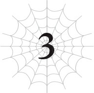
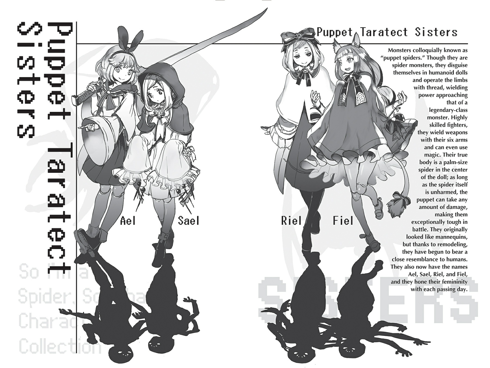

# Chương 3: Rượu là liều thuốc tốt nhất
*(Liquor Is the Best Medicine)*

---

Một ngày nọ, Dơi con bỗng trở nên ngoan ngoãn đến lạ kỳ.

Con bé vừa ngủ dậy đã bất ngờ xin lỗi tôi, mặc dù tôi cũng chẳng rõ nó đang xin lỗi vì chuyện gì.

Nhưng điều đó có nghĩa là con bé đã không còn chống đối các kế hoạch huấn luyện siêu vui nhộn của tôi nữa, nên tôi hoàn toàn ủng hộ.

Tôi có cảm giác mình như nhân vật chính trong một trò chơi mô phỏng nuôi dưỡng vậy. Tôi sẽ nuôi dạy nhóc ma cà rồng này thành một quý cô hoàn hảo nhất (keke) cho mọi người lác mắt!

Vì thế, tôi đã rèn luyện các kỹ năng của con bé trong chế độ huấn luyện mỗi ngày. Tất nhiên tôi cũng tự rèn luyện kỹ năng của mình, nhưng phần đó lại không diễn ra suôn sẻ cho lắm.

Vì hiện tại phần lớn kỹ năng của tôi đều đã ở cấp độ rất cao, nên việc nâng cấp chúng thêm nữa là cực kỳ khó khăn.

Thỉnh thoảng cấp độ của chúng vẫn tự tăng lên, tôi đoán đó là nhờ các Phân thân Tư duy mà tôi đã tống vào cơ thể riêng của tụi nó.

Nhưng dù tôi có cố gắng như tụi nó đi chăng nữa, tốc độ phát triển của tôi vẫn chậm một cách khủng khiếp. Đó là đã tính cả hiệu ứng từ kỹ năng gian lận [Kiêu Hãnh] rồi đấy.

Nếu không có nó, có lẽ tôi đã hoàn toàn ngừng phát triển từ lâu rồi.

Nhưng nếu cứ chấp nhận điều đó mà bỏ cuộc, tôi sẽ không bao giờ đuổi kịp Ma Vương.

Tạm thời, tôi quyết định tạm gác các kỹ năng khó tăng cấp sang một bên và tập trung vào những kỹ năng thực sự quan trọng.

Đặc biệt là [Bóp Méo Tà Nhãn].

Theo những gì tôi biết, đó là kỹ năng duy nhất có thể đối phó với Potimas. Bên trong cái kết giới triệt tiêu mọi chỉ số và kỹ năng của hắn, hai sở trường chính là tơ nhện và ma pháp của tôi hầu như vô dụng.

[Bóp Méo Tà Nhãn] gần như là đòn tấn công tầm xa duy nhất tôi còn có thể dùng được trong đó. Tất nhiên là tôi muốn không bao giờ phải gặp lại gã đó nữa, nhưng chuẩn bị trước vẫn tốt hơn.

Và dựa trên những gì Ma Vương nói, Potimas mà chúng tôi chiến đấu thực chất chỉ là một loại búp bê điều khiển từ xa, nên có lẽ vẫn còn cả đống sơ cua khác như thế.

Nếu Potimas thực sự nhắm vào Dơi con, sớm muộn gì tôi cũng sẽ phải chiến đấu với hắn một lần nữa. Lần trước tôi xoay xở được là nhờ Ma Vương đột ngột xông vào giải vây, nhưng ai biết lần sau chuyện gì sẽ xảy ra?

Thành thật mà nói, nếu cô ta không xuất hiện, tôi nghĩ cơ hội chiến thắng của mình chưa đầy 5 phần trăm. Tôi còn chẳng biết kỹ năng [Bất tử] có hoạt động trong cái kết giới đó không, hay liệu tôi có thể hồi sinh từ trứng hay không nữa.

Trong trường hợp xấu nhất, tôi có lẽ đã thực sự chết hẳn rồi. Nên bạn có thể trách tôi vì muốn chuẩn bị đầy đủ đề phòng hắn xuất hiện lần nữa được không?

Đó là lý do tôi liên tục rèn luyện [Bóp Méo Tà Nhãn], nhưng tôi nghĩ thế vẫn chưa đủ.

Potimas đã nhìn thấy [Bóp Méo Tà Nhãn] của tôi một lần rồi. Biết đâu hắn cũng đang chuẩn bị cách khắc chế nó giống như tôi đang làm với hắn.

Nếu hắn tìm ra cách ngăn tôi sử dụng cả [Bóp Méo Tà Nhãn], tôi sẽ tiêu đời nhà ma.

Nghĩa là tôi muốn tìm thêm vài biện pháp đối phó khác ngoài [Bóp Méo Tà Nhãn]. Cho đến nay, tôi chỉ nghĩ ra một cách khả thi duy nhất. Cụ thể là thăng cấp để có thể đánh bại hắn bằng sức mạnh vật lý.

Ma Vương đánh bại Potimas bằng cách đơn giản là dùng sức mạnh cơ bắp thô bạo đập nát cơ thể kim loại của hắn. Đó chắc chắn là ý tưởng thực tế nhất đối với tôi.

Kết giới của Potimas triệt tiêu bất kỳ kỹ năng và chỉ số nào tác động lên những thứ bên ngoài cơ thể. Nói cách khác, các kỹ năng và chỉ số hoạt động bên trong cơ thể vẫn có tác dụng, nên ngay cả khi khả năng vật lý của bạn có giảm đi một chút, bạn vẫn có thể di chuyển theo đúng chỉ số của mình.

Đồng nghĩa với việc phương pháp hiệu quả nhất là nâng cao chỉ số vật lý của tôi để lần sau có thể đập hắn ra bã.

Tuy nhiên, đáng buồn là chuyện không đơn giản như vậy.

Chỉ số vật lý của tôi vốn dĩ đã khá cao rồi.

Chúng tuy không ấn tượng như chỉ số ma pháp, nhưng đã tăng lên nhiều đến mức lúc này tôi có thể chiến đấu với Mẹ mà không cần dùng ma pháp luôn ấy chứ.

Thế nhưng khi đối đầu với Potimas, cơ hội chiến thắng duy nhất của tôi dường như vẫn chỉ là [Bóp Méo Tà Nhãn].

Nếu muốn trở nên mạnh mẽ một cách áp đảo và hủy diệt thực sự, tôi cần phải đạt được các chỉ số ngang ngửa với Ma Vương.

Vậy mà, tốc độ phát triển của tôi lại chậm lại rõ rệt.

Nâng cao chỉ số lúc này đòi hỏi nỗ lực cực kỳ lớn, và chúng chỉ tăng lên một chút xíu kể từ khi chúng tôi bắt đầu chuyến hành trình.

Đã vậy, cấp độ của tôi cũng chẳng thèm tăng.

Đã khá lâu kể từ khi tôi tiến hóa thành Arachne, và tôi cũng đã săn một lượng quái vật đáng kể trên đường đi, nhưng cấp độ của tôi vẫn dậm chân tại chỗ.

Lượng điểm kinh nghiệm cần thiết để lên cấp lúc này quá khổng lồ, nên việc chỉ giết vài con quái vật loanh quanh dọc đường là không ăn thua.

Tôi cần phải giết những con quái vật cực mạnh, hoặc là con người.

Nhưng quái vật cực mạnh đâu có dễ tìm như thế, và tôi cũng không thể đi giết người vô tội vạ được. Tôi thì chẳng ngại giết bọn cướp hay lũ tương tự đâu, nhưng vì chúng tôi đang tránh tai mắt bằng cách đi qua rừng núi hiểm trở, nên ngay từ đầu làm gì có bóng người nào mà gặp.

Đến cả bọn cướp hay thổ phỉ cũng chẳng thèm lởn vởn ở nơi rừng sâu núi thẳm hẻo lánh thế này.

Đi theo con đường này thì có đến mùa quýt cũng chẳng gặp được ai!

Hơ hơ, nghe tôi cứ như một kẻ ế chổng chơ không kiếm nổi một cuộc hẹn ấy nhỉ. Dù sao thì, tôi cũng muốn trốn đi đâu đó để tự cày cuốc, nhưng Ma Vương luôn giám sát chặt chẽ, nên tạm thời cứ ngoan ngoãn là tốt nhất.

Hơn nữa, nếu cứ bám theo Ma Vương, cô ta có thể giải quyết nếu Potimas quay lại.

Dù sao đi nữa, có lẽ lựa chọn duy nhất của tôi lúc này là đi từng bước chậm mà chắc.

Thế rồi tôi sực nhớ ra sự tồn tại của các kỹ năng sử dụng vũ khí.

Trước đây tôi từng nhận được một kỹ năng tên là [Khiên Thuật] đi kèm với một danh hiệu.

Cái danh hiệu kiểu bảo là, 'Sẽ có chuyện tốt lành xảy ra nếu bạn sử dụng khiên!' ấy.

Hồi đó tôi còn chưa tiến hóa thành Arachne, nên tôi kiểu: 'Nhện thì trang bị khiên thế quái nào được hả đồ ngốc!' rồi quẳng nó sang một bên coi như đồ phế phẩm.

Nhưng bây giờ tôi đã là một Arachne, sở hữu nửa thân trên của con người, tôi hoàn toàn có thể trang bị vũ khí!

Đồng nghĩa với việc tôi có thể dùng khiên hay bất cứ thứ gì khác! Cơ mà nói thật thì, việc đó vẫn phế như thường.

Ý tôi là, ừ thì bây giờ tôi cầm được khiên thật đấy, nhưng nó chắc chắn sẽ mềm hơn cơ thể của tôi.

Như đã nói, chỉ số của tôi thực sự rất, rất, rấấất cao.

Đến mức sức phòng ngự của tôi còn cao hơn cả một chiếc khiên kim loại.

Nếu cái khiên còn mềm hơn cả tôi, thì dùng nó để làm cái quái gì chứ?

Vũ khí thì cũng gần như tương tự.

Tôi đã mượn trang bị của lũ nhện rối, nhưng thậm chí còn không thể tự làm mình trầy xước nổi bằng đống vũ khí đó.

Mỗi khi nghĩ về việc chính những món vũ khí này từng chém tôi tơi tả đến suýt chết ngày trước, tôi lại một lần nữa nhận ra mình đã mạnh lên đến nhường nào.

Cơ mà chuyện đó để sau đi.

Nói cách khác, ngay cả vũ khí do lũ nhện rối mang theo cũng không thể làm tổn hại da thịt tôi. Thành thật mà nói, đấm ai đó bằng nắm đấm của mình còn có uy lực hơn là dùng bất kỳ món vũ khí nào.

Bạn có lẽ sẽ nghĩ thế nghĩa là tôi dùng vũ khí chẳng có tác dụng gì, nhưng vẫn có ngoại lệ đấy nhé. Chẳng hạn như, nếu có một món vũ khí còn cứng hơn và có sức hủy diệt lớn hơn cả cơ thể của tôi.

Nhưng đâu phải tự nhiên mà tôi nhặt được một món vũ khí như thế trên đường đi. Ý tôi là, chỉ số trung bình của lũ nhện rối đều trên 10.000, mạnh đến mức điên rồ, thế mà vũ khí của chúng vẫn vô dụng với tôi.

Trừ khi tôi may mắn nhặt được một món trang bị cấp truyền thuyết siêu hiếm rơi ra từ quái vật hay gì đó, chứ không thì vũ khí hoàn toàn vô dụng đối với tôi.

Nhưng chờ đã!

Nếu không có sẵn, thì tại sao tôi không tự mình chế tạo lấy một món nhỉ?

Hử? Bạn nghĩ chế tạo một món vũ khí cấp truyền thuyết dễ thế sao? Tch, tch, tch. Dễ mà. Thực ra cực kỳ đơn giản luôn ấy chứ. Bởi vì tôi đã có sẵn nguyên liệu rồi. Chính là nguyên liệu từ cơ thể của tôi!

Nếu hầu hết vũ khí đều giòn hơn cơ thể tôi, thì tại sao không dùng chính cơ thể mình để tạo ra một món vũ khí xịn hơn chứ? Và tình cờ thay, có một bộ phận trên cơ thể tôi sinh ra để làm 'vũ khí'.

Đúng vậy. Hai cái chân trước của thân nhện, vốn có hình dạng như những lưỡi hái.

Nếu tôi chặt một cái đi, tôi hoàn toàn có thể dùng [Ma pháp Trị liệu] để tái tạo lại nó lập tức, nên chẳng có lý do gì để không dùng nó làm vũ khí cả.

Quyết định thế đi, tôi chặt đứt một chân trước ngay sát gốc, dùng chính chiếc chân đó để chặt nốt chiếc còn lại, rồi dùng tơ nhện tiện lợi buộc chúng lại với nhau.

Và thế là, tèn ten! Hoàn thành rồi.

Tèn-tén-ten-tennn!

Bạn nhận được Đại Lưỡi Hái Nhện!

Trông nó chẳng khác nào món vũ khí của tử thần.

Vì nó được làm từ chính cơ thể tôi, nên nó chắc chắn không mềm hơn tôi rồi, và sức hủy diệt thì được đảm bảo 100%.

Và có lẽ vì lý do đó, nó cho cảm giác rất vừa tay khi tôi cầm. Vừa tay đến mức chỉ cần vung nhẹ vài cái là tôi đã nhận được kỹ năng [Lưỡi Hái Thuật] rồi.

Giờ tôi đã có thêm một chiêu thức để sử dụng trong cận chiến vật lý. Cho đến nay, các chỉ số vật lý ngoài tốc độ của tôi chỉ là những phần thưởng thêm mà tôi chưa bao giờ có cơ hội sử dụng, nhưng từ nay mọi chuyện sẽ khác.

Nếu cứ phụ thuộc vào ma pháp suốt, tôi sẽ gặp rắc rối lớn nếu rơi vào tình thế không thể sử dụng ma pháp. Hơn nữa, tôi cũng cần cải thiện khả năng cận chiến của mình.

Để đạt được mục tiêu đó, tôi đã thêm bài tập vung lưỡi hái vào chế độ huấn luyện hàng ngày của mình cùng với Dơi con và Mera.

Con bé sơ sinh đã thét lên kinh hoàng khi lần đầu tiên nhìn thấy nó, nhưng đó không phải là vấn đề của tôi.

Chuyến hành trình của chúng tôi tiếp tục trong khi tôi tự huấn luyện bản thân và rèn luyện Dơi con.

Đã khoảng hai tháng trôi qua kể từ khi khởi hành, nhưng chúng tôi vẫn chưa đến được đích.

Tuy nhiên, ở thế giới này, đó là điều hoàn toàn bình thường đối với một chuyến đi.

Không giống như thế giới cũ của tôi, nơi ngập tràn máy bay, ô tô này nọ, di chuyển ở đây tốn cực kỳ nhiều thời gian.

Vì đã tự mình đi bộ băng qua Mê cung Lớn Elroe, tôi hiểu rất rõ điều đó.

Trước đây tôi chưa từng nhận ra công nghệ của Trái Đất tuyệt vời đến nhường nào.

Tôi có một cách di chuyển ăn gian là [Dịch chuyển], nhưng phép đó chỉ hoạt động với những địa điểm tôi đã từng đặt chân tới.

Vì tôi chưa bao giờ đến thủ đô của Sariella, dĩ nhiên tôi không thể dịch chuyển tới đó được.

Nếu di chuyển từ vùng này sang vùng khác trong cùng một quốc gia mà còn mất nhiều thời gian thế này, thì đi đến bên kia thế giới chắc phải mất hàng năm trời mất?!

Ngay cả các thị trấn mà thỉnh thoảng chúng tôi ghé qua cũng nằm cách nhau ít nhất một tuần đường.

Ngoại trừ những lần đó ra, ngày nào cũng lặp đi lặp lại như nhau. Lúc này, những người còn lại trong nhóm đang ở trong một thị trấn như vậy.

Đúng thế đấy—tôi lại bị bỏ rơơơii, một mình đơn độccc tôiơơơii.

Mặc dù lần này tôi không thấy nản lòng như lần đầu tiên nữa.

Có lẽ vì cảm thấy có lỗi khi bỏ rơi tôi, nên bắt đầu từ ngày hôm sau, Ma Vương đã đảm nhận nhiệm vụ nấu nướng.

Và tay nghề nấu ăn của cô ta thì ngon kinh khủng khiếp.

Ngon đến mức nào á? Ngon đến mức lần đầu tiên ăn tôi đã thực sự phát khóc luôn ấy.

Ngon tới nỗi làm tôi phải nghĩ: 'Này, có khi đồng hành cùng Ma Vương cũng không tệ lắm nếu ngày nào cũng được ăn ngon thế này'.

Tôi đoán đó là một lợi ích khác từ tuổi thọ dài đằng đẵng của cô ta.

Dù sao cô ta cũng là bà ngoại đã nuôi nấng Mẹ và phần còn lại của binh đoàn nhện mà.

Dù thế nào thì, cô ta luôn mua nguyên liệu tươi ngon mỗi khi ghé qua thị trấn, nên món ăn cô ta nấu ngày hôm sau luôn ngon đặc biệt.

Điều đó giúp việc bị bỏ rơi một mình trở nên dễ chịu hơn một chút.

Thực tế, việc dừng chân ở các thị trấn đang trở thành một trong những sự kiện yêu thích của tôi. Mặc dù việc chờ đợi ngày tiếp theo trôi qua luôn là một thử thách.

Ngoài ra, cũng có những người khác tình cờ thích thú với sự kiện này. Cụ thể là lũ nhện rối.

Trông chúng bắt đầu ngày càng giống con người hơn. Thậm chí chính tôi cũng bắt đầu coi chúng như người thực sự vậy.

Hiện tại tôi đang tiến hành chỉnh sửa cơ thể búp bê của chúng bằng [Thần Kỹ Dệt Tơ].

Về mặt kỹ thuật, kỹ năng này đã đạt cấp tối đa, nhưng càng sử dụng nhiều, tôi lại càng nghĩ ra nhiều cách ứng dụng độc đáo.

Như một phần của nghiên cứu, tôi tiếp tục tiến hành nâng cấp ngoại hình cho lũ nhện rối, và giờ chúng đã đạt đến mức nếu chỉ nhìn thoáng qua, bạn sẽ dễ dàng lầm tưởng chúng là con người.

Tuy nhiên, nếu nhìn quá kỹ, bạn vẫn sẽ nhận ra vài điểm bất thường, nên vẫn có thể biết được chúng không phải là người thật.

Mục tiêu cuối cùng của tôi là làm sao để ngay cả khi quan sát kỹ hay chạm vào chúng, người ta cũng không thể phát hiện ra chúng là búp bê.

Hiện tại, tôi đang tinh chỉnh vài chi tiết nhỏ để cơ thể chúng trông tự nhiên hơn, đồng thời cố gắng tái tạo những phần nằm dưới da để khi sờ vào có cảm giác mềm mại như người thật.

Lũ nhện rối vô cùng vui vẻ giúp đỡ, nên nghiên cứu của tôi tiến triển rất thuận lợi.

Dù vẻ ngoài ban đầu của chúng có ra sao, bên trong chúng chắc chắn là những thiếu nữ.

Việc được chỉnh sửa để trở nên xinh đẹp hơn có vẻ làm chúng thấy hạnh phúc.

Có vẻ như chúng cũng bắt đầu thích thời trang, vì mỗi lần được triệu hồi, chúng lại diện những bộ trang phục khác nhau. Tôi nghĩ có lẽ chúng tự may quần áo đấy.

Chúng có đủ mọi loại phong cách, nên tôi nhìn mãi mà không thấy chán.

Nhiệm vụ chính của chúng dường như là làm sao để sáu cánh tay trông tự nhiên nhất có thể, nên tôi luôn ấn tượng với những gì chúng nghĩ ra.

Nhân tiện, có tổng cộng bốn con nhện rối.

Ban đầu, chúng được triệu hồi hai con một lần, nhưng tôi đoán chúng đã bắt đầu tranh giành xem ai sẽ được triệu hồi.

Thế nên vào một thời điểm nào đó, cả bốn con đã cùng xuất hiện một lượt.

Mấy đứa thích thú với chuyện này lắm đúng không? Tôi hiểu mà; muốn gặp tôi đến thế cơ à? Chắc tôi cũng không thể trách mấy đứa được.

Giờ tôi đã trở thành một bậc thầy thẩm mỹ hay sao thế này? Ôi trời, thật là khó khăn mà. Tôi quá tài năng đến nỗi các cô gái đều tranh giành sự chú ý của tôi. Nổi tiếng đúng là mệt thật nhỉ?

Vâng, tôi biết rồi, không phải chúng muốn gặp tôi—chúng chỉ vui vì tôi đang giúp chúng trở nên xinh đẹp hơn thôi. Tôi hiểu rồi, được chưa?

Dù sao thì, chúng không có tên, nên tôi nghĩ sẽ tiện hơn nếu đặt cho chúng vài cái tên, nhưng Ma Vương đã ngăn tôi lại.

'Ta sẽ tự đặt tên cho chúng! Ngươi không được tự ý đặt tên mà không hỏi ta đâu đấy!' cô ta nói. Tôi đoán với tư cách là phụ huynh, cô ta phản đối việc người khác đặt tên cho con mình? Cơ mà tôi chẳng hiểu sao ngay từ đầu cô ta không đặt tên cho chúng đi cho rồi.

Dù sao thì, lần tiếp theo chúng được triệu hồi, tôi đã hỏi về tên của chúng. Câu trả lời: Ael, Sael, Riel, và Fiel.

Cách đặt tên đó nghe có hơi qua loa đại khái đối với tôi, nhưng tôi cảm giác mình nên giữ suy nghĩ đó cho riêng mình thì hơn.

Điều thú vị là mỗi đứa đều có một cá tính riêng biệt.

Ael khá tự tin nhưng cũng rất khôn ngoan. Con bé chính là đứa đầu tiên dám ăn thử thịt quái vật.

Sael, đứa còn lại có mặt vào ngày đầu tiên đó, thuộc kiểu nhút nhát và yếu đuối.

Riel là một cô nàng ngổ ngáo tinh nghịch và cực kỳ ngơ ngác.

Fiel là một đứa ngốc nghếch hay làm trò hề và dễ bị phấn khích quá đà.

Theo một cách nào đó, khá ấn tượng khi tính cách của chúng thể hiện rõ ràng như vậy dù chúng không hề nói năng gì.

Ồ phải rồi. Có lẽ tiếp theo tôi sẽ thử tạo dây thanh quản cho chúng xem sao.

Nếu chúng học được cách nói chuyện thì xung quanh đây chắc chắn sẽ ầm ĩ lắm, nhưng việc đó đâu hẳn là xấu, đúng không? Việc đó chắc chắn sẽ rất khó khăn, nhưng tôi cá là mình làm được. Với tơ của tôi, chẳng có gì là không thể! ...Ừm, tơ nhện quả thực là thứ diệu kỳ.

Giữa việc tự nâng cấp bản thân, nuôi dạy Dơi con và chỉnh sửa ngoại hình cho lũ nhện rối, tôi đang hoàn thành được đủ thứ việc trong chuyến đi này.

Mặc dù vậy, không phải mọi thứ đều diễn ra hoàn hảo theo kế hoạch. Thực tế, chuyến hành trình này ngập tràn rắc rối.

Tôi đoán chuyện đó cũng hợp lý thôi, vì ngay từ đầu chúng tôi lên đường là vì gặp rắc rối mà.

Dơi con và Mera đã mất đi thị trấn nơi họ sinh sống, và họ còn phải chạy trốn để thoát khỏi sự truy sát của Potimas nữa.

Còn Ma Vương và tôi thì đang để mắt dè chừng lẫn nhau để đảm bảo không bên nào giở trò mờ ám.

Nên cơ bản là, ai trong chúng tôi cũng có đống rắc rối của riêng mình. Nghĩ theo cách đó, việc chúng tôi đi được đến tận đây mà không gặp biến cố lớn nào thực sự là một phép màu.

Thực sự thì, ngay cả khi hiện tại không có chuyện gì xảy ra, chúng tôi cũng không biết chuyện gì sẽ chờ đợi ở phía trước. Dù bạn có cố gắng né tránh đến mức nào, vẫn sẽ có lúc bạn buộc phải đối mặt trực diện với các vấn đề của mình.

Trong trường hợp của tôi, đó là mối quan hệ với Ma Vương.

Hiện tại, chúng tôi cơ bản đang ở trong tình trạng Chiến tranh Lạnh, nhưng cuối cùng tôi vẫn sẽ phải đưa cho cô ta một câu trả lời.

Chúng tôi sẽ giải quyết ân oán một lần và mãi mãi, hay sẽ thực sự bắt tay hợp tác lâu dài? Ma Vương cũng gặp phải vấn đề tương tự. Nhưng cả hai chúng tôi đều đang tạm gác câu hỏi đó lại. Dù sao thì cũng đâu có gì phải vội.

Chỉ cần tôi duy trì được khả năng bán bất tử của mình, tôi ít nhất vẫn có thể sống sót sau bất kỳ cuộc đụng độ nào với Ma Vương.

Ma Vương mạnh hơn tôi, nên việc giữ tôi bên cạnh vẫn tốt hơn là mạo hiểm để tôi tự do chạy rông.

Cả hai chúng tôi đều chỉ muốn duy trì hiện trạng, nên chừng nào chưa có biến cố lớn nào xảy ra, mối quan hệ này có lẽ sẽ giữ nguyên như thế mãi mãi. Nên Ma Vương và tôi đang trì hoãn việc giải quyết vấn đề của mình, nhưng không phải ai cũng có thể làm thế mãi.

Đặc biệt là Dơi con và Mera. Nhóc ma cà rồng sơ sinh phải chọn cách cô bé sẽ sống từ nay về sau.

Liệu con bé sẽ che giấu thân phận ma cà rồng để sinh sống giữa loài người, hay sẽ theo Ma Vương đến lãnh địa của ma tộc?

Có vẻ như con người ở thế giới này cũng căm ghét và sợ hãi ma cà rồng, nên nếu muốn sống giữa loài người, con bé bắt buộc phải giấu kín thân phận của mình.

Và trong trường hợp đó, con bé sẽ mất đi sự bảo hộ của Ma Vương, người chuẩn bị trở về lãnh địa của ma tộc.

Nói cách khác, con bé sẽ phải tự lực cánh sinh mà không có sự hậu thuẫn của Ma Vương. Ngược lại, nếu đi cùng Ma Vương, con bé sẽ phải vứt bỏ địa vị của mình trong thế giới loài người.

Dù sao con bé vẫn là con của gia đình quý tộc, chưa kể còn là người sống sót duy nhất của gia tộc Keren, vì những người khác đều đã tử trận trong cuộc chiến đó.

Nếu biết tận dụng địa vị đó làm lợi thế, con bé có thể sẽ tạo dựng lại vị thế tại Sariella.

Nhưng tất cả chỉ là giả thuyết; liệu nó có thực sự hiệu quả hay không thì tùy thuộc vào Dơi con và Mera. Và cả những kẻ nắm quyền quyết định ở Sariella nữa. Đi theo Ma Vương đồng nghĩa với việc từ bỏ tất cả những thứ đó. Đến lãnh địa ma tộc cơ bản chính là vứt bỏ nhân tính của mình.

Đó là một quyết định trọng đại ảnh hưởng đến phần đời còn lại của con bé. Và con bé chỉ có thời gian từ giờ cho đến khi chúng tôi tới thủ đô của Sariella để đưa ra lựa chọn. Hạn chót đang cận kề. Bất kể chọn con đường nào, con bé vẫn phải đánh đổi điều gì đó. Và tôi chắc chắn cuộc sống phía trước của con bé kiểu gì cũng sẽ đầy rẫy khó khăn.

Nhưng lựa chọn đó là của Dơi con. Tôi không có quyền can thiệp. Con bé sẽ phải tự mình cân nhắc thật kỹ để đưa ra quyết định. Thật lòng mà nói, con bé chọn thế nào đối với tôi cũng chẳng khác biệt. Tôi không quan tâm, miễn là việc đó không gây phiền toái cho tôi.

Nhưng tôi không thể nói điều tương tự về người bạn đồng hành còn lại của chúng tôi. Anh ta đang trực tiếp gây phiền toái cho tôi ngay lúc này đây.

Đúng vậy. Người đồng hành Mera của tôi. Anh ta gây phiền toái cho tôi thế nào á? Bằng cách tỏ ra cực kỳ khó chịu.

Bất kể ngày đêm, cứ hễ thức giấc là anh ta lại ủ rũ suy nghĩ không ngừng! Cơ bản là, anh ta tỏa ra bầu không khí u ám đến mức tôi chỉ nhìn thôi đã thấy bực mình.

Nếu mọi chuyện chỉ có thế thì đã tốt. Ý tôi là, cá nhân tôi không thích chuyện đó thật, nhưng vẫn có thể ngó lơ. Điều tôi không thể ngó lơ là việc Mera đang gây cản trở cho dự án nuôi dạy Dơi con của tôi.

Ý tôi là, nếu người hầu thân cận nhất của mình cứ tỏ ra u sầu một cách bất thường, dĩ nhiên bạn sẽ bị ảnh hưởng tâm lý.

Hậu quả là con bé bị phân tâm trong lúc huấn luyện, khiến hiệu quả giảm sút rõ rệt. Aaa! Tôi ghét nhất là bị người khác cản chân! Tại sao con người cứ phải làm thế chứ? Mà thực ra, tại sao người khác lại phải tồn tại ngay từ đầu cơ chứ?

Chỉ vì sự tồn tại của người khác mà tôi mới phải trải qua tất cả những cảm xúc phiền toái này.

Nên nếu tôi chỉ cần quét sạch toàn bộ loài người trên đời, tôi có thể sống trong yên bình và tĩnh lặng đúng không? Thế thì tôi sẽ không bao giờ phải chịu đựng những cuộc hội thoại ngượng ngùng đến phát điên nữa. Một kế hoạch tuyệt vời làm sao!

Ồ, cơ mà một trong những 'người khác' đó là Ma Vương, kẻ tôi không thể loại bỏ được. Được rồi, quên đi. Đó là một kế hoạch tồi tệ.

Thấy chưa? Tôi đang bực mình đến nỗi đầu óc chẳng thể suy nghĩ thông suốt nữa rồi.

Thế là Mera cứ ủ dột, Dơi con thì lo lắng cho anh ta tới mức mất tập trung, còn tôi thì bực mình khi nhìn cả hai... Cơ bản là, bầu không khí đang ngày càng trở nên căng thẳng hơn qua mỗi ngày.

Mera có vẻ cũng nhận thức được bầu không khí căng thẳng này và biết nguyên nhân là do mình. Nhưng anh ta dường như chẳng thể tự kiểm soát được. Anh ta cố tỏ ra là mình vẫn ổn, nhưng dù có cố thế nào, trông anh ta vẫn cứ như đang có một đám mây mưa u ám lơ lửng trên đầu.

Đặc biệt là mỗi khi họ từ thị trấn trở về. Bầu không khí u ám luôn nhân lên gấp bội ngay sau đó.

Những lúc đó Ma Vương sẽ nấu cho chúng tôi những món ăn cực kỳ ngon từ nguyên liệu tươi mới, nhưng nhờ sự ủ dột của Mera, tôi còn chẳng thể tận hưởng bữa ăn một cách trọn vẹn. Và điều đó càng khiến tôi điên tiết hơn. Tôi có cảm giác mình sắp bùng nổ đến nơi rồi.

“Tèn ten! Hôm nay chúng ta làm vài ly để giải tỏa bầu không khí nào.”

Đó là ngày hôm sau khi mọi người vừa thực hiện một chuyến đi vào một thị trấn khác.

Ma Vương, có lẽ vì muốn xoa dịu bầu không khí căng thẳng, lần đầu tiên mang rượu về.

Có lẽ cô ta đang gợi ý chúng tôi nên uống rượu để quên đi những chuyện phiền muộn chăng? Mà tôi đoán cô ta không sai, chúng tôi thực sự cần phải xả stress bằng cách nào đó, và phải nhanh lên.

“Được rồi, của ngươi đây. Cả ngươi nữa, White. Sophia... Ờ, cháu có lẽ không nên uống đâu.”

Vừa nói, Ma Vương vừa rót rượu ra cốc, đưa một cốc cho Mera, rồi một cốc cho tôi. Khoan đã, cả tôi nữa á? Thật sao? Tôi đón lấy cốc rượu từ tay cô ta mà không kịp suy nghĩ.

Ừm, dù sao cô ta đã đưa thì tôi đoán mình cứ uống thôi.

Kiếp trước tôi vẫn chưa đủ tuổi thành niên, nên tôi chưa từng uống rượu bao giờ.

Tôi không biết luật lệ về việc tiêu thụ rượu bia ở thế giới này ra sao, nhưng cảm giác như đang làm chuyện gì đó xấu xa khiến tôi thấy có chút phấn khích.

Dù nếu xét theo luật pháp Nhật Bản, tôi đã phạm đủ loại tội ác kinh khủng hơn nhiều so với việc uống rượu khi chưa đủ tuổi.

Tôi nhấp một ngụm nhỏ chất lỏng trong suốt trong cốc. Ồ, ngọt thật đấy. Có lẽ đây là loại rượu trái cây chăng? Dù là gì đi nữa, nó khá ngon và dễ uống.

Nhưng khác với nước trái cây thông thường, nó mang lại một cảm giác kỳ lạ mà tôi chưa từng trải qua bao giờ. Cái gì thế này? Hử? Fwuh? Whuh? Tôi chẳng biết nữa, nhưng khá là kỳ quặc đấy.

Tôi vừa tiếp tục nhấm nháp rượu vừa tập trung xử lý đống đồ ăn.

Ma Vương cũng tự rót đầy cốc của mình rồi nốc cạn trong một hơi. Ồ, cô ta uống cừ thật.

Mera ban đầu có vẻ ngần ngại, nhưng khi thấy Ma Vương và tôi đều uống nhiệt tình, anh ta đành chấp nhận số phận và bắt đầu nhấm nháp từng ngụm nhỏ.

“Uống đi—đừng ngại chứ. Vẫn còn nhiều lắm.”

Ma Vương rót cho mình cốc thứ hai rồi lại nốc cạn như cốc đầu. Tiếp đó cô ta rót tiếp cốc thứ ba, múc ra từ một cái thùng gỗ.

Bạn có chú ý đến chi tiết đó không? Đúng vậy đấy. Một cái thùng gỗ.

Rượu mà Ma Vương mang về được chứa trong một cái thùng gỗ.

Chúng tôi thực sự có thể uống hết đống đó sao? Vâng, ban đầu tôi đã tự hỏi như thế. Nhưng Ma Vương cứ liên tục nốc cạn cốc này đến cốc khác, và cô ta đã tự mình giải quyết gần hết cái thùng.

Và điều tiếp theo bạn nhận ra là chúng tôi đã chuyển sang thùng thứ hai. Một thùng thứ hai đấy! Thậm chí như thế, đà uống của Ma Vương vẫn không hề có dấu hiệu chậm lại. Người phụ nữ này uống như hũ chìm vậy.

Thật lòng mà nói, cô ta chắc cũng có thể tự xử lý nốt thùng thứ hai này. Nhưng thế thì còn gì là vui nữa, nên tôi bắt đầu đẩy nhanh tốc độ uống cùng cô ta.

Đây là lần đầu tiên tôi uống rượu, nhưng càng uống nhiều, đầu óc tôi càng quay cuồng. Nhưng vì một lý do kỳ lạ nào đó, tôi lại cảm thấy cơ thể nhẹ nhõm và phấn chấn hơn.

Lúc này tôi hoàn toàn không thể cản phá!

“Nnngh... Nấc... Hức...”

Trái ngược hoàn toàn với sự phấn khích của tôi, Mera đang... khóc.

Hóa ra anh ta thuộc kiểu người say xỉn là khóc nhè mà tôi từng nghe kể trong các câu chuyện! Tôi đoán chuyện đó là thật; họ thực sự sẽ khóc ngay khi vừa nhấp môi! Khoan đã, thế này thì mọi chuyện lại càng u ám hơn rồi!

“Không được thế! Lại đây mau! Anh phải uống nhiều hơn nữa!”

“Guh?!”

Ôi trời, anh ta ho sặc sụa ra ngoài rồi. Thật phí của quá.

Tôi đoán anh ta không thích việc tôi cố gắng cưỡng ép đổ rượu vào họng mình cho lắm.

“Cô-cô đang làm cái gì thế...?”

“Đừng có tỏ ra ủ rũ nữa đi!”

Tôi tóm lấy mặt anh ta, bóp miệng mở ra rồi lại đổ rượu vào đó.

“Bwuh?! Khụ khụ!”

Anh ta bắt đầu sặc. Có lẽ rượu đã đi nhầm đường thở rồi. Không hiểu sao cảnh đó trông buồn cười đến mức tôi không thể ngừng cười được.

“Ồ, White đang cười kìa. Lại còn nói chuyện nữa chứ! Thật là hiếm thấy nha.”

Ma Vương tỏ vẻ thích thú, nhưng bụng tôi thì thực sự đau nhói vì cười quá nhiều.

Mera thì ho sặc sụa, tôi thì lăn lộn ra cười, còn Ma Vương thì ngồi quan sát. Cảnh tượng này chắc trông kỳ quặc lắm đối với một người ngoài cuộc nhỉ? Chỉ cần nghĩ đến điều đó thôi là tôi lại bắt đầu phì cười một lần nữa.

Nhân tiện, Dơi con đã lăn ra ngủ rồi. Con bé bực bội vì không được uống cùng chúng tôi, nên đã lén uống một ngụm nhỏ, và lập tức bất tỉnh nhân sự ngay tại chỗ. Tôi đoán con bé thuộc kiểu người tửu lượng cực kém.

“Khụ! Khụ! Phù...”

Mera cuối cùng cũng lấy lại được chút bình tĩnh nhưng vẫn vừa ho vừa lườm tôi cháy mặt. Tôi đoán ngay cả Mera cũng biết nổi giận đấy chứ.

Khuôn mặt anh ta, vốn đã đỏ bừng lên vì rượu và những cơn ho sặc sụa, đang biểu lộ những cảm xúc mạnh mẽ hơn thường ngày rất nhiều.

“Này, nét mặt đó được đấy chứ. Trông nam tính hơn nhiều so với cái bộ dạng ủ rũ thường ngày.”

Lời nhận xét bộc phát của tôi đã đẩy cơn giận của Mera vượt qua giới hạn chịu đựng.

“Cô thì biết cái gì về chuyện đó chứ?!”

Anh ta hét lên, lớn giọng theo cách mà bình thường anh ta không bao giờ làm.

“Cô có biết cảm giác mất đi tất cả mọi thứ, và tệ hơn thế, là phải biến thành một con ma cà rồng là như thế nào không hả?!”

Anh ta thậm chí còn quên mất việc phải giữ im lặng cho nhóc ma cà rồng sơ sinh đang ngủ bên cạnh. May mắn thay, hơi rượu đã khiến con bé ngủ say như chết, nên thậm chí còn không hề động đậy.

Biết chứ, nếu con bé nghe thấy điều đó, chắc chắn nó sẽ buồn lắm...

Không biết là do anh ta hét lên ngay sau khi sặc hay vì những cảm xúc kìm nén bấy lâu nay cuối cùng cũng bùng nổ, Mera vừa thở dốc vừa tiếp tục gườm gườm nhìn tôi.

Thôi nào, thật là.

“Ồ, hóa ra đó là toàn bộ lý do anh cứ tỏ vẻ như thể ngày tận thế đến nơi rồi đấy hả? Chuyện nhỏ như con thỏ.”

Tôi nốc thêm một ngụm rượu lớn.

Uống cạn ly, tôi thở phào ra một tiếng “khà” sảng khoái trước khi quay lại nhìn Mera, người đang đờ người ra nhìn tôi vì kinh ngạc. Nhưng rồi biểu cảm của anh ta nhanh chóng chuyển lại thành giận dữ.

Tôi tiếp tục nói trước khi anh ta kịp hé miệng. “Ý tôi là, tôi cũng đã từng chết và mất sạch mọi thứ một lần rồi đấy thôi. Và tôi còn là nhện nữa kia kìa—anh biết điều đó mà, đúng không? Đến hình dạng con người còn không có. Ma cà rồng chỉ là hơi yếu trước ánh nắng mặt trời, rồi phải uống chút máu này nọ thôi. Anh không giật giải vô địch đau khổ của năm với cái lý do đó được đâu, anh bạn à.”

Nghe vậy, miệng anh ta há hốc ra một nửa, nhưng không lời nào thốt ra nổi.

Mất hết tất cả à?

Ít nhất thì anh vẫn còn sống nhăn răng ra đấy.

Ít nhất anh vẫn giữ được mạng sống, cùng những suy nghĩ và niềm tin mà anh đã xây dựng suốt thời gian qua. Còn tôi thì bị quẳng vào một thế giới hoàn toàn xa lạ, nơi tất cả những thứ đó hoàn toàn vô dụng.

Ngay cả cơ thể của tôi cũng bị biến đổi từ người thành nhện. Tôi đã phải bắt đầu lại từ con số không tròn trĩnh.

Giờ anh là ma cà rồng á?

Anh thực sự nghĩ chuyện đó tệ hơn việc làm một con nhện sao?

Tôi biết Mera đang phải đấu tranh với cái gọi là đạo đức con người hay gì đó tương tự, nhưng tôi thì bị đẩy thẳng vào một cuộc chiến sinh tử sinh tồn, nơi tôi thậm chí còn chẳng có thời gian mà bận tâm đến đống triết lý vớ vẩn đó.

Anh ta đâu có phải ăn đống xác quái vật kịch độc để sinh tồn đâu chứ.

Ma cà rồng á? Đó là chế độ dễ (easy mode) rồi. Anh ta vẫn có hình người; chỉ là phải uống chút máu thôi mà. *Ngáp*.

Hơn nữa...

“Anh có dám nói những lời đó trước mặt con bé không?”

Tôi chỉ tay về phía nhóc ma cà rồng sơ sinh đang ngủ say.

“Con bé cũng đã chết một lần và mất sạch mọi thứ, giống hệt tôi. Rồi con bé được sinh ra làm một ma cà rồng. Và sau tất cả những chuyện đó, con bé lại phải trải qua biến cố 'mất đi tất cả' giống hệt anh, nhưng đối với nó đó đã là lần thứ hai rồi. Hiểu chưa? Con bé đã mất hết mọi thứ tận hai lần. Nhưng nó vẫn đang cố gắng hết sức để lạc quan và tiếp tục sống tiếp. Anh có làm được như thế không?”

Mera thở dốc và ngây người nhìn đứa bé.

Tất nhiên, hoàn cảnh của tôi khác với Mera. Tôi không thể bảo mình hiểu rõ mọi cảm nhận của anh ta—tất cả những gì tôi làm được chỉ là tưởng tượng. Nhưng Dơi con thì hiểu rõ chính xác những gì anh ta đang phải trải qua.

Anh ta có một người ở cùng hoàn cảnh ngay trước mắt, vậy mà lại cư xử như thể mình là người duy nhất phải gánh chịu mọi đau khổ trên đời.

Anh ta thậm chí còn chẳng mảy may nghĩ đến con bé.

Cứ cư xử như thế thì làm sao anh ta có thể làm người giám hộ của nó được đây?

Gã này chỉ đang cố giữ thể diện khi thậm chí còn chẳng dám hạ quyết tâm hành động. Đó mới là điều khiến tôi bực mình nhất. Tôi không muốn nhìn hay nghe về cái kiểu giả tạo nửa vời đó.

“Nếu anh ghét việc đó đến thế, sao không chết quách đi cho rồi?”

Tôi rót thêm một cốc rượu nữa từ thùng gỗ.

Mắt Mera trợn trừng lên kinh ngạc khi nhìn tôi đầy hoài nghi. Cái gì? Tôi vừa nói gì kỳ lạ lắm à?

“Nếu cuộc đời của anh tồi tệ đến thế, anh đâu cần phải ép bản thân tiếp tục sống làm gì, đúng không? Nếu muốn chết, tôi có thể giúp một tay đấy? Tôi sẽ ra tay nhanh nhất có thể cho.”

Tôi thì muốn sống, nên chưa một lần nào tôi nghĩ đến việc bỏ cuộc và tìm đến cái chết, nhưng đó là chuyện của tôi. Trên đời chắc chắn sẽ có những người muốn kết thúc tất cả. Nếu Mera bảo anh ta không muốn sống nữa, tôi không hiểu tại sao anh ta cứ phải vất vả gượng ép bản thân làm gì.

Tôi nốc cạn ly rượu rồi đặt cốc xuống.

Sau đó tôi rút lưỡi hái ra và kề sát vào cổ Mera.

“Thế nào?”

Mera, có lẽ nhận ra tôi không hề đùa giỡn, sắc mặt lập tức chuyển từ đỏ ửng sang trắng bệch.

“Tôi không thể chết.”

Giọng anh ta lí nhí, đôi môi run rẩy.

“Hửm? Tôi không nghe thấyy.”

“Tôi không thể chết! Tôi chưa được phép chết lúc này, đặc biệt là vì lợi ích của tiểu thư!”

Giọng hét của Mera chẳng có tí vẻ nam tính ngầu lòi nào cả; nó nghe giống một tiếng hét thảm hơn. Nhưng điều đó cho thấy anh ta thực sự nghiêm túc đến mức nào.

“Thấy chưa? Thế thì anh biết mình phải làm gì rồi đấy.”

Tôi thu lưỡi hái lại.

Thoát khỏi lưỡi đao sắc lạnh, Mera đổ sụp xuống đất một cách yếu ớt.

“Nếu anh đã có lý do để sống, nếu anh có lòng tự trọng hay niềm tin hay bất cứ thứ gì, thì anh còn ủ rũ vì cái gì chứ? Anh có thứ cần phải bảo vệ, đơn giản chỉ có thế thôi. Việc anh biến thành ma cà rồng thì có gì khác biệt đâu chứ? Cứ nuốt trôi nó đi (suck it up), không có ý chơi chữ gì đâu nhé.”

Tôi gạt bỏ đống phiền muộn của Mera cứ như thể chúng chẳng là gì cả. Nghĩ lại thì đúng là khá tàn nhẫn thật.

Lý do duy nhất tôi có thể tỏ ra thờ ơ như thế là vì đó là vấn đề lớn của anh ta, chứ không phải của tôi. Nhưng tôi cũng chẳng thèm giấu đi cảm xúc thực sự của mình.

Lời nói của tôi khiến Mera chết lặng trong câm lặng, anh ta ngậm chặt miệng lại.

Ánh mắt anh ta hướng về phía nhóc ma cà rồng sơ sinh đang ngủ say.

Trông anh ta có vẻ như đang chìm đắm trong thế giới riêng của mình, nên tôi kệ xác anh ta và quay lại tiếp tục uống rượu.

Khi tôi tỉnh dậy một lần nữa, thế giới đã hoàn toàn bị đảo ngược.

Hử? Nhìn quanh, tôi thấy mình đang bị treo ngược lơ lửng trên không trung bởi một đống tơ nhện chằng chịt quấn loạn xạ giữa hai cái cây.

Chuyện quái gì đã xảy ra thế này? Tôi hoàn toàn mù tịt.

Ngay cả khi tôi cố gắng rà soát lại ký ức để chắp vá các sự kiện, đầu óc tôi vẫn hoàn toàn trống rỗng.

Để xem nào...

Ngày hôm qua, Ma Vương mang rượu ra, và chúng tôi đã uống. Tôi nhớ phần đó.

Nhưng phần còn lại thì hoàn toàn mờ mịt. Tôi nhớ nó ngon và dễ chịu, nhưng... thế thôi à? Tôi chẳng biết chuyện gì khác đã diễn ra nữa.

Thôi, cứ treo ngược mãi thế này cũng chẳng giải quyết được gì.

Tôi tự gỡ mình khỏi đống tơ rối rắm rồi hạ cánh xuống đất.

“Chào buổi sáng.” Một giọng nói cực kỳ trong trẻo chào đón tôi.

Quay đầu lại, tôi thấy Mera đang nở một nụ cười rạng rỡ và tươi tắn trên môi.

Hử? Tính cách của anh ta trước giờ vốn thế này à?

“Cảm ơn cô vì chuyện ngày hôm qua. Nhờ có cô, mọi nghi ngờ trong lòng tôi đã được giải tỏa.”

Hôm qua á? Tôi đã làm cái gì thế nhỉ?

“Bây giờ tôi đã hiểu điều quan trọng không phải là tôi đã biến thành thứ gì, mà là hành động của tôi từ nay về sau sẽ ra sao. Và tôi biết mình phải làm gì. Cho đến tận ngày hôm qua, tôi đã quá bận tâm về việc bản thân đã trở thành cái gì, nên không thể củng cố được quyết tâm của mình.”

Uaaa... Tôi hoàn toàn chẳng hiểu anh ta đang lảm nhảm cái gì luôn...

“Nhưng từ nay về sau, tôi sẽ không ngần ngại nữa. Tôi sẽ chấp nhận sự thật rằng mình là một ma cà rồng, và tôi sẽ bảo vệ tiểu thư bằng tất cả sức mạnh của mình.”

Ồ, được rồi.

Tuyệt đấy. Chúc may mắn nhé.

Ừm, tôi còn biết nói gì khác bây giờ chứ?

Tôi không chắc chuyện gì đã xảy ra, vì tôi chẳng nhớ nổi một tí gì cả, nhưng tôi đoán anh ta đã tự giải quyết xong các vấn đề của mình bằng cách nào đó.

Ừm, dù sao thì thế này cũng tốt, miễn là từ nay anh ta chịu ngừng ủ rũ là được rồi, đúng không?

---

[◀ Chương trước: Chương V2: Vận rủi là một điều nực cười](v2_misfortune_is_a_funny_thing.md) | [Chương tiếp theo: Đoạn phụ: Giấc mơ của người hầu ▶](interlude_the_servants_dream.md)
