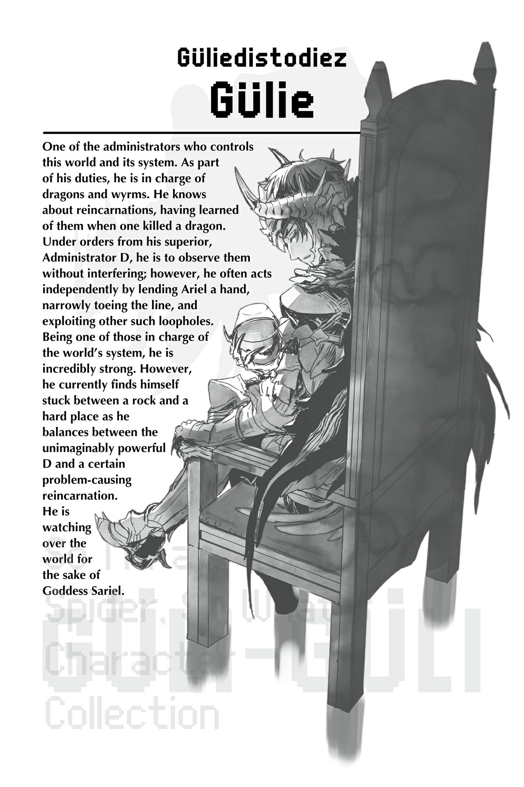

# Chương 5: Lũ nhện cùng một giuộc
*(Spiders of the Same Stripe)*

---

*Bản dịch thông tin nhân vật:*
**GÜLIEDISTODIEZ (GÜLIE)**
Một trong những quản trị viên điều hành thế giới này và hệ thống của nó. Là một phần trong bổn phận của mình, anh chịu trách nhiệm quản lý loài rồng và phi long. Anh biết về những người tái sinh, biết được sự tồn tại của họ kể từ khi có một người hạ gục một con rồng. Dưới mệnh lệnh của cấp trên, Quản trị viên D, anh có nhiệm vụ quan sát họ mà không được phép can thiệp; tuy nhiên, anh thường tự ý hành động bằng cách giúp đỡ Ariel một tay, mấp mé đi trên ranh giới luật lệ và lợi dụng những kẽ hở tương tự. Là một trong những người chịu trách nhiệm vận hành hệ thống của thế giới, anh sở hữu sức mạnh vô cùng khủng khiếp. Dẫu vậy, anh hiện đang rơi vào thế tiến thoái lưỡng nan khi phải giữ thăng bằng giữa một D có sức mạnh vượt ngoài sức tưởng tượng và một kẻ tái sinh chuyên gây rắc rối nào đó. Anh đang trông chừng thế giới này vì mục đích bảo vệ Nữ thần Sariel.

---

Sau khi đánh bại các Phân thân Tư duy, tôi dịch chuyển trở lại nơi tôi vừa rời đi, nhưng Güli-güli vẫn ở đó.

“Xong rồi à?”

Tôi gật đầu đáp lại.

Nhưng anh ta vẫn tiếp tục ngồi đó không nói một lời, và tôi chắc chắn không thể tự khơi mào một cuộc trò chuyện, nên sự im lặng cứ kéo dài vô tận.

Lũ nhện rối hoàn toàn đông cứng, có lẽ là do căng thẳng, nghĩa là bầu không khí ngột ngạt cứ thế càng thêm trầm trọng.

Ngay khi thời gian trôi qua lâu đến mức tôi bắt đầu nghĩ mình có thể chết vì căng thẳng, Ma Vương và những người khác trong nhóm của chúng tôi trở về từ thị trấn.

Các người về muộn quá đấy!

Bình thường các người chỉ ở lại một đêm thôi mà; sao lại chọn đúng lúc này để ở lại tới hai đêm chứ?!

Các người có biết tôi cảm thấy thế nào khi phải giữ im lặng suốt hai đêm liền không hả?!

“Úi chà, lâu hơn dự kiến một chút. Xin lỗi nhé, xin lỗi.”

Xin lỗi mà xong à!

Ma Vương thản nhiên phớt lờ Güli-güli không trượt phát nào.

Mera và Dơi con nhìn anh ta chằm chằm như điên, nhưng vì Ma Vương đang phớt lờ anh ta, nên có vẻ họ cũng không muốn là người lên tiếng trước.

Ma Vương tiếp tục phớt lờ Güli-güli khi cô đặt một chiếc thùng gỗ xuống đất một cách dứt khoát.

Ồ, một chiếc thùng gỗ.

Các bạn biết điều đó nghĩa là gì rồi đấy.

Chắc chắn phải là rượu!

Không chần chừ thêm nữa, giờ uống rượu bắt đầu.

Như thường lệ, Ma Vương nốc rượu như nước lã, và Güli-güli cũng uống kịp tốc độ của cô ta.

Này, chờ chút coi! Sao anh ta lại uống rượu với chúng tôi thế này?!

Mera uống một chút ít, nhưng hầu hết anh chỉ ngồi đó với vẻ mặt hài lòng.

Hết lần này đến lần khác, ánh mắt của anh cứ hướng về phía Dơi con, người mà một lần nữa lại lén nhấp một ngụm rượu và lập tức lăn ra bất tỉnh nhân sự.

Ủa, cái gì thế? Đây là cái hội chứng lolicon mà tôi từng nghe mọi người bàn tán đấy à?

Thôi đi, tôi chắc chắn đây chỉ là ánh mắt ấm áp của một người cha đang trìu mến nhìn đứa trẻ mình bảo hộ thôi.

“Thế, ông đang làm gì ở đây vậy, Gülie?”

Aha, Ma Vương cuối cùng cũng đề cập đến chuyện đó rồi!

“Tôi có việc với cái thứ đó,” Güli-güli lạnh lùng đáp lại. “Và sẵn tiện đang ở đây, tôi nghĩ mình cũng nên ghé qua thăm cô.”

Khoan, vừa rồi anh ta đang nói về tôi đấy à?

“Cái gì mà 'cái thứ đó' chứ? Tôi là không khí chắc?”

Güli-güli giật mình nhìn tôi.

Làm gì mà ngạc nhiên dữ vậy hả ông bạn?

“À, hình như cô Bạch khi say rượu sẽ nói chuyện đấy.”

“Thế à?”

Để che giấu sự ngạc nhiên của mình, Güli-güli nhấp thêm một ngụm rượu một cách lịch thiệp.

Chẳng hiểu sao, cảnh tượng đó trông buồn cười đến mức tôi bật cười toe toét.

“Với lại, cô ta cũng rất dễ cười nữa.”

“Ừm, tôi thấy rồi.”

Mọi thứ đột nhiên trở nên cực kỳ khôi hài đến mức tôi bắt đầu vỗ đập bôm bốp vào lưng Mera khi anh ta đang ngồi bên cạnh tôi.

Không hiểu kiểu gì, cú vỗ đó lại khiến anh ta bay thẳng lên trời.

Hửm.

Tôi tưởng mình chỉ vỗ nhẹ nhàng thôi chứ, thế mà vẫn khiến anh ta bay màu lên không trung được sao?

Cảnh tượng anh ta bắn thẳng lên trời như thế làm tôi bò lăn bò càng ra cười dữ dội hơn nữa.

“Cậu ta chết chưa?”

“Không, có vẻ chỉ đơn thuần là bất tỉnh thôi.”

Ma Vương và Güli-güli nghiêm túc kiểm tra Mera.

Thôi nào, đừng lo lắng quá! Định luật tấu hài đã quy định rõ là không ai chết vì mấy trò thế này đâu!

“Thôi thì, ta cứ trị liệu cho cậu ta để đề phòng vậy. Mà dù sao thì, ông có việc gì với cô Bạch thế?”

“Các bản sao của nó đang làm loạn, nên tôi bảo nó đi ngăn bọn họ lại.”

Ngay khi nghe thấy từ các bản sao, Ma Vương liền bật dậy cái rụp.

“Ra là cô ta thực sự có các bản sao à?”

“Cô biết chuyện này sao?”

“Đại khái thế.”

Ồ.

“Khoan đã, thật á? Sao cô biết được hay thế? Bộ cô có siêu năng lực ngoại cảm hả? Hử? Phải không?”

“Ngoại cảm cái gì chứ? Phải gọi là thám tử lừng danh mới đúng! Ta suy luận ra tất cả đấy nhé! Hãy cúi đầu trước tài suy luận thần sầu của ta đi!”

“Ồ ồ ồ! Bộp, bộp, bộp.”

“Ha ha ha! Đúng rồi đấy — hãy vỗ tay tán thưởng ta đi!”

Chẳng biết vì sao, hai đứa tôi lúc này lại phối hợp ăn ý ghê.

“...Tôi từng thắc mắc tại sao tính cách của cô lại biến đổi thành thế này, nhưng giờ tôi nghĩ mình đã hiểu rồi.”

“Chuẩn luôn đúng không? Cô Bạch trông thì có vẻ cực kỳ ngầu lòi và ít nói, chứ thực ra nội tâm bên trong của cô ta điên khùng thế này này!”

“Điên khùng?! Ý cô ‘điên khùng’ là sao hả?!”

Cứ thế, hai đứa tôi gào thét tranh cãi ỏm tỏi về những chuyện chẳng đâu vào đâu.

Sau khi hét vào mặt nhau một hồi, bầu không khí cuối cùng cũng yên ắng trở lại.

“Ariel. Rõ ràng là các bản sao của sinh vật này có ý định tiêu diệt toàn bộ nhân loại.”

“Thế à?”

“Và nguyên nhân khiến bọn họ nổi loạn như vậy, rất có thể là vì họ đã hấp thụ linh hồn của Taratect Chúa.”

“Hử! Ra là vậy sao.”

“Ariel. Cô thù ghét loài người đến mức muốn tiêu diệt họ sao?”

Ma Vương nhấp thêm một ngụm rượu trước khi trả lời.

“Tất nhiên là có chứ.” Uống cạn ly rượu, cô bắt đầu tuôn ra một tràng tức tối. “Phải, ta ghét bọn họ. Ta ghét bọn họ đến mức muốn phát điên lên được! Ta ghét lũ khốn nạn đã để ngài Sariel làm vật hiến tế để chúng có thể tiếp tục sống cuộc đời ngu xuẩn của mình, ta ghét cái thế giới vận hành dựa trên sự đau khổ triền miên của ngài Sariel, ta ghét tất tần tật mọi thứ!”

Chiếc ly trong tay Ma Vương nứt ra rồi vỡ tan thành từng mảnh nhỏ.

A ra thế.

Thì ra Ma Vương chính là nguyên nhân khiến các Phân thân Tư duy của tôi nổi loạn.

Tôi đoán nếu cơ thể mẹ (Ariel) chứa đựng sự phẫn nộ chôn giấu sâu sắc đến nhường này, thì chẳng trách nó lại ảnh hưởng đến đứa con của cô ta, chính là mẹ tôi (Taratect Chúa).

Và bằng cách nuốt chửng mẹ tôi, các Phân thân Tư duy của tôi cũng thừa hưởng luôn sự phẫn nộ đó.

Mặc dù tôi vẫn nghĩ những thực thể được coi là bản sao của tôi lại dễ dàng bị ảnh hưởng bởi thứ như thế thì thật là yếu đuối.

“Nhưng đó không phải là điều ngài Sariel mong muốn. Đó là lý do tại sao ta đã kìm nén suốt thời gian qua. Ông cũng cảm thấy như vậy đúng không, Gülie?”

“Đúng vậy. Tôi đoán tôi cũng thế.”

“Oa, ngu ngốc thật.”

Ma Vương và Güli-güli đồng loạt quay đầu nhìn tôi trước lời nhận xét vô thưởng vô phạt đó.

“Xin lỗi, cô vừa nói gì cơ?”

“Tôi bảo ngu ngốc ấy. Ý tôi là, tôi nói sai chỗ nào à? Thật ngớ ngẩn khi không làm điều mình thực sự muốn làm chỉ vì lợi ích của người khác. Ý tôi là, không được làm những gì mình muốn thì sống có ý nghĩa gì chứ? Cuộc sống kiểu đó chẳng vui vẻ gì cả. Bất kể người khác nói hay làm gì, điều quan trọng nhất vẫn là những gì bản thân mình muốn làm! Đúng không?”

Chẳng có lý lẽ nào bắt bản thân phải kìm nén vì người khác cả.

Tôi sẵn sàng giẫm đạp lên người khác nếu điều đó giúp tôi đạt được những gì mình muốn.

“Ha ha.” Ma Vương cười trừ một cách mệt mỏi. “Nếu bọn ta có thể ích kỷ được như cô Bạch, cuộc đời của tụi ta chắc đã dễ thở hơn nhiều rồi.”

Mặt khác, Güli-güli lại tỏ vẻ trầm tư suy nghĩ.

“Ra là vậy. Họ rất giống nhau.”

“Hả? Ai cơ?”

“Tôi từng luôn thắc mắc tại sao D lại đặc biệt thích thú với sinh vật này đến vậy. Nhưng sau cuộc trò chuyện này, mọi thứ đều đã sáng tỏ. Sự kiêu ngạo và ích kỷ của sinh vật này giống hệt như D.”

“Phản đối!”

Thưa Tòa! Làm sao gã này dám bôi nhọ thanh danh của tôi bằng cách so sánh tôi với D chứ?!

“Đá chính xác là lý do khiến nó trở nên cực kỳ nguy hiểm.”

Güli-güli đặt chiếc ly xuống.

Nhưng trước khi anh ta kịp làm gì khác, một chiếc điện thoại thông minh bỗng dưng hiện hình ngay trước mắt anh ta.

“Ngươi biết ta định nói gì rồi đúng không?”

“...Tôi hiểu rồi.”

“Tốt.”

Sau cuộc đối thoại ngắn ngủi đó, chiếc điện thoại thông minh liền biến mất.

“Cái quái gì thế?”

“Chịu chết.”

Ma Vương và tôi nhìn nhau rồi cùng nhún vai.

Tôi có cảm giác như mình vừa mới suýt soát thoát khỏi một tình huống cực kỳ ngàn cân treo sợi tóc, nhưng thôi cứ coi như đó là do tôi tưởng tượng ra đi.

“Hừm. Bất kể thế giới nào, bất kể thời đại nào, có vẻ như những sự kiện trọng đại luôn được khơi mào bởi sự ích kỷ của một cá nhân duy nhất.”

Güli-güli đăm đăm nhìn tôi.

“Cô định làm gì kể từ thời điểm này?”

“Biết chết liền.”

Tôi sẽ không biết mình sắp làm gì tiếp theo cho đến khi việc đó thực sự diễn ra.

“Những gì tôi biết là, tôi sẽ làm những gì mình muốn. Tôi không để bất kỳ ai khác tác động khiến tôi thay đổi mục tiêu hay bất kỳ điều ngu ngốc nào tương tự. Tôi chỉ hành động dựa trên lòng tự tôn của chính mình. Ông cứ tin chắc như vậy đi.”

Tôi không giống lũ Phân thân Tư duy ngu ngốc kia, những kẻ đã để mẹ tôi tác động đến mức cố gắng quét sạch nhân loại.

Tôi sẽ đi theo ý chí của chính mình và làm chính xác những gì bản thân muốn làm.

Tuy nhiên, vẫn có một vấn đề nho nhỏ ở đây.

Chính xác thì “lòng tự tôn” của tôi là gì?

Tôi không thể cứ sống vật vờ mà không có lý do được.

Tôi phải sống với lòng tự tôn chứ, đúng không?

Tôi đã tự thề với bản thân điều đó sau khi ngôi nhà của mình bị thiêu rụi ở Đại Mê cung Elroe.

Nhưng kể từ đó, tôi đã quá bận rộn với việc duy trì sự sống đơn thuần đến mức chưa có cơ hội quyết định xem lòng tự tôn của mình thực chất dựa trên điều gì.

Dẫu vậy, giờ đây tôi đã không còn phải lo lắng về việc sống sót đơn thuần nữa.

Tôi đã trở nên đủ mạnh để có thể sống mà hầu như không gặp bất kỳ trở ngại nào.

Đã đến lúc tôi phải thực sự sống với lòng tự tôn rồi.

Lòng tự tôn sao...

Tôi nhìn hai người đang ở trước mặt mình.

Ma Vương và Güli-güli.

Hai người này đã sống lâu đến mức khó tin, nhưng họ lại hoài phí tất cả những năm tháng đó vì một người khác.

Cụ thể là để bảo vệ lòng tự tôn của Nữ thần Sariel.

Ánh mắt của tôi tiếp tục dịch chuyển.

Kế đến, tôi thấy Mera và Dơi con đang say giấc nồng bên nhau.

Mera cũng thuộc kiểu người sẵn sàng cống hiến cuộc đời mình cho kẻ khác.

Hành động vì lợi ích của người khác...

Đó là một động lực mà tôi không tài nào thấu hiểu nổi.

Nhưng nó thực sự có vẻ là một động lực đáng tự hào.

Sống tiếp mà chẳng có lòng tự tôn nào thì thật là vô nghĩa.

Thế nhưng, liệu sống cô độc và chẳng có gì ngoài lòng tự tôn thì có ý nghĩa gì không?

Hình ảnh Địa Long Araba chợt hiện lên trong tâm trí tôi.

Araba cực kỳ mạnh mẽ và tôn nghiêm, nhưng những giây phút cuối đời của nó lại quá... cô độc.

Liệu một ngày nào đó tôi cũng sẽ chết đi như thế sao?

Chết trong lặng lẽ, không một ai thương xót.

...Ừm, tôi không muốn thế đâu.

Lòng tự tôn vì lợi ích của người khác sao...?

Mà thôi, tôi đang có hẳn hai chuyên gia trên con đường đó ngay trước mắt mình đây, vậy nên tôi sẽ quan sát và học hỏi từ họ vậy.

“Hãy chỉ giáo cho tôi nhiều hơn nhé, senpai!”

“...Nó đang lảm nhảm cái gì thế?”

“Ta chịu thôi. Ta chẳng bao giờ biết cô Bạch đang nghĩ cái quái gì nữa.”

Phản ứng của hai người họ trông buồn cười đến mức làm tôi không kìm được lại bật cười lần nữa.

Tôi vẫn chưa chắc chắn lòng tự tôn của mình thực chất là gì, nhưng nếu cứ tiếp tục quan sát hai người này, tôi cảm giác như mình rồi sẽ tìm ra câu trả lời thôi.

Nhân tiện thì, sáng hôm sau khi tỉnh dậy tôi chẳng còn nhớ bất kỳ điều gì về chuyện này cả.

Đôi khi bạn uống rượu, và đôi khi rượu uống bạn.

Chà, đó đúng là một câu nói hay đấy.

---

[◀ Chương trước: Đoạn phụ: Quyết định của Giáo hoàng](interlude_the_pontiffs_decision.md) | [Chương tiếp theo: Chương V4: Bỏ lại vận rủi phía sau ▶](v4_leaving_misfortune_behind.md)
