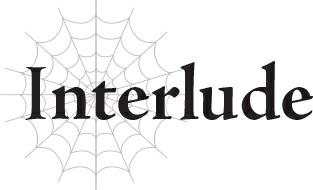

# Đoạn phụ: Cô nàng độc mồm và cậu bé Anh hùng quá đỗi thân thiện
*(The Foul-Mouthed Girl and the Too-Friendly Boy Hero)*

---

Xin chào mọi người, tôi là Aurel, cô bé tám tuổi được mọi người yêu thích nhất đây.

Cái lão già chết tiệt kia vẫn chưa chịu mò về nữa.

Không hiểu lão đang nghĩ cái quái gì mà lại bỏ mặc một thiếu nữ đáng yêu như tôi cô đơn một mình thế này?

Ý tôi là, dù biết thừa sư phụ Ronandt là một pháp sư siêu tài ba này nọ, tôi vẫn không thấy việc vứt bỏ một đứa trẻ tám tuổi ở cái nơi đất khách quê người này để tự tiện đi du hành hay làm cái quái gì đó là chấp nhận được.

Giờ tôi biết phải làm thế nào đây?

Lúc này có gọi lão là "lão già" thay vì "Sư phụ" thì cũng chẳng ai trách tôi được đâu.

Dù sao thì, vì lão bỏ đi mà chẳng để lại một lời dặn dò hay hướng dẫn nào, tôi đành phải nhờ Tiva – ông lớn của Đế quốc – giao cho chút việc để làm tạm thời.

Thị trấn tôi đang ở hiện tại có cả quân đội Ohts lẫn vài người của quân đội Đế quốc.

Về cơ bản là tôi đang làm mấy việc lặt vặt cho họ.

Cũng may là ngày đầu tiên lão già ít nhất đã giới thiệu tôi với họ.

Nếu không chắc họ đã đuổi thẳng cổ tôi ra ngoài và bảo: "Con nhóc quái nào đây?!" rồi.

Thị trấn này đang bị chiếm đóng bởi một đội quân xâm lược, còn tôi chỉ là một đứa trẻ đến từ Đế quốc – đồng minh của đội quân đó.

Nếu phải tự lực cánh sinh ở đây, có khi tôi đã bị giết trong cái ngõ hẻm tối tăm chết tiệt nào đó rồi.

Chẳng vui vẻ gì đâu.

“Ồ, Aurel, thật đúng lúc. Ta đang chuẩn bị đi mua chút đồ. Con có phiền đi cùng để xách đồ giúp ta không?”

Ngài Tiva khá thường xuyên bảo tôi làm mấy việc vặt vẹo như thế này.

À thì, nghe thì giống như một lời yêu cầu lịch sự, nhưng ý tôi là, ông ấy đang cưu mang tôi sau khi tôi bị lão chủ cũ vứt bỏ.

Tôi làm gì có tư cách mà từ chối chứ.

“Dạ, tất nhiên.”

“Ít nhất con cũng nên nói là 'Dạ, tất nhiên rồi ạ' chứ,” ngài Tiva mỉm cười dịu dàng.

Xin lỗi ngài nhé.

Tôi vốn là dân nhà quê, nên không biết nói năng uốn éo cho đúng chuẩn đâu.

Nhưng ngài Tiva thực sự là một người tốt, sẵn sàng giúp đỡ một đứa nhóc độc miệng như tôi.

Ngài ấy tốt đến mức tôi đang nghĩ có khi mình nên đổi sư phụ, bỏ quách lão già kia đi cho rồi.

Tôi bước theo ngài Tiva vào thị trấn.

“Ta xin lỗi nhé, Aurel. Ta cũng chẳng muốn bắt một đứa trẻ nhỏ tuổi như con phải xách đồ giúp ta đâu, nhưng nói ra thật đau lòng, hiện tại chẳng có ai khác rảnh rỗi cả,” ngài Tiva xin lỗi.

“Mấy chuyện thế này chẳng nhằm nhò gì với con đâu, thưa ngài. Thực tế thì, nếu có đứa nào dám phàn nàn về công việc chết tiệt của chúng, ngài cứ sút thẳng một phát vào mông chúng cho con.”

Lời nhận xét bỗ bã của tôi khiến ngài Tiva bật cười.

Tôi biết ngài ấy thực sự đang thiếu nhân lực trầm trọng.

Việc quản lý một thị trấn vừa mới bị chiếm đóng chắc chắn chẳng dễ dàng gì.

Theo lý thuyết thì nước Ohts chịu trách nhiệm chính cho chiến dịch này, nên Đế quốc không cần phải làm gì nhiều, thế nhưng ngài Tiva ngày nào cũng phải đầu tắt mặt tối làm việc.

Mà thực tế thì Ohts là một quốc gia khá yếu ớt, nên nếu để họ tự mình quản lý cái thị trấn này thì kiểu gì cũng nát bét mà thôi.

Đó là lý do tại sao người của Đế quốc phải chạy đôn chạy đáo không ngừng nghỉ, dù đây vốn chẳng phải việc của họ.

Nhưng đối với tôi thì thế lại hay, vì nhờ vậy mà ngài Tiva mới có thể cưu mang tôi sau khi lão già kia vứt bỏ tôi.

Có điều đối với người của Đế quốc ở thị trấn này thì đúng là phiền phức chết đi được.

Nó khiến cho bầu không khí ở đây trở nên khá căng thẳng.

“Hửm?”

Ngài Tiva nhíu mày.

Phía trước có một đám đông đang tụ tập, la hét và chửi bới om sòm.

Ái chà. Có vẻ sắp có rắc rối rồi đây.

“Các người đang làm gì thế?” Ngài Tiva lên tiếng hỏi đám đông.

Ngay cả khi không cần hét lên, giọng nói của ngài ấy vẫn vang lên dõng dạc và rõ ràng.

Đám đông lập tức khựng lại và quay lại nhìn chúng tôi.

Ngay khi nhìn thấy bộ quân phục của ngài ấy và nhận ra đó là một kỵ sĩ của Đế quốc Renxandt, họ lập tức giải tán tán loạn khắp ngả.

Người duy nhất còn lại là một cậu bé trông như vừa bị đánh tơi tả.

“Nghĩ không ra lại có nhiều người lớn đi làm chuyện như thế này với một đứa trẻ... Thật tàn nhẫn quá. Cháu có sao không?”

Ngài Tiva đưa tay ra muốn đỡ cậu bé.

Thế nhưng, cậu bé tự mình đứng dậy mà không cần sự giúp đỡ của ngài ấy.

Oa. Giờ mới để ý, khi đứng lên trông cậu nhóc này thực sự rất ưa nhìn đấy.

“Cháu tự hỏi, liệu họ có thực sự là những kẻ tàn nhẫn ở đây không?”

Mới đầu ngài Tiva trông có vẻ bối rối; nhưng rồi mắt ngài ấy mở to, dường như đã nhận ra điều gì đó.

“So với những gì chúng ta đã gây ra cho họ, việc để họ trút giận thế này cũng là điều công bằng thôi,” cậu bé buồn bã tiếp tục nói.

Tôi nghĩ giờ tôi đã hiểu cậu ta đang muốn ám chỉ điều gì rồi.

Quân Ohts đã cướp bóc và chiếm đóng thị trấn này.

Chưa kể, họ làm vậy bằng cách tấn công những người dân thị trấn vô tội trong khi các chiến binh của họ đang chiến đấu ở một chiến trường khác.

Vị lãnh chúa được mọi người yêu mến cùng phu nhân của ông đã bị ám sát, và hầu hết mọi người đều nghĩ đó cũng là do Ohts làm.

Việc những người dân còn sống sót của thị trấn này căm ghét Ohts đến tận xương tủy là điều hiển nhiên.

Đến mức hầu như ngày nào họ cũng tấn công binh lính của Ohts.

Nhưng có một điều tôi vẫn không hiểu nổi.

Tại sao cậu nhóc này lại nói chuyện như thể chính bản thân cậu ta là kẻ đã gây ra tội lỗi với họ vậy?

Cậu ta trông chẳng lớn hơn tôi bao nhiêu tuổi, nên tôi không nghĩ cậu ta có tham gia vào cuộc tấn công thị trấn này đâu.

“Không cần ngài phải làm việc đó đâu, thưa Anh hùng Julius.”

Lời nói của ngài Tiva giáng thẳng vào bộ não bé nhỏ đang hoang mang của tôi như búa bổ.

Anh hùng? Anh hùng á?!

“Cái gì cơ—?!”

Tôi có lỡ hét toáng lên một chút thì cũng không thể trách tôi được, đúng không?

Ý tôi là, đây là Anh hùng đấy nhé!

Ai mà không sốc cho được khi biết niềm hy vọng lớn nhất của nhân loại chống lại Ma Vương lại là một đứa nhóc tì thế này chứ?!

“Ngài được đưa theo chỉ là để trải nghiệm chiến trường thực tế mà thôi. Ngài không cần phải chịu bất kỳ trách nhiệm nào cho những gì đã xảy ra trong trận chiến này cả.”

“Nhưng dưới góc nhìn của họ, tôi chính là một trong những kẻ thủ ác. Bởi vì Anh hùng đã ra trận chống lại họ, nên ngay cả khi tôi không trực tiếp tham gia, quân đội Ohts đã đánh mất đi lý trí về lẽ phải. Đó là lý do tại sao quân Ohts lại hành xử bất công như vậy. Có Anh hùng đứng về phía mình, quân đội Ohts tự cho rằng họ là chính nghĩa, và bất cứ điều gì họ làm cũng không thể sai trái được. Ngay cả khi tôi không tự mình làm những việc đó, thì chính sự tồn tại của tôi đã đẩy thị trấn này vào bước đường cùng.”

Oa, nghe phức tạp thật đấy.

“Không phải vậy đâu. Dù trên lý thuyết ngài có tham gia hay không, thì kẻ tấn công thị trấn này vẫn là quân đội Ohts, chứ không phải ngài.”

“Dù vậy, tôi vẫn không thể tha thứ cho bản thân mình.”

Cậu nhóc Anh hùng buồn bã nhìn quanh.

Ánh mắt cậu dừng lại ở những ngôi nhà bị thiêu rụi hoàn toàn và những đống đổ nát vẫn chưa được tái thiết.

Đôi mắt ấy đong đầy sự hối hận, nhưng ẩn chứa trong đó còn là một ý chí quyết tâm mạnh mẽ hơn thế.

À, giờ thì tôi hiểu rồi.

Cậu nhóc này chắc chắn là một vị anh hùng đích thực.

Trông cậu ta có vẻ trạc tuổi tôi, nhưng đến cả người lớn tôi cũng hiếm khi thấy ai có ánh mắt kiên định đến vậy, chứ nói gì đến một đứa trẻ.

“Thưa Anh hùng...”

Ngài Tiva nhìn cậu bé đầy xót xa, chắc hẳn ngài ấy cũng đã nhìn thấy điều tương tự trong mắt cậu ta giống như tôi.

Tôi có thể nhận ra ngài ấy đang tự cảm thấy có trách nhiệm với tư cách là một trong những người lớn đã ép một cậu bé nhỏ tuổi thế này phải mang trên mình một quyết tâm nặng nề đến vậy.

Tôi không thực sự hiểu hết những gì ẩn chứa đằng sau quyết tâm của cậu nhóc Anh hùng hay nét mặt phức tạp của ngài Tiva.

“Tôi đã đến đây mà không suy nghĩ chín chắn, và giờ tôi vô cùng hối hận vì điều đó. Kể từ nay về sau, tôi sẽ tự mình suy nghĩ và hành động. Sẽ không bao giờ tôi để bản thân bị lợi dụng chỉ vì mình là một đứa trẻ nữa. Dù có là trẻ con hay không, tôi vẫn là Anh hùng. Tôi không có ý định trở thành một con rối không xứng đáng với danh hiệu của mình.”

“Vậy thì xin ngài hãy tự bảo trọng. Nếu ngài muốn trở thành một Anh hùng thực sự, ngài không được phép vứt bỏ mạng sống của mình một cách vô ích như thế đâu.”

Ngài Tiva đưa ra lời khuyên với tông giọng vô cùng dịu dàng.

“Nhưng bằng cách nào đó, tôi phải giúp đỡ người dân thị trấn này.” Cậu nhóc Anh hùng tỏ vẻ không cam lòng.

“Và vì thế ngài cam chịu để họ đánh mình sao? Điều đó sẽ không giúp ích gì cho ngài hay cho họ đâu. Việc làm tổn thương ngài chỉ có thể xoa dịu nỗi đau khổ của họ trong một khoảnh khắc ngắn ngủi mà thôi. Rồi sau đó, họ sẽ cảm nhận được cơn đau ở bàn tay đã đánh ngài, và nỗi dằn vặt trong tim khi đã làm tổn thương một đứa trẻ nhỏ tuổi đến thế. Dần dà, họ có thể sẽ đánh mất hoàn toàn đạo đức của bản thân. Ngài không được để bất kỳ ai đánh mình, vì lợi ích của chính họ cũng như của bản thân ngài.”

Nói hay lắm, thưa ngài.

Có vẻ như cậu nhóc Anh hùng cũng bị bất ngờ trước câu trả lời đó.

“Nhưng... vậy thì tôi có thể làm gì cho họ đây?”

“Sao cậu không đi săn quái vật hay gì đó đi?” Ôi thôi. Tôi lỡ buột miệng trả lời mất rồi. “Ồ, ừm, xin lỗi nhé!”

“Không, không sao đâu. Ý cậu 'săn quái vật' là thế nào?”

Cậu nhóc Anh hùng mỉm cười thân thiện với tôi.

“Ồ, ừm... Thì, cậu biết đấy, mấy chỗ tường thành phòng thủ của thị trấn bị phá hỏng rồi đúng không? Họ có lính canh gác ở những chỗ nghiêm trọng nhất, nhưng vẫn còn những chỗ khác trông có vẻ rất dễ bị đổ. Tớ nghe người ta nói là nhiều người dân lo lắng quái vật sẽ tông sập tường thành đến mức đêm ngủ không ngon giấc. Ở bên ngoài dạo này cũng xuất hiện nhiều quái vật hơn trước nữa, chắc là vì chúng bị thu hút bởi mùi tử khí hay gì đó, đúng không? Nếu cậu tiêu diệt được đám quái vật đó, chẳng phải sẽ giúp ích được cho người dân ở đây sao? Dù tớ nghĩ việc đó giống việc của một mạo hiểm giả hơn là của một Anh hùng.”

Cậu nhóc Anh hùng mắt sáng lên khi nghe tôi giải thích.

“Một mạo hiểm giả ư?”

“Xin lỗi nhé, ừm, tớ có nói gì sai khiến cậu phật ý không?”

“Không, không đâu, ngược lại mới đúng chứ. Cậu nói rất phải. Có lẽ tớ nên thử làm chuyện như vậy xem sao. Cảm ơn cậu nhé.”

Nói xong, cậu nhóc Anh hùng liền chạy biến đi.

Ngài Tiva và tôi dõi mắt nhìn theo bóng cậu ta rời đi, rồi tiếp tục hoàn thành việc mua sắm như kế hoạch.

Kể từ ngày hôm sau, tôi nghe người ta đồn rằng vị Anh hùng nhỏ tuổi đang tích cực chiến đấu với quái vật bên ngoài để bảo vệ sự an toàn cho người dân thị trấn.

Nếu được hỏi, tôi sẽ nói cậu ta có tố chất để trở thành một vị Anh hùng thực sự đấy.

Kiểu như, một người thực sự xứng đáng với danh hiệu của mình vậy.

Mà nhắc đến danh hiệu, không biết khi nào cái lão được gọi là "Trưởng pháp sư Hoàng gia của Đế quốc" kia mới chịu mò đầu về đây nữa?

Lão ta sở hữu địa vị cao quý và quyền lực ngút trời thật đấy, nhưng tính nết thì chẳng tốt đẹp gì đâu.

---

[◀ Chương trước: Hội thoại: Cuộc họp Phân thân Tư duy #3](conversation_meeting_of_the_parallel_minds_3.md) | [Chương tiếp theo: Chương V3: Kẻ đứng sau vận rủi ▶](v3_the_man_behind_the_misfortune.md)
