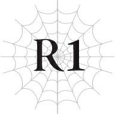
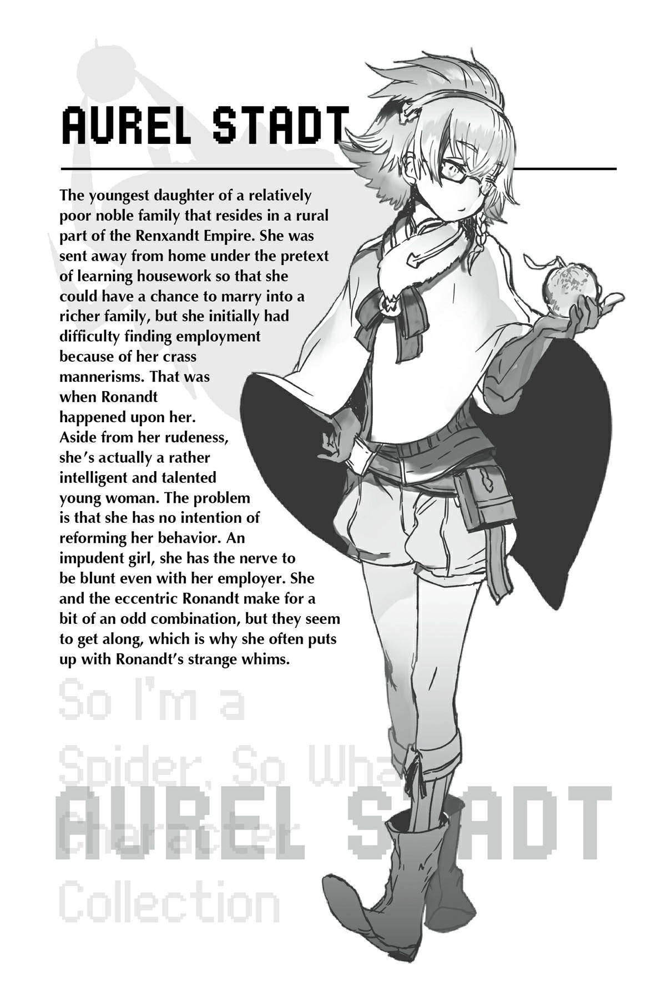

# Chương R1: Lão già lên đường
*(The Old Man Goes on a Journey)*

---

Ta cố gắng tinh luyện ma lực của mình.

Nhưng lượng ma lực tích tụ chẳng thấm vào đâu, khác xa so với những gì ta đang hình dung.

Tất nhiên, trong tâm trí ta đang tưởng tượng về thực thể đó.

Con nhện mà ta đã chạm trán trong Mê cung Lớn Elroe.

So với khả năng làm chủ ma pháp đạt đến mức nghệ thuật của sinh vật kỳ diệu đó, kỹ năng của ta thật thô thiển và thiếu sót làm sao.

Chẳng lẽ đây là giới hạn của kẻ được mệnh danh là pháp sư mạnh nhất Đế quốc—thế giới, thậm chí—sau cùng chỉ thế này thôi sao?

Ta không thể chấp nhận điều đó.

Ta phải là kẻ mạnh nhất.

Ma pháp của ta phải tiến xa hơn bất kỳ ai khác.

Nếu không thì...

“Ronandt, ngươi là pháp sư mạnh nhất thế giới còn ta là kiếm sĩ mạnh nhất thế giới. Nếu hai ta sát cánh bên nhau, đặc biệt là khi có thêm Anh hùng nữa, chúng ta sẽ chẳng phải sợ bất kỳ thứ gì. Chắc chắn là không phải những kẻ như ma tộc. Ngươi và ta sở hữu sức mạnh đủ để bảo vệ Đế quốc và cả thế giới này.”

Kiếm Vương tiền nhiệm chính là người đã nói những lời đó.

Ông ấy là người bạn thân và cũng là đồng đội chí cốt của ta.

Từ khi còn trẻ, chúng ta đã thề sẽ cùng nhau bảo vệ Đế quốc.

Thế nhưng, một ngày nọ, ông ấy biến mất. Không để lại một lời nhắn nào, ngay cả với ta.

Sự mất tích của người đàn ông được mệnh danh là kiếm thần ấy đã gieo rắc bóng tối của nỗi sợ hãi không chỉ lên Đế quốc mà còn lên toàn nhân loại.

Đó là lý do tại sao ta phải...

“Sư phụ Ronaaandt ơi. Mông con đau quá.”

“Hãy chú ý lễ nghi của ngươi đi, nhóc con. Về mặt kỹ thuật mà nói thì ngươi là một đứa con gái, đúng chứ? Ngươi không được phép nói năng như vậy.”

Khi chiếc xe ngựa xóc nảy cộc cạch chạy dọc đường, cô bé ngồi bên cạnh ta, Aurel, không ngần ngại than thở.

Tuy nhiên, ta đoán cũng là tự nhiên khi con bé bị ê ẩm mông sau khi ngồi trên chiếc xe ngựa khó chịu này quá lâu. Ta sở hữu kỹ năng [Vô hiệu Đau], nên chuyện này chẳng hề hấn gì, nhưng Aurel thì không có cơ hội được hưởng lợi từ bất kỳ kỹ năng nào tương tự.

“Ý sư phụ 'về mặt kỹ thuật' là sao chứ? Nói thế với một thiếu nữ đáng yêu như con thì bất lịch sự quá đấy, thưa ông già!”

“Ngu ngốc. Nam hay nữ thì có gì khác biệt nhiều đâu, nhất là ở độ tuổi nhỏ như thế này. Đó là lý do tại sao ta gọi là về mặt kỹ thuật. Nếu ngươi muốn được đối xử như một quý cô, có lẽ ngươi nên hành xử cho đúng mực đi.”

“Hừm!” Aurel cáu kỉnh càu nhàu.

Aurel là một đứa trẻ được nhận làm người hầu cận của ta.

Tuổi của con bé là bảy, hay là tám nhỉ?

Dù sao đi nữa thì chuyện đó cũng chẳng quan trọng. Con bé vẫn chỉ là một đứa trẻ.

Nhìn con bé phồng má giận dỗi, ta thừa nhận trông cũng có nét đáng yêu thật, nhưng đứa trẻ nào mà chẳng vậy.

Chắc chắn điều đó không thể biến con bé thành một “thiếu nữ đáng yêu” được.

Mà thôi, ta cũng đâu phải hạng người đi bắt nạt một đứa trẻ.

Ta thi triển [Ma pháp Trị liệu] lên Aurel để xua tan cơn đau của con bé.

“Ồ, cảm ơn sư phụ! Đỉnh thật đấy, sư phụ Ronandt! Đúng là danh bất hư truyền, pháp sư mạnh nhất thế giới có khác!”

Tâm trạng của Aurel lập tức chuyển biến tốt hơn. Lại thêm một bằng chứng cho thấy con bé thực sự là một đứa trẻ.

“Nịnh nọt cũng vô ích thôi. Và ta hoàn toàn không phải là người sử dụng ma pháp mạnh nhất trên thế giới này đâu.”

“Sư phụ lại khiêm tốn rồi.”

Không, đây không còn là chuyện khiêm tốn nữa.

Chứng kiến sức mạnh của thực thể vĩ đại đó khiến ta nhận ra bản thân còn phải cố gắng nhiều đến nhường nào.

Con quái vật nhện được biết đến với cái tên Cơn Ác Mộng, kẻ mà ta coi là bậc thầy ma pháp đích thực, đã dạy cho ta một bài học nhớ đời về vị thế của mình.

Khi chúng ta đối đầu với thực thể vĩ đại đó cùng một đội kỵ sĩ hỗ trợ phía sau, chỉ có Buirimus và ta là sống sót.

Không, ta thậm chí còn không thể gọi đó là một trận chiến.

Đó chẳng qua chỉ là một cuộc thảm sát đơn phương.

Ngay cả một kẻ tự xưng là pháp sư mạnh nhất thế giới như ta cũng chẳng còn lựa chọn nào khác ngoài việc bỏ chạy.

Sai lầm của ta là đã tự phụ cho rằng không có con quái vật nào có thể là đối thủ của mình, và đã bất cẩn phóng hỏa đốt tổ của thực thể vĩ đại đó.

Nếu ta hành động thận trọng hơn, có lẽ kết cục đã khác.

Thay vào đó, sự ngu ngốc của ta đã dẫn đến thảm họa.

Thế nhưng không hiểu vì lý do gì, toàn bộ trách nhiệm cho việc tổn thất cả đội kỵ sĩ lại bị đổ hết lên đầu Buirimus, người chỉ huy còn lại.

Hắn bị giáng chức và về cơ bản là bị đày đến vùng khí hậu khắc nghiệt của Dãy núi Huyền Bí, nơi trú ngụ của vô số quái vật mạnh mẽ.

Hình phạt nhẹ nhàng đến nực cười của ta chỉ là quản thúc tại gia, trong khi Buirimus thì thực chất chẳng khác nào bị đẩy vào chỗ chết.

Có vẻ như bất kể ta phạm phải sai lầm ngớ ngẩn nào, Đế quốc cũng sẽ không động đến một sợi tóc của ta.

Cho dù lý do duy nhất giúp ta sống sót là nhờ có Buirimus.

Dù thế nào đi nữa, với tư cách là những người cùng sống sót trở về, ta cũng mong Buirimus có thể tiếp tục sống sót, nhưng tất cả những gì ta có thể làm lúc này là tin tưởng vào khả năng tự bảo vệ bản thân của hắn.

“Hự?!”

Chiếc xe ngựa nảy lên một cú cực mạnh lần cuối, và Aurel hét lên một tiếng khi mông đập mạnh xuống sàn. Có vẻ chúng ta đã đến nơi.

“Đến lúc xuống xe rồi.”

“S-Sư phụ Ronandt ơi? Mông con đau quá không nhúc nhích nổi luôn rồi.”

Aurel lấy tay ôm mông nhăn nhó rên rỉ, khiến ta chẳng còn cách nào khác ngoài việc thi triển [Ma pháp Trị liệu] lên con bé một lần nữa.

Khi bước xuống xe ngựa, đập vào mũi chúng ta là một mùi hôi thối nồng nặc đến mức mũi ta suýt chút nữa là rụng mất.

Khi còn ngồi trên xe ngựa đúng là đã ngửi thấy mùi thoang thoảng rồi, nhưng giờ đây khi đứng ngay tại nơi có vẻ là nguồn phát ra thứ mùi đó, nó lại càng nồng nặc và kinh tởm hơn gấp bội.

“Eo ôi...” Aurel dùng ngón tay bịt chặt mũi, trông ngốc nghếch hết sức.

Ta trả tiền cho phu xe vì đã đưa chúng ta đi suốt một chặng đường dài.

Chúng ta là những hành khách duy nhất.

Chẳng mấy ai lại tự dưng nổi hứng muốn đến đây, và cũng hầu như không có tuyến xe khách nào chạy qua, vì vậy ta đã phải thuê riêng một chuyến xe ngựa.

Để cảm ơn vì sự vất vả của bác tài, ta trả nhiều hơn một chút so với mức phí thông thường. Người phu xe nở nụ cười rạng rỡ rồi lập tức quay đầu xe chạy về hướng cũ.

“Đi thôi nào—chúng ta khởi hành thôi.”

Aurel vẫn đứng đờ người ra đó vì kinh hãi, thế nên ta liền cất bước đi trước mà không đợi con bé.

Ta cảm nhận được con bé đang vội vã chạy đuổi theo phía sau.

Nhưng cũng khó mà trách con bé vì đã ngần ngại.

Bất chấp thái độ thường ngày, Aurel thực chất vẫn là một tiểu thư quý tộc chính tông được nuôi dạy đàng hoàng.

Dù là con gái của một gia đình quý tộc tương đối nghèo, nhưng việc một cô bé có gia giáo lại phải ở một nơi thế này rõ ràng là chuyện bất thường.

Sau tất cả, đây là một thị trấn vừa bị tàn phá và hủy diệt bởi quân đội thù địch.

Đây là thủ phủ nằm ở trung tâm Hạt Keren của Sariella.

Không, ta đoán ta nên gọi là cựu thủ phủ mới đúng.

Thị trấn này đã thất thủ trong trận chiến gần đây với Ohts và hiện đang nằm dưới sự kiểm soát của chúng.

“Đứng lại!”

Một tên lính hét lên từ phía ngoài đống đổ nát của cổng thành.

Ta phớt lờ mệnh lệnh đó và tiếp tục tiến lại gần, khiến tên lính hoảng hốt chĩa mũi giáo về phía ta.

“Ta bảo đứng lại!”

“Tốt nhất ngươi nên nhìn cho kỹ người mình đang nói chuyện trước khi đi ra lệnh lung tung đi, nhóc con. Ngươi biết ta là ai không?”

Tên lính cùng các đồng đội nhìn nhau, không biết phải đối phó thế nào trước thái độ kiêu ngạo của ta.

“Các ngươi là binh lính của Ohts, đúng chứ? Cấp trên của các ngươi không thông báo về việc ta sẽ tới sao? Ta là Trưởng lão Ronandt, pháp sư cung đình của Đế quốc Renxandt. Ta đi gấp đến đây để điều tra mối liên hệ của thị trấn này với Cơn Ác Mộng.”

Bọn lính đều đờ người ra khi ta tự giới thiệu bản thân.

Chúng có thể không biết mặt ta, nhưng chắc chắn phải biết danh tiếng của ta.

Ngay cả khi có một cơ hội nhỏ nhoi là chúng không biết đi chăng nữa, chúng cũng không dám mạo hiểm bất kính với bất kỳ ai có liên hệ với triều đình Đế quốc Renxandt.

Trên danh nghĩa chính thức, quốc gia Ohts có liên minh với Đế quốc Renxandt; nhưng trên thực tế, Ohts về cơ bản chỉ là một nước chư hầu phục dịch cho Đế quốc.

Những binh lính này làm sao dám thô lỗ với Trưởng pháp sư Hoàng gia của một Đế quốc đang thống trị đất nước của chúng chứ.

“Đừng có đứng đực ra đó nữa. Đi gọi chỉ huy của các ngươi ra đây và lập tức dẫn ta đi tham quan một vòng!”

Một tên lính vội vã chạy vào trong trạm canh gác ở cổng thành, có lẽ là để xin xác nhận từ cấp trên của hắn.

Ta đứng khoanh tay, chờ đợi với dáng vẻ uy quyền.

Trong lúc đó, ta có thể cảm nhận được ánh mắt của ai đó đang nhìn chằm chằm vào mình.

Là Aurel, con bé vẫn đang đứng sau lưng ta.

Ta chẳng cần quay đầu lại cũng biết con bé đang nhìn ta với cái miệng há hốc ra.

Bởi vì các ngươi biết đấy, dù ta có nghênh ngang tiến vào đây và dõng dạc tuyên bố danh tính của mình như thật, nhưng thực chất phía Ohts chẳng hề nhận được bất kỳ thông báo nào về việc ta sẽ đến cả!

Sau tất cả, hiện tại ta đang bị quản thúc tại gia kia mà!

Sự hiện diện của ta ở đây là một bí mật không chỉ với Ohts mà ngay cả với bản thân Đế quốc.

Vì vậy, ngay cả vị chỉ huy của chúng cũng sẽ không lường trước được sự xuất hiện của ta, nói gì đến lũ binh lính quèn này.

Tuy nhiên, một thái độ tự tin luôn là chìa khóa vạn năng để giải quyết mọi chuyện.

Khi ta tiếp tục đứng đợi, tên lính ban nãy quay lại cùng với hai người đi phía sau.

Nhìn thấy một trong hai người đó khiến ta không khỏi giật mình trong lòng.

“Thật vinh hạnh khi ngài ghé thăm nơi này hôm nay, ngài Ronandt.”

Đằng sau nụ cười ôn hòa cùng lời lẽ lịch sự của người đàn ông đó, ta thực chất có thể nghe thấy lời chất vấn: *Ngài đang làm cái quái gì ở đây thế?*

“Đúng vậy. Trông ngươi vẫn khỏe mạnh chứ, Tiva?”

Ta đáp lại bằng một nụ cười và bắt tay hắn, nhưng trong lòng thì bắt đầu cuống quýt lên. Ta không ngờ người đàn ông này lại có mặt ở đây.

Tiva là một trong những kỵ sĩ hoàng gia có tước vị của Đế quốc.

Một người đàn ông nghiêm túc đang ở độ tuổi sung mãn nhất của cuộc đời, hắn rất được Kiếm Vương đương nhiệm tin tưởng.

Rất có khả năng hắn có mặt ở đây với tư cách là tổng chỉ huy của lực lượng liên minh chống lại Sariella, một tính toán sai lầm nghiêm trọng từ phía ta.

Đúng là ta đã lường trước khả năng tổng chỉ huy sẽ là một người ta quen biết, nhưng việc đụng độ ngay kẻ phiền phức nhất quả là vận xui xẻo tột cùng.

“Tôi xin lỗi. Có vẻ như đã có chút bất đồng bộ trong việc truyền đạt thông tin; phía Ohts đã không thông báo cho chúng tôi biết về việc ngài sẽ tới, ngài Ronandt. Xin lỗi vì đã vội vã, nhưng ông có thể lập giấy tờ cho phép ngài Ronandt lưu lại đây được không?”

Ngoài tính cách quá đỗi siêng năng, hắn còn là một kẻ có khả năng thích ứng cực kỳ nhanh nhạy với những tình huống bất ngờ như thế này, điều đó càng khiến hắn trở nên nguy hiểm hơn.

Chỉ với vài lời khéo léo, hắn đã tiễn gã quan chức Ohts đi cùng đi làm giấy tờ thông hành cho ta.

“Bây giờ, nếu không phiền thì để tôi dẫn đường cho ngài Ronandt tham quan một vòng nhé. Đi thôi nào, ngài Ronandt.”

Dưới sự dẫn đường của Tiva, ta bước vào trong thị trấn.

“Vậy thì, ngài Ronandt, tại sao ngài lại đến nơi này?”

Vừa đi, Tiva vừa nhìn ta với ánh mắt lạnh lùng, nụ cười ôn hòa biến mất không một dấu vết cứ như thể chưa từng tồn tại.

“Hừm. Ta đến để tìm kiếm thông tin về Cơn Ác Mộng, nghe đồn nó đã xuất hiện ở đây.”

“Ồ phải rồi. Một sinh vật mà ngài muốn trả thù đúng không, ngài Ronandt? Ôi trời—tôi quên mất đó được coi là một bí mật.”

Trên danh nghĩa chính thức, Buirimus và binh lính của hắn là lực lượng duy nhất đã chiến đấu với bậc thầy ma pháp đó trong Mê cung Lớn Elroe.

Theo ghi chép của Đế quốc, ta chưa từng có mặt ở đó.

Dù sao thì tốt nhất là không nên để bất kỳ ai biết rằng pháp sư mạnh nhất Đế quốc đã thảm bại dưới tay một con quái vật.

“Tuy nhiên, mặc dù trên danh nghĩa chính thức thì ngài không liên quan đến sự cố đó, nhưng hiện tại ngài đang bị quản thúc tại gia. Tôi muốn ngài kiềm chế những hành động tự ý như thế này.”

Cái kiểu tỏ vẻ chấp nhận người khác nhưng lại dùng lý lẽ chính xác về mặt kỹ thuật để chèn ép của Tiva chưa bao giờ hợp mắt ta cả. Đó là lý do tại sao ta không thể ưa nổi hắn.

Ta ước gì Aurel ngừng nhìn hắn bằng đôi mắt đầy ngưỡng mộ khi hắn đang la mắng ta thế này.

“Vì vậy, tôi sẽ rất biết ơn nếu ngài giao lại việc giám sát thị trấn này cho tôi. Tôi sẽ liên lạc với Đế quốc, thế nên xin ngài hãy yên lặng đợi cho đến khi có người tới đón ngài.”

“Ta sẽ không làm việc đó đâu!”

Tiva thở dài thườn thượt, không thèm che giấu sự bực dọc trước câu trả lời của ta.

“Ngài Ronandt, Cơn Ác Mộng đã bị tiêu diệt bởi một đòn ma pháp khổng lồ trên chiến trường đó rồi. Nó không hề để lại bất kỳ dấu vết hay xác chết nào, nghĩa là việc tìm kiếm nó vô nghĩa thôi.”

“Đừng có ngốc nghếch thế. Thứ đó làm sao có thể tiêu diệt nổi một thực thể vĩ đại như vậy được. Bất kỳ ai chứng kiến trận chiến đó chắc chắn cũng sẽ rút ra cùng một kết luận như ta thôi.”

Tiva im lặng.

Trong trận chiến giữa Ohts và Sariella, sinh vật kỳ diệu đó đã xuất hiện và trút cơn thịnh nộ của mình xuống.

Với tư cách là tổng chỉ huy quân đội Đế quốc tại khu vực này, Tiva chắc chắn đã có mặt ở đó.

Nếu hắn đã tận mắt chứng kiến sức mạnh của thực thể vĩ đại đó, hắn chắc chắn cũng hiểu rõ như ta rằng không có bất kỳ sức mạnh nhân loại nào có thể làm tổn hại đến nó.

Không, thực thể đó chắc chắn vẫn còn sống ở đâu đó.

Nhưng ta không biết nó đã đi đâu. Đó chính là lý do tại sao ta lặn lội đến thị trấn này để tìm kiếm manh mối.

“Ngài Ronandt, ngay cả khi Cơn Ác Mộng vẫn còn sống, ngài hy vọng sẽ đạt được điều gì bằng cách tìm kiếm nó chứ?”

“Rõ ràng quá rồi còn gì? Ta muốn trở thành đệ tử của nó!”

Phải, đó chính là mục tiêu của ta.

Ta từng tin rằng mình là kẻ mạnh nhất trong mọi lĩnh vực liên quan đến thuật huyền bí.

Nhưng trước sức mạnh của bậc thầy ma pháp đó, kỹ năng của ta chẳng khác nào trò trẻ con.

Nếu ta muốn theo đuổi sức mạnh như vậy, con đường nhanh nhất là học hỏi trực tiếp từ vị sư phụ đó.

Tiva đờ người ra mất vài giây sau khi nghe câu trả lời của ta.

“Ngài là một kẻ ngốc hoàn toàn à?” Cuối cùng hắn hỏi. “À, xin lỗi. Cho tôi rút lại lời vừa rồi. Tôi không nên hỏi ở dạng nghi vấn như vậy: Ngài thực sự là một kẻ ngốc hoàn toàn.”

Thật là bất lịch sự!

“Ngài muốn cầu một con quái vật nhận mình làm đồ đệ sao? Đã vậy còn là một con quái vật suýt nữa đã giết ngài nữa chứ. Tôi đã thắc mắc chuyện này từ lâu rồi—đầu óc ngài có bình thường không vậy?”

Thực sự là quá mức bất lịch sự!

Đúng lúc đó, một tên lính chạy vội tới.

Hắn báo cáo điều gì đó với Tiva, rồi Tiva quay lại nhìn chúng ta.

“Tôi xin lỗi. Có việc khẩn cấp đột xuất xảy ra. Nếu lát nữa ngài ghé qua trạm đồn trú của Đế quốc, chúng tôi rất sẵn lòng chuẩn bị phòng cho ngài. Dù sao đi nữa, ngài Ronandt, xin vui lòng đừng rời khỏi thị trấn này. Chỉ cần ngài ở trong phạm vi nơi này, ngài cứ tự nhiên điều tra về Cơn Ác Mộng hay bất kỳ điều gì ngài muốn. Bây giờ tôi xin phép đi trước.”

Nói xong, Tiva nhanh chóng chạy đi cùng tên lính.

Vì chúng chỉ mới chiếm đóng thị trấn này gần đây, nên chắc chắn có không ít rắc rối cần phải giải quyết.

Dù vậy, thật đáng kinh ngạc khi nghĩ rằng binh lính Ohts đã phá vỡ những thỏa ước ngầm trong chiến tranh và chĩa vũ khí vào những cư dân vô tội của thị trấn này.

Trên mọi con phố, đâu đâu cũng thấy dấu vết của những ngôi nhà bị thiêu rụi hoàn toàn, trong khi mùi khói và mùi tử khí bao trùm lên những tàn tích ít ỏi còn sót lại.

Rõ ràng là những gì đã xảy ra ở đây cực kỳ tàn khốc.

Né tránh ánh nhìn khỏi những cảnh tượng kinh hoàng đó, ta bắt đầu đi dạo khắp thị trấn một lần nữa, tìm kiếm bất kỳ manh mối nào có thể chỉ hướng tới thực thể vĩ đại đó.

Lý tưởng nhất là ta muốn tìm thấy thứ gì đó có thể biểu thị điểm đến tiếp theo của nó.

Sử dụng các kỹ thuật như [Cảm nhận Ma lực] trong khi tìm kiếm quanh thị trấn, cuối cùng ta cũng phát hiện ra một vị trí đặc biệt bí ẩn.

Khi tiến lại gần khu vực đang nghi ngờ, ta nhận thấy một dinh thự lớn nổi bật.

Tuy nhiên, nó có vẻ rất trống trải. Trái ngược với vẻ ngoài ấn tượng, các dấu vết ma lực hay sự hiện diện ở đây lại thưa thớt một cách bất thường.

Có điều gì đó cho thấy nơi này rất bất ổn.

Trước cửa dinh thự kỳ lạ này là một tên lính mặc quân phục khác hẳn so với đám lính Ohts ta thấy lúc trước.

“Đứng lại đó. Tôi nhận được lệnh nghiêm ngặt không được cho bất kỳ ai đi qua điểm này.”

Tên lính giơ tay ngăn cản một cách kiên quyết.

“Liệu có cách nào để tạo ngoại lệ không?”

“Tôi xin lỗi.”

“Ngươi có biết ta là Trưởng pháp sư Hoàng gia của Đế quốc không?”

“Tôi xin lỗi.”

Hừm!

Đúng như ta lo ngại. Ngay cả địa vị xã hội của ta cũng không làm tên lính này lay chuyển.

Hắn không thuộc biên chế của Ohts.

Bộ quân phục màu trắng với thiết kế khá trang nhã của hắn cho thấy hắn là binh lính của Thần Ngôn Giáo.

Thần Ngôn Giáo là một tổ chức tôn giáo khổng lồ có trụ sở đặt tại Thánh quốc Alleius.

Sức ảnh hưởng của Đế quốc sẽ không giúp ích gì được cho ta ở nơi này.

“Đây có vẻ là dinh thự của lãnh chúa hạt trước đây đúng không? Chuyện gì đã xảy ra bên trong thế?”

“Tôi không được phép tiết lộ.”

Thực sự là đáng ghét mà!

Ngay cả khi không vào được bên trong, ta cũng đã hy vọng có thể thu thập được chút ít thông tin, nhưng tên lính gác lại quá cộc lốc.

Chuyện này chẳng có điềm lành gì cả.

Tuy nhiên, việc binh lính của Thần Ngôn Giáo được bố trí gác ở đây là một dấu hiệu rõ ràng cho thấy nơi này có điều gì đó rất quan trọng.

Mặc dù ta không có manh mối nào về tầm quan trọng của việc đó cả.

“Có chuyện gì xảy ra ở bên ngoài thế?”

Ngay khi ta vừa nhen nhóm ý nghĩ nguy hiểm là sẽ đánh ngất tên lính gác này rồi xông thẳng vào dinh thự, một giọng nói nhẹ nhàng, mang âm điệu già nua vọng ra từ bên trong.

Quả nhiên, một ông lão có vẻ ngoài đôn hậu bước ra từ cửa tòa nhà.

Ông ta có nụ cười ấm áp, kiểu nụ cười khiến hầu hết mọi người cảm thấy an lòng.

Thế nhưng, khoảnh khắc nhìn thấy ông lão đó, ta lập tức cảm nhận được một thứ cảm giác không thể tả bằng lời.

“Báo cáo, không có gì ạ! Tôi chỉ đang giải thích với quý ông này rằng không được phép vào trong thôi ạ.”

“Ta hiểu rồi.” Ông lão quay sang nhìn ta. “Vậy ông là ai thế?”

“Ta tên là Ronandt.”

“Ồ? Phải chăng ngài chính là Trưởng lão Ronandt lừng danh? Rất vinh hạnh được gặp ngài.”

“Không dám. Nói đúng hơn là ta khá ngạc nhiên khi thấy Giáo— của Thần Ngôn Giáo—”

Trước khi ta kịp nói hết câu, ông lão liền đặt một ngón tay lên môi. “Suỵt! Ta chỉ là một lão già khiêm nhường mà thôi. Dẫu đúng là có chút liên hệ nhỏ với Thần Ngôn Giáo. Được chứ?”

“Được thôi. Nếu ông đã nói như vậy thì cứ coi là thế đi.”

Ta nhận thấy không cần thiết phải chọc vào tổ ong vò vẽ làm gì.

“Ồ, ngài cứ tự nhiên vào xem bên trong dinh thự nếu ngài muốn.”

“Ông chắc chứ?”

“Dĩ nhiên rồi. Sau cùng thì ngài cũng chẳng tìm thấy gì ở đây đâu.”

Ông lão chậm rãi bước đi cùng với đám binh lính theo sau.

Ta lặng lẽ quan sát chúng rời đi.

Việc đụng phải binh lính của Thần Ngôn Giáo đã đủ bất ngờ rồi, nhưng chuyện này thậm chí còn là một cú sốc lớn hơn.

Nếu không sử dụng [Thẩm định], ta không thể biết chắc chắn các chỉ số của ông lão đó.

Dù vậy, bản năng mách bảo ta rằng chúng chẳng có gì đặc biệt cả.

Nếu xảy ra một trận chiến giữa nhóm người đó và ta, ta chắc chắn sẽ giành chiến thắng.

Nhưng có điều gì đó ở ông lão khiến ta phải dè chừng.

Một thứ gì đó vượt lên trên cả các chỉ số đơn thuần.

“Ai thế sư phụ? Ông lão đó là ai vậy?”

“Tốt nhất ngươi không nên biết thì hơn.”

Chẳng có gì tốt đẹp khi dây dưa với một nhân vật thần bí rõ ràng đang nắm quyền lực tối cao trong nội bộ Thần Ngôn Giáo như vậy.

Một người có tầm ảnh hưởng lớn như vậy lại làm cái gì ở một nơi thế này chứ?

Rõ ràng, bất kể chuyện gì đã xảy ra trong dinh thự này cũng đều vô cùng bất thường.

Ta đợi một lúc lâu sau khi ông lão rời đi mới bước chân vào dinh thự, nhưng đúng như những gì ông ta tuyên bố, ta chẳng tìm thấy gì cả.

Tuy vậy, ta vẫn nhận ra những vết tích mờ nhạt của một trận chiến, cũng như một vài mảng tường và sàn nhà đã bị đục đẽo đi để che giấu chúng.

Điều đó, cộng thêm luồng lưu chuyển ma lực yếu ớt bất thường ở nơi này, cho thấy rõ ràng là đã có chuyện gì đó xảy ra tại đây.

Nhưng rốt cuộc, ta vẫn không tài nào tìm ra đó là chuyện gì.

“Hừm.”

Ta đã lặn lội suốt quãng đường dài đến một nơi mà ta thậm chí không thể dịch chuyển trực tiếp tới từ Đế quốc, vậy mà vẫn chưa tìm được dù chỉ một mẩu thông tin về tung tích của thực thể vĩ đại đó.

Đây có lẽ là con đường cụt rồi.

Kết quả duy nhất thu hoạch được cho những nỗ lực của ta chỉ là cuộc gặp gỡ tình cờ với Giáo hoàng của Thần Ngôn Giáo vào ngày đầu tiên của cuộc tìm kiếm.

Và vì Tiva liên tục giám sát mọi hành động của ta suốt ngày đêm, ta thậm chí không thể tự do di chuyển.

Có lẽ việc ta tiếp tục ở lại thị trấn này chẳng còn ý nghĩa gì nữa.

Hay là ta nên quay lại vạch xuất phát ban đầu và trở về nơi đầu tiên ta chạm trán thực thể đó nhỉ?

Nếu vậy thì bây giờ chính là cơ hội hoàn hảo, tranh thủ lúc Tiva không để mắt tới!

“Aurel. Bây giờ ta sẽ đến một nơi tương đối nguy hiểm. Ngươi hãy ở lại đây và tiếp tục thu thập thông tin đi.”

“Hả?! Sư phụ định bỏ con lại một mình ở cái nơi thối hoắc này sao?! Với lại ngài Tiva đã bảo sư phụ không được rời khỏi thị trấn rồi mà!”

Mặc kệ những lời than phiền của Aurel, ta kích hoạt [Dịch chuyển].

Điểm đến của ta là mê cung lớn nhất thế giới: Mê cung Lớn Elroe.

Tại đó, ta sẽ sớm nhận ra rằng mình vừa đúng một nửa, lại vừa sai một nửa.

---

[◀ Chương trước: Hội thoại: Cuộc họp Phân thân Tư duy #1](conversation_meeting_of_the_parallel_minds_1.md) | [Chương tiếp theo: Chương V1: May mắn, Vận rủi ▶](v1_fortune_misfortune.md)
