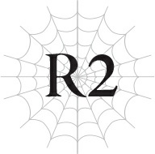

# Chương R2: Lão già tầm sư học đạo
*(The Old Man Seeks an Apprenticeship)*

---

“Cái quái gì thế này?!”

Khi dịch chuyển đến Mê cung Lớn Elroe, đập vào mắt ta là một cảnh tượng kinh ngạc.

Đây chính là nơi thực thể vĩ đại đó đã tiêu diệt đội kỵ sĩ của ta.

Hang động lớn mà người dẫn đường từng nói là kết nối với Tầng Trung đang bò lổm ngổm vô số sinh vật.

Một bầy nhện trắng đông nghịt trải dài ngút tầm mắt.

Kích thước của chúng rất đa dạng, cả lớn lẫn nhỏ.

Con nhỏ nhất có lẽ vừa vặn trong lòng bàn tay người, nhưng ngay cả con lớn nhất cũng chưa cao đến thắt lưng ta.

Những con lớn này có kích thước tương đương với một con Taratect non.

Thật vậy, loài quái vật này trông rất giống Taratect, nhưng có một điểm khác biệt lớn: Hai chân trước của chúng có hình dạng như những lưỡi hái.

Chúng giống hệt bậc thầy ma pháp đó.

Tuy nhiên, dù ngoại hình tương đồng, sức mạnh của loài quái vật này lại kém xa so với người.

Kích thước của chúng dường như tỷ lệ thuận với sức mạnh; những con nhỏ nhất yếu đến mức ta có thể dễ dàng dùng chân giẫm bẹp mà không gặp bất kỳ sự kháng cự nào.

Tuy nhiên, những con lớn hơn lại khá mạnh. Sức mạnh ta cảm nhận được từ chúng đủ để khiến một mạo hiểm giả tập sự phải chật vật mới đánh bại nổi dù chỉ một con.

Ta không tài nào đếm xuể có bao nhiêu con đang tụ tập ở đây.

Ít nhất cũng phải có tới hàng trăm con.

Không chỉ thế, số lượng của chúng vẫn đang tiếp tục tăng lên.

Vô số vật thể nhỏ, tròn nằm rải rác trên nền đất, và gần như cả dòng lũ nhện vô tận đang bảo vệ chúng.

Là trứng.

Ngay trước mắt ta, một số quả trứng nứt vỏ, và một con nhện trắng nhỏ chui ra từ mỗi quả.

Những con nhện mới nở nhanh chóng ngấu nghiến vỏ quả trứng chúng vừa chui ra, rồi vội vã rời khỏi hang động.

Ta đã ẩn mình bằng kỹ năng [Ẩn mật] và [Ma pháp Ảo ảnh], nên lũ nhện nhỏ cứ thế lướt qua ngay bên cạnh ta.

Trong khi đó, những con nhện khác lại bò ngược trở lại phòng, tha theo xác của các loài quái vật.

Ta đứng đó kinh ngạc nhìn dòng lũ nhện liên tục di chuyển qua lại theo cả hai hướng.

Máu trong người ta lạnh toát, dù không đến nỗi kinh hoàng như khi thực thể vĩ đại đó chĩa ma pháp vào ta.

Việc ẩn mình ngay lập tức quả là một quyết định may mắn.

Ta có thể dễ dàng giải quyết từng con một, nhưng đối đầu với toàn bộ lũ nhện này cùng một lúc và rút lui an toàn là điều không tưởng.

Ta đã kiềm chế không dùng [Thẩm định] lên bất kỳ con nào để tránh bị phát hiện, nhưng ta đoán những con lớn có chỉ số trung bình khoảng 300.

Dẫu vậy, ta có lẽ vẫn đối phó được. Đó hoàn toàn không phải là một trận chiến dễ dàng, nhưng cơ hội chiến thắng của ta là khá cao.

Thế nhưng, ta không nghĩ mình có thể đối phó nổi với những sinh vật nằm ở trung tâm của sự hỗn loạn này.

Ở giữa hang động là một nhóm nhện trông không khác gì những con còn lại.

Tuy nhiên, sự tương đồng chỉ dừng lại ở đó.

Bên trong chúng là những thực thể hoàn toàn khác biệt.

Có tất cả chín con, không hơn không kém.

Vã mỗi con trong số chúng đều đang tập trung cao độ vào việc đẻ thêm trứng.

Chín con ở trung tâm ăn xác quái vật do những con nhện khác mang về, và tiếp tục đẻ trứng.

Thêm nhiều con nhện tí hon chui ra từ đống trứng này, bắt đầu đi săn, rồi lại trở về với xác quái vật.

Trong quá trình đó, chắc chắn một số con nhện sẽ trở thành con mồi thay vì kẻ đi săn, nhưng điều đó không quan trọng, bởi vì số nhện mới nở ra còn nhanh hơn nhiều so với số lượng đồng loại của chúng chết đi.

Và dĩ nhiên, những con nhện sống sót sẽ nhận được điểm kinh nghiệm từ những quái vật chúng tiêu diệt và tăng cấp.

Đó là cảnh tượng đang diễn ra ngay trước mắt ta.

Kinh hoàng.

Hoàn toàn kinh hoàng.

Thế nhưng, nó cũng thật phấn khích làm sao!

Hãy nhìn chúng xem! Những con nhện tí hon, tầm thường chỉ vừa mới nở!

Yếu ớt đến mức bất kỳ ai cũng có thể dễ dàng dùng chân giẫm bẹp!

Vậy mà, nếu những con nhện yếu ớt này lớn lên, chúng có thể trở nên đủ mạnh để áp đảo một mạo hiểm giả mới vào nghề.

Và lại còn trong một khoảng thời gian cực kỳ ngắn nữa chứ!

Khi ta nếm mùi thất bại thảm hại ở đây dưới tay thực thể vĩ đại đó, ta không hề thấy cảnh tượng nào như thế này xảy ra.

Ít nhất, điều đó có nghĩa là quá trình sản xuất hàng loạt này chỉ mới bắt đầu vào một thời điểm nào đó sau trận chiến ấy.

Chỉ trong một khoảng thời gian ngắn ngủi như vậy, lũ ấu trùng này bằng cách nào đó đã trở nên đủ mạnh để đe dọa các mạo hiểm giả loài người!

Chúng đã phải trải qua loại trải nghiệm địa ngục nào để đạt được điều đó chứ?

Không, không, không!

Nó không chỉ đơn thuần là giống như địa ngục.

Đây chắc chắn chính là địa ngục thực sự!

Đúng như giả thuyết trước đây của ta: Tốc độ đẻ trứng chỉ đơn giản là phải vượt trội hơn tốc độ chết của lũ nhện con.

Điều đó có nghĩa là những con nhện này đang được đưa qua một địa ngục thực sự theo đúng nghĩa đen chứ không chỉ là ẩn dụ, nơi mà mạng sống của chúng sẵn sàng bị hy sinh bất cứ lúc nào.

Ta hiểu rồi. Hóa ra là vậy!

Đó chính là nguyên nhân dẫn đến tốc độ tăng trưởng theo cấp số nhân này!

Là địa ngục.

Chúng phải sống sót qua địa ngục để trưởng thành.

Làm thế nào mà thực thể vĩ đại đó lại đạt được sức mạnh như vậy?

Làm thế nào mà người có thể thăng hoa đến một cảnh giới tinh thần mà dù ta có nỗ lực bao nhiêu đi nữa cũng không thể chạm tới?

Ta không ngờ câu trả lời lại đơn giản đến thế.

Chỉ là ta chưa đủ nỗ lực mà thôi.

Việc chỉ rèn luyện kỹ năng và tâm trí ở một nơi an toàn, bảo đảm là một nỗ lực quá đỗi nửa vời để có thể nâng ta lên những tầm cao mới.

Thật thảm hại!

Ôi, mắt ta cuối cùng cũng đã được mở mang sau khi tận mắt chứng kiến tất cả những điều này.

Sự nỗ lực của ta từ trước đến nay hoàn toàn không thấm vào đâu!

So với những trải nghiệm khắc nghiệt mà lũ nhện này phải trải qua trong sự tồn tại ngắn ngủi của chúng, luôn phải đối mặt với hiểm nguy rình rập và đánh cược cả mạng sống, cuộc đời của ta hoàn toàn vô nghĩa!

Bị choáng ngợp bởi nhận thức này, ta bắt đầu bật khóc.

Tiếng khóc nức nở của ta vang lên khi nước mắt bắt đầu tuôn rơi.

Nhưng dĩ nhiên, điều đó khiến lũ nhện gần đó chú ý đến ta.

Vài con vây quanh ta, sẵn sàng tấn công bất cứ lúc nào.

Chúng đang hành động theo mệnh lệnh của một trong chín con nhện đặc biệt ở giữa hang động.

“Ôôô! X-Xin hãy khoan đã! Ta… ta không có ý xấu! Xin hãy từ bi mà nghe ta nói!”

Ta vội vàng gạt đi nước mắt và cố gắng kìm lại tiếng nấc nghẹn.

“Các ngươi chắc chắn có mối liên hệ nào đó với sư phụ, người mà họ gọi là Cơn Ác Mộng! Xin hãy sắp xếp cho ta được làm đệ tử của Cơn Ác Mộng! Ta xin các ngươiii!”

Ngay khi ta vừa dứt lời, tiếng khóc nức nở lại bắt đầu.

Khi ta phủ phục sát đất trước mặt chúng, nước mắt vẫn lã chã rơi, lũ nhện trắng cúi xuống nhìn ta như thể hoàn toàn ngơ ngác.

Than ôi, thỉnh cầu của ta đã không được chấp thuận.

Lũ nhện dường như đã quyết định để mặc ta một mình.

Không có cuộc tấn công nào xảy ra, nhưng cũng chẳng có sự thừa nhận nào.

Chúng chỉ đơn giản hành xử như thể ta không tồn tại, tuân theo mệnh lệnh của chín con ở trung tâm.

Phải, là mệnh lệnh.

Chín con đó trò chuyện với nhau thông qua [Thần giao cách cảm].

Chúng không giao tiếp bằng bất kỳ ngôn ngữ nào của loài người hay ma tộc, mà bằng một ngôn ngữ kỳ lạ ta chưa từng nghe bao giờ.

Dù ta có thể nghe thấy cuộc hội thoại của chúng, ta không tài nào hiểu được những từ chúng sử dụng.

Dựa vào tông giọng, có vẻ như chúng đang tranh luận về điều gì đó, nhưng ta không có một chút khái niệm nào về những gì đã được nói.

Ta đoán chúng chắc hẳn đã thảo luận về cách xử lý ta và đi đến kết luận là sẽ phớt lờ ta.

Tuy nhiên, ngay cả khi chúng không chú ý đến ta, ta cũng không thể bỏ cuộc.

Rõ ràng là những con nhện này có mối liên kết nào đó với thực thể vĩ đại đó.

Chín con ở trung tâm sở hữu một hiện diện cực kỳ giống với Cơn Ác Mộng.

Chỉ nhìn thoáng qua, người ta rất dễ nhầm lẫn chúng với bản thể thật.

Phải, chúng chắc chắn có mối liên kết chặt chẽ với sư phụ.

Ta không nghi ngờ gì việc chúng đang bành trướng lực lượng như thế này là theo mệnh lệnh của sư phụ.

Nếu vậy, chắc chắn Cơn Ác Mộng cuối cùng cũng sẽ ghé thăm nơi này.

Khi thời điểm đó đến, ta có thể thương lượng trực tiếp với người.

Hiện tại, ta phải kiên nhẫn chờ đợi thời cơ.

Dù thế nào đi nữa, ta cũng phải cầu xin sư phụ nhận ta làm đệ tử, để một ngày nào đó ta có thể bắt kịp sức mạnh của người!

Tuy nhiên, ta không thể cứ thế đứng không mà chờ đợi.

Thay vào đó, ta phải học hỏi từ lũ nhện này và tự mình thực hiện một cuộc huấn luyện địa ngục.

Đầu tiên là xem xét những con nhện non nớt nhất đang mạo hiểm ra ngoài săn quái vật.

Bản thân việc chiến đấu sinh tử với quái vật chắc chắn đã là một hình thức rèn luyện, nhưng những con nhện mà ta thực sự cần học hỏi lại là những con nhện đã trưởng thành vẫn ở lại trong hang.

Ngươi thấy đấy, chúng không hề nhàn hạ nằm không hưởng thụ.

Thực chất, chúng đã chia thành từng nhóm, mỗi nhóm đảm nhận một chế độ luyện tập riêng.

Quá trình này cũng vô cùng khắc nghiệt, đến mức chúng có thể dễ dàng mất mạng nếu phạm phải sai lầm trong quá trình thực hiện.

Một trận cuồng phong dữ dội thổi qua hang động.

Nó tích tụ thành một cơn lốc xoáy hủy diệt, tấn công tất cả lũ nhện trên đường đi của nó.

Thế nhưng, những kẻ có vẻ là nạn nhân lại hứng trọn đòn đánh trực diện mà không hề cố gắng né tránh, để mặc cho các vết thương chồng chất trên cơ thể.

Nhưng những vết thương này khép miệng lại gần như ngay lập tức.

Một trong những con nhện đang sử dụng [Phong ma pháp] để tấn công cả nhóm, trong khi một con khác sử dụng [Ma pháp Trị liệu] để hồi phục các vết thương.

Chúng lặp đi lặp lại quá trình này hết lần này đến lần khác.

Ở một góc khác của hang động, một nhóm khác cũng đang trải qua quá trình tương tự với [Thổ Ma pháp].

Mục đích là gì? Chắc chắn là để nâng cao cấp độ kỹ năng kháng tính của chúng.

Đồng thời, những con nhện tấn công và trị liệu cũng đang cải thiện kỹ năng ma pháp của mình.

Chúng lặp lại quá trình này cho đến khi gần cạn kiệt MP, tại thời điểm đó một con nhện khác sẽ tiếp quản nhiệm vụ. Sau đó, con nhện vừa bàn giao vai trò sẽ gia nhập vào hàng ngũ những con đang luyện kháng tính trong khi chờ MP hồi phục.

Sau khi hoàn thành một vòng xoay tua, tất cả lũ nhện sẽ đều được tăng cấp kỹ năng ma pháp và kháng tính.

Không chỉ vậy, các kỹ năng tự động hồi phục và những kỹ năng tương tự cũng được hưởng lợi.

Ngay cả thời gian chờ đợi MP hồi phục cũng được tận dụng để tích lũy các kỹ năng khác.

Thật là một phương pháp huấn luyện hiệu quả đến kinh ngạc.

Vì lũ nhện lập tức chuyển sang vai trò tấn công ngay khi hồi phục đầy MP, nên đủ loại ma pháp bay loạn xạ khắp hang động.

Bất kỳ con nhện nào không bận rộn với việc này đều đang giao đấu với nhau.

Hoặc có lẽ những trận đấu này quá khốc liệt để có thể gọi đơn giản là giao đấu: những kẻ luyện tập tấn công lẫn nhau với sát ý thực sự.

Tuy nhiên, ngay cả những vết thương chí mạng nhất cũng ngay lập tức được chữa lành bởi những con nhện khác bằng [Ma pháp Trị liệu], giúp giữ mạng cho chúng.

Nếu không có điều đó, những con nhện bị đánh tơi tả chắc chắn sẽ chết.

Những trận đấu tập mà mọi người tham gia đều chiến đấu với ý định hạ sát đối thủ… Việc này hầu như chẳng khác gì một trận chiến thực sự.

Đây là cách chúng tích lũy kinh nghiệm chiến đấu và mài giũa kỹ thuật của mình.

Khi ta đi theo một nhóm nhện ra phía sau hang động, ta phát hiện ra nó dẫn đến một con dốc dài đi xuống, ở cuối con dốc là một thế giới rực lửa.

Chỉ riêng việc đứng trong bầu không khí nóng nực đó cũng đủ để thiêu đốt da thịt.

Đây chắc chắn phải là Tầng Trung huyền thoại!

Ở giữa cái nóng hừng hực đó, lũ nhện điên cuồng thi triển [Ma pháp Trị liệu] lên nhau, rõ ràng là để cố gắng triệt tiêu sát thương từ nhiệt độ.

Chúng đang luyện tập để gia tăng cấp độ kỹ năng [Kháng Lửa]!

Kinh ngạc.

Ta không còn từ nào khác để mô tả nữa.

Mỗi một bài luyện tập địa ngục được thực hiện ở đây có lẽ là quá nguy hiểm đối với con người để thử thách, nói chi đến việc có ai đó dám nghĩ tới chuyện thử.

Chỉ cần sẩy chân một bước là cầm chắc cái chết.

Vậy mà chúng vẫn luyện tập liên tục như thế này, không hề nghỉ ngơi.

Thật sự, đây chính là địa ngục.

Ta còn có thể gọi một chế độ huấn luyện vốn là nỗi ác mộng, cận kề sự điên loạn và nằm ngoài tầm hiểu biết của bất kỳ con người nào này bằng cái tên nào khác nữa chứ?

Chính là nó.

Đây chính là con đường dẫn đến những tầm cao hơn mà ta đã khao khát suốt cả cuộc đời.

Ta từng cho rằng mình đã nỗ lực hết sức trước đây, nhưng giờ đây rõ ràng là ta đã nhầm to. Sự nỗ lực đó hoàn toàn không đủ.

Rèn luyện trong giới hạn của lý trí thông thường quả là một sai lầm ngu ngốc.

Nếu ta không đặt cược mạng sống của mình, thì điều đó cũng giống như ta không hề nỗ lực chút nào!

Ta phải gạt bỏ mọi lý trí, đầu hàng sự điên loạn, và lao mình vào chính vực sâu nếu muốn thực sự cố gắng hết sức mình lần đầu tiên.

A, sự tồn tại của ta từ trước đến nay thật là thảm hại làm sao!

Giờ đây khi đã tận mắt chứng kiến cuộc huấn luyện từ địa ngục này, những nỗ lực yếu ớt trước đây của ta chẳng khác nào một trò chơi trẻ con!

Ta sẽ bắt đầu làm theo gương của chúng ngay lập tức, cống hiến toàn bộ bản thân cho việc rèn luyện.

Để bắt đầu, ta bắn một đòn ma pháp nữa vào chính mình và để đòn đánh trúng trực diện. Cơn đau nhói xuyên qua cơ thể ta.

Sau đó, ta ngay lập tức niệm [Ma pháp Trị liệu], phục hồi HP của mình.

Vậy mà, ta đã phải quỳ sụp xuống đất rồi.

Chỉ mới sau một đòn tấn công… và ta phải lặp lại việc này liên tục sao?

Quả thật, đây là một hình phạt tra tấn ngoài sức tưởng tượng!

Chỉ có một mình ta, vì vậy ta phải đảm nhận cả vai trò của kẻ tấn công lẫn người trị liệu.

Nếu ta thất bại, ta chắc chắn sẽ chết ngay tại chỗ.

Nỗi đau đớn thể xác và nỗi sợ hãi cái chết đồng thời ập đến cùng lúc.

Chắc chắn không một ai có tâm trí và thể chất bình thường lại đi bắt chước điều này. Ngay cả ta cũng cảm thấy kinh hãi khi tiếp tục bước đi trên con đường này.

Nhưng nếu ta có thể vượt qua, thì tầm cao mà ta hằng ao ước đang chờ đợi ở phía bên kia.

Nếu ta muốn chạm tới chúng, ta không được phép vấp ngã lúc này!

Ta lại phóng thêm một ma pháp nữa vào chính mình.

Đây là ma pháp ta đã tích lũy trong cuộc đời thảm hại của mình cho đến nay.

Dù có thể yếu ớt, nhưng ít nhất ta cũng có lợi thế về số năm tích lũy kinh nghiệm.

Ma pháp của ta mạnh hơn lũ nhện này. Nhưng ta vẫn sẽ sử dụng phương pháp của chúng.

Nếu ta mạnh hơn chúng, thì chắc chắn ta cũng sẽ phát triển nhanh hơn!

Thế nhưng, than ôi, ta không thể ngăn được cảm giác ấm ức dâng trào.

Nếu ta đã trải qua loại huấn luyện này trong suốt cuộc đời dài của mình, thì chắc chắn giờ đây ta đã ở gần đỉnh cao ma pháp hơn rất nhiều.

Giá như ta có thể gặp được sư phụ sớm hơn.

Ước gì ta đã được trải nghiệm môi trường này từ khi còn là một đứa trẻ… không, có lẽ ngay cả khi ta mới lọt lòng.

Thì giờ đây ta có lẽ đã có sức mạnh sánh ngang với sư phụ rồi.

Nhưng không, chắc chắn vẫn chưa quá muộn!

Hãy vứt bỏ mọi lẽ thường và lý trí!

Cuộc luyện tập mà ta từng nghĩ là đang thử thách giới hạn của mình chỉ là trò trẻ con so với địa ngục này.

Điều đó có nghĩa là những ranh giới mà ta đã đấu tranh chống lại suốt cả cuộc đời chỉ là do chính ta tự suy diễn ra mà thôi!

Nếu ta có thể đạt đến cảnh giới mà sự dày vò của địa ngục này chỉ giống như nước tắm âm ấm, thì chắc chắn ta sẽ vượt xa giới hạn của chính mình!

Ta sẽ vượt qua tầng địa ngục này để tiến vào tầng tiếp theo, nơi thực thể vĩ đại đó chắc chắn sẽ dẫn dắt ta đến những tầm cao chưa từng thấy và những chiều sâu chưa từng được khai phá!

“Hắc hắc… Ha ha ha ha ha!”

Một tiếng cười tự dưng bật ra khỏi môi ta.

Có lẽ ta đã thực sự phát điên rồi.

Nhưng nếu sự điên loạn là thứ cần thiết để sống sót qua địa ngục này, thì ta sẽ vui vẻ vứt bỏ lý trí của mình.

Ta đã cống hiến hết mình cho chốn luyện ngục này trong vài ngày, nhưng vì ta không mang theo bất kỳ lương thực nào, cái dạ dày của ta đang đi tới giới hạn của nó.

Ta đã cân nhắc việc tạm thời trở về thị trấn, nhưng ta không thể xem nhẹ mọi chuyện như thế nữa.

Hơn nữa, không thể biết được khi nào sư phụ mới quay trở lại đây.

Ta không thể mạo hiểm rời đi nếu có bất kỳ khả năng nào Cơn Ác Mộng sẽ ghé thăm trong lúc ta vắng mặt.

Vì vậy, ta lại học theo lũ nhện một lần nữa: cụ thể là tiêu diệt quái vật gần đó và ăn thịt chúng.

Đầu tiên, ta tiêu diệt một con quái vật ếch, nấu chín thịt của nó rồi ăn.

Ý nghĩ phải ăn sống nó làm ta ghê tởm đến mức ta quyết định cho phép bản thân có một chút thỏa hiệp nhỏ nhoi này.

Nhưng con quái vật đó có độc, và nó đã tàn phá dạ dày của ta dữ dội.

Ta đã nghĩ mình thực sự sắp chết đến nơi.

Thế nhưng trong quá trình đó, cấp độ kỹ năng [Kháng Độc] của ta đã tăng lên.

Không ngờ ngay cả thức ăn lũ nhện tiêu thụ cũng là một phần trong việc rèn luyện của chúng!

Trong Mê cung Lớn Elroe, chỉ riêng việc sống sót từ ngày này qua ngày khác cũng đủ để nâng cao kỹ năng của một người.

Việc cố gắng nhìn trong bóng tối tuyệt đối giúp nâng cao kỹ năng [Dạ Nhãn].

Duy trì sự cảnh giác trước lũ quái vật có thể tấn công từ bóng tối gần như không thể xuyên thấu đó giúp nâng cao các kỹ năng hệ dò tìm.

Chiến đấu với lũ quái vật đó nâng cao kỹ năng chiến đấu.

Và việc dính độc tố của chúng giúp nâng cao kháng tính.

Chỉ riêng việc sống sót trong môi trường độc nhất vô nhị này cũng giúp rèn giũa nhiều kỹ năng.

Và nếu một người kết hợp thêm việc luyện tập địa ngục và nghiên cứu bên cạnh cuộc sống sinh tồn khắc nghiệt hàng ngày đó…

Ta đang bắt đầu lờ mờ nhận ra bí mật đằng sau sức mạnh của thực thể vĩ đại đó.

Sư phụ chắc chắn đã liên tục đối mặt với cái chết trong cuộc chiến sinh tử tại Mê cung Lớn Elroe này, trong khi không ngừng cố gắng để cải thiện bản thân, nhằm đạt tới những tầm cao như vậy.

Hèn chi một kẻ như ta, sống trong một dinh thự an toàn của thị trấn, lại không phải là đối thủ đối với sức mạnh của người.

Để sinh sống ở nơi này, một người phải vứt bỏ ngay cả những nhu cầu cơ bản nhất của con người.

Quần áo của ta đã rách bươm ngay khi kết thúc ngày đầu tiên tự tấn công mình bằng ma pháp, và giờ đây ta đang hoàn toàn khỏa thân đi lại.

Đây thực sự là những gì họ gọi là sống hoang dã.

Và đó là cách duy nhất để phát huy tối đa tiềm năng kỹ năng của ta!

---

[◀ Chương trước: Chương 2: Quần áo làm nên con nhện](02_the_clothes_make_the_spider.md) | [Chương tiếp theo: Hội thoại: Cuộc họp Phân thân Tư duy #2 ▶](conversation_meeting_of_the_parallel_minds_2.md)
