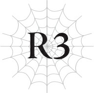
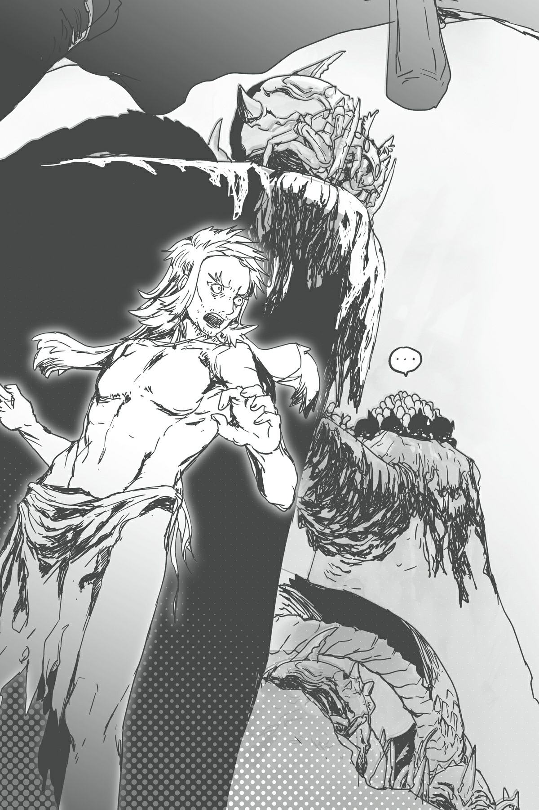

# Chương R3: Lão già khiêu chiến Địa Long
*(The Old Man Challenges the Earth Dragons)*

---

Ta đang hoàn toàn trần như nhộng!

Thật vậy! Ta đã dần quen với lối sống trần như nhộng này!

Liêm sỉ của ta từ lâu đã bay đi tận phương trời nào ngoài các vì sao rồi.

Thực ra, ngay cả bản thân ta cũng không chắc ban đầu mình có thứ gọi là liêm sỉ hay không nữa!

Đã được một thời gian kể từ khi ta bắt đầu sống giữa bầy nhện.

Vì hang động của Mê cung Lớn Elroe không hề có ánh mặt trời chiếu tới, cảm giác về thời gian của ta đã trở nên khá mơ hồ.

Do đó, ta không biết chính xác mình đã ở đây bao lâu.

Tuy nhiên, chắc chắn đó không phải là một số ngày ngắn ngủi.

Ta nói điều này với sự chắc chắn, bởi tất cả các kỹ năng của ta đều đã tăng lên đáng kể.

Từ khi đến đây, tốc độ phát triển của ta vô cùng kinh ngạc.

Thật lòng mà nói, ta tự hỏi mình đã làm cái quái gì với cuộc đời mình suốt thời gian qua.

Miễn là ta có thể tận dụng tốt khoảng thời gian quý báu này, việc khỏa thân chẳng hề hớn gì đối với ta!

Ta đã vứt bỏ quần áo, ăn thịt quái vật và ngủ giữa thiên nhiên hoang dã.

Tuyệt vời.

Thực sự, đây mới là cách mà các sinh vật nên sống.

Ta không thể không tự hỏi liệu việc xây nhà, mặc quần áo và ăn thức ăn nấu chín có phải chính là những hành động khiến nhân loại bị thoái hóa hay không.

Nếu có thể, ta muốn tiếp tục sống như thế này cho đến hết đời.

Tuy nhiên, hiện tại có một đám mây đen đang che phủ lối sống này.

Lũ nhện cũng đã nhận ra và đang xôn xao bàn tán về chuyện đó.

Đó là một vấn đề ảnh hưởng đến tất cả chúng ta: thiếu hụt lương thực.

Lũ nhện và ta đã săn lùng quái vật ở khu vực này triệt để đến mức không còn gì để ăn.

Nguồn thức ăn duy nhất khả dĩ trong Mê cung Lớn Elroe là quái vật.

Nếu quái vật biến mất, sẽ chẳng còn gì để ăn.

Chúng ta gần như đã săn quét sạch sẽ phần Tầng Trên xung quanh, và ngay cả ở Tầng Trung, người ta cũng phải đi một quãng đường khá xa mới tìm thấy quái vật.

Sẽ cực kỳ nguy hiểm nếu mạo hiểm tiến vào Tầng Trung nóng bức.

Do đó, Tầng Trên là lựa chọn duy nhất, nhưng không còn quái vật nào sót lại trong bán kính một hoặc hai ngày đường nữa.

Trong trường hợp xấu nhất, ta có thể dịch chuyển trở lại thị trấn, nhưng lũ nhện thì không có lựa chọn đó.

Lũ nhện cũng có một gia đình khá lớn, đồng nghĩa với việc chúng có rất nhiều miệng ăn cần nuôi dưỡng.

Trên hết, số lượng của chúng chỉ có tăng lên kể từ khi ta mới đến.

Đến thời điểm này, số lượng của chúng đã quá nhiều để ta có thể đếm xuể.

Khi lũ nhện tiếp tục nhân bản, chúng bắt đầu cạn kiệt quái vật để làm mồi.

Ngay cả khi chúng di chuyển đến nơi khác để đi săn, chúng sẽ lại đói ngấu vào lúc trở về.

Tình hình về cơ bản là một nạn đói, và nó sẽ sớm chạm tới giới hạn chịu đựng.

Đối với ta, giải pháp duy nhất có vẻ là cả đàn nhện phải di cư. Chúng định làm gì đây?

Lẽ tự nhiên, chín con nhện đóng vai trò thủ lĩnh của chúng cũng đã nhận ra những vấn đề tương tự như ta.

Như thường lệ, chúng trò chuyện với nhau bằng Thần giao cách cảm bằng một ngôn ngữ mà ta vẫn không thể hiểu nổi.

Cuối cùng, chúng đi đến một kết luận nào đó và truyền đạt tới tất cả lũ nhện bằng Thần giao cách cảm.

Sau đó, chín con bắt đầu chuẩn bị một phép [Dịch chuyển diện rộng] bao phủ toàn bộ đàn nhện.

Ta nhận ra nó bởi vì bản thân ta cũng sở hữu phép thuật tương tự.

Tài năng thật đáng kinh ngạc.

Tốc độ chúng triển khai phép thuật, việc vẽ cổ tự hoàn mỹ, và sự hiệu quả.

Tất cả đều vượt trội hơn nhiều so với ma pháp của chính ta.

Kinh ngạc thật.

Đàn nhện đứng sẵn sàng để được dịch chuyển, và ta đứng trà trộn giữa chúng.

Rất nhanh sau đó, phép thuật hoàn tất, và tất cả chúng ta lập tức được dịch chuyển đến một nơi khác.

Chúng ta đặt chân đến một hang động tối tăm, tương tự như hang động vừa rời đi.

Tuy nhiên, bầu không khí ở đây có cảm giác nặng nề, tràn ngập sự căng thẳng hơn nhiều so với hang động trước.

Kỹ năng [Cảm nhận Nguy hiểm] của ta đang phản ứng dữ dội.

Lũ nhện dường như cũng cảm nhận được điều tương tự.

Chúng lập tức chuyển sang chế độ chiến đấu, nâng cao cảnh giác tột độ.

Nhưng như thể để giễu cợt điều đó, một trong những con nhện đứng gần rìa nhóm nhất bị tấn công.

Cơ thể nó bị đập nát, chết ngay lập tức.

Nó bị đâm thủng bởi một chiếc vuốt kim loại.

Toàn bộ cơ thể của con quái vật, có hình dạng giống như một loài côn trùng, phát ra ánh kim loại lấp lánh.

Ta nhanh chóng [Thẩm định] nó và biết được nó được gọi là Utoeudo Elroe: một con quái vật mà ta chưa từng thấy hay nghe nói đến trong đời.

Nhưng điều thực sự làm ta khiếp sợ chính là bảng chỉ số của nó.

Các chỉ số vật lý của nó, cụ thể là tấn công, phòng ngự và tốc độ, đều vượt quá 1.000.

Một con quái vật khá mạnh mẽ.

Con Utoeudo Elroe vung vuốt, tấn công lũ nhện.

Tuy nhiên, lũ nhện này cũng chẳng phải là quái vật tầm thường.

Chúng tản ra xung quanh con Utoeudo, phủ tơ lên nó từ mọi hướng và khiến nó hoàn toàn bất động.

Sau khi nó bị mắc kẹt, những con nhện khác bắn ma pháp vào nó.

Chỉ trong tích tắc, con Utoeudo Elroe đã bị nghiền nát bởi sự phối hợp đồng đội đáng kinh ngạc của lũ nhện.

Sau đó, chúng nhanh chóng lao vào xâu xé con mồi đầu tiên sau một thời gian dài.

Ở thế giới bên ngoài, chỉ có một mạo hiểm giả dày dạn kinh nghiệm mới có thể đọ kiếm với con quái vật đó, nhưng ở đây nó chẳng qua chỉ là thức ăn lót dạ.

Một con nhện đã mất mạng trong quá trình đó, nhưng nó có thể được thay thế ngay lập tức.

Đúng là một đội quân đáng sợ.

Nhưng chúng ta đang ở nơi quái nào trên đời này thế này, mà một con quái vật mạnh như vậy lại đi lại thong dong như không?

Vì nó được gọi là Utoeudo Elroe, chúng ta chắc chắn vẫn ở trong Mê cung Lớn Elroe.

Nhưng ta chưa từng nghe nói về một con quái vật như vậy.

Không... có lẽ là ta đã từng nghe rồi.

Tên của nó chắc chắn là mới mẻ đối với ta, nhưng ta biết một nơi mà những con quái vật mạnh mẽ chạy loạn khắp chốn.

Tầng Dưới của Mê cung Lớn Elroe.

Một nơi được cho là đông nghịt những con quái vật mạnh đến mức không con người nào có thể đặt chân tới.

Trong quá khứ, các mạo hiểm giả đã đi xuống đó qua những cái hố lớn được gọi là hầm sâu, nhưng bất kỳ ai dám thử đều gần như bị quét sạch hoàn toàn.

Thứ duy nhất mà những người sống sót mang về là thông tin rằng nơi đó tràn ngập quái vật mạnh mẽ.

Liệu nơi này có phải là Tầng Dưới?

Điều đó chắc chắn giải thích cho bầu không khí nặng nề đang quấn lấy da thịt ta.

Ta đã đến một nơi thực sự nguy hiểm.

Ấy thế mà, vì lý do nào đó... có sự phấn khích xen lẫn trong nỗi lo lắng của ta.

Những kỹ năng ta đã mài giũa ở Tầng Trên sẽ giúp ích cho ta như thế nào ở Tầng Dưới này, nơi chưa từng được con người thám hiểm?

Ta không thể chờ đợi thêm để tìm ra câu trả lời.

Một vài ngày đã trôi qua kể từ khi ta hăm hở đặt chân tới đây.

Ta không còn nguồn năng lượng đó nữa rồi.

Bởi vì ta chắc chắn sẽ chết ở đây.

Tầng Dưới của Mê cung Lớn Elroe vượt xa trí tưởng tượng của ta.

Những con quái vật mạnh như Utoeudo Elroe hoặc mạnh hơn thế nữa liên tục tấn công chúng ta không ngừng.

Chỉ cần một trong những con quái vật này xuất hiện cũng đủ gây ra sự hoảng loạn trên diện rộng ở thế giới bên ngoài, nhưng ở đây chúng lại đông như quân nguyên.

Thực sự kinh hoàng.

Cũng đáng sợ không kém là lũ nhện, những kẻ đẩy lùi những con quái vật đó một cách dễ dàng.

Ta cũng tham gia một chút vào những trận chiến này để giành lấy phần thức ăn của mình, nhưng sự tự tin của ta lại lung lay mỗi khi làm vậy.

Lũ quái vật gạt phăng ma pháp của ta một cách dễ dàng, đến mức ta thậm chí không thể biết liệu mình có thực sự đánh trúng chúng hay không.

Thường thì không trúng, vì ma pháp của ta mất quá nhiều thời gian để chuẩn bị.

Và ngay cả khi ta đánh trúng mục tiêu, nó cũng ít có tác dụng, bởi ta chỉ có thể làm vậy với những phép thuật yếu hơn mà ta có thể niệm nhanh và liên tục với số lượng lớn.

Nếu muốn gây sát thương, ta sẽ phải tung ra một phép thuật mạnh hơn.

Nhưng việc này tốn thời gian, giúp kẻ địch dễ dàng đọc được ý đồ của ta và né tránh.

Tuy nhiên, những phép thuật không tốn nhiều thời gian chuẩn bị lại quá yếu và gây ra rất ít sát thương ngay cả khi trúng đích.

Ta khao khát có được ma pháp có thể niệm dễ dàng nhưng vẫn gây ra một lượng sát thương khổng lồ.

Nhưng dù ta có vắt óc suy nghĩ thế nào, giải pháp cũng không dễ dàng tìm thấy.

Gia tăng tốc độ vẽ cổ tự cho các phép thuật sẽ là một quá trình dài đằng đẵng.

Ta phải làm sao đây?

Ta không còn thời gian để lo lắng về những chuyện như vậy nữa.

Lũ nhện cũng cảm nhận được điều đó, và sự căng thẳng đang dâng cao.

Chúng đang đến.

Những con quái vật không thể so sánh với bất kỳ thứ gì chúng ta từng thấy cho đến nay.

Đúng vậy, những con quái vật chúng ta chạm trán trước đây đã rất mạnh.

Nhưng ngay cả chúng cũng sẽ phải run rẩy trong sợ hãi trước những kẻ đang tiến lại gần.

`<Địa Long Kagna Cấp 26>`

| Chỉ số | Giá trị |
| :--- | :--- |
| **HP** | 4.199/4.199 (lục) |
| **MP** | 3.339/3.654 (lam) |
| **SP (vàng)** | 2.798/2.798 |
| **SP (đỏ)** | 2.995/3.112 |
| **Sức tấn công trung bình** | 3.990 (chi tiết) |
| **Sức phòng ngự trung bình** | 4.334 (chi tiết) |
| **Sức ma pháp trung bình** | 1.837 (chi tiết) |
| **Khả năng kháng tính trung bình** | 4.006 (chi tiết) |
| **Tốc độ trung bình** | 1.225 (chi tiết) |

**Kỹ năng:**
[Địa Long LV 2] [Long Lân Đế Vương LV 9] [Giáp Cứng LV 8] [Thân thể Thép LV 8] [Tự hồi phục HP nhanh LV 6] [Tốc độ hồi phục MP LV 2] [Giảm tiêu hao MP LV 2] [Cảm nhận Ma lực LV 3] [Thao tác Ma lực LV 3] [Tốc độ hồi phục SP LV 1] [Giảm tiêu hao SP LV 1] [Địa hình Tăng cường LV 8] [Tăng cường Hủy diệt LV 8] [Tăng cường Đâm LV 6] [Tăng cường Va chạm siêu cấp LV 5] [Ma lực Công kích LV 1] [Tấn công Địa hình LV 9] [Hiệp Lực LV 1] [Đánh trúng LV 3] [Cảm nhận Nguy hiểm LV 10] [Cảm nhận Nhiệt LV 6] [Thổ Ma pháp LV 2] [Kháng Hủy diệt LV 9] [Kháng Cắt siêu cấp LV 2] [Kháng Đâm siêu cấp LV 3] [Kháng Va chạm siêu cấp LV 6] [Kháng Sốc siêu cấp LV 4] [Vô hiệu Địa hình] [Kháng Lửa LV 3] [Kháng Lôi LV 7] [Kháng Thủy LV 3] [Kháng Phong LV 5] [Kháng Trọng lực LV 2] [Kháng Trạng thái bất thường siêu cấp LV 8] [Kháng Thối rữa LV 3] [Vô hiệu Đau] [Giảm Đau siêu cấp LV 3] [Tăng cường Thị giác LV 3] [Dạ Nhãn LV 10] [Mở rộng Tầm nhìn LV 4] [Tăng cường Thính giác LV 1] [Sinh mệnh Tối thượng LV 2] [Ma Lượng Tích Trữ LV 3] [Thân thể Bộc phát LV 1] [Sức bền LV 1] [Cự lực LV 9] [Kiên cố LV 2] [Tu sĩ LV 2] [Thánh Vực LV 1] [Gia tốc LV 1]

**Điểm kỹ năng:** 31.200

**Danh hiệu:**
[Kẻ diệt quái vật] [Kẻ tàn sát quái vật] [Long tộc] [Quán quân]

---

`<Địa Long Gehre Cấp 24>`

| Chỉ số | Giá trị |
| :--- | :--- |
| **HP** | 3.556/3.556 (lục) |
| **MP** | 2.991/2.991 (lam) |
| **SP (vàng)** | 4.067/4.067 |
| **SP (đỏ)** | 3.562/3.845 |
| **Sức tấn công trung bình** | 3.434 (chi tiết) |
| **Sức phòng ngự trung bình** | 3.875 (chi tiết) |
| **Sức ma pháp trung bình** | 1.343 (chi tiết) |
| **Khả năng kháng tính trung bình** | 3.396 (chi tiết) |
| **Tốc độ trung bình** | 4.123 (chi tiết) |

**Kỹ năng:**
[Địa Long LV 2] [Long Lân Đế Vương LV 6] [Giáp Cứng LV 2] [Thân thể Thép LV 2] [Tự hồi phục HP nhanh LV 3] [Tốc độ hồi phục MP LV 1] [Giảm tiêu hao MP LV 1] [Cảm nhận Ma lực LV 3] [Thao tác Ma lực LV 3] [Tự hồi phục SP nhanh LV 3] [Giảm tiêu hao SP tối thiểu LV 3] [Địa hình Tăng cường LV 8] [Tăng cường Hủy diệt LV 9] [Tăng cường Cắt siêu cấp LV 8] [Tăng cường Đâm siêu cấp LV 4] [Tăng cường Va chạm siêu cấp LV 8] [Ma lực Công kích LV 1] [Tấn công Địa hình LV 8] [Cơ động Chiều không gian LV 5] [Hiệp Lực LV 1] [Đánh trúng LV 10] [Né tránh LV 10] [Hiệu chỉnh Xác suất LV 7] [Cảm nhận Nguy hiểm LV 10] [Cảm nhận Hiện diện LV 8] [Cảm nhận Nhiệt LV 7] [Cảm nhận Chuyển động LV 8] [Thổ Ma pháp LV 2] [Kháng Hủy diệt LV 4] [Kháng Cắt LV 8] [Kháng Đâm LV 8] [Kháng Va chạm LV 9] [Kháng Sốc LV 5] [Vô hiệu Địa hình] [Kháng Lôi LV 3] [Kháng Trạng thái bất thường siêu cấp LV 3] [Kháng Thối rữa LV 1] [Vô hiệu Đau] [Giảm Đau LV 7] [Tăng cường Thị giác LV 7] [Dạ Nhãn LV 10] [Mở rộng Tầm nhìn LV 5] [Tăng cường Thính giác LV 5] [Tăng cường Khứu giác LV 4] [Tăng cường Vị giác LV 3] [Trường thọ LV 9] [Ma Lượng Tích Trữ LV 1] [Di chuyển Tối thượng LV 2] [Vận May LV 1] [Cự lực LV 8] [Vững chãi LV 9] [Tu sĩ LV 1] [Hộ Phù LV 8] [Thần tốc (Skanda) LV 3]

**Điểm kỹ năng:** 31.000

**Danh hiệu:**
[Kẻ diệt quái vật] [Kẻ tàn sát quái vật] [Long tộc] [Quán quân]

---

`<Địa Long Fuit Cấp 11>`

| Chỉ số | Giá trị |
| :--- | :--- |
| **HP** | 2.965/2.965 (lục) |
| **MP** | 2.912/2.912 (lam) |
| **SP (vàng)** | 2.943/2.943 |
| **SP (đỏ)** | 2.877/2.944 |
| **Sức tấn công trung bình** | 2.938 (chi tiết) |
| **Sức phòng ngự trung bình** | 2.941 (chi tiết) |
| **Sức ma pháp trung bình** | 2.899 (chi tiết) |
| **Khả năng kháng tính trung bình** | 2.907 (chi tiết) |
| **Tốc độ trung bình** | 3.000 (chi tiết) |

**Kỹ năng:**
[Địa Long LV 1] [Long Lân Đế Vương LV 4] [Giáp Cứng LV 1] [Thân thể Thép LV 1] [Tự hồi phục HP nhanh LV 1] [Tự hồi phục MP nhanh LV 1] [Giảm tiêu hao MP tối thiểu LV 1] [Cảm nhận Ma lực LV 8] [Thao tác Ma lực LV 8] [Tự hồi phục SP nhanh LV 1] [Giảm tiêu hao SP tối thiểu LV 1] [Địa hình Tăng cường LV 4] [Tăng cường Hủy diệt LV 3] [Tăng cường Cắt siêu cấp LV 3] [Tăng cường Đâm LV 3] [Tăng cường Va chạm LV 5] [Ma lực Công kích LV 5] [Tấn công Địa hình LV 5] [Cơ động Chiều không gian LV 3] [Hiệp Lực LV 1] [Đánh trúng LV 10] [Né tránh LV 10] [Hiệu chỉnh Xác suất LV 6] [Cảm nhận Nguy hiểm LV 5] [Cảm nhận Hiện diện LV 5] [Cảm nhận Nhiệt LV 4] [Cảm nhận Chuyển động LV 4] [Thổ Ma pháp LV 10] [Ma pháp Địa hình LV 6] [Kháng Hủy diệt LV 2] [Kháng Cắt LV 2] [Kháng Đâm LV 2] [Kháng Va chạm LV 3] [Kháng Sốc LV 2] [Vô hiệu Địa hình] [Kháng Trạng thái bất thường siêu cấp LV 1] [Vô hiệu Đau] [Giảm Đau LV 3] [Tăng cường Thị giác LV 5] [Dạ Nhãn LV 10] [Mở rộng Tầm nhìn LV 2] [Tăng cường Thính giác LV 3] [Tăng cường Khứu giác LV 2] [Tăng cường Vị giác LV 2] [Trường thọ LV 5] [Ma Lượng Tích Trữ LV 5] [Thân thể Bộc phát LV 5] [Sức bền LV 5] [Cự lực LV 5] [Vững chãi LV 5] [Tu sĩ LV 5] [Hộ Phù LV 5] [Gia tốc LV 5]

**Điểm kỹ năng:** 21.000

**Danh hiệu:**
[Kẻ diệt quái vật] [Kẻ tàn sát quái vật] [Long tộc] [Quán quân]

---

Địa Long.

Lại còn tận ba con.

Địa Long Kagna, Địa Long Gehre, Địa Long Fuit.

Rồng là một thực thể độc nhất vô nhị ngay cả trong số các loài quái vật.

Chúng là hình thái tiến hóa mà một con Phi Long (wyrm) có thể đạt được sau nhiều năm.

Người ta nói rằng loài rồng sống sâu trong lòng thiên nhiên, cách xa tầm ảnh hưởng của con người, và chúng sẽ trừng phạt bất kỳ kẻ ngu ngốc nào dám đặt chân vào lãnh thổ của chúng.

Những hộ vệ của thiên nhiên.

Quái vật cấp S nắm giữ sức mạnh tuyệt đối.

Và có tới ba con xuất hiện ở đây.

Ngay cả ta cũng cảm thấy sợ hãi trước sự diện hiện của ba con rồng.

Thực chất, đây là lần đầu tiên ta tận mắt nhìn thấy rồng.

Từng có những dịp rồng xuất hiện ở lãnh thổ con người, nhưng chúng thường là những cá thể còn non nớt chỉ vừa mới tiến hóa.

Dù là cấp S, một con rồng chưa trưởng thành quá tự tin vào khả năng của mình vẫn có khả năng bị con người đánh bại.

Mặc dù ngay cả khi đó, chiến thắng cũng có cái giá không hề nhỏ.

Tuy nhiên, ba con rồng trước mắt ta lúc này không phải là những kẻ non nớt như vậy.

Cấp độ của Fuit có hơi thấp một chút, nhưng hai con còn lại, Kagna và Gehre, đã đạt cấp độ đủ cao, chứng tỏ chúng đã tiến hóa từ rất lâu rồi.

Chúng là những hộ vệ thực sự, sở hữu khí thế áp đảo hoàn toàn bất kỳ con rồng non nớt nào xuất hiện gần khu định cư của con người.

And giờ đây, lũ rồng này đang nhe nanh vuốt về phía chúng ta.

Không thể nào không cảm thấy kinh sợ.

Lũ nhện dường như cũng cảm nhận được tương tự.

Ngay cả chín con nhện ở trung tâm cũng đang hoảng loạn, điên cuồng la hét nhau qua Thần giao cách cảm.

Nhưng lũ rồng sẽ không chờ đợi.

Gehre lao lên trước.

Con rồng thon gọn và uyển chuyển nhanh đúng như vẻ ngoài của nó; nó áp sát lũ nhện trong nháy mắt và vung những chiếc vuốt sắc bén như kiếm.

Những con nhện ở hàng tiền tuyến đơn giản là bị chém làm đôi, thậm chí không kịp phản ứng dù chỉ một giây.

Những con nhện khác bắn tơ đáp trả, nhưng con rồng né tránh một cách dễ dàng.

Tốc độ thật kinh hồn.

Ta đã biết điều này ngay từ khi nhìn thấy chỉ số của nó, nhưng tận mắt chứng kiến nó hành động còn kinh ngạc hơn gấp bội.

Gehre là một chiến binh vật lý tốc độ cao.

Nó tận dụng tốc độ của mình để liên tục tấn công rồi rút lui né tránh, nhanh chóng giải quyết lũ nhện.

Sau đó, khi Gehre dồn chúng vào góc chết, lũ nhện lại bị tấn công bởi một tiếng nổ lớn.

Đó là đòn phun thở của Kagna, được phóng ra từ một khoảng cách xa.

Ngoại hình uy nghi của Kagna không khác gì một pháo đài di động.

Đứng bất động, nó lại tung ra một đòn phun thở khác.

Sức tàn phá của nó khủng khiếp đến mức bất kỳ con nhện nào trúng đòn trực diện đều tan biến không còn một dấu vết.

Lũ nhện đánh trả bằng ma pháp của riêng chúng, nhưng nó không hề gây ra dù chỉ một vết xước.

Khả năng phòng thủ của Kagna là hoàn hảo.

Thân hình khổng lồ đồng nghĩa với việc tốc độ của nó chậm chạp, nhưng đổi lại, nó cực kỳ vượt trội về phòng thủ.

Ma pháp của lũ nhện, thứ đã chôn vùi vô số quái vật Tầng Dưới, không thể để lại dù chỉ một vết xước trên vảy của Kagna.

Gehre dùng tốc độ để xoay vần lũ nhện, còn Kagna tung ra những đòn phun thở uy lực trong lúc chúng bị phân tâm.

Ngay cả khi lũ nhện cố gắng đánh trả, các đòn tấn công đơn giản là vô hiệu đối với Kagna, còn Gehre thì quá nhanh để có thể đánh trúng.

Chỉ một con địa long thôi cũng đã nguy hiểm rồi, vậy mà giờ đây cả hai con đang phối hợp chiến đấu cùng nhau.

Sự kết hợp kinh hoàng này đang gây tổn thất nặng nề cho đàn nhện, những kẻ cho đến nay vẫn dễ dàng đánh bại quái vật Tầng Dưới mà không gặp trở ngại nào.

Và trên hết, hai con rồng này không phải là đối thủ duy nhất.

Mỗi khi hai con kia tạm dừng dù chỉ một khoảnh khắc, Fuit sẽ kiềm chế lũ nhện bằng những đòn tấn công được tính toán thời gian hoàn hảo.

Fuit sử dụng ma pháp để chặn đường lũ nhện đang cố chạy trốn khỏi đòn phun thở của Kagna, cắt đứt những sợi tơ cố bắt giữ Gehre, và lượn lờ quanh chiến trường bất cứ khi nào có thể.

Chuyển động của Kagna và Gehre rất khó nắm bắt trong bóng tối, nhưng rất có thể Fuit mới là kẻ gây ra nhiều thương vong nhất.

Mặc dù cấp độ và chỉ số của nó thấp hơn hai con kia, nhưng Fuit có lẽ sẽ sớm trở thành kẻ mạnh nhất trong số chúng.

Bản năng của nó thực sự vô cùng đáng nể. Nó biết chính xác phải làm gì và vào lúc nào.

Tình hình này không ổn chút nào.

Cứ đà này, đàn nhện có thể bị quét sạch hoàn toàn.

Số lượng của chúng vẫn còn nhiều, nhưng nếu các đòn tấn công vô hại, số lượng đó cũng trở nên vô nghĩa. Chúng rất có thể sẽ thua trận chiến này.

Trong lúc dán mắt theo dõi trận chiến, ta nhanh chóng vẽ các cổ tự ma pháp.

Ta không thể chỉ đứng nhìn lũ nhện và lũ địa long chiến đấu với nhau được.

Không, ta đã liên tục vẽ cổ tự suốt thời gian qua.

Ta đang chuẩn bị triển khai phép tấn công mạnh nhất trong số tất cả các ma pháp ta sở hữu.

Vấn đề là liệu nó có đánh trúng đích hay không.

Ta hầu như không thể bắt kịp chuyển động của Gehre bằng mắt thường, nên ta nghi ngờ khả năng mình có thể đánh trúng nó bằng ma pháp.

Và mặc dù Fuit không nhanh như Gehre, nhưng nó bay lượn khắp chiến trường nhiều đến mức rất khó nhắm mục tiêu.

Bằng phương pháp loại trừ, Kagna là lựa chọn duy nhất còn lại của ta.

Nhưng ngay cả Kagna cũng nhanh hơn những quái vật khác của Tầng Dưới.

Tốc độ của nó mờ nhạt khi so với các chỉ số khác, nhưng nó vẫn nằm ở mức hàng ngàn.

Ta phải bắt được nó trong lúc nó bị phân tâm bằng cách nào đó, nếu không nó sẽ né tránh phép thuật của ta.

Đúng lúc đó, một nhóm nhện lao thẳng vào Kagna trong một cuộc tấn công tự sát.

Chúng biết ta cần gì, hay đó chỉ là sự trùng hợp ngẫu nhiên?

Hơn một nửa số đó bị thổi bay bởi đòn phun thở của Kagna, nhưng vài con sống sót vẫn kịp quấn tơ quanh Kagna.

Con rồng khổng lồ quằn quại. Có vẻ như ngay cả một con địa long cũng không thể dễ dàng thoát khỏi tơ nhện.

Trong lúc Kagna vùng vẫy, nhiều sợi tơ khác tiếp tục quấn chặt lấy nó, hạn chế mọi chuyển động.

Ngay tại khoảnh khắc đó, phép thuật của ta đã hoàn thành.

“Lùi lại!” Ta hét lớn với lũ nhện, dù không biết liệu chúng có hiểu được hay không.

Lũ nhện nhanh chóng tản ra xa khỏi Kagna, và ta dồn hết sức lực giải phóng phép thuật vào con rồng.

Ma pháp Hỏa Ngục cấp 2: Hỏa Ngục Thương.

Một ngọn thương lửa khổng lồ lao thẳng vào cơ thể Kagna.

Lửa là thuộc tính ma pháp sở trường của ta, và Ma pháp Hỏa Ngục là hình thái tối thượng của nó, thế nên phép thuật này là ma pháp cấp cao nhất mà ta có thể thi triển.

Nó thể hiện sức tàn phá khủng khiếp nhất trong số tất cả các phép thuật của ta.

Những sợi tơ nhện quấn quanh Kagna bị thiêu rụi trong biển lửa, và thân hình khổng lồ của Kagna biến mất trong ngọn lửa địa ngục.

Mê cung Lớn Elroe, nơi vốn chìm trong bóng tối dày đặc, nay được thắp sáng rực ới bởi ngọn lửa.

Nhưng đó chỉ là trong tích tắc.

Sau đó, ngọn lửa cũng tan biến nhanh chóng như khi nó xuất hiện.

Kagna xuất hiện trở lại, rũ bỏ ngọn lửa xung quanh.

Hoàn toàn vô sự.

Nhưng làm sao có thể như thế được? Ta không thể tin nổi.

Dĩ nhiên, ta biết phép thuật của mình sẽ không đủ để đánh bại Kagna.

Sự chênh lệch về chỉ số giữa hai bên là quá lớn.

Dẫu vậy, ta vẫn nghĩ ít nhất mình cũng phải gây ra được một vết thương.

Nhưng nó hoàn toàn không có tác dụng gì cả.

Hóa ra đây chính là uy thế của một con rồng.

Những lời đồn quả thực là thật, rằng ma pháp hoàn toàn vô dụng đối với chúng.

Nếu ngay cả phép thuật này cũng vô hại với Kagna, ta chẳng còn cách nào để đả thương nó nữa.

Trong lúc ta đứng đó, đau đớn nhận thức được sự vô dụng của bản thân, đôi mắt của Kagna hướng về phía ta.

Miệng nó há rộng, những tia lửa của đòn phun thở bắt đầu hội tụ.

Không xong rồi!

Ta vội vàng lao người sang một bên vừa kịp lúc, tránh được cú đánh trực diện từ đòn phun thở.

Dẫu vậy, nó vẫn sượt qua người ta.

Mồ hôi lạnh toát ra như tắm, ta bò lê lết trên nền đất, tháo chạy nhanh nhất có thể.

Ta phải trốn thoát, nếu không ta sẽ chết mất!

Thế giới này rộng lớn hơn ta tưởng rất nhiều.

Khi nghĩ về việc những sinh vật khác giống như thế này có thể tồn tại bên ngoài hiểu biết của mình, nó lại một lần nữa chứng minh ta còn non nớt đến nhường nào.

Ta biết về sự tồn tại của những quái vật cấp huyền thoại, nhưng giờ ta mới nhận ra mình chưa bao giờ thực sự hình dung nổi chúng đáng sợ đến mức nào.

Lũ rồng này thuộc cấp S, kém một bậc so với cấp huyền thoại, vậy mà chúng đã đáng sợ không thể đong đếm.

Ta hoàn toàn không có một cơ hội chiến thắng nào trước chúng.

Quay trở lại tiền tuyến, Kagna tấn công lũ nhện bằng đòn phun thở.

Gehre nhắm vào những kẽ hở mà đòn phun thở tạo ra trong hàng ngũ đàn nhện, càng làm rối loạn đội hình của chúng.

Khi Gehre thọc sâu vào hàng ngũ của chúng, lũ nhện cố gắng bao vây nó, nhưng Fuit đã giữ chân khiến chúng quá bận rộn.

Số lượng nhện còn lại vẫn còn rất nhiều.

Nhưng chúng không có cách nào chiến đấu chống lại sức mạnh áp đảo của lũ địa long.

Cứ đà này, việc đàn nhện bị quét sạch hoàn toàn chỉ còn là vấn đề thời gian.

Hạ quyết tâm rằng ít nhất bản thân phải sống sót, ta bắt đầu chuẩn bị phép [Dịch chuyển], thì đột nhiên một ngọn thương bóng tối đâm thủng cơ thể Gehre.

Hỏa Ngục Thương của ta không thể phá vỡ lớp da của Kagna, nhưng ngọn thương này chắc chắn đã đâm xuyên qua Gehre.

Con rồng cất tiếng gầm đau đớn vang vọng khắp hang động.

Với việc cơ thể Gehre bị ghim chặt bởi ngọn thương bóng tối, lũ nhện ùa vào tấn công.

Dẫu Gehre có thể khéo léo né tránh các đòn tấn công từ trước đến nay, nó không thể làm vậy khi bị thương và bị ghim chặt một chỗ. Thân hình khổng lồ của nó gần như bị nuốt chửng bởi làn sóng nhện vô tận.

Với khả năng phòng thủ cao của Gehre, nó có thể vẫn sống sót nếu không vì thực tế là lũ nhện đang nhắm thẳng vào vết thương do ngọn thương đen tạo ra.

Bất kể phòng ngự của ngươi có cao thế nào, nó cũng chẳng ích gì nếu vết thương hở đang bị tấn công.

Vết thương bắt đầu lan rộng, với nhiều vết rách ngoác ra xung quanh.

Ngay cả một con rồng cũng không thể sống sót vô sự trước điều đó.

Fuit cố gắng giải cứu Gehre, nhưng đột nhiên cơ thể nó bị lún sâu xuống nền đất.

Cơ thể Fuit phát ra một tiếng động khủng khiếp khi bị nghiền nát xuống dưới, như thể bị đè ép bởi một lực lượng vô hình.

Một đòn tấn công thuộc tính Trọng lực!

Ta nhớ vị sư phụ đó đã từng sử dụng kỹ thuật tương tự.

Nhưng để có thể ghim chặt cả một con địa long xuống đất thì cần phải có một sức mạnh không tưởng.

Khi Fuit bị ép chặt xuống mặt đất, lũ nhện xung quanh lập tức phủ tơ lên con rồng, khiến nó hoàn toàn bất động.

Đòn tấn công trọng lực dừng lại ngay sau đó, nhưng lúc này, Fuit đã bị trói chặt bởi tơ nhện và bị đàn nhện bủa vây.

Sớm muộn gì nó cũng sẽ chịu chung số phận với Gehre.

Đàn nhện cố gắng vây quanh con rồng còn lại, nhưng Kagna giống như một pháo đài di động, dễ dàng hất văng chúng ra.

Tuy nhiên, điều đó chỉ kéo dài cho đến khi một con nhện đặc biệt xuất hiện tại hiện trường với tốc độ nhanh hơn nhiều so với những con khác—thậm chí, còn nhanh hơn cả Gehre.

Lao nhanh về phía Kagna, nó chém sâu vào chân của Kagna bằng hai chân trước giống như lưỡi hái.

Lẽ tự nhiên, Kagna không thể đứng vững sau khi chịu một vết thương như vậy.

Bị kéo ngã bởi chính trọng lượng khổng lồ của mình, Kagna đổ sụp xuống đất với một tiếng động chấn động.

Và một lần nữa, đàn nhện lại ùa lên bao trùm lấy con rồng đã ngã xuống.

---

Ngay trước mắt ta, Kagna, Gehre, và Fuit đều đã bị chôn vùi dưới một ngọn núi nhện.

Mỗi con đều cố gắng trốn thoát, nhưng chuyển động của chúng bị tơ nhện siết chặt, và sớm muộn gì chúng cũng không thể kháng cự được nữa.

Ta chưa bao giờ tưởng tượng nổi những con địa long mạnh mẽ vô cùng như vậy lại phải đón nhận một số phận thế này.

Ta nhìn chín con nhện, những nhân tố chính trong chiến thắng này.

Chúng là những kẻ đã đâm xuyên Gehre bằng ngọn thương đen, nghiền nát Fuit bằng đòn tấn công thuộc tính Trọng lực, và chém ngã chân của Kagna.

Chín con nhện này thực sự ở một đẳng cấp hoàn toàn khác biệt so với những con còn lại.

Về mặt nào đó, sức mạnh của chúng thậm chí có thể sánh ngang với thực thể vĩ đại kia.

Lẽ dĩ nhiên ta cảm thấy sợ hãi trước sức mạnh đó. Nhưng hơn thế nữa, ta cảm thấy phấn khích.

Ngọn thương đâm thủng Gehre đầu tiên có lẽ là [Hắc Thương], một phép thuật thuộc [Hắc Ma pháp].

Điều đó đưa nó vào cùng đẳng cấp phép thuật với ngọn [Hỏa Ngục Thương] mà ta vừa thi triển.

Ấy thế mà, nó lại mạnh mẽ hơn nhiều so với đòn của ta.

Có lẽ sự khác biệt nằm ở các chỉ số thấp hơn của ta.

Dẫu vậy, ta tin rằng bí mật thực sự đằng sau sức mạnh của ngọn thương đó là lượng ma lực khổng lồ chứa đựng trong nó.

Thay vì chỉ thi triển phép thuật theo như kỹ năng thông thường, chúng đã bơm thêm ma lực phụ trội vào đó.

Mô tả thì khá đơn giản, nhưng ta biết kỳ tích đó thực sự khó khăn đến nhường nào.

Việc đó không khác gì dẫn dắt một dòng suối cuồn cuộn chảy qua một con kênh nhỏ bé.

Thông thường, con kênh sẽ đơn giản là vỡ vụn.

Một khi chuyện đó xảy ra, lượng ma lực dư thừa mà người ta cố sử dụng sẽ bộc phát ra ngoài thành một đòn niệm lỗi do cổ tự sụp đổ. Trong trường hợp xấu nhất, nó thậm chí có thể gây ra phản phệ.

Nhưng chúng lại sử dụng một kỹ thuật như vậy với sự thoải mái vô cùng.

Chắc chắn việc đó có thể làm được.

Nếu lũ nhện tiên phong này có thể làm được trước mắt ta, chẳng có lý do gì ta lại không thể làm điều tương tự.

Sau khi làm chủ được kỹ thuật này, ta sẽ tiến thêm một bước gần hơn đến đỉnh cao của ma pháp!

Chỉ cần ta tìm ra cách để học được kỹ năng này, ta sẽ có thể gia tăng sức mạnh cho các phép thuật của mình, đồng thời có lẽ còn tìm ra cách vẽ cổ tự nhanh hơn như ta hằng mong ước!

Liệu ta có thể học cách ban cho các phép thuật cấp thấp cùng uy lực tương đương với các phép thuật cấp cao như [Ma pháp Hỏa Ngục] hay không?!

Và nếu tốc độ kiến tạo cổ tự đó trở thành tiêu chuẩn, nó sẽ cách mạng hóa cả nền ma pháp!

Ta thực sự có thể làm được điều như vậy sao?

Ta chắc chắn sẽ làm được!

<Điểm kinh nghiệm đã đạt đến mức yêu cầu. Ronandt Orozoi đã tăng từ LV 68 lên LV 69.>
<Tất cả các thuộc tính cơ bản đều tăng.>
<Nhận được điểm thưởng thăng cấp độ thuần thục kỹ năng.>
<Nhận được điểm kỹ năng.>
<Điều kiện thỏa mãn. Nhận được danh hiệu [Kẻ diệt Rồng].>
<Nhận được kỹ năng [Huyết Mạch LV 1] [Long Lực LV 1] nhờ danh hiệu [Kẻ diệt Rồng].>
<Kỹ năng [Trường thọ LV 1] đã được tích hợp vào [Huyết Mạch LV 1].>

Hửm?

Vậy là ba con rồng bị chôn vùi dưới đàn nhện đã trút hơi thở cuối cùng.

Bằng cách nào đó, có vẻ như ta đã được tính là một phần của trận chiến, và ta đã nhận được danh hiệu [Kẻ diệt Rồng].

Mặc dù trên thực tế ta chẳng giúp ích được gì nhiều.

Dù thực sự nghĩ rằng mình sẽ chết, nhưng cuối cùng, đó lại là một trải nghiệm quý báu.

...Phải, nó thực sự vô cùng ý nghĩa.

Ngay cả khi ta không thể làm bất cứ điều gì có ích cả.

---

[◀ Đoạn phụ: Giấc mơ của người hầu](interlude_the_servants_dream.md) | [Cuộc họp Phân thân Tư duy #3 ▶](conversation_meeting_of_the_parallel_minds_3.md)
