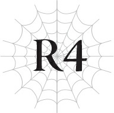

# Chương R4: Lão già gặp Quản trị viên
*(The Old Man Meets an Administrator)*

---

Lũ nhện vừa mới suýt soát thoát khỏi cuộc tấn công của ba con địa long.

Và hiện tại, chúng đang trong cuộc đại di cư xuyên qua Tầng Dưới của Mê cung Lớn Elroe.

Trong lúc chúng lũ lượt di chuyển thành đàn, ta cũng rảo bước đi giữa chúng.

Ban đầu ta tự hỏi chúng ta đang đi đâu, nhưng chẳng bao lâu sau, cả lũ đã đến đích.

Và tại đó, ta lập tức hiểu ra mục đích hiện tại của lũ nhện.

“Trứng...?”

Trước mắt ta là vài quả trứng khổng lồ.

Và đứng chặn ở tuyến đầu để bảo vệ chúng là vài con địa phi long.

Nhìn kỹ hơn, ta thấy xác của một vài con nhện nằm dưới chân lũ địa phi long.

Ta hiểu rồi.

Những con địa long kia đã cố gắng bảo vệ những quả trứng này.

Một nhóm nhện nhỏ chắc hẳn đã tình cờ chạm trán chúng trong lúc đi săn, và lũ rồng đã đánh bại chúng, sau đó lên đường trả đũa quân chủ lực của lũ nhện.

Chúng muốn dập tắt mối đe dọa từ tận gốc rễ trước khi có bất kỳ tổn hại nào xảy ra với những quả trứng.

Thật bi kịch làm sao, khi thay vào đó, cả ba con địa long đều bị đánh bại.

Thậm chí có khả năng hai trong số chúng chính là cha mẹ của những quả trứng này.

Nhưng giờ đây, khi cha mẹ của chúng đã không còn, những kẻ bảo vệ duy nhất của những quả trứng chỉ là lũ phi long này, vốn yếu hơn rất nhiều so với những con rồng thực thụ.

Thông thường, phi long không bị coi là quái vật yếu đuối, nhưng chúng chẳng có lấy một cơ hội chống cự trước đội quân nhện hùng mạnh này.

Có lẽ bản thân chúng cũng biết rõ điều đó, bởi những tiếng gầm rống mà chúng phát ra để uy hiếp lũ nhện giờ đây nghe thật yếu ớt và đầy sợ hãi lọt vào tai ta.

Tuy nhiên, lũ phi long vẫn dũng cảm đứng lên bảo vệ những quả trứng, và lũ nhện thì lao vào chúng một cách không khoan nhượng.

Cứ đà này, lũ phi long sẽ bị giết sạch và biến mất vào trong bụng lũ nhện cùng với những quả trứng và thứ bên trong chúng.

Cho đến khi một người xuất hiện để ngăn cản tương lai đó xảy ra.

“Ta nghĩ chuyện này nên dừng lại ở đây được rồi.”

Đó là một người đàn ông được bao phủ trong bóng tối.

Toàn thân hắn được che kín hoàn toàn trong một bộ giáp đen tuyền trông gần giống như lớp mai của loài giáp xác.

Khuôn mặt điển trai của hắn cũng mang làn da ngăm đen, tạo cho hắn một ấn tượng tổng thể như hiện thân của sắc đen.

Ngoại lệ duy nhất là đôi mắt đỏ rực, hiện đang lạnh lùng nhìn chằm chằm vào lũ nhện.

Hắn nhìn ta chỉ trong một tích tắc, rồi quay đi hướng khác.

...Có lẽ đó chỉ là do ta tưởng tượng, nhưng biểu cảm của hắn trông gần như thể hắn vừa nhìn thấy thứ gì đó đáng lẽ không nên thấy.

Thật bất lịch sự.

Nhưng rốt cuộc gã có phần bất lịch sự này là ai thế?

Chắc chắn hắn không phải là một con người bình thường, vì hắn lại xuất hiện ở đây, tại Tầng Dưới của Mê cung Lớn Elroe.

Mà thực ra, hắn có phải là con người hay không?

Ta cố gắng Thẩm định hắn, nhưng kết quả trả về chỉ đơn giản là <KHÔNG THỂ THẨM ĐỊNH>.

Không thể Thẩm định?

Đó là một kết quả tương tự như khi ta Thẩm định vị sư phụ đó, nhưng trong khi thực thể vĩ đại đó bằng cách nào đó đã chặn đứng Thẩm định của ta, thì ở đây việc Thẩm định ngay từ đầu đã là bất khả thi.

Vậy thì, người này chắc chắn phải ở cùng một đẳng cấp với vị sư phụ đó, hoặc thậm chí có thể là một thứ gì đó còn thần bí hơn. Đó là kết luận khả dĩ duy nhất.

Đặc biệt là khi nhìn vào phản ứng của chín con nhện kia, tất cả chúng đều đang dõi theo người đàn ông đó với sự cảnh giác tột độ đến mức gần như là sợ hãi.

Chính những con nhện này đã đánh bại ba con địa long một cách dễ dàng, nhưng chúng lại đang dè chừng người đàn ông này với sự cẩn trọng cao độ.

Hắn chắc chắn phải rất mạnh.

Mạnh đến mức ta nghi ngờ liệu bản thân có thể để lại nổi một vết trầy xước trên người hắn hay không.

Sau tất cả, ta thậm chí còn không cảm nhận được sự xuất hiện của hắn.

Hắn chắc chắn đã sử dụng [Dịch chuyển], nhưng ta thậm chí còn chẳng nhận ra.

Thật không thể tin được.

Không có lấy một chút dấu vết hay dao động nào cho thấy có người sắp dịch chuyển đến đây.

Khả năng ma pháp của hắn hẳn phải cực kỳ phi thường.

Nếu không tự kiểm soát bản thân, ta thậm chí có thể nghi ngờ rằng hắn còn mạnh hơn cả vị sư phụ đó.

“Lui lại ngay lập tức. Bất kỳ hành vi bạo lực nào tiếp theo sẽ được coi là lời tuyên chiến trực tiếp chống lại cá nhân ta.”

Nghe thấy thế, lũ nhện đồng loạt khựng lại tại chỗ.

Trong một khoảnh khắc, vạn vật xung quanh hoàn toàn tĩnh lặng.

Rồi lũ nhện đồng loạt quay đầu lại cực kỳ đồng đều và tháo chạy khỏi khu vực này với tốc độ kinh hồn.

Không thể bắt kịp tốc độ tăng tốc đột ngột của chúng, tất cả những gì ta có thể làm là bàng hoàng đứng nhìn chúng rời đi.

Cảm nhận được ánh mắt nhìn từ phía sau lưng, ta quay người lại và thấy người đàn ông trong bộ giáp đen đang nhìn ta với một biểu cảm không tài nào đoán được.

“Tại sao ngươi lại đi theo những sinh vật đó?”

Giọng nói của hắn nghe có vẻ thực sự bối rối.

Thực chất, sự hoang mang của hắn giống như một con người bình thường đến mức khiến sự căng thẳng trên vai ta lập tức biến mất.

“Điều đó chẳng phải đã quá rõ ràng rồi sao? Để truy cầu đỉnh cao của ma pháp.”

Ta ưỡn ngực tự hào.

“Đỉnh cao của ma pháp. Nói cách khác, ngươi muốn nâng cao năng lực ma pháp của mình?”

“Đúng vậy.”

Cách định nghĩa đó đối với ta có hơi đơn giản hóa quá mức, nhưng ta quyết định đồng ý thay vì lãng phí thời gian quý báu để tranh cãi về chi tiết vụn vặt.

Ta không chỉ đơn thuần tìm cách cải thiện ma pháp của mình. Ta muốn chạm tới cảnh giới tối thượng mà ma pháp có thể đạt tới.

“Tại sao ngươi lại bận tâm đến việc tinh luyện thứ như thế chứ? Ngươi biết đấy, chúng là một phần của thứ đã quét sạch binh lính của ngươi đấy.”

Tại sao ta lại muốn tinh luyện ma pháp của mình?

Thật là một câu hỏi nực cười.

“Nếu ta không hướng tới những đỉnh cao nhất của ma pháp, thì còn ai sẽ làm đây?”

Rất đơn giản.

Nếu ta không cố gắng vươn tới đỉnh cao, thì sẽ không một ai làm việc đó cả.

Đó là lý do tại sao ta phải đạt được nó. Ta không có lựa chọn nào khác.

Nếu ta là pháp sư mạnh nhất của nhân loại, thì ma pháp của ta phải mạnh hơn bất kỳ ai khác.

Nếu không thì, ta...

Hửm? Nếu không thì sao cơ?

Người đàn ông trông có vẻ không hiểu trong một khoảnh khắc, rồi lắc đầu như thể đã bỏ cuộc.

“Tốt nhất là ngươi nên tránh xa chúng ra.”

“Ta không thể làm thế được. Vẫn còn rất nhiều điều mà lũ nhện có thể dạy cho ta. Và ta vẫn chưa được gặp lại thực thể vĩ đại đó.”

Phải, rất đơn giản.

Ta đang đi theo lũ nhện để học hỏi từ chúng và để được diện kiến vị sư phụ ma pháp đó một lần nữa.

Ta không thể tránh xa chúng khi chưa hoàn thành bất kỳ mục tiêu nào trong số đó.

“Ta hiểu rồi.”

Người đàn ông trông không có vẻ gì là thất vọng trước sự từ chối của ta.

Hay là do hắn vốn đã luôn trưng ra vẻ mặt của một kẻ đang cảm thấy phiền toái ngay từ đầu rồi?

Trời đất, thật là một gã bất lịch sự tột cùng.

“Vậy thì. Hắng giọng. Nếu ngươi làm điều này theo ý chí tự do của mình, ta sẽ không ngăn cản. Tuy nhiên, ít nhất ngươi không thể mặc chút quần áo vào sao?”

...À.

Đúng rồi. Ta đang hoàn toàn khỏa thân.

Ta cho rằng bất kỳ con người nào phản ứng thế này cũng là lẽ thường tình.

Tuy nhiên, nếu ta muốn chạm tới đỉnh cao của ma pháp, ta không thể để bản thân bị kìm hãm bởi lẽ thường mãi mãi!

“Hừm. Ngươi chắc hẳn vẫn còn trẻ người non dạ lắm mới bị quấy rầy bởi một chuyện nhỏ nhặt thế này.”

Ta không yếu đuối đến mức phải xấu hổ vì một vấn đề tầm thường như vậy!

Hãy nhìn ta đi!

Đây chính là cách sống của kẻ mang tên Ronandt!

“À. Ừm. Ta hiểu rồi. Xem ra ngươi thực sự hết thuốc chữa rồi. Nếu vậy, ngươi có thể rời khỏi nơi này ngay bây giờ được không?”

“Đúng thế! Ta xin phép đi trước!”

Ta phải đuổi kịp lũ nhện trước khi chúng bỏ lại ta hoàn toàn.

Vì thế, ta quay lưng lại với người đàn ông mặc giáp đen và lập tức đuổi theo chúng ngay.

---

[◀ Chương trước: Đoạn phụ: Ma Vương và sự bất tử](interlude_the_demon_lord_and_immortality.md) | [Chương tiếp theo: Hội thoại: Cuộc họp Phân thân Tư duy #4 ▶](conversation_meeting_of_the_parallel_minds_4.md)
