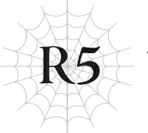

# Chương R5: Lão già khiêu chiến lũ nhện
*(The Old Man Challenges the Spiders)*

---

Ta đuổi theo lũ nhện, nhưng chúng đã hoàn toàn biến mất tăm.

Chắc hẳn chúng đã dùng [Dịch chuyển Quy mô lớn] để đi nơi khác trước khi ta kịp đuổi tới nơi.

Ta không khỏi thán phục trước tài năng ma pháp phi thường để có thể dịch chuyển một lượng lớn sinh vật như vậy trong một khoảng thời gian ngắn ngủi đến thế.

Trong lúc đang bối rối không biết nên làm gì tiếp theo, ta chợt nhớ lại những lời người đàn ông mặc đồ đen đã nói với mình.

*Mặc chút quần áo vào đi chứ, hử?*

Cũng đúng thật, ta đã khỏa thân có vẻ hơi lâu rồi.

Có lẽ ta nên quay lại thị trấn tạm thời để lấy ít quần áo. Sau đó mới đi tìm lũ nhện tiếp.

Quyết định vậy đi, ta liền dịch chuyển trở về thị trấn.

Cụ thể là vào căn phòng nơi ta được cho phép trú lại.

Ngay cả ta cũng có đủ nhận thức để hiểu rằng việc xuất hiện trong trạng thái trần như nhộng trước công chúng là không được hay ho cho lắm.

Tuy nhiên, ta lại nghe thấy tiếng ồn ào náo nhiệt bên ngoài.

Có lễ hội hay gì sao?

Dẫu sao thì, việc đầu tiên là phải mặc đồ vào đã.

Ta lục lọi đống hành lý của mình.

“A!”

Ta vẫn đang tìm đồ thì nghe thấy tiếng kêu kinh ngạc phía sau.

Quay người lại, ta thấy Aurel đang đứng trố mắt nhìn ta.

Trời đất. Ta quên khuấy mất con bé.

“Lão già! Rốt cuộc là ông đã biến đi đâu suốt thời gian qua hả?!”

“À, ừm, thì... Đi tìm lại chính mình?”

Con bé có vẻ khá giận dữ vì ta đã bỏ mặc nó ở đây lâu như vậy.

Hừm. Chắc ta cũng không trách con bé được.

Nhưng khi ta phải sống một cuộc đời khắc nghiệt như thế, thì cũng chẳng thể trách ta vì lỡ quên mất một hay hai đứa nhóc được.

“Sao tự dưng ông lại khỏa thân thế kia hả?! Khoan đã, giờ không phải lúc cho chuyện đó! Ông về đúng lúc lắm! Một đàn nhện khổng lồ đang tấn công thị trấn! Ông mau dùng cái ma pháp lợi hại của mình đi chứ. Đi tiêu diệt lũ chúng nó giùm chúng cháu với!”

“Cái gì cơ?!”

Một đàn nhện sao?!

Không lẽ nào?

Là lũ nhện ta vừa ở cùng cách đây không lâu?

“Để cho chắc chắn, đàn nhện đó có phải màu trắng không?”

“Ai mà biết được! Mau khoác đại cái gì vào rồi ra ngoài đó đi, ông già!”

Aurel vơ lấy bộ quần áo rồi nhét vào tay ta.

Thế nhưng, chuyện đâu có đơn giản như vậy.

Nếu đàn nhện này chính là lũ nhện mà ta biết, liệu ta có lấy nổi một cơ hội chiến thắng?

Nhưng xét về mặt thời gian, chắc chắn chính là chúng rồi.

Nếu vậy, đây quả thực là một nhiệm vụ bất khả thi.

“Đi nào, Aurel. Chúng ta phải chạy trốn thôi!”

“Hả?!”

Tuyên bố dõng dạc của ta bị đáp lại bằng một tiếng hét thất thanh từ Aurel.

“Đừng có ngốc thế chứ! Lũ binh lính ngoài kia đang chiến đấu trối chết vào lúc này đấy! Nếu ông không chịu làm việc bây giờ, thì ông còn tích sự gì nữa?! Không có ma pháp của ông, ông chỉ là một lão già vô dụng mà thôi!”

Nói thế chẳng phải hơi quá đáng rồi sao?!

Hừm. Nhưng ma pháp của ta quả thực không đủ mạnh để đối đầu với lũ nhện đó.

“Đi mà, cháu xin ông! Ngài Anh hùng... Julius đang chiến đấu ngoài kia kìa! Ông phải cứu cậu ấy!” Aurel nhìn ta với ánh mắt khẩn cầu, nước mắt lưng tròng. “Không phải ông là pháp sư mạnh nhất thế giới sao? Mau ra ngoài đó lên mặt kiêu ngạo rồi đập cho lũ quái vật đó một trận tơi tả như ông vẫn thường làm đi! Cháu van ông đấy, làm ơn đi!”

Lời khẩn cầu của Aurel khiến lòng ta rối bời.

Ta không phải là pháp sư mạnh nhất thế giới.

Dẫu sao thì, ta cũng từng bị đánh bại hoàn toàn bởi sư phụ.

Chắc chắn ta không thể một mình chọi lại chín con nhện kia, khi mà mỗi con đều có sức mạnh sánh ngang với thực thể vĩ đại đó.

Ta không còn cách nào khác ngoài chạy trốn... thế nhưng.

*“Ngươi đã chạy trốn sao?”*

Một giọng nói vang vọng ở sâu thẳm tâm trí ta.

Đó chính là những lời ta đã nói từ rất lâu rồi.

*“Lời thề của chúng ta chỉ là dối trá thôi sao? Ta đã nghĩ chúng ta sẽ cùng nhau bảo vệ nhân loại cơ mà! Ngươi đã chạy trốn đi đâu chứ? Tại sao?!”*

Bản ngã thời trẻ của ta gào thét nơi đáy lòng.

Đó là khi Kiếm Vương đời trước biến mất.

Trong thời gian tại vị, người dân Đế quốc tôn sùng ông là một vị Kiếm Thần.

Người đàn ông đó từng là chiến hữu và là bạn của ta.

“Với thanh kiếm của tôi và ma pháp của ông, chúng ta sẽ bảo vệ nhân loại,” ông ấy từng nói với ta như thế.

Chúng ta đã kề vai sát cánh chiến đấu, bảo vệ Đế quốc trước sự xâm lăng của ma tộc.

Ta đã nghĩ chúng ta sẽ tiếp tục chiến đấu cùng nhau mãi mãi.

Ta chưa từng nghi ngờ điều đó dù chỉ một lần.

Thế mà, một ngày nọ ông ấy đột nhiên biến mất.

Ông ấy đã trốn chạy khỏi nghĩa vụ của mình như một kẻ hèn nhát.

Từ bỏ vị thế kiếm sĩ mạnh nhất thế giới.

Từ bỏ cả vai trò gánh vác tương lai của nhân loại.

Ta đã cảm thấy mình bị phản bội.

Đồng thời, ta cũng tự thề với lòng rằng mình sẽ không bao giờ chạy trốn.

Không chạy trốn khỏi vị thế pháp sư mạnh nhất thế giới, không trốn chạy khỏi kỳ vọng của nhân dân, và không từ bỏ tương lai của nhân loại đang đè nặng trên đôi vai này.

...Tại sao ta lại quyết tâm chạm tới đỉnh cao của ma pháp đến thế?

...Lý do gì khiến ta khao khát truy cầu sức mạnh lớn hơn một cách điên cuồng như vậy?

À, ta nhớ ra rồi.

Ta nhớ ra tại sao mình lại nỗ lực suốt bấy lâu nay!

Để ta có thể bảo vệ người dân thay thế cho vị Kiếm Vương đời trước, kẻ đã trốn chạy khỏi vai trò của mình!

Thế mà, giờ đây ta lại có ý định chạy trốn khỏi hiểm họa đang đe dọa người dân chỉ vì bản thân không thể thắng?

Thật không thể tin nổi.

Ta không được làm như thế.

Sức mạnh ma pháp của ta tồn tại là để bảo vệ con người.

Nếu ta chạy trốn, ta thực sự sẽ chẳng khác nào một lão già khỏa thân vô dụng và lập dị.

“Đừng khóc, nhóc con.”

Ta giật bộ quần áo khỏi tay Aurel và nhanh chóng mặc vào.

“Cứ giao cho ta.”

Ta sẽ không chạy trốn.

Không trốn chạy khỏi vị thế pháp sư mạnh nhất thế giới.

Ngay cả khi đó là một danh hiệu hão huyền, không đáng tin cậy, ta cũng quyết không chạy trốn khỏi nó.

Chiến thắng sẽ là một thử thách vô cùng gian nan.

Nhưng ít nhất, ta vẫn có thể cứu cậu bé Anh hùng mà Aurel đang vô cùng lo lắng kia.

Ta lao ra ngoài, để lại Aurel đứng đó ngơ ngác.

Khi ta đến nơi, chiến trường đã rơi vào tình thế vô cùng ngặt nghèo.

Binh lính không còn chút đội hình hay chiến thuật nào để nói tới, họ chỉ đơn thuần cố gắng chống cự trước sức ép khủng khiếp của lũ nhện.

Tuy nhiên, ta hoài nghi liệu đội hình chiến đấu có tác dụng gì với lũ nhện này không, bởi chúng có thể tự do di chuyển trong không gian ba chiều.

Chúng nhảy qua cả những tấm khiên chắn của binh lính, tấn công họ từ phía sau. Chẳng trách đội hình của họ lại tả tơi đến thế.

“Huynh đệ tỷ muội à, đừng trách ta vô tình nhé.”

Ta nhắm vào nơi lũ nhện tụ tập đông nhất và tung ra một phép [Hỏa Ma pháp] quy mô lớn.

Ta vẫn chưa hoàn toàn thuần thục kỹ thuật nén thêm ma lực vào phép thuật.

Nhưng loài nhện bẩm sinh sợ lửa, nên ngay cả một phép [Hỏa Ma pháp] cơ bản cũng mang lại hiệu quả rõ rệt.

Nếu chín con nhện đầu sỏ không xuất hiện, có lẽ ta vẫn có thể giải quyết được bầy nhện này.

“Tới đây!”

Ta liên tục ném [Hỏa Ma pháp] xung quanh nhiều nhất có thể mà không làm ảnh hưởng đến binh lính.

Ở khắp nơi, lũ nhện bị thiêu rụi thành tro bụi.

Mất đi số lượng và nhuệ khí, lũ nhện bắt đầu bị đẩy lùi bởi những binh lính đã lấy lại được tinh thần chiến đấu nhờ sự viện trợ của ta.

Ở giữa họ, ta nhìn thấy một cậu thiếu niên với vóc dáng nhỏ bé.

Đó chắc chắn là cậu bé Anh hùng mà Aurel đã nói.

Trời đất, một đứa trẻ bé bỏng như vậy lẽ ra không nên tham gia vào một trận chiến thế này bằng bất cứ giá nào.

Nhìn qua phía sau cậu bé, ta thấy một con nhện khác đang lao thẳng về phía cậu.

Đứa trẻ không kịp phản ứng, chỉ biết nhìn trân trân trong kinh hoàng khi cặp nanh nhọn hoắt đang cận kề.

Nhanh như cắt, ta thổi bay con nhện bằng một quả cầu lửa.

“Con đã vất vả rồi, nhóc con. Phần còn lại cứ giao cho ta.”

Ta vừa dứt lời thì cậu bé đã ngã quỵ, có lẽ là do kiệt sức cả về thể chất lẫn tinh thần.

Ta đỡ lấy cậu bé trước khi cậu kịp ngã xuống đất.

“Trưởng lão Ronandt!” Vừa vặn lúc đó, Tiva chạy xộc tới chỗ ta.

“Trông chừng thằng bé giùm ta.”

Ta giao cậu bé cho Tiva, rồi quay mặt về phía trước.

Trước mắt ta, lũ nhện mà ta từng sinh sống cùng cách đây không lâu đang trong tư thế sẵn sàng chiến đấu.

---

[◀ Chương trước: Chương đặc biệt: Nỗ lực của cậu bé Anh hùng](special_chapter_the_boy_heros_struggle.md) | [Chương tiếp theo: Chương 4: Đập tơi tả nhện con ▶](04_baby_spider_beatdown.md)
