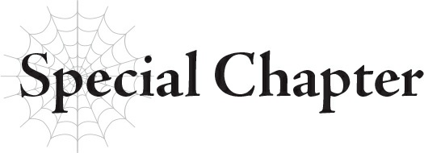
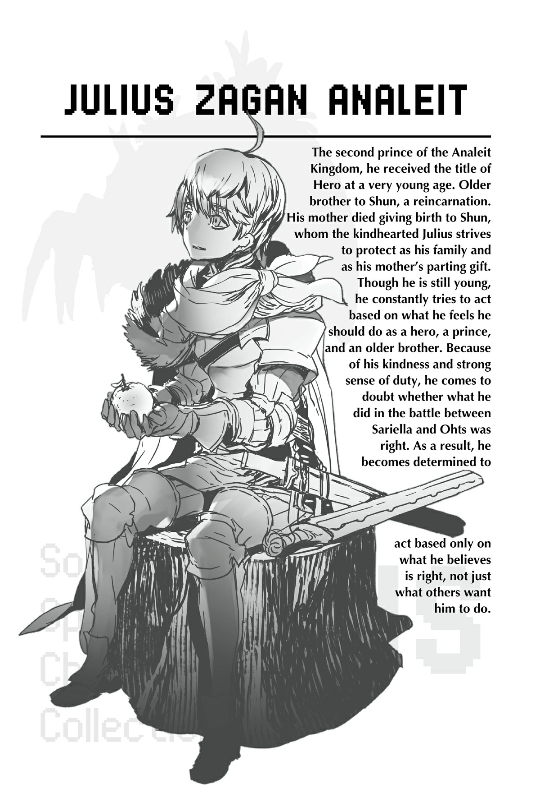

# Chương đặc biệt: Nỗ lực của cậu bé Anh hùng
*(Special Chapter: The Boy Hero’s Struggle)*

---

*Bản dịch thông tin nhân vật:*
**JULIUS ZAGAN ANALEIT**
Nhị hoàng tử của Vương quốc Analeit, người đã nhận được danh hiệu Anh hùng từ khi còn rất nhỏ. Là anh trai của Shun, một người tái sinh. Mẹ của anh đã qua đời khi sinh hạ Shun, và Julius tốt bụng luôn nỗ lực bảo vệ em trai mình như một thành viên trong gia đình và là món quà chia tay của người mẹ quá cố. Dù còn nhỏ tuổi, cậu luôn không ngừng cố gắng hành động dựa trên những gì cậu cảm thấy mình nên làm với tư cách là một Anh hùng, một hoàng tử và một người anh trai. Bởi lòng nhân hậu và tinh thần trách nhiệm mạnh mẽ, cậu bắt đầu nghi ngờ liệu những gì mình đã làm trong trận chiến giữa Sariella và Ohts có đúng đắn hay không. Kết quả là cậu quyết tâm chỉ hành động dựa trên những gì bản thân tin là đúng, chứ không chỉ làm theo những gì người khác muốn cậu làm.

---

Mọi người đang bị thổi bay ngay trước mắt tôi.

Cảnh tượng họ bay lơ lửng giữa không trung trông gần như một trò đùa.

Nhưng tất nhiên, bị thổi bay như vậy không hề kết thúc trong êm đẹp đối với họ.

Trông thì giống như một vở kịch hài hước, nhưng đây vẫn là hiện thực.

Một số người cắm đầu xuống đất, cổ gãy gập theo những góc độ dị thường và tử vong ngay lập tức.

Nhưng hầu hết không được may mắn như vậy, và thi thể của họ rơi xuống trong một tình trạng kinh hoàng.

Tôi chưa bao giờ thấy một con người bị vỡ nát ra như thế.

Cảnh tượng ác mộng đó tiếp tục diễn ra trước mắt tôi.

Đó là địa ngục trần gian.

Phía sau đám đông đang gào thét, chạy trốn và bỏ mạng kia, tôi nhìn thấy con quái vật đang tạo nên cơn ác mộng này.

Bắt đôi chân run rẩy của mình phải cử động, tôi—

Tôi giật mình tỉnh giấc.

Khi nhận ra cảnh tượng trước mặt chỉ là căn phòng tôi đang ở hiện tại, tôi thở phào nhẹ nhõm.

Đó chỉ là một giấc mơ.

Tôi áp tay lên ngực, nơi trái tim đang đập liên hồi.

Mạch vẫn đập. Nghĩa là tôi vẫn còn sống.

Chỉ riêng điều đó đã là một sự giải thoát rồi.

Chiếc áo dưới lòng bàn tay tôi đã ướt đẫm mồ hôi.

Lần nào có giấc mơ đó cũng vậy.

Giấc mơ bắt tôi phải nhớ lại khoảng thời gian chạm trán với con quái vật được gọi là Cơn Ác Mộng của Mê Cung.

Nó thật đáng sợ.

Tôi vẫn chỉ là một đứa trẻ, nhưng tôi đã trở thành Anh hùng.

Đó là lý do tôi chỉ được gửi đi tham gia trận chiến đó với tư cách là một quan sát viên, để tôi có thể trải nghiệm chiến trường càng sớm càng tốt.

Họ bảo tôi đó chắc chắn là một chiến thắng, nên sẽ không có nhiều nguy hiểm.

Nhưng trên thực tế, trải nghiệm đầu tiên của tôi trên chiến trường hóa ra lại là một nỗi kinh hoàng.

Lần đầu tiên tôi biết được con người có thể chết dễ dàng đến thế nào.

Khi mẹ tôi sinh hạ em trai tôi, Schlain, việc suy kiệt thể xác đã cướp đi sinh mạng của bà. Mang theo nỗi đau buồn đó trong tim, tôi lần đầu tiên hiểu được sức nặng thực sự của cái chết.

Nhưng trên chiến trường đó, cái chết ở khắp mọi nơi tôi nhìn.

Người ta ngã xuống hết người này đến người khác một cách dễ dàng đến đáng sợ.

Tôi đã sợ hãi đến mức hai chân run lẩy bẩy, nhưng tôi biết mình phải đối mặt với nỗi sợ hãi đó.

Bởi vì tôi là Anh hùng.

Tôi không nhớ rõ chuyện gì đã xảy ra sau đó nữa.

Tôi nghĩ mình đã chạy về phía Cơn Ác Mộng, chỉ để rồi đứng chôn chân tại chỗ, không thể làm được gì.

Nhưng tôi được kể lại rằng sự xuất hiện của tôi đã đánh lạc hướng Cơn Ác Mộng đủ lâu để mọi người câu giờ niệm một đại ma pháp.

Phép thuật đó đã thiêu rụi Cơn Ác Mộng thành cát bụi, và tôi đã sống sót một cách thần kỳ.

Tôi có cảm giác có ai đó đã bảo vệ mình, nhưng tôi không thực sự nhớ rõ.

Sau đó, đủ loại người đã dành cho tôi những lời khen ngợi.

“Cậu thực sự là một Anh hùng.” “Nhờ có cậu mà Cơn Ác Mộng mới bị đánh bại.”

Nhưng tôi chẳng làm gì cả.

Tôi không thể.

Và tôi vẫn không biết liệu chút ít thành quả mình đạt được có đúng đắn hay không.

Nhìn ra ngoài cửa sổ, tôi thấy những bức tường thành đổ nát bao quanh thị trấn và những ngôi nhà bị phá hủy vẫn chưa được xây dựng lại hoàn toàn.

Tôi cũng góp một phần tạo nên cảnh tượng này.

Người dân sống ở thị trấn này đã bị tấn công bởi một đội quân mà tôi đồng hành.

Và Cơn Ác Mộng mà tôi đối đầu lại đang chiến đấu để bảo vệ thị trấn này.

Ai mới thực sự là người đúng đắn?

“Chào nhé, Anh hùng. Thế nào rồi?”

Khi tôi trở về từ công việc săn quái vật gần như thường nhật của mình, tôi bắt gặp một gương mặt quen thuộc.

Đó là Aurel, cô bạn trạc tuổi tôi với cách cư xử khác thường.

Nghe nói cô ấy đến từ Đế quốc và đang ở lại thị trấn này vì những hoàn cảnh phức tạp.

“Tớ ổn.”

“Tớ có phần thưởng cho cậu sau khi đã làm việc vất vả đây nha.”

Aurel đưa cho tôi một quả trái cây.

Nhìn xung quanh, tôi thấy những người đàn ông cũng đang ăn loại quả đó.

Chắc hẳn cô ấy đã mang chúng đến để làm đồ ăn nhẹ cho những người của Đế quốc đang sửa lại tường thành.

“Cảm ơn cậu.”

Không muốn phụ tấm lòng của cô ấy, tôi nhận lấy quả trái cây và cắn một miếng.

“Thị trấn này có vẻ như có rất nhiều trái cây nhỉ,” tôi nhận xét, nghĩ về việc các bữa ăn ở đây dường như thường xuyên có trái cây xuất hiện.

“Ừ. Nghe bảo có một con Thần Thú thích ăn chúng, nên họ mới bắt đầu đẩy mạnh trồng trọt thêm đúng không nhỉ? Và giờ lại trùng hợp là mùa thu hoạch của vài loại hay gì gì đó.”

Tôi suýt chút nữa là phun quả trái cây trong miệng ra.

Con “Thần Thú” đó chắc chắn là Cơn Ác Mộng.

Con quái vật đáng sợ đó… lại thích ăn trái cây sao?

Thật là khó tưởng tượng.

Nhưng người dân ở thị trấn này thực sự sùng bái Cơn Ác Mộng.

Tôi biết điều đó, vì người dân thị trấn thỉnh thoảng lại buộc tội tôi giết Thần Thú của họ và ném đá vào tôi.

Nhìn họ, tôi bắt đầu tự hỏi ai mới thực sự là kẻ ác.

Cơn Ác Mộng tôi nhìn thấy thực sự là hiện thân của những giấc mơ ám ảnh, gần như quá đáng sợ để có thể là sự thật.

Nhưng đối với người dân thị trấn này, đó lại là một Thần Thú để sùng bái.

“Anh hùng Julius! Ngài đây rồi!”

Khi tôi đang nhớ về Cơn Ác Mộng, một giọng nói lọt vào tai tôi.

Nó thuộc về một người đàn ông mặc quân phục của binh sĩ Thần Ngôn Giáo, vừa chạy về phía tôi vừa hét lên.

“Ngài đang làm gì vậy? Không phải ngài đã được thông báo hôm nay là lễ xuất quân sao?” Người lính nhíu mày.

Hôm nay, quân Ohts và binh sĩ Thần Ngôn Giáo tập trung tại thị trấn này sẽ tổ chức một buổi lễ trước khi tiến vào thị trấn tiếp theo.

Tôi được bảo rằng mình nên tham gia. Tuy nhiên…

“Tôi nghĩ mình đã trả lời các người rồi chứ. Tôi sẽ không tham gia, và tôi cũng sẽ không tiến đến thị trấn tiếp theo.”

“Xin ngài đừng nói như vậy. Việc đó thực sự rất đáng lo ngại đấy.”

Người đàn ông trông thực sự rất lo lắng.

Nói chính xác hơn, biểu cảm của ông ta là của một người lớn đang bối rối trước một đứa trẻ ngang bướng.

Nhưng tôi đã hạ quyết tâm.

Tôi sẽ không tham gia vào cuộc chiến này nữa.

Tôi không thể ngăn cản chiến tranh, nhưng tôi chắc chắn có thể từ chối ủng hộ nó.

Tôi muốn ở lại thị trấn này để giúp họ xây dựng lại.

Tôi sẽ không còn đơn thuần làm theo bất cứ điều gì người lớn bảo nữa.

Tôi sẽ hành động dựa trên quyết định của riêng mình và làm những gì tôi tin là đúng đắn.

“Tôi sẽ ở lại thị trấn này, bất kể ai có nói gì đi chăng nữa. Làm ơn hãy chuyển lời lại như vậy.”

“Không thể như thế được đâu ạ.”

Vì đích thân đến đón tôi, tôi đoán người lính này có địa vị cũng khá. Nhưng lúc này, vẻ mặt ông ta hiện rõ vẻ đau khổ tột cùng.

Tôi gần như cảm thấy hơi có lỗi, nhưng tôi không có ý định thay đổi ý kiến.

Ngay khi tôi định mở miệng để khẳng định lại quyết định của mình, tôi nghe thấy một tiếng gầm vang vọng từ đằng xa.

Nhận ra đó là tiếng la hét của mọi người, tôi lập tức chạy về phía nguồn phát ra âm thanh.

Khi đến nơi, tôi nhận ra mình đã tới chỗ diễn ra lễ xuất quân mà tôi đã kiên quyết từ chối tham gia.

Nơi này chật kín binh lính và đang rơi vào cảnh hỗn loạn tột cùng.

“Chuyện gì xảy ra ở đây thế?!”

“Ngài Anh hùng sao?!” Người lính mà tôi vừa nói chuyện quay lại nhìn tôi trong hoảng loạn, nước bọt bắn tung tóe khi ông ta hét lên như một kẻ điên. “Là Cơn Ác Mộng! Một đàn Cơn Ác Mộng đang tấn công chúng ta!”

Ngay khi nghe thấy từ Cơn Ác Mộng, cơ thể tôi run lên một cách vô thức.

Nhưng ý ông ta “một đàn” là thế nào?

Câu trả lời sớm xuất hiện trước mắt tôi.

“Không thể nào…”

Trong khi tôi nhìn trong kinh hãi, một bầy nhện trắng đang lao thẳng về phía cổng thành.

“Đóng cổng lại!”

Những tiếng la hét vang lên giữa đống hỗn loạn.

Dù hoảng sợ trước vô số con nhện đang bò về phía tường thành, những người lính vẫn biết mình phải làm gì và lập tức hành động.

Ngay lập tức, họ đóng những cánh cổng vốn đang mở để chuẩn bị cho lễ xuất quân.

Đồng thời, những binh sĩ khác trèo lên đỉnh tường thành và chuẩn bị tấn công lũ nhện đang lao tới.

Tôi định đi theo họ, nhưng có ai đó đã giữ vai tôi lại.

“Ngài Anh hùng, xin hãy chạy đi!”

Quay lại, tôi thấy ngài Tiva, vị kỵ sĩ Đế quốc thường đi cùng Aurel.

“Ở đây quá nguy hiểm. Hãy lánh nạn ở đâu đó trong thị trấn đi.”

“Tôi cũng sẽ chiến đấu!”

Bàn tay giữ chặt vai tôi của Tiva cho thấy tôi không có sự lựa chọn, nhưng tôi vẫn kiên quyết từ chối.

“Không.” Tiva lắc đầu. “Ngài còn trẻ. Quá trẻ để phải bỏ mạng ở đây.”

Lực siết trên vai tôi ngày một mạnh hơn.

Trong đôi mắt ông ấy, tôi thấy một sự quyết tâm nghiệt ngã.

Ngay lúc đó, tôi biết chắc chắn: Người đàn ông này cũng đã có mặt trên chiến trường ngày hôm đó.

Ông ấy tự mình biết rõ Cơn Ác Mộng đáng sợ đến mức nào.

Và chính vì vậy, ông ấy cũng hiểu rằng chúng tôi không có hy vọng chiến thắng trong trận chiến này.

“Dù vậy, tôi vẫn phải chiến đấu!”

Tôi không thể bỏ chạy vào lúc này.

Tôi không biết bằng cách nào hay tại sao, nhưng tôi biết mình cần phải ngăn chặn bầy nhện đang tràn tới kia.

Chúng không giống như Cơn Ác Mộng đã bảo vệ thị trấn này.

Vì lý do nào đó, tôi có thể cảm nhận chắc chắn rằng chúng có ý định gieo rắc tai ương xuống thị trấn này và toàn bộ người dân nơi đây.

Tôi gạt tay Tiva ra và trèo lên tường thành.

Nhìn xuống, tôi thấy bầy nhện đã tiến sát chân tường.

Các binh sĩ đang tấn công bằng ma pháp, tên bắn và nhiều thứ khác, nhưng hiệu quả chẳng được bao nhiêu.

Đơn giản là chúng quá đông. Hễ một con nhện ngã xuống, con khác lại lập tức thế chỗ.

Có bao nhiêu con nhện ở đó vậy?

Đối với tôi, trông nó ít nhất cũng phải một vạn con, và có lẽ còn nhiều hơn thế rất nhiều.

Trong tầm mắt của tôi, mặt đất đã bị phủ kín bởi nhện.

Cảnh tượng kinh hoàng đó lấp đầy tôi bằng nỗi sợ hãi.

Nhưng phía sau tôi là người dân của thị trấn này, và cả cô bạn có cách nói chuyện kỳ lạ kia nữa.

Tôi không thể chạy trốn lúc này!

Tôi sử dụng Thánh Quang Ma pháp, ma pháp mà tôi học được khi trở thành Anh hùng.

Một vài con nhện bị trúng đòn ngã xuống, nhưng làn sóng tràn theo sau đơn giản là giẫm đạp lên xác của chúng mà tiến tới.

Tôi liên tục tung phép, nhưng tốc độ không đủ nhanh.

Chúng quá đông.

Những con nhện đi đầu của bầy chẳng mấy chốc đã tiếp cận tường thành.

“Hả?!”

Và rồi, không hề giảm tốc độ, chúng cứ thế bắt đầu leo lên.

“Á… á!”

Các binh sĩ hoảng loạn tìm cách chống trả khi lũ nhện tiến lại gần.

Quái vật ở khu vực này chưa bao giờ biết leo tường. Nhưng lũ nhện này đang phi lên tường thành một cách vô cùng dễ dàng.

Bức tường thành coi như vô dụng!

“Xuống đi! Xuống ngay đi!” một người đàn ông trông giống như tướng quân hét lên.

Nhưng lúc đó, những con nhện đầu tiên đã leo lên đến đỉnh tường thành, và chúng ập xuống chúng tôi như một cơn thủy triều.

Một con chồm dậy ngay trước mặt tôi, nhe ra những chiếc răng nanh ghê rợn!

Tôi nhanh chóng rút kiếm và cố gắng đỡ đòn, nhưng cơ thể tôi đơn giản là quá nhẹ để cản được cú húc của con nhện, và tôi nhào lộn ra sau.

“Á…!”

Bị rơi xuống từ trên tường thành, tôi đập người xuống đất.

Tôi cố gắng gượng đứng dậy bất chấp cơn đau và thấy các binh sĩ đang chiến đấu chống lại lũ nhện đã tràn qua bức tường.

Binh lính đưa khiên ra phía trước và cố gắng đẩy lũ nhện lui lại, nhưng ngày càng có nhiều nhện ùa tới, không ngừng tiến lên.

Một sợi tơ bắn ra trúng vào một tấm khiên, kéo tuột cả tấm khiên lẫn người lính vào giữa bầy nhện.

“Á! Cứu tôi với!”

Người lính gào thét khi biến mất vào làn sóng nhện vô tận.

Cảnh tượng tương tự đang diễn ra khắp nơi dọc theo bức tường thành.

Thực sự là một cơn ác mộng.

Nhưng tôi không có thời gian để bàng hoàng, vì lũ nhện cũng đang tiến sát lại gần tôi.

“Áaaaa!”

Tất cả những gì tôi có thể làm là vung kiếm và cố gắng chống cự chúng.

---

[◀ Chương trước: Hội thoại: Cuộc họp Phân thân Tư duy #4 - OMGüli-güli!](conversation_meeting_of_the_parallel_minds_4.md) | [Chương tiếp theo: Chương R5: Lão già khiêu chiến lũ nhện ▶](r5_the_old_man_challenges_the_spiders.md)
