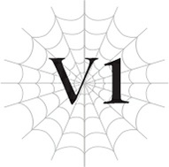
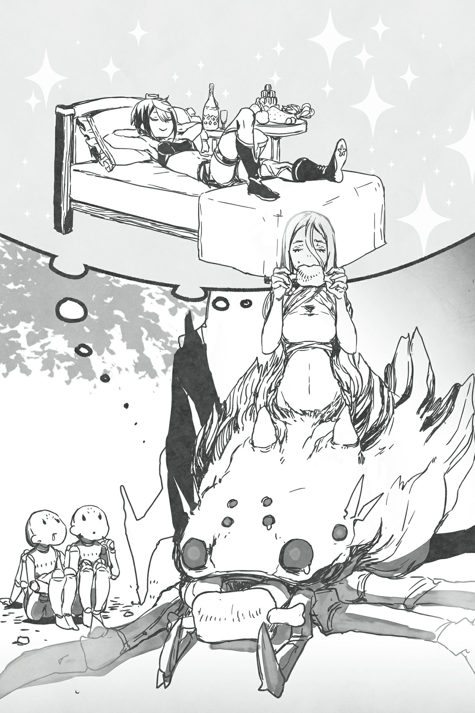

# Chương V1: May mắn, Vận rủi
*(Fortune, Misfortune)*

---

Ấn tượng đầu tiên của tôi về người tên Wakaba Hiiro là cô ta là kẻ "chiến thắng cuộc đời".

Biệt danh của tôi ở kiếp trước là Rihoko.

Đó là viết tắt của "Real Horror Girl" (Cô gái Kinh dị Thực tế).

Chẳng có tí sáng tạo nào. Cũng chẳng có chút hấp dẫn. Đơn giản là một cái biệt danh được chế ra chỉ để trêu chọc tôi.

Nhân tiện, đó là biệt danh thời cấp ba của tôi. Còn hồi cấp hai, họ gọi tôi là "ma cà rồng".

Có lẽ những biệt danh đó dễ nhớ hơn tên thật của tôi nhiều, Negishi Shouko.

Dù sao thì, tôi nghĩ việc mình bị gọi như thế cũng là điều không thể tránh khỏi.

Vẻ ngoài trước đây của tôi không thể được coi là ưa nhìn theo bất kỳ tiêu chuẩn nào.

Làn da tái nhợt xanh xao.

Một cơ thể gầy gò, trơ xương.

Mỗi khi nhìn vào gương, đập vào mắt tôi là một khuôn mặt như xác chết với đôi má hóp và đôi mắt vô hồn.

Hàm răng thì khấp khểnh không đều, nổi bật là chiếc răng nanh chìa hẳn ra ngoài.

Tôi xấu xí, trần trụi và đơn giản là thế.

Trong kiếp sống đó, tôi căm ghét vẻ ngoài của chính mình.

Bạn cũng sẽ thế đúng không?

Tôi chẳng làm gì nên tội để phải gánh chịu điều đó, vậy mà tôi liên tục bị bắt nạt hoặc trở thành mục tiêu cho những lời bàn tán xầm xì chỉ vì vẻ ngoài kinh khủng của mình.

Đối với một kẻ như tôi, một cô gái như Wakaba Hiiro dường như được ban phước lành vượt quá cả sự tưởng tượng.

Cụ thể là vẻ bề ngoài của cô ta.

Lần đầu tiên nhìn thấy cô ta, tôi đã vô cùng kinh ngạc khi một người xinh đẹp đến thế lại thực sự tồn tại ngoài đời thực.

Cô ta đẹp đến mức đó đấy.

Đó là lý do tại sao cô ta là kẻ "chiến thắng cuộc đời".

Vào lúc đó, tôi đã nghĩ giá như mình có được vẻ ngoài như vậy, cuộc đời tôi hẳn sẽ viên mãn cho đến cuối đời.

Thành thật mà nói, tôi đã rất ghen tị.

Cô gái này sở hữu tất cả những gì tôi không có, ít nhất là về mặt ngoại hình.

Vì thế, tôi đã dành phần lớn những ngày tháng cấp ba để quan sát cô ta.

Cô ta hầu như không bao giờ mở miệng nói một lời.

Cô ta không bao giờ nói bất cứ điều gì trừ phi thực sự bắt buộc, và chắc chắn cô ta chẳng thèm nỗ lực chủ động giao tiếp với ai.

Kiêu ngạo làm sao, tôi đã nghĩ thế.

Suy nghĩ đó của tôi có phần không công bằng cho lắm, nhưng so với việc người khác chủ động xa lánh tôi vì vẻ ngoài của tôi, thì trường hợp của cô ta lại giống như tự mình không cho phép ai tiếp cận hơn.

Kết quả cuối cùng thì như nhau, nhưng nguyên nhân lại hoàn toàn trái ngược.

Người ta bắt nạt tôi từ một khoảng cách xa, nhưng họ lại tôn sùng cô ta từ chính khoảng cách đó.

Có lẽ bạn có thể mô tả cô ta là kẻ "xa cách" chăng?

Dù gọi bằng bất cứ tên gì đi nữa, cô ta luôn tỏa ra một bầu không khí khiến người khác dễ dàng ngưỡng mộ nhưng lại cực kỳ khó tiếp cận.

Sự khác biệt lớn nhất giữa Wakaba Hiiro và tôi chính là ngoại hình.

Thế nhưng chỉ một yếu tố đó thôi cũng đủ để người ta đối xử với hai chúng tôi hoàn toàn khác biệt.

Ngoại hình càng đẹp, người ta đối xử với bạn càng tốt.

Ngoại hình càng xấu, người ta đối xử với bạn càng tệ.

Đó là một sự bất bình đẳng ngay từ khi chúng ta mới sinh ra, một khoảng cách xuất phát điểm không thể san lấp bằng bất kỳ nỗ lực nào.

Wakaba Hiiro được sinh ra với tất cả những phước lành mà tôi thiếu thốn, vậy mà không hiểu sao cô ta trông lúc nào cũng có vẻ chán chường.

Tôi không biết điều gì đang làm phiền cô ta, nhưng chưa một lần nào tôi thấy cô ta có vẻ mặt vui vẻ cả.

Cô ta luôn mang cùng một vẻ mặt dửng dưng không chút biểu cảm.

Như thể đôi mắt không thể thấu suốt đó chẳng hề để tâm đến thế giới xung quanh.

Ấy thế mà, bất chấp sự xa cách rõ ràng đó, ánh mắt của cô ta dường như lại xuyên thấu tất cả mọi thứ.

Dù điều đó khiến tôi vô cùng ấm ức, tôi vẫn hiểu được tại sao mọi người lại sùng bái Wakaba Hiiro đến vậy.

Có một điều gì đó ở cô ta vượt xa tầm hiểu biết của một người bình thường.

Kết hợp với vẻ ngoài xinh đẹp, nó tạo cho cô ta một vẻ bí ẩn đầy cuốn hút trong mắt mọi người.

Wakaba Hiiro sở hữu đủ mọi thứ mà tôi không có.

Tôi ôm lòng đố kỵ một chiều đối với cô ta, và đồng thời, căm ghét chính bản thân mình vì đã ôm giữ thứ cảm xúc xấu xí như vậy.

Nhưng biết làm sao được chứ? Tôi nên làm gì đây? Nếu tôi sở hữu một gương mặt xinh đẹp, liệu cuộc đời tôi có khác đi không? Có phải điều đó có nghĩa là cuộc đời tôi đã đi sai hướng ngay từ khoảnh khắc tôi chào đời? Theo tôi, vẻ ngoài xấu xí cũng sẽ khiến tâm hồn bạn trở nên xấu xí theo. Cuộc sống vốn là như vậy đấy.

Nếu bạn có ngoại hình đẹp, bạn đã nắm chắc chiến thắng trong cuộc đời.

Đó là kết luận của tôi.

“Được rồi, chúng ta sẽ nghỉ đêm ở thị trấn đó. Cô đợi quanh đây nhé, White?”

Thế nhưng hình mẫu người chiến thắng hoàn hảo của tôi—Wakaba Hiiro, người hiện được biết đến với cái tên White—bản thân cô ta hiện cũng đang phải gánh chịu một số vận rủi nặng nề.

Chúng tôi đã tìm cách tránh thu hút sự chú ý của con người vì nhiều lý do khác nhau, nhưng chúng tôi không thể duy trì việc đó mãi được.

Do đó, chúng tôi quyết định dừng chân ở thị trấn gần nhất để mua thức ăn và nhu yếu phẩm thiết yếu, nhưng White lại không thể vào trong vì hình dạng hiện tại của cô ta.

Vì thế chúng tôi phải để cô ta lại phía sau.

Để tôi nói thẳng cảm xúc của mình lúc này nhé.

Đáng đời lắm!

Cho dù cô ta có xinh đẹp đến đâu đi nữa, hiển nhiên một kẻ không phải con người làm sao mà được vào thị trấn chứ!

Bạn thấy đấy, Wakaba Hiiro không còn là con người nữa rồi.

Ngoại hình ngoại trừ việc mang một màu trắng toát, nửa thân trên của cô ta trông gần như không đổi, nhưng nửa thân dưới lại là cơ thể của một con nhện.

Nói cách khác, cô ta là một con quái vật được gọi là Arachne.

Thừa nhận là, ở thế giới cũ tôi luôn tự hỏi (một cách khá khiếm nhã) rằng liệu cô ta có thực sự là con người hay không, nhưng tôi chưa bao giờ ngờ được cô ta lại thực sự ngừng làm người thế này.

Mặc dù thật bực mình khi cô ta bằng cách nào đó vẫn xinh đẹp như mọi khi.

Nhưng đó không phải là lý do tôi đang hả hê trước vận rủi của cô ta lúc này.

Không, vấn đề của tôi là cái cách cô ta đối xử với tôi suốt chuyến hành trình kinh khủng này!

Tôi vẫn chỉ là một đứa bé sơ sinh thôi đấy, biết chưa hả?!

Đến việc đứng tôi còn chưa thể làm nổi chứ đừng nói là đi, thế mà tại sao cô ta lại ép tôi phải lội bộ dọc theo những con đường núi hiểm trở này?!

Như thế không phải là quá sai trái sao? Đối với tôi thì cực kỳ sai trái luôn ấy!

Nếu Ariel không giải thích lý do đằng sau những bài tập huấn luyện nhỏ đó, có lẽ tôi đã phát điên từ lâu rồi.

Nhưng theo cô ấy, việc đó là để tăng cường các kỹ năng và chỉ số của tôi.

Thế giới này có một cơ chế kỳ lạ khi những thứ như kỹ năng và chỉ số thực sự tồn tại, và bạn càng rèn luyện chúng nhiều, bạn càng trở nên mạnh mẽ hơn.

Ariel bảo rằng White đang đưa tôi vào lò luyện ngục để cải thiện kỹ năng và chỉ số của tôi.

Cứ cho là cô ta đang nghĩ cho tương lai của tôi đi, nhưng tôi không biết mình có nên tin vào điều đó hay không.

Nhân tiện, biệt danh “White” ra đời sau cuộc đối thoại thế này:

“Sao chúng ta không gọi cô là ‘Công chúa’ nhỉ? Cô có muốn ta đeo nơ cho cô không? Dù sao thì cô cũng không thể biến hình thành ma pháp thiếu nữ được đâu.”

“Không.”

“Thế thì gọi là ‘White’ nhé? Dù cái tên đó nghe hơi giống tên mèo cảnh.”

“…Muốn làm gì thì làm.”

Nếu hỏi tôi, thì cái tên “Công chúa” nghe hay hơn nhiều, nhưng sao cũng được.

Mà cái vụ đeo nơ đó là sao chứ?

Có quá nhiều điều kỳ quặc trong cuộc trò chuyện ngắn ngủi đó, nhưng dù sao đi nữa, Ariel thực sự đã bắt đầu gọi cô ta là “White” kể từ đó.

Tôi khá chắc chắn Ariel cố tình chọn một cái tên kỳ lạ để chọc tức cô ta, nhưng nạn nhân dường như chẳng hề bận tâm lắm, thế nên ngay cả Merazophis và tôi cũng bị cuốn theo và bắt đầu gọi cô ta là White.

Cứ nghĩ đến cách cô ta đối xử với tôi từ trước đến giờ, tôi thấy mình có quyền được ích kỷ một chút.

“Chao ôi, White tội nghiệp chưa kìa. Cô sẽ không được ăn đồ ăn ngon ở nhà trọ hay được ngủ trên chiếc giường êm ái đâu. Tiếc thật đấy, nhưng chúng ta đâu còn lựa chọn nào khác đúng không? Nhưng đừng lo! Ta hứa sẽ tận hưởng nó gấp đôi thay phần cô!” Ariel toe toét cười, rõ ràng là muốn thêm dầu vào lửa.

White vẫn vô cảm như mọi khi, nhưng cô ta đang tỏa ra nguồn năng lượng uy hiếp thậm chí còn đáng sợ hơn trước.

Giữa hai người họ như có tia lửa điện bắn ra tung tóe vậy.

Đáng sợ thật.

Chỉ có vậy thôi mà màn ăn mừng thầm lặng “Đáng đời lắm!” của tôi đã lập tức kết thúc.

Chính là thế này đây.

Đây là lý do tại sao tôi không thể phản kháng lại hai người bọn họ, bất kể hành động của họ có vô lý đến đâu.

Cả hai đều sở hữu sức mạnh áp đảo tuyệt đối.

Bất kỳ ai trong số họ cũng có thể một mình cân cả một đội quân.

Sức mạnh đó được ban cho họ bởi các chỉ số, một khái niệm hoàn toàn không tưởng ở thế giới cũ của chúng tôi.

Merazophis và tôi thậm chí còn chẳng thể so sánh được với họ.

Mỗi khi nghĩ đến việc chuyện gì sẽ xảy ra nếu tôi chọc giận một trong hai người khiến họ dùng sức mạnh đó để chống lại tôi, tôi lại không thể làm gì khác ngoài việc ngoan ngoãn tuân theo bất cứ điều gì họ bảo.

“Thế là đủ rồi đấy, hai người. Các vị đang làm tiểu thư hoảng sợ.”

Ấy vậy mà, Merazophis lại lên tiếng nhắc nhở họ mà không hề do dự lấy một giây.

“Ối chà chà! Xin lỗi nhé. Được rồi, chúng ta đi thôi. Đừng có dỗi quá đấy nhé White. Ta hứa sẽ mang quà lưu niệm về cho cô.”

Luồng uy áp khủng khiếp của Ariel lập tức tan biến, cô ấy vẫy tay uể oải rồi quay người bước đi.

Nhìn Ariel rời đi, White thở dài một tiếng nhỏ rồi ngồi phịch xuống đất.

Đứng gác ở hai bên cô ta như hộ vệ là hai con nhện rối, những con quái vật trông giống như ma-nơ-canh do Ariel triệu hồi.

“Vậy thì, xin thất lễ.”

Trong lúc tôi còn đang thẫn thờ nhìn White và những con nhện rối, cơ thể tôi đã nhẹ nhàng được nhấc bổng lên không trung.

Ngước nhìn lên, mắt tôi chạm phải ánh mắt của Merazophis ẩn dưới bóng chiếc mũ trùm.

Vì suốt thời gian qua White liên tục ép tôi phải đi bộ, đã lâu lắm rồi tôi mới lại được Merazophis bế như thế này.

Phải rồi, có lẽ sẽ tự nhiên hơn nếu anh ấy bế tôi khi chúng tôi vào thị trấn.

Tôi đã suýt nữa định tự mình đi bộ đuổi theo Ariel bằng đôi chân nhỏ bé. Có lẽ những bài tập tẩy não này đã bắt đầu ngấm vào người tôi rồi.

Merazophis nhanh chóng đuổi kịp Ariel.

Vì cô ấy quá thấp, đặc biệt là khi so với Merazophis, đó là một việc vô cùng dễ dàng với anh ấy.

Còn nếu là đôi chân của tôi thì chắc chắn chẳng thể nào đuổi kịp nổi rồi.

“Ngài có chắc việc chọc giận cô ta như vậy là khôn ngoan không?” anh ấy hỏi, vừa đi vừa giữ khoảng cách ngắn phía sau Ariel.

Tôi không hiểu sao Merazophis có thể nói năng bộc trực như thế trước những nhân vật đáng sợ như vậy.

Lúc đầu anh ấy đã phản đối cực kỳ dữ dội cái cách White đối xử với tôi.

Mặc dù cô ta chỉ im lặng ném cho anh ấy một ánh mắt sát khí khủng khiếp đến mức anh ấy buộc phải câm nín ngay lập tức.

“Hừm. Bản thân ta cũng có nhiều cảm xúc lẫn lộn đối với White mà, biết chứ. Chẳng lẽ ta không thể tỏ thái độ kém thân thiện với cô ta một chút sao? Nhưng đừng lo. Không có chuyện hai đứa ta lao vào giết nhau đâu. Cả ta và cô ta đều không ngốc đến mức đó.”

Tôi hiểu rằng Ariel và White có một mối quan hệ vô cùng phức tạp.

Bất kể lúc này cô ấy có nói gì đi nữa, cách đây không lâu họ thực sự đã cố gắng lấy mạng nhau.

Họ đồng ý đình chiến khi nhận ra rằng không bên nào thu được lợi lộc gì từ việc tiếp tục chiến đấu nữa, thế nên hiện tại họ được coi là đồng minh, nhưng điều đó không có nghĩa là họ lập tức trở thành bạn bè siêu thân thiết.

Rõ ràng, Ariel vẫn ôm hận White vì đã tiêu diệt một lượng lớn thuộc hạ của mình, còn White thì có vẻ vẫn luôn cảnh giác trước sức mạnh khủng khiếp của Ariel.

Nếu có thể nói gì, thì bầu không khí giữa hai người họ căng thẳng đến mức việc họ có thể hợp tác được với nhau quả thực là một phép màu.

Còn Merazophis và tôi thì kẹt ở giữa làn đạn.

Nói thật thì, chuyến hành trình trong bầu không khí ngột ngạt thế này quả là một cực hình.

Và nếu điều đó vẫn chưa đủ tệ, thì đôi khi những màn uy hiếp lẫn nhau của họ cũng làm vạ lây đến cả tôi như lúc nãy.

Nghiêm túc đấy, chuyến đi này cực kỳ có hại cho tim của tôi.

Chúng tôi tiến vào thị trấn một cách suôn sẻ chỉ bằng việc nộp phí qua cổng.

Tôi từng lo ngại vẻ ngoài của Merazophis sẽ gây ra rắc rối nào đó, nhưng rốt cuộc chẳng có chuyện gì xảy ra cả.

Hiện tại, Merazophis đang mặc một chiếc áo choàng trùm kín mít từ đầu đến chân để tránh ánh nắng mặt trời.

Chiếc áo choàng có mũ trùm mà White tự tay làm riêng cho anh ấy khiến bất cứ ai mặc nó trông cũng cực kỳ khả nghi.

Tuy nhiên, vì người dân ở thế giới này thường xuyên chế tạo trang bị và áo giáp từ các bộ phận của quái vật, nên kiểu ăn mặc thế này hóa ra lại phổ biến hơn tôi nghĩ.

Thế như, đó có thể là một bộ trang phục hoàn toàn bình thường, và nó chỉ trông khả nghi dưới con mắt bị ảnh hưởng bởi những ký ức kiếp trước của tôi mà thôi.

Mỗi khi nhận ra sự khác biệt kiểu này, tôi lại một lần nữa ý thức được rằng mình vẫn chưa hề quen thuộc với thế giới này.

Có lẽ vì thế nên dù rơi vào hoàn cảnh hiện tại, tôi vẫn không cảm thấy đủ thực tế để đau buồn về những chuyện đã xảy ra.

Tôi đã mất cha mẹ, mất nhà cửa, và giờ đây bị ép phải sống kiếp đào tẩu, vậy mà dường như tôi chẳng cảm nhận được nỗi đau nào.

Ở thế giới này, tôi đã từng được ban phước.

Tôi được sinh ra trong một gia đình quý tộc thượng lưu, nên mặc dù một số sinh hoạt thường ngày không được tiện lợi như ở Nhật Bản, chất lượng cuộc sống của tôi vẫn tương đối cao so với thế giới này.

Và quan trọng nhất, cha mẹ tôi đều là những người có ngoại hình đẹp.

Ngoại hình đẹp đồng nghĩa với việc 'chiến thắng cuộc đời'.

Tôi vẫn tiếp tục bám lấy giả thuyết này từ thế giới cũ của mình.

Vì cả cha lẫn mẹ tôi đều đẹp đẽ, nên đứa con của họ—là tôi—chắc chắn trong tương lai cũng sẽ có ngoại hình xinh đẹp.

Nếu thế thì, cuộc đời mới của tôi đáng ra phải hạnh phúc hơn kiếp trước rất nhiều.

Phải, tôi đã thực sự nghĩ như vậy đấy.

Thế nhưng, một phần trong tôi cảm thấy mình không còn cách nào khác ngoài việc bám víu lấy lối suy nghĩ cũ đó.

Bởi vì, bạn biết đấy, tự dưng một ngày tỉnh dậy lại biến thành một đứa bé sơ sinh ở thế giới khác cơ mà?

Tôi buộc phải lạc quan nếu muốn tiếp tục sống tiếp.

Đã có vô số sự giằng xé nội tâm trước khi tôi có thể đạt đến trạng thái đó, nhưng tốt nhất là đừng nhắc lại chuyện đó làm gì.

Cuối cùng, bất chấp quyết tâm sống lạc quan ở kiếp này của tôi, mọi thứ đã đổ vỡ chỉ trong chớp mắt.

Tương lai hạnh phúc mà tôi từng vẽ ra cho chính mình đã hoàn toàn tan thành mây khói.

Tất cả những gì tôi còn lại chỉ là cơ thể này và Merazophis.

Cha mẹ kiếp này, những người từng yêu thương tôi hết mực, dinh thự sang trọng kia, địa vị xã hội, sự giàu có, quyền lực chính trị… tất cả đã biến mất.

Thành thật mà nói, đó là một cú ngã ngựa đau đớn đến mức khiến người ta chỉ biết cười trừ.

Nhưng tôi nghĩ lý do mình không còn sức để phản ứng trước những chuyện đã qua là vì bản thân tôi vốn đã từng chết và mất sạch mọi thứ một lần ở kiếp trước rồi.

Đúng là lần này tôi cũng bị cướp đi rất nhiều thứ, nhưng so với kiếp trước, tôi chẳng có bao nhiêu sự gắn kết về mặt cảm xúc với chúng cả.

Dù sao thì tôi cũng đã sống ở thế giới cũ lâu hơn rất nhiều so với thời gian ở nơi này.

Nếu hỏi về cha mẹ, những người đầu tiên xuất hiện trong tâm trí tôi luôn là người cha người mẹ gốc của mình.

Cha mẹ tôi, những người cũng có ngoại hình tầm thường như tôi, và điểm tốt duy nhất của họ chỉ là sự tốt bụng.

Bố tôi, người mãi mãi kẹt trong một công việc không có tương lai.

Mẹ tôi, một người nội trợ nấu ăn cực kỳ tệ hại.

Đúng vậy, cha mẹ kiếp này của tôi vượt trội về mọi mặt, nhưng tôi vẫn dành nhiều tình cảm hơn cho gia đình ở kiếp trước.

Ý tôi là, họ luôn đối xử với tôi bằng tình yêu thương và sự chăm sóc chu đáo, ngay cả khi tôi lớn lên thành một đứa trẻ cáu kỉnh và vặn vẹo.

Tôi từng oán trách họ vì đã sinh ra tôi với vẻ ngoài như vậy, thế nhưng họ chỉ càng trở nên dịu dàng và yêu thương tôi hơn.

Sự tử tế đó là điều duy nhất đáng ca ngợi ở họ, nhưng đối với tôi, đó là điều vô cùng đáng để trân trọng.

Để so sánh, tôi chưa bao giờ thực sự chấp nhận cha mẹ ở thế giới này là gia đình thực sự của mình.

Họ cũng dành cho tôi rất nhiều tình cảm, nhưng cái chết đã tìm đến họ trước khi chúng tôi kịp hình thành một mối gắn kết cha con thực sự.

Có lẽ đúng hơn là tôi chưa bao giờ hoàn toàn chấp nhận rằng mình sẽ phải sinh sống ở thế giới mới này.

Có quá nhiều thứ cả ở kiếp trước lẫn kiếp này mà tôi chưa bao giờ có thể buông bỏ được.

Chúng tôi đi qua cổng thành, bước vào thị trấn và thuê một phòng tại nhà trọ.

Sau đó, Ariel và tôi ở lại nhà trọ trong khi Merazophis ra ngoài mua nhu yếu phẩm.

Mục đích duy nhất của chúng tôi khi đến thị trấn này là mua sắm đồ dùng cần thiết cho chuyến đi, thế nên về lý thuyết, ngay khi Merazophis chuẩn bị xong, chúng tôi có thể lập tức rời đi mà không gặp vấn đề gì.

Tôi không nghi ngờ gì việc chúng tôi ở lại nhà trọ chỉ vì Ariel muốn trêu tức White.

Mặc dù tôi cũng chẳng có lời phàn nàn nào về việc được nghỉ ngơi thoải mái một đêm.

Trong lúc tôi khẽ thở dài, Ariel đang lăn lộn một cách đầy vui vẻ trên giường.

…Cô ấy thực sự đang tận hưởng nó, đúng như những gì đã tuyên bố với White.

Hành vi này không có gì lạ đối với một cô bé tuổi thiếu niên, cũng chính là ngoại hình hiện tại của cô ấy, nhưng chẳng phải người này thực chất là một Ma Vương sao?

Cô ấy quả thực là một ẩn số lớn.

“Hửm? Có chuyện gì sao?” Nhận ra ánh mắt của tôi, Ariel nửa ngồi nửa nằm trên giường hỏi.

“Ồ, không có gì đâu ạ…” Tôi lúng túng nói, vì rõ ràng tôi không thể nói thẳng những gì mình đang nghĩ trong đầu được.

“Không giống như những gì nhóc tưởng tượng đúng không?” Cô ấy vẫn đoán được tôi đang nghĩ gì. “Phải rồi, ta biết thật khó để tin một cô bé nhỏ nhắn như ta lại là Ma Vương.”

Tôi hơi hoảng hốt trong lòng, nhưng cô ấy lại mỉm cười như thể chuyện đó chẳng hề hấn gì.

Nụ cười của cô ấy khiến lòng tôi khẽ lay động.

Ariel chưa bao giờ ngừng cười.

Cô ấy luôn vui vẻ, hòa đồng và luôn để mắt chăm sóc cho Merazophis và tôi suốt chặng đường đi.

Không chỉ vậy, cô ấy thậm chí còn nói đỡ cho White, kẻ hầu như chẳng bao giờ mở miệng.

Thành thật mà nói, tôi nghĩ nếu không có cô ấy thì chúng tôi đã chẳng thể duy trì hành trình này được lâu.

Đúng là tính cách chu đáo và ân cần của cô ấy hoàn toàn không khớp với hình ảnh một Ma Vương trong hình dung của tôi.

“Quả thực rất khó để làm quen với chuyện này. Cháu từng tưởng tượng một Ma Vương phải là kẻ dị hợm và đáng sợ hơn nhiều. Nói thật lòng, việc một người tốt bụng như cô lại là Ma Vương khiến cháu thấy hơi khó tin.”

“Ta biết mà. Mặc dù chính ta cũng chẳng biết mình có thực sự tốt bụng hay không nữa.”

Ariel gật đầu đồng ý với nhận định thẳng thắn của tôi.

“Bản thân ta cũng tự nhận thức được mình không hợp với vai diễn này lắm. Đặc biệt là với vẻ ngoài thế này.” Cô ấy nhún vai.

“Cháu nghĩ ngoại hình cũng là một phần, nhưng chính tính cách của cô mới là thứ không phù hợp với danh hiệu đó nhất. Cô thực sự rất tử tế, cô Ariel.”

Một lần nữa, đó là ý kiến thành thật của tôi.

Ngoại hình của cô ấy đúng là ngoài dự kiến của tôi thật, nhưng chính tâm hồn bên trong mới là thứ có vẻ không thích hợp với một Ma Vương.

Một Ma Vương đáng ra phải là một sinh vật tà ác thuần túy, chẳng thèm bận tâm đến chuyện của người khác.

Đó cũng là cách con người ở thế giới này định nghĩa về Ma Vương.

Vua của ma tộc, kẻ quyết tâm tiêu diệt toàn nhân loại bằng mọi giá.

Thế nhưng Ariel lại đang ở đây, hòa mình vào đám đông khi ghé thăm một thị trấn của con người, và cô ấy trông cũng chẳng có vẻ gì là tà ác cả.

“Á hà hà, chắc vậy rồi. Nhưng hiện tại ta đang cư xử đúng mực nhất có thể đấy nhé. Và ta đối tốt với hai đứa một phần là vì thông cảm, nhưng phần khác cũng là vì lợi ích của chính ta đấy, Sophia.”

Giọng điệu của cô ấy tỏ vẻ thờ ơ, nhưng lời nói lại khiến tôi vô cùng kinh ngạc.

“Chăm sóc cho hai đứa sẽ giúp ta lấy lòng White đúng không nào? Ta không biết mọi chuyện về lâu dài sẽ thế nào, nhưng ta muốn tích lũy điểm thiện cảm để cô ta nể mặt ta một chút. Và chẳng ai sống lâu như ta mà không học được vài ba mánh khóe cả. Diễn vai người tốt hay trà trộn vào loài người đối với ta dễ như ăn kẹo thôi.”

Đến lúc này, tôi chỉ biết há hốc mồm nhìn cô ấy.

Tôi vốn đã biết Ariel lớn tuổi hơn vẻ bề ngoài rất nhiều, nên việc cô ấy có thừa kinh nghiệm giao tiếp để tạo vỏ bọc tốt là điều dễ hiểu, nhưng liệu cô ấy có nên thú nhận điều đó một cách thản nhiên như vậy không?

Tôi nghĩ hình ảnh của cô ấy sẽ đẹp đẽ hơn nếu cô ấy không nói thẳng ra như vậy.

“Ừm, cô chắc là nên nói với cháu chuyện này chứ?” Tôi không thể không hỏi.

“Hế hế, cũng thế cả thôi. Ta nghĩ đằng nào người ta cũng sẽ nghi ngờ bất kỳ dịch vụ miễn phí nào mà. Thế giới cũ của nhóc thậm chí còn có câu thế này đúng không? ‘Không có gì trên đời là miễn phí cả.’ Đúng thế không nhỉ?”

Ariel nhìn qua vai cô ấy.

Merazophis đang đứng ngay cửa ra vào, anh ấy vừa mới đi mua đồ về.

“Chào mừng đã trở lại.”

“…Cảm ơn ngài.” Anh ấy đáp lại lời chào của cô ấy một cách cứng nhắc.

Dựa vào thái độ của anh ấy, tôi đoán câu nói vừa rồi của Ariel thực chất là hướng về phía anh ấy, chứ không phải tôi.

Điều đó nghĩa là Merazophis vốn dĩ đã nghi ngờ có động cơ sâu xa đằng sau sự tử tế của Ariel.

Cơ mà dù sự thật có thế nào đi nữa, anh ấy cũng chẳng thể làm gì được trước sức mạnh của cô ấy.

Thành thật mà nói, dù cô ấy vừa mới phủ nhận ngay trước mặt tôi, tôi vẫn không thể ngăn bản thân nghĩ rằng cô ấy thực sự đang giúp đỡ chúng tôi bằng lòng tốt thực sự trong tim.

“Hai đứa nhận được sự trợ giúp của ta, đó là cái lợi của hai đứa. Ta đối tốt với hai đứa giúp White có ấn tượng tốt hơn về ta, đó là cái lợi của ta. Đôi bên cùng có lợi, vậy thì có vấn đề gì nào?”

Merazophis trông vẫn chẳng hề vui vẻ chút nào.

Tôi nghĩ mình không thể trách anh ấy được.

Cô ấy nói là đôi bên cùng có lợi, nhưng rõ ràng chúng tôi nhận được nhiều lợi ích từ thỏa thuận này hơn cô ấy rất nhiều.

Cô ấy sẽ không chăm sóc chúng tôi chu đáo thế này nếu mục tiêu duy nhất chỉ là cải thiện ấn tượng của White về mình.

Lời giải thích duy nhất tôi có thể nghĩ ra là cô ấy đang giúp đỡ chúng tôi bằng lòng tốt thực sự trong tim, chứ không phải vì bất kỳ lợi ích nào mà việc đó mang lại.

Merazophis có lẽ cũng đi đến cùng một kết luận, anh ấy thở dài ngán ngẩm và có vẻ đã gác lại những mối nghi ngờ của mình.

Tôi chắc chắn rằng dù có hiểu hành động của Ariel, anh ấy vẫn cảm thấy mình phải luôn cảnh giác để bảo vệ an toàn cho tôi.

Và tôi nghĩ Ariel đã nhận ra điều đó, thế nên cô ấy mới cố tình nói những lời kia vì lợi ích của anh ấy, để báo cho anh ấy biết rằng anh ấy không cần phải quá đề phòng cô ấy.

Lúc nào cũng phải cảnh giác cao độ chắc hẳn phải mệt mỏi lắm.

Đó là lý do tại sao Ariel nghĩ ra một cái cớ có thể xoa dịu những mối nghi ngờ của anh ấy.

Và Merazophis đang chấp nhận những lời đó.

Tôi nghĩ đó là những gì đã diễn ra trong cuộc đối thoại ngắn ngủi vừa rồi.

Có lẽ cô ấy thực sự đã học hỏi được nhiều điều trong cuộc đời dài đằng đẵng của mình như đã nói.

Nếu không thì làm sao cô ấy có thể xử lý tình huống này một cách khéo léo đến vậy?

Tuy nhiên, Merazophis vẫn còn một câu chất vấn cuối cùng.

“Nếu đúng là như vậy, chẳng phải ngài nên tử tế hơn với chính cô Bạch sao?”

“Á! Đau lòng quá đấy! Đừng có chỉ thẳng ra như thế chứ, đau quá đi mất!”

Ariel làm điệu bộ lùi lại đầy kịch tính, tự vỗ nhẹ vào má mình.

Mặc dù cô ấy chỉ đang đùa giỡn, tôi nghĩ mình đã thoáng thấy những cảm xúc phức tạp hơn ẩn sâu trong mắt cô ấy.

Có lẽ ngay cả Ariel, với tất cả sự thấu hiểu tường tận về cảm xúc của người khác, cũng không thể chèo lái mối quan hệ với White một cách dễ dàng.

---

[◀ Chương trước: Chương R1: Lão già lên đường](r1_the_old_man_goes_on_a_journey.md) | [Chương tiếp theo: Đoạn phụ: Sự lưỡng lự của người hầu ▶](interlude_the_servants_hesitation.md)
