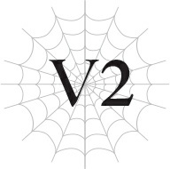

# Chương V2: Vận rủi là một điều nực cười
*(Misfortune Is a Funny Thing)*

---

Cô ta hẳn là bị điên rồi, đúng không?

Ý tôi là, tôi đã nghi ngờ điều đó từ lâu, nhưng giờ thì tôi chắc chắn rồi.

Cô ta có hơi—không, phải là cực kỳ tách biệt khỏi nhân tính mới đúng.

Tất nhiên, tôi đang nói về White, người hiện đang nhìn tôi với vẻ mặt thực sự hoang mang.

Bạn thấy đấy, cô ta vừa đưa ra một yêu cầu hoàn toàn bất khả thi đối với tôi.

Ấy thế mà, cô ta lại rõ ràng không hiểu tại sao tôi không chịu làm theo.

Đến cả tôi cũng không thể kiềm chế nổi cơn giận.

“Tất nhiên là không thể nào rồi! Tại sao tôi lại phải tự dùng ma pháp tấn công lên chính mình chứ?!”

Đúng vậy, yêu cầu vô lý của cô ta là bắt tôi tự làm tổn thương mình bằng ma pháp.

Hơn nữa, còn phải làm thế cho đến khi gần cạn MP mới thôi.

Đã hơn một tháng trôi qua kể từ khi chuyến hành trình này bắt đầu.

Trong khoảng thời gian đó, các chỉ số và kỹ năng của tôi đã tăng vọt với tốc độ đáng kinh ngạc dưới sự huấn luyện của White, và giờ cô ta đang yêu cầu tôi thực hiện bước tiếp theo trong cái chế độ huấn luyện của mình.

Cô ta thậm chí còn thị phạm bằng cách tự tấn công mình bằng Ma pháp Hắc ám.

Một thứ trông giống như tia sét đen đánh thẳng vào cơ thể cô ta, nhưng White thậm chí còn không hề phản ứng.

Trông cô ta bình thản đến mức tôi cứ ngỡ nó không đau đớn gì, thế nên tôi đã đưa tay ra chạm vào tia sét đó.

Trong khoảnh khắc đó, trước sự kinh hoàng tột độ của tôi, bàn tay tôi bay mất dạng.

Đúng vậy. Bàn tay của tôi. Đã rụng ra.

Bạn có hiểu tôi đang nói gì không?

Ngay khi vừa chạm vào tia sét, tầm nhìn của tôi tối sầm lại, và điều tiếp theo tôi nhận ra là bàn tay mình không còn dính vào cổ tay nữa.

Tôi chưa bao giờ ngất đi vì nỗi sợ hãi tột cùng như thế, cả ở kiếp này lẫn kiếp trước.

Khi tôi tỉnh lại, khuôn mặt tôi đã lem nhem nước mắt nước mũi, và Merazophis đang ôm chặt lấy tôi.

Còn bàn tay bị mất của tôi đã trở lại đúng vị trí của nó.

Tôi đoán nó đã được chữa trị ngay lập tức bằng Ma pháp Trị liệu, nhưng lúc đó tôi đã quá hoảng loạn nên không nhận ra.

Ngay cả khi đã lấy lại được bình tĩnh, tôi vẫn không thể ngừng khóc, và Merazophis đã phải vỗ về ôm tôi vào lòng thêm vài phút nữa.

Khi tôi nhận ra quần áo của Merazophis giờ đã ướt đẫm nước mắt nước mũi của mình, tôi chỉ muốn chết quách cho xong.

Và ngay khi tôi vừa mới bình tĩnh lại, White cất lời, hoàn toàn phớt lờ bầu không khí xung quanh.

“Được rồi, giờ nhóc làm đi.”

Tôi sẽ không làm thế đâu!

Việc đó… việc đó khác gì bảo tôi đi chết đi đâu chứ.

Sao cô ta có thể yêu cầu điều đó một cách thản nhiên như vậy?

Lời giải thích duy nhất tôi có thể nghĩ ra là cô ta bị điên rồi.

Vậy mà, cô ta lại dám nghiêng đầu nhìn tôi như thể đang thắc mắc tại sao tôi lại phản đối.

Khuôn mặt cô ta hầu như không bao giờ thay đổi sắc thái, nhưng cô ta vẫn truyền tải được một chút cảm xúc của mình qua những cử chỉ như thế này. Ở thế giới cũ cô ta cũng thường làm vậy.

Cứ như thể cô ta không còn cách nào khác để biểu lộ cảm xúc của mình vậy.

Bình thường thì hành động đó trông sẽ có vẻ giả tạo, nhưng không hiểu sao khi White làm vậy, trông nó lại có phần cuốn hút. Người đẹp đúng là luôn may mắn mà.

Sau khi suy ngẫm về phản ứng của tôi, White làm tư thế giống như bức tượng Nhà suy tưởng.

Ngay lập tức, một cảm giác khó chịu ập đến khắp cơ thể tôi.

Giờ tôi đã biết đó là cảm giác khi bị Thẩm định; tôi đã cảm nhận nó khá thường xuyên kể từ khi chuyến hành trình này bắt đầu.

Bởi vì điều đó có nghĩa là người khác đang đọc chỉ số và thông tin cá nhân của bạn, nên cảm thấy kỳ lạ cũng là điều tự nhiên thôi.

Tôi nghĩ White đang muốn kiểm tra xem liệu tôi có thực sự đủ khả năng thực hiện điều cô ta muốn hay không.

Sau đó, có lẽ đã đi đến kết luận rằng tôi hoàn toàn có thể làm được, cô ta khẽ nghiêng đầu một chút, vẫn giữ nguyên tư thế Nhà suy tưởng.

Cô ta không hiểu gì cả.

Việc tôi có đủ khả năng thể chất để làm và việc tôi có thực sự tự nguyện làm hay không là hai chuyện hoàn toàn khác nhau.

Ý tôi là, ai cũng có thể nhảy xuống từ một vách đá, đúng không?

Nhưng điều đó không có nghĩa là hầu hết mọi người sẽ làm vậy chỉ vì có kẻ bảo họ làm.

Những gì White đang yêu cầu cũng chẳng khác là bao, nhưng cô ta không thể hiểu nổi tại sao tôi lại từ chối.

Cô ta có vấn đề rồi.

Tôi chắc chắn chẳng thích thú gì khi cô ta huấn luyện tôi bằng cách dắt tôi đi bằng tơ nhện của mình, nhưng tôi vẫn chấp nhận vì việc đó có lý do tương đối chính đáng.

Mặc dù vậy, cũng chẳng phải White là người nói cho tôi biết lý do đó. Cô Ariel đã phải giải thích cho tôi thay cô ta.

White thà cứ ép tôi làm mà không cần giải thích, hoặc thị phạm một lần rồi ra lệnh cho tôi làm y hệt, giống như lần này vậy.

Dù bằng cách nào, cô ta cũng không bao giờ giải thích tính logic đằng sau những yêu cầu của mình.

“Nghe này, White. Ta nghĩ lần này cô phải giải thích đi, chứ không là con bé không chịu làm đâu đấy, được chứ?”

Như thường lệ, cô Ariel lại can thiệp để nói lý lẽ với cô ta.

Nhưng White không trả lời hay giải thích gì cả.

“Ôi trời, được rồi. Vậy để ta giải thích cho. Việc tự tấn công bản thân bằng Ma pháp Tấn công là nhằm rèn luyện cả kỹ năng ma pháp lẫn kỹ năng kháng tính của cháu. Kỹ năng ma pháp của cháu sẽ tăng lên vì cháu là người niệm phép, còn kỹ năng kháng tính của cháu sẽ tăng lên vì cháu phải chịu đựng đòn đánh. Một mũi tên trúng hai con nhạn đúng không nào? Tất nhiên, về mặt lý thuyết thì chỉ số kháng tính của cháu vẫn sẽ tăng lên khi cháu sử dụng ma pháp hoặc các kỹ năng khác thuộc hệ tương ứng, nhưng lượng tăng đó thực sự siêu nhỏ luôn, thế nên việc chủ động nâng cả hai cùng lúc là hoàn toàn hợp lý. Mặc dù nói là vậy, nhưng hầu hết mọi người không điên đến mức tự làm tổn thương mình để huấn luyện đâu.”

Nhờ sự giải thích của cô Ariel, giờ tôi đã hiểu được ý nghĩa của bài huấn luyện.

Nhưng đúng như cô ấy nói, tôi nghi ngờ việc có người bình thường nào lại điên rồ đến mức đi thử trò này.

Tự gây ra vết thương nghiêm trọng, suýt chết chỉ để nâng cao kỹ năng kháng tính nhằm giảm sát thương nhận vào? Thế chẳng phải là đặt xe trước ngựa sao?

“À, lời giải thích đó vẫn chưa đủ thuyết phục cháu đúng không Sophia? Ta chắc chắn cháu đang tự hỏi tại sao người ta lại phải mạo hiểm mạng sống của mình chỉ để tăng kỹ năng. Nhưng chuyện lúc nãy xảy ra chỉ là vì ma pháp của White quá mạnh mà thôi—bình thường cháu đâu cần phải dùng đòn tấn công dữ dội như thế. Vì cháu chính là người niệm phép, cháu thực sự có thể điều chỉnh nó mạnh hay yếu tùy ý mình mà.”

Mắt tôi mở to khi nghe thấy điều đó.

Khi tôi suy ngẫm về những lời cô Ariel nói trong chốc lát, đồng thời nghĩ đến uy lực ma pháp của chính mình, mọi chuyện cuối cùng cũng sáng tỏ.

Đúng thế chứ. Không phải là tôi thực sự phải sử dụng ma pháp mạnh đến mức có thể thổi bay cả bàn tay của mình như lúc nãy.

Thực ra, ngay từ đầu tôi còn chẳng có khả năng làm được điều đó nữa là.

Và ngay cả khi tôi có thể, tất nhiên tôi cũng không điên mà dùng nó lên chính mình.

Hóa ra suốt thời gian qua tôi đã tự hiểu lầm.

Vậy nên tất cả những gì tôi cần làm chỉ là sử dụng ma pháp đủ yếu để bản thân có thể chịu đựng được, đúng không?

Khi cuối cùng tôi cũng ngộ ra điều đó, mọi sự hoảng loạn trước đây của tôi đột nhiên trông thật thảm hại.

Chuyện đơn giản như thế, vậy mà tôi lại cứ luôn miệng kêu ca rằng mình không làm được.

Chẳng trách White cứ nghiêng đầu nhìn tôi!

Tôi xấu hổ quá đi mất!

“Tôi xin lỗi.”

Tôi đã làm ầm ĩ lên chỉ vì một giả định sai lầm. Ít nhất thì tôi cũng nên xin lỗi một câu.

“Không đâu, ta không thể trách cháu được sau những gì đã xảy ra, đặc biệt là khi White chẳng thèm giải thích lấy một lời. Ít ra cô ta cũng nên đợi cháu bình tĩnh lại một chút rồi mới tiếp tục chứ. Nhưng cô ta thực sự không biết cách cư xử khéo léo như vậy đâu.”

Cô Ariel lườm nhẹ White, người có vẻ hơi chùn lại một chút.

Có lẽ cô ta thực sự cảm thấy có lỗi chăng?

Tôi cứ ngỡ cô ta có khi sẽ xin lỗi vì đã thổi bay bàn tay của tôi và mọi chuyện, nhưng cuối cùng, White vẫn không hề hé răng nửa lời.

Chuyến hành trình của chúng tôi có vẻ đang diễn ra suôn sẻ.

Dù nói vậy, đích đến của chúng tôi, thủ đô của Sariella, vẫn còn rất xa.

Hạt Keren, nơi chúng tôi từng sống, nằm ở tận rìa biên giới Sariella.

Thủ đô nằm ở khoảng giữa bản đồ, nhưng Sariella là một quốc gia khá rộng lớn, thế nên tất nhiên đó là một khoảng cách vô cùng đáng kể.

Và vì cả nhóm phải đi theo tốc độ của tôi, nên chúng tôi không thể di chuyển nhanh được.

Bằng cách nào đó tôi vẫn có thể đi bộ nhờ vào sức mạnh thần kỳ của các chỉ số, nhưng điều đó không giúp đôi chân tôi dài thêm chút nào.

Lẽ tự nhiên, quãng đường tôi có thể đi được ngắn hơn người lớn rất nhiều.

Đã thế, vì phải tránh tai mắt của người khác, chúng tôi toàn băng qua những ngọn núi hiểm trở, những khu rừng rậm rạp, chứ không đi trên những con đường bằng phẳng, dễ đi.

Tôi thậm chí đã quen với việc ngủ ngoài trời, mặc dù thỉnh thoảng chúng tôi cũng được dừng chân ở một thị trấn.

Thế nhưng không hiểu vì sao, mỗi lần chúng tôi ghé qua một thị trấn, Merazophis trông luôn có vẻ phiền muộn.

Tôi đã gặng hỏi anh ấy vài lần xem có chuyện gì, nhưng anh ấy chỉ luôn bảo rằng “mọi chuyện vẫn ổn”.

Tôi chắc chắn anh ấy chỉ không muốn tôi phải lo lắng, nhưng điều đó lại càng khiến tôi khẳng định chắc chắn rằng thực sự có chuyện gì đó bất ổn.

Tôi ước gì anh ấy sẽ tâm sự với tôi về chuyện đó, nhưng Merazophis luôn cảm thấy có nghĩa vụ phải bảo vệ tôi mọi lúc. Anh ấy không muốn làm phiền “chủ nhân” của mình bằng những rắc rối cá nhân, thế nên thay vào đó, anh ấy cứ dồn nén tất cả trong lòng.

Nhưng nhìn anh ấy phải chịu đựng một mình như thế vẫn khiến tôi bận lòng...

Chẳng lẽ không có việc gì tôi có thể làm cho Merazophis sao?

Anh ấy đã giúp đỡ tôi nhiều đến thế, tôi thực sự muốn báo đáp anh ấy dù chỉ là một chút.

Nếu không có Merazophis, tôi chắc chắn mình đã tiêu đời từ lâu rồi.

Tôi đang nói về cả mặt thể xác lẫn tinh thần.

Nếu Merazophis không liều mạng để bảo vệ tôi, tôi đã bị gã elf Potimas sát hại vào cái ngày hôm đó rồi.

Và ngay cả sau khi biết tôi là một người tái sinh và là ma cà rồng, anh ấy vẫn tiếp tục đặt tôi lên hàng đầu trong mọi việc anh ấy làm.

Tôi thậm chí không thể diễn tả được điều đó đã giúp ích cho tôi nhiều đến nhường nào.

Merazophis là lý do duy nhất giúp tôi có thể vượt qua hoàn cảnh này mà không bị sụp đổ.

Nhờ có anh ấy, tôi đã có thể chấp nhận bản chất thực tế của thế giới này mà không tìm cách trốn chạy.

Khi mới đầu thai đến đây, tôi tự nhủ với bản thân rằng thế giới này chỉ là một giấc mơ hay thứ gì đó tương tự.

Dù sao thì nơi này rõ ràng không phải là Nhật Bản, lại còn có những thứ kỳ lạ như “chỉ số”, và trên hết, tôi lại là một ma cà rồng.

Không dễ để chấp nhận rằng đây chính là hiện thực mới của mình.

Chắc chắn việc bản thân cũ của tôi bị xóa sạch và bị buộc phải bắt đầu lại từ đầu trong thế giới mới kỳ dị này chỉ là một giấc mơ tồi tệ.

Nhưng dù thời gian trôi qua bao lâu đi nữa, tôi vẫn không tỉnh lại, và tôi buộc phải thừa nhận rằng đây là hiện thực.

Tôi đã thề sẽ bắt đầu một cuộc sống mới ở thế giới mới này, cùng với cha mẹ mới của mình.

Và rồi cả hai người họ đều qua đời.

Ngay sau khi tôi vừa thề sẽ gạt bỏ cảm xúc về cuộc sống cũ để tiến về phía trước, tôi lại mất đi gần như tất cả một lần nữa.

Lại một lần reset ngay sau khi vừa được reset.

Chẳng có gì ngạc nhiên khi lần này tôi thực sự muốn chạy trốn khỏi hiện thực.

Nhưng chính Merazophis là người đã cứu tôi khỏi điều đó.

Tôi đã mất đi tất cả mọi thứ khác, nhưng Merazophis vẫn ở bên cạnh tôi.

Anh ấy đã trở thành bằng chứng cho thấy đã từng có khoảng thời gian tôi sống trong dinh thự đó và được cha mẹ yêu thương, bất kể khoảng thời gian đó ngắn ngủi đến mức nào.

Bởi vì anh ấy ở đây để nhắc nhở tôi về điều đó, tôi mới có thể tiếp tục đối mặt với hiện thực.

Merazophis cứu rỗi tôi chỉ đơn giản bằng việc anh ấy tồn tại.

Tôi không bao giờ có thể cảm ơn anh ấy cho đủ.

Đó là lý do tại sao tôi muốn anh ấy gạt bỏ những lo lắng về vai trò của chúng tôi và để tôi giúp đỡ anh ấy.

“Nhưng bất kể cháu có hỏi bao nhiêu lần đi nữa, anh ấy cũng không chịu trả lời. Cô có biết điều gì đang làm phiền Merazophis không, cô Ariel?”

“Ư… Hừm.”

Tôi đang xin lời khuyên từ cô Ariel.

Lúc này đang là giữa trưa, ánh mặt trời đang chói chang.

Nhưng chỉ có cô Ariel và tôi là còn thức.

Là ma cà rồng, Merazophis và tôi sinh hoạt về đêm, thế nên ngoại trừ khi ghé qua một thị trấn, chúng tôi đương nhiên bắt đầu thực hiện hầu hết hành trình vào ban đêm.

Vì vậy, Merazophis hiện đang nghỉ ngơi trong bóng râm.

White cũng đang nghỉ ngơi trong một cái kén làm bằng tơ trắng.

Hình như đó là một “ngôi nhà đơn sơ” làm từ tơ nhện.

White có kỹ năng Vô hiệu Trạng thái bất thường, bao gồm cả Vô hiệu Kiệt sức, nên về mặt lý thuyết cô ta không cần phải ngủ.

Tuy nhiên, điều đó thực chất chỉ có nghĩa là việc không ngủ không gây ra bất kỳ tác động tiêu cực nào đối với cô ta; cô ta vẫn nhận được những lợi ích của giấc ngủ, chẳng hạn như phục hồi thể chất.

Trên hết, ngủ vẫn mang lại cảm giác dễ chịu, nên theo tôi thấy thì cô ta cứ ngủ mỗi khi có hứng mà thôi.

Vì cả hai người họ đều đang ngủ, đây là cơ hội hoàn hảo để xin lời khuyên.

Tất nhiên, tôi không thể nói chuyện này trước mặt Merazophis, và tôi cũng không muốn White nghe thấy.

Hơn nữa, với cái kiểu im lặng và vô cảm của cô ta, tôi nghi ngờ việc cô ta có thể hiểu được một chủ đề tinh tế như thế này.

Dù cô Ariel có ngoại hình trẻ con, cô ấy lại sở hữu số tuổi đời không thể đong đếm, và cô ấy luôn chăm sóc chúng tôi như một người bề trên, thế nên tôi cảm thấy an tâm khi tham khảo ý kiến của cô ấy.

“Hừmmmm.”

Tuy nhiên, lần này cô ấy chỉ nhíu mày sau khi nghe câu hỏi của tôi chứ không đưa ra câu trả lời rõ ràng.

Có phải cô ấy không biết điều gì đang làm phiền Merazophis không?

Hay là cô ấy biết, nhưng chuyện đó quá nghiêm trọng nên cô ấy ngần ngại không muốn tiết lộ cho tôi?

“Cô Ariel, chuyện của Merazophis nghiêm trọng đến thế sao ạ?” tôi lo lắng hỏi.

“Ừ, ta đoán vậy,” cô ấy thẳng thắn trả lời. “Nhưng cũng không đến mức tính mạng của hắn gặp nguy hiểm hay gì đâu. Đó không phải là kiểu chuyện sẽ gây ra rắc rối ngay lập tức. Nhưng cũng không phải là chuyện có thể giải quyết ngay được đâu.”

Tôi thực sự không thể biết được cô ấy đang cố trấn an tôi hay là đang làm tôi lo lắng thêm nữa đây.

Sau một lúc im lặng, cô Ariel lại mở lời.

“Nói một cách thành thật nhất, cháu không thể làm gì để giúp hắn được đâu.”

Thật khó để tôi chấp nhận điều đó.

Nhưng tôi nghĩ cô Ariel thừa biết tôi sẽ cảm thấy khó chấp nhận khi nói vậy. Bình thường tôi rất hiếm khi nghe thấy cô ấy nói chuyện với giọng điệu kiên quyết như thế.

“Thực tế, nếu cháu cố xen vào, chuyện đó có thể chỉ làm cho mọi thứ trở nên phức tạp hơn mà thôi. Mà từ ‘có thể’ ở đây là ‘chắc chắn sẽ’ đấy. Thế nên ta hiểu cháu đang lo lắng, nhưng tất cả những gì cháu có thể làm lúc này chỉ là để cho hắn có không gian riêng.”

Tôi mà xen vào sẽ khiến mọi chuyện phức tạp hơn sao?

Thế nghĩa là sao chứ?

“Ta biết cháu sẽ thấy bực bội, nhưng việc tốt nhất cháu có thể làm cho hắn lúc này là không làm gì cả. Chĩa mũi vào chuyện đó chỉ tổ làm cho mọi thứ tồi tệ hơn thôi. Ta hiểu rằng khi thấy một người mình quan tâm đang đau khổ, cháu sẽ muốn giúp đỡ họ, nhưng đây là một tình huống mà cháu buộc phải giả vờ như không có chuyện gì xảy ra. Ta nghĩ việc cháu cư xử bình thường sẽ là điều tốt nhất cho Merazophis lúc này. Hắn rồi sẽ tự mình ngộ ra thôi, từng chút một, nên đừng lo lắng quá.”

Tôi không thực sự hiểu những gì cô Ariel đang nói.

Bởi vì tôi không biết điều gì đang làm phiền Merazophis nhiều đến thế, nên mọi chuyện nghe vô cùng mơ hồ.

Nhưng tôi nắm được ý chính mà cô ấy muốn ở tôi: đừng làm gì cả.

Tất nhiên, một phần trong tôi thực sự muốn phản đối điều đó, nhưng lời khẳng định của cô ấy rằng tôi sẽ chỉ làm mọi chuyện tồi tệ hơn đã khiến tôi phải chững lại.

Tôi muốn giúp đỡ, nhưng tôi lại chỉ khiến mọi chuyện thêm “phức tạp”.

Vậy nên tất cả những gì tôi có thể làm là giữ im lặng sao?

“Ít nhất cô có thể nói cho cháu biết điều gì đang khiến Merazophis phiền lòng đến thế không ạ? Làm ơn đi mà cô?”

Biết được lý do sẽ giúp tôi dễ dàng chấp nhận việc mình không thể giúp đỡ hơn.

“Xin lỗi nhé, nhưng ta nghĩ cháu tốt nhất là không nên biết thì hơn, thế nên là... không.”

Nghe cứ như thể cô ấy đang trêu chọc tôi vậy.

“Làm ơn đừng đùa giỡn về chuyện này chứ cô!”

Giọng điệu của tôi truyền qua Thần giao cách cảm có phần giận dữ, nhưng câu trả lời của cô ấy lại nghiêm túc đến bất ngờ.

“Ta không có ý đùa đâu,” cô ấy nói một cách đơn giản. “Chỉ là thế này sẽ tốt hơn thôi. Như ta đã nói trước đây, tốt nhất là cháu đừng can dự vào chuyện này, vì lợi ích của cả Merazophis lẫn chính bản thân cháu.”

Vì lợi ích của chính tôi sao?

“Đó là tất cả những gì ta có thể nói với cháu. Ta chắc chắn điều này không làm cháu dễ chịu hơn chút nào, nhưng hiện tại cháu phải tin tưởng Merazophis và kiên nhẫn chờ đợi.”

Mặc cho sự bướng bỉnh của tôi, cô Ariel có vẻ không muốn tiết lộ thêm bất cứ điều gì nữa.

“Hay là cháu không tin tưởng Merazophis, tiểu thư Sophia nhỏ bé?”

…Thế này thì chơi bẩn quá.

Cô Ariel đôi khi có thể rất không công bằng.

Tôi không biết có phải là do tuổi tác của cô ấy hay không, nhưng cô ấy có xu hướng nói những điều theo cách khiến người ta không thể nào tranh cãi lại được.

“Tất nhiên là cháu tin rồi,” tôi miễn cưỡng trả lời.

Chứ tôi còn có thể nói gì khác được đây?

Tôi thực sự tin tưởng Merazophis mà.

Vì cô ấy đã nói thế, có vẻ như tôi thực sự không còn lựa chọn nào khác ngoài việc tin tưởng anh ấy và chờ đợi.

“Nghe vậy thì tốt rồi. Nói thật, ta cũng chẳng biết phải làm thế nào nếu cháu cứ liên tục mè nheo đòi ta nói cho biết nữa. Tất nhiên là ta không muốn nói với cháu rồi, nhưng cháu biết đấy, cháu cũng có khả năng giao tiếp vụng về gần bằng White khi đối nhân xử thế với người khác mà. Ta e rằng nếu cháu biết được, cháu sẽ không thể giấu nổi biểu cảm của mình đâu, và điều đó chắc chắn sẽ khiến mọi thứ trở nên gượng gạo giữa cháu và Merazophis cho mà xem.”

Thái độ nghiêm túc của cô ấy lập tức biến mất, và cô Ariel cười khúc khích trêu chọc tôi.

“Làm ơn đừng so sánh cháu với White. Vấn đề của cô ta vượt xa cái mức ‘vụng về’ rồi, cô không nghĩ thế sao?” Có chút khó chịu, tôi buột miệng cằn nhằn trả lời.

Đúng là chẳng ai bảo tôi là người giỏi giao tiếp.

Nhưng tôi không giống như White, người ngay từ đầu đã chẳng thèm bỏ chút nỗ lực nào để tương tác với người khác.

Tôi đã từng cố gắng kết nối với mọi người; chỉ là nó chưa bao giờ thành công vì vẻ ngoài của tôi.

“Thế à? Hừm. Ta đã tự hỏi điều này một thời gian rồi... Tại sao cháu lại tỏ ra thù địch với White nhiều đến thế?”

Cô Ariel nghiêng đầu nhìn tôi, tư thế đó trông chẳng khác gì kiểu của White mỗi khi cô ta không hiểu chuyện gì.

“Ý cô ‘tại sao’ là sao ạ? Chẳng phải chuyện đó quá hiển nhiên rồi sao?”

Cô Ariel chỉ nghiêng đầu sâu hơn nữa.

“Ờ, ta không nghĩ nó hiển nhiên như cháu nghĩ đâu. Ý ta là, White đã cứu mạng cháu đúng không? Tại sao cháu lại ghét cô ta đến vậy chứ?”

Điều đó khiến tôi phải chững lại và suy ngẫm.

Cô ấy nói đúng.

White thực sự đã cứu mạng tôi.

Thế nhưng thay vì tỏ lòng biết ơn, tôi lại chỉ căm ghét cô ta.

Dưới góc nhìn của cô Ariel, tôi mới là kẻ vô lý ở đây!

“Nhưng mà, thì, cô ta đã đối xử rất tệ với cháu suốt cả chuyến hành trình này…”

“Nhưng cô ta đâu có làm vậy vô cớ. Chúng ta không biết chuyện gì có thể xảy ra trong tương lai, thế nên cô ta đang cố rèn luyện chỉ số và kỹ năng cho cháu trong lúc chúng ta còn có cơ hội. Ý ta là, đúng vậy, phương pháp Spartan của cô ta hơi quá đà một chút thật, nhưng ý định của cô ta vẫn hoàn toàn tốt đẹp—cô ta chỉ hơi lập dị một tí thôi. Cháu cũng biết điều đó mà, đúng không? Chẳng có lý do gì để cháu cứ khăng khăng chống đối cô ta như thế cả.”

Cô Ariel lập tức bẻ gãy lời biện hộ của tôi không chút do dự.

“Ta cũng nghĩ việc huấn luyện của cô ta là một ý kiến hay. Ở thế giới này có nhiều cuộc chiến hơn hẳn nơi các cháu từng sống. Việc bồi bổ sức mạnh từ bây giờ là một bước đi đúng đắn. Đó là lý do tại sao White quyết định huấn luyện cháu và ta đã không ngăn cản cô ta. Thành thật mà nói, ta nghĩ điều đó khiến White tốt bụng và chu đáo hơn ta nhiều đấy.”

Chắc chắn không phải như thế rồi.

Tôi muốn nói ra điều đó, nhưng vẫn kịp nuốt những lời ấy vào trong.

Liệu đó có thực sự là những gì White đang nghĩ?

Nếu tôi nhìn nhận lại một cách khách quan mọi chuyện White đã làm, đúng như những gì cô Ariel nói, thì có vẻ như cô ta thực sự chỉ đang cố gắng giúp đỡ tôi.

Các chỉ số và kỹ năng của tôi thực sự đã tăng trưởng với tốc độ khó tin.

Nhưng bằng cách nào đó, tôi vẫn không thể chấp nhận được.

“Mặc dù vậy, ta không phủ nhận chuyện đó rất khó khăn với cháu. Có lẽ nó giống như câu chuyện này chăng? Kiểu như người mẹ nghiêm khắc với con mình để giúp đứa trẻ trở nên mạnh mẽ hơn vậy.”

“Đừng có so sánh cô ta với mẹ của cháu!” tôi buột miệng hét lên qua Thần giao cách cảm.

Người đầu tiên xuất hiện trong tâm trí tôi là mẹ ở kiếp trước.

Và tiếp theo là người mẹ ở kiếp này.

Cả hai đều là những con người đáng kính.

Tôi không thể chịu nổi ý nghĩ coi White ngang hàng với họ.

“Xin lỗi, xin lỗi nhé. Ví dụ tồi thật,” cô Ariel ngoan ngoãn xin lỗi. “Nhưng ta thực sự nghĩ việc cháu bài xích người đã cứu mạng mình có phần hơi tàn nhẫn đấy. Loại người nào lại đi làm chuyện như thế chứ?”

Những lời đó đánh vào tôi như một cái tát trời giáng.

Một phần là vì tôi chưa từng nghe thấy giọng điệu của cô Ariel lạnh lùng đến thế bao giờ.

Nhưng trên hết, cô ấy nói quá đúng khiến tôi không còn cách nào khác ngoài việc thừa nhận rằng mình mới là người sai.

Thực ra cũng chẳng cần phải suy nghĩ sâu xa gì mới nhận ra điều đó, đúng không?

Dưới một góc nhìn khách quan, việc công khai ghét bỏ người đã cứu mạng mình chỉ khiến tôi trông có vẻ vô cùng vô ơn.

Giống như một kẻ tồi tệ vậy.

Tôi đã tranh cãi với cô Ariel vì tôi không muốn tự thừa nhận với bản thân điều đó, nhưng việc này lại càng khiến tôi trông thảm hại hơn.

Người ta thường thần tượng hóa người đã cứu mạng mình, chứ làm gì có ai lại đi căm ghét họ bao giờ?

Vậy tại sao suốt thời gian qua tôi lại ôm giữ lòng thù hận lớn đến thế đối với cô ta?

Tôi đã biết câu trả lời.

“Cháu xin lỗi.”

“Ta không chắc cháu đang xin lỗi vì điều gì, nhưng chẳng phải cháu nên nói lời đó với White chứ không phải ta sao?”

“Vâng, có lẽ vậy…”

Tôi phải thừa nhận thôi.

Lý do nực cười cho sự căm ghét của tôi đối với White.

“Cháu đã… ghen tị.”

Đó là lý do duy nhất khiến tôi ghét cô ta đến vậy.

Tôi đã ghen tị.

Không, hiện tại tôi vẫn ghen tị.

Ở kiếp trước, tôi đã cực kỳ đố kỵ với vẻ ngoài xinh đẹp lộng lẫy của Wakaba Hiiro.

Và tôi đã mang theo lòng đố kỵ đó sang thế giới này, khiến tôi căm ghét White, mặc dù cô ta đã cứu mạng mình.

Chỉ có thế thôi. Một lý do đơn giản nhưng thật tồi tệ.

Cũng chẳng phải Wakaba Hiiro đã từng làm điều gì có lỗi với tôi.

Ngoại trừ việc học cùng một lớp, chúng tôi hầu như chẳng có mối liên hệ nào cả.

Ấy vậy mà tôi lại ôm giữ lòng đố kỵ và căm ghét một chiều đối với cô ta.

Và khi tôi được tái sinh, ngay lúc tôi vừa thề sẽ lật sang trang mới và bắt đầu một cuộc đời hoàn toàn mới theo đúng nghĩa đen, tôi lại được đoàn tụ với chính người mà tôi ghét bỏ nhiều nhất.

Hơn nữa, lại đúng vào thời điểm tôi đang mất đi tất cả mọi thứ mình có.

Chưa kể, cô ta còn là một trong những chất xúc tác chính dẫn đến trận chiến cướp đi tất cả mọi thứ của tôi, đúng không?

Cảm xúc từ kiếp trước của tôi và cơn thịnh nộ khi mất đi tất cả.

Tôi đã trút tất cả lên kẻ thế mạng gần nhất.

Cho dù người đó có là ân nhân cứu mạng của mình đi chăng nữa.

Tôi đã mất sạch tất cả, vậy mà White vẫn sở hữu vẻ đẹp như kiếp trước, đồng thời lại có được sức mạnh đáng kinh ngạc.

Điều đó thật không công bằng chút nào.

Nhưng dưới góc nhìn của White, chắc hẳn trông tôi giống như một kẻ đang giận cá chém thớt vô cớ.

“Ngay cả sau khi được sinh ra một lần nữa, cháu vẫn là một kẻ tồi tệ.”

Từng chút một, tôi kể cho cô Ariel nghe về cuộc sống kiếp trước của mình.

Bởi vì tôi chỉ nói ra bất cứ điều gì nảy ra trong đầu, tôi chắc chắn nó khá lộn xộn và khó theo dõi.

Nhưng cô Ariel vẫn im lặng lắng nghe cho đến khi tôi kết thúc.

Có lẽ đó là lý do tại sao tôi vẫn ôm giữ hy vọng rằng cô ấy sẽ dành cho tôi những lời an ủi.

Nhưng lời nhận xét cay nghiệt thốt ra thay vào đó đã khiến tôi thực sự sốc.

“Sophia, cháu bị ngốc à?”

“Dạ?!”

“Nói đúng hơn là cháu có vẻ chẳng chịu đặt mình vào hoàn cảnh của người khác chút nào cả. Mặc dù đáng ra ta phải biết trước điều đó khi thấy cháu thậm chí còn chẳng biết Merazophis đang phiền lòng vì chuyện gì rồi.”

Cô Ariel nhìn xuống tôi giống như một giáo viên đang nhìn một học trò kém cỏi.

“Cháu thực sự chỉ nghĩ cho bản thân mình thôi, Sophia ạ. Cháu luôn nghĩ mình là kẻ chịu nhiều đau khổ nhất trên đời, đó chính là lý do cháu không hề nghĩ đến người khác. Ngay cả lúc này đây. Cháu đang sướt mướt tự trách rằng mình tồi tệ hay thế này thế nọ, nhưng cái kiểu tự ghét bỏ giả tạo đó thực chất chỉ là một cách để lảng tránh trách nhiệm cho hành động của mình mà thôi. Cháu nghĩ rằng chỉ cần tỏ ra hối lỗi là cháu không cần phải làm gì khác nữa. Cháu đang cố gắng tự biện hộ cho mình bằng cách đó, đúng không?”

Lời đánh giá của cô Ariel vô cùng tàn nhẫn.

Những lời nói của cô ấy hoàn toàn đánh gục tôi. Tôi chỉ biết bàng hoàng đứng trân trối nhìn cô ấy, thậm chí còn không buồn tìm cách bào chữa cho mình.

“Như thế thì đúng là tồi tệ thật đấy, đúng như cháu tự nhận.”

Khuôn mặt tôi tái mét khi cô ấy tung ra đòn giáng cuối cùng.

Nếu cô Ariel ghét tôi, tôi tiêu đời rồi.

Nếu cô ấy bỏ mặc Merazophis và tôi, chúng tôi biết phải làm sao đây?

Tôi đã đối xử quá tệ bạc với White, tôi nghi ngờ việc cô ta sẽ chịu giúp đỡ chúng tôi.

Chỉ đến lúc đó tôi mới thực sự nhận ra.

Nghĩ lại thì, tôi thực sự rất tồi tệ.

Dù muốn hay không, cuối cùng tôi cũng phải thừa nhận rằng mọi điều cô Ariel nói đều là sự thật.

Bây giờ tôi thực sự bắt đầu ghét bỏ chính mình, chứ không phải theo kiểu giả tạo mà cô Ariel vừa vạch trần một cách chính xác nữa.

“Mặc dù vậy, điều đó cũng không thay đổi được sự thật là cháu đã phải trải qua những hoàn cảnh vô cùng kinh khủng. Đừng lo—không có chuyện ta bỏ mặc các cháu vào lúc này đâu.”

Bằng cách nào đó, cô Ariel đoán được nỗi lo sợ của tôi và lên tiếng trấn an.

Tôi thở phào nhẹ nhõm nhưng cũng đồng thời tự thấy ghê tởm bản thân khi suy nghĩa của mình lại dễ bị đọc vị đến thế.

Chắc là suy nghĩ của tôi nông cạn đến mức ai cũng có thể thấu suốt được.

Cô Ariel thở dài. “Có lẽ ta hơi nặng lời quá rồi nhỉ? Cháu vẫn chỉ là một đứa trẻ thôi mà. Xem ra bản thân ta đôi lúc cũng còn hơi trẻ con.”

Có vẻ như nhận thấy tôi đã thực sự suy sụp, cô ấy ngượng ngùng gãi đầu.

Một đứa trẻ ư? Tôi đoán mình đúng là một đứa trẻ khi so sánh với cô Ariel, và về mặt thể xác thì tôi vẫn là một em bé sơ sinh, nhưng việc nghe thấy điều đó nói ra thành lời vẫn khiến tôi có chút đau lòng.

Cứ như thể cô ấy không coi tôi như một cá thể độc lập có suy nghĩ riêng vậy.

Đối với cô Ariel, có lẽ tôi chẳng khác gì một đứa trẻ ngỗ nghịch, phiền phức.

“Việc đặt bản thân lên hàng đầu không hẳn là xấu đâu, cháu biết đấy. Thực ra, ta nghĩ hầu hết mọi người đều như thế cả thôi. Nhưng cháu không được phép để mình quá ích kỷ đến mức coi thường người khác. Tất nhiên là trên đời này chắc chắn sẽ có những kẻ cháu không ưa, nhưng cách hành xử của một người trưởng thành là hãy kiên nhẫn chịu đựng và cố gắng hòa hợp với nhau. Vậy nên cháu thử nhìn nhận lại mối quan hệ giữa mình với White dưới góc nhìn khách quan xem sao? Mặc dù ta cũng chẳng có tư cách nói điều đó lắm, vì bản thân mối quan hệ giữa ta với cô ta cũng không được suôn sẻ cho lắm.”

Đoạn cuối cô ấy nói với giọng điệu có phần tự trào, nhưng những phần còn lại nghe chẳng khác nào một lời giáo huấn.

Tôi ngoan ngoãn xem xét lại mối quan hệ của mình với White mà không để cảm xúc chen vào.

Ở thế giới cũ, thành thật mà nói chúng tôi chẳng có mối quan hệ nào đáng kể để nhắc tới.

Lần tương tác đầu tiên của chúng tôi ở thế giới này là khi cô ta cứu tôi khỏi đám cướp tấn công.

Sau đó, cô ta đã xây một cái tổ gần thị trấn nơi tôi sống và ở lại đó.

Mặc dù bản thân cô ta chưa từng nói ra, nhưng tôi nghi ngờ cô ta làm vậy là để bảo vệ tôi khỏi tộc Elf. Chuyện này cô Ariel cũng từng đưa ra nhận định tương tự rồi.

Và quan trọng nhất, khi tên Elf tên là Potimas chuẩn bị sát hại tôi, chính cô ta đã cứu mạng tôi.

Và ngay cả bây giờ, cô ta vẫn đồng hành cùng tôi và bảo vệ an toàn cho tôi.

…Suốt thời gian qua, cô ta chẳng làm gì khác ngoài việc liên tục giúp đỡ tôi.

Còn tôi thì chưa từng làm bất cứ điều gì để đền đáp.

Không kịp nghĩ ngợi gì, tôi buột miệng hỏi câu hỏi đang vướng bận trong lòng.

“Tại sao cô nghĩ White lại làm tất cả những điều đó cho cháu?”

“Ta không chắc nữa. Thành thật mà nói ta cũng không thực sự hiểu cô ta. Có thể cô ta có lý do nào đó đằng sau, hoặc cũng có thể chẳng có lý do gì cả.”

Giọng điệu trả lời của cô ấy có vẻ đùa cợt, nhưng dường như cô ấy thực sự không biết thật.

Nghĩ lại thì, suốt thời gian qua White đã làm mọi việc cho tôi mà không bao giờ mong đợi nhận lại bất cứ thứ gì.

Bất kể thái độ tồi tệ của tôi đối với cô ta.

Thực tế, sự tận tụy của cô ta lớn đến mức gần như đáng sợ.

Đúng y như những gì cô Ariel nói: Khi ai đó nhận được một loại dịch vụ miễn phí nào đó, họ không thể không nghi ngờ có động cơ thầm kín đằng sau.

Sự tử tế của White dành cho tôi quá đà đến mức tôi cũng tự hỏi động cơ của cô ta là gì.

Ngay cả cô Ariel cũng tự thừa nhận rằng lý do cô ấy đối xử tốt với Merazophis và tôi là vì White có vẻ quan tâm đến chúng tôi.

Tôi nghĩ lòng tốt thực sự của cô Ariel với tư cách là một con người cũng có liên quan một phần, nhưng cô ấy cũng không hề nói dối về chuyện đó.

Thực tế là White chính là lý do cô Ariel quyết định chăm sóc chúng tôi.

Nếu White không bận tâm đến chúng tôi, ngay cả một người tốt bụng như cô Ariel cũng có thể đã không nghĩ đến việc giúp đỡ.

Vậy thì tại sao ngay từ đầu White lại có vẻ quan tâm đến sự an nguy của chúng tôi nhiều đến thế?

Vì cuộc sống ở kiếp trước sao?

Liệu đó có phải là lý do đủ lớn để làm nhiều như thế này cho chúng tôi không?

Chúng tôi chẳng qua chỉ là bạn học cùng lớp. Tại sao cô ta lại phải làm tất cả những điều này cho một người mà cô ta hầu như chưa từng nói chuyện bao giờ?

Nếu vai trò của chúng tôi bị đảo ngược, tôi nghi ngờ việc mình sẽ làm điều tương tự.

Thực sự là tôi không thể.

Tôi sẽ không bao giờ mạo hiểm mạng sống để đối đầu với một đối thủ như Potimas chỉ vì một người mình hầu như không quen biết.

Nếu cô ta thực sự làm vậy chỉ đơn thuần vì lòng nhân hậu của mình...

Hừm, từ ‘thánh nhân’ lập tức hiện lên trong đầu tôi.

Đồng thời, tôi cũng nhớ lại rằng cô ta đã chữa trị bệnh tật và vết thương cho người dân trong thị trấn miễn phí và cuối cùng được họ tôn sùng.

Trước khi trở thành một Arachne, khi trông cô ta chẳng khác gì một con quái vật nhện, cô ta vẫn được người dân trong thị trấn chấp nhận và ngưỡng mộ.

Tất nhiên, việc họ tình cờ theo một tôn giáo thờ phụng loài nhện như Thần thú của Nữ thần có lẽ cũng có liên quan, nhưng tôi nghĩ tính người của White cũng đóng một vai trò lớn.

Tôi luôn nghĩ rằng ngoại hình là tất cả.

Nhưng nếu điều đó là đúng, làm sao White có thể được chấp nhận như thế?

Ở kiếp này lẫn kiếp trước, liệu White có thực sự được ngưỡng mộ chỉ vì vẻ bề ngoài không?

Không.

Ngoại trừ thế giới cũ ra, ở thế giới này, White vẫn được ngưỡng mộ ngay cả khi cô ta còn là một con quái vật nhện.

Cô ta chắc chắn không được chào đón nhờ vào vẻ ngoài của mình.

Chính tính cách và hành động của cô ta đã khiến người dân trong thị trấn công nhận và tôn sùng cô ta.

Tôi đã được hưởng lợi từ lòng tốt của cô ta suốt thời gian qua, thế mà tôi lại căm ghét và đố kỵ với cô ta chẳng vì lý do chính đáng nào.

Cô Ariel nói đúng. Tôi thực sự chỉ là một đứa trẻ ngốc nghếch.

“Cháu sẽ bắt đầu cố gắng thay đổi thái độ của mình kể từ bây giờ.”

“Ừ. Ta nghĩ đó là một ý kiến hay. Sự thay đổi kiểu đó không thể diễn ra trong một sớm một chiều được, đúng không? Cháu phải tập quen dần với nó theo thời gian thôi.”

Tôi thở phào nhẹ nhõm trước lời khẳng định của cô Ariel.

Tôi không thể thay đổi hoàn toàn ngay lập tức, nhưng tôi sẽ cố gắng cư xử tốt hơn với White từ bây giờ.

Tôi từng nghĩ sở hữu vẻ ngoài xinh đẹp đồng nghĩa với việc bạn là kẻ chiến thắng trong cuộc sống, nhưng dù vẻ ngoài của bạn có đẹp đẽ đến đâu đi chăng nữa, bạn sẽ luôn xấu xí nếu tâm hồn bên trong tồi tệ như vậy.

Tôi vẫn nghĩ những kẻ nói rằng họ không bận tâm đến ngoại hình là đang nói dối, nhưng bản thân tôi lại đi quá xa theo hướng ngược lại, chỉ quan tâm đến vẻ bề ngoài của người khác.

Nếu một người xinh đẹp cả về ngoại hình lẫn tâm hồn, đó mới là lúc họ thực sự tỏa sáng.

Nhưng trước đây tôi chưa bao giờ nhận ra điều đó.

Nếu tôi cứ tiếp tục sống mà không nhận thức được sự thật này, tôi chắc chắn mình sẽ chỉ ngày càng trở nên xấu xí hơn thôi.

“Cháu sẽ cố gắng trở thành kiểu người biết nghĩ cho người khác, giống như cô và White.”

“Ph-phải rồi…”

Không hiểu sao, nét mặt của cô Ariel bỗng trở nên kỳ lạ.

“White mà biết nghĩ cho người khác á? Ờ... Hừm? Nhưng mà, ngẫm lại tất cả những gì cô ta đã làm từ trước đến giờ... Hừm. Ta cũng không biết nữa.”

Cô ấy đang lầm bầm cái gì thế nhỉ?

“Ái chà. Ta chịu không hiểu nổi cô ta nữa! Nhưng theo như ta thấy, ta đoán cô ta giúp cháu chỉ đơn giản là vì cháu cũng là một người tái sinh mà thôi…”

“Nhưng liệu cô ta có thực sự đi xa đến mức này nếu đó là toàn bộ lý do không ạ?”

“Ai mà biết được? Cháu phải tự đi hỏi White mới biết được. À, nhưng mà ta không biết nữa, có lẽ lúc đó cô ta chỉ đang phấn khích chăng.”

“Phấn khích ạ? Về chuyện gì cơ?”

“Thì, cô ta vừa mới sống sót thoát khỏi địa ngục thì lại gặp được một người tái sinh đồng hương. Có lẽ cô ta đã quá phấn khích đến mức ra tay cứu cháu mà không kịp nghĩ ngợi nhiều đấy.”

Những mối nghi ngờ lướt qua tâm trí tôi khi tôi cố gắng hiểu những gì cô Ariel đang nói.

“White là một con quái vật nhện, cháu nhớ chứ? Và cô ta được sinh ra ở Mê cung Lớn Elroe, hầm ngục lớn nhất và nguy hiểm nhất trên thế giới. Cô ta đã phải chật vật hết hơi chỉ để sinh tồn ở một nơi như vậy. Cháu chưa từng tự hỏi làm thế nào ngay từ đầu cô ta lại trở nên mạnh mẽ đến thế sao?”

Nghĩ lại thì, tôi đoán điều đó quả thực có phần kỳ lạ.

“Ừm, nói một cách đơn giản, cô ta buộc phải trở nên mạnh mẽ nếu muốn sống sót. Không phải tự nhiên mà cô ta sinh ra đã có sẵn ngần ấy sức mạnh đâu. Cô ta cần mạnh lên để sinh tồn, thế nên cô ta đã làm bất cứ việc gì để đạt được mục tiêu đó. Thậm chí chấp nhận tự tấn công mình bằng ma pháp để tăng cường kỹ năng kháng tính. Không một người bình thường nào lại nghĩ ra trò đó, chứ đừng nói là thực sự bắt tay vào làm, nhưng cô ta đã phải làm những việc điên rồ như vậy nếu muốn sống sót trong đó. Chỉ có thế thôi.”

Tôi nhớ lại hình ảnh cô ta bị bao phủ bởi luồng ma pháp mạnh mẽ đến mức có thể thổi bay cả bàn tay của tôi.

Ý nghĩ đầu tiên của tôi lúc đó là cô ta bị điên rồi.

Nhưng sau đó, cô Ariel đã giải thích sự hiểu lầm của tôi, và tôi cảm thấy xấu hổ vì sai sót của mình.

Tuy nhiên, khi tôi thực sự tự mình thử nghiệm, quan điểm của tôi lại thay đổi một lần nữa.

Tôi biết mình đang nói tiền hậu bất nhất, nhưng tôi thực sự nghĩ rằng phương pháp huấn luyện đó hoàn toàn điên rồ.

Ngay cả việc tự dùng ma pháp yếu lên cơ thể cũng khiến tôi phải quằn quại trên mặt đất vì đau đớn.

Tất nhiên là thế rồi.

Những phép thuật này vốn được thiết kế để tấn công.

Mục tiêu là gây tổn thương cho đối tượng, thế nên tất nhiên là nó phải đau rồi, ngay cả khi đối tượng đó chính là bản thân cháu.

White trông thật điên rồ khi có thể tự làm điều đó với bản thân mà không hề thay đổi sắc mặt dù chỉ một chút. Tại sao lại có người phải tìm đến những biện pháp cực đoan như vậy chỉ để nâng cao kỹ năng chứ?

Tôi chắc chắn sẽ không bao giờ làm điều đó nếu tôi không bị ép buộc.

Nhưng nếu tôi ở trong một môi trường nguy hiểm đến mức không còn lựa chọn nào khác thì sao?

“Khi cô ta thoát khỏi nơi đó và gặp được một người cùng thế giới cũ, cô ta đã phấn khích đến mức quyết định giúp đỡ cháu một tay. Ít nhất thì đó cũng là một khả năng.”

Cô Ariel nghe giọng cũng không hoàn toàn chắc chắn.

Tất nhiên, White là người duy nhất biết cô ta đang nghĩ gì.

Nhưng giờ đây tôi biết chắc chắn rằng White đã phải trải qua những khoảng thời gian vô cùng khắc nghiệt.

“Vậy ra cuộc sống của White cũng khắc nghiệt ít nhất là ngang cháu, thậm chí có khi còn tồi tệ hơn.”

Cô ta đã phải nỗ lực đến kiệt cùng để có được tất cả sức mạnh đó, vậy mà tôi lại ở đây than vãn rằng mọi chuyện không công bằng.

Tôi chưa từng nghĩ đến việc White đã phải trải qua những gì để có thể trở nên mạnh mẽ đến nhường ấy.

“Thôi thì việc tranh cãi xem ai chịu nhiều khổ cực hơn cũng chẳng có ích gì. Ta chỉ muốn cháu biết rằng cuộc sống của White cũng không hề dễ dàng gì. Ta không yêu cầu cháu phải chia sẻ sự phấn khích với cô ta khi tìm thấy một người tái sinh đồng hương, nhưng ta không muốn hai đứa cứ mãi bất hòa với nhau đâu, cháu biết đấy?”

“Tất nhiên rồi ạ.”

Tôi đồng ý, vì tôi không thể không tưởng tượng ra viễn cảnh đó.

Thoát khỏi địa ngục và tìm thấy một người cùng thế giới cũ với mình.

Nếu người đó lại tỏ ra lạnh nhạt với tôi thì sao?

Nếu tôi ở vào hoàn cảnh đó, trái tim tôi chắc hẳn sẽ tan nát.

Giờ đây tôi đã thấy quá rõ ràng bản thân mình đã tồi tệ thế nào đối với White.

Tôi đã lấy oán báo ân và nghĩ rằng mình đúng sao? Sao tôi có thể ngu ngốc đến như vậy chứ?

Chỉ cần tôi chịu suy nghĩ một chút thôi, tôi đã nhận ra mình sai lầm đến nhường nào rồi.

Điều đó chỉ cho thấy tôi chưa từng nghĩ cho ai ngoài bản thân mình, và tôi chưa bao giờ bận tâm đến cảm nhận của người khác.

Nếu tôi chịu khó suy nghĩ một chút về vấn đề của Merazophis, liệu tôi cũng sẽ hiểu ra được điều gì chăng?

“Được rồi. Cháu đi ngủ đi thôi. Nếu không cháu sẽ không chống chọi nổi qua vòng huấn luyện khắc nghiệt tiếp theo với White đâu.”

Những lời nói của cô Ariel lập tức xua tan ý nghĩ đó trước khi tôi kịp suy nghĩ thêm.

“Vâng ạ. Chúc cô ngủ ngon.”

Tâm trí tôi ngổn ngang với bao suy nghĩ khiến tôi không chắc liệu mình có thể ngủ được không, nhưng chẳng mấy chốc sự mệt mỏi đã ập đến và ý thức của tôi dần chìm vào giấc ngủ.

Ý nghĩ cuối cùng của tôi khi chìm vào giấc ngủ là tôi sẽ xin lỗi White vì hành vi của mình ngay khi thức dậy.

---

[◀ Chương trước: Hội thoại: Cuộc họp Phân thân Tư duy #2](conversation_meeting_of_the_parallel_minds_2.md) | [Chương tiếp theo: Đoạn phụ: Độc thoại của Ma Vương ▶](interlude_the_demon_lords_soliloquy.md)
