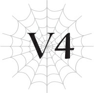

# Chương V4: Bỏ lại vận rủi phía sau
*(Leaving Misfortune Behind)*

---

Ngày hôm sau khi chúng tôi đụng độ vị Giáo hoàng của Thần Ngôn Giáo, Merazophis đã đổ gục.

Nguyên nhân: mất máu.

Anh ấy ngất đi vì tôi đã hút quá nhiều máu của anh.

Th-Thì, tôi cũng đâu có tự chủ được cơ chứ!

Không hiểu sao, chính vào khoảnh khắc đó, tôi lại cảm thấy mình nhất định phải uống máu của Merazophis bằng mọi giá!

Tôi uống quá nhiều ư?

Được rồi, tôi xin lỗi!

Dù sao thì, vì tình trạng của anh ấy và vài lý do khác, chúng tôi rốt cuộc phải ở lại thêm một đêm.

Sau đó, thật may là Merazophis đã hồi phục bình thường.

Để tạ lỗi với White vì bắt cô ta phải đợi thêm một ngày, cô Ariel đã gọi thêm một thùng rượu nữa, nhưng tôi khá chắc cô ấy chỉ tự mình muốn uống mà thôi.

Hóa ra cô Ariel cũng là người khá thích uống rượu.

Khi chúng tôi hội ngộ với White, buổi tối hôm đó bỗng chốc biến thành một bữa tiệc nhỏ. Nhưng mà, người đàn ông mặc đồ đen tự nhiên ghé vào tham gia là ai thế nhỉ?

Vì cô Ariel không phàn nàn gì nên tôi đoán đó là bạn của cô ấy.

Và vì White cũng không nói một lời nào, tôi cảm thấy bằng cách nào đó mình cũng không nên ý kiến gì, thế nên tôi đành lờ chuyện đó đi.

Nghĩ rằng mình sẽ phục hận cho lần trước, tôi đã nhấp thêm một ngụm rượu, nhưng tất nhiên là tôi lại lăn ra bất tỉnh nhân sự.

Đến khi tôi nhận thức được thì trời đã sáng, và người đàn ông mặc đồ đen kia cũng đã biến mất.

Thật là một bí ẩn.

Sau đó, chúng tôi lại tiếp tục cuộc hành trình.

Như thường lệ, chúng tôi dành nhiều ngày di chuyển xuyên qua các khu rừng, núi non và bất kỳ nơi nào khác mà người bình thường sẽ không bao giờ đặt chân tới.

Rồi cuối cùng, chúng tôi cũng đã tới được thủ đô của Sariella.

Vì đây là thánh địa của Nữ Thần Giáo, nhà thờ xuất hiện ở khắp mọi nơi bạn nhìn, và toàn bộ nơi này mang một bầu không khí vô cùng trang nghiêm.

Nhưng ở đây cũng có rất nhiều khu chợ sầm uất và nhộn nhịp. Cứ ngỡ là những thứ đó sẽ lạc quẻ với nhau, nhưng không hiểu sao tất cả lại hòa quyện vô cùng hài hòa.

Tôi nghĩ đó là vì Nữ Thần Giáo đã là một phần quá đỗi bình dị trong đời sống của người dân nơi đây.

Chuyện này làm tôi nhớ đến chuyến tham quan thực tế hồi trung học cơ sở đến Kyoto.

Có điều, suốt chuyến đi đó tôi luôn bị bắt nạt nên cũng chẳng vui vẻ gì cho cam.

Nhóm chúng tôi ghé đại vào một nhà hàng và dùng bữa tối.

Sau đó chúng tôi thuê phòng tại một quán trọ và nghỉ ngơi vào buổi tối.

Đó vẫn là trình tự quen thuộc mỗi khi chúng tôi tới một thị trấn.

Nhưng lần này thì khác.

Đây chính là điểm đến của chúng tôi, và giờ khi đã tới nơi, tôi phải đưa ra câu trả lời của mình về những gì chúng tôi sẽ làm tiếp theo.

Nói lời tạm biệt với cô Ariel và White rồi ở lại Sariella?

Hay là đồng hành cùng họ tới lãnh thổ ma tộc?

Mà, tôi đoán có lẽ vẫn còn những lựa chọn khác nữa.

“Vậy, cháu có muốn ở lại đây vài ngày để quyết định xem sắp tới sẽ làm gì không?” Cô Ariel đề xuất, nhưng tôi lắc đầu.

“Không, cháu không cần vài ngày đâu ạ.”

Tôi đã quyết định xong câu trả lời của mình rồi.

“Cô Ariel. Xin hãy đưa chúng cháu đi cùng tới lãnh thổ ma tộc.”

“Cháu chắc chắn chứ?”

“Vâng. Cháu đã suy nghĩ rất kỹ rồi.”

Khi thấy tôi trả lời ngay lập tức, ánh mắt của cô Ariel hướng về phía Merazophis.

Nhưng trước khi cô ấy kịp nói điều gì, tôi đã ra lệnh cho anh ấy.

“Merazophis, đi cùng tôi.”

Merazophis là người hầu của tôi.

Anh ấy phải làm theo những gì tôi bảo.

Cô Ariel có lẽ đang định hỏi ý kiến xem anh ấy muốn gì, nhưng điều đó không quan trọng.

Tôi sẽ không chấp nhận bất kỳ lời từ chối nào.

“Tuân lệnh, thưa tiểu thư.”

Không ngoài dự đoán, Merazophis sẵn sàng đồng ý.

Cái ngày chúng tôi chạm trán Giáo hoàng của Thần Ngôn Giáo, tôi đã bảo với Merazophis rằng anh ấy có thể tự đi con đường riêng nếu muốn.

Chính anh ấy đã từ chối điều đó và chọn ở lại bên tôi.

Thế nên kể từ bây giờ, dù có chuyện gì xảy ra đi chăng nữa, tôi cũng sẽ không bao giờ buông tay anh ấy.

Ngay cả khi anh ấy vẫn còn vương vấn đất nước này, một khi tôi đã bảo đi, chúng tôi nhất định sẽ rời đi.

Hay đúng hơn, tôi nên nói là chính vì anh ấy vẫn còn vương vấn.

Merazophis sinh ra và lớn lên ở đất nước này, tìm thấy nhiều điều ở đây, và rồi mất sạch tất cả.

Anh ấy phải dứt bỏ khỏi nơi này, cả về thể chất lẫn tinh thần.

Suy cho cùng, người mà Merazophis phụng sự là cha mẹ tôi chứ không phải tôi.

Anh ấy ở bên cạnh bảo vệ tôi chỉ vì đó là mong muốn của họ.

Nhưng như thế vẫn chưa đủ.

Tôi không muốn anh ấy ở bên tôi vì cha mẹ tôi.

Tôi không thể chấp nhận được điều đó.

Anh ấy phải ở bên tôi vì chính tôi.

Tất nhiên, tôi không bảo anh ấy phải quên đi cha mẹ tôi. Những ký ức đó đối với anh ấy vô cùng trân quý.

Nhưng tôi muốn anh ấy đặt tôi lên trên tất cả những điều đó.

Dù sao thì, Merazophis là của tôi.

Tôi sẽ không để ai cướp mất anh ấy, ngay cả cha mẹ tôi cũng không được.

Đó là lý do tại sao chúng tôi không thể ở lại đất nước nơi anh ấy có quá nhiều ký ức này.

Chúng tôi sẽ rời đi để cả hai có thể bắt đầu lại từ đầu.

Bỏ lại tất cả mọi thứ ở phía sau.

Và rồi, tôi sẽ khiến Merazophis phải công nhận tôi là chủ nhân thực sự của anh ấy.

Để làm được điều đó, tôi phải trưởng thành hơn để xứng đáng với vai trò ấy.

Tôi muốn trở nên tử tế và biết thấu hiểu cảm xúc của người khác, giống như cô Ariel.

Tôi muốn giúp đỡ mọi người mà không cần đòi hỏi đền đáp gì, giống như White.

Dù rất ghét phải thừa nhận, nhưng White thực sự rất tuyệt vời.

Gạt các chỉ số, kỹ năng và tất cả những thứ khác sang một bên, tôi nghĩ nội tâm bên trong của cô ta còn hơn cả một con người bình thường.

Tôi không biết có con người nào lại sẵn sàng làm nhiều điều cho người khác như vậy mà không đòi hỏi đền đáp.

Ở cô ta toát ra một cảm giác kiên định và kiêu hãnh không bao giờ lay chuyển.

Có lẽ tôi vẫn còn một chút ghen tị với cô ta, nhưng hơn thế, tôi bắt đầu nể phục cô ta.

Quả thực kiếp trước mọi người sùng bái cô ta không chỉ vì ngoại hình.

Nếu tôi hoàn thiện con người bên trong của mình, có lẽ cuộc sống của tôi cũng sẽ tốt đẹp lên một chút.

Tôi nhớ về cha mẹ kiếp trước của mình, những người mà điểm tốt duy nhất chỉ là tính cách hiền lành.

Thật sự họ chẳng có ưu điểm gì khác ngoài việc đó cả.

Nhưng thay vì cảm thấy tự ti về bản thân, trông họ lúc nào cũng hạnh phúc.

Ngoại hình đẹp thực sự không phải là tất cả.

Bạn cũng cần phải là một người tốt từ bên trong nữa.

Đó là lý do tại sao tôi sẽ cố gắng hoàn thiện bản thân mình.

Tôi sẽ tận dụng vẻ ngoài thừa hưởng từ cha mẹ ở dị giới này, cộng thêm những phẩm chất tốt đẹp học hỏi từ White, cô Ariel và cha mẹ kiếp trước, để trở thành một tiểu thư hoàn hảo, người xứng đáng làm chủ nhân của Merazophis.

“Merazophis, hãy nhớ luôn ở bên cạnh nâng đỡ tôi đấy nhé?”

“Tất nhiên rồi, thưa tiểu thư.”

Tôi đưa tay ra, và Merazophis quỳ xuống, thành kính hôn lên bàn tay ấy.

“Hử? Khoan đã nào. Như thế này là tốt nhất đúng không? Mình nghĩ là vậy, nhưng... Hửm? Có gì đó hơi sai sai ở đây. Con bé đang biến thành yandere đấy à? Cái gì cơ? Sao mọi chuyện lại thành ra thế này?”

Cô Ariel gãi đầu lẩm bẩm một mình, nhưng tôi quyết định ngó lơ cô ấy.

Và cứ thế, chúng tôi quyết định tiến tới lãnh thổ ma tộc.

---

[◀ Chương trước: Chương 5: Lũ nhện cùng một giuộc](05_spiders_of_the_same_stripe.md) | [Chương tiếp theo: Báo cáo về Cơn Ác Mộng của Mê Cung (Phần 2) ▶](report_on_the_nightmare_of_the_labyrinth_part_2.md)
