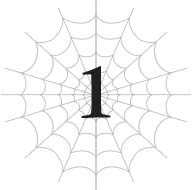

# Chương 1: Báo cáo tiến độ hành trình xuyên đại lục
*(Transcontinental Journey Progress Report)*

---

“Được rồi. Nói 'aaa' nào.”

“““““Aaa.”””””

“Giờ nói 'eee' nhé.”

“““““Eee.”””””

Đồng thanh giọng của các cô gái vang vọng khắp vùng đất hoang vu cằn cỗi.

Họ không thực sự đang hát đâu, nhưng khi bạn nghe thấy một nhóm người lặp lại mọi thứ đồng thanh như vậy, nghe nó cũng hơi giống một bài hát đấy chứ nhỉ?

Và làm ơn đi, đừng có chỉ ra rằng chẳng một ai trong số họ là con người cả. Thô lỗ lắm đấy nhé.

Hiện tại, chúng tôi đang ở giữa một vùng đất hoang rộng lớn thuộc cụm các quốc gia nhỏ nằm ở phía bắc Sariella.

Khi chúng tôi đến điểm đến ban đầu của chuyến hành trình nhỏ này, thủ đô của Sariella, Dơi con và Mera đã quyết định bỏ lại quê hương phía sau và đi đến lãnh thổ ma tộc.

Hai người họ đã bị trục xuất khỏi quê nhà do cuộc chiến với Thần Ngôn Giáo và những mưu đồ của Potimas.

Việc cả hai đều là ma cà rồng chứ không phải con người có lẽ đã đóng một vai trò lớn trong quyết định tiến thêm một bước và bỏ lại quê hương phía sau.

Dơi con là một Chân Tổ sinh ra đã là ma cà rồng, còn Mera được chuyển hóa thành ma cà rồng sau khi bị Dơi con hút máu.

Nếu muốn sinh sống trong thế giới loài người mà không có ai bảo hộ, họ sẽ phải che giấu thân phận đó.

Đó là lý do tại sao họ quyết định đi theo người bảo hộ của mình, Ma Vương, để vào lãnh thổ ma tộc. Quyết định đó đúng là cần rất nhiều dũng khí, nếu bạn hỏi tôi.

Đã khoảng một năm trôi qua kể từ khi họ đưa ra quyết định đó.

Chúng tôi đi thẳng về phía bắc từ thủ đô Sariella và băng qua biên giới.

Chuyến hành trình diễn ra khá yên bình kể từ khi chúng tôi rời thủ đô, không có sự cố nào đáng chú ý.

Thực ra, sự cố lớn nhất kể từ khi bắt đầu chuyến đi này là việc các Phân thân Tư duy của tôi nổi loạn.

Tôi cứ liên tục chuẩn bị tinh thần để đối phó với cuộc tấn công của Potimas, nhưng hắn vẫn chưa ra tay. Mọi chuyện diễn ra suôn sẻ đến mức gần như hơi hụt hẫng.

Tuy vậy, chúng tôi không thể lơ là cảnh giác.

Để đảm bảo an toàn, chúng tôi đã tránh mọi tuyến đường thông thường nơi mình có thể bị nhìn thấy, chọn những lối đi ít người qua lại, đến mức ở đây thậm chí còn chẳng có đường sá gì cả.

Người thường sẽ không băng qua vùng hoang mạc này, nên đây là nơi hoàn hảo để chúng tôi di chuyển.

Và chỉ cần nhìn lên bầu trời là có thể dễ dàng hiểu được lý do tại sao không có ai khác ở đây.

Vô số bóng đen đang bay lượn trên không trung.

Chim chóc ư? Mơ đi nhé.

Một vài con trông hơi giống chim, nhưng hầu hết đều giống loài bò sát hơn.

Một lũ trông thực sự giống khủng long có lông vũ, kiểu như nửa chim nửa bò sát vậy đó.

Những sinh vật đang bay trên trời kia là phi long, hoặc thậm chí là rồng thực sự.

Chúng là những kẻ thống trị của vùng đất hoang này.

Ừ. Với một lượng lớn phi long và rồng lượn lờ ở vùng này như thế, bảo sao con người không dám bén mảng tới nơi này.

Chỉ một con rồng hay phi long cấp cao duy nhất cũng đủ để quét sạch cả một đội quân của nhân tộc rồi.

Những kẻ duy nhất đủ liều lĩnh để bước chân vào vùng đất ác mộng này hẳn là những kẻ muốn tự sát, hoặc là những kẻ muốn được lưu danh sử sách như những huyền thoại.

Nhưng chúng tôi thì không thuộc phe nào trong hai loại đó cả.

Bởi vì chúng tôi có một Ma Vương, người mà tình cờ lại mạnh hơn bất kỳ con rồng nào rất nhiều.

Nếu muốn, Ma Vương có lẽ có thể quét sạch toàn bộ loài rồng đang bay trên đầu kia mà không cần tốn một giọt mồ hôi.

Rồng có thể quét sạch quân đội con người, còn Ma Vương lại có thể quét sạch quân đoàn rồng.

Nghe cứ như trò đùa ấy nhỉ.

Lại thêm một vụ lạm phát sức mạnh nữa rồi, nếu bạn hỏi tôi.

Tuy nhiên, nói đi cũng phải nói lại, trong đoàn của chúng tôi còn có Dơi con và Mera.

Nếu chúng tôi bị cuốn vào một trận chiến long trời lở đất giữa Ma Vương và loài rồng, hai người họ có thể sẽ không giữ được mạng sống.

Tất nhiên, Ma Vương hoàn toàn có khả năng vừa bảo vệ cả hai người họ vừa hạ gục toàn bộ loài rồng. Nhưng chẳng việc gì phải tự đâm đầu vào một tình huống nguy hiểm như thế làm gì.

Trước khi tiến vào hoang mạc, Ma Vương đã hét to với loài rồng: “Chúng tôi chỉ đi ngang qua thôi!”

Tôi không biết chúng có nghe thấy và hiểu ý cô ta hay không, nhưng suốt thời gian qua chúng chỉ bay lượn ở phía trên mà không thèm bận tâm đến chúng tôi.

Có lẽ chúng đã quyết định theo dõi chúng tôi nhưng sẽ không can thiệp trừ phi bắt buộc.

Nhờ vậy, chúng tôi tránh được một trận chiến vô nghĩa và loại bỏ khả năng Dơi con và Mera mất mạng.

Hơn nữa, bằng cách này loài rồng cũng không bị xóa sổ hoàn toàn.

Chiến đấu không mang lại lợi ích cho bên nào cả, nên chúng đã đưa ra quyết định đúng đắn đấy.

Thế là chúng tôi cứ thế đi bộ bình thường, không làm phiền đến các loài sinh vật bản địa ở đây.

Có lẽ việc vừa đi bộ vừa ngân nga hát thế này không được bình thường cho lắm, nhưng đừng bận tâm đến chuyện đó.

Buổi đồng ca này có lý do của nó cả đấy nhé, được chứ?

Nếu không thì chúng tôi đã chẳng làm vậy rồi.

Nói cho rõ thì, thứ chúng tôi đang làm là luyện giọng.

Dơi con đã lớn tới mức chẳng thể gọi là trẻ sơ sinh nữa rồi.

Có thể nói con bé đã tiến hóa thành một đứa trẻ tập đi.

Nhưng lại có một vấn đề nhỏ.

Bởi vì suốt thời gian qua con bé toàn dùng [Thần giao cách cảm] để giao tiếp, nên khả năng nói thành tiếng của nó rất tệ.

Con bé là một cô nhóc ma cà rồng nói ngọng.

Tôi đoán cái kiểu đó có sức hút đối với một nhóm đối tượng đặc trưng nào đó đấy nhỉ.

Xét theo tuổi sinh lý của con bé, việc nói ngọng cũng không có gì quá kỳ lạ, nhưng trong trường hợp của nó, đây có thể là một vấn đề lớn.

Ngoài việc dùng [Thần giao cách cảm] thay vì nói chuyện, con bé còn chưa bao giờ khóc lóc la hét như một đứa trẻ bình thường, nên dây thanh quản của nó gần như chưa bao giờ được sử dụng.

Nó dẫn đến một vòng lặp luẩn quẩn: Con bé không sửa được tật nói ngọng, đâm ra xấu hổ rồi lại dùng [Thần giao cách cảm], đồng nghĩa với việc dây thanh quản của nó tiếp tục bị bỏ xó.

Nếu cứ tiếp tục thế này, tật nói ngọng của nó sẽ không thể tự hết theo tuổi tác được.

Giải pháp mà chúng tôi vội vàng nghĩ ra chính là bài tập luyện giọng này.

Nhìn một đứa trẻ chập chững bước đi qua hoang mạc cằn cỗi trong khi la hét những từ ngữ kỳ lạ trông thật kỳ quặc.

Nhưng thực ra nó lại có hiệu quả khá tốt đấy.

Cho cả việc luyện giọng lẫn các chỉ số của con bé.

Thông thường, chỉ số sẽ tăng nhiều hơn khi bạn sử dụng chúng, nhưng việc đó cũng có giới hạn.

Để thực sự đạt được kết quả, bạn phải thực hiện các bài huấn luyện mà hầu hết mọi người đều cảm thấy khó khăn hoặc thậm chí là đau đớn.

Và Dơi con lại xuất phát điểm là một đứa trẻ sơ sinh, dạng thể chất yếu ớt nhất có thể tưởng tượng được.

Đối với con bé, ngay cả việc đi bộ thôi cũng là một thử thách cực lớn, nghĩa là nó sẽ giúp các chỉ số của con bé tăng lên như điên.

Ý tôi là, hầu hết trẻ em ở độ tuổi này còn chưa biết đi, nói gì đến chuyện đi bộ suốt cả ngày.

Bảo sao chỉ số của con bé ban đầu lại tăng nhanh đến thế.

Nhưng đến thời điểm này, vì chỉ số đã lên quá cao, việc chỉ đi bộ không còn đủ để giúp chúng tăng thêm bao nhiêu nữa.

Đi bộ cả ngày giờ đây chẳng còn là thử thách đối với con bé, nên đây là thời điểm hoàn hảo để thêm một yếu tố khác vào bài tập.

Đó là lý do tại sao tôi bắt con bé vừa đi bộ vừa luyện giọng như thế này.

Bài tập này đòi hỏi phải hít vào thở ra rất sâu, nên nếu bạn làm việc đó khi đang vận động mạnh, việc hít thở sẽ trở nên cực kỳ khó khăn.

Nó thậm chí có thể hơi giống phương pháp huấn luyện ở độ cao lớn mà một số vận động viên hay áp dụng.

Thêm vào đó, tôi còn bắt con bé luyện tập chút ma pháp ít ỏi mà nó có thể dùng được trong khi đi bộ, và việc xử lý nhiều việc cùng lúc này cũng đang giúp nâng cấp kỹ năng [Tư duy Song song] của con bé nữa.

Đó chính là lý do tại sao đoàn người kỳ lạ của chúng tôi lại làm ồn đến thế trên đường đi.

Đến đây, bạn đã nhận ra điều gì kỳ lạ trong bản báo cáo tiến độ ngắn ngủi này của tôi chưa?

Chuẩn luôn. Chỉ mình giọng của Dơi con thì không thể tạo thành một dàn đồng ca được.

Tình cờ là con bé không phải là người duy nhất tham gia bài huấn luyện này.

Có bốn cô gái khác đang luyện tập cùng với con bé.

Hay nói chính xác hơn là bốn con quái vật.

Đó là bốn con nhện rối, thuộc hạ của Ma Vương.

Đúng như tên gọi của chúng, chúng là loài quái vật nhện điều khiển những con búp bê giống như con rối.

Thân xác thực sự của chúng chỉ là những con nhện nhỏ xíu, nhưng chúng lại sử dụng những con búp bê bằng tơ này để chiến đấu. Kỳ lạ thật đấy.

Vấn đề là, những con búp bê này trước đây trông chẳng khác gì những con ma-nơ-canh nhạt nhẽo. Nhưng tôi đã thực hiện vô số cải tiến ma pháp trên cơ thể chúng, đến mức bây giờ nhìn từ xa bạn chắc chắn sẽ nghĩ chúng là con người thực sự.

Sau khi đã hài lòng với vẻ ngoài của chúng, tôi đã thử chế tạo dây thanh quản cho chúng, nhưng việc đó hóa ra lại khá khó khăn nên tôi đã bị tắc một thời gian.

Hắc hắc. Nhưng cuối cùng tôi cũng đã thành công!

Khó lắm đấy nhé.

Cực kỳ khó luôn...

Nhưng tôi nghĩ mình đã làm được rồi!

Tôi đã dành cả năm qua trong một vòng lặp thử và sai liên tục cho đến khi cuối cùng cũng chế tạo ra được bộ dây thanh quản này.

Ngay cả bây giờ, chúng vẫn chưa hoạt động trơn tru lắm.

Bạn phải làm cho sợi tơ rung động để tạo ra âm thanh nghe giống giọng người, nhưng thực hiện được điều đó không hề đơn giản chút nào.

Ngay cả một âm tiết duy nhất cũng tiêu tốn rất nhiều nỗ lực.

Đó là lý do tại sao lũ nhện rối lại bắt đầu tập luyện giọng cùng với Dơi con.

Chúng dường như vẫn gặp rất nhiều khó khăn ngay cả với những âm thanh đơn giản nhất, nên có lẽ sẽ còn mất nhiều thời gian trước khi chúng có thể nói chuyện trôi chảy. Dù vậy chúng trông có vẻ khá quyết tâm, nên tôi chắc chắn cuối cùng chúng cũng sẽ làm được thôi.

Tôi nghĩ mình cũng có thể tiếp tục thử cải tiến thêm bộ dây thanh quản nhân tạo này.

Tiện thể thì, lũ nhện rối trước đây chỉ được triệu hồi khi Ma Vương và những người khác đi vào thị trấn, nhưng dạo gần đây chúng luôn đồng hành cùng chúng tôi.

Có lẽ Ma Vương đã chán ngấy việc cứ phải triệu hồi rồi lại giải tán chúng liên tục như vậy rồi.

Dù lý do là gì đi nữa, tỷ lệ nữ giới trong nhóm này chắc chắn đã tăng vọt.

Chúc mừng nhé Mera! Anh đã có cho mình một hậu cung rồi đấy!

Mặc dù trong số đó chẳng có lấy một cô gái loài người bình thường nào cả.

Tôi là một Arachne nửa người nửa nhện; Ma Vương thì là... Ma Vương; lũ nhện rối nhìn thì dễ thương thật nhưng bên trong vẫn chỉ là nhện thôi; còn Dơi con thì là một đứa trẻ chập chững biết đi.

Được rồi, ừ. Hậu cung kiểu này thì hơi chán nhỉ.

Hơn nữa, chủ nhân của Mera là Dơi con lúc nào cũng dán mắt vào anh ta, nên anh ta phải cực kỳ cẩn thận.

Thành thật mà nói, nếu con bé cứ bám dính lấy Mera thêm chút nữa, nó sẽ chính thức trở thành một cô bạn gái bám đuôi cuồng loạn mất.

Con bé đã bắt đầu lườm nguýt bất cứ khi nào Mera tương tác với các cô gái khác rồi.

Chưa kể cấp độ kỹ năng [Ghen Tị] (Jealousy) của con bé cũng liên tục tăng lên.

[Ghen Tị] được tiến hóa từ kỹ năng [Ác Ý] (Spite), và hiện tại đã đạt cấp 2 rồi.

“Sophia này, cháu đừng có kích động quá thế chứ? Phải chú ý đừng để kỹ năng đó tăng cấp đấy. Các kỹ năng thuộc dòng Thất Đại Tội có thể gây ảnh hưởng nghiêm trọng đến tâm trí, nói chung là cực kỳ nguy hiểm. Cứ bình tĩnh đi được không? Mà sao nó lại tăng nhanh thế nhỉ? Những kỹ năng kiểu đó đáng lẽ phải cực kỳ khó lên cấp chứ...”

Đó là những gì Ma Vương đã khuyên nhủ về vấn đề này.

Có vẻ như kỹ năng [Ghen Tị] của Dơi con là dạng cấp thấp của kỹ năng Thất Đại Tội [Đố Kỵ] (Envy).

Ma Vương bảo rằng các kỹ năng thuộc dòng Thất Đại Tội đáng lẽ ra phải rất khó tăng cấp, thế mà Dơi con lại đang tiến triển với tốc độ kinh hồn.

Chuyện này chắc chắn không tốt lành gì rồi...

Người hầu tội nghiệp của nó có lẽ đang mất ăn mất ngủ vì sức nặng tình cảm của chủ nhân mình đây.

Cố lên nhé, anh bạn!

May mắn thay, Mera có tính cách rất nghiêm túc, nên Dơi con vẫn chưa đến mức phát điên.

Nếu Mera mà là một kẻ đào hoa sát gái, có lẽ tất cả chúng tôi đã gặp rắc rối lớn rồi.

Anh ta vẫn đang duy trì một khoảng cách chừng mực giữa chủ và tớ, ngay cả khi Dơi con liên tục ném về phía anh ta những ánh nhìn kỳ lạ, nên mọi thứ có vẻ vẫn ổn thỏa.

Ý tôi là, con bé vẫn chỉ là một đứa trẻ chập chững, nên ngay từ đầu cũng chẳng có gì đáng để lo lắng cả.

May là Mera không phải loại biến thái thích trẻ con.

Nhắc đến người-đàn-ông-đứng-đắn này, anh ta thực ra đang lẳng lặng đi bộ ngay phía trước tôi lúc này.

Những tiếng huỳnh huỵch nặng nề vang lên theo từng bước chân của anh ta, để lại những dấu chân in hằn trên nền đá cứng.

Tôi đang áp đặt một áp lực cực lớn lên anh ta bằng [Xích Lực Tà Nhãn] của mình. Đó là lý do tại sao chân anh ta lại lún sâu vào đá với mỗi bước đi.

Như bạn có lẽ đã đoán ra, việc này là để huấn luyện cho Mera.

Chỉ số của Mera cao hơn của Dơi con.

Điều này cũng dễ hiểu thôi, vì anh ta là một người đàn ông trưởng thành mới bị biến thành ma cà rồng gần đây, trong khi con bé vẫn chỉ là một đứa trẻ chập chững biết đi.

Thêm vào đó, anh ta chưa từng bỏ lỡ một ngày huấn luyện nào trên suốt chuyến hành trình này, nên anh ta đang mạnh lên mỗi ngày.

Đó là lý do tại sao anh ta phải dùng đến các biện pháp cực đoan thế này, nếu không chỉ số sẽ chẳng tăng thêm được bao nhiêu nữa.

Ngay cả việc vừa đi vừa la hét như Dơi con và lũ nhện rối cũng chẳng giúp ích gì nhiều cho chỉ số của anh ta.

Hơn nữa, ngay từ đầu anh ta cũng đâu cần luyện giọng.

Thế nên mới có bài huấn luyện sức nặng bằng [Xích Lực Tà Nhãn] này.

Bài tập này nặng đô hơn bài luyện giọng rất nhiều, nên chỉ số của anh ta đang tăng lên với tốc độ khá ổn định.

Đến thời điểm này, chỉ số của anh ta đã ngang ngửa với một quái vật trung bình rồi.

Tuy nhiên, so với các chỉ số, kỹ năng của anh ta lại tăng cấp kháaaa là chậm chạp.

Kiểu như, chúng chắc chắn có tăng lên, nhưng nếu so sánh với tốc độ thăng cấp bàn độc từ kỹ năng [Kiêu Hãnh] gian lận của tôi thì quả thực không mấy ấn tượng.

Nhưng ngay cả tôi cũng đang vấp phải một bức tường giới hạn.

Tôi không có nhiều cơ hội để chiến đấu với quái vật trên chuyến đi này, nên cấp độ của tôi vẫn chưa tăng thêm, và các chỉ số cũng như cấp độ kỹ năng của tôi đã quá cao đến mức chúng gần như không còn nhúc nhích nổi nữa.

Nếu muốn tăng cấp vào lúc này, về cơ bản tôi sẽ phải thảm sát một lượng sinh vật đủ để xóa sổ cả một hệ sinh thái chết tiệt nào đó.

Bảo sao cấp độ của tôi chẳng tăng thêm tí nào.

Kể từ khi tôi và Ma Vương đạt được thỏa ước đình chiến thì việc này cũng không phải vấn đề quá lớn, nhưng tôi vẫn không tránh khỏi cảm giác sốt ruột khi bị kẹt lại thế này.

Mục tiêu tối thượng của tôi là trở nên đủ mạnh để đánh bại Ma Vương hoặc Potimas, nhưng có vẻ như tôi sẽ không thể hoàn thành bất kỳ mục tiêu nào trong số đó trong một sớm một chiều được.

Tôi đang xây dựng một vài chiến thuật để đối phó với Potimas, nên có lẽ tôi có thể tự vệ trước hắn, nhưng tôi vẫn cảm thấy mình hoàn toàn không có cửa đấu với Ma Vương.

“Nói 'ooo' nào.”

“““““Ooo.”””””

Vào lúc này, Ma Vương đang vui vẻ dẫn đầu dàn đồng ca gồm Dơi con và lũ nhện rối.

Trông cô ta có vẻ đang rất tận hưởng cuộc vui.

Hơi quá thảnh thơi so với một Ma Vương rồi đấy nhỉ?

Nếu cô ta trông lớn tuổi hơn một chút, người ta có thể nhầm cô ta là người dẫn chương trình truyền hình cho thiếu nhi hay gì đó cũng nên.

Nhưng đáng tiếc thay, Ma Vương trông lại như một đứa trẻ— Ủa?! Tự dưng lạnh sống lưng quá vậy nè!

Ừm... Tôi nên dừng mạch suy nghĩ đó lại thì hơn.

Chủ đề đặc biệt đó luôn chạm vào dây thần kinh nhạy cảm của Ma Vương.

Giờ cô ta đang nhìn chằm chằm vào tôi, với một nụ cười đáng sợ hơn bình thường gấp đôi.

Xin lỗi, xin lỗi nhé. Tôi thề là mình không nghĩ gì cả đâu.

Tôi chắc chắn chắn chắnnn là không hề nghĩ về việc Ma Vương trông giống hệt như một đứa con nít đâu nhé.

Tôi hình như vừa thấy nụ cười của Ma Vương rộng ra thêm một chút, nhưng tôi chắc chắn đó chỉ là ảo giác của mình thôi.

Ừ. Cứ coi là vậy đi.

Ôi trời đất ơi, bây giờ ngay cả Dơi con và lũ nhện rối cũng đang tỏ ra sợ hãi kìa.

Đừng có làm trẻ con khiếp sợ thế chứ hả?

Xin ngàn lần lượng thứ, thưa Ma Vương đại nhân, tôi sẽ vô cùng biết ơn nếu ngài có thể quên tôi đi và tập trung vào đám trẻ. Xin đa tạ.

Tôi không biết liệu lời cầu xin thầm lặng của mình có truyền được tới cô ta hay không, nhưng Ma Vương đã quay lại dẫn đầu dàn đồng ca như thể chưa từng có chuyện gì xảy ra.

Phù. Suýt nữa thì tiêu đời.

Như bạn có thể thấy, mối quan hệ giữa tôi và Ma Vương vẫn chưa có gì thay đổi nhiều.

Về bề ngoài, chúng tôi không hành xử như kẻ thù, nhưng đôi khi chúng tôi vẫn chọc ngoáy vào nỗi đau của đối phương.

Đó là tình trạng cân bằng mỏng manh mà chúng tôi đang duy trì hiện tại.

Nhưng cũng không đến mức chúng tôi thực sự khiêu khích đối phương một cách nghiêm trọng.

Thỉnh thoảng, tôi có thể nhận thấy Ma Vương đang dò xét phản ứng, cố gắng tìm hiểu xem tôi đang nghĩ gì.

Dự đoán của tôi là cô ta đã quyết định rằng việc có tôi làm đồng minh sẽ mang lại nhiều lợi ích hơn là giết tôi, nên cô ta đang cố gắng thu hẹp khoảng cách giữa cả hai từng chút một.

Mặc dù rất khó để nói liệu việc đó có hiệu quả hay không.

Ý tôi là, tôi chắc chắn sẽ đồng ý với bất kỳ thỏa thuận nào giúp tôi không phải mạo hiểm mạng sống để chiến đấu vô nghĩa với cô ta, nhưng điều đó không có nghĩa là tôi có thể hoàn toàn tin tưởng cô ta.

Về cơ bản, tôi nghĩ cả hai chúng tôi đều muốn tìm kiếm một điểm chung, nhưng không ai trong hai bên sẵn sàng chủ động tiến lại gần đối phương hơn.

Dơi con, Mera, Ma Vương, lũ nhện rối.

Tất cả chúng tôi đang đồng hành cùng nhau, mỗi người đều mang theo những suy nghĩ và cảm xúc của riêng mình.

Nhìn chung, chuyến đi đang diễn ra khá suôn sẻ.

Chúng tôi chưa bị tộc Elf tấn công như từng lo sợ.

Nhưng tôi biết chắc chắn rằng Potimas không chỉ đang ngồi không khoanh tay đứng nhìn.

“Vậy chính xác thì Potimas là ai ạ?”

Đến một lúc, Dơi con cuối cùng cũng hỏi Ma Vương câu hỏi triệu đô đó.

“Một đống rác rưởi,” Ma Vương trả lời ngay lập tức.

Này nhé, cô thừa biết đó không phải là thứ con bé muốn hỏi mà. (Những người khác có lẽ cũng đều có chung phản ứng nội tâm này.)

Mặc dù tôi khá chắc chắn là Ma Vương cũng tự nhận thức được điều đó.

Ồ, nhưng cũng có thể cô ta không hề có ý mỉa mai đâu. Có khi đó thực sự chỉ là câu trả lời đầu tiên xuất hiện trong đầu cô ta thôi cũng nên.

“Ý cháu không phải thế...” Dơi con cuối cùng cũng đáp lại.

Vẻ mặt của con bé lúc đó đúng là vô giá: gương mặt hiện rõ dòng chữ "Cháu biết rồi".

Tôi đoán con bé cũng thừa biết Potimas là một tên cặn bã.

Dù sao thì hắn cũng đã giết chết cha mẹ con bé và còn suýt giết luôn cả nó nữa.

Nên việc nó muốn biết thêm thông tin về hắn cũng là điều hiển nhiên.

Đối với Dơi con, Potimas là kẻ thù không đội trời chung đã sát hại cha mẹ và đang lên kế hoạch tiêu diệt nó tiếp theo. Nó có mọi quyền được biết hắn là ai.

Dù vậy, Ma Vương không trả lời ngay lập tức.

Cô ta im lặng một lúc, vẻ mặt trông khá đăm chiêu.

Nên nói cho con bé biết bao nhiêu đây?

Tôi chắc chắn đó là những gì Ma Vương đang cân nhắc.

Tôi cũng muốn biết thêm về Potimas, nên tôi im lặng chờ đợi câu trả lời.

Vì kỹ năng [Cấm Kỵ] của tôi đã đạt cấp tối đa, tôi đã có một số manh mối về việc Potimas thực chất là thứ gì.

Ma Vương từng được Nữ Thần Giáo thờ phụng như Thần Thú của Nữ thần.

Thế mà Potimas lại quen biết cô ta và thậm chí còn có gan đối xử với cô ta như một đứa trẻ.

Thêm vào đó, hắn còn sở hữu một cơ thể máy móc, thứ tuyệt đối không nên tồn tại ở thế giới này.

Nếu chắp vá tất cả các mảnh ghép lại với nhau, tôi có thể đoán ra bản chất thực sự của hắn.

Dù vậy, tôi vẫn muốn nghe sự thật từ miệng của Ma Vương, người rõ ràng nắm rõ mọi chuyện hơn.

“Được rồi. White trông cũng có vẻ hứng thú đấy, nên ta nghĩ mình sẽ kể cho các cháu nghe toàn bộ câu chuyện.” Ma Vương liếc nhìn tôi rồi thở dài. “Nhưng một khi đã nghe chuyện này thì sẽ không có đường lui nữa đâu nhé. Tên đó không phải một kẻ phản diện bình thường. Hắn là mối đe dọa đối với toàn bộ thế giới này, dù nghe câu này từ miệng một Ma Vương thì có hơi nực cười thật. Một khi đã biết hắn thực sự là gì, các cháu sẽ không thể tiếp tục sống một cách yên bình ở thế giới này được nữa đâu. À thì, sống thì vẫn sống được thôi, nhưng ta chắc chắn nó sẽ trở thành gánh nặng đè nặng lên tâm trí các cháu.

Bây giờ, ta có thể kể cho các cháu nghe những sự thật cơ bản và vô hại nhất về hắn, nhưng đó không phải là thứ các cháu muốn biết đúng không? Nếu thực sự muốn tìm hiểu mọi chuyện, hãy chắc chắn rằng các cháu đã chuẩn bị sẵn sàng tâm lý để nghe những gì ta sắp nói.”

Thái độ nghiêm túc của Ma Vương dường như khiến Dơi con có chút bất ngờ.

Tất nhiên con bé không hỏi về Potimas chỉ vì tò mò nhất thời rồi.

Nhưng con bé có lẽ cũng không ngờ rằng những thông tin này lại có thể làm thay đổi hoàn toàn nhân sinh quan của mình như vậy.

Dơi con do dự trong chốc lát, nhìn sang Mera, rồi cuối cùng cũng hạ quyết tâm.

“Xin hãy kể cho cháu nghe đi ạ.”

Nhìn thấy sự kiên định của con bé, Ma Vương gật đầu một cái rồi bắt đầu kể.

“Potimas Harrifenas. Đó là tên đầy đủ của hắn. Hắn là tộc trưởng của tộc Elf—về cơ bản là kẻ đứng đầu. Elf là một trong những chủng tộc á nhân ở thế giới này... Mặc dù các chủng tộc có dạng người duy nhất ở đây chỉ có con người, ma tộc và tộc Elf, nên ta đoán dùng từ á nhân có lẽ không được chính xác cho lắm.

Điểm đặc biệt ở tộc Elf là tuổi thọ của họ dài một cách vô lý. Ma tộc sống lâu hơn con người gấp hai đến ba lần, nhưng tộc Elf lại sống lâu hơn gấp mười lần trở lên.

Kết quả là tốc độ phát triển của họ chậm hơn rất nhiều, chỉ bằng khoảng một nửa so với con người. Một khi đã đạt đến thời kỳ đỉnh cao, cơ thể họ sẽ ngừng phát triển, và sau đó họ mới bắt đầu lão hóa một cách chậậậm rãi.

Nhưng quá trình lão hóa của mỗi Elf lại khác nhau: một số già đi dần dần theo năm tháng, trong khi số khác hầu như không có gì thay đổi, rồi đột nhiên già đi cực kỳ nhanh chóng vào khoảng cuối đời.

Nhưng dù thế nào đi nữa, họ vẫn tồn tại trên đời này trong một khoảng thời gian dài đến mức nực cười.”

Những sự thật cơ bản về tộc Elf này có lẽ là kiến thức thông thường đối với Ma Vương và Mera, những người sinh ra ở thế giới này, nhưng lại là điều hoàn hảo mới mẻ đối với Dơi con và tôi.

Tộc Elf vốn chỉ tồn tại trong các tác phẩm hư cấu ở Trái Đất mà thôi.

“Vì họ lớn chậm hơn con người, họ thường bù đắp lại bằng cách học ma pháp. Khi cơ thể vẫn đang trong giai đoạn phát triển, các chỉ số vật lý sẽ rất khó tăng lên, nhưng các chỉ số liên quan đến ma pháp lại không liên quan gì đến thể chất, nên có thể luyện tập bất cứ lúc nào.

Ồ, nhưng cháu là một ngoại lệ đấy nhé, Sophia. Chỉ số của cháu chắc chắn phải tăng lên rồi, vì cháu đã trải qua bài huấn luyện điên rồ kia từ khi còn là một đứa bé sơ sinh mà.”

Dơi con nhăn nhó mặt mày, không thể phản hồi lại.

“Một khi các Elf đã trưởng thành, các chỉ số vật lý của họ có thể tăng trưởng bình thường như con người. Nhưng đến thời điểm đó, việc trở nên mạnh mẽ bằng cách tập trung vào chỉ số ma pháp sẽ dễ dàng hơn là cất công đi nâng cao những chỉ số thể chất yếu ớt của mình, nên hầu hết các Elf chỉ tập trung vào ma pháp.

Đó là lý do tại sao tộc Elf thường được cho là giỏi ma pháp hơn con người và ma tộc nhưng lại yếu hơn về mặt vật lý. Tuy vậy, điều đó không có nghĩa là họ thực sự yếu ớt đâu.”

Hầu hết tộc Elf chỉ tập trung vào việc mài giũa thế mạnh thay vì bù đắp điểm yếu của mình, và đó là cách họ có được danh tiếng như vậy.

“Hầu hết tộc Elf đều tự cô lập mình trong một ngôi làng nằm sâu trong Rừng Lớn Garam. Khu rừng đó tràn ngập những quái vật mạnh mẽ, nên người bình thường không bao giờ có thể tiếp cận được ngôi làng.

Ngay cả khi có đến được nơi, xung quanh khu vực đó cũng có một kết giới cực kỳ mạnh mẽ bảo vệ, nên họ cũng chẳng thể đột nhập vào được. Đó là lý do tại sao con người hầu như chẳng bao giờ gặp được tộc Elf.

Tất nhiên vẫn có một số ít Elf sống bên ngoài làng, nhưng không nhiều, và họ không thích tương tác với các chủng tộc khác. Ngay cả khi các cháu có nhìn thấy một người, họ cũng sẽ không bao giờ thèm nói chuyện với các cháu đâu. Tộc Elf coi thường cả con người lẫn ma tộc, vì họ cực kỳ kiêu ngạo mà.”

Tóm lại là, tộc Elf có tuổi thọ rất dài, giỏi ma pháp, hầu hết sống ẩn dật trong rừng và ghét các chủng tộc khác.

Nói cách khác, họ chẳng khác là mấy so với hình ảnh tộc Elf thường được mô tả trong các tác phẩm hư cấu phổ biến ở Trái Đất.

Liệu đó có thực sự là một sự trùng hợp ngẫu nhiên không nhỉ?

“Bây giờ, tất cả những điều đó chỉ là kiến thức thông thường của xã hội về tộc Elf thôi. Phần còn lại mới là những thứ các cháu thực sự muốn biết. Ta sẽ hỏi lại lần nữa: Các cháu có chắc chắn muốn nghe không?”

Dơi con gật đầu im lặng.

“Được rồi. Ta nghĩ mình sẽ nói về máy móc trước nhé. Khái niệm này có lẽ đã quen thuộc với White và Sophia, nhưng có thể sẽ hơi mơ hồ đối với Merazophis.

Một cỗ máy là sự kết tinh của khoa học và công nghệ tiên tiến... Không, ngươi có lẽ cũng không hiểu từ đó đâu, nên ta sẽ giải thích đơn giản hơn một chút nhé. Về cơ bản, đó là một thiết bị có thể tạo ra các hiện tượng giống như ma pháp mà không cần sử dụng đến ma pháp. Đó là một cỗ máy. Hiểu chứ?”

Đúng là một lời giải thích đại khái thật đấy.

Tôi không chắc liệu chừng đó có đủ để Mera hiểu được hay không, nhưng anh ta không đưa ra bình luận gì, dù có lẽ chỉ là vì lịch sự thôi.

Nhưng tôi đoán việc gặp khó khăn khi giải thích về máy móc cho một người chưa từng biết tí gì về chúng cũng là điều dễ hiểu.

Dù bạn có cố gắng bắt đầu từ những thứ cơ bản nhất, việc đó vẫn đòi hỏi một số kiến thức kỹ thuật nhất định, nên sẽ tốn hàng đống thời gian để giải thích.

Đó không phải là trọng tâm của cuộc thảo luận này, nên có lẽ tốt nhất là cứ lướt qua nó như một vật thể bí ẩn giúp tạo ra các hiện tượng giống ma pháp mà không cần dùng đến ma pháp là được rồi.

“Tộc Elf là chủng tộc duy nhất ở thế giới này có quyền tiếp cận với đống máy móc đó. Họ sở hữu tất cả nguyên liệu, kiến thức và kỹ thuật chế tạo.”

Ừ, tôi cũng đoán vậy rồi.

Cơ thể nửa người nửa máy của Potimas đã làm rõ điều đó.

“Còn về mức độ tiên tiến của công nghệ kỹ thuật của họ, nó có lẽ đã vượt qua cả Trái Đất ở thời điểm hiện tại rồi.”

Mắt Dơi con mở to khi nghe thấy điều đó.

Tôi không thể trách con bé được. Ai mà ngờ được một công nghệ siêu tiên tiến lại tồn tại trong một thế giới mang đậm phong cách kỳ ảo đặc trưng thế này chứ?

Nhưng Dơi con cũng đã nhìn thấy cơ thể cyborg của Potimas giống như tôi rồi. Con bé chắc chắn cũng phải lờ mờ đoán ra chuyện này.

Dù vậy, việc nghe thấy lời xác nhận trực tiếp từ miệng cô ta vẫn khiến con bé ngỡ ngàng.

Nó chắc chắn sẽ rất đáng ngạc nhiên và khó hiểu nếu bạn không có sẵn kiến thức từ trước giống như tôi. Hầu hết mọi người đều sẽ bị sốc trước sự thật là một thứ như vậy lại tồn tại ở thế giới này.

...Trừ phi nguyên nhân thực sự lại không hề kỳ lạ như những gì bạn từng được dẫn dắt để tin tưởng.

“Thế nên Potimas đã và đang sử dụng công nghệ này để thao túng mọi thứ đằng sau hậu trường. Nhưng thành thật mà nói, ta không biết tại sao hắn lại nhắm vào cháu một cách cụ thể như vậy, Sophia.

Theo những gì ta nghe được, hắn đã tấn công cháu khi biết cháu là người tái sinh, nên chuyện này có lẽ có liên quan đến việc đó. Nhưng ta hoàn toàn không biết hắn sẽ đạt được lợi ích gì từ việc sát hại các người tái sinh, nên ta không thể chắc chắn được.

Thực tế là, chúng ta thậm chí còn không biết liệu hắn có thực sự định giết cháu hay không. Ta có ấn tượng là ban đầu hắn đang lên kế hoạch cho một việc gì đó khác.”

Giống như Ma Vương, tôi cũng có một số nghi ngờ về động cơ của Potimas.

Nếu hắn thực sự muốn giết Dơi con, có vô số cách khác để làm việc đó.

Hắn có lẽ đã có thể giết chết con bé bất chấp sự can thiệp của tôi, nếu đó thực sự là tất cả những gì hắn muốn làm.

Nhưng vì chuyện đó không xảy ra, ban đầu hắn chắc chắn không có ý định giết con bé.

Tuy nhiên, việc biết được điều đó không có nghĩa là tôi có bất kỳ manh mối nào về mục tiêu ban đầu của hắn. Lý do Potimas đuổi theo Dơi con vẫn còn là một bí ẩn.

“Thế sao tộc Elf lại sở hữu loại công nghệ như vậy ạ?” Dơi con hỏi.

Ừ, đó là một câu hỏi rất hợp lý.

Trong cái thế giới kỳ ảo điển hình này, đống máy móc của tộc Elf trông lạc quẻ một cách kỳ lạ.

Việc thắc mắc về chuyện đó là hoàn toàn bình thường.

“Kỳ lạ đúng không? Nền văn minh của thế giới này kém phát triển hơn Trái Đất rất nhiều, nhưng tộc Elf lại có quyền tiếp cận với công nghệ tiên tiến hơn bất kỳ thứ gì cháu có thể tìm thấy trên Trái Đất.

Dưới góc nhìn của các cháu, tộc Elf chắc giống như Ooparts đúng không?”

O-parts... Tức là "cổ vật ngoài niên đại" (out-of-place artifacts) đúng không? Đúng là một cụm từ vô cùng chuẩn xác.

“Nhưng thực tế lại hoàn toàn ngược lại,” Ma Vương nhún vai.

Mera và Dơi con dường như không hiểu ý cô ta muốn nói gì.

“Công nghệ cần có một nền tảng để phát triển. Nếu không có ai mang kiến thức từ tương lai tới hoặc thứ gì đó tương tự, công nghệ không thể đột ngột nhảy vọt từ hư không được.

Con người chế tạo công cụ từ cành cây, rồi tiến lên công cụ bằng đá, sau đó cải tiến thêm bằng đồ đồng.

Đồng dẫn đến sắt, cho phép chế tạo các công cụ phức tạp hơn, dẫn đến bánh răng, rồi động cơ hơi nước, và cuối cùng là các bảng mạch. Tất cả mọi thứ đều phải diễn ra theo đúng trình tự của nó.

Nên công nghệ của tộc Elf chắc chắn cũng phải phát triển theo kiểu đó đúng không? Nhưng họ không thể tự mình làm tất cả những điều đó được. Không hẳn là bất khả thi, nhưng họ hầu như không tương tác với các chủng tộc khác, và họ cũng không có đủ đất đai và tài nguyên.

Tộc Elf đáng lẽ ra chỉ đủ sức để bảo tồn nền văn minh thôi chứ nói gì đến chuyện phát triển nó.”

Nền văn minh phát triển theo thời gian, bằng cách tích lũy lịch sử.

Không một thiên tài nào bị mắc kẹt ở Thời kỳ Đồ đá lại có thể đột ngột nhảy cóc đến việc phát minh ra chất bán dẫn được.

Thực ra, nếu chuyện đó xảy ra thì đúng là đáng sợ thật đấy. Trong đầu người đó đang nghĩ cái quái gì thế không biết?

“Ý ta là, tộc Elf không thể tự mình phát triển loại công nghệ phức tạp như thế được. Hẳn phải có những bên khác cũng sở hữu loại công nghệ tương tự. Ít nhất là trong những hoàn cảnh bình thường.”

Mera là người đầu tiên khẽ kêu lên một tiếng như đã nhận ra điều gì đó.

“Tôi hiểu rồi. Đó là lý do tại sao ngài lại bảo rằng thực tế hoàn toàn ngược lại sao...?” anh ta lẩm bẩm.

Một dấu chấm hỏi to đùng gần như hiện ra trên đầu Dơi con.

...Con bé này có vẻ hơi ngốc nghếch nhỉ?

“Đúng vậy. Hoàn toàn ngược lại. Tộc Elf không tự mình sáng chế ra loại công nghệ tiên tiến đó. Đơn giản là vì tất cả những người khác đều đã đi lùi mà thôi. Đó mới là thực tại của thế giới này.”

Cuối cùng, Dơi con dường như cũng đã hiểu ra.

“Từ rất, rất lâu trước đây, thế giới này từng sở hữu loại công nghệ tiên tiến vượt xa Trái Đất rất nhiều. Nhưng họ đã phạm phải một sai lầm nghiêm trọng và bước đi trên con đường dẫn tới sự hủy diệt. Trong quá trình đó, họ đã đánh mất toàn bộ công nghệ của mình, và tất cả mọi người trừ tộc Elf đều bị thụt lùi về mặt văn hóa.”

Không phải tộc Elf quá tiên tiến. Mà là tất cả những người khác đã bị thụt lùi lại phía sau.

Đó là lý do tại sao cụm từ “ngược lại” lại được nhắc tới.

Ma Vương vừa mới hé lộ một phần sự thật của thế giới này.

---

[Chương tiếp theo: Chương 2: Tấn công tổ kiến ▶](02_attack_on_the_ant_hole.md)
