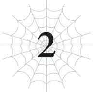
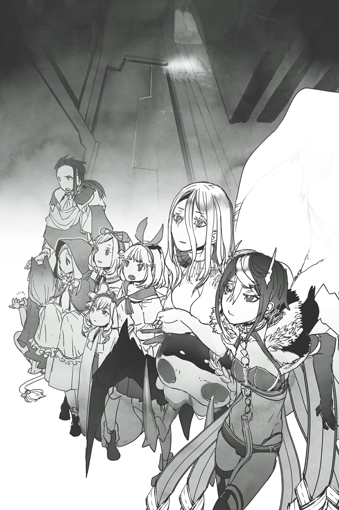

# Chương 2: Tấn công tổ kiến
*(Attack on the Ant Hole)*

---

Cái gọi là thế giới kỳ ảo này thực chất lại là một thế giới hậu tận thế.

Khi Dơi con nhận ra điều này, con bé trông giống như kiểu cuối cùng cũng đã vỡ lẽ ra mọi chuyện.

Nó chắc chắn giải thích được rất nhiều điều.

Thật sự thì, nếu suy nghĩ kỹ lại, đã có rất nhiều dấu hiệu đáng ngờ từ trước rồi.

Đặc biệt là cơ thể cyborg nửa người nửa máy của Potimas.

Mặt khác, Mera lại có vẻ đang gặp khó khăn trong việc tiêu hóa đống thông tin này.

Không giống như Dơi con và tôi, Mera vốn sinh ra ở thế giới này, thế nên việc anh ta có thể theo kịp tất cả những khái niệm mới như máy móc và công nghệ là rất khó khăn, khi mà thậm chí anh ta còn chẳng thể hình dung nổi chúng trông như thế nào.

Trăm nghe không bằng mắt thấy, người ta vẫn thường nói thế mà lị.

Tuy vậy, anh ta có vẻ đang cố hết sức để hiểu được những lời của Ma Vương dù chẳng có mấy cơ sở để hình dung, và thực ra việc anh ta không hoàn toàn hiểu hết cũng chẳng phải vấn đề gì quá to tát.

Dù sao thì chúng tôi cũng đang nói về chuyện của một quá khứ xa xôi mà thôi. Nó cũng chẳng thực sự ảnh hưởng gì đến hiện tại của chúng tôi cả.

...Ít nhất, ban đầu tôi đã nghĩ như thế.

Nhóm Ma Vương đi bộ qua hoang mạc hoang vắng vào lúc giữa đêm.

Nói kiểu đó nghe cứ như thể cô ta đang dẫn đầu đoàn quân hành tiến ấy nhỉ.

Nhưng trên thực tế, chúng tôi trông giống như một nhóm các cô gái trẻ và một anh chàng hơn. Mera trông có vẻ lớn tuổi nhất trong số cả đám, nhưng dĩ nhiên Ma Vương thực chất mới là người già nhất ở đây, già hơn rất nhiều là đằng khác.

Về ngoại hình, tôi đoán mình trông lớn thứ hai sau anh ta.

Nhưng điều đó không có nghĩa là tôi trông già đâu nhé! Tôi chỉ đang so sánh với một Ma Vương bé hạt tiêu, lũ nhện rối, và con nhóc ma cà rồng chập chững kia thôi!

Gương mặt tôi vẫn y hệt như ở kiếp trước, nghĩa là tôi trông giống như một nữ sinh trung học, được chứ?!

Nói nghiêm túc thì, bạn sẽ tự đào huyệt chôn mình nếu dám nói một nữ sinh trung học trông già đấy.

Nhân tiện, dù vẻ ngoài là thế, tuổi thực của tôi ở thế giới này cũng chỉ xấp xỉ tuổi của Dơi con mà thôi, nên tôi vẫn là trẻ vị thành niên đấy nhé.

Không giống như Ma Vương kia, người trông có vẻ như trẻ con nhưng tuổi đời chắc chắn phải gấp ít nhất một ngàn lần độ tuổi trưởng thành hợp pháp!

...Ủa mà tôi đang nói về cái gì vậy nhỉ? Tự dưng lại bị lan man quá rồi.

Khi tâm trí tôi đang bay bổng, sự chú ý của tôi đột ngột bị kéo lại.

Có thứ gì đó vừa lọt vào phạm vi [Phát hiện] của tôi.

Tôi sử dụng [Vạn Lý Nhãn] để liếc nhìn xem đó là cái gì.

Ban đầu, trông nó chỉ giống như một con chim bình thường, nhưng nó không thể đánh lừa được kỹ năng [Phát hiện] của tôi.

Đó là một thiết bị giám sát không người lái cơ khí có hình dạng một con chim.

Chỉ có duy nhất một người sẽ sử dụng thứ như thế mà thôi.

Chắc chắn đó là thiết bị giám sát do Potimas phái tới.

Tôi kích hoạt [Bóp Méo Tà Nhãn] thông qua [Vạn Lý Nhãn] của mình.

Không gian xung quanh thiết bị hình chim bị bóp méo, vặn xoắn và phá hủy mọi thứ bên trong. Bao gồm cả con chim giám sát kia.

Ma Vương liếc nhìn tôi trong khi vẫn đang dẫn đầu dàn đồng ca gồm ma cà rồng và lũ nhện rối.

Tôi gật đầu nhẹ, và cô ta cũng gật đầu lại.

Lý do tôi biết Potimas không hề ngồi không là vì những thiết bị giám sát này cứ xuất hiện định kỳ.

Và chuyện này đã tiếp diễn kể từ khi chúng tôi bắt đầu hành trình sau khi Ma Vương đánh bại Potimas.

Lần nào tôi cũng phá hủy chúng trước khi chúng kịp tiếp cận.

Nếu không, hắn sẽ thu thập được thông tin về chúng tôi.

Bằng cách phá hủy chúng, tôi cũng vô tình làm lộ vị trí xấp xỉ của nhóm mình, nhưng dù sao thì chuyện đó cũng sẽ xảy ra nếu tôi cứ mặc kệ lũ drone kia và để chúng nhìn thấy chúng tôi.

Tốt hơn hết là cứ phá hủy chúng để giữ cho lượng thông tin Potimas thu thập được ở mức thấp nhất có thể.

Mặc dù con số lý tưởng dĩ nhiên phải là bằng không rồi.

Chúng tôi cũng đang cố gắng hết sức để giữ cho nó ở mức đó đấy, hiểu không?

Đó là lý do tại sao chúng tôi toàn đi những con đường cách xa các khu vực văn minh như thế này, nhằm tránh khỏi tầm mắt của hắn.

Nhưng để Mera có thể duy trì thể lực, thỉnh thoảng chúng tôi vẫn phải ghé qua một thị trấn hoặc làng mạc nào đó.

Trong những tình huống như thế, việc không bị phát hiện hoàn toàn là điều bất khả thi.

Thỉnh thoảng Potimas dường như mất dấu chúng tôi, và các drone giám sát sẽ ngừng xuất hiện trong một thời gian dài. Nhưng vào lúc đó, hắn thường dùng đến hạ sách là rải drone khắp mọi nơi mà chúng tôi có khả năng đi qua chỉ để tìm lại dấu vết.

Mà cũng không chỉ riêng gì Potimas. Ma Vương bảo rằng Giáo hoàng của Thần Ngôn Giáo cũng từng định vị được cô ta bằng những phương pháp tương tự.

Khoảnh khắc chúng tôi quyết định lấy lãnh thổ ma tộc làm điểm đến, các lộ trình khả thi mà chúng tôi có thể đi một cách hợp lý chắc chắn đã bị giới hạn đi rất nhiều.

Dù có cố gắng tránh bị phát hiện đến đâu, chúng tôi cũng chỉ có thể duy trì được trong một khoảng thời gian nhất định mà thôi.

Con drone mới nhất này là thiết bị giám sát đầu tiên tìm thấy chúng tôi sau một thời gian dài.

Tôi đoán Potimas đã đưa vùng đất hoang này vào tầm ngắm từ trước. Vì chúng tôi luôn tránh xa những nơi đông dân cư, hắn có lẽ đã đoán trước được rằng chúng tôi sẽ đi qua đây và thiết lập giám sát sẵn từ trước.

Dù vậy, ngay cả khi hiện giờ đã biết vị trí tương đối của chúng tôi, cũng không phải là hắn có thể hành động ngay lập tức.

Dựa vào những hành động của hắn từ trước đến nay và những lời hắn nói khi tôi đụng độ hắn tại dinh thự của Dơi con, Potimas có vẻ là kiểu người lên kế hoạch vô cùng cẩn mật trước khi ra tay. Ngoài ra, hắn còn rất keo kiệt nữa.

Hắn sẽ không khơi mào bất kỳ trận chiến nào mà mình có khả năng thua.

Và vì chúng tôi có Ma Vương siêu mạnh ở bên cạnh, hắn sẽ không dại gì đuổi theo chúng tôi mà không có một kế hoạch chắc thắng.

Đặc biệt là khi hắn thậm chí còn không thể do thám chúng tôi một cách trơn tru bằng các thiết bị giám sát của mình.

Nếu hắn có tấn công chúng tôi, đó sẽ là lúc hắn hoàn toàn tự tin rằng mình có thể thắng.

Chuyện đó có lẽ sẽ xảy ra khi hắn tập hợp đủ sức mạnh để hạ gục Ma Vương, hoặc nếu có sự cố gì đó đẩy chúng tôi vào tình thế nguy cấp thực sự.

Nếu Potimas thực sự có đủ lực lượng quân sự để đánh bại chúng tôi một cách trực diện, thì coi như chúng tôi xong đời. Chiến thắng duy nhất còn sót lại cho chúng tôi lúc đó chỉ là chạy trốn thành công mà thôi.

Nhưng tôi không nghĩ chuyện lại như thế.

Tìm được thứ gì đó có thể vượt qua sức mạnh của Ma Vương không phải chuyện dễ dàng, và nếu Potimas thực sự có con át chủ bài như thế giấu trong tay áo, hắn hẳn đã ra tay từ tám đời nhà nào rồi.

Vì hắn vẫn chưa làm vậy, tôi đành phải giả định rằng hoặc là ngay từ đầu hắn không có sức mạnh đó, hoặc là có nhưng lại ngần ngại không muốn dùng.

Điều đáng sợ là vế sau rất có thể là sự thật. Gã đó keo kiệt đến mức thậm chí không chịu sử dụng khẩu súng máy của mình trong trận chiến với chúng tôi vì ghét lãng phí đạn dược. Thế nên việc hắn giấu hàng cũng chẳng có gì là khó tin cả.

Nhưng lo lắng về việc hắn có vũ khí bí mật nào đó hay không cũng chẳng để làm gì.

Tất cả những gì chúng tôi có thể làm là cẩn thận và không cho hắn cơ hội ra tay.

Chừng nào Potimas còn nghĩ việc tấn công chúng tôi là quá rủi ro, hắn sẽ càng ít có khả năng thử làm bất cứ điều gì.

Nếu tôi cứ tiếp tục phá hủy các drone giám sát của hắn, chuyện đó sẽ tạo ra ấn tượng rằng chúng tôi không hề lơ là cảnh giác... Tôi hy vọng thế.

Với kỹ năng [Phát hiện] của mình, tôi có thể nhận biết được bất cứ thứ gì đang tiếp cận trước khi chúng kịp đến quá gần, nghĩa là chúng tôi luôn nắm thế chủ động, bất kể là phủ đầu một con bot do thám hay một kẻ có ý định tấn công.

Dò tìm bằng [Phát hiện], xác định bằng [Vạn Lý Nhãn], rồi tấn công bằng một trong các [Tà Nhãn] của mình.

Nếu đối thủ trông có vẻ đặc biệt rắc rối, tôi chỉ cần thay vì tấn công bằng cách bỏ chạy thông qua [Dịch chuyển].

Thành thật mà nói, ở thời điểm này thì kẻ địch khó lòng mà tiếp cận được tôi lắm.

[Phát hiện] thậm chí còn có thể cảm nhận được dấu hiệu của một đòn [Dịch chuyển] đang tới trước khi nó kịp xảy ra.

Được rồi, có lẽ một Ma Vương nào đó từng lừa được tôi bằng cách di chuyển nhanh đến mức [Phát hiện] còn không kịp nhận ra, nhưng đó chỉ là ngoại lệ thôi nhé, được chứ? Một ngoại lệ siêu hiếm hoi!

Hơn nữa, phạm vi [Phát hiện] của tôi đã được cải thiện rất nhiều kể từ đó rồi.

Đến thời điểm này, tôi nghĩ mình sẽ nhận ra ngay cả khi có ai đó tiếp cận với tốc độ ngang tầm ma vương!

Mặc dù việc tôi có kịp chạy thoát hay không lại là chuyện khác!

Mà nhắc mới nhớ, tôi có thể dùng Ma Vương làm mồi nhử trong khi mình co giò chạy trốn cơ mà.

Nhưng phạm vi [Phát hiện] của tôi rất rộng, và tốc độ của tôi thì nhanh kinh hoàng, thế nên tôi tự tin rằng mình có thể trốn thoát khỏi hầu hết mọi đối thủ nếu bắt buộc phải làm vậy.

Nhân tiện, hóa ra lý do phạm vi [Phát hiện] của tôi tăng lên mặc dù nó vốn đã đạt cấp tối đa nhờ kỹ năng siêu lỗi [Trí Tuệ], tất cả là vì trước đây tôi sử dụng [Phát hiện] chưa được tốt cho lắm.

Thực ra, dùng từ ở thì quá khứ có lẽ không đúng lắm. Hiện tại tôi vẫn chưa tận dụng hết tiềm năng tối đa của [Phát hiện] đâu.

[Phát hiện] là một kỹ năng điên rồ, tích hợp tất cả các kỹ năng dạng cảm nhận làm một.

Nhưng kết quả là, hiệu suất của nó cao đến mức tôi thậm chí không thể xử lý hết tất cả thông tin ùa vào cùng một lúc.

Giống như cách con người không thực sự chú ý đến mọi thứ trong tầm mắt của mình, bộ não của tôi cũng tự động đào thải những thông tin có vẻ không cần thiết, như số lượng đá trên lề đường chẳng hạn.

Thực tế là, nếu tôi không làm vậy, tôi sẽ bị đau đầu do quá tải thông tin.

Nhưng hóa ra, phạm vi về cơ bản chỉ bị giới hạn bởi lượng thông tin tôi có thể xử lý được mà thôi.

Nói cách khác, nếu tôi xử lý được nhiều hơn, phạm vi của tôi sẽ tự động mở rộng tương ứng.

Nhưng nói thì dễ hơn làm nhiều.

Kỹ năng liên quan rõ ràng nhất của tôi là [Xử Lý Tốc Độ Cao] đã đạt cấp tối đa rồi. Lựa chọn duy nhất còn lại bây giờ là tự nâng cao năng lực xử lý bẩm sinh của bộ não mà không phụ thuộc vào kỹ năng nữa.

Thế nên tôi phải rèn luyện bộ não vốn đã được kỹ năng cường hóa này thêm nhiều hơn nữa.

Nó giống như việc bắt một bậc thầy bàn tính phải tính toán giỏi hơn vậy đó!

Đó không phải là thứ bạn có thể làm được trong một sớm một chiều.

Vì vậy, tôi đã cố gắng tự động ngăn chặn mọi chi tiết thừa thãi và chỉ tập trung lọc lấy những thông tin quan trọng nhất.

Nếu muốn, tôi vẫn có thể kiểm tra những thông tin đã bị lọc đi kia, nhưng tập trung cao độ như vậy mệt lắm.

Ví dụ như ngay lúc này đây. Nếu tôi thực sự muốn, tôi có thể nhận biết được rằng có một loại hang động ngầm nào đó ở ngay đây.

Hử? Hang động ngầm á?

Sao thứ này lại ở đây nhỉ?

Nhưng ngay khi tôi vừa kịp nhận ra nó, Mera đã bước chân lên ngay phần mặt đất nằm phía trên cái hang động đó.

Trong khi vẫn đang phải chịu đựng áp lực từ trọng lực gia tăng do [Xích Lực Tà Nhãn] của tôi áp lên người.

Tôi chỉ kịp phát ra một tiếng "tiêu rồi" trong đầu trước khi Mera đạp sập mặt đất và bắt đầu rơi xuống dưới.

Lớp bề mặt mỏng phía trên hang động không thể chịu nổi sức nặng tăng thêm đó.

Ma Vương và những người khác ngừng luyện giọng và quay lại.

Nhìn xuống đống đổ nát, tôi có thể thấy Mera vẫn an toàn không một vết xước.

Với chỉ số đã được nâng cao, việc rơi xuống một cái hố chẳng thể làm anh ta bị thương nổi.

Nhưng vẫn còn quá sớm để thở phào nhẹ nhõm.

Tôi cảm nhận được có thứ gì đó đang tiếp cận Mera ở trong hố.

Một con kiến!

Và không chỉ là kiến thường đâu—con này to gần bằng người cơ đấy.

Hóa ra cái hang động này thực chất là một phần tổ của loài quái vật dạng kiến.

Từng con một bắt đầu tiến về phía Mera, kẻ đột nhập đã phá hoại tổ ấm của chúng.

Dù vậy, lũ kiến này không mạnh cho lắm. Chỉ số của chúng chỉ vừa qua ba chữ số, nên Mera hoàn toàn có thể tự mình đối phó được. Đúng là số lượng có hơi đông, nhưng tôi nghĩ Mera vẫn dư sức xử lý.

Hừm. Có lẽ tôi nên để anh ta tự mình chiến đấu với lũ kiến để lên cấp nhỉ.

Nhưng trước khi tôi kịp thực hiện kế hoạch hoàn hảo của mình, một trong những con nhện rối—Ael, con bé được coi là chị cả trong bốn chị em nhện rối—đã nhảy tót ngay xuống hố.

Ael là đứa năng nổ nhất trong số các nhện rối và về cơ bản đã trở thành thủ lĩnh của chúng.

Xu hướng hành động nhanh nhảu đoảng của con bé đồng nghĩa với việc nó cũng có thói xấu là hay giật hết hào quang của người khác.

Đó là chưa kể đến những miếng thịt ngon nhất mỗi khi chúng tôi ăn tối đấy nhé!

Nói cách khác, con bé là đối thủ truyền kiếp của tôi mỗi khi đến giờ ăn!

Nhưng ngoại trừ việc đó ra, nó rất thông minh và đáng tin cậy.

Chẳng hạn như việc nó đang lao xuống giúp Mera lúc này đây.

...Con bé làm vậy là để giúp anh ta, chứ không phải vì muốn cướp điểm kinh nghiệm đâu đúng không?

Biết tính cách ranh mãnh của Ael thì chuyện đó hoàn toàn có thể xảy ra lắm chứ.

Ael đáp đất ngay trên đầu một con kiến khổng lồ, giẫm nát bét đầu nó.

Sau đó, con bé rút một thanh kiếm của mình ra và thực hiện một đường chém ngọt lịm, chẻ đôi một con kiến khác trong tích tắc.

Theo chân Ael, lũ nhện rối khác cũng chạy đến bên miệng hố.

Riel và Fiel nhảy xuống ngay lập tức, theo sau là Sael sau một thoáng ngập ngừng.

Sael thì hoàn toàn trái ngược với Ael, một cô nhóc nhút nhát được đối xử như em út trong nhà.

Trông con bé có vẻ e dè khi tấn công lũ kiến dù bản thân mạnh hơn chúng rất nhiều, khiến người ta cũng hơi lo ngại một chút.

Và thế là, cuộc thảm sát bắt đầu.

Ý tôi là, lũ nhện rối thực chất là những con quái vật đáng sợ với chỉ số mỗi đứa đều vượt quá một ngàn điểm.

Chỉ số của lũ kiến thì lẹt đẹt ba chữ số, nên bảo sao chúng không có lấy một cơ hội chống cự.

Sael cứ liên tục phát ra những tiếng kêu sợ hãi khi chiến đấu, nhưng đó chỉ là vì con bé đang hoảng loạn tinh thần thôi chứ không phải vì gặp khó khăn gì cả.

Những lưỡi kiếm của lũ nhện rối chém chuối băm vằm lũ kiến chỉ trong nháy mắt.

Kết quả là, dù Mera đã kịp tuốt kiếm ra, anh ta vẫn chưa có cơ hội được vung nó lần nào.

Bốn cô nhóc nhện rối đập tay ăn mừng trên đỉnh đống xác kiến chất thành núi.

Cảnh tượng này siêu thực đến mức kỳ quặc.

Tôi cảm thấy hơi tội nghiệp cho Mera và thanh kiếm chưa kịp dùng của anh ta.

Dù sao thì, tôi cũng đi xuống hố để thu gom xác kiến.

Khi cất xác lũ kiến vào [Lưu trữ Không gian], tôi sử dụng [Phát hiện] để thăm dò tình hình sâu hơn dưới lòng đất.

Cái tổ kiến này rộng hơn tôi nghĩ rất nhiều. Nó thực chất to ngang ngửa một mê cung cỡ nhỏ.

Lũ nhện rối đã quét sạch toàn bộ kiến ở khu vực lân cận, nhưng sâu hơn bên trong tổ vẫn còn rất nhiều.

Nhân tiện, loài quái vật kiến này được gọi là efejicote.

Suy nghĩ một lúc, tôi nhận ra cái tên đó nghe khá giống với loài quái vật ong ở Mê cung Lớn Elroe. Nếu tôi nhớ không lầm thì chúng được gọi là finjicote.

Kiến và ong... Tôi đoán chúng cũng có nét tương đồng, nhưng mà thế này chẳng phải hơi kỳ lạ sao?

Trong lúc đang suy nghĩ vẩn vơ về mấy chuyện vô bổ đó, tôi tiếp tục dùng [Phát hiện] để dò quét sâu hơn và sâu hơn nữa.

Và rồi tôi tình cờ phát hiện ra một thứ khá thú vị.

“Đúng là không may mắn chút nào. Anh có sao không?”

“Vâng, tôi ổn, cảm ơn ngài.”

“Vậy thì tốt quá. Thế giờ có muốn lên lại không?”

Mera bám vào sợi tơ do Ma Vương thả xuống và bắt đầu leo lên.

Nhưng thay vào đó, tôi lại bắt đầu rảo bước đi xuống con đường dẫn vào sâu trong tổ kiến.

“Hở? White? Cô đi đâu thế?”

Bỏ ngoài tai tiếng gọi của Ma Vương, tôi tiếp tục tiến sâu xuống đường hầm.

Tôi có thể cảm nhận qua [Phát hiện] rằng những người còn lại đang trao nhau những ánh nhìn bối rối phía sau lưng tôi.

Nhưng khi thấy tôi không hề dừng lại, họ vội vàng đuổi theo.

“Này, đồng chí êii? Nghe tôi nói không hả White? Sao tự dưng lại đi hướng đó thế hửửử?”

Đừng có nói chuyện với tôi lúc này. Tôi đang cần tập trung ở đây đấy.

Hừm. Vẫn chưa chạm tới được.

Tôi đang ở quá xa nên chưa thể xác định chính xác nó là cái gì.

Sẽ phải đi xuống sâu hơn nữa.

Tôi sử dụng [Thổ Ma pháp] để đào một cái hố đi thẳng xuống dưới.

Đường hầm thẳng đứng này dẫn đến một nơi khác chứ không phải là tổ kiến.

Tôi nhảy tót xuống dưới.

Khi đáp xuống, tôi bị bao vây bởi hàng tá con kiến.

Tôi không hẳn là đọc được nét mặt của lũ kiến đâu, nhưng trông chúng có vẻ khá là ngạc nhiên đấy.

Sử dụng [Nguyền Rủa Tà Nhãn], tôi lập tức kết liễu lũ kiến trong tích tắc.

Sau đó, sau khi nhanh chóng tống hết đống xác vào [Lưu trữ Không gian], tôi lại dùng [Thổ Ma pháp] đào thêm một cái hố nữa hướng thẳng xuống dưới.

Cứ thế lặp đi lặp lại.

Tại tầng dưới cùng, tôi giết chết con kiến chúa và đám kiến hộ vệ của nó, nhưng chúng quá yếu so với tôi nên thực tế cũng chẳng khác gì lũ kiến thường là bao.

“Cô đang làm cái gì thế hả White? Tôi không chắc là cô có nên đi phá hủy hệ sinh thái một cách ngẫu nhiên như thế này không đâu nhé.” Ma Vương đuổi kịp tôi, che giấu sự bối rối của mình bằng một câu đùa mỉa mai.

Cũng không phải là tôi đặc biệt muốn giết lũ kiến này đâu, được chứ?

Chúng chỉ tình cờ ngáng đường nên tôi dọn dẹp luôn thôi, thế thôi mà.

“Thôi nào. Chúng ta quay lại thôi.”

Ma Vương cố gắng dẫn tôi trở lại phía trên, nhưng tôi vẫn chưa xong việc đâu.

Mục tiêu của tôi vẫn còn ở sâu hơn nữa dưới lòng đất cơ.

Tôi đào thêm một cái hố bằng [Thổ Ma pháp] dẫn xuống phía dưới khu vực của kiến chúa ở đáy tổ kiến.

“Cái gìíí?”

Nhận ra tôi đang đi xuống sâu hơn nữa, Ma Vương phát ra một tiếng rên rỉ đầy bực bội.

Những người khác trông có vẻ ít ngán ngẩm tôi hơn, nhưng họ lại lo lắng rằng đầu óc tôi có vấn đề.

Dù thế nào đi nữa, tôi lờ tất cả bọn họ đi và tiếp tục đào sâu xuống dưới.

Khi bám theo tôi, khuôn mặt của Ma Vương dần trở nên nghiêm túc hơn. Tôi đoán cô ta đã nhận ra điều gì đó rồi.

“White, chuyện này không phải là...” Giọng cô ta nghe khẩn trương hơn hẳn trước đó.

Nhận thấy sự thay đổi thái độ đột ngột của cô ta, những người khác cũng trở nên nghiêm túc theo, có lẽ đã nhận ra tôi không hề làm việc này chỉ để cho vui.

Tất cả những gì tôi làm là tiếp tục đào sâu xuống đất.

Ma Vương đi theo tôi mà không đưa ra bình luận nào thêm, theo sát phía sau cô ta là Mera, Dơi con, và lũ nhện rối.

Rồi, sau khi đào không biết bao lâu, cuối cùng tôi cũng chạm tới được nó.

Tại đó, ở một nơi sâu hơn hẳn phần đáy của tổ kiến, mục tiêu của tôi đã lộ diện.

“Cái...?”

Ngay khi nhìn thấy nó, Dơi con lẩm nhẩm trong kinh ngạc.

Tôi phải thừa nhận là mình hiểu được cảm giác của con bé.

Bởi vì đây là thứ mà bạn sẽ không bao giờ nghĩ rằng mình sẽ được nhìn thấy ở nơi này.

Tôi sử dụng [Thổ Ma pháp] của mình để dọn sạch đống đất cát đang che phủ nó.

Trước mắt chúng tôi là một cánh cửa.

Một cánh cửa kim loại, hoàn toàn khác biệt với bất cứ thứ gì tôi từng thấy ở thế giới này.

Có lẽ ở những nơi khác vẫn có thể tìm thấy cửa kim loại, nhưng chắc chắn không có cái nào được chế tác một cách hoàn hảo đến mức này cả.

Thế giới này không có công nghệ để sản xuất ra một thứ tiên tiến như vậy.

Lại càng không thể lắp đặt nó ở một nơi sâu hoắm dưới lòng đất như thế này.

Vì vậy, chúng tôi đứng đó, trước một cánh cửa không nên tồn tại.

Hoàn toàn lạc nhịp với trình độ công nghệ hiện tại của thế giới này.

Nền văn minh duy nhất có thể chế tạo ra thứ này chỉ có thể là nền văn minh đã sụp đổ từ lâu mà thôi.

Chúng tôi đã tình cờ tìm thấy tàn tích của một thứ do nền văn minh cổ đại chế tạo ra, thứ mà Ma Vương đã kể với chúng tôi, nền văn minh đã tự hủy diệt chính mình từ xa xưa.

---

[◀ Chương trước: Chương 1: Báo cáo tiến độ hành trình xuyên đại lục](01_transcontinental_journey_progress_report.md) | [Chương tiếp theo: Chương 3: Phát hiện tàn tích cổ đại! ▶](03_ancient_ruins_discovered.md)
