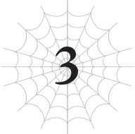
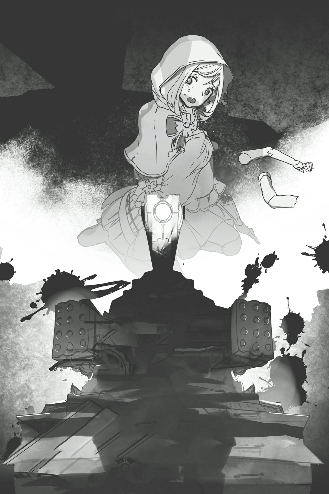
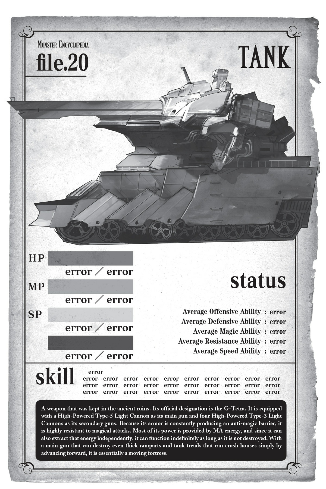

# Chương 3: Phát hiện tàn tích cổ đại!
*(Ancient Ruins Discovered!)*

---

Chúng tôi đang đứng trước cánh cửa kim loại này.

Ừm... Giờ sao nữa?

Tôi đã quá tập trung vào việc đào sâu xuống và tìm ra nó đến nỗi không thực sự nghĩ xem nên làm gì sau khi đã đến được đây.

Thành thật mà nói, tôi hơi muốn đi ngược lên lại và quên phắt nó đi cho rồi.

Ý tôi là, chuyện này chắc chắn chẳng phải điềm lành gì, đúng chứ?

Thôi nào — nghĩ thử xem. Tàn tích của một nền văn minh được cho là đã mất tích?

Có bao giờ chuyện đó kết thúc tốt đẹp đâu?

Cái gì, bộ chúng tôi định cứ thế thong dong bước vào đó để tìm kiếm chuyến phiêu lưu và/hoặc kho báu ẩn giấu chắc?

Không, xin miễn! Nghe kinh dị quá!

Hơn nữa, tàn tích này bằng cách nào đó đã né tránh được kỹ năng [Phát hiện] của tôi.

Lý do duy nhất tôi có thể tìm thấy nó ngay từ đầu là vì tôi cảm nhận được một khu vực kỳ lạ dưới lòng đất mà [Phát hiện] không thể chạm tới.

Vì bất kỳ lý do gì, có thể là do vật liệu xây dựng hay gì đó tương tự, tôi không thể cảm nhận được bất cứ thứ gì trong khu vực này bằng [Phát hiện].

Chính điều đó đã khơi dậy sự tò mò của tôi ngay từ đầu.

Đáng ngờ thật đấy. Thực sự đáng ngờ cực kỳ.

Mà tàn tích này làm cái quái gì ở sâu dưới lòng đất như thế này ngay từ đầu chứ?

Lại còn nằm ngay dưới vùng đất hoang do rồng cai trị này nữa!

Sự tồn tại của nền văn minh cổ đại này là điều cấm kỵ ở thế giới này. Nếu loài rồng biết về nó, chúng hẳn đã phá hủy nó hay làm gì đó rồi.

Vì chúng chưa làm vậy, nghĩa là ngay cả rồng cũng chưa tìm ra nơi này.

Nên bằng cách nào đó, nó vẫn được ẩn giấu ngay giữa lãnh thổ của loài rồng không biết đã bao lâu rồi.

Hoặc là lũ rồng ngu ngốc, hoặc là tàn tích này được che giấu quá tốt.

Tôi hy vọng là vế sau.

Mà thực ra, không, tôi đoán là đằng nào cũng tệ cả.

Nếu là vế trước, tôi sẽ phải lo lắng cho vận mệnh của thế giới này, còn nếu là vế sau, thì chúng tôi đang gặp nguy hiểm chỉ bằng việc đứng ở đây.

*XOẢNG!* Trong trường hợp độ nguy hiểm như thế vẫn chưa đủ, Ma Vương đã dùng vũ lực mở toang cánh cửa ra luôn!

Dĩ nhiên rồi, cô ta kiểu gì chẳng làm thế.

Biết tính Ma Vương thì cô ta không đời nào ngó lơ sự tồn tại của khu tàn tích cực kỳ khả nghi này được.

Ư, xem ra không trốn tránh được rồi.

Nhất là vì còi báo động đã bắt đầu rú vang ngay khoảnh khắc cánh cửa bị phá!

Một tiếng *BÍP! BÍP!* chói tai vang vọng từ bên trong, không lẫn đi đâu được là tiếng chuông báo động.

Bất chấp tiếng ồn khó chịu đó, Ma Vương bước thẳng vào trong.

Haiz, tôi đoán là không quay đầu lại được nữa rồi.

“Tất cả chuẩn bị sẵn sàng cho mọi tình huống.”

“Cô Ariel, đây là...?”

“Ừ. Tàn tích của nền văn minh cổ đại đó. Ta không nghĩ là còn thứ gì như thế này tồn tại đâu, nên chúng ta sẽ phải điều tra kỹ. Không biết thứ gì có thể xuất hiện ở trong này, nên hãy cảnh giác.”

Ma Vương dẫn đầu, theo sau là Dơi con, Mera, và lũ nhện rối.

Không còn lựa chọn nào khác, tôi cũng bước vào theo họ, đi qua cánh cửa đổ nát để tiến vào tàn tích.

Kỳ lạ thay, bên trong là một hành lang sạch sẽ và đồng bộ đến mức dường như không phù hợp để gọi là tàn tích.

Nó có thiết kế tạo cảm giác rất dịu mắt, hoặc ít nhất là sẽ như vậy nếu không có tiếng còi báo động siêu phiền phức kia.

Chao ôi, cái còi báo động đó thực sự đang bắt đầu thử thách giới hạn chịu đựng của tôi rồi đấy.

Vì nó vẫn hoạt động, điều đó nghĩa là tàn tích này vẫn đang hoạt động.

Khu tàn tích siêu cổ đại ẩn sâu dưới lòng đất này vẫn đang vận hành trơn tru.

Nó lấy năng lượng từ đâu để làm việc đó chứ?

Ôi, tôi có linh cảm cực kỳ xấu về chuyện này.

Như để xác nhận những nghi ngờ của tôi, các bức tường đột ngột nứt ra, để lộ những ống xi-lanh dài và mỏng.

Vâng, đó chắc chắn là họng súng. Tuyệt vời! Thật là tuyệt vời làm sao!

Vài họng súng thò ra từ tường, tất cả đều chĩa thẳng về phía chúng tôi.

Ngay giây tiếp theo, một tiếng gầm rú vang dội bên tai tôi.

Các họng súng đang phun lửa — khoan đã, không, đó là âm thanh Ma Vương đập nát tất cả chúng.

Cô ta sử dụng những sợi tơ kéo dài từ các đầu ngón tay của mình, điều khiển chúng như những cây roi để đập gãy mọi nòng súng.

Tốc độ vung tơ của cô ta nhanh đến mức tôi tin rằng ngoài tôi ra thì chẳng ai có thể nhìn kịp.

Đúng như dự đoán, Dơi con và Mera chỉ biết há hốc mồm ngơ ngác, rõ ràng không biết chuyện gì vừa xảy ra. Xem ra ngay cả lũ nhện rối cũng không thể hoàn toàn bắt kịp chuyển động của cô ta.

Tôi lặng lẽ hủy bỏ ma pháp mình đang chuẩn bị dở.

Tôi cũng có thể đập nát tất cả chúng mà, được chứ?

Tôi chỉ nhún nhường nhường cho Ma Vương giải quyết lần này vì cô ta là người lớn tuổi nhất thôi đấy, được chứ?

Không phải tôi bỏ lỡ cơ hội vì lỡ chọn dùng ma pháp tốn quá nhiều thời gian để kích hoạt đâu đấy nhé, được chứ?

Tôi cũng chẳng thèm giận vì bị cô ta giật mất đất diễn đâu đấy nhé, được chứ?

Được chứ? Được chứ? Được rồi.

...Thôi được, tôi nên dừng việc tự nổi giận vì mấy chuyện không đâu này lại.

Sự đón tiếp nồng hậu mà chúng tôi vừa nhận được chỉ chứng minh một điều duy nhất là ở đây có thứ gì đó không muốn cho kẻ đột nhập nhìn thấy. Biện pháp phòng thủ như thế này là quá mức cần thiết đối với việc bảo vệ thông thường rồi.

Phải, tôi khá chắc bản năng của mình đã đúng hoàn toàn.

Nhưng thật không may, có vẻ như chúng tôi vẫn phải tự mình đi xác nhận điều đó.

Nhận thấy một khẩu súng tương đối nguyên vẹn trong đống đổ nát, tôi nhặt nó lên để săm soi.

Nó khá nặng và trông rất giống một khẩu súng máy.

Vì không được vận hành bởi con người nên nó không hề có cò súng ở bất cứ đâu.

*ĐOÀNG!* Một chấn động đập thẳng vào trán tôi, khiến đầu tôi ngửa bật về phía sau.

Có vẻ như việc tôi hí hoáy nghịch ngợm đã khiến nó bị cướp cò.

Nhờ có [Vô hiệu Đau], tôi không cảm thấy đau cho lắm, nhưng tôi không thể không cảm thấy nhục nhã vì đã làm một trò ngu xuẩn như vậy, và bực mình với khẩu súng đã gây ra rắc rối ngay từ đầu.

“Cô làm cái quái gì thế hả White?”

Ma Vương đang nhìn tôi chằm chằm, nhướng mày lên.

Khốn kiếp! Cô ta đã thấy tôi làm một trò đáng xấu hổ như thế rồi!

Ban đầu, tôi còn lo Dơi con sẽ cười nhạo mình, nhưng con bé lại mải ngây người nhìn tôi chăm chăm, há hốc mồm kinh ngạc vì tôi vẫn bình an vô sự sau khi bị bắn.

Ồ. Phải rồi, nghĩ lại cũng hợp lý.

Lần trước, con bé đã thấy Potimas bắn tôi nát bét như tổ ong, nên chắc chắn đang tự hỏi tại sao giờ tôi lại không sao.

Nhưng lúc đó đạn gây sát thương được cho tôi chỉ là vì kết giới thần bí của Potimas đã kéo chỉ số phòng ngự của tôi xuống mà thôi. Bình thường phòng ngự của tôi cao đến mức đạn bắn vào chỉ có nước nảy ra ngoài.

Đúng như dự đoán, khi tôi đưa tay lên sờ trán, chỗ đó thậm chí còn chẳng có lấy một vết xước.

Mặc dù có lẽ nó hơi bị ửng đỏ một chút.

Nhưng chuyện đó không quan trọng lúc này!

Vấn đề ở đây là thứ này là một khẩu súng, đúng y như tôi đã nghĩ.

Súng ống là công nghệ cổ đại đáng lẽ ra phải biến mất hoàn toàn khỏi thế giới này rồi.

Giờ thì chúng tôi có thể chắc chắn tàn tích này thuộc về nền văn minh cổ đại, và mức độ nguy hiểm của nó đủ để tiễn đưa những kẻ đột nhập về chầu ông bà trong vòng một nốt nhạc!

Làm tốt lắm, tôi ơi! Tôi đã đúng! Tôi đã đúng rồi, khốn kiếp thật!

Tệ hơn nữa, những viên đạn mà khẩu súng đó bắn ra không phải đạn vật lý thông thường.

Chúng được tạo ra từ một loại năng lượng phát sáng kỳ lạ, giống hệt loại Potimas từng dùng.

Những viên đạn này chắc chắn không mạnh bằng của Potimas, nhưng tôi đoán chúng được chế tạo bằng công nghệ tương tự.

Liếc nhìn Ma Vương, tôi thấy cô ta đang nhíu mày, có lẽ cũng đã đi đến kết luận giống tôi.

“Đi vào trong thôi.”

Tôi gật đầu đồng ý một cách vô cùng miễn cửng.

Chúng tôi tiếp tục đi dọc hành lang, nơi quá đỗi hiện đại để có thể thuộc về thế giới này.

Dĩ nhiên, chúng tôi vẫn phải đề phòng những khẩu súng có thể đột ngột nhô ra từ tường cũng như bất cứ thứ gì khác có thể đang rình rập ở đây.

Ma Vương dẫn đầu, theo sau là Dơi con và Mera được kẹp giữa lũ nhện rối ở hai bên, còn tôi bọc hậu ở phía sau cùng.

Đội hình này được thiết lập để bảo vệ Dơi con và Mera, những người chưa sẵn sàng chiến đấu bằng các thành viên còn lại của nhóm.

Bằng cách đó, miễn là không có chuyện gì quá điên rồ xảy ra, chúng tôi vẫn có thể bảo vệ được họ.

Khi cả nhóm tiến bước dọc theo dãy hành lang dài dằng dặc, chúng tôi đi tới một ngõ cụt.

Nhưng bức tường ở đây lại có những kẽ hở kỳ lạ trên trần, ở các bức tường hai bên, và thậm chí cả trên sàn nhà.

Nó chỉ tiếp xúc với bốn góc của hành lang, và nếu nhìn kỹ, dường như có một số đường ray ở đó.

Tôi sờ soạng xung quanh, tự hỏi liệu có cánh cửa bí ẩn nào không, nhưng chẳng thấy gì cả.

Nhưng nơi này chắc chắn không phải là điểm kết thúc. Tôi cá là tàn tích vẫn tiếp tục ở phía sau bức tường kỳ quặc này.

Sau khi quan sát tương tự, Ma Vương lầm bầm như thể vừa nhận ra điều gì đó.

“Hửm? Có lẽ là một trong số những cái đó chăng?”

Nói rồi, cô ta thu nắm đấm lại và đấm thẳng vào bức tường với toàn bộ sức mạnh của mình.

*RẦM.*

Nắm đấm của cô ta xuyên thẳng qua bức tường, mở ra một cái hố lớn.

Sau đó, cô ta bám vào các cạnh của cái hố mới mở, xé toạc nó rộng hơn nữa.

Cô bạo lực quá đấy, thưa cô Ma Vương.

À thì, đây đâu phải là game, nên tôi đoán việc đập tường đi tiếp chắc cũng chẳng sao.

Nhìn qua lỗ hổng, tôi thấy một căn phòng nhỏ ở phía bên kia căn phòng.

Trên các bức tường không hề có cửa.

Nhưng không hiểu sao lại có một cánh cửa trên trần nhà. Không chỉ thế, trông nó còn giống hệt cửa thang máy.

Trên thực tế, có các nút lên và xuống ngay bên cạnh cửa, nên chắc chắn là nó rồi.

Hử? Thang máy á?

Tôi quay người lại, nhìn về phía hành lang dài mà chúng tôi vừa đi qua.

Trong đầu, tôi so sánh chiều dài của nó với độ sâu dưới lòng đất của tàn tích này.

Ừm, khoảng cách xấp xỉ nhau đấy.

Nếu dựng đứng cái hành lang này lên theo chiều dọc, ta sẽ có một chiếc thang máy dẫn lên mặt đất.

Điều đó cũng giải thích tại sao lại có một cánh cửa trên trần nhà.

Tôi vốn đã thắc mắc làm thế nào người ta có thể đi từ trên mặt đất xuống tàn tích này và ngược lại, nhưng giờ tôi đoán có lẽ họ sử dụng chiếc thang máy này khi cần thiết.

Ừ, ừ, nghe hợp lý đấy... Khoan, CÁI GÌ CƠ?

Cơ chế hoạt động của cái thứ này thực sự là như thế sao? Thế còn đống đất cát nén chặt ở phía trên nó thì sao?

Bộ họ dùng công nghệ cổ đại của mình để đào xuyên qua nó bằng cách nào đó à?

Mỗi một lần muốn ra vào đây đều phải làm thế ư?

Trò hề ngớ ngẩn gì thế này?

Nếu đã có thể làm được đến mức đó, tôi cảm thấy đáng lẽ họ phải nghĩ ra được một phương pháp hiệu quả hơn chứ.

Mặc dù có lẽ thời đó họ cũng có lý do chính đáng nào đó...

“Cô Ariel, đây là thang máy ạ?”

“Hửm, ừ, có vẻ là vậy.”

Trông Dơi con có vẻ cũng đi đến kết luận giống tôi, dù nét mặt con bé cho thấy nó không hoàn toàn tin nổi điều đó.

Mera thì không biết thang máy là cái gì, nên anh ta chỉ biết đứng ngơ ngác.

“Đây là loại thang máy ẩn. Chúng khá phổ biến vào thời nền văn minh này còn thịnh hành. Thường thì chúng bị chôn sâu dưới lòng đất, nhưng có thể nâng lên để kết nối với mặt đất khi cần thiết. Chúng thường dẫn đến một căn cứ ngầm bí mật.”

“Còn đống đất đá thì sao ạ?”

“Đó chính là điểm điên rồ của những cái thang máy này đấy. Chúng có thể tạm thời hóa bùn đất cát. Một cơ chế ngu ngốc làm tiêu hao một lượng năng lượng khổng lồ đến phi lý, nhưng... ừm, là do Potimas nghĩ ra nên chuyện đó cũng là bình thường thôi.”

Potimas nghĩ ra cái thứ này á...?

Điều đó giải thích được rất nhiều chuyện, nhưng nó cũng càng làm tôi tin chắc rằng tàn tích này mang lại điềm gở.

Một căn cứ ngầm bí mật...? Bộ Potimas cũng ở trong này hay sao?

Ma Vương đi vào trong thang máy và đấm vỡ bức tường ở phía đối diện bằng phương thức bạo lực như cũ.

Phía bên kia bức tường là một cánh cửa — lối ra của thang máy.

Một lần nữa, Ma Vương lại dùng sức mạnh thô bạo để mở toang nó ra.

Cùng lúc đó, một hồi chuông báo động khác lại rú lên.

Haiz, lại y hệt chuyện xảy ra lúc nãy.

Ma Vương ngó lơ tiếng còi báo động và bước qua cánh cửa.

Những người còn lại chúng tôi đi theo cô ta.

Lại là một hành lang khác, tương tự như cái chúng tôi vừa đi qua.

Tuy nhiên, không giống hành lang trước, cái này khá ngắn; chúng tôi nhanh chóng đi đến tận cùng.

Lần này, thay vì một bức tường, có một cánh cửa khác. Đây là loại cửa trượt hai cánh.

Ma Vương bước về phía đó.

Sau đó, cánh cửa tự động trượt mở ra hai bên.

Thế mà tôi cứ tưởng Ma Vương sẽ lại dùng bạo lực đập phá nó tiếp chứ.

Chắc Ma Vương cũng nghĩ y hệt tôi, vì cô ta bỗng nhiên đứng sững lại một giây.

Khoan, không phải!

Cô ta không đứng hình vì cánh cửa mở ra.

Mà là vì có vô số con mắt vô cơ đang chờ sẵn ở phía bên kia cánh cửa!

Hàng tá họng súng đang chĩa thẳng về phía chúng tôi.

Lần này, chúng được cầm bởi những con robot.

Chúng không phải dạng cyborg hình người giống như phân thân của Potimas, mà là những con robot đơn giản trông giống như các vũ khí cơ bản hơn. Số lượng nhiều đến mức không đếm xuể.

Từ duy nhất tôi có thể nghĩ ra để mô tả chúng là 'kỳ dị'.

Mỗi con chỉ có một cánh tay duy nhất kết thúc bằng một họng súng lớn hơn nhiều so với những cái chúng tôi thấy ở lối vào. Kế đến là phần thân đỡ cánh tay đó cùng hệ thống xích xe tăng để di chuyển xung quanh. Hoàn toàn không có chỗ cho con người điều khiển.

Thực tế, kích thước của chúng xấp xỉ một người trưởng thành, nên cách duy nhất để 'lái' một con là ôm chặt lấy nó rồi cầu nguyện cho mọi chuyện tốt đẹp.

Nghĩa là chúng là các bệ pháo tự hành, dù kích cỡ không lớn lắm.

Dù sao thì, những con robot có vẻ ngoài kiểu 'xin chào, tôi là một món vũ khí' này đang xếp hàng ngay ngắn trong căn phòng khổng lồ, tất cả đều chĩa thẳng súng vào chúng tôi.

Thế rồi, không một lời cảnh báo, vô số tia sáng lóe lên từ các họng súng của chúng!

Những phát đạn ánh sáng lao vun vút về phía chúng tôi.

Vung sợi tơ của mình, Ma Vương gạt phăng chúng đi, vô hiệu hóa ít nhất là một nửa số đạn.

...Chỉ số của cô Ma Vương này đúng là lỗi game mà.

Nhưng ngay cả cô ta cũng không thể chặn đứng hoàn toàn một cơn mưa đạn ánh sáng liên tục từ hàng chục con robot, nên vẫn có vài phát đạn lạc bay về phía chúng tôi.

Tuy nhiên, lũ nhện rối đã dùng kiếm xử lý gọn ghẽ đống đạn đó.

...Đám đàn em của cô Ma Vương này chỉ số cũng lỗi game nốt.

Vì Ma Vương và lũ nhện rối đã chặn toàn bộ đòn tấn công của lũ robot, tôi quyết định sẽ chuyển sang tấn công.

Nhưng trước hết, Dơi con đang rơi vào hoảng loạn vì đống ánh sáng và âm thanh chói tai kia, nên tôi gõ đầu con bé một cái thật nhanh để giúp nó tỉnh táo lại.

“Tạo tường băng đi.”

Nghĩ rằng ít nhất con bé cũng tự bảo vệ được mình, tôi ra lệnh cho nó dùng ma pháp tạo một bức tường chắn phía trước.

Con nhóc ma cà rồng có sẵn các kỹ năng [Thủy Ma pháp] và [Băng Ma pháp], nên nếu tạo được một bức tường băng tử tế, nó có thể chịu đựng được một vài đòn tấn công từ lũ robot.

May mắn thay, con bé có vẻ hiểu lời tôi nói, nên đã dựng lên một bức tường băng dù khuôn mặt mếu máo sắp khóc đến nơi.

Tôi cũng bảo Mera trốn sau bức tường đó luôn.

Cả hai người họ tạm thời sẽ an toàn.

Được rồi, giờ là lúc tôi tỏa sáng đây!

Ngay khoảnh khắc tôi vừa nghĩ thế trong đầu, lũ robot đã bay tư tung khắp nơi.

Nhìn lại, tôi thấy Ma Vương đang lao thẳng vào hàng ngũ tiên phong của chúng.

Tại saoooo?!

À, chắc cô ta quyết định tấn công vì thấy cặp đôi ma cà rồng đã được bảo vệ an toàn rồi.

Cô ta có thể tấn công bất cứ lúc nào, nhưng đã chọn chơi phòng thủ để không đẩy Dơi con và Mera vào nguy hiểm.

Trong lúc tôi còn đang suy chuyện này, Ma Vương đã biến lũ robot thành một đống sắt vụn.

Sợi tơ của cô ta bay lượn điên cuồng, hết đập nát lại cắt đôi lũ robot.

Phong cách chiến đấu của Ma Vương cực kỳ đơn giản, nhưng chính điều đó lại khiến nó trở nên vô cùng mạnh mẽ.

Với các chỉ số cao đến phi lý cùng các kỹ năng tơ đạt cấp tối đa, chẳng có gì ngạc nhiên khi cô ta mạnh mẽ đến phát khiếp như vậy.

Lũ robot rõ ràng làm bằng kim loại mà lại bị đập nát và cắt ngọt xớt như thể làm từ giấy.

Đây có lẽ là lần đầu tiên tôi thực sự quan sát Ma Vương chiến đấu một cách nghiêm túc.

Bình thường cô ta toàn giải quyết mọi chuyện chỉ bằng một đòn duy nhất.

Nếu nói về lần tôi được thấy rõ phong cách chiến đấu của cô ta nhất, chắc là lần đấu với tôi chăng?

Trong trận chiến giữa Sariella và Ohts đó.

Lúc ấy, cô ta đã sử dụng [Bạo Thực] để triệt tiêu mọi đòn tấn công của tôi. Tôi chẳng thể làm được cái quái gì cả!

Thực tế, vì lúc này cô ta không dùng đến [Bạo Thực], tôi đoán cô ta không hề xem trận chiến này là nghiêm túc.

Khốn kiếp, cô ta mạnh đến mức bá đạo quá rồi.

Trong khi Ma Vương nghiền nát bất kỳ con robot nào trong tầm tay, lũ nhện rối cũng kết liễu những con thoát khỏi sợi tơ của cô ta.

Bốn chị em nhện đã triển khai các cánh tay ẩn của mình, nghĩa là mỗi đứa đang cầm tới sáu thanh kiếm.

Chúng gạt phăng những viên đạn ánh sáng của lũ robot bằng lưỡi kiếm trước khi chém đôi chúng chỉ bằng một chuyển động mượt mà.

Ngày càng nhiều robot ngã gục xuống sàn, bị chém đôi một cách gọn gàng.

Làm thế nào mà chúng có thể chém đứt lũ robot kim loại này dễ dàng đến vậy chứ?

Bốn con nhện rối tỏa ra bốn hướng, tiêu diệt thêm nhiều robot khác.

Mặc dù Ma Vương rõ ràng đang giải quyết phần lớn lũ robot, lũ nhện rối vẫn tiêu diệt được một số lượng đáng kể.

Sức mạnh của Ma Vương nằm ở lực lượng thô bạo thuần túy; còn sức mạnh của lũ nhện rối lại nằm ở kỹ thuật điêu luyện đã được mài giũa.

Chúng sở hữu đủ loại kỹ năng vũ khí ở cấp độ cao, nên dù về mặt kỹ thuật chúng là quái vật, trông chúng vẫn giống như những bậc thầy kiếm thuật khi thái lũ robot thành trăm mảnh.

Chưa kể mỗi đứa còn dùng tới sáu thanh kiếm nữa chứ.

Ý tưởng 'song kiếm hợp bích' nghe trên lý thuyết thì ngầu đấy, nhưng thực tế thì chắc là khó nhằn lắm.

Tôi nghĩ trong kendo người ta vẫn cho phép dùng hai kiếm, nhưng tôi dám chắc là hầu như không có ai làm vậy cả.

Tại sao ư? Vì nó khó đến mức bất khả thi.

Kiếm, đặc biệt là kiếm kim loại, rất nặng.

Việc vung một thanh kiếm bằng một tay rõ ràng chẳng dễ dàng gì.

Trong kendo, người ta dùng kiếm tre nhẹ hơn nhiều, nhưng ngay cả thế, cũng chẳng có mấy ai chọn dùng hai thanh cả.

Nhưng đối với lũ nhện rối, những đứa có chỉ số đều vượt quá một ngàn điểm, việc vung kiếm bằng một tay chẳng phải là vấn đề gì to tát.

Bất chấp vẻ ngoài dễ thương của mình, chúng vẫn sử dụng những món vũ khí nặng nề này một cách dễ dàng.

Lục kiếm phái.

Tôi không nghĩ có kiếm sĩ loài người nào có thể đọ lại được thứ đó, bất kể họ có luyện tập chăm chỉ đến đâu đi nữa. Không đời nàoo.

Ael thậm chí trông chẳng có vẻ gì là bối rối khi tiêu diệt lũ robot.

Đứa này thuộc kiểu người thực tế hiệu quả, tôi nghĩ vậy.

Nó là kiểu người tránh những động tác thừa thãi nhiều nhất có thể.

Xét theo tính cách khôn ngoan của nó, có lẽ nó đang cố gắng tối đa hóa hiệu suất để giải quyết mọi việc một cách nhàn hạ nhất.

Trái lại, nhìn Sael chiến đấu thì lại đau tim cực kỳ.

Vì tính tình nhút nhát, con bé lúc nào cũng hoảng sợ khi phải chiến đấu.

Chúng chỉ là búp bê thôi nên con bé không thực sự thay đổi biểu cảm hay nói chuyện, nhưng tôi có thể hình dung ra cảnh nó đang hét lên *á! á!* với đôi mắt nhắm nghiền lại.

Dù vậy, con bé vẫn mạnh mẽ chẳng kém gì ba đứa kia, nên tôi cũng không quá lo lắng cho nó.

Còn Riel thì lại khiến tôi lo sốt vó theo một cách hoàn toàn khác với Sael.

Ý tôi là, chẳng thể đoán trước được con bé sẽ làm cái gì tiếp theo. Riel là một đứa ngơ ngác ngốc nghếch chính hiệu, nên việc đọc vị nước đi tiếp theo của nó là cực kỳ khó khăn.

Hơn nữa, thỉnh thoảng nó còn làm hỏng việc một cách ngớ ngẩn.

Tôi không đếm xuể số lần mình thấy nó suýt vấp ngã dù chẳng có vật cản gì dưới chân.

Thường thì tôi toàn phải dùng tơ của mình để đỡ lấy nó.

Thế nên dù trông có vẻ như đang chiến đấu an toàn, nó mới là đứa khiến người ta thấy đau đầu nhất khi quan sát.

Nhưng bản thân Fiel cũng đáng sợ chẳng kém.

Thành thật mà nói, Fiel hoàn toàn là kiểu liều lĩnh và liên tục thử thách vận may của mình.

Nó có xu hướng bị hưng phấn quá đà rồi cứ thế lao vào mọi chuyện mà chẳng màng đến hậu quả. Ngay cả bây giờ, nó đang lao thẳng qua hàng ngũ lũ robot, để lại một vệt tàn phá phía sau lưng.

Lũ robot này khá yếu nên hiện tại chuyện đó không thành vấn đề, nhưng tôi không nghĩ việc mất kiểm soát và hăng máu trong chiến đấu như thế là khôn ngoan đâu.

Hử? Giờ nghĩ lại, bộ tất cả tụi nó ngoại trừ Ael ra đều có những thói quen đáng lo ngại hết à?

...Mà thôi, chắc là ổn thôi. Có lẽ vậy. Chắc chắn thế. Có khả năng.

Hừm. Nghĩ lại chuyến hành trình này, thỉnh thoảng tôi có cảm giác mình như đang làm bảo mẫu vậy.

Tất cả tụi nó, đặc biệt là Fiel, cứ thích trèo lên người tôi này nọ.

Phải rồi, cơ thể nhện của tôi đủ lớn để chứa một hoặc hai đứa trẻ, nhưng bộ không phải lũ này lớn tuổi hơn vẻ bề ngoài của chúng sao? Tại sao tôi lại phải làm bảo mẫu cho tụi nó như thế này chứ?

Ael là đứa duy nhất không cố cưỡi lên người tôi. Fiel thì cứ thích là nhảy tót lên bất cứ khi nào nó muốn, Riel thì leo lên người tôi chẳng vì lý do gì cả, còn Sael thì cứ ném về phía tôi ánh mắt cún con như thể đang cầu xin tôi cho nó cưỡi một chuyến vậy!

Hửm? Khoan đã. Không phải Ael cũng từng cưỡi tôi một lần rồi sao?

Thực ra, không phải chính nó mới là đứa đầu tiên làm chuyện đó à?

Hả?! Chờ chút!

Có phải Ael đã cố ý mớm ý tưởng trèo lên người tôi cho lũ em của nó, để tôi phải đối phó với ba đứa kia thay vì làm phiền nó không?!

Tôi cá là thế đấy! Đó chính xác là những gì một đứa ranh mãnh như Ael sẽ làm!

Ôi, tôi có thể mường tượng rõ mồn một cảnh nó đang nói 'Đúng như kế hoạch!' với một nụ cười nham hiểm trên môi!

Đáng sợ thật đấy, Ael ơi là Ael!

Trong lúc tôi vừa khám phá ra một sự thật gây sốc, Ma Vương và những người khác đã nhanh chóng dọn dẹp xong lũ robot.

Xem ra lần này tôi lại không có cơ hội thể hiện rồi.

Nhưng đó chỉ là vì lũ robot này không đáng để tôi phải động tay động chân thôi, hiểu chứ?

Tôi nhường trận này cho Ma Vương và đám đàn em của cô ta vì họ lớn tuổi hơn đấy, được chứ?

Tôi không hề bỏ lỡ thời cơ vì mải đợi thời cơ quá lâu đâu đấy nhé, được chứ?

Tôi cũng chẳng thèm giận vì bị họ giành mất hào quang đâu đấy nhé, được chứ?

Được chứ? Được chứ? Được rồi.

Nghe này, nơi này chắc chắn phải là một loại kho vũ khí nào đó.

Nếu không thì tại sao lại có nhiều con robot ngốc nghếch tập trung ở một chỗ như vậy chứ?

Tôi liếc nhìn xung quanh căn phòng chứa đầy robot một lần nữa.

Nơi này to ngang một nhà thi đấu cỡ lớn, chứa đầy robot từ góc này sang góc khác.

Lũ robot hiện đang di chuyển vì chúng tấn công chúng tôi, nhưng nơi này ban đầu chắc hẳn phải là một phòng lưu trữ để cất giữ lũ robot ở một nơi an toàn, đúng chứ?

Ý tôi là, ban đầu chúng được xếp hàng rất ngay ngắn. Rõ ràng là Ma Vương đã phá hỏng sự ngăn nắp đó rồi, nhưng tôi nghĩ người đặt chúng ở đây ban đầu muốn giữ tất cả robot ở cùng một chỗ.

Trên thực tế, tôi có thể thấy những cơ chế bệ đỡ nhỏ trên sàn được bố trí cách đều nhau, với kích thước vừa vặn để đặt một con robot lên. Thêm vào đó, có các sợi cáp thò ra từ chúng, có vẻ đã bị rút ra khi lũ robot di chuyển.

Những sợi cáp này chắc hẳn đã cung cấp một loại năng lượng nào đó cho lũ robot.

Chỉ hy vọng đó không phải là năng lượng MA.

Tôi chợt nhận ra khả năng cao chính xác là nó rồi.

Tàn tích cổ đại, liên quan đến Potimas, lại còn có một kho chứa đầy robot.

Với tất cả những yếu tố xui xẻo này hội tụ, nếu đó không phải là năng lượng MA thì tôi mới là người ngạc nhiên đấy.

Tôi đoán mình nên điều tra mấy cái bệ đỡ đó một chút.

Nhưng ngay khi tôi bước lên định điều tra, tôi lập tức hối hận ngay.

Ngay khi tôi vừa bước chân từ hành lang vào căn phòng, tôi nghe thấy một tiếng *CẠCH* lớn ở phía sau lưng.

Quay lại nhìn, tôi thấy bức tường ở hai bên hành lang mở ra, và một con robot chui ra từ mỗi bên.

Cửa bí mật?!

Lũ robot đang ở ngay cạnh Dơi con và Mera.

Họ được bảo vệ ở phía trước bằng bức tường băng nhưng phía sau lưng lại hoàn toàn sơ hở.

Nghĩa là họ hoàn toàn không có sự chuẩn bị nào trước một đòn tấn công bất ngờ của robot từ phía sau.

Cuối cùng thì tôi cũng có cơ hội được tỏa sáng rồi!

Vì tôi đã rời khỏi hành lang nên khoảng cách có hơi xa một chút, nhưng với tốc độ của tôi, việc đó có thể giải quyết được trong vòng vài tích tắc.

Tôi nhảy bổ vào giữa lũ robot và cặp đôi ma cà rồng, sẵn sàng tiêu diệt lũ trước mắt.

Giờ thì tha hồ thể hiện nhé!

“Aaaah!”

Ồ. Xem ra tôi đã mừng hụt rồi.

Mera hét lên một tiếng rồi lao lên phía trước, tiếp cận một con robot.

Trước khi nó kịp nổ súng, anh ta chém thẳng vào họng súng của nó bằng kiếm, gạt phăng nó đi.

Con robot còn lại chĩa súng vào Mera, nhưng họng súng của con này đã bị đóng băng hoàn toàn.

Đó là [Băng Ma pháp] của Dơi con.

Vì họng súng bị tắc nghẽn, năng lượng tích tụ bên trong không thể giải phóng ra ngoài, khiến con robot bị đóng băng nổ tung.

Nhìn thấy cảnh đó, Mera bắt chước nước đi của Dơi con và cũng bịt kín họng súng của con robot đầu tiên.

Anh ta cũng có năng khiếu thiên bẩm với [Thủy Ma pháp] và [Băng Ma pháp], có lẽ vì anh ta được Dơi con biến thành ma cà rồng quyến thuộc.

Cấp độ kỹ năng ma pháp của anh ta không cao bằng con bé, nhưng bù lại anh ta có chỉ số cao hơn.

Bị đóng băng tương tự như con kia, con robot cố gắng nổ súng và cũng tự phát nổ theo.

Tốt. Làm tốt lắm.

Mera đã phản ứng cực kỳ nhanh nhạy khi gạt họng súng đi ngay từ giây đầu tiên, còn Dơi con thì đưa ra quyết định chuẩn xác khi đóng băng con robot còn lại.

Trên hết, Mera nhận ra mình không thể phá hủy con robot bằng sức mạnh thô bạo của bản thân, nên đã cố tình khiến nó tự hủy.

Dù nhìn cái cách Ma Vương và lũ nhện rối dọn dẹp chúng nhanh chóng thì khó mà nhận ra, nhưng thực tế lũ robot này không hề yếu chút nào đâu.

Thực tế, đối với một con người bình thường ở thế giới này, chúng mạnh mẽ đến đáng sợ.

Nếu bị trúng dù chỉ một phát đạn ánh sáng đó, bạn sẽ có ngay một lỗ thông gió mát rượi trên cơ thể mình ngay lập tức.

Và vì lũ robot này có thể bắn ra những loạt đạn uy lực đó liên tiếp với tốc độ nhanh, chỉ có kẻ ngốc mới dám gọi chúng là yếu.

Thật sự rất ấn tượng khi cặp đôi ma cà rồng có thể tự mình hạ gục hai con mà không cần trợ giúp, dù họ cũng có phần may mắn khi tìm ra cách khiến chúng tự hủy cực kỳ nhanh chóng.

Điều đó thực sự cho thấy Dơi con và Mera đã trưởng thành đến nhường nào.

Ừm, ừm. Tôi luôn tin tưởng vào hai người mà!

Tôi biết thừa là hai người có thể tự xử lý được lũ robot đó mà không cần giúp đỡ.

Đã bảo là tôi không thèm can thiệp để nhường cơ hội thể hiện cho họ rồi cơ mà!

Tôi không hề bỏ lỡ thời cơ vì mải tưởng tượng xem bản thân trông ngầu lòi thế nào đâu đấy nhé, được chứ?

Tôi cũng chẳng giận vì họ giành mất hào quang đâu đấy nhé, được chứ?

Được chứ? Được chứ? Được rồi.

...Ủa mà là do tôi tưởng tượng ra, hay thực sự tôi chưa làm được cái tích sự gì từ lúc bước chân vào cái tàn tích chết tiệt này thế?

Thành tựu duy nhất tôi đạt được cho đến giờ là tự bắn vào mặt mình!

Chết tiệt thật.

Nếu tôi không sớm làm gì đó ngầu lòi, danh tiếng của tôi sẽ trôi tuột xuống cống mất!

Haiz, nhưng ở thời điểm này, Ma Vương và lũ nhện rối đã quét sạch hầu hết lũ robot rồi.

Nếu tôi nhảy vào cuộc ở thời điểm muộn màng này, có khi trông còn đáng xấu hổ hơn ấy chứ.

Ý tôi là, chắc hẳn họ đã đang tự hỏi tôi đang làm cái quái gì rồi, nhưng nếu làm thế thì mọi chuyện sẽ càng tệ hơn nữa.

Chúng ta không thể để chuyện đó xảy ra, đúng chứ?

Phải rồi, tốt nhất là tôi cứ giữ vẻ bình tĩnh và không làm gì cả!

Tôi là chốt chặn phòng ngự cuối cùng cơ mà.

Tôi không thể lãng phí thời gian của mình cho mấy kẻ địch nhỏ bé tầm thường xuất hiện dọc đường được!

Việc hoảng loạn rồi nhảy vào hành động chỉ vì bị cướp mất hào quang là hành vi quá đỗi tầm thường, hoàn toàn không xứng với tôi.

Tôi sẽ tỏ ra rộng lượng và nhường đất diễn cho mọi người thể hiện vậy.

Hừm! Tôi sẽ không ra tay trừ phi điều đó là cực kỳ cần thiết.

Nhiệm vụ của nhân vật chính là xuất hiện vào khoảnh khắc kịch tính nhất có thể cơ mà. Dĩ nhiên rồi!

Đó là lý do tại sao tôi sẽ không thèm bận tâm đến lũ robot ngớ ngẩn này.

Hê-hê. Đúng thế. Tôi sẽ tiết kiệm sức lực của mình cho một trận chiến lớn hơn, hoành tráng hơn.

Dù sao thì, trong khi tôi còn đang đứng thẫn thờ đóng vai kẻ thua cuộc đáng thương, có vẻ Ma Vương và cả nhóm đã dọn dẹp xong xuôi lũ robot thành đống phế liệu.

Ngay giây tiếp theo, một trong những con nhện rối — Sael, đứa nhút nhát nhất — bị bắn bay thẳng sang bên kia căn phòng với một tiếng nổ lớn.

Hử?

?! Cái quái gì vừa xảy ra thế?!

Tôi lập tức chuyển hướng nhìn sang cả Sael lẫn thứ vừa bắn bay con bé. (Có nhiều mắt đúng là tiện lợi trong những tình huống như thế này thật.)

Sael bị mất cả ba cánh tay bên trái và một phần thân trên.

Đó sẽ là vết thương chí mạng đối với một người bình thường, nhưng vì cơ thể thực sự của lũ nhện rối là những con nhện nhỏ nằm bên trong những con búp bê, nên việc con búp bê bị hư hại cũng chẳng quá nghiêm trọng.

Sẽ mất một thời gian để sửa chữa lại, nhưng chuyện đó cũng chẳng phải vấn đề lớn miễn là bản thân Sael không bị thương tổn gì.

Mặc dù nếu phát bắn đó lệch vào giữa thêm một chút nữa, rất có thể cơ thể nhện bên trong đã bị vạ lây rồi.

Chắc Sael đã né tránh kịp thời, hoặc có lẽ tầm ngắm của thủ phạm bị lệch.

Dù thế nào đi nữa, tôi chắc chắn Sael bị nhắm vào chỉ vì con bé là đứa đứng gần nhất mà thôi.

Kẻ tấn công bước ra từ cánh cửa ở phía bên kia căn phòng, thứ chỉ có thể được mô tả bằng một từ duy nhất: xe tăng.

Nó được bao phủ bởi một lớp giáp kim loại trông cực kỳ kiên cố, sở hữu một họng pháo khổng lồ khiến súng của lũ robot kia trông chẳng khác gì đồ chơi, và bánh xích xe tăng của nó đang từ từ nghiền nát đống xác của lũ robot nhỏ hơn khi nó chậm rãi tiến về phía trước.

Cái thứ này trông mạnh đấy.

Trên thực tế, nó phải cực kỳ mạnh mới có thể thổi bay một con nhện rối bất chấp chỉ số phòng ngự cao ngất ngưởng của chúng.

Này nhé, tôi đúng là có nói mình muốn hào quang, nhưng tôi chưa bao giờ nói mình muốn một đối thủ to xác và mạnh mẽ như thế này cả đâu nhé.

---

[◀ Chương trước: Chương 2: Tấn công tổ kiến](02_attack_on_the_ant_hole.md) | [Chương tiếp theo: Chương 4: Trận chiến chống xe tăng! ▶](04_anti_tank_battle.md)
