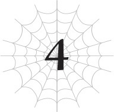

# Chương 4: Trận chiến chống xe tăng!
*(Anti-Tank Battle!)*

---

Họng pháo khổng lồ của chiếc xe tăng chĩa thẳng vào Sael đang ngã gục.

Một luồng ánh sáng lóe lên.

Nếu lũ robot bắn ra những viên đạn ánh sáng, thì thứ này đang bắn ra những quả pháo ánh sáng.

Đạn của lũ robot vốn đã không hề tầm thường về cả tốc độ lẫn uy lực, nhưng thứ này còn tệ hơn thế nhiều.

Dù cho chiếc xe tăng có đánh úp khiến Sael bất ngờ, thì việc nó có thể bắn trúng và gây ra lượng sát thương lớn như thế cho con bé thực sự là một điều đáng lo ngại.

Và bây giờ khi con bé không thể cử động, chuyện gì sẽ xảy ra nếu nó bồi thêm một phát pháo nữa?

May mắn thay, chúng tôi không cần phải tìm hiểu câu trả lời.

Vào lúc quả pháo của xe tăng bắn xuống sàn nhà, Sael đã biến mất, được Ma Vương mang đến nơi an toàn.

Cô ta hẳn đã lao đến, bế con bé lên và mang đi với tốc độ còn nhanh hơn cả đường đạn bay.

Ma Vương thậm chí còn cẩn thận khống chế động tác của mình để Sael không bị thương. Nếu không, nếu cô ta giật con bé đi khi đang di chuyển với tốc độ nhanh hơn cả viên đạn, thì chỉ riêng lực chấn động cũng đủ khiến cơ thể Sael vỡ vụn thành trăm mảnh rồi.

Làm thế nào mà cô ta có thể ngăn chặn điều đó xảy ra được nhỉ?

Tôi đoán đây lại là một trường hợp vận dụng cơ thể ở mức bậc thầy, vượt xa cả những gì chỉ số có thể mang lại.

Không giống như tôi, kẻ trở nên mạnh mẽ nhờ trải qua vô số trận chiến sinh tử trong một khoảng thời gian ngắn, Ma Vương đã mài giũa sức mạnh của mình qua một thời kỳ cực kỳ dài đằng đẵng. Điều đó có nghĩa là cô ta có nhiều kỹ năng và kinh nghiệm thực chiến hơn tôi rất nhiều.

Một sức mạnh không được phản ánh qua các chỉ số hay kỹ năng của Hệ Thống.

Đó lại là một khía cạnh nữa mà Ma Vương vượt trội hơn tôi.

Hừm. Hừm. Haizzz.

Mà thôi, việc cô ta mạnh hơn tôi cũng chẳng phải là tin tức gì mới mẻ gì cho cam.

Điều quan trọng nhất ở đây là Ma Vương đã cứu Sael.

Vào khoảnh khắc đó, cô ta thực ra có rất nhiều lựa chọn.

Ví dụ, cô ta có thể dùng Sael làm mồi nhử rồi phản công chiếc xe tăng.

Khi tầm ngắm của nó hoàn toàn dồn vào Sael, nó sẽ lộ ra sơ hở rất lớn cho bất kỳ ai khác tấn công.

Nếu chấp nhận từ bỏ Sael, cô ta dễ dàng tung ra một đòn tấn công chí mạng vào chiếc xe tăng.

Nhưng cô ta đã không bỏ rơi Sael.

Cô ta chọn cứu con bé, ngay cả khi điều đó đồng nghĩa với việc tự đặt bản thân vào nguy cơ bị trúng quả pháo ánh sáng kia.

Điều đó nói lên rất nhiều về con người của Ma Vương.

Và nó cũng nói lên rất nhiều về kẻ đã quyết định bỏ rơi Sael để tập trung tấn công chiếc xe tăng: chính là tôi.

Một ngọn Hắc Thương duy nhất lao thẳng tới chiếc xe tăng, được tạo ra từ phép Hắc Ma pháp của tôi.

Ngay lúc Ma Vương di chuyển để giải cứu Sael, tôi chỉ tập trung vào việc tiêu diệt chiếc xe tăng.

Bằng cách dùng Sael làm mồi nhử.

Đó là sự khác biệt giữa Ma Vương và tôi.

Cô ta nghĩ cho người khác, còn tôi thì chỉ lo giữ an toàn cho bản thân, ngay cả khi điều đó có nghĩa là phải từ bỏ Sael.

Nhưng trong trường hợp này, sự phối hợp đó giúp chúng tôi đạt được cả hai mục đích, nên có lẽ kết quả vẫn tốt đẹp.

Hắc Thương đâm vào bên hông của chiếc xe tăng, vốn hoàn toàn không được phòng thủ sau khi nổ súng.

Khoan đã, không phải.

Nó biến mất ngay khi vừa chạm vào lớp giáp của xe tăng.

Hắc Thương của tôi biến mất nhanh đến mức cứ như thể nó chưa từng tồn tại ở đó ngay từ đầu.

Chỉ trong một tích tắc, trông có vẻ như ngọn thương đã đâm xuyên qua xe tăng, bởi vì nó biến mất một cách triệt để và tự nhiên đến mức tôi cứ ngỡ nó đã xuyên qua hẳn.

Chẳng lẽ đó chính là kết giới bí ẩn mà Potimas đã sử dụng sao?

Trong lúc tôi đang định bắn thêm một ngọn thương nữa để kiểm chứng, tháp pháo xe tăng quay ngoắt về phía tôi với một tiếng rè rè chói tai.

Tôi lập tức rút lui, và một quả pháo ánh sáng nện xuống ngay vị trí tôi vừa đứng chỉ vài tích tắc trước.

Úi cha, suýt soát thật đấy.

Cực kỳ khó đọc được chuyển động của chiếc xe tăng này, tí nữa là tôi ăn trọn một phát trực diện vào mặt rồi.

Nguy rồi. Tôi không thể đoán trước chiếc xe tăng sẽ làm gì tiếp theo.

Kỹ năng Tương Lai Nhãn của tôi dường như không có tác dụng với nó.

Vì đã quen với việc có thể dự đoán nước đi tiếp theo của kẻ địch nhờ kỹ năng này, nên khi không thể dựa vào nó, tôi mất nhiều thời gian phản xạ hơn hẳn.

Đối thủ duy nhất tôi từng gặp rắc rối tương tự chính là Potimas.

Nghĩa là chiếc xe tăng này chắc chắn đang sử dụng cùng một loại kết giới giống như Potimas.

Chết tiệt. Chuyện này sẽ phiền phức hơn tôi tưởng nhiều đây.

Phải đối phó với một lũ robot cùng một lúc đã đủ phiền toái rồi, giờ lại thêm cả cái thứ vũ khí khổng lồ này nữa ư?

Thấy chưa, tôi đã bảo tàn tích cổ đại chưa bao giờ mang lại điềm lành mà!

Đây có phải là hình phạt của thần linh vì tôi đã ngu ngốc ước ao có cơ hội được tỏa sáng không vậy?

Nếu vậy thì vị thần chịu trách nhiệm cho chuyện này hẳn phải có khiếu hài hước cực kỳ tồi tệ.

Ơ khoan. Tôi tình cờ biết một tà thần có đặc điểm chính xác như vậy.

Đồ tồi D kia! Chuyện này là do ngươi làm đúng không?!

Trong lúc gào thét vô vọng với vị tà thần đó trong đầu, tôi bắn một ngọn Hắc Thương khác vào chiếc xe tăng.

Ngay khi nó chạm đến mục tiêu và tiếp xúc với bề mặt giáp, nó biến mất đúng như tôi lo sợ.

Tôi vẫn có thể kích hoạt ma pháp của mình một cách hoàn hảo. Kết giới chắc chắn không bao phủ toàn bộ không gian này.

Kết giới bí ẩn của Potimas có hiệu quả cực kỳ điên rồ, vô hiệu hóa hầu hết các kỹ năng và chỉ số trong một phạm vi nhất định.

Có lẽ chiếc xe tăng này cũng đang sử dụng một loại kết giới tương tự, nhưng nó chỉ có tác dụng ở phạm vi cực kỳ sát bên ngoài chiếc xe tăng.

Nếu không thì tôi đã hoàn toàn không thể sử dụng ma pháp rồi.

Tuy nhiên, vì nó có thể dễ dàng triệt tiêu các ngọn Hắc Thương của tôi không chút khó khăn, nên có thể an tâm giả định rằng hầu hết các phương thức tấn công tầm xa của tôi đều vô dụng ở đây.

Với sự tiện lợi và uy lực cao, Hắc Thương là một trong những phép thuật hệ Hắc ám đắc lực nhất của tôi.

Những phép thuật mạnh hơn thế này mà tôi sở hữu chỉ có Ma pháp Vực sâu và vài thứ tương tự.

Những phép thuật đó cần thời gian niệm chú, ngay cả khi tôi có kỹ năng Cực đỉnh Thần bí, và tôi thậm chí còn không biết liệu chúng có hoạt động hay không.

Tốt nhất là cứ giả định là không và tạm thời quên chuyện dùng ma pháp đi.

Điều đó đồng nghĩa với việc tôi chỉ còn một lựa chọn duy nhất: cận chiến bằng sức mạnh vật lý thuần túy.

Bất kể đó là kết giới ma pháp của Potimas hay thứ gì đi chăng nữa, cách tốt nhất để đối phó với lũ khốn có kết giới chống ma pháp này là giã chúng bằng sức mạnh thô bạo.

Trong lúc né tránh phát bắn ánh sáng thứ ba, tôi lấy món vũ khí của mình ra từ [Không gian Lưu trữ]: một cây lưỡi hái màu trắng toát ra luồng tử khí cực kỳ tà ác.

Tôi đã chế tạo cây lưỡi hái này khi quyết định muốn có một loại vũ khí để chiến đấu cận chiến.

Tin hay không tùy bạn, nhưng nó thực chất được chế tạo từ một phần cơ thể của chính tôi.

Tôi đã dùng cặp chân lưỡi hái phía trước của nửa thân nhện làm phôi, sau đó dùng các chân khác và tơ nhện để chế tạo ra món đồ nhỏ nhắn này.

Nó cho cảm giác như một phần kéo dài của cơ thể tôi, có lẽ vì nó thực sự được làm từ chính cơ thể tôi. Và vì chỉ số của tôi rất cao, nó cực kỳ bền bỉ và chém ngọt xớt như một giấc mơ.

Vấn đề duy nhất là nó cứ tỏa ra luồng tử khí kỳ lạ này suốt từ nãy đến giờ.

Có lẽ chỉ là tôi tưởng tượng thôi, nhưng rõ ràng là toàn bộ cây lưỡi hái đang phát ra hiệu ứng hào quang màu đen lập lòe.

Nhân tiện, kết quả Thẩm định của cây lưỡi hái trông giống như thế này:

<Lưỡi hái của White
Tấn công: 14.099
Kháng tính: 99.999
Đặc tính đặc biệt: [Tự động Tăng trưởng] [Tự động Phục hồi] [Thuộc tính Hủ thực] [Thuộc tính Bóng tối]>

Vâng. Kỳ lạ đúng không?

Chỉ số tấn công hiển nhiên thể hiện độ mạnh của nó dưới vai trò một món vũ khí.

Điều đó có nghĩa là chỉ riêng cây lưỡi hái này đã đủ mạnh để chém ngọt qua lớp phòng thủ của lũ nhện rối.

Còn kháng tính đo lường mức độ sát thương của một đòn tấn công cần có để gây tổn hại cho nó.

Nghĩa là nó sẽ không bị gãy trừ phi bị trúng một đòn tấn công có uy lực cao hơn con số đó.

Nói cách khác, cách duy nhất để bẻ gãy cây lưỡi hái này là đánh trúng nó với lượng sát thương tối đa của hệ thống.

Nói cách khác nữa, về cơ bản là nó không thể bị phá hủy.

Tuy nhiên, con số kháng tính đó vẫn sẽ giảm đi mỗi khi nó đỡ một đòn tấn công, vì vậy tôi vẫn phải cẩn thận... Hoặc ít nhất, tôi sẽ phải làm vậy nếu đây là một món vũ khí thông thường.

Nhưng cây lưỡi hái này lại sở hữu một đặc tính đặc biệt gọi là tự động phục hồi. Đó là một đặc tính cực kỳ hữu dụng giúp khôi phục kháng tính của nó theo thời gian, hoàn toàn tự động.

Miễn là có đặc tính này, tôi không cần phải lo lắng về việc chỉ số kháng tính bị tụt giảm nữa.

Và bản thân chỉ số kháng tính đó đã cao đến mức ngoài một đòn tấn công gây sát thương tối đa ra thì chẳng có gì bẻ gãy nổi nó.

Nó là cây lưỡi hái không thể phá hủy đấy, các bạn ạ.

Nhưng tôi phải thừa nhận, chuyện này hơi kỳ lạ.

Tôi biết mình đã dùng chính cơ thể mình để chế tạo ra nó, nhưng ngay cả tôi cũng không có chỉ số phòng ngự cao đến mức điên rồ như thế này đâu, hiểu chứ?

Và đó không phải là điều kỳ lạ duy nhất.

Nó có thuộc tính Hủ thực và Bóng tối từ bao giờ thế nhỉ?

Lúc tôi mới chế tạo xong làm gì có mấy thuộc tính đó.

Chắc chắn những thuộc tính này là nguyên nhân gây ra luồng tử khí rợn người kia rồi.

Đúng vậy, chuyện này thực sự rất kỳ quái.

Và giờ nó thậm chí còn có cả đặc tính tự động tăng trưởng kỳ lạ này nữa chứ.

Trên thực tế, đó chắc chắn là nguyên nhân của tất cả những điều kỳ lạ khác đúng không?

Khi mới chế tác, sức tấn công và kháng tính của nó đâu có cao thế này, và nó cũng không hề có những đặc tính kỳ lạ kia.

Nhưng vào một lúc nào đó, nó đã nhận được đặc tính tự động tăng trưởng này, và bây giờ các chỉ số cũng như đặc tính của cây lưỡi hái cứ tự động tăng lên một cách ngẫu nhiên.

Người ta bảo rằng khi dùng nguyên liệu từ một con quái vật mạnh mẽ để chế tạo trang bị, món đồ đó đôi khi sẽ thừa hưởng một phần sức mạnh của con quái vật đó.

Nhưng đáng lẽ nó chỉ là một phần nhỏ thôi, giống như tàn dư yếu ớt của con quái vật.

Chứ một món vũ khí không thể nào tự động phát triển ngẫu nhiên như thế này được.

Lời giải thích duy nhất tôi có thể nghĩ ra là có lẽ đây là tác động từ kỹ năng Kiêu hãnh.

Dù sao thì Kiêu hãnh cũng là một kỹ năng tăng trưởng gian lận mà.

Nếu món vũ khí này bằng cách nào đó thừa hưởng kỹ năng đó... thì có vẻ như mọi chuyện đều được giải thích rồi.

Nhưng có một điều khác khiến tôi lo ngại.

Sẽ thật tuyệt nếu món vũ khí này mạnh mẽ chỉ vì tôi làm nó từ chính các bộ phận của mình, nhưng chuyện đó nghe có vẻ quá đỗi tiện lợi, khiến tôi không khỏi nghi ngờ có kẻ khác đã nhúng tay vào.

Cụ thể là cái kẻ đã ban cho tôi kỹ năng gian lận có tên Trí Tuệ.

Phải rồi. D hoàn toàn có thể làm chuyện đó.

Thừa biết tính cách của kẻ tự xưng là "tà thần" kia, tôi hoàn toàn có thể hình dung ra cảnh D ban cho tôi một món vũ khí siêu mạnh chỉ vì nghĩ chuyện đó sẽ rất thú vị.

Điều đó chắc chắn sẽ giải thích được lý do tại sao nó lại có sức mạnh kinh hoàng như vậy.

Tuy nhiên, tôi chẳng có bằng chứng nào cho chuyện đó cả, và cho đến giờ nó cũng chưa gây ra rắc rối nào cho tôi.

Nhưng mà nhìn xem, luồng tử khí tà ác này hoàn toàn khiến nó trông giống như một món vũ khí bị nguyền rủa vậy!

Hừm.

Liệu cây lưỡi hái này thực sự có tác dụng với chiếc xe tăng đó không?

Nó có thuộc tính Hủ thực, nhưng đó là thuộc tính chi phối cái chết, còn xe tăng đâu phải là sinh vật sống.

Trong lúc tôi còn đang đứng suy nghĩ vẩn vơ, lũ nhện rối đã lao lên tấn công chiếc xe tăng.

Ngoại trừ Sael đang bị thương, ba đứa còn lại đang lao tới từ khắp các hướng.

Và họng pháo của chiếc xe tăng vẫn đang chĩa thẳng vào tôi.

Ủa, tụi nó dùng tôi làm mồi nhử đấy à?!

Thôi thì, tôi đoán mình cũng không trách tụi nó được. Lúc nãy tôi cũng vừa làm trò đó với Sael xong.

Khi lũ nhện rối nhanh chóng áp sát, chiếc xe tăng thò ra bốn cánh tay để chặn chúng lại.

Đó là cùng một loại cánh tay súng mà tôi đã thấy trên lũ robot mà chúng tôi vừa dọn dẹp sạch sẽ trước đó.

Các họng súng bắt đầu bắn ra các viên đạn ánh sáng.

Trong số bốn cánh tay súng, hai cái chĩa về phía Ael, hai cái còn lại chĩa vào Riel và Fiel.

Mặc dù chiếc xe tăng không thể nào biết được điều này, nhưng việc tập trung hỏa lực vào Ael, người về cơ bản là chị cả của lũ nhện rối, là một quyết định rất thông minh.

Ngay cả Ael cũng không còn lựa chọn nào khác ngoài việc phải dừng lại khi bị hai khẩu súng bắn xối xả vào người, dùng các lưỡi kiếm của mình để gạt đạn ra.

Nhưng việc con bé không hề bị một vết xước nào vẫn thực sự rất ấn tượng đấy chứ.

Trong khi Ael kiềm chế hai cánh tay súng đó, Riel và Fiel tìm cách áp sát chiếc xe tăng trong lúc đỡ và né tránh các phát bắn của nó.

Rõ ràng là mỗi đứa chỉ cần đối phó với một cánh tay súng thì không đủ để ngăn cản tụi nó.

Ngay sau đó, những thanh kiếm của chúng vung thẳng vào lớp giáp của xe tăng.

Một tiếng *KENG* chói tai của kim loại vang lên khi những thanh kiếm va chạm với lớp giáp, làm tóe ra những tia lửa.

Nhưng chỉ có thế thôi.

Những thanh kiếm đó có thể chém lũ robot dễ như thái rau, nhưng hoàn toàn không có tác dụng gì đối với lớp phòng thủ bên ngoài của chiếc xe tăng.

Đừng nói đến chuyện chém chiếc xe tăng thành trăm mảnh. Cùng lắm thì chúng chỉ để lại một vết xước siêu nhỏ trên đó.

Vì đã dốc toàn lực cho cú lao lên, Riel và Fiel bị khựng lại một nhịp khi đòn tấn công của mình bị chặn đứng.

Chiếc xe tăng không bỏ lỡ thời cơ để tận dụng sơ hở đó.

Với một tiếng rít kim loại chói tai, nó xoay tròn như một con quay khổng lồ, hất văng Riel và Fiel ra xa.

May mắn thay, tụi nó phản ứng đủ nhanh để đạp vào thân xe tăng lấy đà, tự điều chỉnh tư thế trên không trung và tiếp đất an toàn bằng hai chân.

Tuy nhiên, chiếc xe tăng vẫn chưa dừng lại.

Nó tiếp tục xoay tròn trong lúc lao thẳng về phía Ael, người đang bị khựng lại tại chỗ.

Đã thế, các cánh tay súng của nó còn bắt đầu xả đạn ánh sáng loạn xạ ra mọi hướng khi nó xoay tròn!

Đúng là một chiếc xe tăng hiếu chiến!

Trận mưa đạn bừa bãi đó buộc Riel và Fiel phải lùi lại.

Ael cũng rút lui, nhưng chiếc xe tăng cứng đầu bám đuổi con bé không buông, khiến con bé không thể giãn cách được cự ly.

Trời ạ, cái xe tăng đó là một kẻ bám đuôi đích thực.

Một kẻ bám đuôi vừa xả đạn khắp nơi vừa xoay vòng vòng với tốc độ cao trong lúc đuổi theo bạn?

Kẻ bám đuôi tồi tệ nhất lịch sử!

Được rồi, đây không phải lúc để đùa.

Trong khi ba con nhện rối đang kìm chân chiếc xe tăng, Ma Vương đã đưa Sael đang bị thương đến một nơi an toàn.

Cụ thể là lối hành lang mà chúng tôi đã đi qua trước đó, nơi Dơi con và Mera đang trú ẩn.

Nhưng cô ta sẽ sớm quay lại tiền tuyến thôi. Thừa biết thực lực của Ma Vương, cô ta có thể lật nhào chiếc xe tăng đó mà không gặp chút khó khăn nào.

Chỉ cần lũ nhện rối câu giờ đủ lâu cho cô ta, tôi tin chắc Ma Vương sẽ tự tay phá hủy chiếc xe tăng mà tôi không cần phải động một ngón tay nào.

Nhưng chúng tôi đã biết khẩu pháo chính của xe tăng có thể xuyên thủng lớp phòng thủ của lũ nhện rối.

Nếu có gì bất trắc xảy ra, rất có thể một đứa trong số chúng sẽ mất mạng.

...Thôi thì, tôi đoán mình sẽ cứu tụi nó để Ma Vương nợ tôi một ân huệ vậy.

Theo như tôi có thể nhận định, tôi sẽ ổn thôi miễn là tôi để mắt đến khẩu pháo chính đó.

Lưỡi hái cầm chắc trên tay, tôi bắt đầu lao đi.

Tôi phóng thẳng lên tường.

Đối với một con nhện như tôi, chạy trên tường dễ như ăn bánh.

Chỉ trong chớp mắt, tôi đã leo tuốt lên tận trần nhà.

Tôi chạy đảo ngược trên trần nhà cho đến khi ở ngay phía trên chiếc xe tăng.

Sau đó, tôi buông chân ra và rơi tự do xuống.

Ngay khi tôi chuẩn bị vung lưỡi hái chém xuống từ phía trên, tháp pháo của chiếc xe tăng lập tức quay ngoắt về phía tôi.

Ồ, hóa ra ngươi cũng có khả năng phòng không nữa cơ à?

Một quả pháo ánh sáng bay thẳng về phía tôi, và tôi lập tức đỡ nó bằng cây lưỡi hái của mình.

Lưỡi hái chém ngọt qua quả pháo với một tiếng *XOẸT* giòn giã, chia nó làm hai nửa hoàn hảo.

Ủa! Tôi phải thừa nhận là chính tôi cũng ngạc nhiên như các bạn vậy.

Nói thật là tôi không nghĩ đòn đó lại thành công đâu.

Không chỉ vậy, hai nửa của quả pháo đột nhiên mất đà và tan biến vào hư không.

Khẩu pháo chính vừa bắn ra quả pháo giờ đây hoàn toàn không có gì phòng bị, thế nên tôi vung lưỡi hái chém thẳng vào nó.

Lưỡi hái chém qua họng pháo dễ như thái bơ, và đà chém vẫn tiếp tục, đâm sâu vào thân xe tăng.

Và vì chiếc xe tăng vẫn đang xoay tròn, nó về cơ bản tự thái mỏng chính mình vào cây lưỡi hái, biến thành những mảnh sắt vụn.

Tất cả những gì còn lại là những khối kim loại trông giống như một món đồ chơi bị ai đó ném vào máy xay sinh tố.

Đã thế, những mảnh xe tăng bị băm nhỏ đó còn lặng lẽ hóa thành cát bụi.

Chuyện này chính xác giống như khi tôi đánh trúng thứ gì đó bằng đòn Hủ thực Công kích vậy.

Cái gìiiiii? Tôi cứ tưởng thuộc tính Hủ thực chỉ chi phối cái chết thôi chứ.

Tại sao nó lại có tác dụng trên một vật vô tri vô giác được nhỉ?

Và khoan đã, chuyện gì đã xảy ra với lớp kết giới bao quanh giáp của xe tăng thế?!

Tại sao tôi lại có thể chém xuyên qua nó dễ dàng như vậy được?!

Nghiêm túc đấy, cái quái gì đang xảy ra ở đây thế này...?

À thì, ừm, thôi kệ đi. Tôi đã giải quyết xong chiếc xe tăng trước khi Ma Vương kịp quay lại, và tôi cũng đã có cơ hội được tỏa sáng một chút rồi, thế nên tôi đoán kết quả tốt đẹp là được.

Đúng vậy. Đừng suy nghĩ quá sâu xa về những gì vừa mới xảy ra làm gì.

"Ừm, chuyện đó thật là..."

Ma Vương nhìn đống tro bụi từng là chiếc xe tăng, nét mặt cô ta căng thẳng thấy rõ.

Đến cả lũ nhện rối trông cũng có vẻ sợ hãi.

Này nhé, tôi vừa mới cứu mạng các người đấy. Có cần phải làm cái nét mặt đó với ân nhân không hả?

Khoan đã. Biểu cảm của lũ nhện rối đâu có tự thay đổi được. Chẳng lẽ tụi nó đã cố tình điều khiển các sợi tơ để nặn ra những khuôn mặt đó sao?

Không đời nào.

Phía sau Ma Vương, Dơi con từ hành lang thò đầu dòm vào.

Liếc nhìn xung quanh để xác nhận không còn mối nguy hiểm cận kề nào, con bé bước vào trong.

Mera theo sau con bé, cõng Sael trên lưng.

Sael vẫn bị mất cả ba cánh tay trái, cộng thêm một phần lớn ở khoang bụng.

Con bé dường như cũng không thể cử động được chân trái của mình.

Vì lũ nhện rối điều khiển cơ thể giống búp bê của mình bằng tơ, nên chúng không thể cử động các chi nếu sợi tơ gắn vào chúng bị đứt.

Chuyện này hơi giống như dây thần kinh vận động ở con người vậy. Sợi tơ mà Sael dùng để điều khiển chân trái chắc chắn đã bị đứt, thế nên bây giờ con bé không thể đi lại được.

Nếu không thì Dơi con chắc chắn sẽ không bao giờ để Mera cõng một đứa con gái khác như vậy đâu.

Tôi đoán ngay cả con bé cũng biết gạt bỏ lòng ghen tuông của mình sang một bên trong tình huống khẩn cấp.

“Hừm. Nơi này nguy hiểm hơn ta nghĩ đấy. Vì Sael đã bị thương nặng thế này, có lẽ Sophia và Merazophis nên quay lại mặt đất trước đi.”

Không một ai phản đối lời tuyên bố của Ma Vương.

À mà, vốn dĩ trong số chúng tôi cũng làm gì có ai là "người" đâu.

Nói nghiêm túc thì, nếu trong này còn bất kỳ thứ vũ khí nào giống như chiếc xe tăng đó nữa, Dơi con và Mera sẽ chỉ làm vướng chân vướng tay chúng tôi mà thôi.

Không ai trong số hai người họ là kẻ yếu theo tiêu chuẩn của thế giới này, nhưng họ vẫn phải mất cả hai người mới đối phó nổi một hoặc hai con robot.

Họ sẽ không có cơ hội sống sót nào trước một nhóm robot lớn, chứ đừng nói đến một chiếc xe tăng khác.

Ngay cả lũ nhện rối cũng gặp khó khăn trước chiếc xe tăng đó.

Tàn tích vẫn tiếp tục kéo dài qua căn phòng này, thông qua cánh cửa mà chiếc xe tăng vừa đi ra.

Vì vẫn còn nhiều nơi để xem, nên chúng tôi phải tiếp tục điều tra.

Tốt nhất là Mera và Dơi con nên rút lui về nơi an toàn cùng với Sael.

Nhưng ngay khi tất cả chúng tôi vừa quyết định như vậy, mặt đất bỗng rung chuyển dữ dội như thể để phản đối quyết định của chúng tôi.

Đây là một trận động đất thực sự lớn.

Ma Vương và tôi vẫn đứng vững như thể không có chuyện gì xảy ra, nhưng cặp đôi ma cà rồng thì bị ngã quỵ xuống đất, phải dùng cả tay lẫn đầu gối để chống đỡ. Ngay cả lũ nhện rối cũng loạng choạng cố gắng giữ thăng bằng.

Sau đó, một tiếng còi báo động bắt đầu vang lên inh ỏi.

Tiếng còi báo động trước đó vốn đã kêu suốt từ nãy đến giờ, nhưng khi có thêm tiếng còi mới này, âm thanh thực sự chói tai đến mức muốn rách màng nhĩ.

Như thể để tăng thêm điềm gở, ánh đèn đỏ bắt đầu nhấp nháy liên hồi khắp nơi.

“Úi chà. Chuyện này có vẻ không ổn rồi đúng không?”

Đúng vậy, đùa thế đủ rồi.

Giác quan cảnh báo nguy hiểm của tôi đang báo động đỏ ở mức tối đa.

“Quên những gì ta vừa nói đi. Tất cả mau rút lui khỏi đây ngay!”

Dứt lời, Ma Vương lập tức kẹp nách Dơi con và Mera dưới hai cánh tay rồi lao nhanh ra phía hành lang.

Lũ nhện rối cũng lật đật chạy theo sau cô ta, chân cẳng vẫn còn hơi loạng choạng.

Tôi là người bọc hậu cuối cùng.

Chúng tôi lao nhanh qua hành lang, chui qua cái lỗ trong thang máy và quay trở lại hành lang dài.

Ngay khi chúng tôi chạy được đến đó, một cơn chấn động đặc biệt lớn và một tiếng nổ lớn vang lên.

Âm thanh rõ ràng phát ra từ phía sau lưng, thế nên tôi ngoảnh đầu nhìn lại.

Một bức tường lửa đang cuồn cuộn lao về phía chúng tôi với tốc độ đáng kinh ngạc.

Nguy rồi. Tình hình này cực kỳ tồi tệ.

Đưa ra quyết định chớp nhoáng, tôi lao thẳng vào lũ nhện rối đang chạy phía trước, dùng tay ôm chặt lấy tất cả tụi nó.

Cú va chạm làm giảm HP của tụi nó một chút, nhưng giờ không phải là lúc lo lắng về chuyện đó nữa.

Tôi cắm đầu chạy dọc hành lang dài với tốc độ tối đa.

Nhanh hơn cả ngọn lửa đang đuổi sát phía sau!

Lao vun vút dọc theo hành lang, tôi tông cửa xông qua cánh cửa đã bị hỏng và bắt đầu bò ngược lên những cái hố mà tôi đã đào trước đó để quay lại mặt đất.

Ở phía trước tôi, Ma Vương đang chạy trốn với tốc độ còn nhanh hơn cả tôi, nên có lẽ cô ta cũng đang sử dụng hết tốc lực của mình rồi.

Cơ thể chúng tôi liên tục va quệt vào vách đường hầm chật hẹp, nhưng chuyện đó không còn quan trọng nữa.

Dù vậy thì tôi thực sự ước gì mình đã đào cái hầm này to hơn một chút!

Tôi tiếp tục trèo lên đường hầm đã đào từ trước cho đến khi tới tổ kiến, rồi tiếp tục phóng nhanh lên mặt đất.

Mọi suy nghĩ trong đầu tôi lúc này chỉ là phải tiến lên phía trước, cố gắng không bận tâm đến hơi nóng đang liếm láp sau lưng.

Khi nghe thấy tiếng tổ kiến đang sụp đổ ở phía sau, cuối cùng tôi cũng nhìn thấy ánh sáng từ mặt đất!

Sắ-ắ-ắp ra đến nơi rồ-ồ-ồi!

Tôi phóng ra khỏi cái hố nhanh đến mức tôi gần như có thể nghe thấy cả tiếng hiệu ứng âm thanh *BÙM* một cái.

Sau đó, tôi tiếp tục bay vút lên không trung.

Phù, chúng tôi thoát được rồi!

Trước khi tôi kịp thở phào nhẹ nhõm, mặt đất bỗng nổ tung.

Một cột lửa khổng lồ phun thẳng lên trời, chỉ suýt sượt qua mũi tôi trong gang tấc.

Suýt soát thật đấy!

Nếu tôi chậm chỉ một giây thôi, chúng tôi chắc chắn đã bị nướng chín bởi ngọn lửa đó rồi.

Nhưng sự nhẹ nhõm của tôi chỉ kéo dài đúng một giây.

Nguy rồi.

Trong vòng tay tôi, lũ nhện rối cũng đang nhìn xuống dưới với vẻ kinh hoàng tột độ giống hệt tôi.

Tụi nó ngạc nhiên đến mức quên cả việc thay đổi biểu cảm của mình.

Và tôi cũng không thể trách tụi nó được.

Có một cột lửa thậm chí còn khổng lồ hơn đang bốc lên từ bên dưới chúng tôi, to lớn đến mức khiến cột lửa trước đó trông chẳng khác gì một trò đùa.

Từ "cột" dường như không còn đủ để miêu tả nó nữa rồi. Nó giống như một tai lửa mặt trời (solar flare) hơn.

Cảm giác như thể chúng tôi đang chứng kiến ngày tận thế vậy.

Cảnh tượng đó phi lý đến mức tôi thậm chí còn suýt không nhận ra hơi nóng đang phả vào người.

Sau đó, tôi thấy một thứ gì đó đang bay vút lên từ giữa lò lửa đỏ rực, trông có vẻ chậm chạp nhưng thực chất nó hẳn đang bay lên bầu trời với tốc độ kinh hoàng.

Sau khi nó đã bay lên cao, những ngọn lửa mới bắt đầu dịu xuống.

Nhưng đó vẫn chưa phải là kết thúc.

Nếu có gì, tôi cảm thấy như thể trận chiến của chúng tôi mới chỉ thực sự bắt đầu.

Một thứ gì đó trồi lên từ đống tro tàn của ngọn lửa.

Tôi chỉ có thể miêu tả nó như một chiếc UFO khổng lồ.

Một cỗ máy bay hình tròn khổng lồ, to lớn đến mức bạn phải đo chiều dài của nó bằng đơn vị dặm.

Thứ đó đang thong dung bay thẳng lên bầu trời.

Ở ngay bên cạnh tôi, Ma Vương thì thầm câu nói mà tất cả chúng tôi đều đang nghĩ trong đầu.

“Không thể tin được.”

---

[◀ Chương trước: Chương 3: Phát hiện tàn tích cổ đại!](03_ancient_ruins_discovered.md) | [Chương tiếp theo: Chương 5: Vật thể bay không xác định luôn xuất hiện từ hư không ▶](05_unidentified_flying_objects_always_appear_out_of_nowhere.md)
