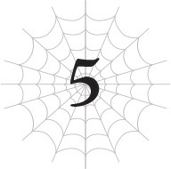
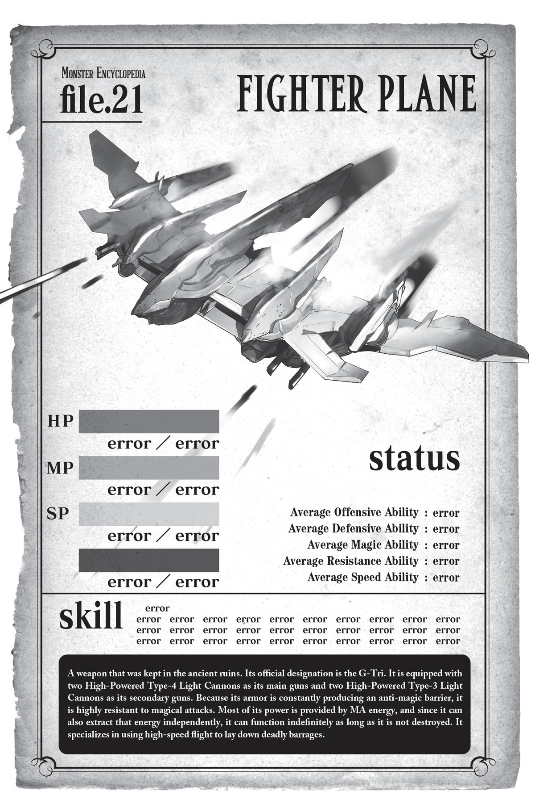

# Chương 5: Vật thể bay không xác định luôn xuất hiện từ hư không
*(Unidentified Flying Objects Always Appear out of Nowhere)*

---

Trời ạ, cái quái gì thế này?

Nghiêm túc đấy... rốt cuộc... là sao?

Khoan đã nào.

Để tôi bình tĩnh lại một chút xem nào.

Sao mọi chuyện lại thành ra thế này được nhỉ?

Tự nhiên chúng tôi phát hiện ra tàn tích cổ đại.

Chúng tôi thám hiểm nơi đó và bị một đội quân robot tấn công.

Sau đó là một chiếc xe tăng khổng lồ, đáng sợ.

Thấy tình hình có vẻ bất ổn, cả lũ rút chạy khỏi tàn tích, rồi bùm!

Cột lửa phun lên.

Và rồi, dĩ nhiên, cái UFO khổng lồ kia xuất hiện.

Không! Không! Không đời nào!

Tôi vẫn chẳng hiểu gì cả!

Nghiêm túc đấy, chuyện quái gì đang xảy ra thế?!

Làm sao? Tại sao? Rồi giờ phải làm gì đây?!

Cứu tôi vớiiii!

Trong lúc tôi đang hoảng loạn tột độ, tôi nghe thấy tiếng cánh đập phành phạch ở gần.

“Này nhóc! Ý gì đây hả con nhện cái bẩn thỉu kia?!”

Một con phong long có ngoại hình trông như thằn lằn bay Pteranodon khổng lồ đáp xuống cạnh Ma Vương.

Trong số những con rồng cai quản vùng hoang mạc này, con này có lẽ là kẻ mạnh nhất.

“Bọn ta cho mày đi qua vì mày bảo sẽ không làm gì cả, thế mà rốt cuộc lại thế này đây! Chuyện này là sao hả?”

…Sao giọng điệu của nó lại kiểu đó nhỉ?

Dù giao tiếp bằng Thần giao cách cảm, tên này nghe vẫn hoàn toàn giống một kẻ tiểu tốt hạng hai.

Thôi nào—dù sao cũng là rồng mà. Chắc chắn nó chỉ đang diễn kịch thôi.

Đúng không?

“Khai ra mau, không thì bọn ta không khách sáo đâu!”

“Ồ? Thế một con phong long như ngươi thì làm được gì ta nào?”

“Tao không có ngu. Tao biết tao không đánh lại mày, con nhện kia! Nhưng nếu mày dám đụng vào tao, đại ca ta sẽ hỏi tội mày đấy, biết chưa?”

À. Ra thế.

Nó thực sự chỉ là một tên lâu la tép riu.

Vừa thấy Ma Vương đe dọa một chút là nó đã cụp đuôi lại ngay.

Đã thế còn núp bóng uy quyền của kẻ gọi là “đại ca” nữa chứ.

Làm vậy mà coi được hả hả rồng?

Tôi không biết nữa, chứ nhìn gương Alaba và những con rồng khác, tôi cứ tưởng rồng theo quy luật đều là những sinh vật kiêu hãnh và mạnh mẽ.

Tên này đang bôi tro trát trấu vào cái hình tượng đó rồi đấy.

Haiz. Tôi bắt đầu thấy nản lòng thoái chí rồi đấy.

“Thế à? Vậy thì tốt quá. Ta cũng có cảm giác một mình bọn ta không xử lý nổi thứ này đâu. Ngươi mau gọi Gülie đến đây đi được không?”

“Khoan, mày nói thật đấy hả nhóc con? Đại ca có thể tiễn mày lên đường chỉ bằng một đòn đấy, biết chưa hả?”

“Biết rồi, biết rồi, cứ gọi ông ta đi. Ngươi không thấy bọn ta đang phải đối mặt với thứ gì sao?”

Ma Vương chỉ tay về phía chiếc UFO khổng lồ.

À, hóa ra “đại ca” là đang ám chỉ Güli-güli.

Phải rồi, nếu một con rồng muốn gọi cấp trên của mình, thì hiển nhiên đó phải là Güli-güli.

“Đương nhiên là thấy rồi, đồ đần này! Nhưng rốt cuộc cái thứ quái quỷ đó là gì thế?!”

“Ta cũng đang muốn biết đây! Ngươi biết thừa nó bị chôn dưới vùng hoang mạc này đúng không?! Làm sao các ngươi lại không nhận ra một thứ như vậy nằm ở đây hả?!”

“Hả?”

Con phong long ngậm miệng lại và cúi nhìn xuống dưới một cách ngốc nghếch.

Phải làm sao đây?

Tên này trông như một kẻ ngốc toàn tập.

Tôi bắt đầu tự hỏi không biết là do tàn tích được che giấu quá kỹ, hay là do lũ rồng ở đây quá ngu ngốc nên không nhận ra nữa.

“Nghe cho kỹ đây. Ta sẽ giải thích thật đơn giản để cái não bé tí teo của ngươi cũng có thể hiểu được. Bọn ta tình cờ phát hiện ra một số tàn tích ẩn sâu dưới lòng đất từ thời đại trước khi hệ thống bắt đầu vận hành, nên đã vào xem thử. Và rồi cái thứ kia chui ra. Hiểu chưa?”

Vâng, đúng là một bản tóm tắt siêu ngắn gọn.

“Không hiểu gì hết!”

Nói thế mà con phong long vẫn nhào lộn mấy vòng trên không trung để thể hiện sự bối rối, hoặc ít nhất là nó không tin câu chuyện đó.

Thành thật mà nói, trông nó chẳng khác gì một con khủng long con khổng lồ đang ăn vạ.

Thế này thì chịu rồi.

“Sao cũng được! Mau gọi Gülie đến đây ngay đi!”

Hết kiên nhẫn, Ma Vương đẩy nhẹ con phong long đang giãy giụa một cái.

Trông cú đẩy có vẻ rất kiềm chế, chỉ như một cái huých nhẹ, nhưng nhờ vào chỉ số cao điên rồ của Ma Vương, nó vẫn khiến con phong long lao đầu thẳng xuống đất.

“……”

Ma Vương nhìn con phong long rơi xuống một lúc, rồi quay mặt lại phía chiếc UFO, hoàn toàn không chút biểu cảm.

Tôi đoán cô ta định vờ như chuyện đó chưa từng xảy ra.

Không đời nào.

Thật là cạn lời.

Mà thôi, có lẽ cô ta nói đúng. Chúng tôi nên tập trung vào vấn đề trước mắt.

Cứ lờ con phong long bị rơi kia đi.

HP của nó vẫn còn một ít, ít nhất là chưa chết.

Bây giờ, chúng tôi phải tìm cách đối phó với cái UFO trước mắt.

Thực ra khoảng cách giữa chúng tôi và cái phương tiện bay kỳ quái đó khá xa.

Nhưng vì cái thứ của nợ đó quá khổng lồ, nó làm rối loạn cảm giác về tỉ lệ, khiến chúng tôi có cảm giác như nó đang ở ngay trước mũi.

Nó vĩ đại đến mức đó đấy.

Tôi không khỏi trầm trồ trước việc một thứ to lớn như vậy lại có thể bị chôn vùi dưới lòng đất.

Tôi đoán đó chính là phần lõi thực sự của đống tàn tích.

Lũ robot và chiếc xe tăng kia chẳng qua chỉ là lực lượng phòng thủ—còn cái UFO này mới là vũ khí tối thượng của nó.

Nói thật, một mình chiếc xe tăng đã đủ làm tôi mệt mỏi rồi, thế mà cái thứ khổng lồ này còn vượt trội hơn hẳn.

Nói thật là tôi hơi muốn trốn tránh thực tại rồi đấy.

Đừng có lôi mấy thứ không thuộc về thế giới kỳ ảo ra nữa!

Ý tưởng của ai mà lại chế ra cái UFO khổng lồ ngu ngốc này thế?!

Nó rõ ràng là không hề ăn khớp với bối cảnh này chút nào!

Nhưng dù có than vãn trong đầu thì cũng chẳng thay đổi được những gì trước mắt.

Chúng tôi sẽ phải làm gì với nó đây?

Cảm giác như ngay từ đầu đây đã là thứ mà chúng tôi hoàn toàn bó tay chịu trói rồi.

“Ừm, cô Ariel? Chúng ta sẽ làm gì đây ạ?”

Dơi con cất tiếng hỏi thay cho thắc mắc của tôi, con bé vẫn đang được Ma Vương bế.

“Câu hỏi hay đấy. Ta có cảm giác ngay cả mình cũng sẽ gặp khó khăn khi muốn hạ cái thứ đó. Có lẽ chúng ta đành phải đợi Gülie tới thôi.”

Đó là một câu nói yếu thế đến đáng ngạc nhiên từ Ma Vương.

Nhưng đối mặt với thứ đó, tôi đoán ngay cả Ma Vương cũng phải chịu lép vế.

Có thứ gì đó đâm nhẹ vào ngực tôi.

Nhìn xuống, tôi thấy Ael đang giãy giụa cố thoát khỏi vòng tay tôi.

Ồ phải rồi. Hóa ra tôi vẫn đang ôm tụi nó.

Riel and Fiel không động đậy gì, chỉ biết đứng đực mặt nhìn chiếc UFO vì quá sốc.

Tình huống này quá điên rồ, chắc đầu óc tụi nó đã bị đóng băng hoàn toàn rồi.

Dĩ nhiên Ael là đứa tỉnh táo lại đầu tiên, đúng chất “chị cả”.

Nhưng ở trên cao thế này tôi không thể buông con bé ra được.

Tôi siết chặt tay hơn, ngầm ra hiệu cho con bé đứng yên.

Ael cố dùng ánh mắt cún con nhìn tôi, nhưng tôi ngó lơ con bé luôn.

Giờ không phải lúc làm trò đó.

Chiếc UFO đã phóng thứ gì đó bay về phía chúng tôi.

Ban đầu, nó trông giống như một đàn côn trùng. Như muỗi hay thứ gì đó tương tự.

Nhưng đó chỉ là vì khoảng cách quá xa. Những thứ đó thực chất lớn hơn côn trùng nhiều.

Thực tế, đó là những phi cơ chiến đấu có kích thước tương đương chiếc xe tăng lúc nãy, và chúng đang lao vun vút thẳng về phía chúng tôi.

Trông như một đàn côn trùng là vì số lượng của chúng quá nhiều mà thôi.

| Chỉ số | Giá trị |
| :--- | :--- |
| **HP** | error / error |
| **MP** | error / error |
| **SP** | error / error |
| **Sức tấn công trung bình** | error |
| **Sức phòng ngự trung bình** | error |
| **Khả năng ma pháp trung bình** | error |
| **Kháng tính trung bình** | error |
| **Tốc độ trung bình** | error |

| Kỹ năng |
| :--- |
| error, error, error, error, error, error, error, error, error, error, error, error, error, error, error, error, error, error, error, error, error, error, error, error, error, error, error, error, error, error, error, error, error, error, error, error, error, error, error, error |

> **Mô tả:** Vũ khí được cất giữ trong tàn tích cổ đại. Định danh chính thức của nó là G-Tri. Nó được trang bị hai khẩu Quang Pháo Loại 4 Công suất cao làm vũ khí chính và hai khẩu Quang Pháo Loại 3 Công suất cao làm vũ khí phụ. Vì lớp giáp của nó liên tục tạo ra kết giới kháng ma, nó có khả năng kháng cực cao trước các đòn tấn công ma pháp. Hầu hết năng lượng của nó được cung cấp bởi năng lượng MA, và vì nó cũng có thể tự trích xuất năng lượng đó một cách độc lập, nó có thể hoạt động vô hạn miễn là không bị phá hủy. Nó chuyên dụng trong việc bay ở tốc độ cao để dội những loạt oanh tạc chết chóc.

“Rút lui!” Ma Vương hét lớn.

Bế Dơi con và Mera, người vẫn đang cõng Sael trên lưng, Ma Vương nhanh chóng lao đi trên không trung để tránh xa đàn phi cơ chiến đấu.

Dĩ nhiên tôi lập tức bám sát phía sau cô ta.

Tôi sẽ không đấu với chừng đó thứ đâu!

Và nếu chúng có cùng kích thước với chiếc xe tăng kia, liệu có nghĩa là chúng cũng mạnh ngang ngửa sao?

Làm sao mà đánh lại nổi!

Bất kể Ma Vương có mạnh đến đâu hay tôi có gần như bất tử thế nào, tất cả đều vô nghĩa trước một lực lượng khủng khiếp như thế này.

Lựa chọn duy nhất của chúng tôi là cắm đầu chạy thục mạng mà không dám ngoái đầu nhìn lại.

Còn con phong long kia?

Ai thèm quan tâm chứ!

Rồng thì phải tự biết cách lo cho bản thân đi!

Vả lại, tôi có nghe thấy tiếng thét gì đó ở phía sau, rồi tiếng đập cánh hoảng loạn, nên chắc nó vẫn ổn thôi.

“Tiêu rồi, quả này tiêu thật rồi.”

“Ngươi nói phải đấy. Thứ đó nguy hiểm lắm. Cực kỳ nguy hiểm.”

Sau khi cắt đuôi được đàn phi cơ chiến đấu bám theo, cuối cùng chúng tôi cũng dừng lại thở phào ở một góc hẻo lánh của hoang mạc.

Con phong long bằng cách nào đó cũng đã đuổi kịp chúng tôi một cách an toàn.

Dù cho vốn từ vựng của nó đã cạn kiệt đến mức chỉ biết lặp đi lặp lại từ “nguy hiểm”.

“Thế nào? Đã gọi Gülie chưa?”

“Ồ.”

Con rồng lảng mắt đi một cách ngượng ngùng.

Chắc là do nó chỉ lo cắm đầu chạy trốn nên quên khuấy việc gọi cho đại ca.

“Thế thì mau gọi ông ta đi! Đây chính xác là loại việc mà một quản trị viên phải giải quyết đấy! Gọi đi! Gọi ngay lập tức!”

“Được rồi, được rồi! Đừng có bóp cổ ta nữa, bà cô điên khùng này!”

Ma Vương đang nắm cổ con phong long và lắc qua lắc lại liên hồi.

Tôi chỉ ước họ dẹp bớt cái trò tấu hài này đi và mau gọi ông ta cho rồi.

Trong lúc tôi đang nhìn họ với vẻ mặt thờ ơ, có thứ gì đó kéo kéo tay áo tôi.

“Người tên ‘Gülie’ mà cô ấy nói là ai thế ạ?” Dơi con hỏi, giọng vẫn còn hơi ngọng nghịu.

Bình thường con bé sẽ hỏi trực tiếp Ma Vương, nhưng vì Ma Vương hiện đang bận diễn hài cùng con phong long, nên đứa trẻ sơ sinh này quay sang hỏi tôi.

Hử...

Làm sao giải thích được đây?

Gülie, kẻ mà tôi gọi là Güli-güli, gã áo đen.

Nếu cố giải thích thân thế của anh ta, tôi sẽ phải nói rất nhiều.

Ý tôi là, anh ta là một nhân vật rất quan trọng.

Güli-güli là một quản trị viên. Ở thế giới này, điều đó về cơ bản biến anh ta thành một vị thần.

Anh ta quản lý hệ thống và đảm bảo thế giới vận hành trơn tru.

Chiếc UFO vừa xuất hiện rõ ràng là một dị thường đối với thế giới này.

Nói cách cách, nó cản trở sự vận hành trơn tru của thế giới, đồng nghĩa với việc loại bỏ nó nằm trong thẩm quyền của quản trị viên.

Một vị thần như Güli-güli chắc chắn phải làm được gì đó.

Đó là lý do tại sao Ma Vương lại bắt con phong long phải triệu hồi Güli-güli bằng được.

Dù sao thì rồng về cơ bản cũng là thuộc cấp của anh ta.

Họ giống như nhân viên thực địa giúp anh ta duy trì trật tự ở các khu vực.

Vì thế đương nhiên con phong long phải có cách liên lạc với đại ca Güli-güli của nó.

Chúng tôi chỉ cần nó gọi Güli-güli tới để anh ta giải quyết cái UFO trong một nốt nhạc.

Thông tin tôi có đại khái là như vậy, nhưng... liệu tôi có thể thực sự giải thích được hết đống đó không?

Tôi hoàn toàn không có kỹ năng giao tiếp, làm sao tôi có thể nói được một tràng dài như thế chứ?

Thường ngày tôi còn chẳng nói nổi quá một từ nữa là.

Đây là nhiệm vụ bất khả thi rồi!

Tôi phải làm sao đây? Hả?

Tôi gặp rắc rối to rồi.

Một kiểu rắc rối hoàn toàn khác với tình cảnh lúc nãy.

Tôi đã chạy thoát khỏi cái UFO, nhưng lần này tôi không còn đường lui.

Dơi con đang ngước nhìn tôi bằng đôi mắt vô cùng trong sáng. Tôi không thể làm con bé thất vọng... không thể... Hoặc có thể?

Khoan đã, tại sao ngay từ đầu tôi lại phải tự mình đi giải thích mấy thứ phức tạp này nhỉ?

Chẳng phải tôi có thể đùn đẩy trách nhiệm này sang cho Ma Vương sao?

Tôi chắc chắn cô ta cũng sẽ sớm giải thích cho tụi nó thôi.

Những việc như thế là nhiệm vụ của Ma Vương. Hiện tại cô ta chỉ đang bận xử lý con phong long thôi.

Phải rồi. Là thế đấy.

Tôi không cần phải chọn con đường khó khăn nhất làm gì.

Tất cả những gì tôi cần nói là, Cứ đi hỏi Ma Vương ấy!

Nhưng ngay khi tôi đang lấy hết can đảm, ai đó đã ngắt lời tôi.

“Có phải là vị khách mặc đồ đen đã ghé thăm chúng ta vào một buổi tối không?”

Chết tiệt, Mera! Sao ngươi lại cướp lời của tôi đúng lúc thế hả?!

“Hả? Khi nào thế?”

“Tôi tin là không lâu sau khi chúng ta gặp Giáo hoàng của Thần Ngôn Giáo.”

Suy ngẫm một lát, Dơi con chậm rãi gật đầu.

Tôi quên mất. Cặp đôi hút máu này thực ra đã gặp Güli-güli một lần rồi.

Đó là sau khi anh ta xuất hiện để bảo tôi ngăn các Phân thân Tư duy đang làm loạn của mình lại.

“Ồ, đúng rồi. Người mà đột nhiên tham gia cùng nhóm chúng ta vào một buổi tối rồi hôm sau lại biến mất một cách bí ẩn đó sao?”

Có vẻ Dơi con cũng nhớ ra anh ta.

Ngoại hình của Güli-güli rất đặc trưng, nên việc anh ta để lại ấn tượng sâu sắc cũng là điều dễ hiểu.

Và đúng như Dơi con nói, lần đó anh ta đột nhiên tham gia uống rượu cùng chúng tôi, rồi sang ngày hôm sau lại biến mất tăm.

“Trông như thể tiểu thư White và ngài Ariel đều đã biết anh ta từ trước. Tôi có thể hỏi anh ta là ai không, tiểu thư White?”

Ối trời! Giờ đến lượt Mera cũng nhắm vào tôi nữa hả!

Tại sao hôm nay ai cũng có nhiều câu hỏi dành cho tôi thế?!

Ý tôi là, tôi cũng không thể trách bọn họ tò mò về người mà Ma Vương sẽ nhờ cậy trong tình huống này, nhưng mà.

Đi mà hỏi cô ta ấy, đừng hỏi tôi!

“Một vị thần.”

Mọi chuyện ngày càng trở nên phiền phức, nên tôi đã đưa ra câu trả lời ngắn nhất và tùy tiện nhất.

Tất nhiên, câu trả lời đó chỉ khiến cặp đôi hút máu càng thêm hoang mang, nhưng tôi không rảnh để giải thích thêm làm gì.

“Nói thế thì biết đường nà— Hả?”

Dơi con định gặng hỏi thêm, nhưng Ael đã ngăn con bé lại, cảm nhận được mức độ bực bội của tôi sắp chạm đỉnh.

Không hiểu vì lý do gì, lũ nhện rối lại giỏi nắm bắt cảm xúc của tôi hơn hẳn hai con ma cà rồng trong nhóm.

Tôi không biết đó là vì chúng cũng là nhện giống tôi, hay đơn giản là do bản năng sinh tồn của động vật, nhưng cứ mỗi khi tâm trạng tôi bắt đầu xấu đi là chúng lại nhạy bén nhận ra và không làm phiền tôi nữa.

Chắc chúng hiểu tôi thích được yên tĩnh một mình.

Ael chắc hẳn đã chặn cuộc trò chuyện này lại vì nhận ra tâm trạng của tôi, nhưng có vẻ Dơi con không hề thích thú gì.

Con bé lườm Ael một cái giận dỗi, nhưng con nhện rối vẫn ngó lơ.

Tôi cũng chẳng thể trách con bé vì không sợ một đứa trẻ sơ sinh đang giận dỗi.

Mà công nhận, không hổ danh là chị cả của lũ nhện rối. Con bé tuyệt vời thật.

Thôi thì lâu lâu để con bé giật hào quang một chút cũng không sao.

Để Ael lo liệu Dơi con, tôi quay sang kiểm tra tình hình của Sael.

Con bé đang nằm trên nền đất đầy cát bụi, được Riel và Fiel chăm sóc.

Với việc mất đi ba cánh tay và một phần thân trên, trông con bé thảm đến mức không nỡ nhìn.

Phần bụng bên trái bị thổi bay, nên chân trái của con bé cũng không thể hoạt động được.

Nhưng dù trông có vẻ nghiêm trọng, cơ thể nhện thực sự ẩn bên trong của con bé lại hoàn toàn không hề hấn gì.

Dù sao thì lớp vỏ ngoài của lũ nhện rối cũng chỉ đúng nghĩa là: những con rối.

Chỉ cần con nhện nhỏ bên trong không bị thương, chúng có thể tự sửa lại cơ thể rối nếu bị hỏng.

Nhưng tôi đã tốn rất nhiều công sức để chế tạo ra những cơ thể rối này.

Vì tôi đã phải cực kỳ tỉ mỉ để khiến chúng trông giống con người nhất có thể, nên không thể nào làm lại các chi đó chỉ trong một đêm.

Nhưng trong hoàn cảnh này, việc Sael không thể chiến đấu cũng là một vấn đề.

Chúng tôi không biết chuyện gì sẽ xảy ra tiếp theo, nên ít nhất con bé phải tự bảo vệ được mình.

Cứ nhìn trận đấu với chiếc xe tăng mà xem. Vì Sael bị thương, chúng tôi đã mất đi át chủ bài mạnh nhất là Ma Vương trong lúc cô ta đưa Sael đến nơi an toàn.

Không một kẻ địch nào lại bỏ qua một sơ hở lớn như vậy.

Tôi không muốn có kẻ làm vướng chân vướng tay mình.

Không phải lũ nhện rối yếu. Chỉ số của chúng đều trên một nghìn, khiến chúng trở thành những con quái vật mạnh mẽ vượt trội dưới góc nhìn thông thường.

Nhưng trong trường hợp này, chúng lại không hề phù hợp với trận chiến đặc thù này.

Tôi không nghĩ lũ nhện rối có thể tự mình đánh bại chiếc xe tăng.

Kiếm của chúng bị dội ra, còn ma pháp thì vô dụng trước lớp kết giới bí ẩn kia.

Trong khi đó, khẩu pháo chính của chiếc xe tăng lại dễ dàng thổi bay lớp phòng thủ của lũ nhện rối.

Chúng không thể thắng được trận đó.

Chiếc xe tăng mạnh đến mức ngay cả lũ nhện rối vốn rất mạnh mẽ cũng chỉ làm vướng chân chúng tôi.

Nếu lại phải chiến đấu với thứ như thế một lần nữa, tôi muốn chúng ít nhất phải tự bảo vệ mình để không làm vướng đường tôi và Ma Vương.

Ít nhất, tôi phải giúp con bé khôi phục lại khả năng vận động tối thiểu.

Trông nó sẽ không được đẹp mắt cho lắm.

Điều đó xúc phạm nghiêm trọng đến khiếu thẩm mỹ của tôi, giống như việc quệt bừa một nét vá nham nhở lên một tác phẩm nghệ thuật tinh xảo vậy, nhưng đây là biện pháp khẩn cấp.

Tôi sử dụng [Thần Kỹ Dệt Tơ] để bắt đầu tái tạo những bộ phận bị mất của Sael.

Chỉ cần không câu nệ ngoại hình, tôi có thể khôi phục lại toàn bộ chức năng vận động trước khi bị thương của con bé chỉ trong vài phút.

Trong lúc tôi đang bận rộn sửa chữa cho Sael, tôi cảm thấy không khí xung quanh đột ngột biến dạng.

Đó là dấu hiệu cho thấy có kẻ sắp sửa Dịch chuyển đến đây.

Nhưng là ai chứ? Güli-güli sao? Không, không phải anh ta.

Phép dịch chuyển của Güli-güli sạch sẽ hơn nhiều. Các thuật thức của anh ta chính xác đến mức tôi không khỏi thán phục.

Nhưng sự biến dạng mà tôi đang cảm nhận được lúc này lại chẳng hề sạch sẽ chút nào.

Thành thật mà nói, các thuật thức đó thậm chí còn thô sơ hơn cả của tôi nữa.

Chắc chắn không thể là Güli-güli.

Là ai được nhỉ?

Hình ảnh một tên elf máy móc nào đó lập tức hiện ra trong đầu tôi.

Tạm thời, tôi dừng việc sửa chữa Sael lại và chuẩn bị sẵn tư thế chiến đấu bất cứ lúc nào.

Sau đó, hai người đàn ông xuất hiện từ vòng dịch chuyển.

…Mấy gã này là ai thế?

Một gã trông cực kỳ khả nghi với khuôn mặt được che kín bằng một mảnh vải, có lẽ chính là kẻ đã thi triển phép Dịch chuyển.

Người còn lại là một lão già mặc bộ lễ phục giáo sĩ trông rất lộng lẫy.

Đầy mùi ám muội.

Gã đầu tiên khả nghi vì trang phục của hắn, nhưng lão già thứ hai cũng đáng ngờ không kém vì lão trông hoàn toàn không hề ăn khớp với nơi này.

Tôi lập tức Thẩm định cả hai người bọn họ.

Và nhận về kết quả vô cùng bất ngờ.

“Xin thứ lỗi. Ta phải tạ lỗi vì đột ngột xuất hiện trước mặt các vị, nhưng tình hình hiện tại dường như đang vô cùng khẩn cấp.”

Lão già mỉm cười dịu dàng đến mức như muốn xoa dịu cả vùng hoang mạc này.

Lão trông giống như một ông lão thân thiện dễ mến, khiến người ta dễ dàng lơi lỏng cảnh giác, nhưng tôi chắc chắn không thể làm vậy.

Bởi vì kết quả duy nhất tôi nhận được khi Thẩm định lão già này là <Thẩm định bị chặn>.

Điều đó nghĩa lão ta chắc chắn là một Kẻ Thống Trị sở hữu ít nhất một kỹ năng thuộc dòng Thất Đại Tội hoặc Bảy Đức Tính.

And tôi có linh cảm mình biết đó là kỹ năng nào.

“Dustin. Giáo hoàng của Thần Ngôn Giáo làm cái quái gì ở đây vào đúng lúc này thế?”

Ma Vương đã xác nhận nghi ngờ của tôi: Lão già này chính là thủ lĩnh của tôn giáo lớn nhất thế giới này.

Gã còn lại chắc chắn là hộ vệ có nhiệm vụ đưa Giáo hoàng đi bằng phép Dịch chuyển và bảo vệ lão.

Ma Vương lườm lão già—Đức Giáo hoàng—với ánh mắt sắc lẹm.

“Vì đang là thời điểm hỗn loạn này nên ta mới phải vội vã đến đây. Dù ngài có thể không thích, nhưng liệu chúng ta có thể tạm thời đình chiến để cùng đối phó với mối hiểm họa này không?”

Trong lúc đưa ra đề nghị này, tôi để ý thấy Đức Giáo hoàng khẽ liếc nhìn Dơi con và Mera một cái.

Tôi nhớ là mình đã nghe nói về lão già này rồi. Những người khác đã chạm trán lão trong khi tôi bận giải quyết đống phân thân nổi loạn.

Hóa ra Giáo hoàng là ông lão này sao?

Thần Ngôn Giáo hoàn toàn đối lập với Nữ Thần Giáo, giáo phái được tôn thờ bởi người dân Sariella, quê hương của cặp đôi hút máu.

Vì lão già này là người đứng đầu tôn giáo đó, lão chính là kẻ đã ra lệnh hủy diệt thị trấn của Dơi con.

Nghĩa là đối với hai con ma cà rồng, lão chính là kẻ phải chịu trách nhiệm cho cái chết của gia đình và gia chủ của họ.

Từ lúc lão xuất hiện, sắc mặt của Mera và Dơi con trông không mấy vui vẻ gì, nhưng họ vẫn chưa nói lời nào.

Có vẻ như bọn họ tin tưởng giao cho Ma Vương xử lý mọi việc.

Ma Vương khẽ liếc nhìn họ và dường như đã nắm bắt được quyết định đó.

Cô ta khẽ gật đầu một cái, rồi quay lại phía Đức Giáo hoàng.

“Thế à? Ta không phủ nhận tình hình hiện tại rất tệ, nhưng ngươi nghĩ một kẻ tự ý xông vào đây như ngươi thì làm được gì hả? Nhất là trước cái thứ kia?”

Cô ta chỉ tay về phía chiếc UFO đang bay lơ lửng đằng xa.

“Bất cứ việc gì ta có thể làm, đương nhiên rồi. Chắc chắn chúng ta không thể làm ngơ trước nó.”

“Hửm? Bấấất cứ việc gì cơ à?”

“Chính xác là như vậy.”

Giọng Ma Vương nghe như đang đùa giỡn, nhưng Đức Giáo hoàng lại gật đầu với biểu cảm cực kỳ nghiêm túc.

May mắn thay, tôi nghĩ ngoại trừ Dơi con và tôi ra thì không ai nhận ra là cô ta đang đùa cả.

Ma Vương tiếp tục câu chuyện như thể chưa có chuyện gì xảy ra. “Được rồi, nhưng ngươi thực sự làm được gì sao? Ngay cả ta cũng có cảm giác thứ này nằm ngoài tầm kiểm soát của mình rồi.”

Ma Vương trừng mắt nhìn chiếc UFO.

Cô ta cực kỳ mạnh mẽ, nhưng chung quy vẫn chỉ là một cá nhân mà thôi.

Tôi đoán một người đơn độc cũng chỉ có giới hạn khi đối đầu với một vũ khí khổng lồ được tạo ra nhằm tàn sát tất cả mọi sinh mệnh.

“Ta rất tiếc khi phải nói thế sau khi ngươi cất công đến tận đây, nhưng ta khá chắc chắn lựa chọn duy nhất của chúng ta là để Gülie giải quyết nó.”

Tôi đồng ý với Ma Vương.

Cái UFO đó không phải là thứ mà bất kỳ một cá nhân nào có thể đối đầu.

Trừ phi cá nhân đó là một vị thần.

Sẽ là điên rồ nếu loài người ở thế giới này muốn cố gắng chiến đấu với thứ khổng lồ đó.

“Đúng vậy. Đây là tình huống mà một mình ta phải giải quyết, không phải chuyện để các vị phải bận tâm.”

Một giọng nói vang vọng khắp không gian.

Vài tích tắc sau, tôi lại cảm nhận được một sự biến dạng không gian khác.

Có nghĩa là anh ta đã truyền giọng nói của mình đến trước bằng cách thức mà cả tôi cũng không phát giác được sao?

Tên này thực sự rất giỏi thuật thức.

Một người đàn ông khác dịch chuyển đến giữa chúng tôi.

Khoác trên mình bộ giáp đen, làn da ngăm đen, đen từ đầu đến chân.

Quản trị viên Güliedistodiez.

Một trong những tồn tại mạnh mẽ nhất thế giới này đã lộ diện.

“Đại ca đây rồi!”

Con phong long cúi đầu trước Güli-güli.

Chuyện này càng khiến nó giống một tên tiểu tốt lâu la hơn.

Trời ạ, rồng là phải oai phong lẫm liệt lắm chứ hả?

“Cảm ơn vì đã báo cho ta biết. Ariel, ta e rằng cô đã phải chịu nhiều phiền thoái do sự sơ suất của ta. Cứ để ta xử lý mọi việc từ đây cho.”

Ồồồ.

Đấy, thế mới là một người đáng tin cậy chứ.

Ý tôi là, hào hiệp xuất hiện cứu thuộc hạ của mình? Gã này là anh hùng hay gì vậy?

Chuyện này khiến tôi thấy an tâm hơn một chút.

Nếu Güli-güli đã nói sẽ lo liệu, tức là anh ta có thể hạ cái UFO kia đúng không?

Thế thì Ma Vương và tôi chỉ cần rung đùi ngồi xem thôi.

Phù. May quá.

Nhưng ngay khi tôi vừa thả lỏng, không gian lại biến dạng một lần nữa.

Lần thứ ba trong ngày rồi.

Tôi có linh cảm không lành về lần này.

Vài tôi thực sự có một linh cảm cực kỳ, cực kỳ tồi tệ.

Có thêm hai người đàn ông nữa xuất hiện thông qua phép Dịch chuyển.

“Ồ tuyệt quá. Tất cả các vị đều ở đây rồi.”

Ngay khi gã đầu tiên lộ diện, mọi người xung quanh lập tức ném về phía hắn những ánh mắt đầy sát khí.

“Nào nào, đừng nóng vội giận dữ thế chứ. Lần này ta đến đây là để giúp đỡ mà.”

Một người bình thường chắc hẳn đã bất tỉnh nhân sự trước luồng sát khí thù hận dồn dập hướng vào mình rồi, thế mà tên này vẫn coi như không có chuyện gì.

“Thật không may, một mình Güliedistodiez không thể hạ gục kẻ địch này đâu. Dù việc này có làm ta đau lòng thế nào, chúng ta cũng không còn lựa chọn nào khác ngoài việc liên thủ.”

Tôi dám cá tất cả những người khác đều có chung suy nghĩ: Người đau lòng hơn là bọn này mới đúng.

Kẻ được biết đến là tộc trưởng tộc Elf, Potimas Harrifenas, chậm rãi bước một bước thanh lịch về phía chúng tôi.

---

[◀ Chương trước: Chương 4: Trận chiến chống xe tăng!](04_anti_tank_battle.md) | [Chương tiếp theo: Chương 6: Phát sóng trực tiếp từ hội nghị các nhà lãnh đạo ▶](06_live_broadcast_from_the_leaders_meeting.md)
