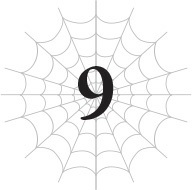
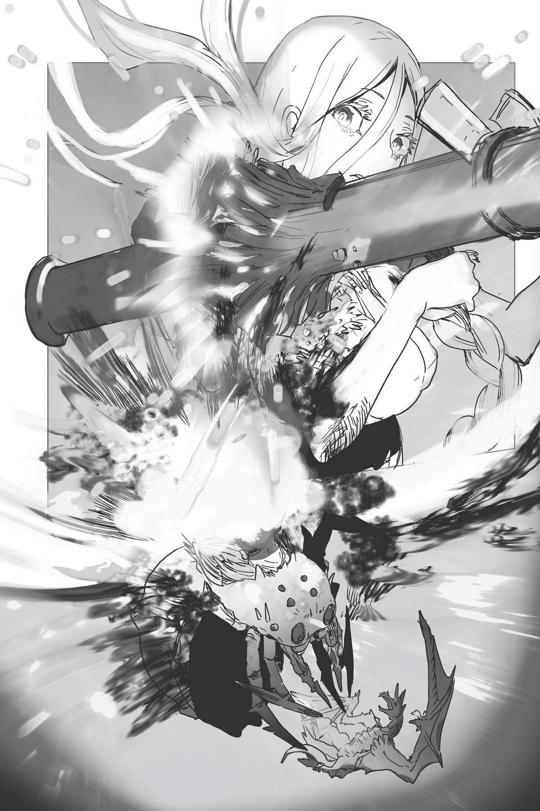

# Chương 9: Kẻ địch ở khắp mọi nơi!
*(The Enemy Is Everywhere!)*

---

Giai đoạn hai của trận không chiến chống lại lũ phi cơ chiến đấu đang diễn ra suôn sẻ tới mức khiến giai đoạn một cảm giác cứ như một cơn ác mộng xa xôi nào đó vậy.

Có vài nguyên nhân dẫn đến điều này, nhưng lớn nhất là vì chúng tôi đã phủ đầu chúng bằng một đòn tấn công trước.

Tôi và Ma Vương đã cùng bầy rồng phối hợp tung ra một đòn [Phong Ma pháp] khổng lồ nhắm vào chúng.

Trước đó, do bầy phi long và lũ phi cơ cứ đan xen lộn xộn vào nhau nên đòn này là bất khả thi, nhưng sau khi Ma Vương quét sạch một lượng lớn phi cơ, việc phân biệt đồng minh và kẻ thù đã trở nên dễ dàng hơn nhiều.

Và chúng tôi sẽ là lũ ngốc nếu bỏ lỡ cơ hội ngon ăn như thế.

Thế là chúng tôi giáng một khối khí nén khổng lồ thẳng vào bầy phi cơ đang bay về phía mình.

Nghe cụm từ “khối khí” thì có vẻ chẳng có gì ấn tượng cho lắm, nhưng tin tôi đi, nó khủng khiếp dã man.

Hãy tưởng tượng những cơn bão siêu cấp mà bạn thỉnh thoảng vẫn thấy trên bản tin ấy.

Nếu bạn từng thấy cảnh cây cối bị bật rễ và cả căn nhà bị thổi bay mất dạng, bạn sẽ hiểu sức tàn phá của gió kinh hoàng đến mức nào.

Chúng tôi đã kiểm soát nguồn lực lượng cuồng bạo đó bằng ma pháp, thậm chí còn nén nó lại để làm nó mạnh hơn nữa trước khi phóng thẳng vào lũ phi cơ chiến đấu.

Nói đến [Phong Ma pháp], có thể bạn sẽ hình dung ra những đòn tấn công sắc bén kiểu lưỡi dao gió hay đại loại thế, nhưng thực tế thì nó rộng và đập búa tạ hơn nhiều.

Ý tôi là, đòn tấn công đó khổng lồ đến mức chúng tôi thậm chí còn hy vọng nó có thể làm trầy xước chiếc UFO luôn cơ mà. Lũ phi cơ chiến đấu tép riu ngu ngốc kia đương nhiên là không có cửa rồi.

Kết quả là, hơn một nửa đợt phi cơ thứ hai đã bị thổi bay chỉ bằng một cú nổ duy nhất đó.

Có vẻ như e ngại việc lại bị gom vào một chỗ rồi tiêu diệt sạch, lũ phi cơ sau đó bắt đầu tản ra khá rộng, nên chúng tôi không có cơ hội dùng lại chiêu cũ nữa.

Cũng hơi ức chế thật, vì nếu chúng cứ tụ lại gần nhau thì chúng tôi chắc chắn đã có thể tiễn toàn bộ chúng đi chầu trời trong một nốt nhạc rồi.

Nhưng dù sao thì đòn đó vẫn cực kỳ hiệu quả.

Nhờ đà thắng lợi từ đòn phủ đầu đó, bầy phi long đang lần lượt bắn hạ những chiếc phi cơ còn sót lại.

Tuy nhiên, đáng tiếc là ngay cả ma pháp khổng lồ kia cũng không làm trầy xước chiếc UFO dù chỉ một chút.

Lớp kết giới bảo vệ UFO quá sức kiên cố, mặc dù ma pháp chắc chắn đã đánh trúng nó nhưng nó vẫn trơ trơ không hề suy chuyển.

Liệu khẩu bazooka mà Potimas đưa cho tôi có thực sự xuyên thủng được thứ đó không đây?

Tôi thực sự thấy lo ngại đấy.

Dù vậy, hiện tại mọi thứ có vẻ đang tiến triển theo hướng có lợi cho chúng tôi.

Số lượng phi cơ chiến đấu cuối cùng cũng thưa dần. Chắc là chiếc UFO nhận ra nếu nó phóng hết số phi cơ còn lại cùng lúc thì sẽ lại bị chúng tôi thổi bay tiếp, hoặc là nó đã cạn kiệt hàng dự phòng rồi.

Vì hiện tại đang chiếm ưu thế về số lượng, bầy phi long xử lý lũ phi cơ không gặp chút khó khăn nào.

Lũ phi cơ có vẻ đặc biệt e dè Ma Vương, người vừa tàn sát chúng không thương tiếc cách đây không lâu.

Cô ta đi đến đâu, chúng lại dạt ra né tránh đến đó.

Chúng thừa biết nếu lại gần, cô ta sẽ nhảy lên lưng và đập tan xác chúng ngay lập tức.

Vì vậy, hiện tại Ma Vương chỉ đứng yên trên lưng con rồng của mình, thỉnh thoảng lại bắn ra vài phép thuật nho nhỏ.

Mặc dù mỗi lần cô ta ra tay là lại có một chiếc phi cơ rụng xuống, nên tôi đoán chúng cũng chẳng “nho nhỏ” gì cho cam.

Nhưng so với màn nhảy qua nhảy lại giữa các máy bay lúc nãy thì đòn này ít hào nhoáng hơn nhiều, nên chúng ta cứ tạm gọi là “nho nhỏ” vậy.

“Ha ha! Tránh đường cho ta! Phong Long Hyuvan vĩ đại tới đây!”

Và rồi, đương nhiên, có kẻ nào đó đang tỏ ra vô cùng phấn khích quá đà.

Tôi chắc là mình chẳng cần phải nói rõ đó là ai đâu nhỉ. Đặc biệt là khi chính nó vừa tự xướng tên mình xong.

Bớt bớt lại giùm cái đi, Hyuvan?

Ngươi cứ làm mấy trò ngốc nghếch đó thì sẽ làm tôi trông cũng ngốc lây đấy, vì tôi đang cưỡi trên lưng ngươi đây này.

Nhưng tôi cũng hiểu tại sao nó lại muốn phấn khích như thế.

Mới cách đây không lâu, tình hình tệ đến mức nó đã chuẩn bị tinh thần để tử trận, vậy mà giờ đây thế trận đã hoàn toàn nghiêng về phía chúng tôi.

Đúng vậy. Chắc là nó phải làm loạn lên thế này để quên đi mấy lời sến súa mà mình đã lải nhải trước đó.

Tôi hiểu mà. Tôi hoàn toàn thấu hiểu, người anh em ạ!

Thỉnh thoảng bạn sẽ nói ra vài câu nghe có vẻ rất hợp hoàn cảnh lúc đó, nhưng khi bình tâm nhìn lại lúc tỉnh táo, bạn sẽ thấy nó ngượng ngùng và xấu hổ dã man!

Chuyện đó xảy ra với tôi như cơm bữa luôn!

Ý tôi là, lúc nào cũng thế ấy!

Bởi vậy nên lúc nào bạn cũng phải tự kiềm chế bản thân, nếu không bạn sẽ lỡ lời nói ra thứ gì đó khiến mình hối hận cả đời đấy!

Nhưng rồi tôi chợt nhận ra một điều.

Chẳng phải mọi chuyện đang diễn ra quá suôn sẻ sao?

Ý tôi là, có rất nhiều yếu tố giải thích tại sao mọi việc lại suôn sẻ thế này.

Cũng có lý do chính đáng để chúng tôi tiến quân mạnh mẽ như vậy.

Nhưng nếu tôi lùi lại một bước và bình tĩnh quan sát cục diện tiến công này, tôi không khỏi cảm thấy có gì đó sai sai.

Trước đó chúng tôi còn đang chật vật đến thế, vậy sao tình thế lại đảo ngược nhanh chóng như vậy được?

Cứ như thể chúng tôi đang bị cố tình dẫn dắt theo hướng này vậy.

Trong một khoảnh khắc ngắn ngủi, tôi nổi cả da gà.

Tôi dùng kỹ năng `[Phát hiện]` để kiểm tra lại tình trạng hiện tại của bầy phi long một lần nữa.

Cả lũ phi cơ chiến đấu lẫn chiếc UFO nữa.

Lũ đó tồn tại bên ngoài hệ thống, nên những kỹ năng kiểu như [Thẩm định] hoàn toàn vô dụng với chúng.

Điều đó có nghĩa là tôi không thể biết được chỉ số sức mạnh hay năng lực chính xác của chúng, nhưng tệ hơn cả là: kỹ năng `[Tương Lai Nhãn]` của tôi cũng không hoạt động với chúng.

Tôi không biết chúng định làm gì tiếp theo.

Tuy nhiên, trong trường hợp này, tôi nghĩ mình có thể đoán được phần nào.

Chiếc UFO đang chuẩn bị cho một đòn tấn công cực lớn.

“Né tránh ngay—lập tức!”

Tôi gửi lời cảnh báo đến toàn bộ bầy phi long thông qua `[Thần giao cách cảm]`.

Nếu tôi cố hét lên bằng miệng, âm thanh phát ra chắc chắn chỉ là tiếng rít chói tai lộn xộn mà thôi.

Đó là lý do tôi phải dùng `[Thần giao cách cảm]`, mặc dù tôi cũng không chắc nó có giúp ích được gì nhiều hay không.

Nhưng vì lời cảnh báo hoảng loạn của tôi đã khiến kha khá con phi long giật mình tuân lệnh, tôi muốn tin là nó đã có tác dụng tốt.

Dù vậy, tổn thất vẫn cực kỳ nghiêm trọng.

Trong một khoảnh khắc, bầu trời hoàn toàn bị bao phủ bởi ánh sáng chói lòa.

Chiếc UFO vừa khai hỏa một chùm tia laser khổng lồ.

Nó nuốt chửng mọi thứ trên đường đi, từ phi cơ chiến đấu cho tới phi long.

Khi chùm sáng tan đi, không còn lại bất cứ thứ gì trên quỹ đạo của nó nữa.

Tất cả đã bị bốc hơi thành hư vô.

Khốn kiếp!

Chúng tôi bị lừa rồi!

Lũ phi cơ chiến đấu chỉ là một loại vũ khí của UFO mà thôi.

Cho dù chúng tôi có bắn hạ bao nhiêu chiếc đi chăng nữa, điều đó cũng chẳng giải quyết được tận gốc vấn đề.

Đáng lẽ tôi phải nhận ra điều đó sớm hơn. Kẻ thù thực sự của chúng tôi là chiếc UFO kia, chứ không phải mấy cái máy bay ngu ngốc kia.

Chiếc UFO trơ trơ không một vết xước trước đòn Phong Ma pháp khổng lồ kia mới là đối thủ chính, còn lũ phi cơ kia chỉ là hàng khuyến mãi đi kèm thôi.

Nhưng tôi đã quên béng đi mất và ảo tưởng rằng mọi chuyện đang diễn ra tốt đẹp chỉ vì chúng tôi đã kiểm soát được lũ phi cơ chiến đấu.

Và đây là cái giá phải trả cho sự bất cẩn đó: một nửa quân số của bầy phi long bị xóa sổ.

Chúng tôi thậm chí còn mất đi vài con rồng thực sự nữa.

Xem ra chúng đã đòi lại cả vốn lẫn lãi sau đòn tấn công trước của chúng tôi rồi.

Chiếc UFO là một siêu vũ khí khổng lồ, nên đương nhiên nó phải sở hữu những trang bị tối tân cực mạnh rồi.

Huống chi nó còn đang mang theo một quả bom có sức công phá đủ để thổi bay cả một lục địa cơ mà.

“Áaaa, khốn kiếp! Chúng ta dính quả đậm rồi. Lần này hỏng bét thật rồi!”

Phong Long Hyuvan gầm lên giận dữ.

“Nhưng vẫn phải cảm ơn cô nương. Chỉ cần chậm một giây thôi là tụi này cũng tan thành mây khói rồi.”

Tôi vẫy chân ra hiệu bảo nó đừng bận tâm.

Vì tôi đang cưỡi trên lưng nó, tôi chẳng biết liệu nó có nhìn thấy hành động của tôi hay có hiểu được không nữa, nhưng kệ đi.

Dù sao thì chính nó là đứa đã phản ứng tức thì trước cảnh báo của tôi và thực hiện động tác né tránh kịp thời.

Nhờ có nó mà chúng tôi không bị thổi bay.

Nếu Hyuvan bị bắn trúng, hiển nhiên tôi cũng sẽ dính đòn theo vì đang ở trên lưng nó. Nó không cần phải cảm ơn tôi vì đã cứu mạng cả hai đứa.

Mặc dù tôi có kỹ năng `[Bất tử]`, nên có bị nổ tung thành trăm mảnh thì tôi chắc vẫn sẽ sống sót thôi.

Nhưng hiện tại chúng tôi có việc quan trọng hơn cần giải quyết thay vì đứng cảm ơn nhau.

Chúng tôi phải nhanh chóng chấn chỉnh lại đội hình bầy phi long, nếu không chiếc UFO sẽ truy quét chúng tôi tiếp.

Nếu tôi là chiếc UFO, tôi biết mình sẽ không bao giờ bỏ lỡ một cơ hội tốt thế này.

Quả nhiên, chiếc UFO lập tức phóng ra thêm một bầy phi cơ chiến đấu mới.

Hóa ra nó vẫn còn cả đống hàng dự phòng trong kho.

Nếu toàn bộ số phi cơ đó tấn công chúng tôi lúc này, bầy phi long sẽ bị phân tán và bị tiêu diệt từng con một.

Tôi phải tập hợp chúng lại để đối phó với lũ máy bay đó.

Trong lúc đang hoảng hốt nhìn quanh, tôi lại phát hiện ra một cảnh tượng còn tồi tệ hơn nữa.

Khẩu pháo chính của chiếc UFO, thứ vừa bắn vào bầy phi long lúc nãy, đang từ từ điều chỉnh góc bắn.

Giờ đây nó đang quay về phía lực lượng dưới mặt đất của chúng tôi.

Chiếc UFO khốn kiếp này. Nó nhận ra bầy phi long bay quá nhanh, nên đã quyết định nhắm vào mục tiêu dễ xơi hơn.

Vì bầy rồng đã bị tản ra, nó thừa biết mình sẽ gây ra nhiều sát thương hơn nếu nổ súng vào đội quân đang tập trung đông đảo bên dưới.

Rõ ràng, chiếc UFO này được trang bị một hệ thống trí tuệ nhân tạo (AI) cực kỳ cao cấp.

Nghiêm túc đấy, thế này là quá đủ rồi nha.

Lũ phi cơ chiến đấu thì truy đuổi quân ta trên bầu trời, còn khẩu pháo chính của chiếc UFO thì lại nhắm thẳng vào quân ta dưới mặt đất.

Kẻ địch ở khắp mọi nơi, chúng tôi đang lâm vào tình thế nguy hiểm từ mọi phía.

Nếu không làm gì đó nhanh lên, chúng tôi tiêu đời là cái chắc.

“White!”

Trong lúc tôi đang vắt óc nghĩ kế, ai đó đã gửi cho tôi một tin nhắn thần giao cách cảm.

Là Ma Vương Ariel.

“Ta sẽ lo lũ phi cơ chiến đấu, nên ngươi hãy làm gì đó với khẩu pháo chính của cái đĩa bay kia đi!”

Làm gì đó ư?

Ý tôi là, tôi sẽ cố hết sức, nhưng đó có thực sự là thứ tôi có thể giải quyết được không vậy?

“Kẻ màu trắng kia.”

Một giọng nói khác xen vào cuộc đàm thoại thần giao cách cảm. Giọng nói này chắc chắn là của Potimas.

“Hãy sử dụng món vũ khí ta đưa cho ngươi nhắm vào khẩu pháo chính của kẻ địch. Thứ đó dư sức phá hủy nó.”

Ồ phải rồi, nghe hắn nhắc tôi mới nhớ ra mình có giữ cái thứ đó.

Khẩu bazooka, món đồ Potimas đưa cho tôi để chúng tôi có thể đột nhập vào trong chiếc UFO.

Ý tưởng ban đầu là dùng nó để đục một lỗ trên lớp vỏ ngoài của UFO để chui vào trong, nên tôi đoán nó cũng có thể phá hủy luôn khẩu pháo chính của UFO.

Nếu nó bắn thủng được lớp vỏ ngoài thì tại sao lại không phá hủy được khẩu pháo chính chứ?

Nhưng nếu thế thì tôi sẽ lãng phí phát bắn duy nhất của khẩu bazooka vào khẩu pháo đó mất. Rồi làm sao chúng tôi đột nhập vào trong được đây?

“Nhưng nếu làm thế thì chúng ta sẽ không thể đột nhập vào trong được nữa.”

Ma Vương cũng nêu ra cùng một thắc mắc giống hệt tôi.

“Đừng lo. Uy lực của nó lớn hơn nhiều so với mức cần thiết để phá hủy khẩu pháo chính. Nó sẽ thổi bay bức tường bên ngoài cùng với bệ pháo luôn.”

À.

Tức là nó sẽ thổi bay khẩu pháo chính cùng với bức tường phía sau nó, rồi chúng tôi sẽ đột nhập vào qua cái lỗ đó đúng không?

Hừm. Liệu chuyện đó có thực sự khả thi không đây?

Thôi thì, hiện tại tôi đoán mình không còn lựa chọn nào khác ngoài việc tin lời lão ta vậy.

“Ừ.” Tôi trả lời ngắn gọn.

“Ừ?”

“Ý nó là ‘được rồi, không vấn đề gì đâu’.”

Potimas không hiểu câu trả lời ngắn gọn cộc lốc của tôi, nên Ma Vương phải giải thích hộ.

Ừ thì, thỉnh thoảng có cô ta ở bên cạnh cũng khá là tiện lợi, vì cô ta thường hiểu ngay tôi đang nghĩ gì.

“Hiểu rồi. Vậy là chúng ta phải bay sát sạt khẩu pháo khổng lồ kia đúng chứ?”

Hyuvan, nãy giờ vẫn chăm chú lắng nghe cuộc trò chuyện của chúng tôi, lên tiếng xác nhận hướng hành động.

Tôi gật đầu.

“Rõ rồi, đại ca! Bám cho chắc vào!”

Nói đoạn, nó lập tức tăng tốc lao thẳng về phía khẩu pháo chính.

Như thể đoán trước được ý đồ của chúng tôi, một bầy phi cơ chiến đấu bắt đầu ùa tới bao vây.

“Tặc lưỡi!”

“Kệ chúng đi—tiếp tục lao lên.”

Hyuvan tỏ vẻ lo ngại trước lũ máy bay, nên tôi cố bảo nó hãy tập trung tiến về phía trước.

Khi lũ phi cơ áp sát, tôi dùng Phong Ma pháp để đẩy lui chúng.

Chúng có cùng một loại kết giới như xe tăng, nên [Ma pháp Hắc ám] yêu thích của tôi hoàn toàn vô dụng trước chúng.

Đoàn nghĩa là việc tôi buộc phải dùng Phong Ma pháp, bất kể có thích hay không.

Nghiêm túc đấy, bạn sẽ không bao giờ biết được loại kỹ năng nào sẽ có ích vào lúc lâm nguy đâu.

Tôi từng nghĩ mình chỉ cần đến Hỏa, Thủy và Thổ Ma pháp, và tôi thực sự vẫn thỉnh thoảng dùng chúng trong cuộc sống thường nhật, chứ chưa bao giờ tưởng tượng nổi mình sẽ có lúc cần dùng đến các loại ma pháp khác.

Ý tôi là, [Ma pháp Hắc ám] là quá đủ để tấn công rồi.

Ná mạnh hơn và nhanh hơn, vì cấp độ kỹ năng và kinh nghiệm sử dụng của tôi với nó cao hơn hẳn, nên chẳng việc gì phải dùng các loại ma pháp khác mà mình không quen tay.

Nhưng chà, thật may là tôi vẫn cày cấp cho mấy kỹ năng ma pháp khác.

Chuyện này chứng minh rằng bạn càng có nhiều kỹ năng càng tốt.

Ngay cả những kỹ năng tưởng chừng hoàn toàn vô dụng khác biết đâu cũng có ngày cứu mạng tôi không chừng! Ít nhất là tôi hy vọng thế.

Nghiêm túc đấy, tôi biết dùng [Khiên Thuật] và mấy thứ rác rưởi tương tự vào việc gì bây giờ?

Trên đời này có cái khiên nào cứng hơn cơ thể tôi không chứ?

Thôi được rồi, tôi lại lạc đề mất rồi. Quay lại trận chiến với lũ phi cơ nào.

Chúng chắc hẳn đã đánh hơi thấy điều gì đó từ Hyuvan và tôi, bởi vì chúng đang ùa tới nhắm vào chúng tôi điên cuồng như thể không còn ngày mai vậy.

Tôi đoán chuyện đó có khi lại tốt, vì nó giúp bầy rồng khác có thời gian hồi phục, nhưng vì tôi có nhiệm vụ phải phá hủy khẩu pháo chính ở đằng kia, tôi không có thời gian rỗi hơi để chơi đùa với mấy cái máy bay chết tiệt này.

Đó là lý do tôi bảo Hyuvan cứ tiếp tục lao lên phía trước.

Vừa bắn hạ lũ phi cơ truy đuổi bằng Phong Ma pháp, chúng tôi vừa tiếp tục áp sát chiếc UFO.

May mắn thay, khẩu pháo chính có vẻ không có khả năng bắn liên tiếp ở tốc độ cao.

Nó dường như vẫn đang trong quá trình nạp năng lượng, nên không có dấu hiệu cho thấy nó chuẩn bị khai hỏa hay gì cả.

Tuy vậy, điều đó không có nghĩa là chúng tôi có thời gian thong thả chơi đùa.

Nếu tôi không phá hủy khẩu pháo chính trước khi nó nổ súng phát tiếp theo, lực lượng dưới mặt đất của chúng tôi sẽ bị xóa sổ hoàn toàn.

Khẩu pháo đó mạnh đến mức thổi bay một con rồng không để lại dấu vết, nên ngay cả những kẻ mạnh nhất trong đội hình dưới đất của chúng tôi là các Taratect Nữ Vương cũng sẽ gặp nguy hiểm cực kỳ.

Tôi không được phép bắn trượt.

Ư, nếu không phải vì cái kết giới ngu ngốc của chiếc UFO này, tôi đã có thể dùng [Dịch chuyển Cự ly ngắn] ra ngay trước mặt khẩu pháo chính của UFO và bắn bay xác nó bằng khẩu bazooka, dễ như ăn kẹo.

Bình thường, tôi có thể dùng [Dịch chuyển Cự ly ngắn] để dịch chuyển đến bất kỳ điểm nào trong tầm mắt, nhưng rõ ràng chuyện đó là bất khả thi khi có cái kết giới bí ẩn khốn kiếp kia cản trở.

Tôi đoán là vì Ma pháp Không gian không thể hoạt động cho đến khi bạn chỉ định được một tọa độ không gian chính xác để thi triển thuật thức.

Nhưng việc chỉ định bất kỳ tọa độ không gian nào bên trong kết giới là hoàn toàn bất khả thi. Nếu tôi cố làm vậy, chỉ có nước phí công vô ích.

Và ngay cả khi không chạm trực tiếp vào kết giới, những khu vực không gian nằm quá gần kết giới cũng cực kỳ khó nhắm mục tiêu chính xác.

Cái kết giới bí ẩn kia có vẻ như tác động trực tiếp lên chính cấu trúc không gian, có lẽ đó là nguyên nhân.

Khốn kiếp thật, mấy cái kết giới này đúng là cái gai trong mắt tôi mà!

Kẻ nào đã chế tạo ra thứ nguy hiểm như thế này chứ?!

Là Potimas chứ còn ai vào đây nữa, rõ ràng quá rồi!

Tôi ước gì tên đó lăn ra chết phách đi cho rồi.

Tốt nhất là chết luôn ở quá khứ ấy, trước khi hắn kịp phát minh ra cái kết giới khốn kiếp này.

Có ai cho tôi mượn cỗ máy thời gian không?

Tôi chỉ muốn quay về thời điểm Potimas vừa mới chào đời và bóp chết hắn ngay tại chỗ.

Khi đó lịch sử sẽ được viết lại, và cái kết giới kia sẽ hoàn toàn biến mất ở hiện tại.

Phù. Thôi nào. Ngừng nghĩ mấy chuyện vớ vẩn đó và tập trung vào công việc đi.

Tôi có thể cản bước lũ phi cơ chiến đấu không gặp trở ngại gì, và Ma Vương thì đang bắn hạ chúng rào rào khắp nơi để bảo vệ bầy phi long, nên tôi chắc chắn sẽ phá hủy được khẩu pháo chính trước khi nó kịp bắn phát thứ hai.

If tôi bắn trượt phát bazooka này thì chúng tôi sẽ đi đời nhà ma, nên chúng tôi phải tiếp cận chiếc UFO gần nhất có thể để tôi khai hỏa ở khoảng cách không thể nào trượt được.

…Ủa? Chờ một chút.

Tiếp cận gần chiếc UFO?

Hỏi: Tôi đang cất khẩu bazooka ở đâu ấy nhỉ?

Đáp: Trong [Lưu trữ Không gian].

Nhưng nếu tôi ở quá gần cái kết giới bí ẩn kia, tôi sẽ không thể sử dụng Ma pháp Không gian được.

Thôi bỏ bu rồi!

Tôi sẽ không thể lôi khẩu bazooka ra được nếu ở quá gần chiếc UFO!

Và vì Hyuvan là một con rồng chuyên về tốc độ, chúng tôi đang lao sát sạt chiếc UFO theo từng giây.

Nó gần như đã sừng sững ngay trước mũi chúng tôi rồi.

Chết dở. Tôi phải lôi khẩu bazooka ra nhanh lên!

Hoảng hốt, tôi cuống cuồng tìm cách kéo khẩu bazooka ra khỏi [Lưu trữ Không gian].

Thứ này to và dài một cách ngu ngốc, kích thước gần bằng một cái cột điện chứ chẳng chơi.

Khốn kiếp! Cái này to quá thể đáng! Làm sao tôi kéo ra kịp đây?!

Và đương nhiên ngươi lại chọn đúng khoảnh khắc này để phô diễn thực lực hả, tên lâu la chết tiệt kia!

Sao ngươi lại bay sát sạt chiếc UFO nhanh đến thế mà không giảm tốc độ một giây nào vậy hả?

Làm ơn đi! Chậm lại một chút giùm cái!

Tôi không thể lôi khẩu bazooka ra được!

Đây đúng là một tình thế tiến thoái lưỡng nan vừa ngớ ngẩn vừa nghiêm trọng mà tôi tự đưa mình vào.

Nhưng bằng cách nào đó, tôi vẫn suýt soát kịp giờ!

Ngay khi tôi vừa lôi được khẩu bazooka ra hoàn toàn, ảnh hưởng của kết giới đã làm cổng kết nối của [Lưu trữ Không gian] biến mất tăm.

Phù, suýt nữa thì tiêu đời.

Nếu chuyện đó xảy ra trong lúc tôi còn đang lôi dở khẩu bazooka ra, chắc nó đã bị bẻ đôi rồi.

Hoặc kiểu như, bị chia đôi giữa hai chiều không gian hay đại loại thế.

“Tuyệt! Sẵn sàng chưa, cô nương?! Chơi luôn đây!”

Thấy tôi đã vác khẩu bazooka ra ngoài, Hyuvan lập tức lao thẳng về phía khẩu pháo chính.

Vờ như kế hoạch của chúng tôi chưa từng suýt đổ bể hoàn toàn, tôi tỏ ra tỉnh bơ và chuẩn bị ngắm bắn.

Nói nghiêm túc đấy, tốt nhất là không nên để cho lực lượng dưới mặt đất biết rằng họ suýt nữa thì bay màu chỉ vì sự tính toán sai lầm ngớ ngẩn của tôi.

Phù. May mà kịp giờ.

Thật luôn đấy.

Tôi tì khẩu bazooka lên vai mình.

Cơ chế khai hỏa của thứ này cũng chẳng có gì phức tạp. Việc duy nhất bạn phải làm là bóp cò.

Mặc dù bạn phải sở hữu một sức mạnh vật lý điên rồ thì mới có thể nâng nổi cái thứ khổng lồ này.

Khẩu pháo chính của chiếc UFO ngay trước mặt chúng tôi.

Ở khoảng cách gần thế này thì có là một kẻ nghiệp dư đệ nhất cũng không thể bắn trượt được.

Hoàn hảo!

Quyết định thế đi, tôi bóp cò.

Hóa ra, đó lại là một bước đi sai lầm.

Do vừa phải trải qua tình thế căng thẳng tột độ lại vừa nhẹ nhõm vì đã kịp lôi vũ khí ra trước khi phát bắn thứ hai của UFO khai hỏa, tôi đoán mình đã hơi quá bất cẩn.

Tôi đã ngu ngốc quên béng mất ai là kẻ đã chế tạo ra khẩu bazooka đang cầm trên tay.

Ánh sáng chói lòa bắn ra từ khẩu bazooka.

Khẩu bazooka này rõ ràng là loại vũ khí tương tự như UFO và phi cơ chiến đấu, vì nó bắn ra một chùm tia sáng thay vì đạn vật lý thông thường.

Ờ thì, chuyện đó hoàn toàn bình thường.

Vấn đề là, chùm tia sáng đó cũng đồng thời bắn phụt ra từ đầu bên kia, hướng thẳng vào tôi.

Thôi xong.

Ngay khi ý nghĩ đó vừa lóe lên trong đầu, tôi lập tức buông lỏng vòng ôm quanh cơ thể Hyuvan, cố sức nhảy bật ra xa nó nhất có thể.

Không phải là tôi đã tính toán kỹ lưỡng gì đâu, nhưng nếu cứ bám ở đó thì nó cũng sẽ bị cuốn vào đòn đánh mất, nên tôi nghĩ đó là quyết định đúng đắn.

Cuốn vào cái gì ư, bạn hỏi á?

Cú nổ tự hủy của khẩu bazooka chứ cái gì nữa!

Tia sáng từ khẩu bazooka đánh trúng khẩu pháo chính của chiếc UFO diện rộng.

Đúng như Potimas đã đảm bảo, nó phá hủy hoàn toàn khẩu pháo chính và đục thủng một lỗ lớn trên bức tường phía sau.

Chuyện đó cũng tốt đi.

Nhưng tia sáng dội ngược của khẩu bazooka cũng thổi bay luôn đôi tay đang cầm nó của tôi.

Không chỉ có thế, nó còn quét sạch luôn bờ vai đang đỡ súng và cả cái đầu người của tôi nữa.

Thực tế là, toàn bộ nửa thân trên dạng người của tôi đã bị thổi bay mất dạng, và một nửa thân dưới dạng nhện cũng bị nổ tung theo.

May mắn thay, tôi đã tránh được sát thương tiếp theo nhờ việc đang rơi tự do ra xa khỏi chùm tia sáng đó.

Việc rơi tự do cũng giúp tôi thoát khỏi phạm vi ảnh hưởng của kết giới đủ xa để có thể sử dụng ma pháp trở lại.

Cố ép bản thân phải duy trì ý thức, tôi điên cuồng cast [Ma pháp Trị liệu] lên chính mình.

Thật may mắn là tôi đã học được [Kỳ Tích Ma Pháp], cấp độ tối thượng của [Ma pháp Hồi phục].

Nếu không, tôi đời nào có thể hồi phục nổi khi bị thổi bay mất một nửa bộ não như thế này.

Chắc là tôi vẫn chưa chết được đâu, nhờ có kỹ năng `[Bất tử]`, nhưng tôi không thể tư duy bình thường nếu mất đi cả cái đầu được.

Ngay cả việc mất đi nửa bộ não cũng là một vấn đề cực kỳ nghiêm trọng rồi. Phải mất một khoảng thời gian để chữa lành loại chấn thương kiểu đó, nên tôi sẽ không thể chiến đấu trong một lúc.

Rõ ràng, [Ma pháp Trị liệu] thông thường sẽ mất rất nhiều thời gian mới có thể tái tạo lại một bộ phận cơ thể bị mất.

Đặc biệt lại là một cơ quan phức tạp như não bộ.

Thực tế là, nếu tôi không có cả kỹ năng `[Bất tử]` lẫn `[Kỳ Tích Ma Pháp]`, tôi chắc chắn đã ngoẻo ngay tại chỗ rồi chứ chẳng chơi!

Đúng thế, tôi biết ngay mà, đó chính xác là những gì tên khốn Potimas đang mưu tính!

Phải, khẩu bazooka đó hoạt động đúng hệt như những gì hắn nói.

Nó đã phá hủy khẩu pháo chính và đục một cái lỗ để chúng tôi thâm nhập vào trong UFO.

Thông tin nó chỉ sử dụng được một lần duy nhất cũng hoàn toàn chính xác.

Ý tôi là, làm sao mà bắn phát thứ hai được nữa khi mà nó tự nổ tung, tiện tay tiễn luôn kẻ khai hỏa đi chầu trời chứ!

Nghĩa là Potimas đã có ý định giết chết kẻ nào sử dụng nó—hoặc là Ma Vương, hoặc là tôi.

Tôi biết ngay gã đó là kẻ thù của chúng tôi mà!

Lão phải độc ác đến mức nào mới đi âm mưu lấy mạng đồng minh trong khi chúng tôi đang cố gắng giải cứu thế giới này cơ chứ?!

Lực hút trái đất kéo cơ thể tôi rơi thẳng xuống đất.

Phần lớn năng lượng của tôi hiện tại đang phải tập trung vào việc chữa trị bộ não, nên tôi không thể tự điều chỉnh tư thế của mình trên không trung.

Tôi phải hoàn thành việc chữa lành bộ não trước khi chạm đất!

May mắn thay, hóa ra tôi chỉ lo lắng hão huyền.

Có thứ gì đó đã đỡ lấy cơ thể tôi từ phía dưới.

“Cô nương ổn không?!”

Hyuvan lao tới đỡ lấy tôi trên lưng ngay giữa không trung.

Ồ, cú đỡ đẹp mắt đấy, người anh em.

Tôi biết mình từng gọi ngươi là tên lâu la tép riu này nọ, nhưng hiện tại ngươi là kẻ tôi yêu quý nhất trên đời đấy.

Anh hùng cứu mỹ nhân trong lúc hiểm nghèo sao? Chỉ số thiện cảm của tôi dành cho ngươi vừa tăng vọt rồi đấy.

Hiện tại tôi vẫn chưa thể dùng `[Thần giao cách cảm]` một cách bình thường được, nên tôi đập đập vào lưng nó để báo hiệu rằng tôi vẫn ổn.

“Còn sống à! Làm ta lo sốt vó tưởng cô ngoẻo rồi chứ, cái đồ ngốc bốc mùi này!”

Này, tôi không có ngốc, và tôi cũng không có bốc mùi nhé.

Phù, bộ não nhện của tôi cuối cùng cũng đã hoàn toàn nguyên vẹn trở lại.

Chà, [Kỳ Tích Ma Pháp] đúng là điên rồ thật, tái tạo lại nửa bộ não trong một khoảng thời gian ngắn ngủi sau khi bị thổi bay như thế.

Đúng là không hổ danh mang tên “Kỳ Tích”.

“Ráng chịu đựng chút đi! Ta sẽ đi tìm người biết dùng [Ma pháp Trị liệu] ngay đây!”

Hyuvan cuống cuồng hết cả lên. Xin lỗi nhé bạn hiền, nhưng tôi tự xử xong rồi.

Thấy nó có vẻ định quay đầu bay đi, tôi lập tức ngăn lại bằng một tin nhắn thần giao cách cảm.

“Không sao. Tôi tự chữa lành được rồi.”

Chúng tôi không thể quay đầu vào lúc này.

Tôi phải đột nhập vào bên trong chiếc UFO ngay lập tức.

“Hả? Cô chắc chứ?”

“Chắc chắn. Hãy đưa tôi tới đó.”

Tôi dùng một chân nhện chỉ về phía chiếc UFO.

Tôi chắc sẽ hoàn tất việc hồi phục trước khi chúng tôi bay lên tới đó, nên không có vấn đề gì cả.

Đúng thế, tôi có nhiệm vụ phải hoàn thành.

Tôi phải đi trả thù tên khốn bẩn thỉu đang trên đường đột nhập vào trong chiếc UFO kia ngay lập tức!

Hì hì. Hãy đợi đấy, Potimas!

Tôi sẽ bắt lão phải trả giá đắt cho việc dám mưu sát tôi!

---

[◀ Chương trước: Đoạn phụ: Nữ chủ nhân Ma cà rồng và người hầu bàn luận về năng lượng MA](interlude_the_vampire_mistress_and_her_servant_discuss_ma_energy.md) | [Chương tiếp theo: Đoạn phụ: Nữ chủ nhân Ma cà rồng và người hầu bàn luận về Potimas ▶](interlude_the_vampire_mistress_and_her_servant_discuss_potimas.md)
