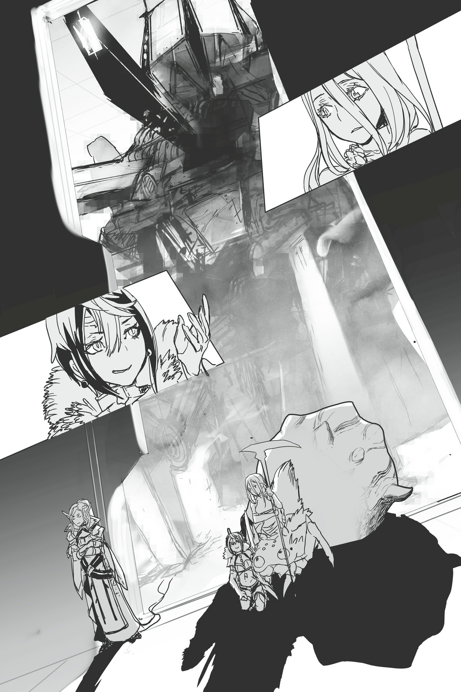

# Chương 12: Tiến triển bão táp của đội gỡ bom
*(The Bomb Squad’s Explosive Progress)*

---

Theo sự dẫn đường của Potimas, chúng tôi tiến bước qua chiếc UFO khổng lồ.

Từ lúc Ma Vương bắt đầu bung toàn lực, tốc độ di chuyển của cả nhóm tăng lên khá nhanh.

Một khi cô ta đã nghiêm túc, thì dù số lượng robot hay xe tăng có nhiều bao nhiêu đi chăng nữa cũng chẳng thể làm khó nổi.

Một con robot hoang dã xuất hiện!

Ồ khoan đã, nó tẻo luôn rồi!

Đại loại là kiểu như vậy đấy.

Cô ta dọn sạch chúng nhanh đến mức mắt tôi suýt chút nữa là không theo kịp.

Cứ đà này, ngay cả Potimas cũng chẳng tìm nổi cơ hội để giở trò tấn công cô ta.

Chỉ đơn giản là cô ta tiêu diệt kẻ địch quá nhanh.

Đã vậy, nhờ có [Bạo Thực], Ma Vương có thể chiến đấu bao lâu tùy thích.

Kiệt sức á? Mơ đi nhé. Cô ta chỉ cần dùng [Bạo Thực] gặm một ít kim loại là lại phục hồi sung mãn ngay.

Tôi cũng không biết đống đó ăn có ngon lành gì không, nhưng cô ta càn quét nhiệt tình lắm.

Nói thật lòng, cái kỹ năng này bá đạo đến mức làm tôi chỉ biết cười trừ.

Kiểu như, tại sao ngay từ đầu cô ta không nghiêm túc luôn cho rồi đi, thay vì cứ nơm nớp dè chừng Potimas làm gì?

Mà thôi, dù sao hiện tại chúng tôi cũng đang tiến triển khá tốt, nên chuyện đó không còn quan trọng nữa.

Kho dự trữ robot của chiếc UFO có lẽ cũng đang bắt đầu cạn kiệt dần, vì tần suất các đợt tấn công đã thưa thớt hơn nhiều.

Nhờ vậy chúng tôi có thể di chuyển nhanh hơn, ngày càng tiếp cận gần hơn với mục tiêu của mình.

Cụ thể là khoang chứa quả bom.

Đúng như dự đoán, quả bom nằm ở khu vực trung tâm của UFO.

Khi muốn thả bom, nó sẽ phóng thẳng từ vị trí đó ra ngoài.

Vấn đề là gì à? Chiếc UFO này to lớn một cách vô lý, thế nên khoảng cách từ đây đến khu vực trung tâm khá là xa.

Chưa kể khẩu pháo chính lại nằm ngay rìa vòng tròn, nghĩa là chúng tôi cơ bản đã xuất phát từ điểm xa nhất có thể.

Và vì mục đích ban đầu của UFO là vận chuyển vũ khí, lũ robot và xe tăng bên trong cứ liên tục ập tới cản đường, làm chậm tốc độ tiến quân của chúng tôi một cách rõ rệt.

Xem xét tình hình lúc đó, chúng tôi không còn lựa chọn nào khác ngoài việc phá hủy khẩu pháo chính rồi đột nhập từ lối đó, nhưng quả thực việc này đã ngốn không ít thời gian.

Càng kéo dài thời gian, tình cảnh của các đồng minh đang chiến đấu bên ngoài sẽ càng thêm khó khăn.

Hyuvan và lũ rồng khác sẽ không dễ dàng bị hạ gục, nhưng vài đứa trong số nhện rối có thể sẽ bay màu dễ như chơi nếu lơ là cảnh giác.

Ví dụ như Sael, hay Sael, hoặc là Sael chẳng hạn!

Tôi cũng không loại trừ khả năng Riel sẽ phạm phải một sai lầm ngớ ngẩn nào đó rồi tẻo luôn đâu.

Còn mấy con Taratect Nữ Vương á? Ai rảnh đâu mà lo lắng cho tụi nó chứ?

Nhớ giùm là tụi nó cùng loài với Mẹ đấy nhé.

Nếu đến cả tụi nó còn gặp nguy hiểm, thì những người khác cơ bản là cũng tiêu đời nhà ma rồi.

Nhưng nói gì thì nói, lũ nhện rối, Hyuvan và những người khác đều là những con quái vật khá mạnh, nên tôi tin họ sẽ ổn thôi.

Nhóm đáng lo ngại nhất chính là đám nhân loại mà lão Giáo hoàng mang theo.

Thật lòng mà nói, tôi đang tự hỏi liệu cuối cùng sẽ có bao nhiêu người trong số họ còn sống sót đây.

Nghiêm túc đấy, cuộc chiến này hoàn toàn vượt quá tầm của bọn họ rồi.

Chuyện này chẳng khác nào bắt những người dân thường tham gia vào một cuộc chiến quyết định vận mệnh của thế giới cả.

Ý tôi là, tôi biết họ là kỵ sĩ này nọ, nhưng vẫn vậy thôi... Họ chắc chắn yếu hơn hẳn so với tất cả những người còn lại.

Tôi thừa nhận là có họ ở đây cũng giúp ích phần nào, nhưng trông họ cứ như là đống khiên thịt vậy.

Phải rồi. Họ thực sự đã bốc phải quẻ xấu nhất trong vụ này.

Tôi đoán lão Giáo hoàng đã biết trước điều đó khi đưa họ đến đây, nên có lẽ họ cũng đã chuẩn bị tâm lý sẵn rồi.

Nhưng dẫu vậy, tôi vẫn thấy tội nghiệp cho họ, nên tôi hy vọng có càng nhiều người sống sót cả tốt.

Hiện tại tôi hoàn toàn không biết chiến sự bên ngoài đang diễn biến ra sao.

Do lớp ngoài của chiếc UFO được bao phủ bởi cái kết giới bí ẩn kia, tôi không có cách nào kiểm tra tình hình bên ngoài được.

Việc không biết chuyện gì đang xảy ra ở ngoài kia quả thực khiến tôi cảm thấy không yên lòng chút nào.

Giống như kiểu chúng tôi đang bị ép chơi một trò chơi có giới hạn thời gian mà bản thân không thể nhìn thấy vậy.

Nhưng cũng chẳng phải chúng tôi đang nương tay ở trong này, nên miễn là cả bọn tiếp tục cố hết sức, có lo lắng cũng chẳng giải quyết được gì.

Cách tốt nhất lúc này là quẳng chuyện bên ngoài ra sau đầu và tập trung vào mục tiêu trước mắt.

Tuy nhiên, nói thế thôi chứ nãy giờ tôi hầu như chỉ để mặc Ma Vương tự cân hết mọi việc.

Đóng góp thực tế duy nhất của tôi hiện tại chỉ là để mắt trông chừng Potimas.

Mà Potimas thì lại đang cư xử cực kỳ chuẩn mực dưới vai trò người dẫn đường, nên có lẽ nói tôi chẳng đóng góp được tích sự gì cũng không sai.

Này, tôi không cần phải ra tay với lũ tôm tép này, hiểu chưa hả?

Tôi chỉ đang nhường cho Ma Vương xử lý vì cô ta là người lớn tuổi nhất thôi, nhé?

Không phải vì tôi hoàn toàn vô dụng ở đây đâu, nhé?

Tôi cũng không thèm ghen tị vì cô ta chiếm hết hào quang đâu, nhé?

Nhá? Nhá? Được rồi.

Hử?

Ồ, cảm giác quen thuộc ghê (déjà vu).

Tôi có cảm giác mình vừa mới nghĩ như thế này gần đây thôi, có khi là ngay hồi sáng nay không chừng.

Chuyện này là sao đây? Bộ tôi thực sự vô dụng đến mức đó sao?

Kh-không phải thế đâu!

Tôi chỉ đang khởi động thôi mà!

Thề đấy! Một khi tôi mà nghiêm túc thì tôi siêu phàm lắm luôn!

Ch-chắc chắn tôi sẽ có cơ hội để tỏa sáng thôi.

Tôi biết chắc luôn mà!

Tôi chỉ đang tích lũy sức mạnh để chờ thời khắc đó thôi.

Với lại rà soát xem Potimas có giở trò mờ ám gì không nữa chứ!

Cho đến giờ, lão vẫn ngoan ngoãn dẫn đường cho chúng tôi mà không gây ra rắc rối nào.

Bên cạnh việc siêu to khổng lồ, cấu trúc bên trong chiếc UFO này còn phức tạp một cách dã man, có lẽ vì bản chất của nó là một căn cứ quân sự bay.

Bản thân các hành lang đủ rộng để xe tăng đi qua, nhưng lại có vô số khúc ngoặt, ngã rẽ và các lối rẽ nhánh, thế nên nếu không có bản đồ thì chắc chắn bạn sẽ bị lạc lối ngay lập tức.

Tôi thậm chí còn chẳng biết chúng tôi có đang đi đúng hướng hay không, nhưng tôi đoán một cyborg như Potimas hẳn phải có một thư mục bộ nhớ nào đó trong não bộ.

Nhiều khả năng lão đang đối chiếu với bản thiết kế của UFO được lưu trữ trong đó để xác định hướng đi.

Dù sao thì lão cũng sở hữu kỹ năng [Ký ức] mà.

Có nghi ngờ trí nhớ của Potimas lúc này cũng vô ích.

Thú thật, tôi chẳng có chút hiểu biết nào về cấu tạo bên trong của một chiếc UFO, nên nếu đi một mình thì tôi chịu chết không tìm được đường.

Ngay cả tính năng lập bản đồ của [Trí Tuệ] hiện tại cũng không hoạt động, có lẽ là do ảnh hưởng từ cái kết giới bí ẩn kia.

Khi không thể sử dụng thứ mà bình thường bạn vẫn coi là hiển nhiên, bạn mới thực sự nhận ra mình mất phương hướng đến nhường nào khi thiếu nó, trong trường hợp này là theo cả nghĩa đen lẫn nghĩa bóng.

Tôi đoán điều này cũng có nghĩa là tôi nên biết trân trọng những tính năng tiện lợi đó hơn.

Nhưng vì đã quá quen với tính năng cụ thể này, tôi chẳng bao giờ thèm để ý ghi nhớ đường đi lối lại cả.

Hừm.

Liệu tôi có tìm được đường quay về không nhỉ?

Có lẽ tôi đành phải hy vọng trí nhớ của Ma Vương tốt hơn tôi vậy.

Phải rồi, tôi không hề có ý định để Potimas tiếp tục dẫn đường cho chúng tôi chiều về đâu.

Ngay khi gã đó xử lý xong quả bom, tôi sẽ thổi bay lão khỏi bề mặt hành tinh này luôn.

Hoặc ít nhất là tiễn lão rời sân khấu một cách nhanh chóng.

Tôi chắc chắn đây chỉ là một cơ thể cyborg điều khiển từ xa, nên dù có phá hủy nó thì bản thể Potimas thật vẫn sẽ bình an vô sự.

Dù tôi cực kỳ ước gì lão tẻo luôn đi cho tương lai được thái bình.

Tôi dám cá là Ma Vương cũng có cùng suy nghĩ giống tôi, chắc thế.

Cơ mà tôi tin chắc Potimas cũng thừa biết chúng tôi đang nghĩ gì, nên tôi đoán lão sẽ giở trò gì đó trước khi vô hiệu hóa quả bom.

Ma Vương và tôi muốn Potimas vô hiệu hóa quả bom một cách êm đẹp rồi sau đó chúng tôi sẽ đập nát lão.

Potimas cũng muốn vô hiệu hóa quả bom, nhưng lão lại hy vọng có thể lấy mạng tôi và/hoặc Ma Vương trước.

Đúng là một tình huống khó xử mà.

Mà tại sao người ta cứ phải tranh đấu lẫn nhau làm gì nhỉ?

Thật tệ khi chúng tôi không thể tìm được tiếng nói chung.

Không, nghiêm túc đấy, tôi đang khá là nghiêm túc đấy nhé.

Thế giới đang lâm nguy, ấy thế mà các thành viên cốt cán có nhiệm vụ giải cứu nó lại đang thù hằn lẫn nhau một cách công khai.

Chúng tôi cơ bản là tiêu đời rồi.

Tôi phải đảm bảo chuyện này sẽ không thực sự biến thành ngày tận thế mới được.

Với suy nghĩ đó, tôi tiếp tục bám theo Ma Vương khi cô ta tự tay tiêu diệt thêm lũ robot, và theo sau Potimas khi lão dẫn đầu đi trước.

...Thế rốt cuộc khi nào tôi mới được tỏa sáng đây hả?

Chúng tôi đã đến đích rồi mà tôi vẫn chưa có nổi một giây phút nào đứng dưới ánh hào quang cả.

Ma Vương gánh tạ cả đội suốt dọc đường đi luôn rồi.

Hay là đến nước này, tôi cứ để mặc cô ta thầu hết mọi việc luôn cho khỏe nhỉ?

Đùa thế đủ rồi, trước mặt chúng tôi lúc này là một cánh cửa trông cực kỳ nặng nề, hoàn toàn khác biệt so với tất cả những cánh cửa chúng tôi từng đi qua.

Căn phòng chứa quả bom nằm ở phía bên kia.

Một khi chúng tôi mở cửa, bước vào trong, và để Potimas vô hiệu hóa quả bom, nhiệm vụ của cả bọn sẽ hoàn thành.

“Bom GMA nằm ngay phía sau cánh cửa này. Ta sẽ bắt đầu khóa các chức năng của quả bom ngay lập tức, nhưng ta không biết có những lớp phòng vệ nào đang chờ sẵn bên trong hay không. Ta phải ưu tiên khóa quả bom trước tiên. Nếu bên trong có bất kỳ mối nguy hiểm nào, ta tin rằng có thể trông cậy vào hai người để giải quyết nó.”

Lại cái kiểu "ta tin rằng". Bộ lão không thể giả vờ hỏi một câu lịch sự được à?

Lão nói như thể chuyện đó đã được mặc định rồi vậy.

Mặc dù tôi đoán bản thân mình cũng chẳng có ý kiến nào hay ho hơn.

Theo lời Potimas, căn phòng ở phía bên kia cánh cửa khá là nhỏ.

Quả bom nằm ở đó, nhưng ai biết được liệu có thêm robot hay thứ gì khác canh giữ hay không.

Có khi còn có cả những lớp phòng thủ mạnh hơn lũ robot thông thường nữa kia, vì dù sao đây cũng là một vị trí trọng yếu mà đúng không?

Tôi nghi ngờ việc họ sẽ đặt thứ gì đó quá nguy hiểm ngay cạnh quả siêu bom này, nhưng xét đến việc họ đã đủ điên rồ để chế tạo ra cái thứ chết tiệt đó ngay từ đầu, chúng tôi không thể nói trước được điều gì!

Chẳng có người bình thường tỉnh táo nào lại đi chế tạo một quả bom đủ sức thổi bay cả một lục địa, hay một món vũ khí có khả năng thả thiên thạch từ trên trời xuống cả.

Nếu họ đã điên đến mức đó, thì họ hoàn toàn có thể bày ra những trò quái đản mà một con người bình thường không bao giờ tưởng tượng nổi.

Chưa kể, mấy lời của Potimas nghe đáng ngờ giống như điềm báo trước vậy.

Chắc chắn có thứ gì đó vô cùng khó xơi đang chờ đợi ở phía bên kia cánh cửa.

Potimas mở khóa cánh cửa bằng cách xâm nhập hệ thống.

Tôi đoán kẻ ban đầu thiết kế ra hệ thống này thì việc vượt qua các khóa điện tử đối với lão chỉ là chuyện nhỏ.

Bất chấp vẻ ngoài nặng nề, cánh cửa mở ra mà không hề phát ra một tiếng động nào.

Vậy thì tên trùm cuối sẽ là kẻ nào đây?

Trong lúc tôi đang đề phòng cảnh giác, đập vào mắt tôi là một căn phòng trống trải hình tròn.

Ở chính giữa phòng có một thứ trông giống như một cây cột kỳ lạ và thô kệch.

Ngoài thứ đó ra, không có robot, không có bất kỳ thứ gì khác.

Thôi nào—tôi đã đinh ninh ít nhất cũng phải có một con siêu robot hiệu suất cao nào đó xuất hiện chứ.

Thú thật là hơi hụt hẫng một chút.

“Không thể nào.”

Thế nhưng trái ngược với sự thất vọng của tôi, phản ứng của Potimas lại hoàn toàn khác biệt.

Tiếng lẩm bẩm ngắn ngủi của lão mang theo một tông giọng ngạc nhiên thực sự.

Một khi gã này đã ngạc nhiên thì chắc chắn chẳng có điềm lành gì rồi.

Đúng như dự đoán, cây cột ở giữa căn phòng bắt đầu biến hình.

Cấu trúc kỳ dị đó bung mở ra như một nụ hoa, để lộ vô số họng súng.

Và rồi nó đứng thẳng dậy.

Cái gì? Nó đứng được luôn á?

Tất cả những gì tôi có thể làm là trố mắt nhìn trong sự ngỡ ngàng tột độ.

Nghiêm túc đấy, biến hình luôn kìa?

Nó không hề dung hợp với thứ gì khác, nhưng rõ ràng là nó đã biến đổi hình dạng.

Và khi quá trình biến đổi hoàn tất, có thể thấy rõ ràng đây là một con robot kỳ dị nào đó.

Thứ đó không hề tấn công chúng tôi, có lẽ vì cả bọn vẫn chưa thực sự bước chân vào căn phòng.

Phần cột tạo thành bệ đỡ bên dưới, trông vô cùng kiên cố như một chiếc xe tăng, hoặc thậm chí còn hơn thế nữa.

Từ đó nhô ra vô số cánh tay trang bị những khẩu súng trông y hệt như pháo chính của xe tăng.

Hệ thống truyền động của nó dường như được cải tiến từ xích xe tăng.

Thú thật, trông nó có vẻ giống một con robot được lắp ráp chắp vá từ các linh kiện thừa.

Nhưng vì vũ khí của nó dường như được tận dụng từ đống xe tăng đó, tôi biết thừa sức mạnh của nó đáng sợ đến nhường nào.

Ờ thì, dù nó không giống như tôi tưởng tượng cho lắm, nhưng đây quả thực là một con trùm cuối bằng máy móc rồi.

Mặc dù tôi cảm thấy nó có phần thiếu đi cái phong thái cần có của một con trùm cuối.

“Một con Gloria? Nhưng ta chưa từng đưa bản thiết kế đó cho bọn họ. Họ lấy thông tin này từ đâu ra chứ?”

Trong khi tôi có phần hơi hụt hẫng, sắc mặt Potimas lại vô cùng nghiêm trọng, lão cứ lẩm bẩm một mình điều gì đó.

“Potimas, giải thích mau,” Ma Vương lạnh lùng nói.

Giống như tôi, Ma Vương dường như không mấy bận tâm trước mối đe dọa từ con robot trước mặt.

Nhưng phản ứng kỳ lạ của Potimas cũng khiến cô ta nghi ngờ, đó là lý do cô ta yêu cầu một câu trả lời.

“Thứ đó được phát triển dựa trên bản thiết kế một món vũ khí khác của ta. Tuy nhiên, ta chưa từng chia sẻ bản thiết kế đó với bất kỳ ai. Ta không biết bọn họ đã thấy nó ở đâu, nhưng nhìn vào vẻ ngoài của nó, ta tin rằng đây không phải là một bản sao hoàn hảo. Dẫu vậy, không thể đoán trước được năng lực của con này tiệm cận bản gốc đến mức nào.”

Nói cách khác, con trùm cuối này chỉ là một bản sao chắp vá được làm ra từ việc nhìn lén món vũ khí bí mật của Potimas?

“Thế thì sao? Bản gốc mạnh đến mức nào?”

“Bản gốc có thể dễ dàng tiêu diệt ngay cả một con rồng cấp cao. À, ta đang ám chỉ lũ rồng giả hệ thống, chứ tất nhiên không phải những long tộc thực sự rồi.”

Giọng điệu thản nhiên của Potimas chỉ càng làm cho những lời lão nói thêm phần chân thực.

Gì cơ?

Gã này nói nghiêm túc đấy à?

Rồng cấp cao—nghĩa là cỡ như Hyuvan á?

Ha ha ha. Đùa vui đấy bạn hiền.

Lão đang nói đùa đúng không?

Nhưng sắc mặt Potimas lại nghiêm trọng đến đáng sợ.

Mà ngay từ đầu gã này cũng chẳng phải loại người biết nói đùa.

Nghĩa là thứ này thực sự đủ mạnh để đánh bại một con rồng sao?

Không, khoan đã, đó là bản gốc. Còn thứ trước mắt chỉ là một bản sao kém chất lượng.

Nó không thể nào mạnh bằng bản gốc được.

“Và con này thậm chí có thể còn vượt trội hơn cả bản gốc.”

Xin lỗi, cái gì cơ?!

Cái con robot trông siêu lôm côm chắp vá này á?

“Đây là tình huống tồi tệ nhất có thể xảy ra. Ta chưa từng tưởng tượng mọi chuyện lại dẫn đến nước này.”

“Này. Ngươi có thể chia sẻ cho cả lớp cùng nghe được không hả?” Ma Vương sốt ruột yêu cầu.

Trái lại, Potimas chỉ lắc đầu và thở dài một tiếng.

“Chúng ta đến đây để làm gì, hửm?” lão trả lời bằng một giọng trịch thượng kẻ cả.

Lão vẫn chứng nào tật nấy nhỉ, tên khốn này?!

Tôi có cảm giác như mình có thể nhìn thấy một chiếc mặt nạ phẫn nộ đang bay lơ lửng phía sau Ma Vương vậy.

Nhưng tôi ngó lơ thái độ xấc xược của lão và suy nghĩ một cách lý trí.

Rõ ràng chúng tôi đến đây là để xử lý quả bom.

Con robot trùm cuối này là chướng ngại vật cuối cùng ngăn chúng tôi chạm tay tới chiến thắng.

Potimas có vẻ cực kỳ căng thẳng về thứ này, nhưng một khi chúng tôi đánh bại nó, tất cả những gì cần làm chỉ là vô hiệu hóa quả bom.

Khoan đã. Vô hiệu hóa... quả bom?

Hả?

Chính xác thì quả bom nằm ở đâu?

“Ha. Có vẻ như sinh vật màu trắng kia đã nhận ra rồi đấy.”

Potimas nhếch mép cười mỉa mai, rồi ném một ánh mắt giễu cợt về phía Ma Vương, người dường như vẫn chưa nhận ra vấn đề.

Không phải lúc này đâu nhé?

Bây giờ không phải lúc để bày trò nhảm nhí đó.

Thanh đo nộ khí của Ma Vương đang tăng vọt điên cuồng, trông cô ta như thể sắp sửa đấm nát mặt Potimas đến nơi bất cứ lúc nào, thế nên tôi vội vàng túm lấy gấu tay áo cô ta.

“Gì thế? Ta đang có một sứ mệnh cao cả là thổi bay cái tên này ngay bây giờ đây. Sao ngươi lại cản ta?”

“Quả bom.”

Ma Vương tức đến nỗi suýt nổi cả gân xanh trên trán khi trợn mắt nhìn tôi, rồi nhìn vào căn phòng phía sau tôi ngay khi tôi thốt ra một từ duy nhất đó.

Và rồi cô ta đã hiểu ra.

Ngay khi Potimas xác nhận, Ma Vương ôm đầu rên rỉ.

Chúng tôi đến đây là để vô hiệu hóa quả bom.

Và con robot trùm cuối kia chính là chướng ngại vật cuối cùng của chúng tôi.

Nhưng ngoài con robot đó ra, trong phòng chẳng còn thứ gì khác cả.

Hừm. Vậy quả bom có thể ở đâu được nhỉ?

Nào, các bé có đoán được không?

Các bé có nhìn thấy chỗ nào trong căn phòng này có thể giấu quả bom không hả?

Ồ, và không được chọn đáp án quả bom ngay từ đầu vốn không có trong phòng này đâu nhé.

…Đồng nghĩa với việc chỉ có một câu trả lời chính xác duy nhất.

Quả bom chúng tôi cần xử lý nằm ở đâu đó bên trong con robot trùm cuối kia.

“Họp chiến thuật nào!”

Do con robot trùm cuối vẫn chưa tấn công, chúng tôi có thể đứng ngay trước mặt nó để vạch ra kế hoạch tác chiến.

Đúng vậy. Như thế thì không được quân tử cho lắm.

Nhưng chúng tôi thực sự phải nghĩ ra một kế hoạch.

Ai mà lường trước nổi cái kịch bản này cơ chứ?

Chuyện này bất ngờ đến mức chẳng thấy vui chút nào.

Kẻ nào nghĩ ra cái ý tưởng này quả thực là một thiên tài tà ác.

Hoặc có khi chỉ là một nhà khoa học điên.

Ai đời lại đi nhét một quả bom có sức công phá thổi bay cả một lục địa vào bên trong một con robot cơ chứ?

Thảo nào Potimas lại lẩm bẩm "Không thể nào."

“Potimas, ngươi có chắc chắn quả bom nằm trong thứ đó không?”

“Không còn nghi ngờ gì nữa. Các thiết bị đo lường bên trong cơ thể này của ta đang phản ứng với nó.”

Ma Vương đập tay lên trán và ngửa mặt lên nhìn trần nhà.

Thú thật, tôi cũng muốn làm cái tư thế y hệt thế này lắm.

Kinh khủng thật sự.

Mục tiêu của chúng tôi là vô hiệu hóa quả bom.

Quả bom nằm bên trong con robot.

Điều đó đồng nghĩa với việc chúng tôi phải giải quyết con robot trùm cuối này trước khi có thể vô hiệu hóa quả bom.

Bản thân việc đó chẳng khác gì nếu quả bom nằm ngoài con robot, nhưng vì nó nằm bên trong, chúng tôi phải đánh bại con robot đó mà không làm quả bom phát nổ.

Tôi phải nói là độ khó đã tăng lên đáng kể.

Chưa kể, Potimas còn bảo món vũ khí này có khi còn mạnh hơn cả bản gốc.

Trông nó có vẻ giống như một bản sao lỗi lôm côm, nhưng con robot trùm này sở hữu một điểm khác biệt mấu chốt khiến lão phải thốt ra câu đó.

Nó đang dùng quả bom làm nguồn năng lượng.

Nói cách khác, quả bom không chỉ đơn thuần bị nhét vào trong đó—mà nó thực sự được kết nối trực tiếp với con robot.

Như một trong những vũ khí của nó.

“Ngươi nghĩ thế nào?”

“Ta không nghĩ nó được thiết lập theo kiểu nếu bị phá hủy thì quả bom sẽ phát nổ đâu... Hoặc ít nhất, ta hy vọng là vậy. Nếu đúng thế, nó sẽ tự tay thổi bay cả hạm đội G-Fleet đi kèm. Nghĩ một cách logic thì chẳng có ai lại đi chế tạo mọi thứ theo kiểu tự hủy như thế cả.”

Vẫn luôn nhanh nhảu với cái kiểu phản hồi "Bộ ta thực sự phải giải thích điều đó cho ngươi hiểu à?", lần này Potimas trả lời câu hỏi ngắn của Ma Vương một cách trơn tru.

Tôi không thể không nhận ra vẻ mặt Ma Vương có chút bực bội về chuyện đó.

Chắc chắn cô ta đã hy vọng lão sẽ do dự đủ lâu để cô ta có thể vặn ngược lại lão câu "Bộ ta thực sự phải giải thích điều này cho ngươi hiểu à?" thẳng vào mặt lão.

Lão lúc nào cũng mỉa mai chúng tôi, nên tôi hoàn toàn đồng cảm với mong muốn trả đũa đó.

Nhưng gã này quả thực đã né đòn một cách điệu nghệ.

Dù sao đi nữa, tôi sẽ cứ im lặng và giả vờ như không thấy gì hết.

Chọc ghẹo cô ta lúc này chắc chắn không mang lại kết cục tốt đẹp gì đâu.

“Đáng tiếc là chúng ta không thể khẳng định chắc chắn điều ngược lại không xảy ra.” Potimas thở dài.

Lão nói đúng. Thông thường, người ta sẽ cho rằng nó không được thiết kế kiểu đó, nhưng chúng tôi không có cách nào biết chắc được.

Đó mới là vấn đề.

Quả bom bên trong con robot trùm cuối kia sở hữu sức mạnh hủy diệt điên rồ đủ để xóa sổ cả một lục địa.

Rõ ràng, nếu nó phát nổ trên con tàu này, bản thân chiếc UFO cũng sẽ tan tành xác pháo.

Lẽ ra phải có một cơ chế khóa an toàn nào đó để ngăn chặn việc này xảy ra, nhưng hoàn toàn có khả năng chiếc khóa đó sẽ bị vô hiệu hóa trong một số trường hợp cụ thể.

Ví dụ như chấn động phát ra khi con robot bị phá hủy chẳng hạn.

Nói cách khác, nếu muốn tiêu diệt con trùm cuối này, chúng tôi phải hành động một cách cự-cự-kỳ nhẹ nhàng.

Như thế chỉ càng làm tăng độ khó lên gấp bội thôi!

Rồi lỡ như thực sự có một cơ chế kích nổ quả bom ngay khi con robot bị tiêu diệt thì sao?

Thế thì chúng tôi thậm chí còn không được phép phá hủy con robot nữa cơ.

Tất nhiên, chẳng có ai đầu óc bình thường lại đi thiết kế kiểu đó cả.

Nhưng ở thời điểm hiện tại, chúng tôi phải nghiêm túc hoài nghi liệu kẻ làm ra toàn bộ chuyện này có thực sự tỉnh táo hay không.

Liệu kẻ phát triển ra đống công nghệ hủy diệt này có thực sự hành xử một cách lý trí?

Không có cách nào biết chắc được cả.

Và chúng tôi không thể hành động chỉ dựa trên mong muốn chủ quan của mình.

Vận mệnh thế giới đang phụ thuộc vào việc này đấy.

Cả bọn phải cực kỳ cẩn trọng và vạch ra một chiến thuật hoàn hảo nhất.

Nhưng chúng tôi sẽ phải làm gì đây?

“…”

“…”

“…”

Cả ba chúng tôi đều chìm vào im lặng.

Thôi xong.

Tôi biết bản thân mình đã bó tay chịu trói rồi, nhưng việc cả Ma Vương lẫn Potimas cũng không đưa ra nổi bất kỳ kế hoạch khả thi nào quả thực hơi đáng sợ đấy.

Nhưng tôi đoán mình cũng chẳng thể trách họ được.

Nếu muốn xử lý quả bom, chúng tôi buộc phải giải quyết con robot trùm cuối kia.

Nhưng nếu làm thế, quả bom lại có nguy cơ phát nổ.

Đúng là tiến thoái lưỡng nan mà, chết tiệt thật.

Tất nhiên, hoàn toàn có khả năng chúng tôi có thể phá hủy con robot mà không làm quả bom phát nổ.

Thậm chí, xét đến việc quả bom đó có sức mạnh hủy diệt lớn như vậy, tôi nghĩ nhiều khả năng nó sẽ không dễ dàng phát nổ chỉ vì thế đâu.

Nếu con robot được tạo ra để canh gác quả bom chống lại những kẻ xâm nhập đột nhập vào tàu, thì việc nó phát nổ ngay khi người gác bị đánh bại nghe chừng chẳng hợp lý chút nào.

Mà cái tên đần nào lại đi nhét quả bom cần được bảo vệ vào ngay bên trong cơ thể của kẻ bảo vệ nó cơ chứ?!

Làm thế chỉ khiến vật cần bảo vệ trở nên nguy hiểm hơn gấp bội thôi!

Tôi đoán đây không phải là một chiến thuật tồi tệ nhất, nhưng ai đời lại đi nghĩ ra cái trò đó cơ chứ?!

Nhỡ quả bom vô tình nổ ngoài ý muốn thì sao?!

Đúng là một nhà khoa học điên rồ thật sự.

Xét việc thủ phạm đã dám nghĩ ra cái ý tưởng điên rồ này, thì việc quả bom thực sự tự kích nổ ngay khi con robot bị phá hủy cũng hoàn toàn có khả năng xảy ra.

Đúng vậy. Chúng tôi phải bước đi cực kỳ rón rén ở đây thôi.

Hay là cứ để Güli-güli xử lý vụ này cho lành nhỉ?

Cả bọn chỉ cần đứng canh quả bom cho đến khi Güli-güli quay lại là được.

Ý tưởng quá hay đúng không?

Tôi tự gật đầu hài lòng với chính mình.

Mấy sợi tóc xõa xuống mặt, thế là tôi vô thức vén chúng ra sau tai.

Và rồi, một chiếc điện thoại thông minh bỗng xuất hiện trên tay tôi.

“Sẽ không có ai đến giúp đâu nhé.”

Một giọng nói vừa tuyệt đẹp vừa đáng sợ vang lên từ chiếc điện thoại.

Tôi chỉ biết duy nhất một kẻ có thể làm ra những trò như vậy và sở hữu chất giọng đó.

Tên tà thần tự xưng, D.

Một luồng khí lạnh chạy dọc sống lưng tôi.

Tôi đã cầm chiếc điện thoại này từ bao giờ thế này?

Bình thường, nó chỉ đột ngột hiện ra từ hư không, nghĩa là tôi hoàn toàn không thể phát hiện ra chuyển động của nó.

Chuyện đó thì ổn thôi, vì trước giờ vẫn luôn như vậy mà.

Nhưng tại sao lần này tôi lại đang áp điện thoại lên tai thế này?

Việc tóc xõa xuống mặt chỉ là một sự ngẫu nhiên.

Và việc tôi vén nó ra sau tai chỉ là một phản xạ vô thức không hề suy nghĩ.

Tay tôi vô tình di chuyển đến đúng vị trí như thể đang cầm một chiếc điện thoại áp vào tai.

Chỉ có bấy nhiêu thôi.

Đúng vậy. Chỉ có thế thôi.

Tôi chỉ vô tình ở vào tư thế giống như đang cầm điện thoại, thế là D liền nhét chiếc điện thoại vào tay tôi.

Hẳn là chuyện đã diễn ra như thế, đúng không?

…Ừ, chính tôi cũng chẳng tự thuyết phục nổi mình nữa là.

Từ bao giờ?

D bắt đầu thao túng tôi từ lúc nào thế?

Đó là lời giải thích khả dĩ duy nhất.

Nếu không thì tôi không đời nào lại cầm chiếc điện thoại này theo cách tự nhiên thế này được.

Ngay lúc này, tôi muốn ném phăng nó xuống sàn nhà, nhưng cơ thể tôi lại không chịu nhúc nhích dù chỉ một li.

Cảm giác buồn nôn trào dâng khi tôi nhận ra sự thật kinh hoàng này.

Chủ nhân của chiếc điện thoại này đang kiểm soát tôi hoàn toàn đến mức ngay cả bản thân tôi cũng không hề nhận biết nổi.

“Ôi dào, đừng sợ hãi thế chứ.”

Tôi không có sợ hãi, nghe chưa hả?

Tôi chỉ đang tức giận thôi.

Tôi là chính tôi. Tôi không phải là ai khác ngoài bản thân mình, và tôi không phải là con rối của bất kỳ kẻ nào cả.

Tất nhiên tôi sẽ nổi điên lên nếu có kẻ muốn thao túng mình.

Đó chính xác là lý do ban đầu dẫn đến việc tôi quyết chiến sinh tử với Ma Vương còn gì.

Hơn bất cứ điều gì, tôi tuyệt đối không bao giờ chịu nhượng bộ về vấn đề này.

Kẻ nào dám kiểm soát tôi, kẻ đó chính là kẻ thù của tôi!

“Ái chà, cậu thực sự rất thú vị đó.”

Bất chấp tông giọng không cảm xúc, bằng cách nào đó nó vẫn truyền tải được một sự thích thú rõ rệt.

Tôi cố gắng đè nén nỗi sợ hãi đang trỗi dậy trong lòng.

Phải kiên cường lên! Đừng để bị áp chế! Hãy đứng vững trước kẻ thù, dù chỉ là để chọc tức cô ta!

“Đừng lo. Ngoại trừ việc can thiệp nho nhỏ vừa rồi, tôi chưa từng xen vào hành động cá nhân của cậu.”

Tôi dồn hết công suất não bộ để tập trung vào những lời phát ra từ chiếc điện thoại.

Tôi không muốn bỏ sót dù chỉ một âm tiết.

Tôi thậm chí sẽ lờ đi việc D đang đọc suy nghĩ của tôi như thể đó là chuyện hiển nhiên nhất trên đời.

Nếu những lời này là thật, thì lần duy nhất D kiểm soát hành động của tôi chính là lúc ép tôi cầm chiếc điện thoại áp vào tai một cách tự nhiên ban nãy.

Nhưng cụm từ "hành động cá nhân của cậu" nghe có vẻ đáng ngờ đối với tôi.

“Rất nhạy bén. Tôi không can thiệp trực tiếp vào cậu, nhưng tôi có tặng thêm vài đặc quyền nho nhỏ cho món vũ khí của cậu.”

Nghe những lời của D, mắt tôi tự động nhìn xuống cây lưỡi hái đang cầm ở tay bên kia.

“Nhưng nó cũng chẳng có gì quá ghê gớm đâu. Tôi chỉ chỉnh sửa một chút để năng lực của nó tự tăng tiến theo sự trưởng thành của cậu thôi. Việc nó có vẻ như đang tự phát triển theo ý mình có lẽ là do ảnh hưởng của kỹ năng Phân thân Tư duy. Tôi tin là một hệ khung bổ sung tạo ra từ sự bất thường đang tác động lên món vũ khí này.”

Một sự bất thường? Ý cô ta là cựu phân thân phụ trách cơ thể, Phân thân Tư duy đã dung hợp với Ma Vương sao?

Kỹ năng [Phân thân Tư duy] của tôi đạt cấp 10, nhưng tôi chỉ có thể tạo ra chín phân thân.

Đứa cuối cùng, do nhiều biến cố dồn dập, đã rơi vào một tình thế bất thường là bị dung hợp với linh hồn của Ma Vương.

Vì nó cơ bản đã bị hấp thụ bởi Ma Vương, nghĩa là tôi đã mất đi một phân thân. Vậy chuyện đó đồng nghĩa với việc "hệ khung bổ sung" này đang gián tiếp ban cho cây lưỡi hái một ý chí độc lập của riêng nó sao?

“Cơ bản là chính xác rồi đó.”

Hóa ra tôi đoán đúng thật.

“Cây lưỡi hái được chế tạo từ một phần cơ thể cậu, hiện tại nó vẫn là một phần của cậu. Đó là lý do nó phát triển các đặc tính bất thường. Và vì là một phần của cậu, nó sẽ không bao giờ phản bội cậu đâu.”

Tôi thì hoài nghi chuyện đó đấy.

Đống Phân thân Tư duy của tôi cũng từng là một phần của tôi đấy thôi, vậy mà tụi nó vẫn tìm cách phản bội tôi như thường.

Ai dám đảm bảo cây lưỡi hái này cũng sẽ không đâm sau lưng tôi chứ?

“Chà, cậu thật là cảnh giác. Mà thôi, cậu làm gì với thông tin đó là tùy cậu. Tôi chỉ đơn giản muốn tặng một món quà đặc biệt cho một trong những người mình yêu thích nhất mà thôi. Cậu tự quyết định xem sẽ làm gì với nó nhé.”

Thế à?

Dù sao thì cây lưỡi hái này quả thực rất hữu dụng.

Thực sự cực kỳ hữu dụng là đằng khác.

Tôi không chắc mình có nên tin sái cổ lời của D hay không, nhưng tôi cũng chẳng dại gì mà vứt bỏ cây lưỡi hái này đi.

Ít nhất thì tôi vẫn muốn tiếp tục sử dụng nó cho đến khi giải quyết xong cái vụ rắc rối cụ thể này.

“Tôi thực sự rất vui khi thấy nó hợp ý cậu.”

Ư lừ. Cái việc bị đọc suy nghĩ này đúng là phiền phức thật sự.

Bất kể tôi có cố bao biện thế nào đi chăng nữa, cô ta vẫn luôn đi guốc trong bụng tôi.

Được rồi, tôi thừa nhận đấy, được chưa!

Tôi thích nó, được chưa hả? Tôi cự-cự-kỳ thích nó luôn đấy!

Cái thứ này tiện lợi một cách điên rồ luôn ấy, biết chưa?!

Nó mạnh! Mạnh kinh khủng khiếp! Mạnh dã man tàn bạo luôn!

Đã vậy nó còn do chính tay tôi chế tạo từ chính một phần cơ thể mình nữa, nên việc tôi yêu quý nó là đương nhiên rồi!

Có ý kiến gì không hả, chết tiệt?!

“Giờ thì, như tôi đã nói đấy, không có ai đến cứu đâu.”

…Wow. Bị ăn quả bơ toàn tập luôn.

Ờ... Được rồi. Thôi kệ đi.

Không thể nào.

Vậy, ừm, cái vụ không có ai đến cứu là sao đây?

Tại sao lại như thế được chứ?

“Tôi nghĩ làm thế này sẽ giải trí hơn nhiều, nên tôi đã ngăn anh ta lại rồi.”

Cái gì?!

Hóa ra tất cả là tại cô sao?!

Tôi đã hơi lo lắng một chút nhỡ đâu có chuyện gì không may xảy ra với Güli-güli, nhưng rõ ràng tôi đã lầm to!

Thế nhưng, theo một góc độ nào đó thì thế này còn tồi tệ hơn nhiều!

Cái tên tà thần đáng ghét này! Cô thực sự độc ác dã man!

Kỳ thực, kẻ quái nào lại đi gạt bỏ phương án an toàn nhất khi vận mệnh thế giới đang bị đe dọa chỉ vì muốn xem trò giải trí cơ chứ?

Chỉ có thể là tên cờ bạc tồi tệ nhất lịch sử thôi!

Ý tôi là, tôi biết chuyện này chẳng ảnh hưởng gì mấy đến D, nhưng đối với những kẻ đang bị kề dao vào cổ như chúng tôi thì quả thực cực kỳ khốn khổ.

Tôi đoán nếu chỉ đứng dưới tư cách khán giả, việc nhìn chúng tôi chật vật sinh tồn trước nghịch cảnh chắc chắn sẽ thú vị hơn nhiều so với việc Güli-güli búng tay cái vèo giải quyết sạch rắc rối!

Nhưng hãy thử đặt mình vào hoàn cảnh của tôi một giây xem nào!

Bản thân tôi còn chẳng biết liệu cả bọn có thể tự mình giải quyết nổi đống này hay không nữa đây!

“Dù sao thì, như cậu thấy đấy, cậu phải tự lực cánh sinh thôi. Cố gắng hết sức đem chiến thắng về nhé?”

Lại đùa tôi đấy à!

Ngay sau đó, chiếc điện thoại trên tay tôi biến mất.

Vẫn như mọi khi, D chỉ xuất hiện vừa đủ lâu để nói xong phần của mình rồi chuồn thẳng.

Tôi đưa bàn tay vừa cầm chiếc điện thoại thông minh lên trước mặt.

Tôi đoán sắc mặt của mình lúc này trông hẳn phải khác lạ lắm.

“Có chuyện gì thế, White?”

Thấy chưa? Đến cả Ma Vương cũng nhận ra kìa.

…Hửm?

Tôi ngẩng đầu lên, nhìn chằm chằm vào Ma Vương và Potimas.

Ma Vương trông có vẻ ngơ ngác, còn Potimas thì vẫn giữ vẻ điềm tĩnh như mọi khi.

Cả hai người họ đều không hề đả động gì đến chiếc điện thoại tôi vừa cầm trên tay một giây trước.

Lạ thật đấy.

Họ cư xử như thể cuộc trò chuyện điện thoại tôi vừa thực hiện chưa từng xảy ra vậy.

Có khi đối với họ, chuyện đó quả thực đã không diễn ra thật.

“Điện thoại.”

“Hửm?”

Tôi thốt ra từ "điện thoại" như một phép thử, nhưng Ma Vương chỉ nghiêng đầu, rõ ràng là không hiểu tôi đang muốn ám chỉ điều gì.

Potimas cũng không phản ứng gì, nhưng tôi đoán lão cũng mù tịt nốt.

Hẳn là cả hai đều không hề nhận thấy cuộc đối thoại của tôi với D.

Thực tế thì trong suốt cuộc trò chuyện, trông họ có vẻ hoàn toàn không hề nhúc nhích chút nào, nên có lẽ thời gian đã bị ngưng đọng hoặc đại loại thế.

Bằng cách nào đó, D đã truyền đạt thông tin cho tôi mà không để bất kỳ ai trong hai người họ mảy may hay biết.

Một lần nữa, tôi lại được khắc sâu thêm sự bất thường đến đáng sợ của D.

Một vị thần thực sự, và là một tà thần.

Thảo nào D lại coi một mối đe dọa có khả năng hủy diệt cả thế giới này chẳng qua chỉ là một trò tiêu khiển mua vui.

D tồn tại ở một thế giới hoàn toàn khác biệt về nhiều mặt.

Cả về mặt vật chất, tinh thần lẫn sức mạnh.

“Ngươi ổn chứ, White?”

Ma Vương có vẻ đang lo lắng trước trạng thái bất thường của tôi.

Aaa, sau khi nói chuyện với D, sự ân cần đó quả thực đã chữa lành cho trái tim đang rỉ máu của tôi.

Việc mô tả một ma vương như một nguồn lực chữa lành nghe chừng có gì đó sai sai về nhiều mặt, nhưng lúc này tôi cứ mặc kệ mà tận hưởng thôi.

Di chuyển theo một xung động kỳ lạ nào đó, cuối cùng tôi lại ôm chầm lấy Ma Vương.

“Hả? White?”

Giờ thì cô ta lại càng thêm phần ngơ ngác hoang mang.

Hừm. Do sự chênh lệch về kích thước cơ thể giữa hai bên, cái ôm này trông không giống như những gì tôi tưởng tượng cho lắm.

Tôi vốn muốn cô ta vỗ về an ủi tôi, nhưng thay vào đó trông lại cứ như thể tôi đang nhấc bổng và dỗ dành một đứa trẻ vậy.

Ồ thôi kệ đi, thế này cũng được rồi. Tiện đà, tôi xoa đầu cô ta luôn, vì chiều cao của cô ta lúc này đang ở mức vừa tầm tay tôi một cách hoàn hảo.

“Cá-cái gì cơ—?”

Ma Vương lại thốt lên lời hoang mang, nhưng cô ta không hề tìm cách đẩy tôi ra.

Cô ta cứ thế để mặc tôi muốn làm gì thì làm, mặc dù tôi chắc chắn đầu óc cô ta lúc này đang chứa đầy một vạn câu hỏi vì sao.

Tự dưng tôi lại nhảy vào ôm chầm lấy rồi xoa đầu cô ta, nên tôi cũng chẳng thể trách phản ứng đó của cô ta được.

Đến chính bản thân kẻ đang làm việc này là tôi đây còn chẳng hiểu chuyện gì đang xảy ra nữa là!

Việc cô ta không gạt tôi ra trong cái tình cảnh kỳ quặc này chỉ càng chứng minh Ma Vương thực sự là một vị thánh sống.

Sao cô ta lại có thể bao dung đến thế được nhỉ?

Nghiêm túc đấy, tại sao một người như thế này lại làm ma vương được chứ?

Chuyện này đúng là xứng đáng xếp vào hàng kỳ quan thứ tám của thế giới rồi.

“Các người có thể chấm dứt cái trò hề ngớ ngẩn này được chưa hả?”

Trái lại, kẻ đang lạnh lùng đứng nhìn chúng tôi đích thị là ác quỷ đầu thai.

Sao gã này lại có thể xấu xa đến mức đó chứ?

Tên này tỏa ra mùi hôi thối nồng nặc thấu tận trời xanh! Hay tôi nên bảo là thấu tận địa ngục nhỉ?

Nhưng tôi đoán trong cái tình huống cụ thể này, Potimas nói cũng có phần đúng.

Chúng tôi không thể cứ trốn tránh thực tại mãi được.

Tôi miễn cưỡng buông Ma Vương ra, cảm giác giống như một đứa trẻ bị bắt phải đặt con thú nhồi bông yêu thích của mình xuống vậy.

Mặc dù tôi chưa từng sở hữu một con thú nhồi bông nào, ở cả kiếp này lẫn kiếp trước.

“Được rồi. Vì White có vẻ đã bình tĩnh lại, chúng ta quay lại bàn bạc chiến thuật chứ nhỉ?”

Con thú nhồi bông được nhắc đến ở đây, tức Ma Vương, bình thản quay lại với nhiệm vụ vạch chiến thuật như thể chuyện ban nãy chưa từng xảy ra.

Ôi. Phải thừa nhận là cái sự thờ ơ lạnh lùng đó làm tôi hơi đau lòng chút nhẹ.

“Vấn đề là, ta không nghĩ ra nổi bất kỳ cách nào để tiếp cận vụ này. Ta bó tay rồi.”

Ma Vương giơ hai tay lên trời bất lực. "Nếu chỉ đơn thuần là phá hủy cái cỗ máy đó thì không nói làm gì, nhưng nếu phải đảm bảo không có thứ gì phát nổ trong suốt quá trình..."

Cô ta thở dài và lườm con robot trùm cuối.

Có vẻ như cô ta cũng đang hoang mang tột độ trước cái tình cảnh dở khóc dở cười "bom nhét trong robot" này y hệt như tôi vậy.

“Thành thật mà nói, phương án tốt nhất của chúng ta có lẽ là chờ Gülie quay lại chăng?”

“Nhiều khả năng là vậy.”

Cái gì thế này?

Potimas vừa mới đồng tình với ý kiến của Ma Vương đấy à?

Ma Vương trông cũng ngỡ ngàng không kém gì tôi; cô ta trợn mắt nhìn tên Elf trong sự kinh ngạc lộ rõ.

“Tất nhiên, ta hoàn toàn không muốn quả bom GMA phát nổ chút nào. Việc tìm cách tiêu diệt hai người suy cho cùng cũng chỉ là mục tiêu phụ mà thôi. Nếu có thể làm được thì làm, còn không thì ta cũng chẳng mấy bận tâm. Hai người không đủ quan trọng để được ưu tiên cao hơn một tình huống khẩn cấp như thế này đâu.”

Aaaa!

Bộ chúng tôi không thể lấy mạng cái tên này luôn cho rồi được sao?

Lão rõ ràng là đang cố tình gây sự với chúng tôi đúng không?

Nhưng thật đáng buồn, chúng tôi có lẽ không nên ra tay với lão, ít nhất là vào lúc này.

“Tạm thời bỏ qua việc ngươi đáng ghét đến nhường nào đi, chúng ta thống nhất sẽ đợi Gülie quay lại chứ?”

“Chính xác.”

Ma Vương và Potimas có vẻ hài lòng với phương án chờ cho đến khi Güli-güli quay trở về.

Thật không may, điều đó đồng nghĩa với việc tôi buộc phải nói ra những gì mình biết.

“Không về đâu.”

“Hửm? Ngươi vừa nói gì thế, White?”

“Anh ta không quay lại đâu.”

Nghe tôi lặp lại lời nói, Ma Vương trông vô cùng bối rối.

Nhưng trên khuôn mặt cô ta cũng thoáng hiện lên vẻ lo âu.

“Có chuyện gì đã xảy ra với Gülie sao?”

Một nét mặt thoáng thay đổi trên cơ thể Potimas trước câu hỏi đó.

Hừm. Tôi nên trả lời thế nào đây? Đúng là có chuyện xảy ra thật, nhưng Güli-güli không hề bị thương hay gì cả...

“Có. Nhưng anh ta vẫn ổn.”

Đó là tất cả những gì tôi có thể nghĩ ra để diễn đạt.

“Thế nghĩa là sao? Giải thích rõ ràng xem nào.”

Phải rồi, đúng như tôi dự kiến.

Đến cả tôi cũng sẽ thấy lạ lùng nếu họ thực sự chấp nhận câu trả lời đó mà không thèm gặng hỏi thêm lời nào.

Nhưng cô lại bảo tôi phải giải thích chuyện này á?

Cô có biết mình đang nói chuyện với ai không hả?!

Nếu tôi mà có khả năng ăn nói trôi chảy để giải thích cặn kẽ chi tiết, tôi đã làm thế ngay từ đầu rồi!

Bộ cô không nhận ra đó đã là giới hạn giải thích tốt nhất mà tôi có thể làm được rồi sao?!

Ôi trời, phiền phức thật sự.

Làm sao tôi có thể giải thích đống rắc rối này cho họ hiểu đây?

Chết tiệt thật, cái việc D chỉ nói chuyện này cho một mình tôi biết đúng là phiền phức quá đi mà.

Giá như tên tà thần đó cũng chia sẻ luôn thông tin này cho cả Ma Vương lẫn Potimas cùng nghe có phải tốt hơn không...

Khoan đã—bộ đây là hành động cố ý của D để cô ta có thể thưởng thức cảnh tôi tự làm xấu mặt mình khi cố gắng truyền đạt thông tin cho hai người họ sao?!

Không đời nào... Nhưng mà thực ra, xét theo tính cách của D thì chuyện này hoàn toàn có khả năng xảy ra đấy.

“Ta không rõ chuyện gì đang xảy ra, nhưng nếu White đã bảo Gülie vẫn ổn nhưng không thể quay lại trợ giúp, thì có lẽ sự tình đúng là như vậy. Dù chúng ta có cố gặng hỏi đi chăng nữa, ta cũng không nghĩ cô nhóc sẽ giải thích thêm được gì đâu, đúng không?”

Vẫn như mọi khi, Ma Vương lại đứng ra giải vây cho tôi.

Cô ta hiểu tôi đến mức làm tôi lại muốn nhảy vào ôm cô ta thêm lần nữa quá.

Dù sao thì cô ta cũng là người quen biết tôi lâu nhất ở kiếp này mà!

Potimas liếc nhìn cô ta, thầm hỏi xem chuyện này là thế nào, nhưng Ma Vương chỉ nhún vai bất lực.

Lúc này trông cô ta như thể đã thực sự trả đũa thành công lão bằng câu hỏi thương hiệu "Bộ ngươi thực sự cần ta phải giải thích điều đó cho hiểu à?" vậy.

Mặc dù đây không hẳn là một đòn trả thù hoàn hảo, vì thực tế chính cô ta cũng có biết mô tê gì đâu.

Potimas trông có vẻ không mấy hài lòng, nhưng dường như lão đang tự ép bản thân phải tạm thời chấp nhận sự thật đó.

Lão cau mày lại, nhưng không nói thêm lời nào.

“Vậy, White, ta có thể mặc định là Gülie không bị thương, nhưng anh ta không thể đến giúp chúng ta lúc này đúng chứ?”

Tôi gật đầu lia lịa.

“Nói cách khác, chúng ta buộc phải tự mình tìm cách giải quyết cái thứ kia sao?”

Cô ta chỉ tay về phía con robot trùm cuối, thế là tôi lại gật đầu thêm lần nữa.

Nghe vậy, cả Ma Vương lẫn Potimas đều im lặng.

Họ hẳn đang vắt óc suy nghĩ để tìm lối thoát cho tình thế tiến thoái lưỡng nan này.

Còn tôi? Việc của tôi chỉ là đứng đực ra đó nhìn vô định cho đến khi một trong hai người họ nghĩ ra được kế hoạch tác chiến.

Gì cơ? Thôi đi—tôi làm sao nghĩ ra được cái gì chứ.

Nếu đây là một con quái vật tôi có thể dùng [Thẩm Định], tôi sẽ vạch ra được đủ loại chiến thuật ngay, nhưng đối thủ trước mắt lại là một thực thể hoàn toàn xa lạ.

Mấy thứ máy móc cơ khí này nằm hoàn toàn ngoài phạm vi hiểu biết của tôi rồi.

Nên có cố vắt óc suy nghĩ cũng chỉ tổ tốn công vô ích.

Mà nguyên tắc của tôi là không bao giờ làm những việc vô nghĩa, thế nên tôi sẽ phó mặc vụ này cho các chuyên gia tự xử lý vậy.

“Ta đã hy vọng có thể tránh làm việc này, nhưng xem ra ta không còn sự lựa chọn nào khác.”

Đúng như dự đoán, Potimas dường như đã đưa ra quyết định.

“Có một cách. Nếu thành công, chúng ta có thể vô hiệu hóa cả quả bom GMA lẫn con Gloria hàng nhái đó.”

Potimas nhìn chúng tôi, chờ đợi xem liệu cả hai có chấp thuận kế hoạch của lão hay không.

“Cách gì?”

Ma Vương muốn biết rõ câu trả lời trước khi đồng ý với bất cứ điều gì.

Chúng tôi rõ ràng không thể tin tưởng Potimas đến mức chấp thuận kế hoạch của lão mà không thèm nghe xem nội dung của nó là gì.

“Cơ thể ta đang sử dụng hiện tại được trang bị tính năng xâm nhập hệ thống.”

Lão giơ ngón trỏ của bàn tay trái lên, và nó cứ thế... dài ra.

Ngón tay biến đổi thành một sợi dây cáp kia hẳn chính là bộ phận hỗ trợ tính năng xâm nhập hệ thống mà lão vừa đề cập.

“Ta sẽ cắm sợi cáp này vào thứ đó để hack quyền kiểm soát nó. Nếu thành công, ta sẽ có thể vô hiệu hóa cả con Gloria hàng nhái này lẫn quả bom GMA.”

Potimas cứ liên tục gọi con robot trùm cuối kia là "Gloria hàng nhái".

Gloria hẳn phải là tên của món vũ khí bản gốc, mặc dù nhìn biểu cảm của lão khi nói từ "Gloria hàng nhái", có thể thấy rõ lão chẳng mấy vui vẻ gì với cái bản sao lỗi này.

Chắc lão đang cảm thấy giống như một người nghệ sĩ bị bắt phải nhìn thấy bức tranh giả mạo tác phẩm của chính mình vậy.

“Tuy nhiên, việc hack hệ thống sẽ tốn chút thời gian, và ta sẽ hoàn toàn mất khả năng phòng ngự trong suốt quá trình đó. Nếu nó tấn công ta trong lúc ta đang làm việc, ta sẽ không thể tự vệ, và dĩ nhiên sợi cáp sẽ bị ngắt kết nối dẫn đến quá trình xâm nhập thất bại.”

Phải rồi. Tôi có thể hiểu tại sao Potimas lại không muốn sử dụng phương án này.

Tôi chắc chắn việc phơi bày trạng thái không thể tự vệ trước mặt Ma Vương và tôi không nằm trong danh sách những điều lão muốn thử nghiệm chút nào.

“Ta sẽ kéo dài sợi cáp từ đây và bắt đầu hack vào con Gloria hàng nhái. Trong thời gian đó, hai người phải bảo vệ cơ thể ta và sợi cáp này.”

Ngay lập tức, sợi cáp kéo dài từ ngón tay của Potimas bắt đầu len lỏi bò vào bên trong căn phòng.

Này, ít nhất cũng phải đợi chúng tôi đồng ý đã chứ!

Nhưng vì lão đã lỡ ra tay trước rồi, tôi đoán cả bọn cũng chẳng có nhiều sự lựa chọn. Đằng nào thì chúng tôi cũng không có bất kỳ kế hoạch dự phòng nào khác, nên đành phải cắn răng làm theo lời Potimas vậy.

Ma Vương có vẻ cũng đi đến kết luận tương tự như tôi; cô ta thở dài một tiếng thật lớn rồi dán chặt mắt theo dõi sợi cáp đang di chuyển.

Tôi dám chắc Potimas đã cố tình hành động trước khi đợi câu trả lời, vì lão biết thừa chúng tôi sẽ không có sự lựa chọn nào khác ngoài việc chấp nhận nó.

“White, ngươi bảo vệ Potimas. Ta sẽ bọc lót cho sợi cáp.”

Ma Vương dán mắt theo dõi sợi cáp khi nó bò về phía con robot trùm cuối.

Cảm nhận được sự tiếp cận, con robot từ từ chuyển động.

Trận chiến cuối cùng quyết định vận mệnh của thế giới đã bắt đầu.

---

[◀ Chương trước: Chương đặc biệt: Không chiến vũ trụ của Hắc Long](special_chapter_the_black_dragons_space_battle.md) | [Chương tiếp theo: Chương 13: Hướng dẫn vượt ải Trùm cuối ▶](13_final_boss_walk_through.md)
