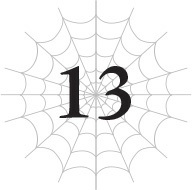
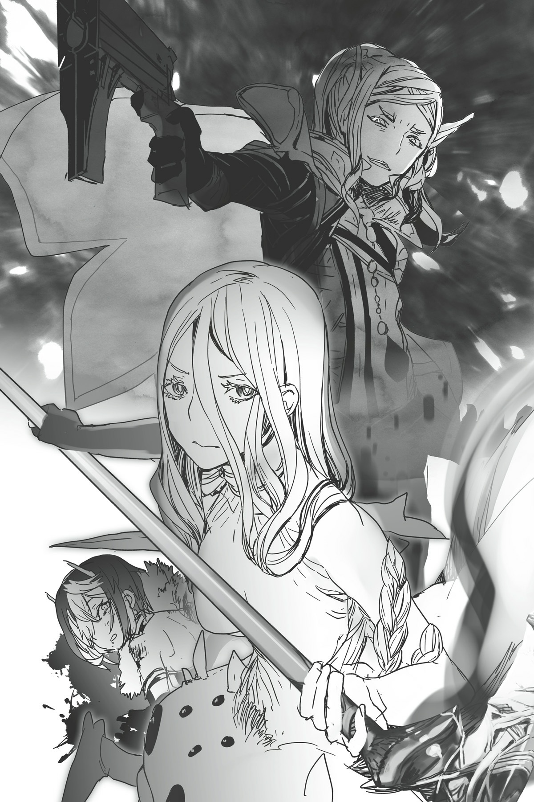
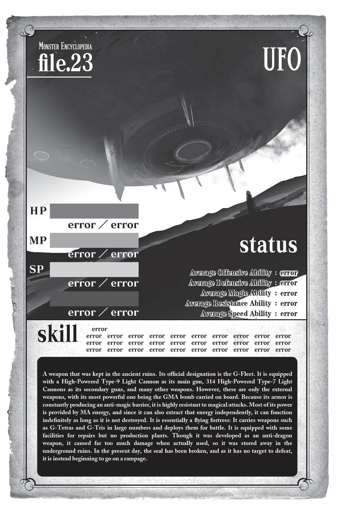

# Chương 13: Hướng dẫn vượt ải Trùm cuối
*(Final Boss Walk-Through)*

---

Con robot trùm cuối di chuyển vô số cánh tay của nó, chĩa những họng súng thẳng vào kẻ đột nhập.

Kẻ đột nhập được nói đến ở đây—sợi cáp hack của Potimas—vẫn tiếp tục tiến về phía trước, âm thầm trườn trên sàn nhà như một con rắn.

Có thể điều đó đã khiến con robot cảm thấy bị đe dọa, hoặc khả năng cao hơn là nó được lập trình để tự động tấn công bất cứ thứ gì xâm nhập phòng mà không được phép, nhưng dù thế nào thì nó cũng bắt đầu nã đạn không chút nương tay.

Tất cả các họng súng cùng lúc giải phóng những quả cầu ánh sáng.

Mỗi quả cầu to cỡ một quả đạn pháo, tương đương đạn của xe tăng, nên khi tất cả nã đạn đồng loạt, căn phòng bùng lên một tia chớp sáng lòa đến mù cả mắt.

Và hiển nhiên, uy lực của nó dư sức gây ra nhiều tổn thương khủng khiếp hơn là chỉ làm lóa mắt tôi.

Chỉ một phát bắn đơn lẻ đã đủ để xuyên thủng hàng phòng ngự năm chữ số của lũ nhện rối, thế mà giờ lại là vô số phát bắn như thế này sao?

Nếu đống đạn đó bắn trúng sợi cáp mỏng manh kia, nó sẽ không chỉ bị đứt đâu, mà sẽ bị bốc hơi thành hư vô luôn đấy.

Cơn mưa đạn, mà lúc này trông giống như một bức tường ánh sáng hơn, lao vút về phía sợi cáp, cho đến khi Ma Vương nuốt chửng toàn bộ chỉ trong một ngoạm.

Cô ta di chuyển từ bên ngoài phòng đến ngay trước mũi chịu đạn chỉ trong chớp mắt, rồi dùng [Bạo Thực] nuốt chửng toàn bộ đợt tấn công để bảo vệ sợi cáp.

...Đúng là đồ gian lận.

Cô thực sự cản sạch đống đó mà không hề sứt mẻ một vết xước nào hả?

Tôi tự hỏi liệu mình có làm được như thế không nhỉ?

Tự bảo vệ bản thân khỏi luồng ánh sáng đó mà không bị trầy xước... Ừm, chắc tôi cũng xoay xở được thôi.

Nhưng vừa làm vậy vừa phải bảo vệ sợi cáp được an toàn á?

Không đời nào, tôi không nghĩ mình làm nổi đâu.

Cô ta chắc chắn đã phân chia vai trò chuẩn xác rồi. Tôi sẽ chẳng thể giữ cho sợi cáp đó nguyên vẹn được lâu đâu.

Ma Vương tiếp tục dễ dàng nuốt chửng những viên đạn bay về phía cô ta và sợi cáp.

Đợt oanh tạc này khá là dữ dội, có lẽ vì con robot được cung cấp năng lượng từ chính quả bom đó.

Ấy thế mà, Ma Vương thậm chí còn chẳng đổ một giọt mồ hôi.

Oa, cô ta siêuuuu phàmmm thật đấy.

Tôi chỉ việc ngồi đây an toàn và ngắm cô ta diễn xiếc thôi.

...Ồ, hình như tôi mừng hơi sớm rồi.

Vài cánh tay xoay họng súng về phía này.

Mà có nhiều cánh tay như thế cơ mà.

Nghĩa là chúng có thể xả đạn vào tôi trong khi vẫn đồng thời tấn công Ma Vương và sợi cáp.

Và vì Potimas đang vận hành sợi cáp, lão không thể di chuyển được.

Những viên đạn ánh sáng bắn thẳng về phía Potimas đang bất động.

Đây là cơ hội của tôi!

Đã đến lúc tôi bước ra ánh hào quang, và cũng là cơ hội để một kỹ năng ít khi được trọng dụng có tên [Khiên Thuật] ra mắt khán giả!

Tôi lao ra chắn trước mặt Potimas, giơ cao chiếc khiên của mình lên.

Đạn bắn trúng khiên, nhưng nhờ chiếc khiên đã được gia cường bằng [Truyền Năng lượng] và [Truyền Ma Lực], đống đạn đó chẳng hề xi nhê gì!

Hử? Bạn hỏi tôi kiếm đâu ra chiếc khiên như thế á?

Thì tôi chỉ tình cờ tìm thấy vài nguyên liệu tiện lợi rồi biến tấu chúng thành khiên thôi, có sao đâu?

Cụ thể là cánh cửa trông cứng cáp đến điên rồ từng chặn lối vào căn phòng này lúc trước.

Hơ, ngay cả cánh cửa dày cộp như thế cũng không phải là đối thủ của cây lưỡi hái đặc chế của tôi.

Nhưng nó đủ độ chắc chắn để làm một chiếc khiên tuyệt vời.

Bằng chứng là đống đạn cứ nảy ra tanh tách khỏi khiên kìa!

Mơ đi cưng! Không có cửa đâu!

Thế nên là, tôi có thể bảo vệ Potimas ở bên này mà không gặp chút khó khăn nào.

Nếu có gì đáng lo, thì tôi lo cho Ma Vương hơn.

Hiện tại cô ta bảo vệ sợi cáp không gặp vấn đề gì, nhưng sợi cáp cần phải tiếp xúc trực tiếp với con robot để tiến hành hack.

Và cô ta phải đảm bảo nó không bị đứt trong lúc đang kết nối.

Tôi chắc chắn con boss sẽ kháng cự lại quá trình hack, điều này có thể gây ra rắc rối lớn cho sợi cáp một khi nó đã cắm vào cơ thể robot.

Ma Vương sẽ làm thế nào để giải quyết chuyện đó đây?

Trong lúc tôi đang vừa xem vừa lo lắng, đầu sợi cáp cuối cùng cũng tiếp cận được con robot trùm cuối.

Nó lóe sáng trong tích tắc, rồi cắm thẳng vào cơ thể robot bằng một lực thô bạo.

Xem ra câu hỏi làm thế nào để kết nối của tôi đã có lời giải đáp rồi.

Sợi cáp tiếp tục luồn sâu hơn vào bên trong con robot trùm cuối.

Con robot đương nhiên là cố gắng vùng vẫy kháng cự, nhưng chuyển động của nó rất chậm chạp.

Bởi vì cơ thể nó đang bị trói chặt bởi hàng tấn tơ.

Đống tơ của Ma Vương đã khiến con robot gần như hoàn toàn bất động.

Quá là khéo tay hay làm luôn.

Giờ thì con robot trùm cuối hầu như không thể di chuyển nổi nữa.

Người ta thường chỉ chú ý đến kỹ năng [Bạo Thực] của Ma Vương, nhưng cô ta còn sở hữu vô số năng lực bá đạo khác nữa cơ.

Các kỹ năng liên quan đến tơ của hai đứa cùng cấp độ đấy, nhưng tôi không nghĩ mình có thể sử dụng chúng điêu luyện được như cô ta.

Bị quấn chặt trong đống tơ, con robot trùm cuối dẫu vậy vẫn cố phản kháng bằng một đợt xả đạn điên cuồng.

Nhưng vì những cánh tay cầm súng cũng bị tơ trói cứng, đống đạn ánh sáng cứ thế bay loạn xạ khắp nơi, chẳng có viên nào đến gần được sợi cáp hay Potimas cả.

Ừm, tôi không nghĩ là nó có thể thoát khỏi cái đống hỗn độn đó đâu.

Đến cả tôi chắc cũng chịu chết không thoát nổi trừ phi dùng [Dịch chuyển].

Giờ việc duy nhất còn lại là đợi Potimas hoàn tất quá trình hack.

Ồ, vụ này dễ hơn tôi tưởng nhiều đấy.

Cứ ngỡ sẽ có một trận chiến cam go ác liệt hơn, hóa ra tôi lại lo bò trắng răng rồi!

Kiểu như, nghe mấy lời điềm báo đáng sợ của Potimas làm tôi cũng có chút rén con robot trùm cuối này thật.

Nhưng cứ đà này, mọi chuyện sẽ kết thúc nhanh thôi. Nghĩ lại tự dưng thấy buồn cười khi chúng tôi tốn bao nhiêu công sức để vạch ra chiến thuật tác chiến.

Nói thật lòng, hơi bị hụt hẫng chút đỉnh.

Nhưng đó chỉ là vì người đảm nhận việc đối phó với con robot trùm cuối lại là Ma Vương mà thôi.

Nếu đi một mình thì chắc chắn tôi không thể làm được điều tương tự rồi!

Bản thân Ma Vương đã là một sự gian lận siêu lỗi rồi, nên có khi con robot trùm cuối kia thực ra rất mạnh, chỉ là cô ta làm cho nó trông có vẻ dễ ăn thôi.

Ma Vương chỉ là một trường hợp ngoại lệ điên rồ. Tôi tin chắc con robot trùm cuối kia thực sự sở hữu sức mạnh xứng tầm một con trùm cuối, chắc vậy, có lẽ thế.

Phải rồi. Chắc chắn phải như vậy rồi!

Không hiểu sao bây giờ tôi lại đang đi bào chữa cho con robot trùm cuối nữa.

Chắc do tôi đã hơi thả lỏng vì vụ việc lần này kết thúc êm đẹp hơn mong đợi.

Thế nhưng tôi đã quên mất một điều tối quan trọng.

Đó là ở ngay đây còn có một kẻ nguy hiểm hơn bất kỳ con robot trùm cuối nào.

“White!”

Tôi nghe thấy tiếng hét thất thanh vang lên đột ngột.

Nhưng khi âm thanh đó truyền đến tai tôi thì mọi chuyện đã bắt đầu rồi.

Đầu tiên, tôi cảm nhận thấy một cảm giác khó chịu tột độ.

Giống như thế giới xung quanh tôi đã thay đổi, hay chính các giác quan của tôi vừa bị viết lại vậy.

Tôi từng trải qua cảm giác đáng sợ này một lần trước đây rồi.

Đó chính là cảm giác khi tôi bị kẹt bên trong kết giới của Potimas.

Và kẻ ở đằng sau tôi chính là lão ta, Potimas bằng xương bằng thịt.

Cánh cửa khổng lồ tôi đang cầm thay khiên bỗng trở nên nặng trịch một cách dã man.

Điều đó đồng nghĩa với việc các kỹ năng và chỉ số của tôi đã ngừng hoạt động.

Nhưng một trong số ít những thứ vẫn hoạt động là [Xử Lý Tốc Độ Cao], giúp thế giới xung quanh tôi di chuyển chậm lại như thể đang quay chậm.

Vì chỉ số bị giảm sút, cơ thể tôi không chịu nhúc nhích theo ý muốn.

Tôi cảm thấy nặng nề một cách trì trệ, như thể đang cố di chuyển dưới nước hay trong một giấc mơ vậy.

Ngay cả trong thế giới quay chậm này, Ma Vương vẫn di chuyển cực nhanh khi lao về phía tôi.

Đằng sau lưng, tôi cảm nhận được Potimas đang hành động.

Nhưng cơ thể tôi lại cứng đờ tại chỗ, không kịp phản ứng gì.

Để rồi Ma Vương lao sầm vào tôi, và một chùm ánh sáng đâm xuyên qua cơ thể cô ta.

Trong lúc mắt tôi chứng kiến cảnh tượng khó tin này, đủ loại suy nghĩ xoay vần trong tâm trí tôi.

Kiểu như: Ồ phải rồi, [Bạo Thực] là kỹ năng, nên cô ta không thể dùng nó trong kết giới.

Rồi thì: Khốn kiếp, tôi biết thừa lão Potimas thế nào cũng phản bội mà; đáng lẽ tôi không được mất cảnh giác mới phải.

Và: Ngươi tới số rồi, tên khốn! Ta sẽ giết chết ngươi!

Nhưng trong tất cả những suy nghĩ lướt qua não bộ tôi lúc đó, có một luồng tư duy gào thét vang dội hơn hẳn phần còn lại.

Cô ta đã bảo vệ tôi.

Cô ta đã bảo vệ tôi.

Cô ta biết rõ tôi cơ bản là không thể chết, nhưng cô ta vẫn bảo vệ tôi.

CÔ TA ĐÃ BẢO VỆ TÔI!

“Ồ hô. Quả là một bất ngờ thú vị.”

Một tay cầm khẩu súng vừa bắn hạ Ma Vương, Potimas lạnh lùng nhìn chằm chằm.

Giọng nói của lão vẫn lạnh lẽo và vô cảm như mọi khi, nhưng tôi vẫn có thể nhận ra một chút đắc thắng trong đó.

Potimas chĩa thẳng họng súng vào Ma Vương đang gục xuống.

Cùng lúc đó, con robot trùm giải thoát khỏi đống tơ và cũng chĩa những họng súng của nó vào Ma Vương.

Ý đồ của Potimas rõ ràng đến mức chết chóc: Lão muốn tận dụng cơ hội này để chôn cất Ma Vương một lần và mãi mãi.

Ngay từ đầu, lão hẳn đã chờ đợi thời khắc hack thành công để kích hoạt kết giới và bắn trộm tôi từ phía sau.

Nhưng vì Ma Vương đột ngột bảo vệ tôi và bị trúng đạn thay, cô ta lại trở thành mục tiêu ưu tiên hàng đầu của lão.

Nếu phải chịu thêm bất kỳ vết thương nào bên trong kết giới này, ngay cả Ma Vương cũng sẽ mất mạng.

Cô ta không có những chiêu trò như tôi để thoát chết trong gang tấc.

Potimas đã đúng khi ưu tiên kết liễu Ma Vương trước tôi.

Bất kỳ ai cũng biết cô ta nguy hiểm hơn tôi rất nhiều.

Đây là cơ hội ngàn năm có một để tiêu diệt Ma Vương nguy hiểm.

Để đảm bảo cơ hội đó không tuột mất, Potimas chĩa cả khẩu súng của mình lẫn đống súng của con robot lão đã chiếm quyền kiểm soát thẳng vào Ma Vương.

Hoàn toàn ngó lơ sự tồn tại của tôi ở đây.

Tôi không thể nói là mình không có cảm giác gì về chuyện đó.

Nhưng cảm xúc mạnh mẽ nhất đang trỗi dậy trong tôi lúc này chính là sự phẫn nộ hướng về phía Ma Vương.

Tại sao cô ta lại bảo vệ tôi chứ?!

Chẳng phải chúng tôi vẫn ngấm ngầm là kẻ thù của nhau sao?!

Theo những gì tôi biết, Ma Vương không hề hay biết bí mật bất tử của tôi.

Nên cô ta sẽ không có cách nào biết được rằng tôi thực sự có thể mất mạng bên trong kết giới này.

Việc gì phải bảo vệ một kẻ mà mình cho là bất tử chứ?

Quan trọng hơn là, tại sao cô ta lại bảo vệ tôi khi chúng tôi chỉ liên minh với nhau vì không còn lựa chọn nào khác?

Ấy thế mà, cô ta lại đỡ đạn thay tôi.

Y hệt như lúc cô ta cứu Sael khỏi con xe tăng đó mà không hề do dự.

Cô ta bảo vệ tôi mà không cần suy nghĩ lấy một giây.

Và vì lựa chọn đó, cô ta đang lâm vào tình cảnh vô cùng nguy kịch.

Cứ đà này, Ma Vương sẽ chết mất.

Không đời nào. Tôi tuyệt đối không cho phép chuyện đó xảy ra!

Khẩu súng của Potimas và đống súng của con robot trùm cuối khai hỏa cùng một lúc.

Không chần chừ lấy một khoảnh khắc, tôi lao tới chắn ngay phía trên Ma Vương đang ngã quỵ, đỡ lấy cả hai đợt tấn công.

Tôi dùng lưỡi hái chém đứt viên đạn của Potimas, và dùng cánh cửa khổng lồ làm khiên chặn đứng đợt oanh tạc từ con robot trùm cuối.

Không có kỹ năng cường hóa, chiếc khiên bắt đầu móp méo oằn đi sau mỗi cú va chạm.

Cố lênnnnn!

Ra tay đi chứ hả, [Khiên Thuật]!

Nếu lúc này mà mày còn không có ích, thì định đợi đến bao giờ mới chịu dùng được đây?!

Tôi vừa dùng khiên bên tay trái chống đỡ đợt nã đạn tàn bạo của con robot trùm, vừa dùng lưỡi hái bên tay phải tấn công Potimas ở hướng ngược lại.

Do hầu hết các kỹ năng đều không hoạt động, việc này quả thực vô cùng vất vả.

Nhưng tôi không phải là một con người bình thường đâu nhé!

Tôi là một cá thể Arachne nửa người nửa nhện đấy!

Tôi dùng những chiếc chân nhện của mình để tóm lấy một thứ.

Chân nhện của tôi kết thúc bằng móng vuốt nên không được khéo léo cho lắm, nhưng nếu dùng nhiều hơn hai chân thì khi cần thiết tôi vẫn có thể tóm đồ được như thường.

Và rồi tôi giật mạnh thứ mình vừa tóm được—sợi cáp đang kết nối Potimas với con robot trùm cuối.

“Cái—?!”

Potimas thốt lên một tiếng kinh ngạc trước nước đi không ngờ tới của tôi.

Bị sợi cáp lôi đi, cơ thể Potimas bay vút qua khoảng không phía trên tôi.

Lao thẳng vào cơn mưa đạn đang trút xuống từ con robot trùm cuối.

Từ phía bên kia chiếc khiên, tôi nghe thấy tiếng động của thứ gì đó bị nghiền nát vụn.

Trong cùng một khoảnh khắc, cảm giác khó chịu bao trùm cơ thể tôi biến mất hoàn toàn.

Kết giới của Potimas đã bị vô hiệu hóa!

Đã đến lúc tiếp thêm năng lượng và ma lực cho chiếc khiên đã nát một nửa này rồi!

Vẫn giữ chiếc khiên trước mặt, tôi lao thẳng về phía trước.

Ngay sau đó, tôi thực hiện một cú tông khiên hoàn hảo!

Tôi tông thẳng vào con robot trùm cùng với chiếc khiên của mình, húc đổ nó!

Cú húc hất văng con robot khổng lồ đập thẳng vào tường.

Đáng tiếc là, đòn tấn công đó cũng đập nát chiếc khiên vốn đã hỏng một nửa của tôi.

Cảm ơn nhé, chiếc khiên cửa. Mày đã phục vụ rất tốt rồi.

Vứt chiếc khiên đã vỡ sang một bên, tôi đuổi theo con robot trùm cuối.

Đúng lúc nó đập vào tường phát ra một tiếng rầm đục ngầu, tôi vung lưỡi hái xuống bồi thêm một nhát chém nữa.

Lưỡi hái của tôi chém ngọt con robot làm đôi theo đường chéo, và cơ thể khổng lồ của nó tan biến thành tro bụi mà không phát ra lấy một tiếng động.

Nhưng không hiểu vì sao, có một vật thể hình tròn vẫn còn nguyên vẹn giữa đống tro bụi.

Đó là một khối cầu nhỏ nằm gọn trong lòng bàn tay tôi... Không lẽ đây là quả bom?

Thôi tiêu rồi.

Tôi hăng máu quá nên quên béng mất quả bom chết tiệt kia.

Nó sẽ không phát nổ đấy chứ?

Tôi thận trọng nhấc khối cầu lên, nhưng có vẻ nó không có biểu hiện gì kỳ lạ cả.

Phù. Chắc là ổn rồi.

Đặt tay lên ngực thở phào nhẹ nhõm, tôi nhanh chóng quay người lại.

Tại đó, tôi thấy Ma Vương đang ôm hông gượng đứng dậy, bên cạnh là cái đầu—phần duy nhất còn sót lại từ cơ thể cyborg của Potimas.

“Hừm. Lần này các người thắng rồi.”

“Đó là câu của bọn ta mới đúng, đồ khốn.”

Ma Vương giẫm chân lên cái đầu với vẻ mặt nhăn nhó của Potimas.

Xét việc lão đã bị giảm xuống chỉ còn là một cái đầu biết nói, thì lời nhận xét đó quả thực có phần khá tẻ nhạt.

Không có phổi thì lẽ ra lão không thể nói chuyện được mới phải, nhưng chắc cyborg có các cơ quan phát âm hoạt động khác với con người.

Tự hỏi liệu mình có thể áp dụng cơ chế kiểu đó cho lũ nhện rối không nhỉ...

Ối, đầu óc tôi lại bay bổng đi đâu rồi.

“Ta cứ ngỡ kế hoạch đó chắc chắn sẽ thành công chứ. Ngươi lúc nào cũng phá hỏng mọi chuyện.”

“Quá đen cho ngươiii! Không có gì ngươi làm có thể vượt qua sức mạnh tình bạn của tụi ta hết á!”

Ma Vương cười ha hả, di di bàn chân lên đầu Potimas.

Sức mạnh tình bạn, hả...?

Cụm từ đó giúp tôi hiểu rõ lý do tại sao Ma Vương lại bảo vệ tôi.

Cô ta làm vậy hoàn toàn theo phản xạ tự nhiên, không hề có sự tính toán hay động cơ kín kẽ nào.

Giống như đang bảo vệ một thành viên trong gia đình vậy.

Ngược lại, tôi bảo vệ Ma Vương đang bị thương chỉ vì tôi cảm thấy mình nên trả ơn cô ta.

Xét về lý thuyết, tôi hoàn toàn có thể mặc kệ cho cô ta chết.

Vì tôi luôn xem cô ta là một mối đe dọa tiềm tàng, nên đó có lẽ còn là lựa chọn hợp lý hơn.

Nhưng lúc đó, suy nghĩ ấy thậm chí còn chẳng lướt qua đầu tôi lấy một giây.

Cô ta đã bảo vệ tôi, nên tôi phải bảo vệ lại cô ta.

Đó là tất cả những gì tôi nghĩ khi ấy.

Nhưng tôi nghĩ như thế là tốt nhất.

Làm sao tôi có thể trơ mắt nhìn Ma Vương bị giết ngay trước mặt mình được chứ.

Nếu tôi để cô ta chết mà không trả lại ơn cứu mạng, thì quả thực là quá vô liêm sỉ.

Nên thế này là tốt nhất rồi.

“Cảm ơn vì đã cứu ta nhé, White. Không có ngươi là ta tiêu đời rồi!”

Ồ, thôi đi giùm cái!

Đừng có nở nụ cười chân thành, rạng rỡ như thế khi tôi đang cố vắt óc bịa ra mấy cái lý do giả tạo để cứu mạng cô chứ!

Cô làm tôi trông giống như một con ngốc khi cứ phải tự biện hộ ở bên này đấy!

Ư, được rồi! Cô thắng!

“Tôi cũng cảm ơn cô.”

Khi thấy tôi hiếm hoi phản hồi nhanh chóng như vậy, Ma Vương trố mắt nhìn tôi kinh ngạc.

Đ-đừng có nhìn tôi kiểu đó!

Ngại chết đi được!

Đừng có hiểu sai ý đấy nhé, rõ chưa?!

Tôi bảo vệ cô chỉ để trả ơn thôi—chỉ thế thôi đấy!

Tuyệt đối không có bất kỳ thứ tình cảm sến súa nào khác xen vào đâu.

Không một chút nào luôn! Thề đấy!

Ư ư ư!

“Chúng ta đi tiếp được chưa?” Potimas lạnh lùng hỏi.

“Đi tiếp? Đi đâu?”

“Hành động tiếp theo của chúng ta. Hai người phải mang ta đến phòng điều khiển của G-Fleet. Ở đó, chúng ta sẽ chiếm quyền kiểm soát con tàu và hạ cánh khẩn cấp.”

...Cái tên này bắt nhịp nhanh thế không biết?

Vừa mới tìm cách giết chúng tôi xong mà giờ đã ngang nhiên ra lệnh rồi à?

Đúng là mặt dày vô liêm sỉ.

“Lượt này các người thắng rồi. Rõ ràng là ta chẳng thể làm gì được trong hình dạng thế này. Nên giờ việc duy nhất còn lại là giải quyết dứt điểm tình huống này theo kế hoạch ban đầu.”

Cảm nhận được sự ngờ vực của chúng tôi, Potimas tự giải thích mà không cần ai hỏi.

Lão thực ra khá giỏi đi guốc trong bụng người khác, nhưng tôi ước gì lão dùng năng lực đó vào việc gì có ích hơn.

Ư. Mà thôi, tôi đoán đúng là ngay từ đầu ưu tiên hàng đầu của Potimas vẫn là xử lý chiếc UFO và quả bom, còn việc giết chúng tôi chỉ là phần thưởng đi kèm.

Giống như một nhiệm vụ phụ mà lão hy vọng có thể hoàn thành, nhưng nếu không được thì cũng chẳng mấy bận tâm.

Mặc dù việc biết cái chết của mình chỉ là mục tiêu phụ làm tôi khá là sôi máu.

Dù sao thì, tôi đoán ý lão là vì giờ chuyện đó không khả thi nữa, nên lão sẽ tập trung toàn lực để giải quyết tình hình chiếc UFO.

Mà thôi, chắc lão cũng chẳng làm được gì khác, khi hiện tại chỉ còn lại cái đầu.

Và nếu chúng tôi muốn chiếm quyền kiểm soát UFO, tôi đoán lời khuyên của lão sẽ có ích, dù thừa nhận chuyện này làm tôi khá là khó chịu.

“Thôi được rồi. Nhưng thứ White đang cầm kia là quả bom đấy à?”

Ma Vương chỉ vào khối cầu trong tay tôi.

“Chính xác.”

Tôi biết ngay mà. Vậy ra nó thực sự là quả bom.

“Liệu có chắc là nó sẽ không nổ ngay bây giờ không?”

“Đừng lo. Ta đã khóa nó lại rồi.”

Hóa ra lão vẫn làm việc của mình ngay cả khi đang chĩa súng vào Ma Vương và tôi.

Chắc lão đã hack con robot trùm và xâm nhập vào quả bom để ngăn nó phát nổ.

“Tốt nhất là hãy giao thứ đó cho Güliedistodiez. Hắn ta sẽ có thể xử lý nó một cách an toàn.”

Ừm, tôi đoán giao nó cho Güli-güli là lựa chọn an toàn nhất.

“Ngươi hợp tác một cách đáng ngạc nhiên đấy nhỉ.”

“Ta đã nói rồi mà, không phải sao? Các người đã thắng lượt này. Ta chỉ đơn giản là thừa nhận thất bại và nhượng bộ kẻ chiến thắng, đó là lẽ thường tình trong tình huống thế này. Nếu có thể chiếm được quả bom GMA và lấy đi năng lượng bên trong thì đó là kịch bản lý tưởng nhất, nhưng rõ ràng chuyện đó đã vượt quá khả năng của ta trong trạng thái này rồi. Ta cũng từng muốn chiếm cả G-Fleet nữa cơ, nhưng giờ thì ta từ bỏ ý định đó rồi.”

Ồ phải rồi.

Cái lão này tệ thật sự.

Tôi mừng vì lão biết điều thừa nhận thất bại các kiểu, nhưng lão nghiêm túc tính cuỗm luôn cả chiếc UFO lẫn quả bom đấy à?

Đúng là tham lam vô độ.

À, hèn chi lão lại trang bị sẵn tính năng hack tiện lợi như thế!

Và lão hoàn toàn có khả năng thực hiện được chuyện đó nữa chứ.

Nếu chúng tôi đi sai một bước, cả Ma Vương lẫn tôi đều sẽ đi tong, còn quả bom và UFO sẽ rơi thẳng vào tay tên này.

Chỉ nghĩ đến thôi đã thấy rợn tóc gáy rồi.

“Dù thế nào thì, trước tiên chúng ta—?!” Potimas bỗng dưng dừng lại giữa chừng.

“Can thiệp từ bên ngoài? Không thể nào!”

Lần đầu tiên trong đời, tôi có thể nghe thấy sự hoảng loạn thực sự trong giọng nói của lão.

Nhưng tôi không có thời gian để kinh ngạc về chuyện đó.

Quả bom trong tay tôi bắt đầu phát sáng.

“Nó sắp nổ à?!” Ma Vương hét toáng lên.

“G-Fleet đang cố gắng mở khóa nó từ xa. Khoan đã—nó thực sự đang truyền thêm năng lượng cho quả bom. Khốn kiếp! Nó định tự hủy!”

“Thế giờ phải làm sao?!”

“Vô ích thôi. Chúng ta không cản kịp đâu.”

Mắt tôi đảo liên tục giữa Potimas và Ma Vương khi cố gắng tiếp thu tình hình.

Được rồi, ừm, chiếc UFO đang muốn kích nổ quả bom từ xa, và nó thậm chí còn rót thêm năng lượng của chính nó vào cái thứ chết tiệt này sao?

Chiếc UFO và quả bom không hề kết nối vật lý với nhau, nhưng có khi chúng dùng cổ tự hay gì đó chăng?

Khoan đã, chuyện đó bây giờ không quan trọng!

Nó sắp nổ thật à?!

Nghiêm túc đấy hả?!

Tông giọng vô vọng của Potimas nghe quá đỗi chân thực.

Khốn thật chứ.

Không, không, không, không, không, không, không, không, không!

Đôi khi, khi hoảng loạn, con người ta sẽ làm những việc kỳ lạ đến mức ngay cả bản thân họ cũng không hiểu nổi tại sao mình lại làm thế.

Hôm nay tôi đã tự mình chứng kiến điều đó.

Không, chính tôi là người đã làm chuyện đó.

Tôi cũng không biết đầu óc mình lúc đó nghĩ cái gì nữa, nhưng khi quả bom phát ra thứ ánh sáng khả nghi kia, tôi đã thẳng thừng nuốt chửng nó.

“Cái—?! White, ngươi vừa mới NUỐT thứ đó đấy à?!”

Ma Vương đang hoảng loạn.

Và tôi cũng thế.

Tôi vừa mới làm cái quái gì thế này?!

Mà nuốt nó vào bụng thì giải quyết được cái tích sự gì chứ?!

Tôi ra tay trong lúc hoàn toàn hoảng loạn, và giờ tôi lại càng hoảng loạn hơn trước hành động của chính mình!

Ááá! Được rồi, tôi sẽ tiêu hóa luôn quả bom chết tiệt này trước khi nó kịp nổ!

Vẫn trong cơn hoảng loạn, tôi đưa ra một kết luận vô cùng cuống cuồng.

Kỹ năng [Bạo Thực] của Ma Vương chợt hiện ra trong trí óc tôi.

Kỹ năng có thể nuốt chửng và hấp thụ mọi thứ.

Với ý nghĩ đó, tôi cố gắng tưởng tượng bản thân đang hấp thụ quả bom mình vừa ngu ngốc nuốt vào bụng.

<Đã đạt đủ điểm kinh nghiệm yêu cầu. Kỹ năng [Mở rộng Thần giới LV 9] đã trở thành [Mở rộng Thần giới LV 10].>
<Đạt đủ điều kiện. Bắt đầu quá trình thần hóa.>

Ngay sau khi nghe thấy thông báo này, một cơn đau dữ dội ập đến hành hạ cơ thể tôi.

Trong tích tắc, tôi đã ngỡ quả bom đang phát nổ ngay trong dạ dày mình.

Nhưng không phải thế.

Nó không hề nổ.

Vậy tại sao toàn thân tôi lại đau đớn như thế này?

Cơn đau buốt nhói đến mức tôi thậm chí không còn nhận biết nổi chỗ nào đang đau nữa.

Một nỗi đau không giống bất cứ thứ gì trên đời này càn quét khắp cơ thể tôi, như thể tôi hoàn toàn không sở hữu kỹ năng [Vô hiệu Đau] vậy.

Cơn đau này tôi thấy quen thuộc lắm.

Nó giống hệt như cảm giác trong đầu tôi hồi trước, khi tôi không thể kiểm soát nổi kỹ năng [Phát hiện] nhưng vẫn cố ép nó kích hoạt bằng được.

Nhưng dù bản chất cơn đau có tương tự, thì mức độ của nó lại tàn khốc hơn gấp bội lần.

Cảm giác như thể toàn bộ cơ thể tôi sẽ vỡ ra thành từng mảnh nếu tôi không gồng mình giữ nó lại.

Và bản năng của tôi đang gào thét rằng đó chính xác là những gì đang diễn ra.

Nếu không thể chịu đựng được cơn đau này, tôi sẽ chết.

Điều đó rõ ràng một cách đáng sợ.

Cố gắng chống chọi, tôi siết chặt tay cầm cây lưỡi hái của mình.

Cơn đau bắt đầu truyền vào cây lưỡi hái, giúp tôi cảm thấy dễ chịu hơn đôi chút.

Sử dụng nguyên lý đó, tôi cố gắng liên tục phân tán nguồn gốc của đau đớn.

Tôi có thể cảm nhận được cơn đau mình đang đẩy đi đang truyền vào một thứ gì đó xa xôi khác, nhưng ý thức của tôi lúc này không đủ tỉnh táo để nhận ra đó là thứ gì.

Cơn đau vẫn không ngừng càn quét cơ thể tôi.

“Tốt nhất nên thực hiện các biện pháp khẩn cấp.”

Tôi cảm thấy như mình vừa nghe thấy một giọng nói, nhưng tôi không còn chút năng lượng nào để tập trung vào nó nữa.

Tôi vẫn chưa muốn chết.

Tôi muốn tiếp tục được sống.

Vì thế tôi sẽ không bao giờ chịu thua cái cơn đau ngu ngốc này đâu!

Tôi cố gắng củng cố quyết tâm của mình, nhưng cơn bão đau đớn dữ dội dường như đang làm nó tan chảy mất.

Và ý thức của tôi cũng bắt đầu mơ màng trôi đi...

<Thiết lập lại các kỹ năng.>
<Thiết lập lại các chỉ số.>
<Thiết lập lại các danh hiệu.>
<Thiết lập lại điểm kỹ năng.>
<Thiết lập lại điểm kinh nghiệm.>
<Cài đặt [Cơ bản về Thần tính] đặc biệt của D.>
<Quá trình thần hóa hoàn tất. Bạn sẽ không còn nhận được bất kỳ sự hỗ trợ nào từ hệ thống nữa. Xin chân thành cảm ơn sự ủng hộ của bạn.>

---

[◀ Chương trước: Chương 12: Tiến triển bão táp của đội gỡ bom](12_the_bomb_squads_explosive_progress.md) | [Chương tiếp theo: Chương 14: UFO là phương tiện của thần linh ▶](14_unidentified_flying_objects_are_the_vehicles_of_gods.md)
