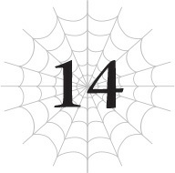
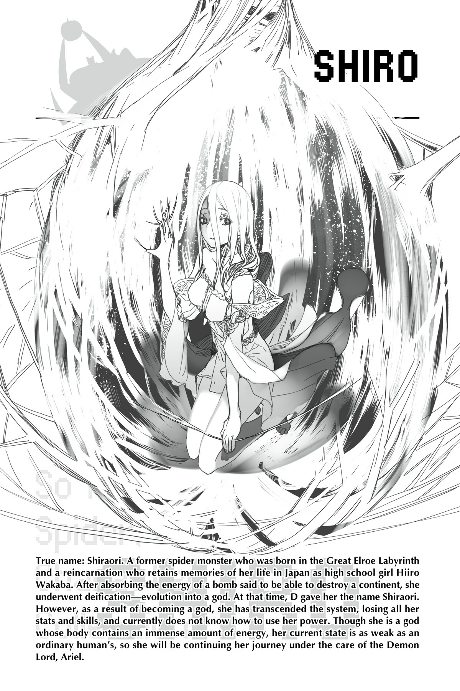

# Chương 14: UFO là phương tiện của thần linh
*(Unidentified Flying Objects Are the Vehicles of Gods)*

---

“Ngươi quả thực rất thú vị.”

Tôi nghe thấy một giọng nói tuyệt mỹ nhưng lại cực kỳ đáng sợ từ một nơi nào đó rất gần mình.

“Ai mà ngờ được ngươi lại đi nuốt chửng thứ đó chứ? Việc đó thậm chí còn vượt ngoài dự kiến của ta.”

Đó là một giọng nói vô cùng đều đều, không có chút cảm xúc nào.

Giọng của Potimas nghe cũng khá vô hồn, nhưng chí ít bạn vẫn có thể lờ mờ nhận ra cảm xúc của lão.

Còn giọng nói này lại hoàn toàn rỗng tuếch cảm xúc, giống như bạn đang nói chuyện với một cỗ máy, hoặc một thực thể tối cao vượt ngoài trí tưởng tượng của con người. Trong trường hợp này, khả năng cao là vế sau rồi.

Nhưng thực thể đó đang làm gì ở đây?

Và “ở đây” rốt cuộc là chỗ nào?

“Vì có khả năng quả bom sẽ phát nổ, nên ta đã tạm thời di tản ngươi đến chỗ của ta. Tuy nhiên, có vẻ ngươi đã hấp thụ năng lượng của nó một cách an toàn, vậy nên sự phòng ngừa này của ta có lẽ hơi thừa thãi.”

Phát nổ...?

Ồ phải rồi! Tôi đã nuốt chửng quả bom, rồi sau đó toàn thân đau đớn dữ dội.

Chuyện gì đã xảy ra sau đó thế?

“Đừng lo—thế giới bé nhỏ của ngươi vẫn an toàn. Hãy tạm thời nghỉ ngơi ở đây một lát để thích nghi hơn với sức mạnh của mình. Vì sức mạnh của ngươi đã tạm thời rời khỏi cơ thể, ta phải chuyển nó từ quả trứng trở lại vào thân xác ngươi.”

Trứng?

“Một trong những vật chứa dự phòng mà ngươi dùng cho cái gọi là hồi sinh bằng trứng. Ngươi đã vô thức để sức mạnh của mình chảy vào đó, giống như một nguồn điện ngoài. Hiện tại ta đang chuyển lượng sức mạnh đó trở lại cơ thể thật của ngươi.”

Tôi cũng không rõ chính xác chuyện gì đang xảy ra nữa, nhưng nghe có vẻ mấy quả trứng tôi rải rác xung quanh đã tỏ ra hữu ích rồi.

“Mặt khác, lưỡi hái của ngươi có lẽ cứ để thế này lại tốt hơn. Ta tin chắc nó sẽ tiếp tục có ích cho ngươi trong tương lai.”

Lưỡi hái?

Nhắc mới nhớ, lưỡi hái không còn ở trên tay tôi nữa.

Mà thực ra, tôi cũng không rõ cơ thể mình hiện tại đang ở trạng thái nào nữa.

Cảm giác như tôi đang ở trong một giấc mơ vậy.

Nhưng có một điều vô cùng rõ ràng: Có một kẻ nào đó đang ở ngay phía sau tôi.

Thực thể mà tôi chỉ mới giao tiếp qua điện thoại thông minh hiện đang ở ngay sát sạt tôi.

Nhưng tôi không thể quay người lại.

Nếu tôi quay đầu lại và nhìn thấy khuôn mặt đó, tôi... tôi...!

“Chào mừng đến với thần giới. Ta đã chờ đợi ngươi, hỡi nàng nhện vô danh.”

Không hiểu sao, tim tôi đập thình thịch khi nghe cụm từ “nàng nhện vô danh”.

Ngay cả tôi cũng không biết tại sao nó lại khiến mình xao động đến thế.

Hoặc có lẽ tôi không muốn biết.

“Cứ vô danh mãi thì cũng không tiện lắm, thế nên để ta đặt cho ngươi một cái tên vậy. Hãy coi đó là món quà nhỏ từ chính ta để chúc mừng ngươi trở thành thần.”

Tiếng chuông cảnh báo vang lên inh ỏi trong đầu tôi.

Nếu vượt qua ranh giới này, tôi sẽ không bao giờ có thể quay lại được nữa.

Nhưng tôi chẳng thể làm gì được.

Tôi không có lựa chọn nào khác.

“Shiraori. Bạch Dệt Giả. Đó sẽ là tên của ngươi. Một cái tên rất phù hợp, theo cá nhân ta thấy.”

Dứt lời, D cười khúc khích.

Vẫn không có chút cảm xúc nào trong giọng nói đó, nhưng đối với tôi, đó chắc chắn là một tiếng cười khúc khích.

Vì muốn xác nhận biểu cảm của D, tôi quay người lại.

Vài giây sau, tôi nhìn thấy nó.

Khuôn mặt đó.

Khuôn mặt mà tôi tuyệt đối không được phép nhìn thấy.

---

Ư... hộc.

Vừa mở mắt ra, tầm nhìn của tôi đã bị lấp đầy bởi những bức tường màu trắng.

Không, không phải tường. Cái gì đó... mịn màng hơn?

Trông như tôi đang bị quấn chặt trong một cái kén, và là một cái kén cực kỳ bó sát.

Tôi cố dùng tay xé nó ra, nhưng nó quá đỗi kiên cố.

Trong lúc tôi đang vật lộn và giãy giụa bên trong kén, nó đột nhiên bị rách toạc từ bên ngoài.

Mắt tôi chạm nhau với người vừa xé rách cái kén.

“White?”

Tại sao cô ta lại hỏi với giọng đầy nghi vấn như thế nhỉ?

Ma Vương đứng trước mặt tôi, trông có vẻ vô cùng ngơ ngác hoang mang.

Tôi không biết cô ta đang hoang mang vì cái gì, nhưng trước hết, tôi cần phải ra khỏi cái kén này đã.

Mà tại sao tôi lại bị nhốt trong cái thứ này cơ chứ?

Lạ lùng thật đấy.

Nhưng khi tôi cố đứng dậy để chui ra khỏi kén, tôi lại rơi vào một tình huống còn kỳ lạ hơn.

Theo đúng nghĩa đen luôn. Tôi ngã cắm mặt thẳng xuống đất.

Nửa thân trên của tôi đã ra ngoài kén, nhưng nửa thân dưới lại bị kẹt cứng bên trong, thế là tôi cứ thế đổ nhào về phía trước.

Mặt úp thẳng xuống sàn!

Ui da! Đau quá! Mũi tôi đau quá!

...Đau á?

Thế còn kỹ năng [Vô hiệu Đau] của tôi thì sao?

Ngay khoảnh khắc đó, ký ức về mọi chuyện xảy ra trước khi tôi bất tỉnh ùa về như thác lũ.

Tôi đã nuốt chửng quả bom bên trong UFO.

Toàn thân tôi phải chịu đựng một cơn đau đớn tột cùng hành hạ.

Và rồi tôi đã gặp D...

Khi mọi chuyện ùa về, ý thức của tôi đột nhiên trở nên vô cùng nhạy bén và tỉnh táo.

Giống như khi bạn vừa bừng tỉnh sau một giấc ngủ chập chờn vậy.

Và đó cũng là lúc tôi nhận ra.

Nửa thân dưới của tôi có cảm giác rất lạ.

Quay đầu nhìn xuống nửa thân dưới vẫn đang kẹt trong kén, tôi nhận một cú sốc cực lớn.

Thay vị phần thân nhện quen thuộc vẫn thấy hằng ngày, thứ đập vào mắt tôi lại là hai chiếc chân người.

Phần thân nhện của tôi đâu mất tiêu rồi?!

Chả trách tại sao tầm nhìn của tôi lại kỳ lạ thế!

Bình thường tôi nhìn bằng cả mắt nhện lẫn mắt người, nhưng hiện giờ tôi chỉ còn lại tầm nhìn của con người mà thôi!

Khoan đã, tại sao lúc mới tỉnh dậy tôi không nhận ra chuyện này ngay nhỉ?!

Đáng lẽ tôi phải phát hiện ra sự thay đổi động trời này ngay lập tức mới phải chứ!

Và như một phần thưởng khuyến mãi đi kèm, hiện tại tôi đang hoàn toàn khỏa thân!

“Ra là cô đã tỉnh rồi sao?”

Và rồi cái gã này cứ thế thản nhiên bước tới?!

“Gülie! Không phải lúc này! Quay mặt đi chỗ khác đi!”

Ma Vương vội vàng xoay người Güli-güli lại.

“Nhưng ta chẳng có cảm giác gì khi nhìn thấy cơ thể của phụ nữ cả...”

“Anh thì thấy bình thường, chứ bọn tôi thì không! Thật tình, anh vô duyên quá đi! Chẳng trách tại sao ngài Sariel chẳng bao giờ thèm ngó ngàng đến anh!”

Lời lẽ cay nghiệt của cô ta đã gây ra sát thương cực lớn cho Güli-güli; dù chỉ nhìn từ phía sau, tôi vẫn có thể nhận ra anh ta đang vô cùng suy sụp.

“Mặc quần áo vào trước nhé?”

Tôi ngoan ngoãn tự kéo mình ra khỏi cái kén.

Ồ, cây lưỡi hái của tôi cũng ở trong đó luôn.

Sau khi giải phóng đôi chân, tôi đứng dậy.

Nhưng rồi tôi lập tức mất thăng bằng và ngã nhào.

Lại nữa hả? Nghiêm túc đấy chứ?!

Cái cơ thể này định bắt tôi ngã bao nhiêu lần nữa mới chịu đây?

Tôi cố gắng đứng dậy lần nữa, nhưng lại mất thăng bằng lần thứ ba và ngã bệt mông xuống đất.

“...White?”

Trời đất ơi.

Đi bằng hai chân kiểu gì ấy nhỉ?

Sau vô số lần nỗ lực đứng lên rồi lại ngã chỏng gọng, cuối cùng tôi cũng xoay xở đứng vững bằng hai chân một cách run rẩy.

Hừm. Việc này không hề dễ dàng như tôi nhớ.

Nói thật lòng, tại sao con người chỉ có hai chân thôi nhỉ?

Nó quá kém thăng bằng và bất tiện một cách ngớ ngẩn!

Rõ ràng là có tám chân vẫn tốt hơn nhiều!

“Cô không sao chứ? Đã đứng vững được chưa?”

Ma Vương nhìn tôi với vẻ lo lắng, thế là tôi gật đầu, rồi lập tức... ngã chổng vó tiếp.

Á á á!

“Được rồi, không cần ép bản thân đâu. Trước tiên cứ mặc đồ vào đã nhé?”

Gật đầu đồng ý, tôi cố rút ít quần áo từ [Lưu trữ Không gian] ra, nhưng không được.

Hử? [Lưu trữ Không gian] dùng kiểu gì ấy nhỉ?

Bình thường tôi chỉ cần thao tác không gian mà không cần suy nghĩ gì cả để lấy ra bất cứ thứ gì mình muốn, thế mà giờ tôi hoàn toàn không biết làm thế nào nữa.

Thế là tôi định tự dệt ít quần áo bằng tơ, nhưng tôi cũng không biết cách tạo tơ ra sao luôn.

Mặt tôi cắt không còn một giọt máu khi nhận thức được vấn đề.

“White? Có chuyện gì vậy?”

Giọng nói lo lắng của Ma Vương trôi tuột từ tai này sang tai kia.

Tôi không thể sử dụng kỹ năng được nữa.

Không chỉ chiêu này, chiêu này, mà cả chiêu kia nữa!

Tôi không thể sử dụng nổi bất kỳ một kỹ năng nào!

Trong lòng tràn ngập cảm giác hoang mang mất mát, tôi ngước lên nhìn khuôn mặt Ma Vương.

Cô ta đang nghiêng đầu nhìn tôi với vẻ đầy hoài nghi.

Bình thường, nhờ có [Xử Lý Tốc Độ Cao] mà mọi thứ xung quanh trông sẽ như đang quay chậm, nhưng giờ đây mọi chuyện lại đang diễn ra với tốc độ bình thường.

Thị giác của tôi cũng không còn được gia cường nữa, thế nên tôi không thể nhìn rõ những vật ở xa.

Và tôi cũng không thể dùng [Phát hiện] để nắm bắt tình hình xung quanh mình.

Cảm giác như tôi đang ở bên trong kết giới của Potimas vậy... Không, hiện tại tôi thậm chí còn bất lực hơn thế nữa.

“Cô không thể sử dụng kỹ năng được nữa sao?”

Vẫn đang quay mặt đi chỗ khác, Güli-güli cất tiếng hỏi.

Tôi đờ người ra đến mức không thể trả lời nổi.

Sau đó, tôi cứ đứng ngơ ngác mất hồn một lúc lâu, thế là Ma Vương, Vampy cùng lũ nhện rối lôi tôi vào trong một chiếc lều rồi dùng cơ thể tôi làm búp bê chơi trò thay đồ suốt một buổi.

Tận dụng việc tôi không hề phản kháng, bọn họ liên tục bắt tôi mặc hết bộ đồ này đến bộ đồ khác, nghịch tóc tai, và thậm chí còn trang điểm cho tôi nữa.

Trong lúc đó, Ma Vương cũng cập nhật tình hình cho tôi nghe. Hóa ra chiếc UFO đã bị bắn hạ thành công.

Nói chính xác hơn là, vì toàn bộ năng lượng của nó đã bị hấp thụ hết vào quả bom kia, nên nó tự động rơi xuống luôn.

Trong khi chuyện đó xảy ra, tôi đã bị dịch chuyển đi nơi khác.

Vì lúc đó tôi đang quá đau đớn để tự làm việc đó, nên tôi nghĩ có lẽ D đã dịch chuyển tôi đi.

Thực ra, điều đó đáng lẽ là không thể vì có kết giới bao quanh UFO, nhưng đúng là phong cách của D, thích làm gì là làm bằng được.

Ma Vương sau đó đã có một màn đào thoát ngoạn mục khỏi chiếc UFO đang rơi rụng, cô ta mô tả lại chi tiết cho tôi nghe với tông giọng vô cùng kịch tính, nhưng sự thật là cô ta chỉ có nước vắt chân lên cổ mà chạy tháo thân.

Ý tôi là, chạy trốn có lẽ là cách duy nhất để thoát khỏi cái UFO đó rồi.

Cô ta quả thực có mang cái đầu của Potimas ra ngoài, nhưng vào lúc đó ý thức của lão ta đã quay trở về cơ thể chính từ lâu rồi.

Cái tên đó trốn chạy nhanh thật sự.

“Nếu lão ta vẫn còn tỉnh táo, ta đã đập lão ra bã rồi.”

Tôi cũng thế thôi.

Potimas là đống rác rưởi lớn nhất mà tôi từng gặp trong đời.

“Lão ta đúng là một đứa trẻ con. Dù sống bao lâu đi chăng nữa thì vẫn không chịu trưởng thành. Đó là lý do tại sao lão chẳng bao giờ hợp tác đàng hoàng với người khác được. Trẻ con thì phải mắng mỏ mới nên người được, đúng không? Nhưng cái gã khốn đó có mắng cũng chẳng chịu tiếp thu, thế nên có cố gắng cũng vô ích. Cách duy nhất để ngăn chặn gã đó là giết chết lão ta.”

Không hiểu sao lời của Ma Vương nghe lại vô cùng thuyết phục.

Potimas thực chất chỉ là một đứa trẻ con.

Lão ta luôn theo đuổi một giấc mơ viển vông xa vời, và chỉ biết quan tâm đến bản thân mình.

“Trẻ ngoan thì phải biết phân biệt đúng sai để mà trưởng thành, rõ chưa? Nếu không, các người sẽ kết cục y như lão Potimas đấy.”

Lời đe dọa cụ thể này có vẻ khá là hiệu quả.

Vampy và lũ nhện rối đều gật đầu lia lịa hưởng ứng.

Về phần còn lại của trận chiến, nghe nói lục quân đã giành được một chiến thắng suýt soát.

Toàn bộ binh lính máy móc của Potimas đã bị tiêu diệt sạch sẽ.

Quân đội Thần Ngôn Giáo của Giáo hoàng cũng chịu nhiều tổn thất và thương vong.

Ma Vương không biết chính xác con số cụ thể, nhưng nghe vẻ đây chắc chắn là một đòn giáng mạnh vào lực lượng tương lai của Thần Ngôn Giáo.

Bằng chứng là ngay khi tình hình được giải quyết xong, Giáo hoàng đã lập tức tức tốc trở về nước. Tôi cá chắc lão ta sẽ bận ngập đầu ngập cổ trong một khoảng thời gian dài đây.

Giáo hoàng cũng nhờ Ma Vương gửi lời hỏi thăm đến tôi.

Lão khen ngợi thành công của tôi trong việc xử lý quả bom và nói rằng lão rất tiếc khi không thể trực tiếp cảm ơn tôi trước khi rời đi.

Còn Hyuvan và những con rồng khác thì đã phân tán khắp vùng hoang mạc.

Cơ bản là vì có rất nhiều người tò mò kéo đến để nhìn rõ hơn chiếc UFO họ thấy từ xa, thế nên lũ rồng phải tuần tra để xua đuổi họ đi.

Chiếc UFO bị rơi quá lớn để có thể tháo dỡ ngay lập tức.

Họ không thể để nó rơi vào tay những con người vô tri, thế nên lũ rồng sẽ dần dần dọn dẹp nó cùng phần còn lại của tàn tích ngầm dưới lòng đất từng chút một.

Cho đến khi việc đó hoàn tất, loài người vẫn bị cấm bén mảng đến khu vực này, đó là lý do tại sao lũ rồng hiện tại đang vô cùng tích cực đuổi người.

Ái chà, mấy gã tội nghiệp đó vừa mới kết thúc một trận chiến cam go xong, thế mà giờ đã lại bị bắt làm việc tiếp rồi.

Đúng là số nhọ mà.

Tôi sẽ không bao giờ quên anh đâu, Hyuvan.

(À tôi biết rồi, gã đó vẫn chưa chết.)

Dù sao thì, phe duy nhất sống sót mà không chịu bất kỳ tổn thất nào chính là “Team Nhện” bên này.

Lũ nhện rối và các Nhện Vương đều an toàn sống sót.

Nghe nói cả hai bên đều đóng vai trò rất quan trọng trong trận chiến trên mặt đất.

Ael tiến lại gần tôi, vẻ mặt rõ ràng là đang muốn được khen ngợi, thế là tôi xoa đầu con bé.

Thấy vậy Fiel cũng chen vào hưởng ứng, rồi đến Riel, tiếp đó là cô bé Sael đang ngập ngừng e thẹn, và cuối cùng không hiểu sao ngay cả Vampy cũng tham gia luôn, nghĩa là tôi bằng cách nào đó đã xoa đầu hết một lượt cả đám nhóc tì này.

Ồ, phải rồi. Güli-güli đã đi đón Vampy và Mera về đây.

Do tôi đang bất tỉnh nên không thể dùng [Dịch chuyển] tự đi đón bọn họ được.

Rất may là Güli-güli đã có lòng tốt chăm sóc bọn họ giúp tôi.

Nếu không, bọn họ chắc đã bị kẹt cứng trong Mê cung Lớn Elroe suốt thời gian qua rồi.

Nhân tiện thì, hóa ra đã bốn mươi bảy ngày trôi qua kể từ khi vụ việc UFO xảy ra.

Tôi vẫn không thể tin nổi là mình đã ngủ lâu đến thế.

Và mọi người cứ ở lại vùng hoang mạc này cùng tôi suốt bấy nhiêu lâu sao?

“Ừ, đúng là trầy da tróc vẩy thật đấy. Cô tự dưng trở về trong cái kén đó, mà bọn ta lại không dám mạo hiểm di chuyển cô, thế nên... cả lũ đành phải cắm trại ở cái vùng hoang mạc trống hoác khốn kiếp này suốt ngần ấy thời gian.”

Trời ơi, xin lỗi mọi người nha.

“Mọi người ai cũng lo lắng cho cô lắm đấy biết không? Đặc biệt là bé Sophia ở đây này. Lúc Gülie đi đón tụi nó về thay vì cô, con bé cứ nghĩ cô đã xảy ra chuyện gì nên hoàn toàn hoảng loạn luôn—”

“Oa oa! Dừng lạiii!”

Vampy vội vàng lao tới bịt miệng Ma Vương, nhưng đã quá muộn rồi.

Ồồ. Hóa ra Vampy lo lắng cho tôi dữ vậy sao?

“Ta đương nhiên là cũng lo lắng rồi.”

Rồi rồi, biết rồi.

“Nói nghiêm túc đấy. Cô đột ngột dịch chuyển biến mất ngay trước mắt ta, thế nên ta đã nghĩ có khi cô đã đi đến một chiều không gian khác để hy sinh bản thân bằng cách tự nổ ở đó. Lúc ấy ta cũng hoảng loạn lắm chứ bộ.”

Tông giọng nghiêm túc đột ngột của cô ta khiến tôi không khỏi ngỡ ngàng.

“Ta rất mừng vì cô vẫn bình an vô sự. Thật đấy.”

...Chuyện gì thế này?!

Là do tôi hoang tưởng hay chuyện này thực sự cực-kỳ-ngượng-ngùng vậy?!

Thôi đi mà—tôi đang đỏ hết cả mặt rồi đây này!

Nhắc mới nhớ, màn trang điểm thay đồ cuối cùng cũng xong xuôi.

Ael nở nụ cười đắc thắng khi đưa gương cho tôi xem.

Nhìn vào trong gương, tôi thấy... Cái quái gì thế này?!

Về tổng thể thì khuôn mặt tôi không có gì thay đổi.

Nhưng có một bộ phận chắc chắn là vô cùng kỳ quặc.

Đôi mắt của tôi.

Tôi có quá nhiều con ngươi.

Mỗi con mắt người của tôi lại chứa tới bốn con ngươi nhỏ của loài nhện bên trong, trông dị hợm kinh khủng khiếp.

Tính tổng lại, nó làm cho mắt tôi trông như thể có năm con mắt ở mỗi bên, tổng cộng là mười con mắt.

Đó là số lượng mắt của một con nhện cộng thêm mắt người.

Mà nhìn nó ghê lắm.

Kiểu ghê rợn cực kỳ luôn ấy.

Chả trách tại sao lúc đầu Ma Vương nhìn tôi lại hoang mang như thế.

Tôi cứ nghĩ cô ta chỉ giật mình vì tôi có chân người, nhưng hóa ra chính đôi mắt kỳ dị này mới là thứ làm cô ta ngạc nhiên đến vậy.

Vậy là giờ tôi có đôi chân người bình thường, đôi mắt thì siêu kinh dị, và tôi không thể dùng kỹ năng được nữa.

Rốt cuộc chuyện quái gì đã xảy ra với tôi thế này?

“Cô chuẩn bị xong chưa?” Giọng nói của Güli-güli vọng vào từ bên ngoài lều.

Ma Vương mở tấm rèm che cửa lều, cho phép Güli-güli và Mera bước vào trong.

Và rồi Güli-güli đã mang đến cho tôi cú sốc lớn nhất từ trước đến nay.

“Cô ấy đã trở thành thần rồi sao?”

“Đúng vậy.”

Güli-güli gật đầu trước câu hỏi đầy hoài nghi của Ma Vương.

“Như đã nói... Cho phép ta được gọi cô là White. Trong sự cố vừa qua, White đã nuốt quả bom GMA vào cơ thể, hấp thụ năng lượng của nó và tiến hóa thành kết quả. Sự tiến hóa biến một cá thể thành thần: thần hóa.”

Hóa ra tôi đã vô thức hấp thụ năng lượng từ quả bom và dùng nó để ép bản thân tiến hóa.

“Kết quả là, White đã vượt qua giới hạn của một sinh vật sống thông thường và trở thành một vị thần giống như ta. Tuy nhiên, điều này đồng nghĩa với việc cô ấy hiện đã nằm ngoài phạm vi kiểm soát của hệ thống, nên không thể sử dụng kỹ năng được nữa. Trên thực tế, hệ thống sẽ không còn bất kỳ tác động nào lên cô ấy nữa.”

Nghĩ lại thì, trước khi ngất xỉu, tôi quả thực có nghe thấy một thông báo kiểu như vậy.

Không thể nào. Vậy là cuối cùng tôi đã trở thành thần rồi sao?!

Khoan đã, nhưng điều đó có nghĩa là kỹ năng và chỉ số của tôi đã bay màu sạch sành sanh rồi á?

Chả trách tôi không thể sử dụng được bất kỳ thứ gì, và cơ thể thì cảm giác nặng trĩu thế này.

Nếu không có các chỉ số, cơ thể tôi thậm chí còn yếu hơn cả một người bình thường nữa.

Hả? Nếu tôi đã là thần, tại sao cảm giác như mình vừa bị nerf thê thảm thế này?

“Ý của anh là sao?”

“White hiện tại chỉ giống như một người bình thường sở hữu một lượng năng lượng khổng lồ mà thôi.”

Cái gì cơ cơơơ?!

“Vậy chúng ta phải làm thế nào?”

“Thực chất thì, các kỹ năng và chỉ số chỉ là một phương pháp đơn giản hóa để tiêu hao năng lượng và tạo ra các hiệu ứng ma pháp dưới sự hỗ trợ của hệ thống. Nếu cô ấy có thể học cách sử dụng ma pháp mà không cần sự hỗ trợ đó, cô ấy sẽ có thể giải phóng sức mạnh mạnh mẽ tương tự—không, dựa vào lượng năng lượng khổng lồ kia, thậm chí còn mạnh hơn trước đây rất nhiều.”

Xin lỗi nha giáo sư! Tôi gần như chắc chắn là mình không làm được đâu!

“Một vị thần về cơ bản là một thực thể có khả năng kiểm soát hoàn toàn ma pháp. Do White đã dùng sức mạnh của hệ thống để trở thành thần bằng con đường bất thường, nên có lẽ cô ấy sẽ phải mất một thời gian khá dài mới có thể học được cách sử dụng ma pháp hiệu quả một cách tự lực.”

Ừ, tôi cũng đoán vậy mà.

Nghe là biết đây không phải kiểu kỹ năng có thể học lỏm được sau một đêm rồi.

Cơ bản là, bấy lâu nay tôi toàn chạy loăng quăng trên một chiếc xe đạp có lắp hai bánh phụ hỗ trợ.

Thế mà đùng một cái, tôi lại bị ném thẳng lên một chiếc xe phân khối lớn siêu khủng.

Đó là một ví dụ so sánh rất thô thiển, nhưng đại khái là như thế. Không đời nào tôi có thể bắt đầu lái nó một cách dễ dàng được.

Tôi thậm chí còn chưa kịp tháo bánh phụ ra để tập đi xe hai bánh bình thường nữa cơ. Tôi đã nhảy vọt qua mấy cấp độ khó rồi.

Thông số kỹ thuật của chiếc xe đã được nâng cấp đáng kể, nhưng nếu người lái không biết cách vận hành nó đàng hoàng, cô ta sẽ chẳng thể đi đâu được.

Tương tự như vậy, các thông số của tôi hiện đang cao hơn bao giờ hết, nhưng tôi lại hoàn toàn không có cách nào để sử dụng chúng.

“Ta hiểu rồi...”

Tiêu rồi. Bộ giờ tôi biến thành một cục tạ ăn hại luôn rồi hả?

Trên thực tế, nếu tôi giống như một người bình thường không có chỉ số, điều đó đồng nghĩa với việc tôi không còn [Bất Tử] và cũng không thể hồi sinh bằng trứng nữa, nghĩa là tôi cơ bản chỉ là một NPC có thể bị giết chỉ bằng một đòn duy nhất!

Nếu Ma Vương muốn, cô ta có thể giết tôi bất cứ lúc nào cô ta thích!

“Dù sao thì, cô ấy cũng đâu thể quay trở lại như trước được nữa. Chúng ta đành phải trông nom White cho đến khi cô ấy lấy lại được sức mạnh vậy.”

Ma Vương thậm chí còn chẳng mảy may suy nghĩ đến việc giết hay bỏ mặc tôi. Dù chỉ là một giây thôi cô ta cũng không hề nghĩ tới chuyện đó.

Nghiêm túc đấy hả, cô là ma vương hay là thánh nữ vậy?

Haizz, được rồi, tôi chịu thua.

Nếu cô đã tốt với tôi đến mức này, tôi cũng không còn lựa chọn nào khác ngoài việc đầu hàng vậy!

Bất kể tôi có cố gắng thế nào đi chăng nữa, tôi cũng không thể xem người này là kẻ thù được nữa.

Nhưng tôi đoán bản thân mình vốn đã biết rõ điều đó từ lâu rồi.

Ý nghĩ đó đã ập đến ngay khoảnh khắc cô ta che chở cho tôi bên trong chiếc UFO.

Tôi từng cố tự biện hộ cho bản thân lý do tại sao mình lại bảo vệ cô ta sau đó, kiểu như tôi chỉ đang trả ơn cô ta hay đại loại thế, nhưng thực chất lúc đó trong đầu tôi chỉ có duy nhất một suy nghĩ.

Tôi không muốn Ma Vương chết. Chỉ thế thôi.

Tôi đoán bằng cách nào đó dọc đường đi, sự tử tế của Ma Vương đã hoàn toàn thu phục được tôi rồi.

Và có vẻ như cô ta cũng không còn nghĩ đến việc giết tôi nữa.

Trong trường hợp đó, việc tiếp tục tỏ ra bướng bỉnh cứng đầu lúc này chẳng còn ý nghĩa gì nữa.

Vậy nên, từ giờ trở đi, xin hãy chiếu cố tôi cho đến khi tôi tự mình học được cách dùng ma pháp nhé!

Thế là, sau khi nhận được một đợt nâng cấp sức mạnh nhưng thực chất lại khiến bản thân yếu đi thảm hại, tôi quyết định sẽ mặt dày ăn bám Ma Vương trong một thời gian.

---

**Tên thật: Shiraori.** Cựu quái vật nhện sinh ra ở Mê cung Lớn Elroe và là một người tái sinh giữ ký ức kiếp trước của nữ sinh trung học Wakaba Hiiro ở Nhật Bản. Sau khi hấp thụ năng lượng của quả bom được cho là có thể hủy diệt cả một lục địa, cô đã trải qua quá trình thần hóa—tiến hóa thành một vị thần. Vào lúc đó, D đã ban cho cô cái tên Shiraori. Tuy nhiên, sau khi trở thành thần, cô đã vượt ra ngoài phạm vi của hệ thống, mất đi toàn bộ chỉ số và kỹ năng, đồng thời hiện tại chưa biết cách sử dụng sức mạnh của mình. Dù là một vị thần sở hữu lượng năng lượng khổng lồ trong cơ thể, trạng thái hiện tại của cô lại yếu ớt như một con người bình thường, thế nên cô sẽ tiếp tục cuộc hành trình dưới sự chăm sóc của Ma Vương Ariel.

---

[◀ Chương trước: Chương 13: Hướng dẫn vượt ải Trùm cuối](13_final_boss_walk_through.md) | [Chương tiếp theo: Chương cuối: Độc thoại của đứa trẻ vĩnh hằng ▶](final_chapter_the_eternal_childs_soliloquy.md)
