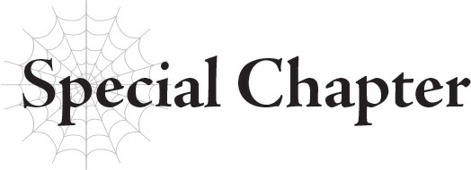

# Chương đặc biệt: Không chiến vũ trụ của Hắc Long
*(The Black Dragon’s Space Battle)*

---

Khi tiến bước qua không gian trống rỗng và vượt qua một ranh giới nhất định, tôi cảm nhận được một liên kết ma thuật tựa như cổ tự Rune vốn luôn hiện hữu đang yếu đi: cổ tự kết nối tôi với hệ thống.
Kết nối chưa bị cắt đứt hẳn, nhưng từ kinh nghiệm của mình, tôi biết rằng mình không thể tương tác với hệ thống từ khoảng cách này.
Từ nay trở đi, tôi sẽ phải chiến đấu chỉ bằng sức mạnh của chính mình, chứ không phải sức mạnh do hệ thống cung cấp.
Dĩ nhiên, tôi chưa từng chiến đấu bằng sức mạnh của hệ thống, nên điều đó chẳng có gì khác biệt với tôi. Tôi vẫn có thể hoạt động hoàn hảo mà không cần đến nó.
Là một chân long, không một thứ vũ khí tầm thường nào do bàn tay con người chế tạo có thể đe dọa được tôi.
Tuy nhiên, đó là chỉ tính riêng bản thân tôi.
Khi cân nhắc đến những tổn hại mà nó có thể gây ra cho người khác, độ khó của việc này tăng lên đáng kể.
Một vũ khí nhân tạo dĩ nhiên không đời nào giết nổi tôi.
Bất kể nó tiên tiến đến mức nào, nó cũng không thể đánh bại một chân long, một vị thần.
Giá như con người hiểu được điều đó, thì cuộc xung đột hiện tại đã có thể tránh được, nhưng tôi đoán có nói với họ cũng vô ích.
Ngay cả khi biết điều đó, tôi hoài nghi liệu con người trong quá khứ có từ bỏ việc phát triển những vũ khí này hay không.
Biết một điều gì đó và thấu hiểu nó là hai chuyện hoàn toàn khác nhau.
Nếu bạn không chấp nhận một sự thật như một thực tại hiển nhiên, bạn không thể thực sự nói rằng mình thấu hiểu nó.
Và ngay cả khi bạn thấu hiểu nó, chấp nhận nó lại là một câu chuyện khác.
Một bài toán hóc búa.
Thay vì đánh giá những gì họ có thể hoặc không thể làm, con người lại đưa ra kết luận dựa trên những gì họ muốn làm.

Khát vọng của họ, những ý định cao cả của họ, và tình cảm của họ dành cho người khác.
Họ đều có những lý do khác nhau, nhưng suy cho cùng, đó chính là động lực nguyên thủy thúc đẩy con người hành động.
Nếu đi sâu tìm hiểu, tất cả đều quy về một câu hỏi đơn giản: họ có muốn làm điều đó hay không.
Động cơ của họ đều giống nhau; chỉ có hướng đi kết quả là khác biệt.
Mặc dù chính những hướng đi khác biệt này lại gây ra vô vàn rắc rối.
Khát vọng khác nhau của họ chính là nguyên nhân khiến con người tranh đấu lẫn nhau.
Vì họ luôn ưu tiên những gì cá nhân mình muốn làm, dẫn đến việc họ xung đột với nhau.
Và nếu không thể đạt được thỏa thuận, chuyện đó sẽ dẫn đến xô xát và cuối cùng là chiến tranh.
Tranh cãi. Bạo lực. Sức mạnh quân sự.
Để đạt được ham muốn cá nhân, con người sẽ dùng mọi cách để vượt qua mọi rào cản.
Trong trường hợp đó, cỗ máy mà tôi sắp tiêu diệt có lẽ đã được chế tạo với một mục đích như vậy.
Ngay cả khi ý nghĩa của mục đích đó có thể đã thất lạc từ lâu trong quá khứ.
Chúng tôi không cách nào biết được mục đích của nó là gì.
Dĩ nhiên, nếu nhìn lại quá khứ, tôi sẽ có thể thấy những gì đã xảy ra vào thời điểm đó.
Nhưng cuối cùng, đó chẳng qua cũng chỉ là đọc ký ức của quá khứ. Tôi không thể tiến xa đến mức đọc được ý đồ của những người liên quan.
Một vị thần cấp cao hơn tôi, chẳng hạn như D, có lẽ nhìn thấu được cả điều đó, nhưng tôi thì không.
Dù có là thần đi chăng nữa, vẫn có những việc tôi có thể làm và không thể làm.

Mặc dù vậy, có một điều tôi chắc chắn biết.
Những người chế tạo ra vũ khí này đã bị dồn vào bước đường cùng.
Nếu không, họ đã chẳng tạo ra những món vũ khí khủng khiếp mà ngay cả Potimas cũng ngạc nhiên khi nghe tin chúng được chế tạo, một thứ tốn kém và phi thực tế đến mức việc sử dụng chúng sẽ dẫn đến sự hủy diệt của chính họ.
Chắc chắn họ phải nhận thức được chuyện gì sẽ xảy ra nếu họ chế tạo và sử dụng những vũ khí như vậy.
Bom GMA có thể thổi bay cả một lục địa, và ngay cả G-Meteo cũng có khả năng phá hủy chính hành tinh này.
Nếu những người đó chỉ cần có một chút lý trí tối thiểu, họ sẽ nhận ra kết cục dành cho mình nếu sử dụng chúng.
Ấy vậy mà, hoàn cảnh của họ lúc đó ngặt nghèo đến mức họ không còn lựa chọn nào khác ngoài việc chế tạo chúng bằng mọi giá.
Bởi lẽ họ đang chiến đấu chống lại một kẻ địch không thể bị đánh bại bằng bất kỳ biện pháp nửa vời nào.
Sau cùng, đối thủ của họ là những chân long như tôi.
Chắc chắn họ đã đặt những hy vọng cuối cùng vào những vũ khí này.
Tuy nhiên, rõ ràng họ đã thức tỉnh lương tri hoặc đơn giản là không hoàn thành chúng kịp thời, vì cuối cùng, những vũ khí này đã bị chôn vùi dưới lòng đất mà chưa từng một lần được nhìn thấy ánh mặt trời.
Có lẽ, điều đó lại là tốt nhất vào thời điểm đó.
Nếu những vũ khí bị chôn vùi kia được đem ra sử dụng, chúng sẽ đẩy thế giới vào một mớ hỗn độn lớn hơn nữa.
Thế nhưng, việc mối hiểm họa này lại trỗi dậy ở thời đại hiện nay của chúng tôi quả thực vô cùng nghiêm trọng.
Vào thời điểm đó, vẫn còn những vị thần khác giống như tôi có thể giải quyết các vũ khí này.
Nhưng hiện tại, chỉ còn lại một mình tôi.
Đó là lý do tại sao tôi không còn lựa chọn nào khác ngoài việc chấp nhận lời đề xuất của Potimas rằng tôi phải đi vào vũ trụ để xử lý G-Meteo.
Tôi biết đây là lựa chọn duy nhất. Chẳng một ai khác có khả năng chiến đấu ngoài không gian vũ trụ cả.

Hiểu tính Potimas, rất có thể hắn đang che giấu một thứ vũ khí có thể giải quyết được việc này, nhưng dĩ nhiên hắn không đời nào thừa nhận.
Tôi không nghi ngờ gì việc hắn cố ý đẩy tôi đi xa để hắn có thể thực hiện một mưu đồ nào đó trong lúc tôi vắng mặt.
Hắn luôn luôn là như vậy.
Bất cứ khi nào có chuyện gì bất ngờ xảy ra, kẻ đó lại tìm cách lợi dụng nó để thao túng mọi thứ có lợi cho mình.
Ngay cả khi chính hắn cũng không lường trước được sự việc, hắn vẫn đủ xảo quyệt để tìm cách kiếm chác từ nó cuối cùng.
Tôi chắc chắn tình huống này cũng không nằm trong dự tính của hắn.
Nhưng dẫu vậy, việc hắn đang cố xoay chuyển nó để trục lợi vẫn quá rõ ràng.
Vì không còn lựa chọn nào khác ngoài việc phải làm theo ý muốn của hắn, tôi chỉ biết tự trách sự bất tài của chính mình.
Nhưng việc hắn nghĩ rằng mình đang nắm giữ mọi thứ trong lòng bàn tay khiến tôi vô cùng ngứa mắt.
Phía trước, tôi đã nhìn thấy mục tiêu của mình.
Món vũ khí đáng sợ có khả năng bắt các thiên thạch và cố tình thả chúng xuống hành tinh.
Kết quả có lẽ sẽ phụ thuộc vào kích thước của thiên thạch, nhưng trong kịch bản tồi tệ nhất, vũ khí này có khả năng hủy diệt cả hành tinh.
Ấy thế mà, dù sức mạnh của nó có đáng báo động đến đâu, ngoại hình của món vũ khí này trông lại khá ngớ ngẩn.
Thân chính của nó là một khối cầu có gắn các thiết bị đẩy, và nó được trang bị tám cánh tay với mục đích bám chặt vào thiên thạch.
Ở một góc độ nào đó, trông nó giống như một sinh vật biển kỳ dị, nhưng khi khối cầu phun lửa để đẩy mình đi, ngoại hình của nó trông buồn cười hơn là đáng sợ.
Mà tôi đoán điều đó cũng dễ hiểu, nếu xét đến nhà thiết kế của nó.
Potimas chỉ quan tâm đến hiệu suất cơ khí và hoàn toàn không để tâm đến vẻ bề ngoài.
Hình dạng ngớ ngẩn này chắc hẳn là kết quả của một thiết kế tập trung vào hiệu suất khác.
Và vì nó chú trọng vào hiệu suất như vậy, không nghi ngờ gì nữa, món vũ khí này ẩn chứa nhiều điều đáng sợ hơn vẻ bề ngoài rất nhiều.

G-Meteo, có lẽ đã phát hiện ra sự tiếp cận của tôi, bắt đầu bắn ra những viên đạn ánh sáng.
Không gian vũ trụ không làm giảm uy lực của những vũ khí quang học này.
Trái lại, môi trường chân không chỉ làm chúng mạnh thêm.
Tuy nhiên, một vũ khí do con người chế tạo không thể làm tổn hại đến một vị thần.
Tôi tiếp tục tiến bước, không buồn tránh né những viên đạn.
Kết giới của tôi vô hiệu hóa chúng ngay lập tức, nên chúng không những không làm tôi bị thương mà thậm chí còn chẳng thể làm tôi chậm lại.
Là một chân long, tôi sở hữu một kết giới mạnh mẽ hơn nhiều so với bất kỳ thứ gì được tạo ra bởi kỹ năng của hệ thống.
Kết giới của một chân long là vô hạn, ngăn chặn cả đòn tấn công vật lý lẫn ma pháp.
Cả Potimas hay thậm chí là D đều không thể tái tạo hoàn toàn khả năng độc nhất vô nhị này của loài rồng.
D đã tạo ra một phiên bản kém hơn bằng cách sử dụng các kỹ năng, còn Potimas thì phát triển một kết giới đẩy lùi ma pháp, nhưng cả hai đều không thể sánh bằng bản gốc.
Chính sự tồn tại của kết giới này là lý do khiến việc đánh bại loài rồng trở nên vô cùng khó khăn.
Ngay cả khi ai đó châm ngòi cho một thảm họa hủy diệt cả hành tinh, thì việc các chân long có bị tổn hại hay không vẫn là điều chưa chắc chắn.
Tất cả những nỗ lực đó chỉ để đổi lại khả năng mong manh là để lại một vết xước trên người một con rồng.
Ngay cả điều đó cũng không đủ để xuyên thủng kết giới của rồng.
Đó là sự khác biệt thực sự giữa con người và thần long vĩ đại.
Con người trong quá khứ biết điều này, nhưng họ đã không thấu hiểu nó.
Đó chính xác là lý do tại sao họ tạo ra những thứ vũ khí này, tin rằng đó là hy vọng cuối cùng của mình.
Và giờ đây, tôi sẽ nghiền nát niềm hy vọng đó của quá khứ.

G-Meteo bị tiêu diệt trong chớp mắt.
Niềm hy vọng giờ đây đã vô nghĩa từ một thời đại đã qua, bị biến thành đống rác trôi nổi trong không gian.
Nhìn cảnh tượng đó, tôi không khỏi cảm thấy một chút buồn bã thoáng qua.
Có lẽ vì bản thân tôi cũng là một thực thể của quá khứ, đang bám víu vào một mục đích có lẽ không còn ý nghĩa gì ở hiện tại.
Bởi tôi cũng giống như con người.
Tôi tiếp tục đấu tranh vì mục đích hoàn thành ham muốn cá nhân của mình.
Điều đó không giống như một con rồng thông thường, và đó chính xác là lý do tôi ở đây.
Trong số tất cả những chân long từng rời bỏ hành tinh này, chỉ có mình tôi ở lại.
Đây là nơi duy nhất tôi có thể thuộc về.
Khi những mảnh vụn của G-Meteo trôi nổi xung quanh, tôi gác lại cảm xúc của mình và quay trở lại.
Nếu khẩn trương, tôi vẫn có thể đến trợ giúp Ariel và những người khác.
Quả bom GMA vẫn chưa bị thả xuống.
Nếu một con rồng như tôi xuất hiện trước mặt G-Fleet, nó có thể sẽ thả bom GMA, nhưng ngay cả khi đó, tôi vẫn có thể xử lý được tình huống đó.
Tôi chắc chắn có thể giải quyết tình hình này tốt hơn nhiều so với Ariel và những người khác.
Bất kể Potimas cố giở trò gì.
Dù hắn đang lên kế hoạch gì, tôi cũng sẽ đập tan mưu đồ của hắn không chút nương tay.
“Làm tốt lắm.”

Giọng nói đó ngay lập tức dập tắt mọi nhiệt huyết của tôi.
Ngay cả trong không gian vũ trụ, giọng nói này vẫn lọt vào tai tôi một cách dễ dàng.
Nó phát ra từ một thiết bị mỏng đang trôi nổi ngay trước mặt tôi.
Ngay cả tôi cũng không nhận ra sự xuất hiện của vật thể này.
Chỉ riêng điều đó đã cho thấy sự chênh lệch sức mạnh giữa tôi và thực thể đã gửi thiết bị này tới.
Và chỉ có duy nhất một người sẽ liên lạc với tôi vào thời điểm như thế này.

“Cô muốn gì đây, D?”
Tôi mở miệng để giọng nói của mình truyền đến đối phương.
Đối với một vị thần, việc tạo ra âm thanh trong chân không vũ trụ là một nhiệm vụ đơn giản.
D: tà thần, vị thần cuối cùng, tử thần.
Thực thể trị vì với tư cách là kẻ mạnh nhất trong số tất cả các vị thần có rất nhiều tên gọi.
Thông thường, một thực thể như vậy sẽ không bận tâm nói chuyện với một vị thần cấp thấp như tôi.
Ấy thế mà, giọng nói này lại trò chuyện với tôi khá tự nhiên.
Một con người tôn thờ D có thể coi đây là niềm hạnh phúc lớn lao nhất có thể tưởng tượng được, nhưng đối với tôi, nó chẳng mang lại điều gì khác ngoài điềm báo chẳng lành.
“Xin chào cậu nhé. Vai trò của cậu trong sự cố lần này đến đây là kết thúc rồi. Vậy nên phiền cậu hãy đứng từ đây và theo dõi phần còn lại nhé.”
Và điềm báo của tôi đã đúng.
D đang bảo tôi hãy ở lại đây và đừng làm gì cả.
Nhưng tôi không hiểu tại sao.
Chắc chắn D không muốn bom GMA đặt dấu chấm hết cho vở kịch nhỏ này.
“Tại sao?”
“Bởi vì như thế này sẽ thú vị hơn nhiều,” D trả lời một cách trơ tráo.
D muốn để thế giới tiếp tục chìm trong nguy hiểm, chỉ đơn giản vì như thế sẽ vui mắt hơn.
Sự ngạo ngược của vị thần này thật không thể tin nổi.
Nhưng cô ta hoàn toàn nghiêm túc.
Hành động của con người hoàn toàn dựa trên ý muốn bất chợt của cá nhân họ.
Và vị thần này cũng suy nghĩ và hành động theo một cách rất giống như vậy.
D hành động thuần túy dựa trên việc liệu điều gì đó có thú vị hay không.
Mọi việc cô ta làm chỉ đơn giản là để giải trí cho bản thân.
Nếu thấy vui, cô ta sẵn sàng làm bất cứ điều gì—bất kể có ai bị tổn hại hay thứ gì bị đổ vỡ.

Đó chính xác là bản chất thực sự của D, thực thể thường được gọi là tà thần.
Và vì lúc này cô ta đưa ra yêu cầu này với tôi, cô ta chắc hẳn đã quyết định rằng mọi chuyện sẽ thú vị hơn nếu tôi không quay lại.
Cô ta muốn những người ở dưới kia tự giải quyết tình huống này bằng thực lực của chính họ mà không có sự giúp đỡ của tôi.
Không nghi ngờ gì việc D coi đó là một trò giải trí cực kỳ hấp dẫn.
Nhưng đối với tôi, nó chẳng có gì là thú vị cả.
“Nhưng...”
“Xin vui lòng cứ ở yên vị trí của cậu vào lúc này đi nhé.”
Tôi cố gắng phản đối, nhưng D đã ngắt lời tôi bằng một mệnh lệnh.
Giọng điệu của cô ta lịch sự nhưng ẩn chứa một vẻ kiên quyết cho thấy cô ta sẽ không cho phép tôi hành động trái ý mình.
Một ý chí thật kiêu ngạo và ích kỷ.
Cô ta thực sự rất giống với đứa trẻ kia.
Thiên hướng của họ có thể khác nhau, nhưng cô gái mặc đồ trắng kia cũng thể hiện động lực trơ trẽn tương tự khi chạy theo ham muốn ích kỷ của bản thân.
Cô ta luôn đặt bản thân lên hàng đầu và sẵn lòng gieo rắc sự hủy diệt nếu điều đó giúp cô ta đạt được thứ mình muốn.
Đó chính xác là lý do khiến tôi lo lắng về cô gái đó nhiều đến vậy.
Tôi e rằng động lực đó của cô ta một ngày nào đó sẽ dẫn đến một hậu quả vô cùng nghiêm trọng.
Tuy nhiên, lúc này tôi lại đang trò chuyện với một kẻ nguy hiểm hơn cô gái đó gấp bội.
Nếu D muốn, cô ta có thể dễ dàng xóa sổ ngay cả tôi.
“Tôi hiểu rồi.”
Đó là câu trả lời duy nhất tôi được phép đưa ra.
Bởi nếu làm mất lòng D, tôi không phải là người duy nhất phải gánh chịu hậu quả.
Miễn là cô gái mặc đồ trắng yêu quý của D còn ở quanh đây, tôi hoài nghi việc cô ta sẽ gây ra bất kỳ tổn hại nghiêm trọng nào cho thế giới này, nhưng cô ta chắc chắn sở hữu sức mạnh để làm điều đó nếu muốn.
Và ngăn cản cô ta nằm ngoài khả năng của tôi.
“Câu trả lời rất tốt.”
Thiết bị phát ra giọng nói của D đã biến mất từ lúc nào.
Khi đã nói xong phần mình, cô ta chỉ đơn giản là rời đi theo cách của mình.
Giờ đây tôi không còn lựa chọn nào khác ngoài việc ở lại đây và theo dõi trận chiến diễn ra.
Ngay cả khi tính mạng của Ariel gặp nguy hiểm hay Potimas đang chuẩn bị nở một nụ cười khinh khỉnh ngạo mạn.
Bất kể kết quả cuối cùng có ra sao, D rất có thể sẽ không can thiệp.
Bởi làm vậy đơn giản là sẽ không còn tính giải trí đối với cô ta nữa.
D sở hữu sức mạnh áp đảo đến mức cô ta có thể làm hầu hết mọi thứ nếu có hứng thú.
Đó là lý do tại sao cô ta chỉ đứng nhìn và hiếm khi nhúng tay vào việc gì.
Bất kể kết cục ra sao.
Trong bóng tối của không gian vũ trụ, tôi siết chặt tay bất lực trước sự vô dụng của bản thân.
Xin hãy tìm cách sống sót qua chuyện này.

---

[◀ Chương trước: Chương 11: Nhiệm vụ thâm nhập UFO](11_ufo_infiltration_mission.md) | [Chương tiếp theo: Chương 12: Tiến triển bão táp của đội gỡ bom ▶](12_the_bomb_squads_explosive_progress.md)
