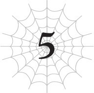
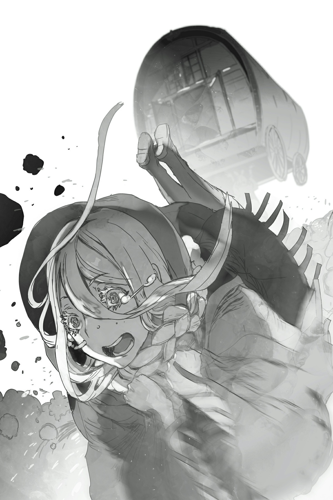

# Chương 5: Tôi leo núi
*(I’M MOUNTAIN CLIMBING)*

---

Sau khi trải qua một đêm ở ngôi làng bỏ hoang, chúng tôi khởi hành tiến vào Dãy núi Huyền Bí.

Hử?

Chúng tôi có gặp con ma nào không á?

Dĩ nhiên là không rồi, đồ ngốc!

Cho dù cái nơi này có ma mị và xui xẻo đến mức nào đi chăng nữa, thì trên đời này hoàn toàn không có thứ gọi là ma quỷ đâu, chấm hết.

Bởi vì khi bạn chết đi, bạn sẽ bị cưỡng chế đưa về nhà của nữ thần.

Nếu muốn lởn vởn ở đây như một con ma, bạn buộc phải có khả năng chống lại các vị thần bằng cách nào đó.

Mà trên thực tế, nếu bạn đủ mạnh để làm được điều đó, tôi nghĩ bạn thậm chí chẳng còn là ma nữa rồi. Như thế thì rắc rối to đấy.

Thế nên là, đêm qua của chúng tôi đã trôi qua vô cùng êm đẹp, cảm ơn nhiều nhé.

Lũ nhện rối thì không nói làm gì, nhưng tôi không biết nên ấn tượng với tốc độ lăn ra ngủ của Vampy hay là kinh hoàng trước sự thiếu nữ tính của con bé nữa.

Chẳng phải đó là thời điểm hoàn hảo nhất để đi đến chỗ Mera kiểu như: *Em sợ quá không ngủ được. Em ở cùng anh nhé?* sao?

Con bé hiện tại vẫn chỉ là một đứa trẻ con, thế nên việc ngủ cạnh người giám hộ của mình cũng chẳng có gì kỳ lạ.

Cho dù không có hiện tượng siêu nhiên nào xảy ra đi nữa, ít nhất chúng tôi cũng phải có chút drama để xem chứ.

Dẫu sao thì, đó là mấy chuyện ngớ ngẩn mà tôi đang nghĩ tới trong lúc nảy lên nảy xuống bên trong cỗ xe ngựa.

Bên ngoài trời rất lạnh, nên tôi đang quấn chặt mình trong một chiếc chăn.

Tại sao tôi không tự đi bộ á?

Ừ, phải rồi. Bạn nghĩ tôi có thể đi bộ trên con đường núi thế này chắc?

Tôi đảm bảo với bạn là tôi sẽ gục ngã cạch mặt chỉ trong vòng chưa đầy một tiếng đồng hồ!

Ma Vương cũng biết rõ điều đó, thế nên ngay từ đầu tôi đã được xếp ở chế độ chờ bên trong cỗ xe rồi.

Vai trò của tôi trong chuyến thám hiểm leo núi này là ngồi im thin thít trong xe kéo, y như thế này đây.

Đúng vậy. Về cơ bản tôi chỉ là một món hành lý thôi!

Trong khi những người khác phải chật vật lê bước lên núi, tôi lại được một mình tận hưởng chuyến đi xa hoa này.

Ừm, làm chính mình thật là tốt.

Dù vậy, tôi không nói là chuyến đi này dễ dàng đâu nhé.

Lý do đầu tiên là vì trời rất lạnh.

Thời tiết ở Dãy núi Huyền Bí khắc nghiệt đến mức tuyết ở đây không bao giờ tan.

Chúng tôi hiện vẫn đang di chuyển ở độ cao tương đối thấp, nhưng trời đã lạnh đến mức chết tiệt rồi.

Ngay cả khi đã quấn mình trong chiếc chăn chứa các viên ma thạch tỏa nhiệt này, tôi vẫn rét run cầm cập.

Được rồi, về mặt kỹ thuật thì lúc đầu đây chỉ là một viên đá bình thường mà thôi.

Nhưng nhờ có kỹ năng [Truyền Phép] cho phép người dùng nạp ma lực vào một vật thể, nó đã được truyền [Hỏa Ma pháp] vào bên trong.

Tất nhiên là do Ma Vương chế tạo rồi.

Vì ban đầu nó chỉ là một viên đá vụn, nên giá của nó cực kỳ hạt dẻ: hoàn toàn miễn phí.

Đúng là một món hời lớn mà!

Cô ta đã làm một đống ma thạch như thế này khi chúng tôi còn ở trong thị trấn, nên mỗi người chúng tôi đều mang theo vài viên bên người.

Nhân tiện, tôi là đứa nhận được nhiều nhất, vì tôi không có chỉ số để bảo vệ mình khỏi cái lạnh.

Hiện tại tôi vẫn chỉ đang dùng một viên thôi, nhưng khi trời lạnh hơn, tôi dự định sẽ dùng cả đống cùng một lúc.

Thành thật mà nói, tôi muốn dùng sạch sành sanh tất cả tụi nó ngay giây phút này luôn.

Lạnh quá đi mất!

Nhưng nếu mới bắt đầu chuyến đi mà tôi đã than vãn thì e là tôi sẽ không thể cầm cự nổi trong phần còn lại của cuộc hành trình, nên tôi đang ép mình phải cắn răng chịu đựng.

Mà cái lạnh cũng không phải là vấn đề duy nhất đâu.

Tôi đang bị say xe đây này.

Ý tôi là, cái thứ này đung đưa dữ dội thật đấy.

Hết lắc qua lại lắc lại.

Ai mà không cảm thấy buồn nôn cho được chứ?

Uệ!

Tại sao nó lại đung đưa dữ dội như vậy á? Bởi vì cỗ xe này không hề chạm đất.

Với những ai đang nghĩ *Cô đang nói cái quái gì thế hả?*, phản ứng của bạn là hoàn toàn hợp lý, nhưng hãy suy nghĩ một giây xem.

Làm sao một cỗ xe ngựa lại có thể di chuyển trên con đường núi gập ghềnh không bằng phẳng cơ chứ?

Chắc chắn là không thể rồi!

Vậy thì cỗ xe này di chuyển bằng cách nào? Câu hỏi hay đấy.

Câu trả lời là: Nó được mang đi.

Bởi ai á? Bởi Ael.

Con bé trông giống như một bé gái nhỏ nhắn, vậy mà nó lại đang vác cỗ xe này trên lưng và bước đi.

Nếu có bất kỳ người ngoài nào nhìn thấy cảnh này, tôi chắc chắn trông nó sẽ vô cùng điên rồ.

Nhưng bất chấp vẻ bề ngoài đó, con bé thực chất là một con quái vật với các chỉ số lên tới năm chữ số.

Việc vác một cỗ xe lên núi chỉ là chuyện nhỏ đối với con bé.

Không may là, điều đó đồng nghĩa với việc cỗ xe sẽ lắc lư liên hồi suốt chặng đường đi.

Dĩ nhiên là khi được cõng trên lưng ai đó thì bạn sẽ phải nảy lên nảy xuống rất nhiều rồi.

Thực ra con bé đã cố gắng đi đứng rất cẩn thận rồi đấy, nếu không tôi đoán mình chắc chắn sẽ còn phải đau khổ hơn nhiều.

Nếu là bất kỳ con nhện rối nào khác, tôi cá là tụi nó sẽ không bao giờ nghĩ đến chuyện phải vác xe một cách nhẹ nhàng đâu.

Ừ. Không cần đi sâu vào chi tiết làm gì, kết cục của chuyện đó chắc chắn sẽ không tốt đẹp gì đâu.

Uệ!

Tôi buộc phải chịu đựng cái lạnh và sự rung lắc này bằng cách nào đó.

Nghe thì có vẻ như đây chỉ là một rắc rối nhỏ so với những người đang phải đi bộ ngoài kia, nhưng vì tôi không có chỉ số, nên hãy tha cho tôi đi.

Nếu có thể đi bộ bằng chính đôi chân của mình, tôi đã làm ngay lập tức rồi!

Vả lại, về mặt lý thuyết thì không phải tất cả họ đều đang đi bộ bằng chân của mình đâu.

Vampy và Mera đang cưỡi trên hai con địa phi long vốn dùng để kéo xe.

Vì hiện tại Ael đang vác cỗ xe, nên hai con địa phi long đã được giải phóng để làm thú cưỡi.

Mera đã thuần phục cặp địa phi long này bằng một kỹ năng.

Hồi còn là con người, anh ta dường như sở hữu đủ mọi loại kỹ năng của một quản gia, bao gồm cả kỹ năng đánh xe ngựa.

Quản gia kiêm tài xế á? Ừ, tôi biết rồi. Đừng bận tâm làm gì.

Dẫu sao thì, đó là lý do tại sao ban đầu anh ta đã sở hữu sẵn kỹ năng [Thuần thú] rồi, và nhờ thuần phục cặp địa phi long này, anh ta đã có thể tiến hóa kỹ năng đó thành [Triệu Hồi].

Xem này, có hai cách để thu phục một con quái vật.

Một là dùng kỹ năng để ép buộc chúng phải tuân lời.

Tức là dùng [Thuần thú] hoặc dạng nâng cấp của nó, [Triệu Hồi], để bắt quái vật làm theo ý bạn.

Lựa chọn còn lại là khiến chúng công nhận bạn và giao kết giao ước với bạn.

Với cách đầu tiên, về cơ bản bạn đang cưỡng bức quái vật làm nô lệ cho mình.

Tất nhiên, người thuần hóa phải mạnh hơn quái vật trong trường hợp này, nếu không kỹ năng sẽ bị bật ngược lại ngay.

Tuy nhiên, nếu bạn làm suy yếu quái vật từ trước, đôi khi nó vẫn sẽ hoạt động.

Bạn không cần sự đồng ý của quái vật, thế nên bạn có thể bắt nó làm việc ngay lập tức.

Nhưng vì là cưỡng ép, điều đó đồng nghĩa với việc bạn đang đàn áp ý chí tự do của quái vật.

Sau khi bị bắt làm nô lệ, nó thực chất chỉ là một thực thể hoàn toàn khác có cùng chỉ số mà thôi.

Một khi bạn đã kiểm soát ý chí tự do của nó, con quái vật đó không khác gì một cỗ máy chỉ biết tuân theo mệnh lệnh.

Mặt khác, nếu bạn khiến một con quái vật công nhận mình làm chủ nhân và giao kết giao ước, con quái vật đó sẽ giữ lại ý chí tự do của mình.

Tất nhiên, điều đó có nghĩa là quái vật có khả năng phản bội lại bạn.

Nhưng vì hai bên có một mối liên kết thực sự kết nối với nhau, bạn sẽ có được một đồng minh đáng tin cậy hơn nhiều so với việc chỉ dùng kỹ năng bắt chúng tuân lệnh.

A, sức mạnh của tình bạn!

Vì thế Mera đang sử dụng cách thứ hai, một giao ước với những quái vật đã chấp nhận anh ta làm chủ nhân.

Chủng loài địa phi long có xu hướng trung thành suốt đời với bất kỳ ai mà chúng công nhận làm chủ nhân, thế nên làm cách này tốt hơn nhiều. Chúng có lẽ sẽ chiến đấu đến chết vì anh ta ngay lúc này.

Mặc dù nói thẳng ra, chúng là những thành viên yếu thứ hai trong nhóm này chỉ sau tôi, nên chắc là chúng sẽ không có cơ hội làm vậy sớm đâu.

Công việc chính của chúng chỉ là làm súc vật thồ hàng mà thôi.

Dẫu vậy, nếu chuyến đi trở nên quá sức đối với chúng, hai người cưỡi có lẽ sẽ xuống đi bộ và dắt dây cương cho chúng.

Dù sao thì chỉ số của người cưỡi vẫn cao hơn lũ phi long mà.

Ngay cả khi lũ địa phi long mệt mỏi, cặp đôi ma cà rồng có lẽ vẫn sẽ hoạt bát và tràn đầy năng lượng thôi.

Tuy nhiên, cho đến nay thì bước đi của lũ địa phi long trông vẫn có vẻ nhẹ nhàng.

Cố gắng lắng tai nghe, tôi có thể nghe thấy cặp đôi ma cà rồng và Ma Vương đang trò chuyện với nhau.

“Có con quái vật nào chúng ta cần đề phòng ở trên này không ạ?”

“Hửm? Miễn là có ta đi cùng thì các cháu chẳng cần phải lo lắng về bất kỳ con quái vật nào đâu, nhưng ta đoán đây là lãnh thổ của băng long.”

“Còn gì khác nữa không ạ?”

“Chà, ta đoán là lúc nào cũng có goblin nữa.”

“Dạ?”

Hử?

Tôi cũng hoang mang y như Vampy vậy.

Chẳng phải goblin về cơ bản là đại diện cho những quái vật siêu yếu hay sao?

“Chúng có tinh thần chiến binh chẳng kém gì một con rồng già đâu. Hay nên gọi là sự quyết tâm nhỉ? Bản thân chúng đơn độc thì yếu thật đấy, nhưng chúng không hề sợ hãi khi phải đối mặt với cái chết. Và chúng luôn tấn công theo đàn, thế nên chúng là một mối đe dọa khá nghiêm trọng đối với một con người bình thường đấy.”

Cái thế giới kiểu gì lại có lũ goblin như thế chứ?!

Chắc là thế giới này rồi!

Nhưng nghe chẳng giống loài goblin mà tất cả chúng ta đều biết và yêu thích chút nào cả.

Thật không thể tin nổi.

“Ồ, và ta đoán còn có lũ khỉ nữa.”

Ma Vương và bé ma cà rồng cứ tiếp tục trò chuyện trong lúc đi bộ.

Phải rồi, họ có đủ năng lượng dư thừa để tán gẫu trong lúc chúng tôi leo lên ngọn núi này đấy, nếu bạn tin nổi.

Nhưng tôi đoán chuyện đó có lẽ sẽ thay đổi khi chúng tôi lên cao hơn thôi.

Nhưng tôi chắc chắn ngày đó vẫn còn xa lắm.

Ôi trời, tôi nhớ cái lúc mình còn ngây thơ tin vào điều đó quá đi mất.

L-l-l-l-lạnh quá đi mất!

Không chỉ đơn thuần là lạnh đâu, mà là đóng băng luôn rồi!

Nói đúng hơn thì, nó đau buốt thẳng vào da thịt luôn đấy!

Tôi biết dãy núi này sẽ rất gian nan, nhưng thế này thì còn tệ hơn nhiều so với những gì tôi tưởng tượng.

Tôi đang quấn chặt mình trong chăn cùng với tất cả đống ma thạch của mình, thế mà vẫn lạnh cóng cả mông.

Chỉ riêng việc nảy lên nảy xuống bên trong cỗ xe thế này dường như cũng đang bào mòn thể lực của tôi rồi.

Vất vả thật đấy, nghiêm túc luôn.

Đã vài ngày trôi qua kể từ khi chúng tôi bắt đầu hành trình vượt Dãy núi Huyền Bí.

Chúng tôi vẫn đang di chuyển với tốc độ ổn định, nhưng càng đi xa, trời càng lạnh và càng đau buốt hơn.

Những hạt tuyết xoáy tròn trong không trung trông thì đẹp thật đấy, nhưng đồng thời cũng là thứ tồi tệ nhất trên đời.

Tuyết rơi xuống và liên tục chất đống trên nóc cỗ xe.

Nếu quá nhiều sẽ làm sập nóc xe mất, vì vậy thỉnh thoảng chúng tôi lại phải quét dọn nó đi.

Và Ael thực hiện việc đó bằng cách lắc mạnh cỗ xe xung quanh.

Thật đấy, lắc qua lắc lại cứ như điên vậy.

Nó giống như mấy trò chơi cảm giác mạnh ở công viên giải trí ấy, ngoại trừ việc tôi không chắc mình có thể sống sót nổi hay không.

Tôi cảm thấy mình sắp nôn ra đến nơi rồi.

Thế nên mỗi ngày tôi đều cầu xin tuyết: *Làm ơn hãy ngừng rơi đi mà!*

Nhưng lời cầu nguyện của tôi hoàn toàn không được hồi đáp...

Tôi vẫn cứ tiếp tục bị lắc qua lắc lại như điên!

Ư, cái này đúng là tệ hại thật mà.

Và dĩ nhiên, tuyết cũng đang tích tụ đầy trên mặt đất nữa.

Nó chất cao đến mức nếu tôi mà đi bộ ngoài kia, tuyết chắc chắn sẽ ngập đến tận mang tai tôi mất.

Và vì là tuyết mới rơi nên nó siêu mềm nữa chứ.

Nếu bạn thả rơi Vampy xuống lớp tuyết như thế, con bé chắc chắn sẽ bị chôn sống ngay tại chỗ luôn!

Thế nên Ma Vương đang đi tiên phong, dọn đường xuyên qua các đống tuyết cho những người còn lại đi theo.

Chết tiệt, cô ta còn hiệu quả hơn cả một chiếc xe dọn tuyết nữa đấy.

Có các chỉ số khủng như thế đúng là sướng thật mà.

“Hửm. Nhưng chuyện này hơi kỳ lạ đấy nhé. Không biết có chuyện gì đang xảy ra nữa.”

Ma Vương lẩm bẩm một mình trong lúc dọn đường qua các đống tuyết dày.

Tôi đoán ý cô ta là việc tuyết rơi không ngừng như thế này là rất bất thường.

Lý do lớn nhất khiến Dãy núi Huyền Bí được coi là bất khả xâm phạm chính là vì loài rồng làm tổ ở đó.

Cả một gia tộc rồng điều khiển băng tuyết đang sống trên các đỉnh núi này, đóng đô ngay chính giữa biên giới ngăn cách giữa lãnh thổ loài người và ma tộc.

Nếu loài người hoặc ma tộc muốn xâm lược lẫn nhau, họ bắt buộc phải băng qua lãnh địa của băng long trước, khiến cho việc tiến quân qua Dãy núi Huyền Bí trở nên gần như bất khả thi.

Trên thực tế, lũ băng long chính là nguyên nhân khiến nơi này lạnh đến mức chết tiệt như vậy.

Chúng không ngừng tạo ra khí lạnh, đóng băng toàn bộ vùng đất xung quanh.

Tất nhiên, càng đến gần nguồn phát thì trời càng lạnh hơn.

Vì thế tiến vào sâu trong lòng dãy núi là một việc cực kỳ đáng sợ.

Nhưng đó lại chính xác là nơi chúng tôi đang hướng đến — thực ra chúng tôi đã sắp tới nơi rồi — nhưng rõ ràng tình hình hiện tại là rất bất thường.

Tôi đoán mình có thể hiểu được tại sao.

Tôi đang dùng tất cả số ma thạch mà Ma Vương đã làm, thế mà tôi vẫn đang run rẩy như một chiếc lá rụng ở đây.

Mặt ngoài của chiếc chăn mà tôi đang quấn quanh người cùng đống ma thạch thực sự đã bắt đầu đóng băng rồi.

Thế nên nếu không có ma thạch, chiếc chăn này chắc chắn đã biến thành một khối băng, và tôi cũng vậy.

Ấy thế mà, bên ngoài trời lại đang rơi tuyết.

Ở nhiệt độ như thế này, đáng lẽ nó phải là mưa đá rồi mới đúng chứ.

Đúng là thế giới fantasy có khác.

Điều đó có nghĩa là trận tuyết này là một tạo tác ma pháp chứ không phải tự nhiên.

Vậy thì bạn nghĩ ai là kẻ đang làm cho tuyết rơi hả?

Rõ ràng là những kẻ thống trị ngọn núi này, lũ băng long rồi.

“Có lẽ chúng đang muốn ngăn cản cô tránh xa nơi này chăng, cô Ariel?”

“Không đâu. Ngay cả lũ băng long cũng thừa biết chúng không thể đánh bại ta mà. Thêm vào đó, giữa chúng ta có một thỏa thuận ngầm là ta sẽ không kiếm chuyện với chúng. Lần trước khi ta đi ngang qua con đường này chúng cũng không hề cố gắng ngăn chặn ta, thế nên ta đoán mục tiêu của chúng không phải là chúng ta.”

Bên ngoài lớp chăn đóng băng, tôi lại nghe thấy tiếng trò chuyện của Vampy và Ma Vương.

Thời tiết lúc này quá lạnh để có thể tán gẫu, nhưng tôi vẫn rất tò mò về những gì họ đang nói.

Tôi hé mở một khe nhỏ trên chăn để có thể nghe rõ hơn.

Ngay lập tức, luồng không khí lạnh buốt ùa vào qua khe hở.

Lạnh quá!

Tôi sắp đóng băng mất thôi!

“Chắc chắn phải có một kẻ ngoại lai khác đang ở trên núi ngoài chúng ta lúc này. Liệu có phải là con quỷ (ogre) đó không?”

Không đợi nghe thêm nữa, tôi vội vàng bịt kín khe hở lại.

Phù. Tôi cứ tưởng mình sắp đông cứng đến chết rồi chứ.

Lại là con quỷ đó nữa à? Gã này hiếu chiến thật đấy.

Cứ đi gây rắc rối khắp mọi nơi.

Trẻ tuổi và vô lo vô nghĩ đúng là sướng thật mà.

Dù rằng về mặt kỹ thuật thì tôi cũng là một đứa trẻ con, giống như bé ma cà rồng vậy.

Nhưng hết Elf rồi lại đến rồng á? Con quỷ này chắc chắn là một kẻ cuồng chiến rồi.

Tại sao nó cứ liên tục thách thức hết đối thủ mạnh này đến đối thủ mạnh khác thế chứ?

Hay là nó đang thực hiện một kiểu nhiệm vụ “phải đi tìm kẻ mạnh hơn mình” hả?

Nếu thế thì tôi có tin mới cho cậu đây, người bạn: Ma Vương, kẻ mạnh nhất thế giới, đang ở ngay đây này.

Cô ta sẽ mạnh hơn cậu nhiều đến mức cậu chỉ có nước nói mấy câu thoại kiểu: *Hự! Mình không thể tung nổi một đòn...!* thôi.

Đấy là nếu cậu còn cơ hội để nói bất cứ điều gì trước khi bị cô ta băm vằn thành thịt xay. Hoặc ít nhất là bị đánh cho tan xác hoa lá hẹ.

Nếu con quỷ đó thực sự là nguyên nhân của thời tiết quái dị này, thì nói thẳng ra, tôi hy vọng chuyện đó sẽ xảy ra thật.

Thành thật mà nói, con quỷ này đúng là một của nợ lớn mà.

Đầu tiên chúng tôi bị kẹt lại ở thị trấn kia, rồi giờ lại phải chịu đựng thời tiết kinh tởm này, tất cả đều nhờ ơn của một con quỷ ngu xuẩn.

Ồ, tôi đoán nó cũng đã giết lũ Elf hộ chúng tôi, nên đó là một điểm cộng.

Nhưng nhìn chung thì điểm trừ vẫn nhiều hơn.

Kiểu như, nó không thể biến mất quách đi cho rồi à?

Nếu đây là một câu chuyện về anh hùng, con quỷ đó có lẽ sẽ đánh bại lũ băng long và đứng chắn đường chúng tôi, rồi chúng tôi sẽ phải đá đít nó đi bằng sức mạnh của tình bạn hay gì đó đại loại thế.

Mặc dù nếu ngay cả quân đội đế quốc cũng có thể xua đuổi được nó, tôi không nghĩ nó có thể đánh bại nổi một con rồng sớm đâu.

Băng long đại nhân kính mến, làm ơn hãy đập bẹp dí con quỷ đó và ngăn chặn trận tuyết rơi này lại đi.

Nếu không, tôi chắc chắn sẽ bỏ mạng ở ngoài này mất thôi!

Tôi có thể nghe thấy tiếng răng mình đang đánh vào nhau lập cập.

“Hự?!”

Ngay lúc đó, Ma Vương đột ngột phát ra một âm thanh vô cùng thiếu nữ tính.

Tôi không biết nữa, tôi nghĩ con gái thì không nên nói “Hự!” như thế đâu.

Tôi hé mở một khe nhỏ trên chăn để hé mắt nhìn ra ngoài.

Hự?!

Cảnh tượng bên ngoài chấn động đến mức tôi quên bẵng đi luồng không khí lạnh buốt trong một giây.

Lũ khỉ.

Cơn ác mộng tồi tệ nhất của tôi.

Chấn thương tâm lý sâu sắc của tôi.

Làm sao tôi có thể quên được chứ? Chính là lũ khỉ từng bao vây và suýt chút nữa đã giết chết tôi trong những ngày tháng yếu ớt ở Tầng Dưới của Mê cung Lớn Elroe!

Nếu nhớ không lầm, chúng được gọi là “Anogratch” hay gì đó tương tự.

Vào một thời điểm nào đó trong cuộc hành trình của chúng tôi, Ma Vương đã nói với tôi rằng chúng còn được biết đến với cái tên “lũ khỉ báo thù”. Nếu một con trong đàn bị giết, chúng sẽ tập hợp thành những bầy khổng lồ để trả thù kẻ đã giết nó.

Để mọi chuyện tồi tệ hơn, một khi chúng đã nhắm vào mục tiêu để trả thù, chúng sẽ không bao giờ bỏ cuộc cho đến khi kẻ đó phải chết mới thôi.

Nếu bạn nhìn thấy một con, bạn tuyệt đối không bao giờ được phép giết nó.

Bởi ngay cả khi bạn chỉ giết một cá thể duy nhất, cả đàn của chúng cũng sẽ kéo đến tấn công bạn như ong vỡ tổ.

Phải rồi.

Hồi đó tôi đã thấy rất kỳ lạ khi chúng lại quyết tâm giết chết một con nhện duy nhất đến thế, nhưng tôi đoán đó chỉ là bản năng tự nhiên của chúng mà thôi.

Bạn đang đùa tôi đấy à?!

Cái trò chơi rác rưởi gì lại gửi một đống kẻ thù đến tấn công bạn nhưng bạn lại không được phép giết bất kỳ con nào trong số chúng hả?

Bản năng sinh tồn của các ngươi phải tệ hại đến mức nào mới có thể liên tục cố gắng trả thù cho một cá thể duy nhất cho đến khi tất cả các ngươi đều chết sạch cơ chứ?!

Và chính lũ khỉ đó đang lao thẳng về phía chúng tôi lúc này.

Không phải chỉ một hai con đâu nhé. Chúng đang kéo đến lũ lượt.

Ừm, cái làn sóng khỉ cuồn cuộn này là thế nào vậy hả?!

Có thật không đấy?!

Không có ai nói với tôi rằng lũ khỉ chết tiệt này cũng sống ở Dãy núi Huyền Bí cả!

““““““““““““““““ÚT, ÚT!””””””””””””””””

Đừng có ÚT ÚT với tôi, lũ khỉ ngốc nghếch kia!

Thật đấy, tại sao tôi không thể thức dậy từ cơn ác mộng này chứ hả?!

Đây cũng là do lỗi của con quỷ ngớ ngẩn đó nữa đúng không?!

Có phải cả đàn khỉ này đang chạy trốn về hướng này để thoát khỏi trận chiến giữa con quỷ và lũ băng long hay gì đó tương tự không?!

Con quỷ này đúng là rác rưởi mà!

“Cái—?! Hở!”

Ngay cả Ma Vương cũng phải giật mình trước cảnh tượng đó!

Bé ma cà rồng và Mera hoàn toàn đứng hình.

Này, đừng có đóng băng chỉ vì bên ngoài trời lạnh chứ!

Ngoại trừ Ael ra, tất cả những con nhện rối còn lại đều đã thủ thế sẵn sàng chiến đấu.

Ít nhất chúng tôi cũng có thể tin tưởng vào tụi nó trong những thời khắc như thế này!

“Ồ, chuyện này không ổn rồi. Không ổn, không ổn chút nào. Chơi luôn vậy!”

Khi biển khỉ đang áp sát, Ma Vương bắt đầu chuẩn bị ma pháp.

Ít nhất thì tôi đoán thế. Không có kỹ năng, tôi thậm chí còn không thể nhìn thấy thuật thức ma pháp mà Ma Vương đang xây dựng nữa.

Tôi đoán mình chỉ có thể nhận biết qua tư thế của cô ta mà thôi.

Hử?

Khoan đã nào.

Chẳng phải sử dụng ma pháp trong tình huống này là một ý tưởng cực kỳ tồi hay sao?

“Nhận lấy này!”

Tôi nhận ra điều đó ngay khi Ma Vương phóng ra ma pháp của mình.

Một luồng bóng tối cuồn cuộn phun ra từ tay cô ta.

Cái này là cái gì đây, một cú Kamehameha bóng tối à?

Với các chỉ số điên rồ của Ma Vương, [Ma pháp Hắc ám] đã gây ra một vụ nổ khổng lồ, thổi bay đàn khỉ khổng lồ về mọi hướng.

Dù lũ khỉ có mạnh đến đâu, tôi vẫn có thể tiêu diệt từng con một ngay cả khi tôi còn là một đứa cực kỳ yếu ớt.

Ma pháp của Ma Vương đã quét sạch tất cả bọn chúng chỉ trong một đòn duy nhất.

Nhưng vấn đề nằm ở những gì xảy ra sau đó!

Sóng xung kích từ phép thuật của Ma Vương lan rộng khắp khu vực, gây ra một chuỗi phản ứng dây chuyền.

Một khối lượng lớn tương đương với đàn khỉ, hoặc thậm chí còn lớn hơn thế, đang đổ ập xuống đầu chúng tôi.

Khối lượng của cái gì á?

Tuyết chứ còn cái gì nữa, đồ ngốc!

Lở tuyết rồi!

Đây là thứ tuyết ma pháp kỳ lạ vẫn mềm và tơi xốp ngay cả ở nhiệt độ đủ lạnh để đóng băng chiếc chăn của tôi.

Nếu bạn gây ra một vụ nổ lớn trên một ngọn núi phủ đầy thứ đó, dĩ nhiên chuyện này sẽ xảy ra rồi! Thôi nào!

Đành rằng một phép thuật diện rộng là cách duy nhất để loại bỏ toàn bộ lũ khỉ đang lao tới cùng một lúc, nhưng giờ đây nó lại gây ra một thảm họa còn khủng khiếp hơn thế.

Ma Vương đang nhìn đống tuyết lở với vẻ mặt kiểu: *Chết rồi, mình lỡ tay rồi!*

Cô lỡ tay thật rồi đấy, bà chị ạ. Mà tôi cũng chẳng thể trách cô được khi tự dưng bị một đàn khỉ khổng lồ lao ra tấn công bất ngờ như vậy!

Tuyết lở ập xuống đầu chúng tôi như một cơn sóng thần.

“CHẠY MAU!”

Tiếng hét của Ma Vương vang dội lấn át cả tiếng gầm rú rầm trời của trận lở tuyết.

Theo mệnh lệnh của cô ta, tất cả mọi người liền nhảy vọt lên không trung!

Với sức mạnh đôi chân được gia tăng bởi chỉ số khủng, nhóm nhện di chuyển nhanh đến mức trông như đang bay vậy.

Rồi họ dùng [Cơ động Không gian] để tiếp tục chạy trốn trên không trung.

Cặp đôi ma cà rồng cũng nhảy vọt lên, tránh được trận tuyết lở trong gang tấc.

Riel và Fiel xách hai con địa phi long chạy đến nơi an toàn.

Còn tôi... thì đang rơi tự do thẳng xuống đống tuyết lở.

Ơ. Khoan đã. Cái gì cơ?

Tôi đang bay vút qua không trung.

Ael đang ở cách đó một đoạn ngắn, tay đang ôm chặt cỗ xe kéo.

Hử?

Hửửử?!

Đây quả thực là một khoảnh khắc ngưng đọng thời gian đúng nghĩa.

Được rồi. Khi Ael nhảy vọt lên, lực phản hồi chắc chắn đã hất văng tôi thẳng ra khỏi cỗ xe kéo.

Ngay cả Ael lúc này cũng chẳng còn đầu óc đâu mà bận tâm đến tôi nữa.

Tôi hiểu rồi. Ha-ha-ha.

Ơ, cái này có gì đáng cười đâu chứ hả?!

Trời đất ơi!

Chết tiệt, chết tiệt, chết tiệt!

Cứ đà này tôi sẽ lao đầu thẳng xuống đống tuyết mất!

Và vì tôi đang bị quấn chặt trong chiếc chăn này, tôi sẽ chẳng thể làm được cái quái gì để tự cứu mình cả!

Mà thực ra cho dù không có chăn thì tôi cũng chịu chết thôi!

“Sael! Cứu Bạch mau, nhanh lên!”

Ma Vương hét lớn ra lệnh cho Sael, con nhện rối duy nhất đang rảnh tay lúc này.

Sael, ơn trời, luôn hành động rất nhanh nhẹn mỗi khi nhận được mệnh lệnh rõ ràng.

Con bé phản ứng lập tức, bắt lấy tôi ngay giữa không trung.

Nhưng đã muộn mất một giây rồi!

Sael chộp được tôi ngay trước khi tôi bị trận lở tuyết nuốt chửng.

Bàn tay con bé siết chặt lấy chiếc chăn của tôi.

Nhưng ngay sau đó, một tiếng xoạc oanh liệt vang lên, chiếc chăn rách toạc ra.

Dù có bị đóng băng hay không thì chăn vẫn chỉ là chăn mà thôi. Nó không được thiết kế để chịu đựng trọng lượng của một con người.

Cơ thể tôi rơi thẳng xuống đống tuyết lở, chìm nghỉm vào trong tuyết.

Tôi vươn tay lên theo bản năng, và nhờ một phép màu nào đó, Sael đã chộp được tay tôi!

Nhưng cơ thể tôi đã bị dòng tuyết cuốn đi, và đà kéo đã lôi tuột cả Sael xuống theo.

Trong khi bị cuốn đi trong sự hỗn loạn tột độ, Sael vẫn cố gắng kéo hai đứa trở lại nơi có thể nhìn thấy bầu trời.

Chắc là con bé đã bằng cách nào đó rẽ tuyết để ngoi lên được bề mặt.

Cánh tay tôi đang phải chịu một cơn đau thấu xương khi bị kéo đi, nhưng điều đó lúc này không còn quan trọng nữa.

“Nắm lấy tay em!”

Lao vun vút về phía chúng tôi, Vampy vươn tay xuống từ trên không.

Vẫn đang bị đống tuyết đè chặt, tôi không còn chút sức lực nào để với tay lên nữa.

May mắn thay, Sael đã kịp chộp lấy tay bé ma cà rồng, và rồi Mera cũng bám vào, cố gắng kéo cả hai đứa chúng tôi lên.

Nhưng đúng lúc đó — có thứ gì đó đâm sầm vào bé ma cà rồng.

“Á?!”

“Tiểu thư?!”

Đó là một con khỉ, bị trận tuyết lở cuốn theo, và nó đang bám chặt lấy bé ma cà rồng!

Khoan đã, cái quái gì thế?!

Ngươi từ đâu chui ra vậy hả?!

Tại sao lại có một con khỉ nữa ở đây chứ?!

Cú tông của con khỉ đã thổi bay thân hình nhỏ nhắn của Vampy thẳng xuống đống tuyết lở.

Kéo theo cả Sael, Mera và con khỉ ngốc nghếch kia chìm xuống cùng con bé.

Còn tôi á? Ừ, dĩ nhiên là tôi cũng đi cùng rồi.

Đồ khỉ chết tiệt kiaaaa!

Có lẽ ngươi chỉ đang cố cứu mạng mình khỏi bị cuốn đi thôi, nhưng giờ thì tất cả chúng ta đều đang bị cuốn đi cùng nhau rồi đấyyyy!

Vẫn nắm chặt tay nhau, tất cả chúng tôi bị nuốt chửng bởi trận lở tuyết.

Chẳng lẽ Ma Vương không cứu chúng tôi sao?!

Tôi tuyệt vọng ngước mắt nhìn lên bầu trời, và ngay trước khi tuyết trắng che phủ hoàn toàn tầm nhìn của mình, tôi thấy một đàn khỉ khổng lồ đang điên cuồng lao vào tấn công Ma Vương.

Thật luôn đấy à?

Sao vẫn còn đông như thế chứ?

Và khoan đã, cái lũ khỉ chết tiệt này?!

Các ngươi thực sự vẫn cố đòi trả thù ngay cả khi đang ở giữa một trận lở tuyết thế này sao?!

Đầu óc các ngươi bị làm sao thế hả?!

Ma Vương lúc này sẽ không thể giúp gì được cho chúng tôi rồi.

Ngay khi nhận thức được điều đó, tuyết trắng đã nuốt chửng hoàn toàn cơ thể tôi.

Và khi tầm nhìn tối sầm lại, ý thức của tôi cũng hoàn toàn lịm đi.

---

[◀ Chương trước: Chương O4: Quỷ kiệt sức](o4_the_ogre_worn_down.md) | [Chương tiếp theo: Chương O5: Quỷ và Băng Long ▶](o5_the_ogre_and_the_ice_dragon.md)
