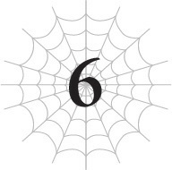
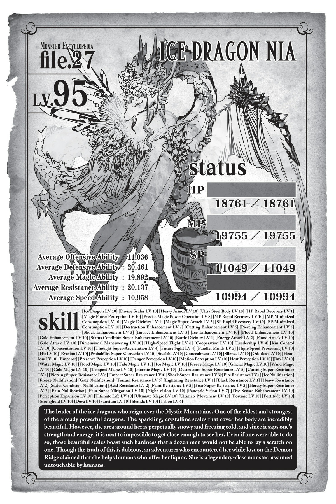

# Chương 6: Tôi bị lạc
*(I’M LOST)*

---

Tôi tỉnh dậy trong tiếng lửa nổ lách tách.

Chào buổi sáng.

“Ồ, chị tỉnh rồi à.”

Trong lúc tôi còn đang nằm đờ đẫn, Vampy đã nhận ra tôi.

Thế rồi tôi chợt nhớ lại mọi chuyện xảy ra trước khi mình ngất đi, và giờ thì tôi hoàn toàn tỉnh táo hẳn.

“Chị cảm thấy thế nào rồi? Có chỗ nào bất ổn không?”

Nghe vậy, tôi liền kiểm tra tình trạng cơ thể mình một chút. Không thấy có chỗ nào bất ổn cả.

Tôi nhớ mang máng là cánh tay bị Sael tóm lúc trước như thể đã gãy vụn ra thành trăm mảnh, nhưng giờ nó lại hoàn toàn bình thường.

Chắc là nhóc ma cà rồng đã trị liệu cho tôi trong lúc tôi bất tỉnh.

Tôi gật đầu ra hiệu rằng mình không sao.

“Vậy thì tốt rồi.”

Câu trả lời của con bé rất ngắn gọn, nhưng tôi có thể nhận ra con bé đã thở phào nhẹ nhõm.

Vì con bé đã cứu tôi, nên tôi lấy hết can đảm để cảm ơn.

“Cảm ơn.”

Tôi tuy không phải là kẻ hay nói chuyện, nhưng ít nhất tôi vẫn có đủ lịch sự để bày tỏ lòng biết ơn trong những lúc thế này.

“K-Không có gì to tát đâu, được chưa!”

Ồ. Cái phản ứng gì thế kia?

Tôi cứ tưởng con bé phải đóng vai một kẻ bám đuôi cuồng loạn cơ chứ, sao giờ trông cứ như một cô nàng cực kỳ nhút nhát thế này.

Mà thôi, sao cũng được.

Dù sao thì tôi cũng không phải tỉnh dậy ở thiên đường, nên xem ra tôi vẫn còn sống nhăn răng. Thật nhẹ cả người.

Tôi từ từ ngồi dậy và nhìn quanh.

Đập vào mắt tôi chỉ toàn là những bức tường băng.

Chắc là nhóc ma cà rồng đã dùng [Băng ma pháp] để tạo ra một căn lều tuyết cho cả lũ trú ẩn rồi.

Ở chính giữa lều tuyết có một đốm lửa nhỏ đang cháy, và Vampy, Mera cùng Sael đang ngồi vây quanh nó.

“Giờ cô Bạch đã tỉnh rồi, chúng ta nên làm gì tiếp theo đây ạ?” Mera hỏi, nhìn về phía nhóc ma cà rồng.

“Dĩ nhiên là đi hội quân với cô Ariel và những người khác rồi.” Con bé đáp lại không chút do dự. “Nhưng nếu tự ý chạy lung tung đi tìm cô ấy thì ngốc lắm. Kể từ khi bị trận lở tuyết cuốn đi, chúng ta còn chẳng biết mình đang ở đâu nữa. Phương án tốt nhất lúc này là phát tín hiệu báo vị trí của mình để cô Ariel tự tìm đến chúng ta.”

Tất nhiên rồi. Đó là quy tắc đầu tiên khi bị lạc.

Đứng yên tại chỗ.

Nếu không, bạn sẽ chỉ càng lạc sâu hơn, và những người cứu hộ cũng sẽ khó tìm thấy bạn hơn.

May mắn là ma pháp của Vampy có thể tạo ra một căn cứ trú ẩn cùng với lửa sưởi ấm.

Nó giúp giảm bớt phần nào cái lạnh cắt da cắt thịt, và chúng tôi có thể dùng lửa để nung chảy tuyết lấy nước uống.

Đồ ăn là một vấn đề lớn hơn, nhưng chúng tôi chỉ còn biết tin tưởng rằng Ma Vương sẽ sớm tìm ra chúng tôi mà thôi.

Dẫu sao thì, đó là nội dung chính cuộc trò chuyện của cặp đôi ma cà rồng.

Sael và tôi chỉ ngồi im lắng nghe.

Chứ chúng tôi còn làm được gì khác nữa đâu?

Tôi thì vô dụng trong chiến đấu, còn Sael thì vẫn là Sael thôi.

“Nếu tình hình tồi tệ nhất xảy ra, có lẽ chúng ta có thể ăn thứ này chăng?”

Vampy giơ lên... một con khỉ.

A, chính là con khỉ đã bám chặt lấy con bé lúc trước.

Khoan đã, con khỉ đó chết thẳng cẳng rồi còn đâu!

Thế chẳng phải đồng nghĩa với việc đồng bọn của nó sẽ kéo đến tìm chúng tôi để báo thù sao?!

“Chà, nếu chuyện đó xảy ra... thì chị biết rồi đấy.”

Như thể cảm nhận được nỗi lo lắng của tôi, Vampy liếc mắt nhìn sang Sael đầy ẩn ý.

Mọi ánh mắt trong lều tuyết lập tức đổ dồn về phía cô nhện rối.

Ừ, hợp lý đấy.

Con bé là chiến lực mạnh nhất trong nhóm này, nên nếu có chuyện gì xảy ra, chúng tôi đành phải trông cậy vào con bé thôi.

Dù bị mọi người nhìn chằm chằm, biểu cảm của Sael vẫn không hề thay đổi, nhưng con bé chắc chắn đang tỏa ra một bầu không khí kiểu: *Em á? Thật luôn hả?!*

Ừm, liệu chúng tôi có ổn không đây?

Với cái tính cách đó của Sael ấy?

Không sao đâu, ổn cả thôi mà.

Tôi chắc chắn thế. Có lẽ vậy. Chắc thế.

“Vậy thì tôi sẽ phát tín hiệu. Nếu tôi triển khai một phép thuật hướng lên trời, tôi tin chắc cô Ariel sẽ nhìn thấy.”

“Tuyệt vời. Cảm ơn anh nhé.”

Mera bước ra khỏi lều tuyết.

Nhân tiện thì, cái lều tuyết này không hề có cửa ra vào hay lối thoát hiểm nào cả.

Nếu muốn ra ngoài, bạn bắt buộc phải dùng [Băng ma pháp] để khoét một lối đi.

Ngay khi Mera làm thế, lý do đằng sau thiết kế phiền phức này lập tức được phơi bày rõ mưu đồ.

Áaaa!

Cái quái gì thế này?!

Lạnh quá đi mấttt!

Mera nhanh chóng bắn một phép thuật lên trời rồi vội vã thụt đầu vào trong, đóng chặt lối vào lại.

Điên rồ thật sự.

Bên ngoài lạnh kinh khủng khiếp. Nếu cứ để mở lối ra vào như thế, chắc chắn chúng tôi sẽ bị đông cứng đến chết mất.

Tôi nghĩ có muốn rời khỏi đây lúc này cũng không thể.

Vampy và mọi người thì còn trụ được, chứ tôi thì chịu.

Không đời nào. Nếu mò ra ngoài đó, tôi chắc chắn sẽ tiêu đời nhà ma.

Vũ khí chống lạnh duy nhất của tôi là chiếc chăn sưởi vốn đã bị đông cứng từ trước khi thất lạc trong trận lở tuyết.

Có vẻ như tôi cũng đã đánh rơi toàn bộ số ma thạch tỏa nhiệt của mình trong lúc hỗn loạn luôn rồi.

Nói cách khác, tôi hoàn toàn không còn chút phòng bị nào.

Về mặt lý thuyết thì quần áo của tôi cũng có khả năng chống lạnh đôi chút, nhưng thứ đó chẳng là gì trước vùng hoang mạc băng giá kinh hoàng này.

Thế nên lựa chọn duy nhất của chúng tôi là ngồi chờ Ma Vương và những người khác chạy đến giải cứu.

Vẫn còn chăn dự phòng và ma thạch trên cỗ xe ngựa, nên sau đó tôi chắc chắn sẽ ổn thôi.

Vì không có việc gì khác để làm, chúng tôi cùng sưởi ấm quanh đống lửa.

Vampy đang chọc chọc vào con khỉ chết, ngửi ngửi vết máu quanh miệng nó này nọ.

Con biết thứ đó có vị kinh tởm lắm đúng không hả? Tin tôi đi, tôi có kinh nghiệm xương máu vụ này rồi.

Sau khi tiến hóa thành arachne, tôi đã xác nhận được rằng nửa thân nhện và nửa thân người của mình có vị giác hoàn toàn khác nhau.

Nửa thân nhện có thể ăn đủ thứ kỳ dị mà không gặp vấn đề gì lớn, nhưng đối với nửa thân người, có những thứ kinh tởm đến mức không thể nào nuốt trôi nổi.

Thế nên nếu con khỉ đó có vị kinh tởm đối với cơ thể nhện của tôi, thì bạn hãy tin chắc rằng nó sẽ cực kỳ kinh tởm đối với một con người.

Tôi đã ăn cả đống khỉ như vậy khi còn là một con nhện, và tôi ghét cay ghét đắng từng miếng một.

Không đời nào một con người có thể nuốt trôi thứ đó nổi.

Tôi nhẹ nhàng nắm lấy tay nhóc ma cà rồng và kéo ra xa khỏi con khỉ.

Khi con bé nhìn tôi đầy bối rối, tôi chỉ khẽ lắc đầu.

*Không ăn được đâu.*

Thông điệp của tôi có vẻ đã truyền tải thành công. Con bé chun mũi lại rồi buông con khỉ ra.

Tôi không thể không để ý thấy một vẻ mặt nhẹ nhõm lướt qua trên khuôn mặt của Mera.

Ừ, anh cũng không muốn ăn thứ đó chút nào đúng không, anh bạn?

Có lẽ anh ta chỉ nghĩ rằng trong hoàn cảnh tuyệt vọng thì phải dùng biện pháp cực đoan, đó là lý do tại sao anh ta không ngăn Vampy lại.

Dù là người hầu, nhưng anh ta vẫn có thể đưa ra lời cảnh báo cho chủ nhân của mình khi thấy cô bé sắp phạm sai lầm.

Tôi đoán là trong suốt cuộc hành trình của chúng tôi, con bé đã quá quen với việc ăn thịt quái vật nên đã xem con khỉ này như một nguồn thức ăn khả thi, mặc dù rõ ràng là nó có vị kinh tởm đến mức nào.

Tôi không biết nên ấn tượng trước sự dẻo dai của con bé hay lại tiếp tục kinh hoàng trước sự thiếu nữ tính của nó nữa.

Ý tôi là, bạn nhìn mặt Mera mà xem?

Khuôn mặt anh ta cứ như đang hét lên: *Tiểu thư ơi, không đời nào chúng ta có thể ăn thứ đó đâu ạ!*

Vampy tuy ngày càng mạnh mẽ và dễ thích nghi hơn, nhưng bản năng thiếu nữ của con bé đã tụt dốc thảm hại.

Hừm. Ôi trời, chúc nhóc may mắn trên con đường tình duyên nhé.

Trong lúc tôi đang nhìn nhóc ma cà rồng với ánh mắt ái ngại, tay tôi vô tình chạm xuống mặt đất — và một cơn rùng mình chạy dọc sống lưng.

Có thứ gì đó đã chạm vào tay tôi khi tôi đặt nó xuống đất.

Đó là một chiếc lưỡi hái màu trắng khổng lồ.

Vũ khí cá nhân mà tôi tự chế tạo từ chính cơ thể mình.

Bạn thậm chí có thể nói rằng nó là nửa kia của tôi.

Tôi cứ tưởng nó vẫn đang ở trên cỗ xe ngựa, thế mà không hiểu sao, giờ nó lại nằm ở đây.

Khi tôi hấp thụ toàn bộ năng lượng từ quả bom đó và thần hóa, một mình cơ thể tôi không thể chứa hết nguồn sức mạnh khổng lồ ấy, nên một phần năng lượng đã tràn vào chiếc lưỡi hái này. Kết quả là, nó đã sở hữu không ít sức mạnh thần bí.

Ngay cả trước khi tôi tiến hóa, khả năng của nó thường dựa trên các kỹ năng của chính tôi, nhưng việc nó hoạt động như thế nào và vào lúc nào lại thay đổi khá nhiều, thậm chí theo những cách mà chính tôi cũng không hoàn toàn hiểu được.

Chưa kể, nó còn tự động thực hiện những việc đó mà không cần tôi ra lệnh, cứ như thể nó có ý thức riêng vậy.

Giống hệt như những gì nó đang làm lúc này.

Nhưng nó không hành động ngẫu nhiên — luôn có một lý do nào đó.

Trong trường hợp này, nó có lẽ đã tự dịch chuyển đến chỗ tôi, nhưng điều đó có nghĩa là có một tác nhân nào đó đã kích hoạt chuyện này.

Phải có một lý do nào đó khiến tôi bắt buộc phải mang theo chiếc lưỡi hái bên mình ngay lúc này.

Ngay khoảnh khắc đó, tôi thậm chí còn không kịp suy nghĩ xem nên làm gì.

Một linh cảm nguy hiểm ập đến bao trùm lấy tôi, thế là tôi tin vào bản năng của mình, chộp lấy chiếc lưỡi hái và đứng bật dậy, chĩa nó ra phía trước phòng thủ.

Nhưng bằng cách nào đó, hành động đó đã cứu mạng tôi.

Với một tiếng *BÙM* chói tai, thế giới xung quanh tôi đột ngột thay đổi.

Tôi không biết chuyện gì đã xảy ra hay tại sao lại thế.

Tất cả những gì tôi cảm nhận được lúc này là sự đau đớn.

Đau quá.

Toàn thân tôi đau nhức nhối, đặc biệt là hai cánh tay.

Không chỉ vậy, tầm nhìn của tôi bị lấp đầy bởi tuyết trắng xóa.

Ngay khi tôi nhận ra mình đang nằm sấp mặt trên mặt đất, một cái lạnh buốt xương lập tức tấn công toàn bộ cơ thể tôi.

L-L-L-Lạnh quá đi mất!

Tôi chắc chắn mình đã bị văng ra ngoài lều tuyết rồi.

Tôi không biết mình đang làm gì ở ngoài này, nhưng tôi biết mông mình sắp đóng băng đến nơi rồi!`

Tôi phải quay lại bên trong ngay lập tức!

Nhưng khi ngồi dậy và nhìn xung quanh, tôi chẳng thấy căn lều tuyết đâu nữa.

Thay vào đó, tôi nhìn thấy hai khối băng lớn chắc chắn là tàn tích của căn lều tuyết.

Trông giống như những gì xảy ra khi bạn chém đôi chiếc mái vòm thẳng từ trên xuống chính giữa.

Trực giác của tôi mách bảo đó chính xác là những gì đã xảy ra.

Nhưng thay vì chú ý đến căn lều tuyết bị phá hủy, mắt tôi lại đổ dồn vào thứ đang đứng phía sau nó.

Một người ư?

Có một người đang ở đó.

Cụ thể là một gã đàn ông trông như thể đang khỏa thân một nửa giữa cái lạnh khủng khiếp này.

Thực ra là hơn một nửa mới đúng. Thứ duy nhất hắn đang mặc trên người là một mảnh vải rách nát để che đi những bộ phận nhạy cảm nhất.

Ngươi là tên biến thái nào thế hả?! Khoan đã, giờ không phải lúc tấu hài!

Nhưng nghiêm túc đấy, ừm, ngươi không thấy lạnh à?

Được rồi, giờ không phải lúc cho mấy phản ứng ngớ ngẩn như vậy, nhất là sau khi tôi nhìn rõ khuôn mặt của hắn.

Trông hắn hoàn toàn giống con người, ngoại trừ hai chiếc sừng mọc ra từ trán... nhưng đó không phải là lý do.

Chính khuôn mặt đó mới là thứ khiến tôi kinh ngạc.

Tôi biết khuôn mặt này.

“Sael! Lên đi!”

Trong lúc tôi còn đang đứng hình vì kinh ngạc, tôi nghe thấy tiếng hét của Vampy.

Ngay lập tức, Sael nhảy ra khỏi một trong hai mảnh vỡ của lều tuyết.

Nhóc ma cà rồng thò đầu ra khỏi mảnh vỡ còn lại, nhìn quanh dò xét.

May mắn là có vẻ họ đang ở trong phần an toàn của lều tuyết nên không bị thương.

Hửm? Thế nghĩa là tôi đã bị cuốn vào đòn tấn công phá hủy lều tuyết và bị thổi bay tuốt luốt ra tận đây sao?

Khi muộn màng nhận ra chuyện gì đã xảy ra với mình, mặt tôi cắt không còn một giọt máu.

Lý do duy nhất giúp tôi còn sống chắc chắn là nhờ đã thủ sẵn chiếc lưỡi hái phòng thủ.

Tôi tin chắc mình đã mất mạng nếu chiếc lưỡi hái không bảo vệ tôi.

Điều đó cũng giải thích tại sao hai cánh tay tôi lại đau đớn như vậy.

Chiếc lưỡi hái chắc chắn đã triển khai một loại rào chắn nào đó để giảm thiểu sát thương.

Nếu không, với thể trạng yếu ớt lúc này, tôi đời nào có thể sống sót nổi trước một đòn tấn công đủ sức thổi bay cả căn lều tuyết như thế.

Tấn công... Đúng vậy.

Chúng tôi chắc chắn đã bị tấn công.

Bởi ai ư? Chà, rõ ràng quá rồi còn gì.

Chỉ có duy nhất một người mới xuất hiện ở đây.

Gã đàn ông có sừng đằng kia.

Thế nên gã đàn ông có sừng đó chắc chắn là kẻ đã tấn công chúng tôi.

Thảo nào nhóc ma cà rồng lại ra lệnh cho Sael tấn công hắn.

Sael rút sáu cánh tay ẩn cùng vũ khí tương ứng của mình ra và lao thẳng về phía gã có sừng.

Với chỉ số siêu cao của mình, con bé tấn công nhanh đến mức một người bình thường như tôi lúc này hoàn toàn không thể theo kịp chuyển động.

Tôi biết con bé đã rút thêm tay và vũ khí chỉ vì tôi đã quá quen thuộc với các hành động của nó, chứ không phải vì mắt tôi nhìn thấy được.

Chuyện này cũng giống như việc ngay cả một người am hiểu về súng đạn cũng không thể nào nhìn thấy viên đạn bay bằng mắt thường vậy.

Vả lại, họ dĩ nhiên cũng không thể chặn đứng viên đạn đó.

Trước cả khi tôi kịp hét lên để ngăn con bé lại, Sael đã hoàn tất đòn tấn công của mình.

Hay đúng hơn là con bé đã kết thúc đòn đánh trước cả khi ý nghĩ ngăn cản kịp hình thành trong đầu tôi.

Đó là tốc độ khủng khiếp của con bé.

Và không một người bình thường nào có thể sống sót nổi trước đòn tấn công từ một con quái vật như Sael.

Nhưng bằng cách nào đó...

“Hả?”

Vampy kinh ngạc lẩm bẩm.

Gã đàn ông có sừng đã đỡ được đòn tấn công của Sael bằng thanh kiếm katana đang cầm trên hai tay.

Không thể tin nổi.

Làm sao hắn có thể tự vệ trước Sael như thế chứ?

Và như để chứng minh đó không phải là sự ngẫu nhiên, hắn liên tục đỡ gạt từng đòn đánh tiếp theo của Sael.

Dù trông có vẻ hắn không thể phản công, nhưng các đòn tấn công của Sael cũng hoàn toàn không thể chạm tới hắn.

Hai bên đang cân tài cân sức.

Tôi đoán gã có sừng này không phải là một kẻ tầm thường.

Thực ra, tôi nghĩ mình biết chính xác hắn là ai.

Đã nghe kể về hắn nhiều như thế rồi, nếu không nhận ra thì mới là lạ đấy.

Con quỷ. Kẻ đã quét sạch toàn bộ mạo hiểm giả ở thị trấn kia, bị quân đội đế quốc truy quét, và gây ra thời tiết quái dị này bằng cách khiêu chiến với lũ băng long.

Trông hắn thực sự giống con người hơn là quỷ, nhưng vì trên đầu có sừng nên chắc chắn là hắn rồi.

Có vẻ hắn đã trải qua một đợt tiến hóa đặc biệt từ chủng quỷ hoặc tương tự.

Dẫu sao thì, tạm thời chúng ta cứ gọi hắn là cậu Oni đi.

Và nếu phán đoán của tôi chính xác, cậu Oni có lẽ chính là —

“Merazophis!”

Tiếng hét thất thanh của Vampy cắt ngang dòng suy nghĩ của tôi.

Ự, tai tôi rung lên bần bật rồi này!

Quay đầu về phía phát ra tiếng hét, tôi thấy Mera trông có vẻ rất đau đớn và nhóc ma cà rồng đang hốt hoảng chạy lại chỗ anh ta.

Nghĩ lại thì, Mera đang ngồi đối diện tôi trong căn lều tuyết bị chém làm đôi.

Nếu đòn tấn công đó thổi bay tôi, thì nó chắc chắn cũng đã thổi bay Mera.

Nhưng trong khi tôi có chiếc lưỡi hái bảo vệ, Mera lại chẳng có thứ gì để giảm bớt lực phản chấn.

“Tôi vô cùng xin lỗi. Tôi đã quá sơ suất.”

Ừm, thôi nào.

Làm sao anh có thể đề phòng trước một đòn tấn công bất ngờ hoàn toàn như thế được chứ?

Tôi thấy không hợp lý chút nào, nhưng với tính cách nghiêm túc của Mera, anh ta có lẽ đang cảm thấy xấu hổ vì đã trở thành nạn nhân của một cú đánh lén hoàn toàn không lường trước.

Chắc anh ta nghĩ bằng cách nào đó mình đáng lẽ phải nhận ra sớm hơn.

“Không sao đâu. Để em trị liệu vết thương cho anh.”

Nhóc ma cà rồng bắt đầu triển khai [Ma pháp Trị liệu] lên người Mera.

Này, xin chàooo? Không phải chỉ có mỗi anh ta bị thương đâu nhé.

Định lờ tôi đi luôn hả?

Tôi hiểu rồi nhé...

Không còn cách nào khác, tôi đành dùng chiếc lưỡi hái làm gậy để chống đỡ cơ thể gượng đứng dậy.

Toàn thân tôi đau nhức, có lẽ là do lực chấn động từ đòn tấn công ban đầu.

Hai cánh tay đau buốt như muốn rụng ra. Có khi tôi đã gãy vài khúc xương rồi cũng nên.

Và trên hết cả đống đau đớn đó, cái lạnh thấu xương lại càng làm nó tệ hơn gấp mười lần.

Hừm, tình hình này không ổn chút nào.

Tôi tuy sẽ không chết ngay lập tức, nhưng nếu tình trạng này kéo dài quá lâu, tôi sẽ gặp rắc rối lớn đấy.

Tôi có thể sẽ chết cóng trong vòng chưa đầy một tiếng nữa.

Chết tiệt. Chúng tôi phải nhanh chóng giải quyết vấn đề này và tạo ra một căn lều tuyết mới để trú ẩn.

Nhưng làm thế nào để giải quyết vấn đề này đây?

Tôi nhìn về phía cậu Oni, kẻ vẫn đang kịch chiến với Sael.

Hắn quả thực rất đáng kinh ngạc khi có thể chống đỡ được đến mức này, nhưng tôi nghĩ cuối cùng Sael vẫn sẽ là người chiến thắng.

Sael trông có vẻ vẫn còn rất nhiều năng lượng dự trữ so với hắn.

Chỉ số của Sael đều vượt mức mười ngàn, con bé sử dụng sáu thanh kiếm, có thể di chuyển chúng theo những cách thông thường không thể làm được vì là rối cơ khí, và thậm chí còn có cả [Độc ma pháp] và [Hắc ám Ma pháp] như bất kỳ con quái vật nhện cừ khôi nào.

Giữa các chỉ số cao, sức mạnh vững chắc và chiến thuật lắt léo, lũ nhện rối thực sự là những đối thủ vô cùng khó chịu, đặc biệt là nếu bạn chưa từng chạm trán chúng trước đây.

Cho đến nay, chúng chủ yếu chỉ đối đầu với những kẻ địch yếu đến mức có thể kết liễu trong một đòn, hoặc những kẻ địch cực mạnh như chiếc xe tăng của hai năm trước mà chúng hoàn toàn không thể phản kháng, nên lũ nhện rối chưa có nhiều cơ hội để thể hiện hết kỹ năng của mình, nhưng chúng thực sự là những kẻ đa tài.

Chúng sở hữu năng lực của loài quái vật nhện, và vì điều khiển những con rối hình người, chúng cũng có thể bắt chước các chuyển động của con người.

Chưa kể, những con rối đó có thể chuyển động theo những cách con người không thể, và chúng cũng chẳng cần lo lắng về việc bị thương.

Thành thật mà nói, chỉ cần chỉ số ngang ngửa nhau, lũ nhện rối có thể đánh bại hầu như bất kỳ ai.

Chúng là những đồng minh cực kỳ vô giá.

...Dù cho thỉnh thoảng rất dễ quên mất điều đó vì phần lớn thời gian trông chúng rất vô dụng.

Dẫu sao thì, nếu trận chiến cứ tiếp tục thế này, tôi cá là Sael sẽ thắng.

Đã lâu lắm rồi con bé mới phải đối đầu với một đối thủ ngang tài ngang sức nên trông nó có vẻ đang hơi hoảng loạn và chưa thể sử dụng hết khả năng của mình, nhưng tôi tin chắc đó chỉ là do tôi tưởng tượng ra thôi.

Ừm, cứ cho là vậy đi.

Một khi Sael bình tĩnh lại, cục diện chắc chắn sẽ càng nghiêng về phía con bé.

Nhưng liệu chúng tôi có thực sự nên để chuyện đó xảy ra không?

Ý tôi là, cậu Oni này trông chắc chắn giống như —

“Ngươi được lắm.”

Lại cắt ngang dòng suy nghĩ của tôi, Vampy từ từ đứng dậy.

Bạn gần như có thể cảm nhận được cơn giận dữ đang tỏa ra cuồn cuộn từ cơ thể con bé vì vết thương của Mera yêu quý.

Tôi nghĩ mình thực sự nhìn thấy một luồng sát khí màu đen bao quanh con bé luôn rồi.

Ừm, xin chàooo? Chữa trị cho Mera xong rồi mà em vẫn định lờ chị đi luôn đấy hả?

Tôi tuy đã cố đứng lên được bằng cách nào đó, nhưng tình trạng của tôi vẫn rất tồi tệ đấy nhé.

Hóa ra em hoàn toàn không nhận ra sự hiện diện của chị luôn sao? Tôi hiểu rồi...

Nhưng thế thì hơi phiền phức đây.

Tôi phải ngăn nhóc ma cà rồng lao vào kịch chiến với cậu Oni, thế là tôi bắt đầu bước đi loạng choạng về phía con bé.

“Cô Bạch!”

Mera, thật tử tế, là người nhận ra tôi đầu tiên.

Anh ta đứng dậy, cơ thể đã được chữa lành nhờ ma pháp của nhóc ma cà rồng cùng khả năng tự hồi phục tự động của chính mình.

Quần áo của anh ta bị rách tả tơi sau đòn tấn công, trông vô cùng phong trần và gợi cảm, cứ như trang bìa của một cuốn tiểu thuyết ngôn tình vậy.

Cộng cả anh ta và cậu Oni, giờ là hai gã đàn ông ăn mặc vô cùng thiếu vải giữa trời đông giá rét này rồi.

“A.”

Nhóc ma cà rồng đờ người ra nhìn tôi.

*Cái gì mà "A" hả?!*

Em quên béng mất chị rồi đúng không? Em hoàn toàn quên mất sự tồn tại của chị luôn rồi!

“Ôi trời đất ơi! Chúng ta phải chữa trị cho chị ngay lập tức thôi!”

Sau một thoáng lộ vẻ mặt kiểu *Chết dở!*, Vampy vội vàng chuyển sang nét mặt hoảng hốt rồi chạy bổ về phía tôi.

Ừm, tôi chắc là em đang hoảng hốt thật đấy, nhưng chẳng phải một nửa lý do là vì em đã quên mất tôi trong giây lát đó sao?

Trong lúc con bé bắt đầu thi pháp trị liệu có chút lóng ngóng, tôi không kìm được mà lườm con bé một cái nhẹ.

Nhưng giờ không phải lúc cho mấy suy nghĩ nhỏ nhen đó.

“Nhìn kìa.”

Trong lúc Vampy trị liệu cho mình, tôi chỉ tay về phía cậu Oni đang kịch chiến với Sael.

Tôi biết chỉ tay vào người khác là bất lịch sự, nhưng lúc này tôi không rảnh để bận tâm chuyện đó.

“Ồ đúng rồi. Đó chắc chắn là con quỷ mà chúng ta nghe kể rất nhiều gần đây. Trông chúng giống con người hơn em tưởng đấy chứ?”

Không, cái đó tôi biết rồi.

Nhưng đó không phải là điều tôi đang muốn nói lúc này.

Khoan đã, chẳng lẽ con bé không nhận ra sao?

Tôi không còn cách nào khác ngoài việc nói thẳng ra điều đang khiến mình bận tâm.

“Sasajima.”

Khuôn mặt của cậu Oni này trông rất quen thuộc với tôi.

Nhưng đó không phải là gương mặt tôi từng thấy ở thế giới này.

Khuôn mặt của cậu ta nằm trong số những ký ức của Wakaba Hiiro.

Cùng với cái tên Sasajima Kyouya, một nam sinh trung học Nhật Bản.

“Cái gì cơ?”

Hóa ra tôi đoán đúng: Con bé không hề nhận ra. Nhóc ma cà rồng nhìn tôi như thể nhìn một kẻ điên.

Thế là tôi đành phải chỉ tay vào cậu Oni lần nữa và đọc to tên cậu ta lên.

“Sasajima Kyouya.”

“GRAAAAAAH!”

Có vẻ cái tên đó đã kích động hắn.

Tiếng gầm của cậu Oni vang dội khắp khu vực.

Đó là một âm thanh phi nhân loại, tiếng tru tréo của loài quỷ dữ.

Giật mình trước âm thanh đột ngột đó, Sael đứng hình mất một giây.

Và cậu Oni không một chút do dự vung thanh kiếm trên tay phải xuống.

Thanh kiếm được bao bọc trong ngọn lửa rực cháy, rõ ràng khác biệt hoàn toàn với những đòn tấn công trước đó của hắn.

Sael nhanh chóng định thần lại rồi nhảy lùi về phía sau, né tránh đòn đánh trong gang tấc.

Chém vào không khí, đòn đánh của cậu Oni thay vào đó nện thẳng xuống mặt đất.

Và thế rồi, một tiếng nứt vỡ đinh tai nhức óc vang rền cả bầu không khí!

Lửa bùng lên lan tỏa từ điểm va chạm, kèm theo một làn sóng xung kích dữ dội.

Ngọn lửa nung chảy băng giá, và làn sóng xung kích làm vỡ nát cả mặt đất!

Dựa vào việc cậu Oni có thể cân tài cân sức với Sael, tôi đã đoán được chỉ số của hắn phải quanh mức mười ngàn.

Bởi vì Địa Long Araba chỉ với chỉ số khoảng bốn ngàn đã có thể dùng ma pháp tạo ra các cột đá khổng lồ ngay lập tức, bạn có thể thấy rằng chỉ số cao về cơ bản sẽ ban cho khả năng tạo ra thiên tai theo ý muốn.

Thế nên với chỉ số trên mười ngàn, chỉ một cú nện xuống đất cũng có thể chia đôi mặt đất theo đúng nghĩa đen.

Nhưng hậu quả của sự nứt vỡ đó còn khủng khiếp hơn nhiều so với những gì tôi tưởng tượng.

Những kẽ nứt khổng lồ bắt đầu lan rộng ra từ thanh kiếm đang cắm trên mặt đất.

Chúng sâu đến mức tôi thậm chí còn không thể nhìn thấy đáy.

Và khi nhìn vào mặt cắt của những vết nứt đó, tôi đã hiểu ra nguyên nhân của mức độ hủy diệt ngoài dự kiến này.

Tôi cứ tưởng đây là nền đất bình thường, nhưng hóa ra không phải.

Nó thực chất được tạo nên từ một lớp băng dày cộm.

Nói cách khác, chúng tôi đang đứng trên một sông băng.

Đòn tấn công thuộc tính hỏa của cậu Oni đã làm vỡ sông băng, tạo ra một khe nứt sâu hoắm khổng lồ.

May mắn là cặp đôi ma cà rồng và tôi vẫn đang đứng trên nền băng vững chắc.

Nhưng Sael thì bắt đầu bị nuốt chửng vào trong.

Dĩ nhiên, Sael có kỹ năng [Cơ động Chiều không gian], nên con bé vẫn có thể xử lý việc đột ngột bị lơ lửng trên không.

Nhưng đó là với điều kiện không có ai tấn công con bé.

“Sael!”

Vampy hét lên cảnh báo, nhưng đã muộn mất một nhịp. Cậu Oni tung ra một đòn tấn công trực diện vào Sael ngay giữa không trung.

Hắn đang sử dụng thanh katana còn lại, chứ không phải thanh kiếm bên tay phải đã làm vỡ sông băng.

Thanh kiếm phóng ra những tia chớp sét đánh trúng mục tiêu trực diện vào Sael!

Sau khi ánh sáng chói lòa và tiếng nổ đanh tai biến mất, Sael đã hoàn toàn biến mất dạng.

Con bé chắc chắn đã bị rơi xuống khe nứt.

Tôi không nghĩ con bé đã chết. Nếu là một kẻ địch sở hữu đòn tấn công có thể xuyên thủng kháng tính như chiếc xe tăng kia thì lại là chuyện khác, chứ đây rõ ràng chỉ là thuộc tính sét.

Sael có [Kháng Lôi], và chỉ số kháng ma pháp của con bé cũng vượt mức mười ngàn.

Con bé sẽ không chết dễ dàng như thế đâu.

Nhưng chắc chắn con bé cũng không thể lành lặn vô sự, và chúng tôi còn chẳng biết khe nứt đó sâu đến mức nào, nên không thể biết được sẽ mất bao lâu để con bé có thể leo trở lại lên đây.

Đồng minh mạnh nhất của chúng tôi đã tạm thời mất đi khả năng chiến đấu.

“GRAAAAAH!”

Và thế rồi cậu Oni bắt đầu lao thẳng về phía chúng tôi với sát khí đằng đằng không chút thiện chí.

Chúng tôi thực sự gặp rắc rối lớn rồi đây.

---

[◀ Chương trước: Chương O5: Quỷ và Băng Long](o5_the_ogre_and_the_ice_dragon.md) | [Chương tiếp theo: Đoạn phụ: Ghi chép của Nhà triệu hồi Buirimus ▶](interlude_the_notes_of_buirimus_the_summoner.md)
