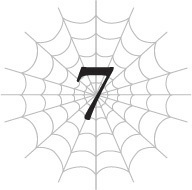
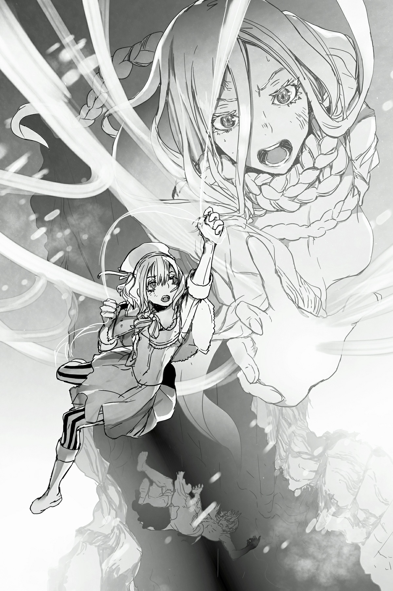

# Chương 7: Tôi rơi vào thế bí
*(I’M IN A BIND)*

---

Cậu Oni vừa gầm rú vừa lao thẳng về phía chúng tôi.

Chỉ có nhóc ma cà rồng, Mera và tôi.

Nhưng bây giờ tôi đã là người thường rồi, nên thậm chí còn chẳng được tính là một chiến lực nữa.

Tôi đoán nhóc ma cà rồng có lẽ là người mạnh nhất trong ba chúng tôi, nhưng ngay cả con bé cũng không mạnh bằng Sael hay những con nhện rối khác.

Và vì cậu Oni là đối thủ ngang tài ngang sức với Sael, tôi nghi ngờ việc cô bé ma cà rồng của chúng tôi có thể đối đầu nổi với hắn.

Vậy thì bây giờ tôi nên làm gì đây?

Quá rõ ràng rồi còn gì nữa. Chạyyyyy!

Tôi quay lưng lại với cậu Oni đang lao tới và cắm đầu chạy trốn giữ mạng.

Trước đó Vampy đã dùng chút [Ma pháp Trị liệu] cho tôi, nên dù chưa hồi phục hoàn toàn, tôi vẫn có thể cố mà chạy.

Dù sao thì cũng chỉ chạy được chừng nào cái thể lực cùi bắp này còn chịu đựng được thôi!

Nhưng thế vẫn tốt hơn là đứng yên một chỗ chịu chết!

Mà không phải tôi bỏ chạy vì ích kỷ chỉ biết nghĩ cho bản thân đâu nhé, được chưa?

Nói thẳng ra thì lúc này tôi chẳng khác nào một gánh nặng trong trận chiến cả.

Bên cạnh việc hoàn toàn không có sức mạnh, chỉ số phòng thủ của tôi cũng thấp đến mức đáng báo động, nên chỉ cần bị cuốn vào giữa trận chiến thôi là tôi cũng dư sức bay màu rồi.

Thế nên cặp đôi ma cà rồng sẽ không thể chiến đấu hết sức nếu họ cứ phải lo lắng cho tôi ở gần bên.

Nghe này, nếu có thể giúp ích được chút gì, tôi đã ở lại chiến đấu cùng họ rồi!

Nhưng thực tế là thế này: tôi không chỉ vô dụng mà còn thực sự khiến mọi chuyện trở nên khó khăn hơn cho họ.

Tốt nhất là tôi nên vắt chân lên cổ mà chạy để không cản trở nhóc ma cà rồng và Mera.

Vì vậy, không, tôi không phải chỉ chạy trốn để tự cứu lấy cái mạng nhỏ của mình đâu.

Tôi hết cách rồi! Hiểu chưa?!

Phía sau tôi vang lên một tiếng nổ lớn gầm vang.

Tôi đoán trận chiến đã bắt đầu rồi.

Và nó lại ở quáááá gần tôi nữa chứ!

Tôi thực sự có thể cảm nhận được không khí đang rung chuyển dữ dội ngay sát phía sau mình.

Kiểu, cực kỳ gần luôn ấy.

Ừ, tôi đoán với thể trạng thảm hại của mình thì dù có chạy hết tốc lực cũng chẳng đi được bao xa.

Chưa kể, chúng ta đang nói về một con quái vật có chỉ số chắc phải tầm mười ngàn, di chuyển nhanh đến mức mắt thường không thể theo kịp.

Ngay từ đầu việc nghĩ mình có thể chạy thoát đã là quá ngu ngốc rồi.

Tôi có thể nghe thấy đủ loại âm thanh chiến đấu điên rồ ngay sau lưng, kiểu như *BÙM!* rồi *RẦM!*

Khoan đã, tạm dừng chút đi!

Ít nhất cũng phải đợi tôi chạy đến một khoảng cách an toàn rồi mới đánh chứ hả?!

Tôi đang nghiêm túc lắm đấy nhé!

Nhưng rồi điều ước của tôi cũng được thực hiện, theo một cách nào đó: làn sóng xung kích từ một trong những đòn tấn công đã dội thẳng vào người tôi, thổi bay tôi lăn lộn ra xa.

Phù. Chắc là tôi được ông trời ban phước lành để bù đắp cho việc lúc nào cũng sống tốt đây mà!

Thôi thì cứ bỏ qua cái thực tế trông tôi lúc đó vô cùng ngớ ngẩn đi, hoặc là chuyện nếu lăn thêm chút nữa là tôi đã rơi thẳng xuống một khe nứt sâu hoắm không thấy đáy rồi.

Úi chà, suýt soát thật đấy!

Tôi đứng dậy và từ từ dịch ra xa, cẩn thận không để bị ngã xuống.

Nếu tôi hoảng loạn cắm đầu chạy trốn, chắc chắn lớp băng dưới chân sẽ nứt ra và tôi sẽ rơi xuống đó cho xem.

Ngay lúc này, tôi đã bắt đầu nghe thấy vài tiếng nứt vỡ đáng ngại rồi, nên tôi phải cực kỳ cẩn thận khi di chuyển giãn khoảng cách ra.

Cuối cùng, tôi cũng đã ra đủ xa khỏi khe nứt sông băng và đảm bảo mình không ở quá gần bãi chiến trường. Hiện tại thế này là an toàn rồi.

Một trận chiến tầm cỡ đó có thể dễ dàng dịch chuyển cả dặm theo bất kỳ hướng nào, nên khoảng cách này cũng chẳng giúp được bao nhiêu, nhưng có còn hơn không.

Lý tưởng nhất là tôi nên tiếp tục di chuyển để ra xa hơn nữa, nhưng... xin lỗi nhé, tôi mệt đứt hơi rồi.

Tôi đang thở hồng hộc, và hai vai thì phập phồng liên tục.

Không chịu nổi nữa rồi. Tôi không thể di chuyển thêm một bước nào nữa.

Chưa kể không khí lạnh buốt đến mức mỗi lần hít thở là lồng ngực lại đau nhói.

Ai cũng nghĩ chạy hết tốc lực sẽ giúp người ấm lên, nhưng nó chỉ làm tôi lạnh thêm thôi.

Đúng vậy. Cậu Oni không phải là mối lo ngại duy nhất ở đây.

Cái lạnh thấu xương này cũng đáng sợ không kém.

Nếu cứ ở ngoài trời lạnh thế này lâu hơn, chẳng mấy chốc tôi sẽ biến thành một bức tượng băng mất.

Tôi phải làm gì đó, và thật nhanh lên mới được.

Nhưng cách tốt nhất để đối phó với cậu Oni là chờ Sael quay trở lại.

Dù có hợp lực đi chăng nữa, tôi cũng không nghĩ cặp đôi ma cà rồng có thể đánh bại cậu Oni này, nên tốt nhất là họ chỉ nên cố gắng câu giờ.

Chúng tôi phải khẩn trương lên kẻo tôi chết cóng mất, nhưng chúng tôi lại phải câu giờ để đánh bại cậu Oni. Đúng là tiến thoái lưỡng nan.

Mà khoan, tại sao cậu Oni lại tấn công chúng tôi chứ?

“GRAAAAAH!”

Ồ phải rồi. Theo như tôi thấy thì đầu óc hắn đã hoàn toàn mất trí rồi.

Có vẻ như lúc này hắn chỉ đơn giản là tấn công bất cứ thứ gì trong tầm mắt.

Ý tôi là, lúc đầu hắn tấn công chúng tôi khi cả lũ đang trốn trong lều tuyết, nên rõ ràng hắn còn chẳng biết chúng tôi là ai trước khi ra tay.

Chắc là hắn nhìn thấy tín hiệu mà Mera bắn lên trời, đoán là có người ở đây, thế là mò tới tấn công mà chẳng có lý do nào khác?

Có lẽ tốt nhất là cứ xem hắn như một con thú hoang trong hình hài con người vào lúc này đi. Dù rằng ngay cả thú hoang đôi khi cũng biết chọn đối thủ mà đánh.

Hừm.

Tình trạng hiện tại của cậu Oni có vẻ quen thuộc thế nào ấy.

Mất đi lý trí.

Nhưng lại có chỉ số cao đến mức đủ sức đọ sức ngang ngửa với Sael.

Chẳng lẽ đây là kỹ năng [Phẫn Nộ]?

Dòng kỹ năng liên quan đến [Phẫn Nộ], chẳng hạn như [Nổi Giận] và [Cuồng Nộ], giúp gia tăng các chỉ số của bạn. Và không giống như Ma pháp hay [Ý chí chiến đấu], nó thậm chí còn chẳng tiêu tốn SP hay MP.

Nghe có vẻ tuyệt vời đúng không? Nhưng đời không như là mơ.

Như người ta vẫn thường nói, trên đời này không có bữa trưa nào miễn phí cả. [Phẫn Nộ] trông thì có vẻ không tốn kém gì, nhưng thực chất cái giá phải trả lại cực kỳ đắt đỏ.

Đó là việc đánh mất lý trí.

Khi kích hoạt kỹ năng dòng Phẫn nộ, nó sẽ khiến đầu óc bạn phát điên lên vì giận dữ, ép bạn phải đi lệch khỏi quỹ đạo thông thường.

Thế rồi bạn sẽ buông xuôi trước cơn giận dữ và bắt đầu cuồng loạn tàn sát, nhưng điều đáng sợ nhất là nếu không chủ động dùng ý chí của mình để tắt kỹ năng đó đi, bạn sẽ chỉ tiếp tục tàn phá mãi mãi.

Và bạn càng duy trì kích hoạt kỹ năng đó lâu bao nhiêu, cơn giận dữ sẽ càng gặm nhấm đầu óc bạn bấy nhiêu.

Khi đã đánh mất bản thân vào cơn điên loạn, bạn rốt cuộc sẽ mất luôn cả nhận thức để tắt kỹ năng đó đi.

Đến cuối cùng, bạn sẽ trở thành một kẻ điên cuồng mất trí, lao vào tấn công bất phân biệt mọi thứ và mọi người xung quanh.

Điều này hoàn toàn trùng khớp với tình trạng hiện tại của cậu Oni.

Đây chỉ là phỏng đoán dựa trên suy luận logic, nhưng tôi cá mười ăn một là mình đúng.

Ái chà, giá mà tôi có thể dùng [Thẩm định] thì đã chứng minh được giả thuyết của mình là đúng rồi!

Ồ, nhắc mới nhớ, hình như Vampy đã học [Thẩm định] rồi.

Chính tôi là người đã gợi ý cho con bé học nó mà.

Nhưng lúc này tôi không có thời gian để nói với con bé chuyện đó.

Và tôi cũng tuyệt đối không muốn thò mũi vào cuộc đối đầu điên cuồng đằng kia đâu.

“Hự!”

Ngay lúc đó, nhóc ma cà rồng kêu lên một tiếng nhỏ đáng yêu khi con bé bị thổi bay rồi đâm sầm thẳng vào người tôi!

Dĩ nhiên, với thể trạng này thì làm sao tôi đỡ nổi con bé, thế là cả hai đứa bị lực tông mạnh cuốn lăn lông lốc trên mặt tuyết.

Đau quá.

Tôi nghĩ mình sắp khóc đến nơi rồi.

“Hộc! Hộc!”

Vampy thở hổn hển, nhanh chóng nhảy lò cò ra xa tôi và đứng dậy.

Khắp người con bé đầy những vết cắt và trầy xước, nhưng các vết thương đang khép miệng lại ngay trước mắt tôi.

Chà, đúng là tốc độ tự hồi phục đáng kinh ngạc đấy, cô bé.

Không biết em có thể chia sẻ chút phép trị liệu cho người vừa bị em tông trúng và chịu chấn thương này không nhỉ?

Ồ, không có thời gian sao?

Phải rồi, vì Vampy bị thổi bay sang tận đây nên có nghĩa là Mera đang phải một mình chống đỡ hàng tiền tuyến.

Thanh kiếm của anh ta đã bị chém gãy làm đôi, nên anh ta chỉ có thể dùng cái chuôi và phần lưỡi kiếm cụt ngủn còn sót lại để chống đỡ những đòn tấn công dồn dập như mưa bão của cậu Oni.

Rõ ràng là thứ đó không đủ để chặn đứng toàn bộ các đòn đánh của cậu Oni khi hắn đang cầm hai thanh katana nguyên vẹn, thế nên Mera đang dần dần bị thương tích đầy mình.

Và tình cảnh của Vampy thậm chí còn tồi tệ hơn. Con bé hoàn toàn không có bất kỳ thứ vũ khí nào trong tay.

Con bé vẫn chỉ là một đứa trẻ, nên ngay từ đầu cơ thể con bé đã quá nhỏ để có thể cầm vũ khí rồi.

Đã vậy, thứ vũ khí ưa thích của con bé lại là một thanh đại kiếm to đùng.

Mang theo một thứ như thế bên người mọi lúc mọi nơi là quá khó khăn, nên thanh đại kiếm của con bé thường được cất trên xe kéo.

Mà bây giờ cỗ xe kéo lại không có ở đây, đồng nghĩa với việc con bé cũng chẳng có thanh kiếm của mình luôn.

Có vẻ như con bé đã dùng ma pháp để tạo ra một thanh kiếm băng ngay tại chỗ, nhưng chỉ một đòn tấn công của cậu Oni đã khiến nó vỡ vụn.

Con bé gần như đang chiến đấu bằng tay không.

Đỡ đòn từ một đối thủ được trang bị vũ khí đầy đủ bằng tay không như thế quả là điên rồ, dù có ma pháp hay không.

Thế nhưng sau khi vừa kịp thở hắt ra một nhịp, con bé đã định lao thẳng trở lại bãi chiến trường.

Tôi vươn tay tóm lấy gấu áo của con bé để ngăn lại. Vì tôi vẫn đang nằm trên mặt đất, nên thực chất thứ tôi tóm được là cái quần của con bé.

“Cái gì thế hả?!” con bé cáu bẳn quát lên. “Em đang bận!”

Ừ thì, tôi đoán mình cũng không thể trách con bé nổi giận khi bị tôi níu lại như thế này.

Nhưng tôi cần con bé lắng nghe mình nói một chút đã.

“Thẩm định.”

“Hả?! ...Ồ.”

Cái gì mà 'Ồ' hả?!

Em quên béng mất rồi đúng không?! Em hoàn toàn quên mất sự tồn tại của ngài Thẩm Định luôn rồi!

Sao em có thể đối xử như thế với một người bạn thân thiết từng rất hữu ích cho tôi trước khi thần hóa chứ?!

“Kiểm tra xem hắn có kỹ năng [Nổi Giận] không.”

Tôi cố gắng kìm nén cơn giận dữ của chính mình để nói cho con bé biết phán đoán của tôi.

Con bé có vẻ không hiểu ý tôi muốn nói gì, nhưng chắc là đang cảm thấy có lỗi vì đã quên mất kỹ năng [Thẩm định], nên có vẻ con bé vẫn làm theo.

“Không có kỹ năng đó. Ơ, khoan đã. Hắn sở hữu một kỹ năng tên là [Phẫn Nộ]!”

Khoan, cái gì cơ?

Ái chà. Được rồi, tình hình này thực ra còn tệ hại hơn cả tôi tưởng tượng nhiều.

Tôi từng giả định rằng có lẽ kỹ năng [Nổi Giận] của hắn đã tiến hóa thành [Cuồng Nộ].

Kỹ năng [Nổi Giận] tuy gia tăng chỉ số nhưng hoàn toàn không đủ để đưa một ai đó lên cùng đẳng cấp với Sael.

Nếu nó ban cho nhiều sức mạnh đến thế, tôi có lẽ đã tự mình sử dụng [Nổi Giận] nhiều hơn rồi, bất chấp nguy cơ đánh mất lý trí.

Thế nên tôi đoán có khả năng cao là nó đã chuyển hóa thành phiên bản nâng cấp nâng cao hơn, chính là [Cuồng Nộ].

Nhưng nó đã biến đổi thành [Phẫn Nộ] luôn rồi sao?

Đó là một trong những kỹ năng dòng Thất Đại Tội siêu lỗi.

Xét đến mức độ bá đạo quá đà của các kỹ năng Thất Đại Tội khác, [Phẫn Nộ] chắc chắn là một tin cực kỳ xấu.

Và nếu nó tiến hóa từ [Nổi Giận] và [Cuồng Nộ], thì nó chắc chắn phải sở hữu hiệu ứng cực kỳ cường hóa của cùng một cơ chế: hy sinh lý trí để đổi lấy lượng tăng tiến chỉ số khổng lồ.

Thảo nào hắn lại có thể chiến đấu ngang tay với Sael!

Tôi dám chắc lý do duy nhất quân đội đế quốc có thể xua đuổi hắn là vì lúc đó hắn sợ bị mất lý trí nên chưa dùng đến [Phẫn Nộ].

Nhưng có lẽ hắn đã buộc phải kích hoạt nó khi bị dồn vào đường cùng bởi lũ Elf, hoặc giả là khi bị phục kích bởi một con băng long ở ngay Dãy núi Huyền Bí này.

Dù là trường hợp nào đi nữa, hắn chắc chắn đã kích hoạt [Phẫn Nộ] và đánh mất lý trí để rơi vào tình cảnh hiện tại.

Tất cả đều rất hợp lý.

Và điều đó có nghĩa là tôi đã có một kế hoạch.

“Sophia, dùng kỹ năng [Ghen Tị] lên [Phẫn Nộ] của hắn đi!”

Vampy trông có vẻ sửng sốt trước những lời lẽ kiên quyết và mạnh mẽ khác thường của tôi.

Nhưng rồi biểu cảm của con bé nhanh chóng chuyển sang thông suốt. Có lẽ con bé đã dùng [Thẩm định] để đọc thông tin chi tiết về kỹ năng [Phẫn Nộ] rồi.

“Đã hiểu!”

Vampy gật đầu rồi lao đi.

Kỹ năng [Ghen Tị] là phiên bản cấp thấp của [Đố Kỵ], một trong những kỹ năng thuộc dòng Thất Đại Tội giống như [Phẫn Nộ].

Hiệu ứng của nó tương tự như kỹ năng trước đây tôi từng sở hữu là [Phong Ấn Tà Nhãn]: phong ấn một trong những kỹ năng của mục tiêu.

Rõ ràng điều đó có nghĩa là đối phương sẽ không thể sử dụng kỹ năng đó được nữa.

Nếu chúng tôi có thể phong ấn kỹ năng [Phẫn Nộ] của cậu Oni, các chỉ số của hắn sẽ tụt dốc không phanh.

Hơn thế nữa, có lẽ hắn thậm chí còn có thể lấy lại được lý trí của mình.

Khi đó chúng tôi có thể xác nhận xem liệu hắn có thực sự là Sasajima Kyouya hay không.

Nếu đúng là vậy, cậu ta sẽ là người tái sinh đồng hương thứ hai mà tôi gặp được sau nhóc ma cà rồng. Nếu có thể, tôi muốn tránh việc cậu ta bị giết chết.

Nhưng chữ 'nếu' thứ hai kia là cả một vấn đề lớn.

Nghe có vẻ lạnh lùng, nhưng tôi không thể ưu tiên mạng sống của cậu ta lên trên tính mạng của Vampy, Mera và chính bản thân tôi được.

Vì vậy tôi không muốn cặp đôi ma cà rồng làm bất kỳ điều gì quá mạo hiểm, thế nhưng đôi mắt của Vampy lúc này đang rực cháy lên rồi...

Con bé chắc chắn đã hạ quyết tâm phải chiến thắng bằng mọi giá.

Như tôi đã rút ra được từ những trận đấu tập của con bé với Ael, hóa ra nhóc ma cà rồng lại là một kẻ cực kỳ ghét thất bại.

Mỗi khi bị Ael đánh bại, con bé đều sẽ hờn dỗi suốt một buổi sau đó.

Tôi đoán việc biết trước ngay từ đầu là mình không có cửa thắng cũng chẳng thể làm con bé bớt bực bội hơn khi thua cuộc.

Đã vậy, con bé dường như còn là một kẻ hơi cuồng chiến đấu nữa. Kiểu như, con bé thực sự rất thích đánh nhau.

Lý do con bé vẫn không ngừng luyện tập ngay cả sau khi tôi đã thần hóa và không thể đấu tập cùng con bé nữa chắc chắn là do cái bản tính thèm khát chiến đấu và ám ảnh với chiến thắng đó.

Ngay cả lúc này, trên gương mặt con bé vẫn nở một nụ cười rạng rỡ chân thực khi đối chiến với cậu Oni.

Cho đến tận vừa rồi, nét mặt con bé vẫn rất nghiêm túc vì tính mạng của bản thân và Mera đang bị đe dọa nghiêm trọng; thế nhưng giờ đây khi đã nhìn thấy tia hy vọng chiến thắng, con bé lại có vẻ đang tận hưởng nó.

Úi chà. Đáng sợ thật đấy, cô bé ạ.

Nhưng chúng tôi vẫn chưa thể ăn mừng sớm được.

Kỹ năng [Ghen Tị] không có tác dụng ngay lập tức.

Sẽ phải mất một khoảng thời gian nhất định để phong ấn hoàn toàn kỹ năng [Phẫn Nộ].

Thực ra, tôi còn chẳng biết liệu một kỹ năng bá đạo điên cuồng như [Phẫn Nộ] có thể bị phong ấn được hay không nữa là.

Cách duy nhất để chúng tôi sống sót qua chuyện này là nhóc ma cà rồng phong ấn thành công kỹ năng [Phẫn Nộ] của cậu Oni, hoặc là Sael kịp quay lại chiến trường.

Dù là trường hợp nào thì tất cả đều phụ thuộc vào việc cặp đôi ma cà rồng có câu giờ đủ lâu hay không.

Thế nhưng, ơ...

Một tiếng nứt vỡ đáng sợ vang lên trong không trung.

Nó phát ra từ mặt đất.

Hơn nữa còn ngay sát bên cạnh tôi nữa chứ.

Tiếng rạn nứt rầm rì ngày một lớn dần theo thời gian.

Lúc này chúng tôi đang đứng trên một sông băng khổng lồ, nên mặt đất bên dưới thực chất là băng.

Lớp băng tích tụ dày đặc trên mặt đất thực sự, vì nhiệt độ ở Dãy núi Huyền Bí quá lạnh nên nó không thể tan chảy.

Nhưng đòn tấn công trước đó của cậu Oni đã tạo ra một vết nứt khổng lồ, và những làn sóng chấn động từ trận chiến đang tiếp diễn chỉ càng làm kẽ hở đó rộng ra thêm.

Trời lạnh thấu xương thế này mà tôi cứ có cảm giác mình đang đổ mồ hôi.

(Dĩ nhiên là mồ hôi lạnh rồi.)

Tình hình không ổn rồi, mọi người ơi.

Sông băng này sắp sụp đổ mất thôi!

Nếu một sông băng đủ lớn để tạo ra khe nứt sâu hoắm không thấy đáy thế này sụp đổ hoàn toàn, bạn nghĩ chuyện gì sẽ xảy ra?

Đáng buồn thay, trí tưởng tượng nghèo nàn của tôi không thể hình dung ra nổi.

Nhưng tôi biết chắc một điều: tôi sẽ chết!

Tôi chắc chắn sẽ mất mạng nếu bị cuốn vào vụ sụp đổ của một sông băng khổng lồ!

Oaơơơ!

Tôi phải làm gì đây?!

Trước mắt thì tốt nhất tôi nên bắt đầu bằng việc rời khỏi chỗ này.

Nhưng tôi mệt đến mức không thể nhúc nhích nổi một xăng-ti-mét nào nữa rồi!

Đứng dậy còn không nổi nữa là!

Tôi hoàn toàn bất lực không thể làm được gì cả!

Cứu tôi với, D-raemon!

Nhưng dù tôi có thầm gào thét cầu cứu bao nhiêu đi chăng nữa, vẫn không có ai đến cứu tôi cả.

Hiện thực quả là tàn khốc.

Có lẽ tôi đã xài hết sạch vận may của mình vào cú lăn lộn thoát hiểm lúc nãy rồi...

“Áaaa?!”

Để làm cho tình hình càng thêm tồi tệ, tôi nghe thấy tiếng Vampy thét lên đau đớn.

Thân hình nhỏ nhắn của con bé đã bị một trong những thanh ma kiếm của cậu Oni đâm xuyên qua.

Máu trào ra từ vết thương, nhuộm đỏ cả lớp áo của con bé.

Mera thì đang nằm dưới chân cậu Oni trong tình trạng mất đi cả hai tay.

Cậu Oni đã chém cụt cả hai cánh tay của anh ta.

Thế nhưng, anh ta vẫn đang cố cắn chặt vào chân cậu Oni từ dưới đất.

Dù không còn tay, Mera vẫn đang tuyệt vọng tìm cách bảo vệ Vampy.

Nhưng cậu Oni mất kiên nhẫn đá văng anh ta ra, và vì không còn cánh tay nào để giữ thăng bằng, Mera không cách nào ngăn mình lăn lông lốc ra xa.

Anh ta cố gắng bò ngược trở lại, nhưng có vẻ như cơ thể đã không còn tuân theo mệnh lệnh của chủ nhân nữa, nên anh ta chỉ biết quằn quại trong đau đớn.

Cậu Oni cũng vung kiếm hất Vampy ra ngoài như thể đang rũ bỏ một vệt máu dính trên lưỡi kiếm.

Một cảnh tượng thật kinh hoàng.

Nhưng ít nhất, cả Mera và nhóc ma cà rồng đều vẫn còn sống.

Mera chắc chắn đã bị trọng thương chí mạng, nhưng anh ta vẫn còn cử động được, còn nhóc ma cà rồng thì sở hữu kỹ năng [Thân Thể Bất Tử], giúp con bé sống sót qua một đòn tấn công chí tử mỗi ngày một lần và còn lại đúng 1 HP.

Có vẻ con bé đã ngất đi vì chấn động từ cú đâm, nhưng con bé chưa chết, hoặc ít nhất là không nên chết vào lúc này.

Tuy vậy, tình thế của họ vẫn vô cùng nguy kịch.

Bây giờ họ có thể vẫn còn sống, nhưng chỉ cần chịu thêm một đòn tấn công nữa thôi là chắc chắn sẽ tiêu đời.

Thế nhưng, không biết là may hay rủi, Vampy không bị tấn công tiếp.

Tại sao ư? Bởi vì mục tiêu tiếp theo của cậu Oni đã hướng thẳng về phía tôi.

Khoan đã. Tôi á?!

Tôi cố ép cơ thể không chịu nghe lời của mình phải cử động, dùng chiếc lưỡi hái làm gậy để gượng đứng dậy.

Dù có đứng lên được thì tôi cũng chẳng thể làm gì khác, nhưng tôi vẫn muốn nghĩ rằng như thế vẫn tốt hơn là cứ nằm im chờ chết.

Ngay khi tôi vừa đứng thẳng dậy, cậu Oni đã điên cuồng lao thẳng về phía tôi.

Chớp mắt một cái, hắn đã xuất hiện ngay trước mặt tôi.

Chết tiệt, tên này nhanh quá!

Áp lực gió từ tốc độ kinh hoàng của cậu Oni thổi bay chiếc mũ trùm đầu của tôi ra sau.

“?!”

Khi nhìn thấy khuôn mặt tôi, cậu Oni đột nhiên khựng lại.

Hử?

Khoan đã, chẳng lẽ cậu ta nhận ra tôi sao?

Tôi không nghĩ kỹ năng [Phẫn Nộ] của cậu ta đã bị phong ấn hoàn toàn, nhưng có lẽ kỹ năng [Ghen Tị] của Vampy đã giúp cậu ta lấy lại được một chút lý trí.

Nếu tôi nói chuyện với cậu ta lúc này, có lẽ tôi sẽ giúp cậu ta tỉnh táo lại!

“Sasajima?”

Tôi chậm rãi, cẩn thận gọi tên cậu ta.

Gương mặt cậu Oni cứng đờ, đôi mắt mở to.

Sau một thoáng giằng xé nội tâm, ánh sáng lý trí quay trở lại trong mắt cậu ta chỉ trong tích tắc, để rồi ngay sau đó lại bị ngọn lửa của [Phẫn Nộ] nuốt chửng một lần nữa.

Không có tác dụng sao?!

Thế thì tôi không còn lựa chọn nào khác rồi.

Dù lúc này tôi có yếu hơn cả một người bình thường, nhưng bạn hãy tin chắc rằng tôi vẫn sẽ chiến đấu tới cùng!

Hơn nữa, chiếc lưỡi hái khổng lồ này chứa đựng một nguồn sức mạnh vô cùng lớn.

Bản thân tôi không thể tự mình kích hoạt chút sức mạnh nào của nó, nhưng nếu tôi ăn may chém trúng hắn, biết đâu nó lại tạo ra kết quả bất ngờ nào đó thì sao.

Bám víu lấy tia hy vọng mong manh đó, tôi giơ cao chiếc lưỡi hái lên hướng về phía cậu Oni.

Nhưng ngay lúc đó, Vampy từ phía sau lao tới cắn chặt vào cổ hắn!

“Ưm!”

Con bé cắn ngập răng qua lớp da và bắt đầu hút máu hắn.

Một con ma cà rồng con hút máu của một con quỷ!

Chà, đúng là cảnh tượng hiếm thấy ngàn năm có một đấy.

“Graaaaah!”

Cậu Oni gào rú dữ dội rồi điên cuồng vung vẩy, cố gắng hất Vampy ra khỏi người.

Nhưng con bé vẫn ngoan cố bám chặt lấy cơ thể hắn, nhất quyết không buông.

Em đang ở trong tình trạng không được phép làm mấy việc điên rồ như thế này đâu hả!

Cậu Oni giãy giụa kịch liệt, giậm mạnh chân xuống mặt băng.

Lực chấn động khiến lớp băng phát ra một âm thanh mới, kinh khủng hơn nhiều so với những tiếng nứt lúc trước.

Đồng thời, khe nứt sông băng mở rộng ra đến mức trông chẳng khác nào một hẻm núi, và những vết rạn mới bắt đầu lan nhanh xung quanh nó.

Thế rồi, những tảng băng bắt đầu vỡ ra từ các vết nứt đó và rơi rụng xuống khe vực sâu hoắm.

Cảnh tượng cứ như thể mặt đất đang phát nổ vậy!

Cậu Oni bị cuốn vào vụ sụp đổ, người chìm dần xuống dưới.

Và thế là hắn rơi xuống.

Cùng với Vampy vẫn đang bám chặt trên cổ.

“SOPHIA!”

Nói thật thì hành động tiếp theo này hoàn toàn không phải do chủ ý của tôi đâu.

Ý tôi là, tôi đã thử làm chuyện này cả triệu lần rồi và lần nào cũng thất bại thảm hại.

Nhưng trong khoảnh khắc đó, tôi đoán phản xạ cũ của cơ thể đã tự động tiếp quản.

Tôi bắt đầu hình dung ra những sợi tơ màu trắng.

Tôi tưởng tượng chúng đang phóng ra từ đầu ngón tay của mình.

Những sợi tơ tóm được Vampy và kéo con bé ngược trở lại.

Tôi chẳng có lý do gì để tin rằng việc này thực sự có tác dụng cả.

Thế nhưng bằng cách nào đó, tơ thực sự đã phóng ra từ đầu ngón tay tôi, quấn chặt lấy Vampy và giữ con bé không bị rơi xuống.

Sau bao nhiêu nỗ lực thất bại trước đó, tôi lại có thể thực hiện nó một cách trơn tru mượt mà ngay vào thời điểm quyết định như thế này.

Đúng là một màn *deus ex machina* (cứu cánh thần kỳ) mà.

Nhưng tôi xin nhận lấy sự cứu trợ này, cảm ơn nhiều nhé!

Tôi gồng chân lấy đà và kéo Vampy trở lại.

Cậu Oni bị tuột khỏi người con bé và rơi ngược vào khoảng không tối tăm dưới khe vực.

Đáng tiếc là tôi không còn chút sức tàn nào để cứu cậu ta nữa.

Thậm chí, chính bản thân tôi cũng sắp rơi xuống đó luôn rồi đây này!

Tôi làm gì đủ sức để kéo cả một con người lên chứ, cho dù đó chỉ là một bé gái!

Tôi đoán là dù bây giờ có thể phóng tơ lại được, cơ bắp của tôi vẫn chẳng thể khỏe hơn chút nào.

Nhận thấy vẻ mặt đau đớn chịu đựng của tôi, Vampy vội vã bắt đầu leo ngược theo sợi tơ lên.

Cuối cùng, con bé cũng bò được trở lại mặt đất vững chắc.

Nhưng chúng tôi vẫn chưa an toàn.

Sông băng vẫn đang tiếp tục đổ sụp.

Chúng tôi phải rời khỏi đây, và thật nhanh lên.

“Merazophis đâu rồi?!”

Vampy điên cuồng nhìn dáo dác xung quanh tìm kiếm.

“Kìa!”

Nhìn theo hướng mắt của con bé, tôi thấy Mera đang mấp mé bên bờ vực sắp trượt xuống một kẽ nứt.

Chết tiệt!

Tôi nhanh chóng phóng thêm tơ ra.

Sợi tơ quấn quanh người Mera ngay khi anh ta vừa trượt chân qua mép đá, suýt soát giữ anh ta không bị rơi xuống vực sâu.

Vampy nhanh nhẹn giật lấy sợi tơ từ tay tôi và hợp lực kéo Mera lên.

“Tôi vô cùng xin lỗi, Tiểu thư.”

“Không phải lỗi của anh đâu. Em mừng là anh vẫn ổn.”

Mera nhìn chủ nhân của mình với ánh mắt đầy dằn vặt đau đớn, nhưng con bé đã ấm áp ôm lấy anh ta.

Cảnh tượng này tuy cảm động thật đấy, nhưng lúc này chúng tôi không rảnh để đóng phim tình cảm đâu!

Chúng tôi phải chạy trốn ngay, nên tôi bắt đầu đứng dậy.

Nhưng đôi chân tôi lập tức đổ nghiêng sang một bên.

Không phải vì tôi quá mệt không đứng vững nổi.

Mà là vì chính mặt đất đang bị nghiêng đi.

Thôi xong.

Trước khi tôi kịp có phản ứng gì khác ngoài suy nghĩ đó, lớp băng chúng tôi đang đứng đã hoàn toàn sụp đổ.

Cả ba chúng tôi bắt đầu rơi tự do.

Vampy, dùng [Cơ động Chiều không gian] mau!

Tôi quay đầu nhìn sang con bé, nhưng mắt cô nhóc đã nhắm nghiền.

Con bé đã ngất đi trong khi vẫn ôm chặt lấy Mera!

Tôi cũng không ngạc nhiên lắm, vì con bé đã tự ép bản thân vượt quá giới hạn rồi, nhưng mà!

Sao không chịu đựng thêm chừng ba mươi giây nữa có phải tốt hơn không?!

Còn Mera thì bị thương quá nặng để có thể di chuyển, chứ đừng nói đến việc sử dụng [Cơ động Chiều không gian]!

Ngay khi tôi nhắm mắt xuôi tay chịu trói trước số phận, đà rơi tự do đột ngột dừng lại.

Tôi rón rén hé mắt nhìn ra, thấy cả ba đứa chúng tôi đã được hứng trọn bởi một tấm lưới màu trắng.

Và ở đầu bên kia của tấm lưới chính là Sael.

SAAAAEL!

Đúng là thời điểm hoàn hảo, cô bé ơi!

Sael sử dụng [Cơ động Chiều không gian] chạy thoăn thoắt trên bầu trời, đưa chúng tôi thoát khỏi bãi sông băng đang đổ sụp.

Tôi từng luôn nghĩ Sael có hơi vô dụng một chút, nhưng rõ ràng là ngay lúc này đây, con bé chính là người đáng tin cậy nhất thế giới đối với tôi.

---

[◀ Chương trước: Đoạn phụ: Ma Vương và Băng Long](interlude_the_demon_lord_and_the_ice_dragon.md) | [Chương tiếp theo: Chương V2: Khắc tinh mới](v2_a_new_nemesis.md)
