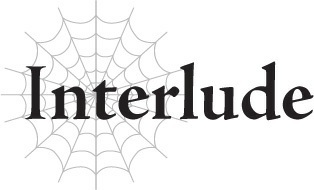

# Đoạn phụ: Cuộc săn Quỷ của một Mạo hiểm giả
*(A Certain Adventurer’s Ogre Hunt)*

---

“Cảm ơn mọi người đã tập hợp ở đây ngày hôm nay!”

Giọng nói ồm ồm thô ráp của Hội trưởng Hiệp hội vang vọng khắp tầng một của sảnh hiệp hội.

Toàn bộ đại sảnh chật kín các mạo hiểm giả đến từ các thị trấn lân cận.

Tất cả bọn họ đều ở đây để tham gia vào chiến dịch săn lùng con quỷ.

Sau khi cậu mạo hiểm giả trẻ tuổi Rukusso suýt chút nữa mất mạng và chật vật trốn thoát, cậu đã truyền tai nhau về sự nguy hiểm của con quỷ đó.

Hội trưởng của chúng tôi lập tức hành động, yêu cầu viện trợ từ các chi hội lân cận và phát lệnh chiêu mộ mạo hiểm giả.

Mồi nhử ở đây chính là những thanh ma kiếm được đồn đại là do con quỷ đó sử dụng.

Ngay cả đối với mạo hiểm giả, việc sở hữu được một thanh ma kiếm cũng là điều vô cùng hiếm hoi.

Thông báo được đưa ra là bất kỳ ai hạ gục được con quỷ sẽ được nhận lại những thanh kiếm đó như một phần thưởng.

Lẽ tự nhiên, các mạo hiểm giả từ khắp nơi đã đổ xô về đây để tham gia cuộc săn.

Dĩ nhiên, bản thân tôi cũng tham gia cuộc đi săn này nhằm kiếm cơ hội sở hữu ma kiếm, nên tôi chẳng có tư cách gì để phán xét người khác cả.

“Ê Gotou. Hôm nay trông ông nghiêm túc hơn bình thường đấy. Chắc là đang hừng hực khí thế báo thù cho mấy đồng đội đã nằm xuống chứ gì?”

Regg, một mạo hiểm giả hạng A đồng nghiệp, bá vai tôi một cách quá đỗi thân thiết.

Chúng tôi là hai mạo hiểm giả có thứ hạng cao nhất trong thị trấn này.

“Sao ông lại nghĩ thế hả? Tôi cũng chỉ đến đây vì mấy thanh ma kiếm giống ông thôi. Tôi không phải kiểu người thích bận tâm đến chuyện báo thù đâu.”

“Sao cũng được.”

Tôi thô bạo gạt cánh tay của anh ta ra, nhưng Regg có vẻ chẳng tin tôi lấy một chút.

“Nghe rõ đây, mọi người! Chúng ta có một yêu cầu đặc biệt!”

Ngay khi tôi định vặn lại Regg, giọng nói như sấm truyền của Hội trưởng lại vang lên lấn át tất cả.

“Như mọi người đã biết, mục tiêu lần này là một con quỷ độc nhất vô nhị! Chỉ số của nó được cho là cao hơn nhiều so với quỷ thông thường, và nó cũng sở hữu những kỹ năng ẩn độc đáo không kém!”

Dù bình thường đám mạo hiểm giả vốn rất ồn ào náo nhiệt, nhưng giờ đây họ đều im lặng chăm chú lắng nghe Hội trưởng.

Tôi không muốn là kẻ phá bĩnh bầu không khí này, nên cũng ngậm miệng lại.

“Sau đây là ba điều mọi người cần biết về con quỷ này!”

Những thông tin này chắc chắn là từ người sống sót của đội tiên phong mạo hiểm giả cung cấp.

“Thứ nhất, nó có khả năng tái sinh bất thường! Nó tự chữa lành vết thương theo cách không thể giải thích bằng bất kỳ kỹ năng nào đã biết! Theo báo cáo, cơ thể nó sẽ đột nhiên phát sáng, và rồi các vết thương lập tức biến mất không chút dấu vết! Thậm chí còn có tin đồn rằng nó có thể hồi phục cả MP và SP bằng cách này! Một đội mạo hiểm giả từng dồn được con quỷ vào chân tường, để rồi bị quét sạch sau khi bị khả năng hồi phục đáng sợ của con quái vật này áp đảo!”

Tiếng xì xào bàn tán bắt đầu rộ lên trong đám đông mạo hiểm giả.

Giữa đám đông đó, tôi nhìn thấy một cậu thanh niên đang cắn chặt môi.

Rukusso, một mạo hiểm giả trẻ tuổi đầy triển vọng.

Cậu nhóc là người sống sót duy nhất của đội tiên phong.

Và bây giờ, sau khi vết thương đã được điều trị ổn thỏa, cậu lại tiếp tục tham gia nhiệm vụ này để báo thù cho những người bạn đã ngã xuống của mình.

Những thành viên còn lại trong đội của cậu cũng đều là bạn của tôi.

“Thứ hai! Khả năng chiến đấu của nó có thể đột ngột tăng lên dữ dội! Hiệu ứng này tương tự như Ý chí chiến đấu (Mental Warfare), nhưng chắc chắn là vượt trội hơn thế! Lượng tăng tiến này không kéo dài lâu, nhưng chỉ số của nó sẽ cao hơn chừng nào hiệu ứng còn hoạt động! Ngoại hình của nó hoàn toàn không thay đổi, nên mọi người chỉ có nước tin vào trực giác của mình thôi!”

Nghe thì chẳng giống một sách lược đối phó thực tế cho lắm, nhưng đó mới là cách mạo hiểm giả chúng tôi hành sự.

Chúng tôi liên tục thích ứng và tùy cơ ứng biến.

Đó là nguyên tắc cơ bản, hay có thể nói là bí quyết sinh tồn của một mạo hiểm giả.

“Thứ ba! Con quỷ đó sở hữu ma kiếm! Hơn nữa còn là hai thanh!”

Nghe đến đó, đám mạo hiểm giả nhao nhao bàn tán đầy phấn khích, mắt ai nấy đều sáng rực lên.

Không có gì đáng ngạc nhiên, bởi vì hầu hết những người ở đây đều nhắm tới những thanh kiếm đó.

“Yên lặng nào! Chúng tôi đã xác nhận rằng những thanh ma kiếm đó mang thuộc tính hỏa và lôi! Như đã hứa, hai mạo hiểm giả đóng góp nhiều công sức nhất trong việc tiêu diệt con quỷ sẽ nhận được chúng!”

Những tiếng reo hò vang lên khắp đại sảnh.

Hầu hết mạo hiểm giả chỉ dám mơ ước một ngày nào đó sở hữu được một thanh ma kiếm cho riêng mình.

“Được rồi! Giờ thì xuất phát đi, các chàng trai!”

Ngay khi Hội trưởng ra lệnh, tất cả mạo hiểm giả đồng loạt lên đường tìm kiếm và tiêu diệt con quỷ.

Đó là một đám đông khổng lồ, và ai nấy đều là những mạo hiểm giả đủ kinh nghiệm để tự tin cạnh tranh một thanh ma kiếm cho bản thân.

Bất kể con quỷ này có mạnh đến mức nào, tôi nghi ngờ việc nó có thể sống sót nổi trước sự càn quét của một đội quân thế này.

“Được rồi, Gotou! Để xem ai trong chúng ta sẽ giành được ma kiếm nhé!”

“Còn phải hỏi. Rõ ràng là tôi rồi.”

Tán gẫu vài câu nhẹ nhàng, tôi và Regg cũng lên đường tìm kiếm con quỷ.

Có được ma kiếm là mục tiêu chính.

Nhưng tôi nghĩ mình cũng có thể nhân tiện báo thù cho những người dũng cảm đã bị con quỷ đó sát hại.

“Không thể nào.”

Làm sao chúng tôi lại rơi vào tình cảnh này sau màn xuất quân đầy khí thế đó chứ?

Các mạo hiểm giả đang bỏ chạy tán loạn khắp mọi hướng.

Một vụ nổ từ dưới đất hất tung và thổi bay nửa thân dưới của vài mạo hiểm giả xa lạ mà tôi không quen biết.

Những kẻ may mắn thoát khỏi số phận đó thì lại bị những thanh kiếm bay đâm xuyên qua người hoặc bị cuốn vào vụ nổ kéo theo sau đó.

Kiếm tự phát nổ? Chuyện quái quỷ gì đang xảy ra thế này?

Cảnh tượng hỗn loạn tương tự đang diễn ra khắp bãi chiến trường.

“Không có ai nói gì về chuyện này cả!”

Con quái vật đó có nhiều hơn hai thanh ma kiếm sao?!

Tôi chưa bao giờ nghe nói về loại ma kiếm biết tự phát nổ như vậy.

Và có nằm mơ cũng không ai ngờ được rằng nó lại sở hữu nhiều đến thế.

Con quỷ đang tạo ra cảnh địa ngục trần gian này đứng chốt giữa rừng cây, nó rút những thanh ma kiếm cắm xung quanh mặt đất lên và liên tục ném chúng đi hết thanh này đến thanh khác.

Cứ mỗi lần một thanh kiếm được ném ra, một tiếng nổ đanh tai lại vang lên, và số lượng mạo hiểm giả lại giảm xuống.

Một cuộc tàn sát.

Đây thực sự là một cuộc tàn sát đơn phương.

“Aaaaa!”

Nghe thấy một tiếng thét xung trận tuyệt vọng, tôi quay lại thì thấy Rukusso đã giương cung sẵn sàng bắn.

“Thằng ngu này!”

Tôi chửi thề mà không kịp suy nghĩ.

Chỉ nhìn lướt qua cũng đủ biết Rukusso không bao giờ có cửa thắng nổi con quỷ này.

Tôi nghi ngờ liệu những mũi tên của cậu ta có nổi một vết xước trên người con quái vật đó hay không.

Hơn nữa, phải ngu ngốc đến mức nào mới hét toáng lên trước khi chuẩn bị tấn công kẻ địch chứ?!

Rukusso buông dây cung bắn đi một mũi tên.

Nhưng đúng như tôi dự đoán, con quỷ né tránh phát bắn một cách dễ dàng.

Sau đó, nó rút một thanh kiếm từ dưới đất lên và ném thẳng về phía Rukusso để trả đũa rõ ràng.

“Tặc!”

Tặc lưỡi một cái, tôi lao mình chắn giữa Rukusso và thanh ma kiếm đang bay tới, vung kiếm của mình lên để đỡ đòn.

“Hự?!”

Ngay khi lưỡi kiếm của tôi chém chệch hướng thanh ma kiếm, nó liền phát nổ.

Chết tiệt, đau quá!

Sóng xung kích hất văng tôi ra sau.

Khốn kiếp thật!

Thì ra đỡ được chúng thì chúng vẫn phát nổ sao?!

Hai tay tôi... có vẻ vẫn còn nguyên vẹn.

Dù người đầy máu, nhưng bằng cách nào đó tôi vẫn giữ được mạng.

“Ư…”

Nhưng dù tôi tạm thời ổn, Rukusso do đứng quá gần nên vẫn bị ảnh hưởng bởi dư chấn của vụ nổ.

Chỉ số của cậu ta thấp hơn tôi nhiều, thế nên mặc dù tôi mới là người trực tiếp đỡ đòn, tình trạng của cậu ta có vẻ còn tồi tệ hơn.

“Cậu có sao không?!”

*Dĩ nhiên là có sao rồi*, tôi tự mắng mỏ bản thân ngay khi lời vừa thốt ra khỏi miệng.

Bất cứ ai nhìn vào cũng thấy cậu nhóc đang nằm trên mặt đất kia hoàn toàn không ổn chút nào.

Cậu ta cần được điều trị ngay lập tức, nếu không sẽ chết mất.

“Đồ khốn!”

Nhưng như muốn chặn đứng cơ hội đó, con quỷ lại giơ một thanh kiếm khác lên cao.

Nếu thêm một thanh kiếm phát nổ nữa bay tới, dù tôi có bằng cách nào đó sống sót, Rukusso chắc chắn sẽ cầm chắc cái chết!

“Aaaaa!”

Thế nhưng, thanh kiếm vừa được ném đi đã bị chặn lại trước khi kịp chạm tới chúng tôi.

“Regg!”

“Gotou! Mau đưa Rukusso rời khỏi đây đi!”

Regg cũng vừa đỡ một thanh kiếm phát nổ tương tự như tôi lúc nãy, và giờ người anh ta đầy những vết thương.

“Tôi sẽ câu giờ! Đi mau!”

“Regg! Regg, khoan đã!”

Bất chấp tiếng hét của tôi, Regg lao thẳng về phía con quỷ.

Một thanh kiếm khác lại bay về phía anh, và Regg hoàn toàn biến mất trong một vụ nổ lửa rực trời.

“Reggggg!”

Vừa gào lên trong bất lực, tôi vừa xốc Rukusso lên và bắt đầu rút lui.

Khi tôi ngoảnh lại nhìn một lần cuối cùng, tôi nhìn thấy lưỡi kiếm của con quỷ đang chém bay đầu Regg.

“Khốn kiếp! Khốn kiếp thật chứ!”

Ngày hôm đó, chúng tôi đã phải nếm trải thất bại ê chề.

---

[◀ Chương trước: Chương 2: Tôi là một kẻ ru rú trong nhà](02_im_a_shut_in.md) | [Chương tiếp theo: Chương O2: Ma kiếm của Quỷ ▶](o2_the_ogres_magic_swords.md)
