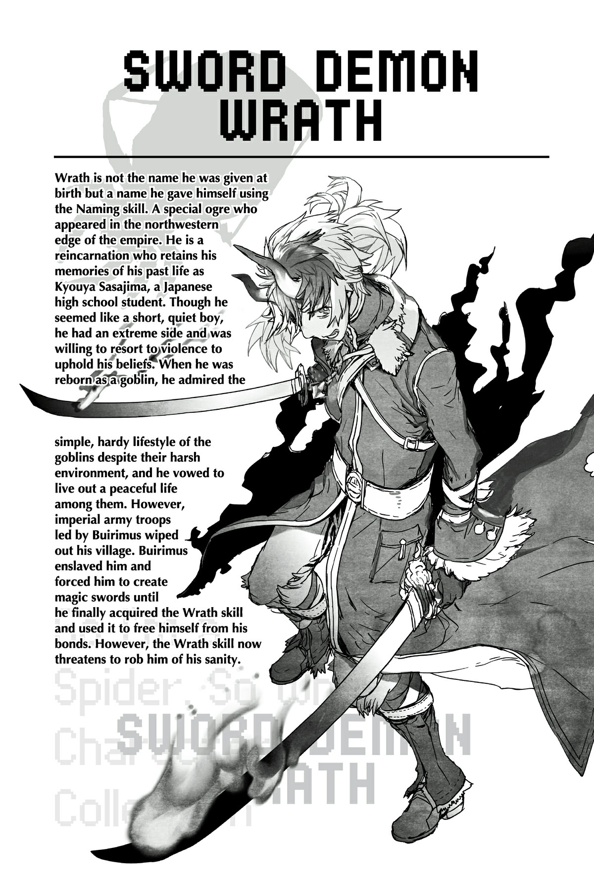

# Đoạn phụ: Ghi chép của Nhà triệu hồi Buirimus
*(The Notes of Buirimus the Summoner)*

---

Lịch Đế quốc năm 1379

Ngày mùng bảy tháng Abu

Hôm nay tôi đã đến nơi nhận chức vụ mới của mình.
Có vẻ như các kế hoạch nhằm tạo dựng một chỗ đứng ở Dãy núi Huyền Bí đã được tiến hành từng chút một từ trước khi tôi đến đây.
Tôi từng lo lắng rằng mình sẽ phải xây dựng một ngôi làng từ con số không, nhưng lại thấy một ngôi làng đã được xây dựng sẵn ở chân Dãy núi Huyền Bí.
Những người sống ở đó là các binh sĩ được gửi đến đây vì những hoàn cảnh đặc biệt, giống như tôi.
Tất cả họ đều bị đồn trú ở nơi này vì hành vi xấu, vi phạm kỷ luật quân đội, vân vân.
Bạn thậm chí có thể gọi đó là một khu lưu đày.
Tôi rất ấn tượng khi họ có thể xây dựng được một ngôi làng ở một nơi như thế này, giữa lúc lũ quái vật từ Dãy núi Huyền Bí liên tục xuất hiện.
Nhưng đây mới là nơi công việc khó khăn thực sự bắt đầu.
Nhiệm vụ mà tôi được giao là chinh phục Dãy núi Huyền Bí.
Nói cách khác, họ muốn tôi đi thám hiểm khắp dãy núi đầy quái vật này và đảm bảo một con đường dẫn đến lãnh địa ma tộc.
Đã có những nỗ lực khác để băng qua Dãy núi Huyền Bí và xâm chiếm vùng đất của ma tộc, nhưng tất cả đều kết thúc trong thất bại, nhờ vào cái lạnh cực độ và mật độ quái vật dày đặc của dãy núi.
Nói cách khác, tôi đã được giao một nhiệm vụ bất khả thi.
Tôi chắc chắn rằng cấp trên cũng không mong đợi tôi thành công.
Tất cả những gì họ muốn chỉ là tôi phải bỏ mạng một cách vô ích ở Dãy núi Huyền Bí.
Hoặc họ nghĩ ít nhất tôi cũng có thể đóng góp một phần nhỏ cho đế quốc bằng cách giảm bớt số lượng quái vật ở Dãy núi Huyền Bí đi một chút.
Tuy nhiên, tôi dĩ nhiên không có ý định chết ở đây.
Ngay cả khi tôi không thể chinh phục ngọn núi, nếu tôi chậm rãi nhưng chắc chắn tạo ra kết quả, có lẽ cuối cùng tôi sẽ được phép trở lại hoàng đô.
Hoàng đô, nơi người vợ thân yêu và đứa con mới chào đời của tôi đang chờ đợi.
Tôi không thể chết trước khi được nhìn thấy mặt con mình.
Tôi không biết khi nào mình mới có thể trở lại, nhưng tôi phải kiên trì cho đến lúc đó.

Ngày mùng sáu tháng Maya

Đã được một thời gian kể từ khi tôi đến đây.
Thời gian đầu, tôi phải dành toàn bộ thời gian để duy trì ngôi làng, nhưng dần dần tôi cũng đã đến mức có thể dành chút thời gian để thám hiểm Dãy núi Huyền Bí.
Tuy nhiên, cuộc thám hiểm đó hiện đang tiến triển với tốc độ chậm chạp đến đau lòng.
Chúng tôi cuối cùng cũng đã thu thập đủ trang bị kháng lạnh cho nhóm của mình, nhưng chúng trở nên vô nghĩa khi dấn thân sâu vào trong núi.
Ngay cả một chuyến đi ngắn cũng cực kỳ nguy hiểm trong cái lạnh này.
Hơn thế nữa, những con quái vật phát triển mạnh trong khí hậu này thường xuyên tấn công chúng tôi.
Hầu hết các lần, chúng tôi hầu như không thể tiến triển được gì trước khi bị buộc phải quay trở lại.
Và khi chúng tôi vượt qua một điểm nhất định, goblin bắt đầu xuất hiện.
Sẽ thật liều lĩnh nếu cố gắng giao chiến với những quái vật nguy hiểm như goblin trong những điều kiện này, vì vậy chúng tôi quay trở lại mà không đối đầu với chúng bất cứ khi nào nhìn thấy chúng.
Mặc dù chúng tôi phải ưu tiên sự an toàn, chúng tôi chỉ đơn giản là không đạt được bất kỳ kết quả nào.
Làm sao tôi có thể giành lại sự tôn trọng từ cấp trên của mình với tiến độ này?
Tôi luôn tự nhủ phải kiên nhẫn.

Lịch Đế quốc năm 1380

Ngày hai mươi sáu tháng Sata

Hôm nay, tôi nhận được một bức thư từ vợ mình.
Con gái chúng tôi đã bị bắt cóc.
Ngay khi nhận được bức thư, tôi đã cố gắng rời đi hoàng đô, nhưng người phụ tá của tôi đã ngăn lại.
Ngôi làng này chỉ là một khu lưu đày trên danh nghĩa.
Nếu tôi rời đi mà không được phép, tôi sẽ bị coi là kẻ đào ngũ.
Mặc dù tôi không thể chịu đựng được việc không hành động, nhưng người phụ tá hoảng loạn của tôi bằng cách nào đó đã thuyết phục được tôi từ bỏ ý định.
Tuy nhiên, tôi không thể yên lòng.
Tôi đã gửi thư cho tất cả những người quen của mình ở hoàng đô, cầu xin một cách để được phép trở lại.
Chắc chắn ngay cả chính quyền ở hoàng đô cũng sẽ không từ chối tôi khi con gái tôi bị bắt cóc.
Tuy nhiên, tôi lo lắng nhất cho sự an toàn của con gái mình.
Ngôi làng này cách hoàng đô một khoảng cách rất xa.
Vì tôi vừa mới nhận được bức thư, điều đó có nghĩa là một khoảng thời gian khá dài đã trôi qua kể từ khi con gái tôi bị bắt cóc.
Con bé đang thế nào rồi?
Tôi hầu như không thể đặt bút viết mà không lo sợ chuyện gì có thể xảy ra với con gái mình trong lúc này.
Ôi, các vị thần.
Xin hãy bảo vệ con gái tôi.

Ngày mười bốn tháng Nahe

Những phản hồi duy nhất tôi nhận được từ hoàng đô đều nói rằng họ không thể cho phép tôi rời khỏi ngôi làng này.
Có vẻ như các điều kiện lưu đày của tôi nghiêm trọng hơn những gì tôi nghĩ.
Tôi đang bị quy trách nhiệm cho cái chết của toàn bộ tiểu đội của mình, và vì thế tôi bị gửi đến đây bởi tôi không thể đưa ra lời giải thích thỏa đáng, nhưng hóa ra mọi chuyện còn phức tạp hơn thế.
Con quái vật nhện tôi chạm trán ở Mê cung Lớn Elroe — con quái vật hiện được biết đến với cái tên Cơn Ác Mộng Mê Cung — đã rời khỏi hang ổ dưới lòng đất của nó và bắt đầu tàn phá trên mặt đất.
Tôi được kể rằng có những tin đồn nói rằng tiểu đội của chúng tôi đã khiêu khích khiến nó chui ra khỏi tổ.
Lời cáo buộc này mới là lý do thực sự khiến tôi bị gửi đến nơi này.
Điều đó sẽ giải thích cho sự giúp đỡ mà Ngài Ronandt đã và đang cung cấp.
Chắc hẳn ông ấy cảm thấy có lỗi khi tôi bị buộc phải gánh chịu toàn bộ trách nhiệm cho sự cố đó.
Nhưng chỉ nhờ có Ngài Ronandt ở đó mà tôi mới sống sót được.
Tôi chỉ cảm thấy biết ơn ông ấy, chứ không hề oán hận.
Dẫu vậy, tôi vô cùng biết ơn sự hỗ trợ của ông ấy.
Ở vùng hẻo lánh này, chúng tôi luôn thiếu thốn nhu yếu phẩm, và chính nhờ sự hỗ trợ của Ngài Ronandt mà chúng tôi mới có thể nhận được chúng.
Vì vậy, tôi đành phải tiếp tục nương nhờ lòng tốt của ông ấy.
Bên cạnh đó, hiện tại tôi có lý do khẩn cấp để tích lũy thêm thành tựu.
Nếu tôi chờ đủ lâu, có lẽ là nhiều năm, tôi đoán mọi chuyện sẽ dịu xuống đủ để tôi được phép trở lại.
Tuy nhiên, nếu tôi muốn đảm bảo sự an toàn của con gái mình, tôi phải đến hoàng đô càng sớm càng tốt.
Nếu được phép rời đi, tôi đã lên đường ngay lập tức rồi, nhưng khi đó tôi gần như chắc chắn sẽ bị bắt giữ như một tội phạm tồi tệ nhất.
Nếu đây chỉ đơn thuần là chuyện nội bộ của đế quốc, thì có lẽ họ sẽ sẵn lòng xem xét các tình huống giảm nhẹ và cho phép, nhưng Cơn Ác Mộng đã gây ra rắc rối ở một quốc gia khác.
Nếu đế quốc quyết định đổ lỗi lên đầu tôi và chuyển thông tin đó cho các quốc gia khác, thì họ không thể để tôi đi dễ dàng như vậy được.
Để có thể trở lại hoàng đô, tôi phải dâng lên một số thành tựu to lớn để chứng minh giá trị của mình.
Tôi có thể làm gì đây?

Ngày mùng lăm tháng Haku

Gần đây, lũ goblin đã bắt đầu mở rộng phạm vi ra ngoài lãnh thổ của chúng.
Trước đây chúng tôi chỉ nhìn thấy goblin ở sâu trong núi, nhưng dạo gần đây chúng xuất hiện ngay cả ở vùng rìa ngoài.
Với tốc độ này, chúng sẽ sớm xâm lấn vùng đất gần ngôi làng của chúng tôi.
Vì vậy, tôi không còn lựa chọn nào khác ngoài việc cho phép thuộc cấp của mình tham chiến với lũ goblin.
Tôi chỉ hy vọng rằng sẽ không có bất kỳ tổn thất nào.

Ngày mười ba tháng Haku

Tôi đã tìm ra lý do đằng sau sự mở rộng lãnh thổ gần đây của lũ goblin.
Vũ khí của chúng đã được cải tiến.
Lũ goblin sống cách xa khu dân cư của con người, tạo thành các cộng đồng nhỏ của riêng chúng, nhưng mức độ phát triển của chúng luôn kém xa con người chúng ta.
Vì thế, vũ khí của chúng luôn khá nguyên thủy, nhưng gần đây chúng đã tiến bộ vượt bậc.
Những vũ khí chúng tôi tịch thu được từ một nhóm goblin trong chiến đấu đều có chất lượng vượt trội so với vũ khí của chính chúng tôi.
Goblin vốn dĩ đã là một kẻ thù phiền toái, nhưng với những vũ khí như thế này, chúng càng nguy hiểm hơn gấp bội.
Những vũ khí này chắc chắn là lý do lũ goblin có thể mở rộng lãnh thổ một cách đều đặn.
Nhưng chúng lấy những thứ đó ở đâu ra?
Không dễ dàng gì để có được vũ khí tốt hơn vũ khí của đế quốc.
Những thứ chúng tôi đang sử dụng là sản phẩm được sản xuất hàng loạt, nhưng chúng vẫn là vũ khí do quê hương của chúng tôi chế tạo, nơi tự xưng là quốc gia vĩ đại nhất thế giới.
Ngay cả vũ khí sản xuất hàng loạt của chúng tôi cũng không bao giờ bị coi là kém chất lượng.
Hơn nữa, chúng được gửi đến cho chúng tôi với sự giúp đỡ của Ngài Ronandt.
Nhưng vũ khí của lũ goblin mạnh hơn nhiều, loại vũ khí mà một sĩ quan của quân đội đế quốc mới được cấp.
Ngay cả đế quốc cũng sẽ gặp khó khăn trong việc thu thập nhiều hơn một vài món vũ khí như vậy, thế mà mọi con goblin trong số này đều sở hữu một món.
Rốt cuộc chúng từ đâu ra vậy?

Ngày hai mươi bảy tháng Haku

Cuối cùng, chúng tôi đã tích lũy đủ vũ khí tịch thu được từ lũ goblin để trang bị cho mỗi thuộc cấp của tôi một món.
Hôm nay, chúng tôi sẽ tấn công ngôi làng goblin.
Chúng tôi không thể đơn giản để chúng tiếp tục mở rộng lãnh thổ của mình, và hơn hết, việc chiếm quyền kiểm soát ngôi làng goblin ở Dãy núi Huyền Bí sẽ là một thành tựu đáng kể.
Với một thành tích như vậy, cuối cùng tôi có thể được phép trở lại hoàng đô.
Chúng tôi đã xác định được vị trí ngôi làng của chúng bằng cách sử dụng một con quái vật chim tôi đã thuần hóa để do thám khu vực.
Vì luôn ưu tiên sự an toàn, các cuộc thám hiểm của chúng tôi chưa từng đi xa đến thế, nhưng điều đó không phải là bất khả thi nếu chúng tôi cố gắng hết sức.
Đó sẽ là một canh bạc nguy hiểm, nhưng nếu thành công, con đường trở lại hoàng đô và gặp lại vợ tôi sẽ mở ra trước mắt.
Tôi không còn lựa chọn nào khác.

Ngày mùng bốn tháng Yafu

Chúng tôi đã thành công trong việc chiếm ngôi làng goblin.
Vì chúng tôi đã liên tục tấn công lũ goblin bên ngoài ngôi làng để tịch thu vũ khí và giảm bớt số lượng của chúng, cuộc đột kích diễn ra khá suôn sẻ.
Hầu hết lũ goblin còn lại trong làng là trẻ nhỏ, mẹ của chúng và những con goblin già yếu.
Nhờ đó, chúng tôi không phải chịu bất kỳ tổn thất nào như tôi lo sợ ban đầu.
Một vài thuộc cấp bị thương, nhưng không ai tử vong.
Thật sự, các vị thần đã mỉm cười với chúng tôi.
Không chỉ vậy, chúng tôi thậm chí còn giải quyết được một bí ẩn kéo dài lâu nay: nguồn gốc vũ khí của lũ goblin.
Một trong những con goblin sở hữu một kỹ năng đặc biệt mà chúng tôi chưa từng thấy hay nghe nói đến trước đây: [Tạo Vũ khí].
Đó là một kỹ năng thực sự đáng kinh ngạc sử dụng MP để tạo ra vũ khí từ hư vô.
Với đủ MP, người dùng có thể tạo ra vô số vũ khí chất lượng cao.
Đó là một kỹ năng đáng sợ, nhưng điều đó cũng có nghĩa là nó cực kỳ vô giá nếu có được ở phe mình.
Quả là một sự may mắn kỳ diệu khi tôi có thể thuần phục được con goblin sở hữu kỹ năng đó.
Vận may đã đứng về phía tôi ngày hôm nay.
Nếu không, con goblin đó có thể đã mang theo kỹ năng vô cùng giá trị của nó xuống mồ.
Tôi cũng may mắn vì cấp độ của con goblin này còn thấp.
Thông thường phải mất rất nhiều thời gian để khống chế một con quái vật đủ để dần dần kiểm soát nó, nhưng cấp độ của con goblin này đủ thấp để tôi thực hiện việc đó dễ dàng hơn mong đợi.
Nhưng mặc dù tôi đã giành được quyền thống trị thể chất của nó, tâm trí của nó vẫn nổi loạn chống lại tôi.
Tôi phải tiếp tục tăng cường sự khống chế của mình cho đến khi hoàn tất.
Thuần phục một con quái vật sở hữu kỹ năng kinh ngạc như thế này là một thành tựu lớn hơn cả những gì tôi có thể hy vọng.
Tôi đã quét sạch ngôi làng goblin, và tôi đã bắt giữ con goblin có thể tạo ra vũ khí chất lượng cao này.
Đây chắc chắn sẽ là món quà lập công hoàn hảo để dâng lên hoàng đô đế quốc.
Ngay khi đế quốc biết được chuyện này, họ sẽ cho tôi trở lại hoàng đô.
Sắp rồi, cuối cùng tôi cũng có thể gặp lại vợ mình.
Và bắt đầu tìm kiếm con gái mình.

Ngày mười tám tháng Yafu

Tôi muốn trở lại hoàng đô càng sớm càng tốt, nhưng trước tiên tôi phải chờ phản hồi từ họ.
Trong thời gian đó, tôi tiếp tục huấn luyện con goblin.
Đầu tiên, tôi phải nắm bắt các chi tiết nhỏ hơn của kỹ năng [Tạo Vũ khí].
Có vẻ như nó tiêu tốn rất nhiều MP, nên con goblin chỉ có thể chế tạo tối đa một món vũ khí mỗi ngày.
Dẫu vậy, việc sản xuất một món vũ khí chất lượng cao mỗi ngày đã là quá phi thường rồi.
Ngoài ra, có vẻ như chất lượng của vũ khí được tạo ra tỷ lệ thuận với lượng MP được sử dụng để tạo ra nó.
Vì thế, hành động khôn ngoan nhất sẽ là tăng lượng MP của con goblin.
Tôi đã bắt giữ các quái vật ở Dãy núi Huyền Bí và mang chúng đến cho con goblin để nó kết liễu chúng nhằm nâng cấp.
Sau khi lặp đi lặp lại quá trình này nhiều lần, con goblin đã tiến hóa thành một hobgoblin, giúp gia tăng đáng kể lượng MP cơ bản của nó.
Kỹ năng [Tạo Vũ khí] của nó cũng đã thăng cấp, cho phép nó ban thêm các hiệu ứng đặc biệt cho vũ khí.
Nghe có vẻ khó tin, nhưng sinh vật đó giờ đây đã có thể tạo ra ma kiếm.
Ma kiếm. Những món vũ khí cực kỳ hiếm được tạo ra từ các bộ phận của quái vật mạnh mẽ mang theo những hiệu ứng đặc biệt nhất định.
Ngay cả ở đế quốc, chỉ một vài sĩ quan có cấp bậc cao nhất mới mang theo ma kiếm.
Và bây giờ chúng tôi có thể sản xuất hàng loạt chúng.
Với con goblin này, tôi được đảm bảo một vị trí cao.
Chắc chắn đế quốc sẽ háo hức đón tôi trở lại hoàng đô.
Tôi khát khao được trở về với vợ mình biết bao.
Con gái tôi có an toàn không?
Vợ tôi có bị ngã bệnh vì lo lắng không?
Trong đầu tôi lúc này chỉ có thể nghĩ về vợ và con gái mình.

Ngày mùng tám tháng Kade

Tôi vẫn chưa nhận được phản hồi nào từ hoàng đô đế quốc.
Tệ hơn nữa, sự khống chế của tôi đối với con goblin đang bắt đầu chạm tới giới hạn.
Nó vẫn đang dưới sự kiểm soát của tôi, nhưng hiện tại có một sự hắc ám bên trong nó.
Sinh vật này đã nhận được những kỹ năng đáng ngại như [Nổi Giận] và [Nguyền Rủa], và cấp độ của chúng tăng lên gần như hàng ngày.
Rõ ràng là dù tôi có quyền kiểm soát nó, con goblin vẫn mang mối thù hằn sâu sắc đối với tôi vì đã hủy diệt ngôi làng của nó.
Một con goblin khác mà tôi khuất phục cùng ngày đã quy phục dưới sự kiểm soát của tôi từ lâu, nhưng con này hẳn phải có một ý chí kiên cường đáng kinh ngạc.
Bằng cách nào đó, tôi cảm thấy một điềm gở về tất cả những điều này.
Có lẽ tôi không nên tăng cấp cho nó nhiều như vậy và ép nó ăn thịt đồng tộc để nhận thêm danh hiệu?
Có lẽ sẽ khôn ngoan hơn nếu chờ cho đến khi nó hoàn toàn nằm dưới sự kiểm soát của tôi trước khi tăng cường sức mạnh cho nó.
Suy cho cùng, con goblin này thực sự sở hữu kỹ năng bí ẩn gọi là [n% I = W].
Nếu tôi nhớ không nhầm, Cơn Ác Mộng Mê Cung cũng sở hữu chính kỹ năng đó.
Tôi chưa nghe thấy tin tức gì thêm về Cơn Ác Mộng; có lẽ những tin đồn chỉ đơn giản là chưa lan truyền đến tận nơi này.
Dẫu vậy, đó là một con quái vật cực kỳ mạnh mẽ.
Sẽ không có gì ngạc nhiên nếu nó gây ra những rắc rối nghiêm trọng.
Và con goblin này cũng có cùng một kỹ năng đó.
Liệu điều đó có nghĩa là nó có bản chất tương tự như Cơn Ác Mộng?
Nếu vậy, ngày mà tôi không còn kiểm soát được nó nữa có thể sẽ đến.
Thế nhưng, tôi không thể buông tay con goblin này được.
Tôi phải trở lại hoàng đô càng sớm càng tốt.

*Nhật ký kết thúc tại đây.*

---

[◀ Chương trước: Chương 6: Tôi bị lạc](06_im_lost.md) | [Chương tiếp theo: Đoạn phụ: Ma Vương và Băng Long ▶](interlude_the_demon_lord_and_the_ice_dragon.md)
