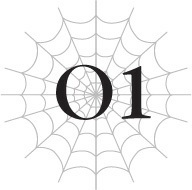

# Chương O1: Nguồn gốc của Quỷ
*(The Ogre’s Origin)*

---

Tôi luôn ghét những thứ méo mó.

Mỗi khi nhắm mắt lại, tôi vẫn có thể hình dung ra ngôi làng đó rõ ràng hơn bao giờ hết.

Đó là một ngôi làng nhỏ, nhỏ đến mức ngay cả với bước chân của một đứa trẻ, việc chạy từ đầu làng đến cuối làng cũng chẳng mất bao nhiêu thời gian.

Cánh cửa của ngôi nhà đối diện nhà tôi hơi cong vênh, và một vết ố trên bức tường của ngôi nhà phía sau có hình dạng giống như một con chim.

Những điều nhỏ nhặt vô giá trị ấy giờ đây lại trở thành những ký ức vô cùng quý giá đối với tôi.

Mỗi khi tôi đi dạo quanh làng, em gái nhỏ của tôi lại chạy hết sức mình để cố gắng theo kịp bước chân tôi.

Con bé vẫn chưa nói sõi, nên tôi chẳng biết con bé lấy đâu ra nhiều năng lượng đến thế, nhưng dù vậy, con bé lúc nào cũng bám chặt lấy tôi, chưa từng rời xa tôi nửa bước.

Ngay cả tôi cũng không cưỡng lại được mà cưng chiều một đứa em gái đáng yêu như thế.

Dẫu cho con bé chẳng phải là con người.

Làn da màu xanh lục, khuôn mặt nhăn nheo hơi gợi nhớ đến loài khỉ, và đôi mắt tròn xoe dễ thương, tất cả đều góp phần tạo nên nét quyến rũ của con bé.

Con bé có vẻ ngoài giống hệt với chủng tộc gọi là “goblin” thường xuất hiện trong những câu chuyện giả tưởng ở thế giới cũ của tôi.

Điều đó cũng dễ hiểu thôi, bởi vì con bé thực sự là như vậy.

Và vì em gái tôi là một con goblin, nên dĩ nhiên tôi cũng thế.

Tôi không biết chuyện gì đã xảy ra, chỉ là một ngày nọ khi thức dậy, tôi đã biến thành một con goblin.

Đó là cách duy nhất tôi có thể giải thích cho chuyện này.

Tôi vẫn nhớ cuộc sống kiếp trước của mình, nếu có thể gọi như vậy—cuộc đời của một con người tên là Sasajima Kyouya.

Nhưng những ký ức đó đột ngột đứt đoạn ngay giữa một tiết học văn học cổ điển ở trường trung học phổ thông.

Tôi hoàn toàn không có ý niệm gì về việc những ký ức đó liên kết thế nào với chuyện tôi trở thành một con goblin.

Nhưng tôi biết ngay rằng đây không phải là một giấc mơ, và tôi sẽ phải sống dưới danh phận một con goblin kể từ nay về sau.

Và trong khi hầu hết mọi người có lẽ sẽ cảm thấy điều này thật kỳ lạ, thì tôi thực ra lại khá tận hưởng cuộc sống làm một con goblin.

Một ngôi làng nhỏ bé, giản dị, không có những con phố ngang dọc chằng chịt, phức tạp như ở Nhật Bản.

Thay vì những mối quan hệ phức tạp giữa con người, các dân làng ở đây đều chia sẻ một mối liên kết chặt chẽ với nhau, có lẽ là do môi trường sống khắc nghiệt mà chúng tôi cùng nhau chung sống.

Và trên hết, goblin là một chủng tộc đơn giản và thẳng thắn.

Trong những câu chuyện giả tưởng ở thế giới cũ của tôi, goblin thường bị mô tả là chủng tộc yếu ớt nhất và có lẽ là ngu ngốc nhất trong số các loài “á nhân”.

Điều đó không hoàn toàn sai ở thế giới này.

Tuy nhiên, ấn tượng mà họ mang lại trong thực tế thì lại rất khác.

Có rất nhiều quái vật ở dãy núi nơi ngôi làng tọa lạc, và goblin là một trong những loài yếu nhất trong số chúng.

Thế nhưng, họ lại đủ mạnh mẽ để chiến đấu chống lại lũ quái vật hùng mạnh đó bằng cách hợp lực tác chiến.

Chủng tộc của họ có thể yếu, nhưng họ bù đắp lại bằng công cụ, kỹ năng và tình đồng đội bền chặt.

Và dẫu cho họ bị coi là khờ khạo, đó chẳng qua chỉ là vì hầu hết bọn họ đều mù chữ. Chỉ cần nói chuyện ngắn với họ, ta sẽ thấy rõ họ chẳng khác gì một con người bình thường.

Họ có thừa sự khôn ngoan để duy trì một cuộc sống bình thường một cách hoàn hảo.

Nói đúng hơn, tôi có một cảm giác tôn kính khi quan sát họ, tựa như những vị thiền sư đã đạt đến một mức độ giác ngộ nào đó.

Họ mang một sự thanh cao nhất định khiến người ta không thể nào chế giễu họ là ngu ngốc được.

Đặc biệt là nếu bạn trực tiếp quan sát cuộc sống thường nhật giản dị của họ như tôi.

Mỗi ngày mới đều bắt đầu bằng một lời cầu nguyện.

Họ dâng lời cảm tạ đến thế giới này, đến vị nữ thần bảo hộ thế giới, và đến bữa ăn hằng ngày của họ.

Sau đó, họ bắt đầu công việc của mình.

Những con goblin chưa tiến hóa sẽ tham gia huấn luyện, và những con đã tiến hóa thành hobgoblin sẽ giúp rèn luyện cho họ.

Sau đó, những ai đủ mạnh mẽ sẽ thành lập một đội đi săn và rời khỏi làng.

Ngôi làng nằm sâu trong một dãy núi dốc đứng hiểm trở, một môi trường tự nhiên nguy hiểm chứa đầy những quái vật mạnh mẽ.

Mỗi khi các đội săn goblin lên đường làm nhiệm vụ, chỉ có khoảng một nửa trong số họ trở về.

Lý do mà ngôi làng goblin vẫn có thể sinh tồn bất chấp điều đó là vì tốc độ sinh sản của goblin rất cao.

Tất cả những điều này ít nhiều đều khớp với hình ảnh về goblin trong ký ức từ kiếp trước của tôi.

Mỗi khi đội săn trở về, những người dân làng goblin khác lại chào đón họ và tưởng niệm những người đã ngã xuống.

Rồi họ cùng dâng lời cầu nguyện cảm tạ cho số thức ăn mà những thợ săn đã đánh đổi bằng cả mạng sống để mang về.

Goblin phải liên tục đối mặt với cái chết để ngôi làng có thể sinh tồn.

Những người ở lại sẽ tặng họ những bông hoa ép khô để cầu may mắn.

Mỗi đóa hoa trao đi đều chứa đựng một lời nguyện cầu mạnh mẽ, khẩn thiết cho các thợ săn được trở về bình an.

Các thợ săn khắc ghi những tình cảm đó trong tim khi lên đường dấn thân vào hành trình sinh tử rồi trở về.

Để sống sót.

Và để duy trì sự sống cho ngôi làng.

Tóm lại bằng vài từ, cuộc sống của goblin có vẻ nguyên thủy, chủ yếu xoay quanh việc săn bắn.

Thế nhưng, ta có thể cảm nhận được một mục đích sống vô cùng mạnh mẽ từ lối sống này, một thứ chưa từng tồn tại trong cuộc đời cũ của tôi ở Nhật Bản.

Chiến đấu để được sống; hy sinh để người khác được sống.

Không có thiện hay ác trong vòng tuần hoàn ấy, chỉ có sự rực rỡ của sự sống.

Nhìn cách họ sống như vậy, lòng ngưỡng mộ của tôi càng thêm sâu sắc.

Tôi đã hy vọng một ngày nào đó mình có thể chiến đấu vì ngôi làng, giống như những đội săn đã làm.

Để đứa em gái nhỏ luôn bám đuôi tôi có thể tiếp tục sống.

Đó là tất cả những gì tôi mong muốn...

---

Không kịp cất lên dù chỉ một tiếng hét, một thanh niên đổ gục xuống đất với một thanh kiếm đâm xuyên qua ngực.

Cơ thể anh ta chìm vào lớp tuyết trắng, nhuộm đỏ nó bằng một màu đỏ thẫm.

Chỉ trong vài khoảnh khắc nữa thôi, tình trạng mất máu nghiêm trọng sẽ lấy đi mạng sống của anh ta.

“Chết tiệt! Khốn kiếp!”

Một người đàn ông khác thủ thế kiếm và chửi thề.

Anh ta mặc một bộ giáp lông thú, trang phục của một bộ tộc hoang dã.

Những con người được gọi là “mạo hiểm giả” thường mặc giáp và sử dụng vũ khí chế tạo từ chính những con quái vật mà họ đã tiêu diệt.

Trang bị làm từ bộ phận của quái vật đôi khi thừa hưởng một phần sức mạnh của con quái vật đó khi còn sống. Vì thế, tuy bộ lông thú trông có vẻ không mấy an toàn, nó có lẽ vẫn mang một phần lực phòng ngự của loài quái vật mà nó từng thuộc về.

Rõ ràng, nó không chỉ đơn thuần là thứ để bảo vệ anh ta khỏi cái lạnh.

Tư thế của người đàn ông là bằng chứng quá rõ ràng cho điều đó. Anh ta mang khí chất của một con người đã quen với việc chiến đấu.

Nhưng ngay cả anh ta cũng có thể phạm sai lầm.

Trong cơn hoảng loạn, anh ta hét to lên.

Một quyết định để lộ ra sơ hở chết người.

“Á?!”

Người đàn ông bị đánh bay ngược ra sau.

Anh ta đã kịp thời đỡ đòn tấn công bất ngờ bằng thanh kiếm của mình.

Tuy nhiên, việc bị tấn công bất ngờ khiến anh ta mất thăng bằng, hoặc có lẽ do đối thủ quá mạnh, khiến phòng ngự của anh ta bị phá vỡ hoàn toàn.

Không thể triệt tiêu hoàn toàn lực tấn công, anh ta bị đẩy lùi và va mạnh vào một cái cây gần đó.

Cây cổ thụ phát ra một tiếng động khô khốc rồi nứt toác dưới lực va chạm.

Ho ra một ngụm máu, người đàn ông lăn mình né tránh cái cây đang đổ xuống.

Lá cây rụng lả tả, và tuyết từ mặt đất tung bay vào không trung.

Tuyết lấp lánh giữa tầng không, che khuất tầm nhìn của anh ta trong một khoảnh khắc ngắn ngủi.

Thế nên tôi lập tức lao qua màn tuyết để vung đòn.

“Hự?!”

Tôi có thể thấy nét mặt người đàn ông đanh lại.

Anh ta vẫn đang ở tư thế nửa ngồi nửa quỳ, cố gắng đứng dậy.

Một tay của anh ta chống trên mặt đất, và dù tay cầm kiếm vẫn tự do, anh ta hoàn toàn không ở tư thế có thể vung kiếm với bất kỳ lực đạo nào.

Tại thời điểm này, anh ta không thể né tránh cũng không thể đỡ đòn.

Mạng sống của anh ta coi như đã nằm chắc trong tay tôi.

Tôi nhận thấy chính anh ta cũng tự hiểu rõ điều đó giống như tôi.

Thế nhưng, tôi lại dừng lại và lùi bước.

Một mũi tên vút qua bên cạnh tôi, xé toạc không khí với một tiếng rít sắc lẹm, chói tai.

Đưa mắt dõi theo, tôi thấy mũi tên đó khoét một lỗ lớn thẳng qua thân cây.

Nếu như nó bắn trúng tôi thay vì cái cây, thì cái lỗ đó giờ đã nằm trên người tôi rồi.

Suýt chút nữa thì nguy. Nếu họ chờ thêm một khoảnh khắc nữa mới bắn, có lẽ họ đã thực sự trúng tôi rồi.

Tuy nhiên, nếu họ chờ đợi, mạng sống của người đàn ông này hẳn đã mất.

Đó là thời điểm tốt nhất có thể để cứu mạng anh ta, nhưng nếu xét toàn cục diện, tôi không biết liệu đó có phải là lựa chọn tối ưu hay không.

Thật sự, tôi không nên phân tích chuyện này như thể một kẻ ngoài cuộc đang đứng xem thế chứ.

Sau cùng thì chính tôi mới là kẻ đang chiến đấu với những người này mà.

“Rukusso! Chạy đi!”

Người đàn ông gượng đứng dậy và hét lớn.

Hắn ta không rút ra được bài học từ sai lầm sơ hở khi hét lên lúc nãy sao?

Nhưng chỉ vài giây sau, một mũi tên khác lại bay tới để bọc lót cho anh ta.

Để né tránh, tôi không còn lựa chọn nào khác ngoài việc lùi ra xa.

“Rukusso, đừng lo cho anh! Chạy đi!” Anh ta tiếp tục hét lên với cậu thiếu niên đang bắn tên.

Rời mắt khỏi người đàn ông trong giây lát, tôi liếc nhìn cậu cung thủ trẻ tuổi mà anh ta gọi là Rukusso.

Đứng cách đó một khoảng ngắn, cậu nhóc lộ rõ sự do dự trước mệnh lệnh rút lui.

Cậu ta nên bỏ chạy, hay ở lại đây để chiến đấu với tôi?

“Chạy đi! Mau đi báo với Gotou hoặc Regg rằng con—con quỷ này không hề bình thường!”

Nghe vậy, cậu nhóc tên Rukusso miễn cưỡng quay người và bắt đầu cắm đầu chạy.

Nhìn cậu ta chạy xa dần, đến lượt tôi ngập ngừng.

Mình nên để cậu ta đi, hay là...?

“Không đời nào!”

Vì mải suy nghĩ, tôi nhận ra phản ứng của mình đã chậm mất một nhịp.

Tôi cúi đầu xuống, vừa vặn né được lưỡi kiếm khi nó sượt qua ngay trước mặt.

Thế nhưng người đàn ông không dừng lại ở đó, anh ta tiếp tục tung ra một cú chém sắc lẹm khác.

Nó không nhanh.

Và tôi cũng không thể nói đòn chém đó có độ chính xác cao.

Nhưng có quá nhiều sự quyết tâm trong cú vung kiếm liều lĩnh ấy khiến tôi không thể không lùi lại tránh né.

“Hộc! Hộc!”

Hai vai anh ta phập phồng liên tục.

Tôi có thể nhận ra đòn tấn công vừa rồi hẳn đã vắt kiệt chút sức lực cuối cùng của anh ta.

Thêm vào đó, máu đang rỉ ra từ khóe miệng khi anh ta thở dốc.

Có vẻ như anh ta vẫn chưa thể hoàn toàn hồi phục sau cú va chạm vào thân cây lúc nãy.

“Ha! Tao có thể chỉ là một mạo hiểm giả hạng hai, nhưng ít nhất tao có thể dùng những giây phút cuối đời này để câu đủ thời gian cho hậu bối trốn thoát! Nhào vô đây!”

Người đàn ông gầm lên thách thức, như để xua tan bất kỳ nỗi sợ hãi nào đang nhen nhóm.

Nhưng thực tế, tôi đã có thể nhìn thấy một sự dao động nhẹ trong ánh mắt mà anh ta không tài nào che giấu nổi.

Khi nắm chặt thanh kiếm, đôi bàn tay anh ta run rẩy, và đó không chỉ là vì cái lạnh.

Một phần trong tôi cảm thấy tách biệt một cách kỳ lạ khi tiếp tục quan sát anh ta.

Thế nhưng, chính tôi không sai vào đâu được mới là kẻ đang chiến đấu với anh ta, và giờ đây cơ thể tôi tự cử động để kết liễu anh ta.

Cứ như thể thể xác và tâm trí tôi đang hoạt động độc lập với nhau vậy.

Làm sao mọi chuyện lại dẫn đến nông nỗi này?

Tôi chỉ muốn sống một cuộc đời bình yên, lặng lẽ làm một con goblin...

“Đỡ này!”

Người đàn ông lao thẳng về phía tôi.

Anh ta tự gọi mình là mạo hiểm giả, đồng nghĩa với việc anh ta kiếm sống bằng cách tiêu diệt quái vật.

Ở thế giới này tồn tại những sinh vật gọi là quái vật, bị coi là mối đe dọa đối với loài người ở khắp mọi nơi.

Công việc của mạo hiểm giả là chiến đấu chống lại lũ quái vật ấy.

Điều đó nghĩa là bằng việc chiến đấu với tôi lúc này, người đàn ông này chỉ đơn giản là đang làm nhiệm vụ của mình.

Bởi dưới góc nhìn của con người, tôi chỉ là một con quái vật không hơn không kém.

Chẳng có gì đáng ngạc nhiên cả.

Trong những câu chuyện hư cấu ở thế giới cũ của tôi, goblin hầu như luôn đóng vai phản diện.

Dù rằng hiện tại tôi thậm chí còn chẳng phải là một con goblin nữa.

Tôi đã tiến hóa hoàn toàn thành một con quỷ, kẻ mạnh mẽ và to lớn hơn bất kỳ con goblin nào rất nhiều.

Dưới góc nhìn của một mạo hiểm giả loài người, tôi chắc chắn một con quái vật như tôi là loại cần phải tiêu diệt ngay khi chạm trán.

Vậy mà...

“Lũ rác rưởi chết tiệt!”

“Ngươi gọi ai là rác rưởi cơ?”

“Cá—?!”

Rõ ràng là kinh ngạc khi thấy tôi có thể nói chuyện, phản xạ của người đàn ông bị chậm đi.

Để lộ ra một cơ hội hoàn hảo cho tôi đâm sâu lưỡi kiếm vào lồng ngực anh ta.

“Hự?!”

“Ai mới thực sự là lũ rác rưởi ở đây? Chính các người mới là kẻ đã đến tấn công ngôi làng của chúng tôi. Chính các người đã ép tôi phải làm những việc kinh khủng đó!”

Những hình ảnh trong quá khứ lóe lên qua tâm trí tôi.

Những ngôi nhà trong làng chìm trong biển lửa.

Lũ goblin tháo chạy trối chết, loài người đuổi cùng giết tận phía sau.

Đứa em gái nhỏ siết chặt tay tôi khi hai anh em cùng chạy.

Kẻ loài người đuổi kịp và tóm lấy tôi.

Và rồi, mệnh lệnh đó.

Mệnh lệnh kinh hoàng đó.

“Cá-cái gì...?”

“Lũ con người các người mới là loại rác rưởi tồi tệ nhất!”

Những ký ức ấy khiến cơn phẫn nộ cuồn cuộn chảy qua người tôi.

Tôi để mặc cho cơn cuồng nộ dữ dội đó kiểm soát, truyền ma lực (MP) vào lưỡi kiếm vẫn đang cắm sâu trong ngực anh ta.

Ma lực kích hoạt hiệu ứng đặc biệt của lưỡi kiếm, bao phủ nó trong những ngọn lửa bùng cháy.

Chỉ trong tích tắc, ngọn lửa nuốt chửng người đàn ông và thiêu rụi anh ta thành tro bụi.

Khốn kiếp.

Tôi đã đầu hàng cơn giận dữ của mình và kết liễu anh ta quá nhanh.

Lẽ ra mình nên bắt hắn chịu nhiều đau đớn hơn trước chứ?

...Không, chờ đã. Đó không phải là điều tôi nên hối tiếc lúc này.

Người đàn ông này chỉ là một mạo hiểm giả không liên quan, tình cờ đi ngang qua đây mà thôi.

Tất nhiên, bọn họ mới là kẻ ra tay tấn công tôi trước, nên tôi chỉ đang tự vệ.

Thế nhưng có lẽ việc ra tay đến mức này là sai lầm.

Khi ý nghĩ đó lướt qua đầu, một nụ cười tự giễu nở trên môi tôi.

Dù đúng hay sai, ngay khi tôi tự tay cướp đi một mạng sống, những thứ như thiện hay ác có lẽ đã không còn bất kỳ ý nghĩa gì nữa rồi.

Tôi chưa từng phải bận tâm suy nghĩ về thiện ác, ít nhất là khi tôi còn ở trong ngôi làng goblin ấy.

Vậy mà giờ đây...

Tại sao mọi chuyện lại thành ra thế này?

---

[◀ Chương trước: Chương 1: Tôi yếu đuối](01_im_weak.md) | [Chương tiếp theo: Chương 2: Tôi là một kẻ ru rú trong nhà ▶](02_im_a_shut_in.md)
