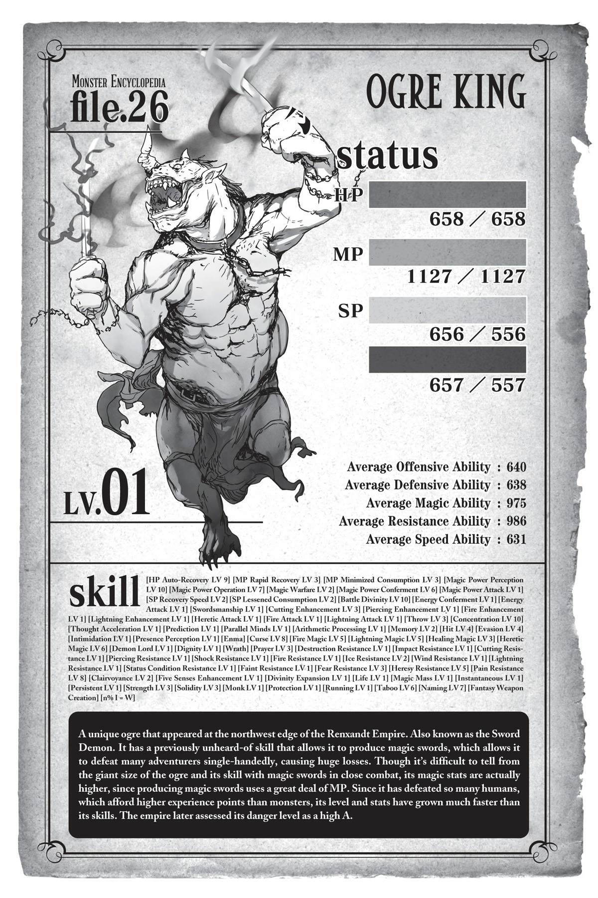

# Chương O2: Ma kiếm của Quỷ
*(The Ogre’s Magic Swords)*

---

Tôi đã làm gì thế này? Tôi đang cố làm gì thế này?

Nếu ai đó bảo tôi tóm tắt cuộc đời trước đây của mình chỉ bằng một hoặc hai từ, tôi sẽ không biết phải trả lời thế nào.

Chắc hẳn nhiều người khác cũng sẽ như vậy, đúng không?

Xét theo hầu hết các tiêu chuẩn, tôi vẫn còn khá trẻ khi cuộc đời mình kết thúc, nhưng tôi vẫn không nghĩ nó ngắn ngủi đến mức có thể gói gọn lại trong một từ duy nhất.

Thế nhưng, nếu bạn hỏi tôi đó có phải là một cuộc sống tốt đẹp hay không, tôi nghĩ mình sẽ không thể gật đầu.

“Kyouya, cậu bướng bỉnh thật đấy nhỉ? Cứ như thế mãi thì cậu sẽ bỏ lỡ những điều tuyệt vời nhất của cuộc sống đó.”

Người đã nói với tôi điều đó là Shun, một trong những người bạn trung học của tôi.

Là một trong số ít những người bạn mà tôi kết giao từ khi lên cấp ba, cậu ấy thỉnh thoảng lại đưa ra những nhận xét sắc bén như vậy, đâm trúng vào trọng tâm vấn đề.

Người bạn còn lại của chúng tôi, Kanata, thường giỏi đọc tình huống hơn, nhưng Shun lại có khả năng nhìn thấu biểu cảm của bạn để nắm bắt những phần sâu kín nhất trong lòng bạn một cách vô cùng dễ dàng.

Tôi đã cố gắng hết sức để đóng vai một đứa trẻ trầm tính, bình thường khi ở trường trung học, nhưng tôi đoán cậu ấy đã nhìn thấu điều đó...

Cho đến trước thời trung học, tôi đã trải qua một cuộc sống khá dữ dội và đầy rẫy những cuộc ẩu đả.

Mọi chuyện bắt đầu từ khi tôi còn học mẫu giáo.

Một đám trẻ lớn hơn định bao chiếm toàn bộ trò chơi ở sân chơi, thế nên tôi đã tự mình tìm cách đuổi chúng đi.

Nhóm chúng tôi đang chơi ở đó trước cho đến khi đám trẻ lớn tuổi kia đột nhiên xuất hiện.

Tôi đã chiến đấu hăng hái đến mức làm cho một trong những đứa lớn tuổi hơn phải bật khóc.

Cuối cùng, một giáo viên đã can thiệp trước khi cuộc ẩu đả leo thang xa hơn.

Nhưng rồi cô ấy lại nổi giận với tôi, cứ như thể tôi là người có lỗi vậy.

Tại sao tôi lại gặp rắc rối vì đã làm một việc đúng đắn?

Vào thời điểm đó, tôi hoàn toàn không hiểu.

Nhưng khi nhìn lại, tôi đã hiểu: Bởi vì tôi chủ động khơi mào cuộc chiến, những đứa trẻ khác chơi cùng tôi đã bị cuốn vào và bị thương.

Một vài đứa trẻ bằng tuổi tôi cuối cùng cũng bật khóc.

Kẻ có lỗi khơi mào mọi chuyện chắc chắn là đám trẻ lớn hơn đã xuất hiện và cố cướp sân chơi cho riêng mình. Tôi không hề nghi ngờ về điều đó.

Nhưng liệu việc tôi chọn cách đánh nhau với đám trẻ đó có đúng đắn hay không?

Đến giờ tôi vẫn không chắc chắn.

Nhưng tôi nghĩ đó là khoảnh khắc đầu tiên tôi nhận ra rằng quan niệm về đúng sai của mình không nhất thiết phải trùng khớp với mọi người, mặc dù lúc đó tôi chỉ mơ hồ hiểu được như vậy.

Sau đó, tôi vẫn kiên định với niềm tin của riêng mình về những gì là đúng đắn.

Ngay cả khi điều đó đồng nghĩa với việc phải sử dụng nắm đấm, và thực tế thường là như thế.

Ở trường tiểu học, tôi ngăn chặn những kẻ bắt nạt.

Ở trường trung học cơ sở, tôi đánh những tên cố trấn lột tiền của các học sinh nhỏ tuổi hơn.

Tôi có thể tiếp tục liệt kê những ví dụ này mãi.

Nhưng tôi càng hành động theo những gì mình cho là đúng, những người khác lại càng xa lánh tôi.

Tôi thấy mình ngày càng có ít đồng minh và ngày càng nhiều kẻ thù.

Vào thời điểm tốt nghiệp trung học cơ sở, người dân trong khu phố đã đặt cho tôi biệt danh là “tiểu quỷ”.

Tôi nghĩ đó là vì lúc đó vóc dáng tôi khá thấp bé.

Tất cả những gì tôi làm chỉ là những gì tôi nghĩ là đúng đắn, nhưng dường như không ai khác nhìn nhận theo cách đó.

Thậm chí, họ còn có vẻ nghĩ rằng tôi mới là người sai.

Vì vậy, khi lên cấp ba, tôi đã chọn một ngôi trường xa khu phố mình ở một chút và quyết định sẽ cư xử thật chuẩn mực.

Cứ như thế, những ngày tháng của tôi trở nên yên bình đến mức nực cười.

Chỉ cần nhắm mắt làm ngơ và giả vờ không chú ý đến một số việc, cuộc sống của một học sinh cấp ba bình thường hóa ra lại rất dễ dàng.

Nhưng thỉnh thoảng, tôi lại tự hỏi: Liệu mình thực sự ổn với điều này sao?

Tôi chơi trò chơi điện tử với bạn bè, căng thẳng về các bài kiểm tra, suy nghĩ về việc sẽ làm gì sau khi tốt nghiệp.

Khi sống một cuộc sống trung học bình thường như thế, một nỗi u sầu nào đó lại đọng lại nơi sâu thẳm tâm trí tôi.

Đúng như Shun đã nói, tôi đang quá cứng nhắc và tự bỏ lỡ cuộc sống của chính mình.

Thế nào mới thực sự là “đúng đắn”?

Tôi nên chọn hướng đi nào nếu muốn làm điều “đúng đắn”?

Bây giờ nhìn lại, tôi có thể thấy rõ ràng rằng việc lo lắng về những điều đó vốn là một sự xa xỉ.

Sau khi tiêu diệt hết tất cả các mạo hiểm giả, tôi thở phào nhẹ nhõm.

Đồng thời, sức lực cũng rời bỏ cơ thể tôi.

Tôi hẳn đã tích tụ một lượng lớn mệt mỏi mà ngay cả bản thân tôi cũng không nhận ra.

Khác với những trận ẩu đả trong cuộc đời cũ của tôi, những trận chiến sinh tử này cực kỳ căng thẳng, đúng như mong đợi.

Chẳng trách tôi lại thấy mình khuỵu gối xuống ngay khi trận chiến vừa kết thúc.

Vẫn ngồi bệt trên mặt đất, tôi thở dài một tiếng thật dài.

Mùi khét bao trùm xung quanh tôi: không phải mùi gỗ cháy mà là mùi thịt khét.

Cùng với mùi máu tanh nồng nặc mùi kim loại.

Nhìn quanh, tôi thấy xác của các mạo hiểm giả nằm rải rác khắp nơi.

Những cái hố trên mặt đất tạo ra bởi các vụ nổ cho thấy sự dữ dội của trận chiến vừa diễn ra.

Tôi đã dùng hết sạch số ma kiếm có trong tay.

Bây giờ tôi sẽ phải tạo thêm.

[Tạo Vũ khí] *(Weapon Creation)*. Đó là kỹ năng độc nhất của tôi.

Kỹ năng này, thứ dường như tôi đã sở hữu ngay từ khi sinh ra, cho phép tôi tạo ra vũ khí bằng cách tiêu hao ma lực (MP).

Tùy thuộc vào lượng MP tiêu hao, nó thậm chí có thể thêm các hiệu ứng đặc biệt vào vũ khí.

Nhờ đó, tôi có thể tạo ra những thứ được gọi là ma kiếm.

Lần đầu tiên tôi nhận thấy sự tồn tại của kỹ năng này là trong một bữa tối tại ngôi làng goblin.

Trong làng goblin không hề có dĩa hay dao, vì vậy chúng tôi thường ăn bằng tay.

Mọi chuyện xảy ra khi thịt từ buổi đi săn trong ngày được bày trên bàn ăn.

Thịt quá dai, khiến tôi ước ao từ tận đáy lòng rằng mình có một con dao.

Chỉ có thế, một tia sáng vụt qua căn phòng nhỏ, và ngay khoảnh khắc tiếp theo, một con dao đã xuất hiện trong tay tôi.

Nó trông tồi tàn hơn nhiều so với con dao mà tôi hình dung trong đầu, nhưng nó chắc chắn vẫn là một con dao.

Thật kỳ bí, một con dao vừa xuất hiện từ hư không.

Chúng tôi không biết chuyện gì đã xảy ra cho đến khi dùng [Đá Thẩm định] *(Appraisal Stone)* của trưởng làng, thứ duy nhất có trong làng.

Kết quả cho thấy tôi sở hữu kỹ năng [Tạo Vũ khí].

Sau khi biết được điều đó, cuộc sống thường nhật của tôi đã thay đổi đôi chút.

Tôi tạo ra nhiều vũ khí nhất có thể trong giới hạn lượng MP cho phép.

Tất cả những gì tôi muốn chỉ là có ích một phần nào đó cho ngôi làng.

Không may là, vì lượng MP của tôi lúc đó quá ít, những con dao tồi tàn kia là thứ tốt nhất tôi có thể tạo ra.

Hơn nữa, chế tạo một con dao đã ngốn hết sạch ma lực của tôi, nên tôi luôn phải đợi nó hồi phục.

Dù vậy, mọi người trong làng vẫn rất biết ơn, vì nó giúp họ có thể cắt nhỏ thức ăn vốn trước đây họ phải dùng tay xé.

Tôi đã rất vui sướng và tiếp tục làm ra những con dao bất cứ khi nào có thể.

Việc liên tục chế tạo dao giúp cấp độ kỹ năng tăng lên, lượng MP cũng tăng theo, và cứ thế, tôi đã có thể chế tạo một con dao làm bếp thực sự.

Tôi cũng muốn làm cả dĩa nữa, nhưng đúng như tên gọi, kỹ năng [Tạo Vũ khí] không thể tạo ra thứ gì khác ngoài vũ khí.

Có lẽ tôi tạo được dao ăn và dao làm bếp chỉ vì về mặt kỹ thuật, chúng vẫn có thể dùng làm vũ khí.

Dao nhỏ, dao bếp, và sau đó là những con dao lớn có thể dùng để mổ thịt quái vật.

Sau đó, tôi chuyển sang chế tạo đoản kiếm.

Rồi cuối cùng, tôi đã có thể tạo ra những thanh trường kiếm thực thụ.

Dần dần, tôi đã có thể chế tạo ra những vũ khí tốt hơn, mạnh hơn.

Cho đến trước đó, tộc goblin chưa bao giờ có phương tiện hay tài nguyên để rèn những vũ khí tốt, nhưng điều đó đã thay đổi ngoạn mục nhờ vào kỹ năng [Tạo Vũ khí] của tôi.

Chẳng mấy chốc, họ đã có thể đánh bại những con quái vật mà trước đây chưa từng thắng nổi, mở rộng đáng kể phạm vi săn bắn và thám hiểm của mình.

Điều đó đồng nghĩa với việc nguồn cung cấp thịt dồi dào hơn và thu thập được nhiều tài nguyên hơn.

Sức mạnh của tôi đang giúp đỡ mọi người trong làng.

Tôi đã rất hạnh phúc và tự hào đến mức chuyên tâm hơn nữa vào việc [Tạo Vũ khí].

Nghĩ lại thì, đó có lẽ là khoảng thời gian tôi cảm thấy mãn nguyện nhất.

Tôi càng tạo ra nhiều vũ khí, cấp độ kỹ năng lại càng tăng, giúp tôi tạo ra những vũ khí tốt hơn nữa.

Và vũ khí tốt hơn đồng nghĩa với cuộc sống của mọi người được cải thiện.

Còn điều gì có thể ý nghĩa hơn thế?

Hiện tại, tôi sở hữu lượng MP dồi dào hơn và cấp độ kỹ năng cao hơn nhiều so với lúc đó, nên số lượng và chất lượng vũ khí tôi chế tạo không thể so sánh được với khả năng của tôi ngày trước.

Quá khứ tôi cũng không thể thêm các hiệu ứng đặc biệt vào vũ khí.

Tôi vẫn đang tiếp tục phát triển mạnh mẽ hơn.

Nhưng điều đó không còn mang lại cho tôi chút mãn nguyện nào nữa.

Làm sao tôi có thể hạnh phúc khi tạo ra những vũ khí dùng để sát hại con người chứ?

Tôi từng chế tạo vũ khí để đánh bại quái vật vì kế sinh nhai của chúng tôi, nhưng giờ đây tôi chế tạo vũ khí để tiêu diệt con người.

Mặc dù cả hai trường hợp đều là chế tạo vũ khí, nhưng có một sự khác biệt vô cùng to lớn.

…Mà nghĩ lại thì, vũ khí vẫn là vũ khí.

Điều đó không hề thay đổi.

Tuy nhiên, cách bạn sử dụng nó sẽ thay đổi sâu sắc bản chất của nó.

Hiện giờ tôi đang dùng những vũ khí này để giết người.

Tôi đoán đó là điểm khác biệt duy nhất.

Đó không phải là mục đích tôi mài giũa kỹ năng này, nhưng giờ tôi lại đứng ở đây.

Tôi lại đưa mắt nhìn quanh cảnh vật xung quanh một lần nữa.

Mặt đất bị cày nát.

Xác của các mạo hiểm giả, bị thổi bay hoặc bị chém gục.

Một vài người trong số họ vẫn còn nguyên vẹn, nhưng phần lớn đều bị biến dạng đến mức không thể nhận ra.

Chính những thanh ma kiếm do tôi tạo ra đã gây ra cảnh tượng này.

[Ma kiếm địa lôi] *(Land mine swords)*.

Đúng như tên gọi, chúng là những thanh ma kiếm có hiệu ứng tương tự như mìn địa lôi.

Thông thường, ma kiếm sử dụng MP của người sử dụng để tạo ra hiệu ứng, vì vậy chúng được sử dụng liên tục cho đến khi gãy.

Điều này cũng đúng với hai thanh kiếm tôi dùng làm vũ khí cá nhân: katana lửa và katana sét.

Nhưng ma kiếm địa lôi thì khác.

Tôi nạp sẵn vào chúng một lượng lớn MP của mình khi chế tạo.

Sau đó, toàn bộ năng lượng tích trữ sẽ được giải phóng cùng một lúc khi chúng phát nổ.

Ma kiếm vốn được thiết kế để sử dụng trong một thời gian dài, vì vậy nếu bạn tưởng tượng toàn bộ sức mạnh đó bộc phát ra chỉ trong một khoảnh khắc, bạn có thể đoán được nó sẽ dữ dội đến mức nào.

Dù vậy, sức mạnh thực sự của chúng cũng không đến mức quá ấn tượng.

Vì chúng không có người sử dụng liên tục truyền MP như hầu hết các thanh ma kiếm khác, chúng trở thành loại chỉ sử dụng một lần để đổi lấy một lực công kích bộc phát mạnh mẽ.

Xét về lượng MP tiêu tốn để chế tạo, những thanh ma kiếm thông thường có lẽ hiệu quả hơn nhiều về mặt chi phí.

Tuy nhiên, ma kiếm dùng một lần chắc chắn mạnh mẽ hơn, và việc có thể sử dụng chúng mà không cần tiêu hao MP trong trận chiến là một điểm cộng rất lớn.

Và vì tôi chỉ có hai cánh tay nên chỉ có thể cầm hai thanh ma kiếm cùng lúc, thế nên ma kiếm địa lôi trở nên hữu dụng hơn nhiều.

Một khi đã được đặt xuống, chúng sẽ tự động phát nổ ngay khi có ai đó giẫm lên.

Tất cả những gì tôi cần làm là chế tạo ma kiếm địa lôi rồi chôn chúng xuống đất.

Tôi chỉ có một mình, nên rõ ràng tôi sẽ gặp bất lợi mỗi khi bị áp đảo về số lượng.

Đó là lý do tại sao tôi phát triển ma kiếm địa lôi.

Tôi có thể bố trí chúng làm bẫy để giúp cân bằng thế trận.

Điều tuyệt vời nhất là tôi càng tạo ra nhiều ma kiếm bằng kỹ năng [Tạo Vũ khí], cấp độ kỹ năng của tôi càng tăng cao.

Với cấp độ kỹ năng cao hơn, tôi có thể chế tạo ra những thanh ma kiếm tốt hơn nữa.

Điều đó có nghĩa là việc chế tạo càng nhiều kiếm càng tốt sẽ mang lại lợi ích lớn nhất cho tôi, nhưng như tôi đã nói trước đó, tôi chỉ có thể sử dụng cùng lúc hai thanh kiếm.

Ngay cả khi tôi cố trang bị thêm cho mình nhiều hơn, giống như trong trò chơi điện tử hay manga, những thanh kiếm thừa ra đó cũng chẳng mang lại lợi ích gì.

Và vì tôi không muốn lãng phí những thanh ma kiếm mình làm ra, việc chế tạo những thanh kiếm dùng một lần có thể sử dụng từ khoảng cách xa là một giải pháp hoàn hảo.

Cũng theo logic đó, tôi đã phát triển [Ma kiếm nổ] *(exploding swords)* dùng để ném song song với ma kiếm địa lôi.

Chúng không khác biệt mấy so với ma kiếm địa lôi, nhưng điểm hấp dẫn nhất là tôi có thể chủ động chọn thời điểm và đối tượng để tấn công.

Ban đầu, tôi nghĩ đến việc thử chế tạo súng hay thứ gì đó tương tự, nhưng có vẻ như kỹ năng [Tạo Vũ khí] của tôi không thể tạo ra các loại vũ khí hiện đại.

Lưỡi kiếm và các loại chày, gậy thì không vấn đề gì, nhưng tôi không thể chế tạo bất cứ thứ gì sử dụng thuốc súng.

Vì vậy, tôi đã phát triển ma kiếm nổ như một phương án thay thế tốt nhất, và chúng hóa ra lại mạnh mẽ đến kinh ngạc.

Vì chúng là kiếm, kỹ năng [Kiếm thuật] *(Swordsmanship)* sẽ gia tăng sức tấn công của chúng, và kỹ năng [Ném] *(Throw)* giúp tăng độ chính xác cũng như lực va chạm, nên chỉ riêng việc bị một thanh kiếm ném trúng cũng đã gây ra sát thương cực lớn rồi.

Đã vậy chúng còn phát nổ khi va chạm, nên chúng sở hữu sức tàn phá thô bạo vượt trội hơn cả ma kiếm địa lôi.

Trên thực tế, chúng thậm chí còn có sức sát thương cao hơn cả súng.

Khó khăn duy nhất là khác với ma kiếm địa lôi, tôi phải tự tay ném chúng đi, nên tôi không thể sử dụng nếu mục tiêu nằm ngoài tầm ném của mình.

Nhưng tôi có thể bù đắp khuyết điểm đó bằng cách kết hợp chúng với ma kiếm địa lôi.

Tôi đặt sẵn ma kiếm địa lôi xung quanh mình để cản trở kẻ địch tiếp cận, và nếu chúng vẫn tìm cách áp sát được, tôi chỉ cần ném một thanh ma kiếm nổ vào chúng.

Những quả mìn địa lôi tạo nên một bức tường phòng thủ vô hình, còn ma kiếm nổ đóng vai trò là pháo đài tấn công của tôi.

Theo một cách nào đó, tôi đoán điều này biến tôi thành một pháo đài di động.

Dù vậy, cả ma kiếm địa lôi lẫn ma kiếm nổ đều là những tài nguyên tiêu hao.

Một khi đã sử dụng một lần là chúng sẽ biến mất.

Hệ thống phòng thủ bằng ma kiếm địa lôi và các đòn tấn công bằng ma kiếm nổ của tôi đều có giới hạn.

Sau tất cả, thứ duy nhất tôi có thể luôn dựa vào chính là bản thân và hai thanh kiếm của riêng tôi.

Katana lửa và katana sét.

Chúng là những thanh ma kiếm thực sự, đúng nghĩa, không giống như loại ma kiếm địa lôi hay ma kiếm nổ chỉ dùng một lần.

Vì chúng có hình dáng của katana, có lẽ gọi là ma katana *(magic katanas)* thì sẽ chính xác hơn.

Đúng như tên gọi của chúng, hai thanh kiếm lần lượt được truyền vào sức mạnh của lửa và sấm sét.

Nếu tôi truyền MP vào chúng, lưỡi kiếm sẽ lập tức bị bao phủ bởi lửa và sấm sét, gia tăng sức tấn công lên mức bộc phát.

Chúng cũng có thể phóng ra lửa và sấm sét, cho phép tôi đẩy lùi kẻ địch ở cự ly tầm trung.

Hơn thế nữa, chỉ cần trang bị chúng cũng giúp gia tăng phòng thủ của người sử dụng, tăng khả năng kháng lửa và sét, thậm chí còn tăng và hồi phục HP cũng như MP.

Hiệu quả này tuy không mạnh bằng các kỹ năng thực thụ, nhưng vì chúng giúp giảm sát thương và hỗ trợ hồi phục, chúng vẫn cực kỳ hữu ích trong các trận chiến kéo dài.

Và vì chúng thậm chí còn có thể tự động sửa chữa hư tổn trên lưỡi kiếm của mình, chúng gần như không thể bị phá hủy, miễn là không bị đánh tan tành hoàn toàn chỉ trong một đòn.

Chế tạo những thanh kiếm sở hữu nhiều hiệu ứng hữu ích thế này là một việc khó khăn đối với cả bản thân tôi.

Tôi cực kỳ tự hào về chúng.

Tôi thậm chí đã sử dụng kỹ năng [Đặt tên] *(Naming)* để đặt tên cho chúng, giúp tăng cường hiệu ứng của chúng hơn nữa.

Kỹ năng [Đặt tên] giúp ban tên cho vật thể hoặc sinh vật sống, từ đó nâng cao hiệu ứng của chúng, gia tăng chỉ số, vân vân.

Đặt tên cho sinh vật sống cũng có thể trao cho người đặt tên tầm ảnh hưởng lên đối tượng được đặt tên, vì vậy nếu một sinh vật chưa có tên, việc ban tên cho nó có thể đặt nó dưới quyền kiểm soát của bạn.

Bản thân việc đặt tên không mang lại nhiều tác động đến thế, nhưng nếu kết hợp với các kỹ năng khác, bạn thậm chí có thể hoàn toàn kiểm soát thực thể sống được đặt tên đó.

Đó cũng là cách mà tôi đã...

Một ký ức kinh hoàng ùa về trong tâm trí.

Tôi lắc đầu nguầy nguậy xua nó đi, cố gắng lấy lại sự điềm tĩnh của mình.

Sau khi đã lập ra một tổ đội săn lùng quy mô lớn như vậy, tôi nghi ngờ việc loài người sẽ từ bỏ dễ dàng.

Trên thực tế, giờ đây khi đã biết một con quái vật nguy hiểm như thế tồn tại, họ có lẽ sẽ càng thêm tuyệt vọng và ráo riết tìm cách tiêu diệt tôi.

Họ nghĩ tôi là một mối hiểm họa đối với con người cũng chẳng sai, nên tôi không thể trách họ vì đã đưa ra quyết định đó.

Tuy vậy, điều đó không có nghĩa là tôi không cảm thấy bực bội.

Ai cũng sẽ nổi giận nếu bị tấn công dồn dập như thế.

Miễn là họ còn tiếp tục đuổi cùng giết tận tôi, tôi sẽ chuẩn bị sẵn sàng và nghênh chiến với bọn họ.

Giờ đây tôi sẽ không cố gắng tìm kiếm sự thấu hiểu từ con người nữa.

Con người là lũ không thể tin tưởng.

Thậm chí, tôi còn muốn quét sạch tất cả bọn họ.

Những cảm xúc đen tối bắt đầu trỗi dậy dữ dội trong tôi.

Vị máu tanh nồng lấp đầy khoang miệng.

Ban đầu, tôi tưởng mình hẳn đã nghiến răng mạnh đến mức cắn phải má, nhưng rồi tôi nhận ra mình đang cắn xé một trong những xác chết của mạo hiểm giả.

Vị của máu và thịt trong miệng kích hoạt những ký ức cũ, khơi dậy cơn thịnh nộ dữ dội mà tôi đã cảm nhận lúc bấy giờ.

Tất cả sự cuồng nộ đó đe dọa chiếm lấy tâm trí tôi, nhưng tôi lắc đầu liên tục để chống lại nó.

Không tốt.

Tôi phải giữ bình tĩnh.

Không sao cả. Mình vẫn ổn.

Tôi vẫn chưa mất đi sự tỉnh táo.

Tôi phải giữ được sự điềm tĩnh và chuẩn bị cho đợt tấn công tiếp theo của loài người.

Cắn xé xác chết của mạo hiểm giả thành từng mảnh bằng miệng, tôi bắt đầu vạch ra chiến thuật để tàn sát những kẻ tiếp theo dám tìm đến đây.

---

[◀ Chương trước: Đoạn phụ: Cuộc săn Quỷ của một Mạo hiểm giả](interlude_a_certain_adventurers_ogre_hunt.md) | [Chương tiếp theo: Chương R1: Lão già trong bộ tang phục ▶](r1_the_old_man_in_mourning.md)
