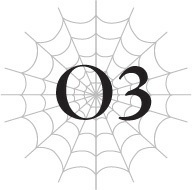

# Chương O3: Quỷ bị truy đuổi
*(The Ogre Pursued)*

---

“Hộc! Hộc!”

Những cơn gió dữ dội cuốn luồng hơi thở trắng xóa của tôi bay ngược ra sau.

Không ngoái đầu lại nhìn nó tan biến, tôi vắt chân lên cổ mà chạy hết sức bình sinh.

Tôi đã quá ngây thơ.

Trước khi lâm trận, tôi không hề nghĩ mình quá kiêu ngạo hay bất cẩn.

Trên thực tế, tôi còn cảm thấy mình đã chuẩn bị quá mức cần thiết vì những lo lắng vô căn cứ.

Thế nhưng, tôi vẫn quá ngây thơ.

Việc tôi đang phải cắm đầu chạy trốn một cách nhục nhã thế này chính là minh chứng rõ ràng nhất cho điều đó.

Sau khi đánh bại nhóm mạo hiểm giả đầu tiên, tôi đã bắt đầu chuẩn bị cho trận chiến tiếp theo.

Nói một cách đơn giản, trận chiến đầu tiên đó là một cuộc tàn sát.

Tôi đã chuẩn bị trước và phục kích bọn họ bằng toàn bộ sức mạnh của mình, mọi chuyện thậm chí còn diễn ra suôn sẻ ngoài mong đợi.

Tuy nhiên, tôi sẽ không nói đó là một chiến thắng dễ dàng.

Thực tế, đó là một tình thế vô cùng ngàn cân treo sợi tóc.

Tôi đã dùng hết sạch số ma kiếm mình chuẩn bị và phải chạy trầy da tróc vẩy mới cắt đuôi được kẻ địch, thế nên nó không hề là một cuộc thảm sát một chiều như phe tấn công lầm tưởng.

Những mạo hiểm giả mà tôi giết có lẽ không nhận ra, nhưng bọn họ thực chất đã dồn tôi vào chân tường.

Nếu không nhờ đặc tính đặc biệt giúp phục hồi hoàn toàn mỗi khi tăng cấp, tôi có lẽ đã mất mạng rồi.

Chính vì số lượng kẻ địch đông đảo và có thực lực cao như thế, tôi mới nhận được nhiều điểm kinh nghiệm để liên tục tăng cấp một cách chắc chắn.

Thật mỉa mai khi chính sức mạnh và quân số của bọn họ lại là thứ giúp tôi chiến thắng.

Tuy nhiên, điều đó chỉ hiệu quả vì bọn họ vẫn yếu hơn tôi.

Miễn là đối đầu với những kẻ địch tôi có thể đánh bại riêng lẻ từng người một, tôi không cần phải lo lắng quá nhiều, nhưng nếu có ai đó mạnh hơn tôi xuất hiện, tôi sẽ không thể trông chờ vào việc hạ gục họ để thăng cấp phục hồi.

Làm sao thăng cấp nổi nếu tôi không thể đánh bại họ chứ.

Và theo những gì tôi biết, ngoài kia có đầy rẫy những kẻ địch mà tôi không thể đánh bại.

Ngay cả khi không phải vậy, một nhóm gồm nhiều kẻ mạnh có thực lực ngang tầm tôi cũng sẽ khiến chiến thắng trở nên khó khăn hơn rất nhiều.

Đó là lý do tôi phải thực hiện tất cả những khâu chuẩn bị này.

Tôi liên tục tạo ra ma kiếm chừng nào còn MP.

Khi MP cạn kiệt, tôi luyện tập với thanh katana của mình.

Trong nhóm mạo hiểm giả trước đó, thực sự có một kiếm sĩ có thể đọ sức ngang ngửa với tôi.

Nếu hắn ta không bị thương trong quá trình tiếp cận, tôi có lẽ đã gặp rắc rối lớn rồi.

Hiểu thế này nhé, các chỉ số của tôi thiên về hướng ma pháp.

Việc tạo ra ma kiếm đòi hỏi lượng MP khổng lồ, thế nên chỉ số ma pháp của tôi cao hơn các chỉ số còn lại.

Chỉ số vật lý và phòng ngự của tôi thấp hơn nhiều so với những gì người ta thường suy đoán từ vóc dáng hộ pháp này.

Sau trận chiến với nhóm mạo hiểm giả, tôi lại tiến hóa một lần nữa và trở thành Quỷ Vương (Ogre King).

Chủng tộc này dường như có một đặc tính đặc biệt giúp chỉ số vật lý của tôi tăng cao hơn nhiều so với trước đây.

Chỉ số ma pháp của tôi thiên về việc chế tạo ma kiếm, thế nên chúng không thực sự hữu ích lắm trong chiến đấu.

Chung quy lại, tôi không có nhiều lựa chọn ngoài việc chiến đấu với các chỉ số vật lý tương đối thấp, nhưng may mắn là tôi đã có thể vượt qua cho đến nay.

Dù chỉ số vật lý của tôi có thấp, chúng vẫn cao hơn các mạo hiểm giả thông thường.

Hơn nữa, tôi có thể bù đắp điều đó trong tình thế nguy cấp bằng kỹ năng `[Đấu Thần Đấu Pháp]`, một kỹ năng cao cấp giúp tăng mạnh chỉ số vật lý.

Nếu kích hoạt nó, tôi có thể đánh bại hầu hết mọi đối thủ.

Nhưng tôi nghĩ kiếm sĩ mạo hiểm giả áp sát được tôi kia có các chỉ số ngang ngửa, hoặc thậm chí là cao hơn tôi.

Nếu các chỉ số của chúng tôi xấp xỉ nhau, kẻ thắng cuộc sẽ được quyết định bởi kỹ năng chiến đấu thuần túy.

Và tôi chắc chắn kiếm sĩ đó vượt trội hơn tôi rất nhiều.

Kiếm thuật, các đòn nghi binh, và chiến thuật của tôi không thể nào bì kịp với kinh nghiệm dày dặn của người đàn ông đó.

Lý do duy nhất tôi có thể đánh bại hắn là vì hắn đã bị thương từ trước, cộng thêm vận may tăng cấp phục hồi kịp thời của tôi.

Tôi chắc chắn kiếm sĩ đó vẫn chưa phải là kẻ mạnh nhất thế giới, vì vậy tôi phải cải thiện bản thân để có thể chiến thắng ngay cả khi không có những lợi thế may mắn đó.

Nếu một con người thậm chí còn mạnh hơn xuất hiện, tôi có thể bị giết.

Dù đã tiến hóa và mạnh lên sau trận chiến đó, tôi vẫn không được phép lơ là cảnh giác.

Tôi biết mình phải chuẩn bị đối đầu với kẻ địch tiếp theo bằng tất cả những gì mình có.

Thế nhưng, bất chấp mọi nỗ lực của tôi, tất cả khâu chuẩn bị đều tan thành mây khói một cách dễ dàng.

Những kẻ tấn công mới này chắc chắn đã sử dụng một loại ma pháp diện rộng nào đó để kích nổ toàn bộ ma kiếm địa lôi và cày nát cả vùng đất xung quanh.

Bọn họ đã lướt qua kết giới ma kiếm lôi điện mà tôi dựng lên để làm chậm bước tiến của họ bằng mánh khóe dịch chuyển bẩn thỉu, rồi lại trơ trẽn lật đổ chúng bằng cách dịch chuyển cả mặt đất.

Và rồi còn có lão kỵ sĩ tấn công tôi nữa. Ông ta thậm chí còn mạnh hơn cả tên kiếm sĩ mạo hiểm giả trong trận chiến trước.

Khuôn mặt dưới chiếc mũ giáp của ông ta hằn rõ những nếp nhăn, thế nhưng sức mạnh và sự sắc bén trong kiếm thuật của ông ta không hề có dấu hiệu bị mài mòn bởi tuổi tác.

Thật là một quyết định sáng suốt khi tôi đã luyện kiếm sau trận chiến với đám mạo hiểm giả kia.

Nếu không, tôi có lẽ đã bị chém thành trăm mảnh rồi.

Người đàn ông đó là một bậc thầy kiếm thuật thực thụ.

Và rõ ràng, ông ta là một cựu binh dày dạn kinh nghiệm qua hàng trăm trận chiến.

Xét về sức mạnh thể chất thô bạo, `[Đấu Thần Đấu Pháp]` giúp tôi chiếm ưu thế.

Nhưng ông ta có thừa kinh nghiệm và tài năng để bù đắp cho điều đó một cách dễ dàng.

Tôi không thể lơ là cảnh giác dù chỉ một giây, nhưng tôi cũng không thể chỉ tập trung vào mỗi lão kỵ sĩ.

Bởi vì lão pháp sư đã dịch chuyển lão kỵ sĩ đến chỗ tôi đang liên tục tấn công tôi từ xa.

Hai lão già dồn tôi vào thế bí, và khi một phép thuật thổi bay một phần đầu của tôi, tôi biết mình đã đặt chân vào cửa tử.

Nhưng vận may lại mỉm cười với tôi: một thanh kiếm tôi ném đi theo phản xạ bằng cách nào đó đã trúng một trong những binh lính và giết chết hắn, và may mắn hơn nữa là điều đó giúp tôi tăng cấp và phục hồi hoàn toàn, đây là thứ duy nhất cứu mạng tôi.

Đó thực sự là một vận may một triệu năm có một.

Chỉ cần một chi tiết nhỏ diễn ra khác đi...

Nghĩ đến đó thôi cũng đủ khiến tôi rùng mình.

Lý do duy nhất tôi còn sống bây giờ là nhờ ăn may.

Và đó cũng là lý do duy nhất tôi có thể chạy thoát.

Tầm nhìn của tôi nhuốm một màu đỏ ngầu, ý thức dần tiêu tán.

Nhưng bằng cách nào đó, tôi vẫn giữ được lý trí và vượt qua được.

Nếu tôi mất kiểm soát vào lúc đó, tôi có cảm giác mình sẽ không bao giờ có thể giành lại nó được nữa.

Tôi đang níu giữ lấy sự tỉnh táo của mình bằng một sợi chỉ mong manh.

Tôi phải tự đưa ra hàng tá lý do để rời đi và chạy trốn, nếu không tôi đã đầu hàng cơn thịnh nộ bạo lực của mình và đánh mất bản thân trong một cuộc tàn sát liều lĩnh.

Trong tình cảnh đó, tôi chắc chắn mình có thể đánh bại lão kỵ sĩ và lão pháp sư kia.

Tuy nhiên, chiến thắng đó sẽ chỉ dẫn đến sự hủy diệt của chính tôi.

Không sao cả.

Tôi vẫn ổn.

Tôi vẫn có thể suy nghĩ lý trí như thế này.

Tôi chưa hề mất trí...

“Hộc! Hộc!”

Lồng ngực trở nên khó thở hơn, nên tôi dừng chạy.

Vì đã lao đi với tốc độ tối đa, tôi hoàn toàn đứt hơi và kiệt sức.

Nhưng có lẽ bây giờ tôi đã chạy được một khoảng rất xa rồi.

Tôi đã vượt qua quãng đường đáng kể, nên tôi nghi ngờ những kẻ tấn công kia có thể đuổi kịp tôi suốt chặng đường này.

Ngay khi tôi vừa thở phào nhẹ nhõm, một tia sáng sượt qua má tôi.

“?!”

Một vệt máu nhỏ rỉ ra từ vết cắt nông trên má.

Trước khi kịp cảm nhận được cơn đau, tôi quay ngoắt người về phía nguồn phát ra tia sáng.

Ở đó, tôi nhìn thấy lão pháp sư già trước đó đã bắn nổ đầu tôi bằng ma pháp.

“Cái... a!”

Tôi chỉ kinh ngạc trong một khoảnh khắc, cho đến khi tôi nhận ra làm thế nào lão ta đến được đây.

Phải rồi.

Lão pháp sư này có thể dùng một mánh khóe bẩn thỉu phạm quy: dịch chuyển!

Bất kể tôi chạy bao xa, lão ta có thể phớt lờ khoảng cách và chỉ cần dùng `[Dịch chuyển]` để bắt kịp.

Trong lúc tôi đang đứng chết trân, lão pháp sư trừng mắt nhìn tôi và giơ trượng lên.

“Aaaa!”

Không thể kìm nén được luồng khí lạnh chạy dọc sống lưng, tôi hét lớn và bắt đầu bỏ chạy.

Thay vì cơn giận thường ngày chực chờ thiêu đốt cơ thể, lần này tôi cảm thấy nỗi khiếp sợ nguyên thủy suýt chút nữa đã đông cứng tôi tại chỗ.

Về mặt lý trí, tôi biết việc chạy bộ trốn thoát là vô nghĩa trước một pháp sư có thể dịch chuyển, nhưng nỗi sợ hãi đã lấn át toàn bộ lý trí.

Không thể tập trung suy nghĩ, tôi để bản năng dẫn dắt và cắm đầu chạy.

Ép đôi chân rệu rã tiếp tục di chuyển, hơi thở hoàn toàn đứt quãng, tôi lao về phía trước.

Khò khè... hổn hển... Khi tôi hít ngụm không khí lạnh buốt, lồng ngực đau nhói như bị bóp nghẹt.

Hai bên hông đau thắt, và tôi gần như không thể nhấc nổi chân lên.

Nhưng tôi vẫn tiếp tục chạy.

Một tia sáng khác bắn vào tôi từ phía sau.

Nó đâm sầm xuống mặt đất cách đó một khoảng, suýt chút nữa là trúng người tôi.

Nhớ lại đòn đánh đã thổi bay đầu tôi trước đó, tôi cảm thấy đôi chân mình trở nên nặng trĩu.

Nhưng nếu tôi dừng lại bây giờ, mọi chuyện sẽ kết thúc, vì vậy tôi ép bản thân phải bước tiếp bằng những chút sức lực cuối cùng còn sót lại.

`<Đã đạt đủ độ thông thạo kỹ năng. Kỹ năng [Kháng Sợ hãi LV 3] đã trở thành [Kháng Sợ hãi LV 4].>`

`<Đã đạt đủ độ thông thạo kỹ năng. Kỹ năng [Kháng Ngoại đạo LV 5] đã trở thành [Kháng Ngoại đạo LV 6].>`

Tôi nghe thấy giọng nói vang lên trong đầu, nhưng tôi không có thời gian để dừng lại suy nghĩ về ý nghĩa của nó.

Tôi đã chạy bao xa rồi?

Tôi đã hoàn toàn mất đi nhận thức về thời gian. Tôi không biết đã trôi qua vài phút, vài giờ hay thậm chí là vài ngày.

Tôi chỉ tiếp tục chạy mà không có bất kỳ điểm đến nào trong đầu.

Bị thúc đẩy bởi sự hoảng loạn, tôi tiếp tục di chuyển chừng nào cơ thể còn chịu đựng được.

Và ngay khi tôi dừng lại vì nghĩ mình không thể chạy được nữa, một tia sáng khác lại lao về phía tôi.

Rồi chu kỳ đó cứ lặp đi lặp lại.

Lão pháp sư già đó không chịu để tôi yên.

Nỗi sợ hãi kinh hoàng ập đến, kéo lê đôi chân tôi tiến về phía trước.

Bất kể tôi chạy đi đâu hay chạy nhanh thế nào, lão pháp sư đó luôn đi trước một bước, đứng đợi sẵn tôi ở đó.

Dần dần, sự kiệt quệ mài mòn tâm trí tôi, cho đến khi những suy nghĩ trở nên quá mơ hồ để có thể kết nối lại một cách mạch lạc.

`<Đã đạt đủ độ thông thạo kỹ năng. Kỹ năng [Kháng Sợ hãi LV 4] đã trở thành [Kháng Sợ hãi LV 5].>`

`<Đã đạt đủ độ thông thạo kỹ năng. Kỹ năng [Kháng Ngoại đạo LV 6] đã trở thành [Kháng Ngoại đạo LV 7].>`

Đến một lúc nào đó, nỗi sợ hãi khi không biết phải chạy bao lâu bắt đầu nhường chỗ cho một cơn thịnh nộ đang sôi sục.

Tại sao tôi lại phải chạy trốn?

Chỉ có đúng một người.

Lão kỵ sĩ không có ở đây.

Tôi có thể giết lão ta, đúng không?

Kiệt sức vì phải chạy liên tục, căm phẫn trước cách mình bị dồn vào chân tường, tôi cảm thấy nỗi sợ hãi chuyển hóa thành cơn giận dữ.

Đúng thế.

Tôi không cần phải chạy.

Nếu lão ta định đuổi theo tôi bất cứ nơi nào tôi đi, tôi chỉ việc giết lão ta là xong.

Tôi dừng bước ngay tắp lự.

Một tia sáng lao thẳng về phía tôi.

Nó sượt qua cơ thể tôi, nhưng tôi không còn cảm thấy nỗi sợ hãi như trước nữa.

Thay vào đó, tôi bị bao trùm bởi cơn cuồng nộ dữ dội, đủ mạnh để đẩy cơ thể lao về phía trước.

“GÀOOOOO!”

Gầm lên một tiếng, tôi lao thẳng về phía lão pháp sư già.

“?!”

Vẻ mặt của lão pháp sư không hề thay đổi, nhưng tôi có thể nhận ra lão ta khẽ thở dốc một chút.

Thổi bùng ngọn lửa trên thanh katana của mình, tôi vung kiếm chém vào lão già.

Pháp sư đó không thể né tránh đòn tấn công của tôi, và lưỡi kiếm chém thẳng qua cơ thể lão ta.

“Hả?”

Tuy nhiên, mặc dù đòn đánh chắc chắn đã trúng đích, cảm giác như kiếm của tôi chỉ đang chém vào không khí.

Sự việc ngoài dự kiến này khiến tôi suýt chút nữa mất thăng bằng và ngã nhào về phía trước.

Thay vào đó, tôi loạng choạng bước hai ba bước trước khi lấy lại được thăng bằng.

Cơ thể tôi đã đi xuyên qua lão pháp sư già.

“Cái gì—?”

Trong một khoảnh khắc, tôi không hiểu chuyện gì đang xảy ra.

Cứ như thể lão pháp sư già kia chỉ là một ảo ảnh, và cả kiếm lẫn cơ thể tôi đều đi xuyên qua lão ta.

Không, khoan đã.

Không phải là "cứ như thể". Đó thực sự là những gì đang xảy ra sao?

Một ảo ảnh?

Tôi lập tức quay người lại, nhưng lão pháp sư già không còn ở đó nữa.

Nhìn quanh tìm kiếm trong điên cuồng, tôi thấy một người mặc đồ đen đứng cách nơi lão pháp sư vừa xuất hiện không xa.

Người đó mặc đồ đen tuyền từ đầu đến chân, trông như một nhẫn giả.

Không để lộ một chút da thịt nào, thế nên tôi thậm chí không thể biết người này có phải là con người hay không, chưa nói đến việc giới tính của họ là gì.

“Nỗi sợ đã tan. Ảo ảnh đã bị hóa giải một phần.”

Người mặc đồ đen lầm bầm một cách vô cảm, và cuối cùng tôi cũng phần nào hiểu được chuyện gì vừa xảy đến với mình.

Ảo ảnh và nỗi sợ.

Kẻ nào đó đã tạo ra ảo ảnh rằng lão pháp sư già vẫn đang đuổi theo tôi và sử dụng kỹ năng nào đó để gieo rắc nỗi sợ lên tôi, khiến tôi không nhận thức được những gì đang xảy ra xung quanh.

Nói theo thuật ngữ trò chơi điện tử, bọn họ đã áp đặt nhiều trạng thái bất thường lên tôi cùng lúc.

Nếu bạn nhận thức được điều đang xảy ra, thì nó không phải là vấn đề gì quá lớn lao, nhưng việc trải nghiệm nó ngoài đời thực là một sự kết hợp vô cùng kinh hoàng.

Tôi chưa bao giờ biết con người trong thế giới này lại có thể chiến đấu theo cách như vậy.

Nhưng thay vì ấn tượng, tôi cảm nhận được ngọn lửa thịnh nộ đang bùng cháy dữ dội bên trong mình.

Tức giận với chính bản thân, vì đã bị lừa gạt một cách dễ dàng và cắm đầu chạy trốn khỏi một thứ hư vô.

Nhưng trên hết, là tức giận với kẻ chịu trách nhiệm trước mắt tôi.

“GÀOOOOO!”

Trong cơn cuồng nộ bộc phát, tôi lao thẳng vào người mặc đồ đen.

Nhưng người đó né tránh một cách dễ dàng, với chuyển động nhẹ nhàng và linh hoạt đến mức cơ thể họ dường như hoàn toàn không có trọng lượng.

“Rút lui.”

Chỉ buông một từ đơn giản, người mặc đồ đen quay ngoắt người bỏ chạy.

“Đừng hòng trốn!”

Tôi đuổi theo họ khi họ bỏ chạy.

Lại là một cuộc rượt đuổi, nhưng lần này vai trò đã bị đảo ngược.

Khi tôi đuổi theo người mặc đồ đen, chúng tôi dường như di chuyển với tốc độ ngang nhau: tôi không thể rút ngắn khoảng cách hay bị bỏ xa hơn.

Người mặc đồ đen cứ thế tiếp tục chạy, không một lần ngoái đầu nhìn lại.

Cuối cùng, chúng tôi đến một nơi trông có vẻ quen thuộc.

Thế rồi, bóng người mặc đồ đen đột ngột dừng lại.

Không chút do dự, tôi vung kiếm chém thẳng vào lưng họ.

Nhưng đòn tấn công của tôi đi xuyên qua cơ thể người đó và cắm thẳng xuống đất.

Cảm giác giống hệt như trước đây.

Lại là ảo ảnh sao?!

Tôi đã bị lừa!

Bọn họ hẳn đã hoán đổi bản thân với ảo ảnh vào thời điểm nào đó trong cuộc rượt đuổi.

Hoặc có lẽ tôi đã đuổi theo một ảo ảnh ngay từ ban đầu.

Nhận ra mình đã bị dắt mũi suốt thời gian qua, tôi nghiến răng kèn kẹt.

Cơn giận dữ bộc phát dữ dội đến mức nhuộm đỏ cả tầm nhìn của tôi.

Ngước mắt lên nhìn, tôi thấy vài người đang đứng trố mắt nhìn tôi trong sự kinh ngạc.

Thế rồi, khi nhìn kỹ hơn, tôi nhận ra mình biết nơi này.

Đó là ngôi làng tồi tệ nơi tôi từng bị giam cầm.

Nhưng tôi đã giết sạch tất cả những kẻ sống ở đây rồi kia mà.

Vậy thì những người này từ đâu ra chứ?

Như một sợi dây bị đứt phựt, cơn thịnh nộ bên trong tôi bắt đầu tràn bờ.

“Áaaa!”

Không thể kìm nén thêm được nữa, tôi chém gục người đứng gần nhất bằng thanh kiếm của mình.

Bị chém làm đôi bởi thanh katana lửa của tôi, hai nửa của cái xác bốc cháy dữ dội.

Nhìn thấy cảnh đó, những người còn lại đều bắt đầu hét lên cái gì đó.

Họ đang nói cái gì vậy?

Tôi có thể nghe thấy những âm thanh họ phát ra, nhưng đầu óc tôi dường như không thể xử lý chúng thành ngôn ngữ.

Đó chắc chắn là một thứ tiếng người khác với ngôn ngữ tôi đã học được.

Mà thôi, sao cũng được.

Chuyện đó không quan trọng vào lúc này.

Nếu bọn họ đã ở trong ngôi làng này, thì tôi bất cần biết bọn họ là ai.

Tôi sẽ giết sạch tất cả bọn họ.

Tôi bắt đầu vung kiếm chém xuống người tiếp theo.

Cùng lúc đó, một cô bé chạy về phía tôi, lớn tiếng gào hét.

“Sasajima!”

Đó là một cái tên quen thuộc. Tên của tôi. Nhưng không một ai ở thế giới này có quyền được biết.

Lẽ nào ảo ảnh mạnh đến mức ảnh hưởng đến cả thính giác của tôi sao?

Đừng gọi tôi bằng cái tên đó!

Tôi không còn quyền để thưa nhận cái tên đó nữa rồi.

Sasajima Kyouya là cái tên của một con người đã chết từ rất lâu về trước.

Như để xua tan những ảo ảnh này, tôi vung thanh katana lửa của mình chém thẳng vào cô bé đang gào khóc kia.

---

[◀ Chương trước: Chương R2: Lão già chiến đấu với Quỷ](r2_the_old_man_fights_an_ogre.md) | [Chương tiếp theo: Đoạn phụ: Giáo hoàng và các Điệp viên Bóng tối ▶](interlude_the_pontiff_and_the_shadow_agents.md)
