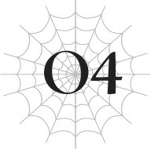
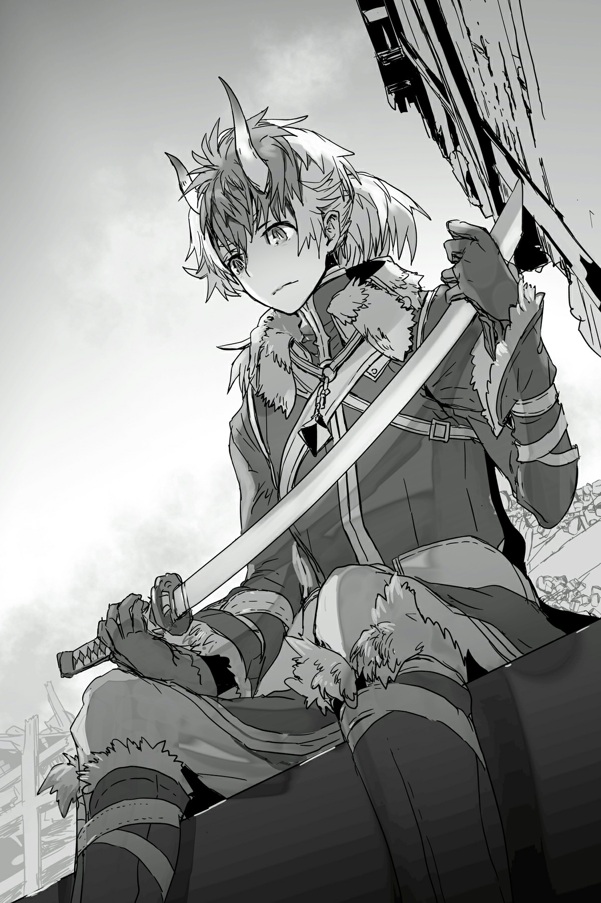

# Chương O4: Quỷ kiệt sức
*(The Ogre Worn Down)*

---

Tôi tiêu hao MP để chế tạo một thanh katana mới.

Tôi cần phải thay thế thanh kiếm mà tôi đã ném đi theo phản xạ khi lão pháp sư già bắn một lỗ trên đầu tôi.

Một trong những ưu điểm lớn nhất của [Tạo Vũ khí] là ngay cả khi tôi mất đi một trong các vũ khí của mình, tôi vẫn có thể tái tạo lại nó miễn là có đủ thời gian và MP.

Không lâu sau, tôi đã vung thanh kiếm mới toanh.

Bàn tay kia của tôi buông viên [Đá Thẩm định] mà tôi vừa dùng để kiểm tra thành quả.

Viên đá thường ngày vẫn được treo bằng một sợi dây trên cổ tôi.

Đây chính là viên [Đá Thẩm định] gã đàn ông đó từng dùng trước đây, nên việc tự mình sử dụng nó khiến tôi cảm thấy buồn nôn.

Nhưng sở hữu một viên [Đá Thẩm định] rất hữu ích để kiểm tra các khả năng của vũ khí được tạo ra bằng [Tạo Vũ khí], vì thế tôi không còn lựa chọn nào khác ngoài việc luôn mang nó theo bên người.

Kết quả [Thẩm định] xác nhận thanh katana mới tạo có cùng thuộc tính sét giống như thanh cũ.

Thực tế, vì tôi đã tiêu tốn nhiều MP hơn, nó thực chất còn tốt hơn trước đây.

Và trong khi thanh katana cũ có cảm giác hơi nhỏ khi nằm trong tay một Quỷ Vương, thanh này lại vừa vặn một cách hoàn hảo.

Không phải thanh kiếm to lên. Mà là cơ thể tôi đã nhỏ đi.

Sau khi tôi lật ngược thế cờ trước nhóm phục kích tôi ở ngôi làng này, cấp độ của tôi đã tăng lên và tôi có thể tiến hóa một lần nữa.

Tôi từng nghĩ Quỷ Vương đã là giới hạn tiến hóa cuối cùng của nhánh này, nên tôi rất ngạc nhiên khi phát hiện ra vẫn còn một lựa chọn khác.

Tiến hóa này được gọi là Oni.

Khi tôi tiến hóa thành Oni, cơ thể tôi co lại từ kích thước khổng lồ của một Quỷ Vương xuống bằng kích thước của một con người bình thường.

Dù chắc chắn là nhỏ bé hơn khi còn là Quỷ Vương, tôi vẫn khá cao lớn và vạm vỡ so với một con người bình thường.

Tôi cũng có kích cỡ phù hợp để mặc quần áo của con người, vì thế tôi đã mượn tạm vài bộ tìm được trong ngôi làng bỏ hoang này.

Tôi thà không mặc những bộ quần áo từng thuộc về đám người này, nhưng cái lạnh cắt da cắt thịt dội lên làn da trần là quá khắc nghiệt.

Khi tôi chịu đầu hàng và khoác đồ lên người, tôi nhận thấy mình trông gần như một người bình thường.

Trong lúc lục lọi đống quần áo bị bỏ lại ở đây, tôi nhận ra bộ đồng phục mà hầu hết dân làng mặc giống hệt trang phục của những người lính dưới sự chỉ huy của bộ đôi già cả đáng gờm kia.

Đây hẳn là trang phục chính thức của bất kỳ quốc gia nào đang kiểm soát khu vực này.

Không phải thông tin này tạo nên sự khác biệt gì đối với tôi.

Dù những kẻ mặc đồng phục đó có đang thi hành công vụ hay không, điều đó cũng chẳng thay đổi được hành động của tôi.

Quá khứ đã thế, và rất có thể tương lai cũng sẽ như vậy.

Ngay cả khi có thể quay ngược thời gian, tôi có lẽ vẫn sẽ lặp lại những sự kiện đã diễn ra tại ngôi làng này.

Cũng chẳng ích gì khi đặt ra một giả thuyết như thế.

Dù thế nào đi nữa, bây giờ tôi đã là một Oni, không còn là goblin nữa.

Thế nhưng, sự biến đổi này còn mang lại một điều đáng ngạc nhiên hơn cả sự thay đổi về kích thước.

Tôi lại liếc nhìn khuôn mặt mình phản chiếu trên thanh katana vừa chế tạo.

Tôi có thể thấy khuôn mặt giống hệt khuôn mặt của mình kiếp trước.

Khác biệt lớn nhất duy nhất chính là hai chiếc sừng mọc trên trán tôi.

Tôi không biết tại sao bây giờ mình lại có khuôn mặt cũ này, trong khi trước đây chưa từng có.

Có lẽ cũng chẳng có lý do cụ thể nào cả.

Nhưng khi nhìn thấy khuôn mặt đó phản chiếu lại, tôi đã thẫn thờ cả người.

…Tôi đã làm cái quái gì thế này?

Chiến đấu, chém giết, rồi lại chiến đấu và chém giết nhiều hơn nữa...

Không phải những hành động trong cuộc đời trước đây của tôi luôn hoàn toàn đúng đắn.

Có thể lúc đó tôi nghĩ như vậy, nhưng trong thực tế, tôi thường giải quyết các rắc rối của mình bằng bạo lực.

Dù vậy, nó vẫn khác xa với cuộc sống chém giết khát máu hiện tại.

Không phải mọi chuyện đều diễn ra theo ý tôi, nhưng tôi chưa từng rơi vào tình cảnh một mất một còn.

Khi nhìn thấy khuôn mặt cũ phản chiếu lại, nó khiến tôi nhận thức một cách đau đớn về sự khác biệt đó.

“Sasajima!”

Hoặc có lẽ việc nghe thấy cái tên cũ đã gợi nhắc tôi.

Có một cô bé nhỏ nhắn trong số nhóm người phục kích tôi ở ngôi làng này.

Và cô ấy đã gọi lớn tên tôi.

Cái tên từ thế giới cũ.

Nhưng chắc hẳn tôi chỉ nghe nhầm giữa sự hỗn loạn của trận chiến.

Một cô bé xa lạ không thể biết cái tên đó, và ngay cả khi vì lý do nào đó cô ấy biết, cô ấy cũng chẳng thể nhận ra tôi là ai khi tôi đang ở trong hình dạng quỷ.

Nhưng ngay cả khi nghe nhầm, âm thanh của cái tên cũ đã khơi dậy những ký ức kiếp trước và kéo tôi rơi vào vòng xoáy trầm cảm.

Đồng thời, một nửa ý thức của tôi liên tục bị thiêu đốt bởi một cơn phẫn nộ âm ỉ.

Ngay cả lúc này, những suy nghĩ lý trí của tôi vẫn bị vấy bẩn bởi những xung động bạo lực.

Bây giờ, sau khi đã quét sạch mọi kẻ thù trước mắt, ít nhất thì cơ thể tôi cũng đang tuân theo mệnh lệnh.

Tôi đoán nó đã dịu đi phần nào khi không còn mối đe dọa trực tiếp.

Kẻ mặc đồ đen dụ tôi đến đây có lẽ cũng nằm trong số nhóm người tôi vừa đánh bại.

Thành thật mà nói, tôi chỉ còn một nửa tỉnh táo khi chiến đấu, vì vậy tôi không nhớ rõ mình đã giết những ai và bằng cách nào.

Cô bé gọi tên tôi đó thậm chí có thể chỉ là một ảo giác.

Miễn là lý trí vẫn còn hoạt động dù chỉ một chút, tôi chắc chắn mình sẽ do dự trước khi xuống tay với một đứa trẻ nhỏ như vậy.

Không may là, tôi hoàn toàn mất đi lý trí trong trận chiến, thế nên tôi nghi ngờ bản thân có thể nương tay.

Nếu sự việc tương tự xảy ra trong trạng thái bình tĩnh hiện tại, liệu tôi có thể phản ứng đúng mực không?

…Tôi không biết nữa.

Nếu trận chiến nổ ra, lý trí của tôi có lẽ sẽ bị thiêu rụi hoàn toàn, và ngay cả khi tỉnh táo, ai mà biết được liệu tôi có chém gục cô bé đó hay không.

Tôi đáng lẽ phải cảm thấy sợ hãi trước điều đó, nhưng có một phần trong tôi lại chẳng hề bận tâm.

Tôi không còn ngần ngại chém giết như trước nữa.

Thực tế, một phần trong tôi thậm chí còn tìm thấy một niềm khoái lạc đen tối từ việc đó.

Cơn thịnh nộ cuộn xoáy bên trong thúc giục tôi giết chóc.

Tuy nhiên, tôi càng giết nhiều, cơn phẫn nộ lại càng sâu đậm và bùng cháy dữ dội hơn.

Nếu tôi tiếp tục chiến đấu, tiếp tục chém giết, chẳng mấy chốc tôi sẽ bị cơn phẫn nộ nuốt chửng hoàn toàn.

Về điều đó, tôi không hề nghi ngờ.

Trừ khi tôi bỏ mạng trước lúc đó.

Ngoài kia có những con người mạnh hơn tôi, như lão pháp sư già suýt chút nữa đã giết tôi.

Tôi chắc chắn thời điểm một trong số họ kết liễu tôi rồi cũng sẽ đến.

Liệu tôi sẽ đánh mất tâm trí trong sự điên loạn và phẫn nộ?

Hay tôi sẽ bị giết trước khi chuyện đó xảy ra?

Cả hai phương án đều không phải là một kết cục tốt đẹp.

Nếu muốn tránh bị giết, tôi phải nghĩ ra nhiều đối sách hơn hoặc đơn giản là trở nên mạnh mẽ hơn.

Tôi liệt kê một số từ vựng trong đầu.

Di chuyển tức thời. Dịch chuyển. Uốn cong không gian. Ma pháp Không gian.

`<Số lượng điểm kỹ năng hiện đang sở hữu: 28.000. Số lượng điểm kỹ năng yêu cầu để nhận kỹ năng [Ma pháp Không gian LV 1]: 10.000. Nhận kỹ năng?>`

Nó đây rồi!

Đây hẳn là kỹ năng dịch chuyển mà lão pháp sư già kia đã dùng.

Hấp thụ chiến thuật của kẻ địch chắc chắn là một trong những cách nhanh nhất để trở nên mạnh mẽ hơn.

Nếu tôi thấy nó khó đối phó, tôi chắc chắn kẻ thù của tôi cũng sẽ cảm thấy như vậy.

Tôi nhận kỹ năng [Ma pháp Không gian] không chút do dự.

Nó tốn nhiều điểm kỹ năng hơn bất kỳ thứ gì tôi từng học trước đây, nhưng tôi nghĩ điều đó chứng tỏ kỹ năng này giá trị đến mức nào.

Dẫu vậy, có vẻ như kỹ năng [Ma pháp Không gian] này sẽ không hữu ích lắm cho đến khi cấp độ kỹ năng tăng cao hơn.

Tôi có thể dùng một phần điểm kỹ năng còn lại để nâng cấp độ kỹ năng lên, nhưng có lẽ tốt hơn là nên giữ lại chúng và rèn luyện nó theo cách thông thường.

Nâng cấp kỹ năng lên một chút có lẽ vẫn chưa đủ để tôi sử dụng được dịch chuyển như lão pháp sư già đó.

Ngay lúc ấy, một ý nghĩ chợt lóe lên trong đầu tôi.

Tôi có thực sự cần phải chiến đấu không?

…Không, không cần.

Kẻ mà tôi cần chiến đấu, cần giết chết, đã chết rồi.

Những lần duy nhất tôi tiếp tục chiến đấu là khi đám mạo hiểm giả kia tấn công tôi, hoặc khi tôi để cơn thịnh nộ lấn át và nổi điên tàn sát.

Chẳng có bất kỳ lý do gì để tôi phải tự mình đi tìm kiếm những trận chiến cả.

If I didn’t even realize something so simple, my tunnel vision must have gotten worse than I realized.

Nếu ngay cả điều đơn giản như vậy tôi cũng không nhận ra, tầm nhìn của tôi hẳn đã trở nên hạn hẹp hơn tôi nghĩ rất nhiều.

Mặc dù có lẽ đó là vì cơn phẫn nộ khiến tôi khó có thể đưa ra những quyết định sáng suốt.

Nếu cứ tiếp tục chiến đấu như thế này, tôi hoặc là bị giết, hoặc là mất trí.

Vậy thì tại sao tôi phải chiến đấu cơ chứ?

May mắn thay, qua tất cả các trận chiến từ trước đến nay, tôi đã trở nên tương đối mạnh mẽ.

Tôi chắc chắn mình có thể ẩn cư trong núi sâu, sinh tồn bằng cách săn bắn và ăn thịt lũ quái vật ở đó.

Đó là cách loài goblin sinh sống ở quê nhà của tôi, thế nên không có lý do gì tôi không thể làm như vậy.

Ồ, tôi biết rồi. Chính là nó.

Tôi sẽ quay trở lại ngôi làng goblin.

Ở đó không còn ai nữa, nhưng đó là nơi duy nhất tôi có thể gọi là nhà.

Tôi chắc chắn sẽ không có con người nào đến quấy rầy tôi ở đó.

Tại sao tôi không quay trở lại ngôi làng đó và sống một cuộc đời bình yên nhỉ?

Đây có vẻ là hành động tự nhiên nhất. Tại sao trước đây tôi chưa từng nhận ra chứ?

Không, tôi chắc chắn tận sâu trong lòng mình đã nhận ra điều đó rồi.

Tôi chỉ muốn đi đến đâu đó để giải tỏa cơn thịnh nộ này mà thôi.

Hoặc có lẽ tôi đã cố tình trì hoãn việc quay trở lại ngôi làng đó lâu nhất có thể.

Tôi đã quá tin rằng mình không còn quyền tự xưng là một goblin nữa. Tôi thậm chí đã sử dụng kỹ năng [Đặt tên] để đổi tên mình.

Dù một phần lý do là để xóa bỏ cái tên gã đàn ông tồi tệ kia đặt cho tôi.

Dẫu vậy, tôi đáng lẽ đã có thể đổi lại thành tên cũ của mình. Lý do tôi không làm thế là vì tôi cảm thấy mình đã bôi nhọ nó, rằng tôi không còn xứng đáng để sử dụng nó nữa.

Thế nên tôi đoán tận đáy lòng, tôi nghĩ mình cũng không còn quyền quay lại ngôi làng đó nữa.

Thành thật mà nói, bây giờ tôi vẫn cảm thấy như vậy.

Nhưng có một cảm xúc khác đã lấn át điều đó: sự kiệt sức.

Tôi hoàn toàn kiệt quệ rồi. Đã đến lúc ngừng bướng bỉnh và nghỉ ngơi thôi.

Phần cơ thể còn lại của tôi, một nửa đang bị khống chế bởi cơn thịnh nộ, gào thét rằng nó vẫn chưa được chiến đấu đủ.

Nhưng điều đó chỉ càng khiến tôi thêm quyết tâm.

Tôi phải quay trở lại ngôi làng quê hương của mình.

Nếu tôi không làm việc này ngay bây giờ, khi vẫn còn chút tỉnh táo, tôi sẽ không bao giờ có thể quay lại được nữa.

Vậy thì ngay bây giờ thôi.

Tôi biết việc ở lại ngôi làng này chẳng mang lại ích lợi gì ngoài việc tiếp tục thổi bùng cơn phẫn nộ của mình.

Ngôi làng này giờ đã bị bỏ hoang, ngoại trừ tôi.

Tôi đang đứng trong căn nhà tồi tàn, nửa đổ nát này.

Đây chính xác là nơi tôi nên tránh xa, nhưng có lẽ vì đã dành quá nhiều thời gian ở đây, đôi chân tôi tự nhiên bước qua cánh cửa.

Tôi đã bị ép buộc phải chế tạo ma kiếm trong chính căn nhà này.

Ngày qua ngày, khi sự phẫn nộ và oán hận dần tích tụ trong lòng tôi.

Tôi không có lấy một ký ức tốt đẹp nào về ngôi nhà hay ngôi làng này.

Chỉ việc đứng ở đây thôi cũng khơi dậy những ký ức tồi tệ gặm nhấm sự tỉnh táo của tôi.

Tôi cần phải rời khỏi đây càng sớm càng tốt.

Khi bước ra khỏi nhà, tôi thấy bầu trời bị bao phủ bởi những tầng mây dày đặc, như một điềm báo của sự hủy diệt.

Tâm trạng tôi càng u ám hơn, nhưng tôi vẫn bắt đầu bước đi.

Hướng về Dãy núi Huyền Bí. Hướng về ngôi làng goblin.

Nhà.

Khi không khí trở nên lạnh buốt hơn theo từng bước chân, tôi đột ngột đứng khựng lại.

Hử?

Mình đang đi đâu thế này?

Tôi có cảm giác mình đang hướng đến một nơi rất quan trọng...

Nhưng tôi không nhớ là ở đâu.

…Ồ, thôi kệ đi. Chẳng quan trọng.

Nếu tôi không thể nhớ ra, tôi chắc chắn việc đó cũng chẳng có gì to tát.

Điều duy nhất quan trọng lúc này là tìm cách trút bỏ cơn thịnh nộ đang tràn ngập trong tim tôi.

A... căm ghét quá.

Căm ghét... Giết... CĂM GHÉT... GIẾT!

“GRAAAAAH!”

Cơn thịnh nộ sôi sục phun trào thành một tiếng rú.

Khi tiếng rú lan tỏa khắp khu vực như một làn sóng xung kích, tôi có thể cảm nhận được các sinh vật gần đó đang bắt đầu bỏ chạy.

Nhưng tôi sẽ không để chúng chạy thoát.

Cách duy nhất để thỏa mãn cơn giận này là giết chóc.

Tôi sẽ giết, giết, và giết.

Tôi sẽ giết sạch không chừa một mống.

---

[◀ Chương trước: Đoạn phụ: Người thầy](interlude_teacher.md) | [Chương tiếp theo: Chương 5: Tôi leo núi](05_im_mountain_climbing.md)
