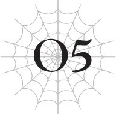

# Chương O5: Quỷ và Băng Long
*(The Ogre and the Ice Dragon)*

---

Ngọn lửa cuộn trào ra từ thanh katana trong tay tôi.

Lửa địa ngục thiêu rụi mọi sinh linh.

Nhưng lúc này, nó chỉ là một đốm lửa leo lét tội nghiệp, chỉ vừa đủ sưởi ấm cơ thể tôi một chút trước khi vụt tắt.

Thay vì ngọn lửa bùng cháy như thường lệ, thanh katana của tôi hiện tại đang bị bao phủ trong lớp băng dày.

“Nngaaah!”

Dẫu vậy, tôi vẫn chém lưỡi kiếm xuống sinh vật khổng lồ trước mặt.

Một tiếng keng vang lên, và những rung động sắc bén truyền thẳng qua tay tôi.

Đòn đánh làm vỡ lớp băng quanh lưỡi kiếm, nhưng thay vì chém đứt kẻ thù, cuộc tấn công của tôi lại bị đẩy văng bởi lớp vảy cứng cáp của nó.

Chúng quá bền bỉ, còn chuyển động của tôi thì quá đờ đẫn.

Cái lạnh thấu xương đang làm tôi chậm lại, khiến tôi không thể phát huy toàn bộ sức mạnh.

“Thật đáng buồn. Thật đáng thương hại làm sao.”

Con rồng, kẻ chẳng thèm bận tâm đến việc né tránh đòn tấn công của tôi, gửi đi một thông điệp thần giao cách cảm đầy khinh bỉ.

Bỏ ngoài tai điều đó, tôi vung thanh kiếm ở tay còn lại.

Lưỡi kiếm bao quanh bởi những tia sét chém vào lớp vảy, bắn ra những tia lửa màu tím.

Tuy nhiên, đúng như tôi lo sợ, nó thậm chí không để lại nổi một vết xước trên lớp vảy như kim cương kia.

“Vô ích thôi, bất luận ngươi có cố gắng bao nhiêu lần đi nữa. Ngươi quả thực sở hữu sức mạnh hiếm thấy, song đừng hòng mong đánh bại được ta. Ta sở hữu độ cứng cáp phi thường, dù có lẽ không bằng những người anh em hệ địa của mình.”

Con rồng nói chuyện bằng một chất giọng chậm rãi và cổ kính.

Bất chấp cách nói chuyện trang nghiêm đó, giọng nói vang lên trong tâm trí tôi lại giống như của một cô gái trẻ.

Hóa ra con rồng này là giống cái.

Con rồng thật đẹp đẽ, cơ thể nó uốn lượn thành một đường cong thanh thoát, được bao phủ hoàn toàn bởi lớp vảy giống như thạch anh.

Và nó điều khiển băng giá.

Sự hiện diện đơn thuần của nó cũng khiến nhiệt độ ở khu vực xung quanh giảm xuống mức đóng băng buốt giá.

Tôi lại bọc thanh kiếm của mình trong lửa một lần nữa.

Ngọn lửa tắt ngúm gần như ngay lập tức, nhưng tôi phải liên tục làm vậy để giữ cho cơ thể mình không bị đông cứng.

Nhiệt độ của cái lạnh quái quỷ này có thể là bao nhiêu độ cơ chứ?

Chắc chắn là dưới độ âm rồi.

Ngay cả Hokkaido vào mùa đông cũng chưa từng lạnh đến mức đóng băng cơ thể như thế này.

Tôi liên tục bị những luồng tuyết dày đặc táp vào người.

Bám chặt lấy làn da tôi, tuyết hút đi sức lực và nhiệt lượng cơ thể.

Kể từ khi chúng bị đóng băng, việc mặc quần áo thực chất lại khiến cái lạnh trở nên tồi tệ hơn, vì thế không lâu sau khi trận chiến bắt đầu, tôi đã vứt bỏ tất cả trừ những thứ che đậy thiết yếu nhất.

Dưới góc nhìn của một người ngoài cuộc, tôi đang chiến đấu trong tình trạng bán khỏa thân.

Nghe có vẻ buồn cười, nhưng tôi đang phải chiến đấu vì mạng sống của mình.

...Nhưng mà, tại sao tôi lại đang chiến đấu với con rồng này nhỉ?

Tôi không biết nữa.

Tôi cố gắng nhớ lại, nhưng đầu óc không thể suy nghĩ thấu đáo, cứ như thể tuyết đã chất đống cả ở bên trong đầu tôi vậy.

Tôi biết mình đang cố gắng đi đến một nơi nào đó.

Nhưng là nơi nào? Tôi không thể nhớ nổi.

Tôi muốn đi đâu đó, muốn trở về nhà ở một nơi cụ thể, nhưng tôi không thể nhớ đó là nơi nào.

Tất cả những gì tôi có thể làm lúc này là cố gắng đánh bại kẻ thù trước mắt.

“GRAAAAAH!”

“Thật đáng thương hại làm sao. Phải chăng ham muốn chiến đấu là ý nghĩ duy nhất còn sót lại trong tâm trí ngươi?”

Tôi tiếp tục tấn công bằng cả hai thanh kiếm của mình.

Hai tay tôi quá tê buốt để có thể cử động bình thường, và cơ thể bị đông cứng chậm chạp đến đau đớn.

Với những đòn tấn công như thế này, tôi sẽ không thể để lại nổi một vết xước trên vảy của con rồng này cho dù có tiếp tục bao lâu đi nữa.

Nhưng khi tôi cứ ngoan cố vung những đường kiếm thẳng tuột, con rồng cuối cùng cũng lùi lại như thể cảm thấy phiền phức.

“Hạ sát ngươi chỉ là một việc dễ dàng. Ta quả thực rất muốn làm thế, xem như lời cảm ơn vì ngươi đã tàn phá dãy núi của chúng ta. Nhưng Chúa tể của chúng ta đã ra lệnh cấm đụng vào những kẻ được gọi là người tái sinh các ngươi, thế nên thật đáng tiếc, ta không thể giúp ngươi yên nghỉ được.”

Con rồng vỗ cánh, bay vút lên không trung.

Tôi cảm thấy như nó đang nói điều gì đó quan trọng, nhưng tôi lại không tài nào hiểu được.

Tôi nghe thấy giọng nói của nó, nhưng ý nghĩa của những lời đó lại không thể lọt vào đầu tôi.

“...Dù vậy, nếu cái lạnh này kết liễu ngươi, thì đó chỉ là tai nạn ngoài ý muốn, chẳng phải lỗi tại ta.”

Khóe miệng con rồng hơi cong lên.

Tôi không biết làm cách nào để đọc nét mặt của một con rồng, nhưng trông nó có vẻ đắc ý, gần như là tinh nghịch.

Tuy nhiên, biểu cảm đó biến mất gần như ngay lập tức, chỉ để lại một luồng ánh sáng lạnh lẽo trong mắt con rồng.

Đó là một ánh nhìn phù hợp với kẻ trị vì địa ngục băng giá này.

“Mong ngươi sẽ tàn lụi nơi vùng đất băng giá này. Như vậy cũng là tốt nhất cho bản thân ngươi.”

Cuối cùng, với một cái nhìn đầy thương hại, con rồng bay đi.

Mối đe dọa trước mắt đã biến mất.

Nhưng trận bão tuyết xung quanh tôi vẫn không hề thuyên giảm.

Tôi có thể cảm thấy sinh lực của mình đang cạn kiệt chỉ bằng việc đứng yên ở đây.

Tôi phải khẩn trương lên.

...Nhưng là đi đâu chứ?

Tôi biết mình đã cố gắng đi đến một nơi nào đó.

Tại sao tôi không thể nhớ ra nhỉ?

Tôi biết đó là một nơi vô cùng, vô cùng quan trọng.

Nhưng bất chấp việc tôi cố gắng thế nào, tôi vẫn không tài nào nhớ nổi.

Tôi muốn nhớ lại, vậy mà một phần trong tôi lại hoàn toàn không muốn làm điều đó chút nào.

Bởi vì nơi đó không còn tồn tại nữa.

Tôi đã mất tất cả.

Gia đình tôi, lòng tự tôn của tôi, mọi thứ.

Tôi không có quyền quay trở lại nơi đó.

Nhất là sau khi tôi đã ăn thịt chính em gái mình...

“Giết.”

Giọng nói đó đã ra lệnh cho tôi.

Tôi cảm thấy chính mình đang bóp chặt một chiếc cổ nhỏ bé, gầy guộc.

“Ăn.”

Một mệnh lệnh khác.

Răng nanh của tôi cắm sâu vào da thịt, và vị máu lấp đầy khoang miệng tôi.

...Có phải tôi vừa bắt đầu nhớ lại một số chuyện lẽ ra không nên nhớ không?

Tôi không biết nữa.

Có lẽ như vậy lại tốt hơn.

Dù thế nào đi nữa, nếu không rời khỏi đây, tôi sẽ chết cóng mất.

Nên đi đâu bây giờ?

Trong lúc đứng đó suy nghĩ, tôi nhìn thấy thứ gì đó bay vút lên không trung từ mặt đất.

Đó là ma pháp sao?

Mà thôi, tôi cũng chẳng còn điểm đến nào khác.

Cứ tới đó xem thử vậy.

Hoàn toàn quên đi điểm đến ban đầu của mình, tôi bắt đầu bước đi về phía thứ đầu tiên thu hút ánh nhìn của tôi.

---

[◀ Chương trước: Chương 5: Tôi leo núi](05_im_mountain_climbing.md) | [Chương tiếp theo: Chương 6: Tôi bị lạc ▶](06_im_lost.md)
