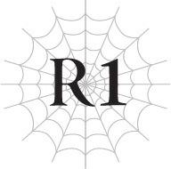

# Chương R1: Lão già trong bộ tang phục
*(The Old Man in Mourning)*

---

Bầu không khí im lặng nặng nề bao trùm chiếc xe ngựa đang lắc lư.

Ngay cả một lão già như ta cũng không muốn đùa giỡn trong bầu không khí thế này.

Phong cảnh tươi đẹp của hoàng đô trải dài ngay bên ngoài cửa sổ xe ngựa, nhưng bên trong, tâm trạng lại vô cùng u ám và u sầu.

Nhưng điều này cũng dễ hiểu thôi, nếu xét đến điểm đến của chúng ta.

Ngồi đối diện ta, Tiva nhắm mắt lại và cúi đầu đầy nghiêm nghị.

Tiva từng chịu trách nhiệm dẫn đầu quân đội đế quốc tấn công Sariella nhằm hỗ trợ Vương quốc Ohts, nhưng nhờ có cuộc tấn công vào Hạt Keren của những con nhện mà ta bám theo, cuộc xâm lược đó không còn khả thi nữa. Thay vào đó, chúng ta đang quay trở về nhà.

Tiva cũng đang điều tra một vụ việc khác: những vụ bắt cóc trẻ em xảy ra gần đây.

Những vụ bắt cóc này không chỉ xảy ra ở đế quốc mà trên toàn thế giới, và Tiva chịu trách nhiệm dẫn đầu cuộc điều tra đó.

Ban đầu, mọi người nghi ngờ có kẻ bắt giữ trẻ em rồi bán chúng làm nô lệ.

Nhưng giờ đây, quy mô đã trở nên lớn hơn nhiều.

Giả thuyết hiện tại là có một tổ chức quy mô lớn đang thực hiện những tội ác này vì một mục đích lớn hơn.

Nhằm đập tan tổ chức này và giải cứu những đứa trẻ bị bắt cóc, Tiva đã dẫn đầu một cánh quân đế quốc để truy đuổi bọn bắt cóc.

Tuy nhiên, cuộc tìm kiếm không mang lại nhiều kết quả.

Họ đã xác định được một sào huyệt của tổ chức, nhưng những kẻ duy nhất họ bắt được chỉ là lũ côn đồ được thuê.

Không hề có dấu vết của kẻ điều hành tổ chức, cũng như không có thêm manh mối nào gợi mở về mục đích thực sự của nó.

Nếu ngay cả cuộc điều tra quy mô lớn thế này cũng không tìm ra chút dấu vết nào của kẻ cầm đầu, thì hắn ta hẳn phải cực kỳ đáng gờm.

Và giờ đây, chúng ta đang hướng tới nhà của một trong những gia đình là nạn nhân của bọn bắt cóc này.

Một người mẹ có đứa con nhỏ bị bắt cóc ba năm trước.

Như ngươi có thể đoán được từ bầu không khí trong xe ngựa của chúng ta, tin tức chúng ta mang theo không hề tốt lành gì.

Không, đó thực sự là một tin cực kỳ tồi tệ.

Thế nhưng, đó không phải là tin về cái chết của đứa trẻ.

“Ngài Ronandt, tôi nghĩ ngài không cần phải đi vào trong cùng tôi đâu.”

Không thể chịu đựng nổi sự im lặng, Tiva lên tiếng.

Ông ta đã nói cùng một câu đó vô số lần kể từ trước khi chúng ta lên xe ngựa.

Tuy nhiên, câu trả lời của ta vẫn như trước.

“Ta phải lặp lại bao nhiêu lần nữa đây? Mang tin tức này đến là gánh nặng của ta.”

“Nhưng—”

“Đủ rồi!”

Giọng điệu sắc lẹm của ta ít nhất đã làm Tiva im lặng.

Ngay từ đầu, ta mới là người mang thông tin này về lại hoàng đô.

Ta sẽ không để bất kỳ ai khác gánh vác trách nhiệm này.

Tiva giữ im lặng, có lẽ đã nhận ra sự kiên quyết của ta.

Chiếc xe ngựa đi qua một khu phố quý tộc yên tĩnh, cuối cùng dừng lại trước một căn dinh thự.

Đối với nhà của một gia đình quý tộc, nơi này khá nhỏ.

Bản thân điều đó không có gì bất thường.

Thế nhưng, diện mạo tổng thể của căn dinh thự này lại tách biệt hoàn toàn so với những căn khác.

Khu vườn hoang tàn xơ xác, và bản thân ngôi nhà cũng bị hư hại và bẩn thỉu.

Chỉ cần nhìn thoáng qua cũng thấy rõ nơi này đã không được chăm sóc tử tế suốt nhiều năm.

Ngôi nhà ở trong tình trạng tồi tệ đến mức toàn bộ khuôn viên dường như toát ra một bầu không khí u ám, ngay cả giữa ban ngày.

Một quản gia với dáng vẻ uể oải đang đứng đợi chúng ta trước ngôi nhà hoang vắng này.

“Chào mừng các ngài. Cảm ơn các ngài đã đến.”

Người quản gia cúi chào cung kính.

Tiva và ta khẽ cúi đầu đáp lễ, rồi đi theo người quản gia vào trong.

Trái ngược với bên ngoài, bên trong căn dinh thự ít nhất cũng được chăm sóc ở mức tối thiểu.

Việc thiếu thốn đồ đạc khiến nó trông hơi ảm đạm, nhưng nơi này chắc chắn đã được lau dọn khá sạch sẽ.

Dẫu vậy, bầu không khí lạnh lẽo, u tối vẫn còn đó.

Người quản gia dẫn chúng ta đến phòng khách, nơi chủ nhân của ngôi nhà đang đợi sẵn.

“Cảm ơn các ngài đã đến đây hôm nay.”

Người phụ nữ chúng ta đến gặp cúi đầu theo thói quen.

Cử chỉ thuần thục đó vẫn giống hệt như những gì ta nhớ về lần cuối gặp cô ấy, nhưng diện mạo của cô ấy đã thay đổi rõ rệt.

Cô ấy trông… hốc hác.

Cô ấy từng là một mỹ nhân nổi tiếng ngay cả theo tiêu chuẩn của hoàng đô, nhưng giờ cô ấy chỉ còn là một cái bóng của chính mình trước đây.

Làn da cô ấy mất đi vẻ hồng hào, cơ thể trở nên yếu ớt gầy rộc, và cô ấy đã già đi rất nhiều so với tuổi thật.

Đã từng chứng kiến thời hoàng kim của cô ấy, cảnh tượng này thật sự gây sốc cho ta.

Biết rằng mình phải nói với cô ấy điều gì đó sẽ chỉ khiến cô ấy chìm sâu hơn vào tuyệt vọng, ngay cả ta cũng cảm thấy do dự.

Bây giờ ta đã hiểu tại sao Tiva cứ lặp đi lặp lại những lời đó.

Ông ta cố ngăn cản ta vì lợi ích của chính ta, nhưng có lẽ hơn hết, ông ta muốn tránh làm cho những người này phải chịu thêm đau khổ.

Nhưng dẫu vậy, ta không có lựa chọn nào khác.

Đây là điều cô ấy buộc phải biết.

“Thật vinh hạnh được gặp lại ngài, ngài Ronandt.”

“Đúng vậy.”

Thông thường, ta nên đáp lại rằng cô ấy trông vẫn khỏe, nhưng ta không thể mở miệng nói một lời nói dối trắng trợn như vậy.

Nhìn thái độ nghiêm nghị khác thường của ta và sự im lặng ủ dột của Tiva, người phụ nữ có lẽ đã đoán được chúng ta mang theo tin xấu.

Gương mặt vốn đã nhợt nhạt của cô ấy lại càng tái đi.

“Ta sẽ đi thẳng vào vấn đề.”

Sau khi chào hỏi xong và người hầu gái mang trà lên cho chúng ta, ta đi thẳng vào chuyện chính.

“Ngài Ronandt…”

“Nói vòng vo cũng chẳng ích gì đâu, Tiva.”

Tiva rõ ràng đang ra hiệu rằng ta đang đi quá nhanh, nhưng trong trường hợp này, ta nghĩ tốt nhất là không nên ngập ngừng.

Phu nhân của ngôi nhà này là một người phụ nữ thông minh.

Chắc chắn cô ấy đã có chút cảm giác về lý do tại sao ta lại yêu cầu gặp mặt hôm nay.

Nếu ta cứ kéo dài cuộc trò chuyện lúc này, ta sẽ chỉ khiến cô ấy lo lắng thêm.

Sớm muộn gì ta cũng phải nói cho cô ấy sự thật.

Vì vậy, tốt nhất là nên làm việc đó càng sớm càng tốt.

“Buirimus đã chết.”

Ban đầu, cô ấy không hề phản ứng trước những lời nói thẳng thừng của ta.

Hay đúng hơn, ta nên nói là cô ấy không thể phản ứng.

Cô ấy chết lặng không cả chớp mắt, khiến Tiva và ta cũng nín thở trong im lặng.

Thời gian cứ thế trôi qua, cho đến khi đôi mắt của người phụ nữ bắt đầu dao động.

Rồi, như thể ý nghĩa trong lời nói của ta cuối cùng đã thấm thía, cô ấy trải qua một sự thay đổi lặng lẽ nhưng vô cùng dữ dội.

Ngửa mặt lên, cô ấy lấy cả hai tay che mặt và bắt đầu nức nở với tiếng khóc nghẹn ngào.

Tiva và ta vẫn ngồi im lặng, lặng lẽ quan sát cô ấy.

Khi người phụ nữ khóc, ta lại hồi tưởng về những ký ức của mình với Buirimus.

Sự thật mà nói, ta không thường xuyên tương tác với Buirimus cho lắm.

Hắn là một nhà triệu hồi tài ba, một trong những bậc thầy nổi tiếng của đế quốc.

Do đó, chúng ta từng có dịp gặp gỡ vài lần, nhưng điều đó cũng đúng với hầu hết những nhân vật có tầm ảnh hưởng khác trong đế quốc.

Chúng ta không đủ thân thiết để ta có thể coi hắn là bạn bè, và mặc dù hắn có vẻ tôn kính ta như một pháp sư cấp cao hơn, ta cũng nghi ngờ liệu Buirimus có cảm thấy đặc biệt gần gũi với ta hay không.

Có thể nói chúng ta hơn mức người quen một chút, nhưng vẫn chưa phải là bạn bè.

Chúng ta lẽ ra đã chẳng có mối quan hệ đáng chú ý nào cả, cho đến khi sự cố đó xảy ra.

Sự cố khi chúng ta chạm trán thực thể vĩ đại đó trong Mê cung Lớn Elroe và thấy mình phải cùng nhau chiến đấu giành giật sự sống.

Chuyện xảy ra bốn năm trước, khi Buirimus và ta dẫn đầu một đội quân tinh nhuệ tiến vào Mê cung Lớn Elroe để truy lùng một con quái vật bí ẩn được nhìn thấy bên trong.

Theo lời các nhân chứng, nó tỏa ra một hào quang đáng sợ đến mức chỉ cần nhìn thoáng qua cũng thấy rõ con quái vật này là một thế lực không thể xem thường.

Đồng thời, cũng có tin đồn rằng hành động của nó thể hiện một mức độ trí thông minh đáng ngạc nhiên, vì vậy nhà triệu hồi Buirimus được cử đi với hy vọng hắn có thể thuần hóa con quái vật.

Dĩ nhiên, ta đi cùng họ để phòng trường hợp con quái vật thực sự tà ác đến mức cần phải bị tiêu diệt.

Nhưng sứ mệnh đã kết thúc trong thảm họa: ngoại trừ Buirimus và ta, thực thể vĩ đại đó đã quét sạch toàn bộ lực lượng.

Vào thời điểm đó, ta quá tự tin vào sức mạnh của mình.

Ta đinh ninh rằng chắc chắn không có con quái vật nào có thể mạnh hơn ta, mặc dù ta biết những con quái vật huyền thoại có tồn tại, vốn được biết đến là những sinh vật quá mạnh mẽ đối với bất kỳ con người nào.

Chính sự ngạo mạn này của ta đã dẫn tới thảm kịch trong mê cung đó.

Nếu ta không thiêu rụi tổ của thực thể vĩ đại đó một cách hấp tấp như vậy, có lẽ cuộc thảm sát đã có thể tránh được.

Ta biết dằn vặt về những chuyện như vậy cũng chẳng ích gì, dẫu vậy ta vẫn không thể ngừng nghĩ về nó.

Giờ đây, nếu mọi chuyện dừng lại ở đó, ta vẫn sẽ cảm thấy hối hận, nhưng ta nghi ngờ liệu mình có cảm thấy mắc nợ Buirimus nhiều đến thế không.

Chắc chắn ta vẫn cảm nhận được tội lỗi khi để thuộc hạ của hắn bị tiêu diệt sạch, nhưng có lẽ chúng ta vẫn có thể uống rượu cùng nhau như những người bạn đồng hành sống sót.

Thế nhưng, chuyện đã không diễn ra như vậy.

Các thế lực cấp cao của đế quốc quyết định đổ mọi tội lỗi cho tổn thất khủng khiếp của chúng ta hoàn toàn lên đầu Buirimus.

Thực thể vĩ đại đó, giờ đây được gọi là Cơn Ác Mộng của Mê Cung, đã tiến ra thế giới bên ngoài sau cuộc chạm trán của chúng ta và bắt đầu gây ra sự hỗn loạn.

Tin đồn lan truyền rằng nó rời khỏi mê cung là vì nhóm của chúng ta đã khiêu khích nó.

Ta không biết liệu đó có thực sự là lý do thực thể vĩ đại kia đi ra ngoài hay không.

Nhưng ngay cả khi không phải, thì thời điểm đó cũng vô cùng xui xẻo.

Ngay khi Cơn Ác Mộng rời khỏi mê cung, nó đã phá hủy một pháo đài của Ohts, sau đó định cư tại Sariella—kẻ thù không đội trời chung của Ohts—và bắt đầu hỗ trợ họ.

Đáng chú ý là Ohts lại là đồng minh của đế quốc.

Nếu đế quốc có những hành động gây ảnh hưởng tiêu cực đến đồng minh của mình, họ không thể nào ngó lơ được.

Bằng cách nào đó, ai đó phải đứng ra nhận trách nhiệm.

Và trách nhiệm đó đã thuộc về Buirimus.

Hắn và ta là hai người duy nhất sống sót.

Và không có bất kỳ sĩ quan cấp cao nào sẵn lòng bước ra gánh vác tội lỗi này.

Thông thường, điều đó có nghĩa là cả hai chúng ta đều phải chịu trách nhiệm, nhưng địa vị của ta đã ngăn điều đó xảy ra.

Ta là Trưởng pháp sư Hoàng gia của đế quốc. Nói cách khác, ta là pháp sư mạnh nhất đế quốc, và một số người thậm chí còn nói ta là pháp sư loài người mạnh nhất thế giới.

Có lẽ trước khi gặp thực thể vĩ đại đó, chính ta cũng tin là như vậy, nhưng giờ đây cái danh hiệu rỗng tuếch đó chẳng mang lại cho ta chút niềm vui nào.

Nhưng đối với đế quốc, nó mang rất nhiều ý nghĩa.

Họ có thể sử dụng danh tiếng và sức mạnh của ta để răn đe và kìm hãm các quốc gia khác.

Kể từ khi xung đột với ma tộc lắng dịu, Đế quốc Renxandt đã mất đi một phần uy tín của mình.

Vị Kiếm Vương sở hữu tài nghệ giúp ông được mệnh danh là Kiếm Thần đột nhiên mất tích, và khi không còn mối đe dọa từ ma tộc treo lơ lửng trên đầu, các quan chức triều đình bắt đầu trở nên thối nát.

Những quý tộc đê tiện bắt đầu phô trương quyền thế của mình, và ngay cả những kẻ tử tế hơn cũng đem Kiếm Vương đương nhiệm ra so sánh với người tiền nhiệm và nhận thấy ông ta còn nhiều thiếu sót.

Và dĩ nhiên, nếu bên trong đế quốc có sự bất hòa, thì các thế lực bên ngoài sẽ bắt đầu mất niềm tin vào sức mạnh của nó.

Vì vậy, nếu muốn tránh làm tổn hại đến vị thế vốn đang ngày càng bấp bênh của mình, các quan chức đế quốc không thể chấp nhận hy sinh ta, một trong những lá bài tẩy quý giá của họ.

Theo logic đó, những kẻ nắm quyền đã biến câu chuyện chính thức thành việc ta không hề liên quan đến sự cố ở Mê cung Lớn Elroe.

Thế là, mặc dù tội lỗi lẽ ra phải chia đều cho cả hai, nó lại đổ hoàn toàn lên vai một mình Buirimus.

Ta bị kết án quản thúc tại gia, chẳng khác gì một cái phủi tay nhẹ nhàng, trong khi Buirimus bị đày tới Dãy núi Huyền Bí ở phía tây bắc, một số phận nghiệt ngã hơn nhiều.

Dãy núi Huyền Bí là một dãy núi hiểm trở nằm ở biên giới, là nơi sinh sống của vô số quái vật mạnh mẽ.

Đó là một nơi nguy hiểm và hiếm khi được thám hiểm đến mức có thể sánh ngang với Mê cung Lớn Elroe, vì vậy việc bị đồn trú ở đó về cơ bản không khác gì một bản án tử hình.

Ấy vậy mà, Buirimus vẫn chấp nhận số phận đó và ra đi mà không hề lên tiếng phản đối quyết định này.

Ngay cả khi biết rằng vợ hắn cuối cùng đã sinh đứa con đầu lòng của họ.

“Đây quả là một vận xui xẻo. Tôi vừa biết tin đứa con của mình đã ra đời, vậy mà tôi lại phải ở trong hang động tối tăm này mà không thể nhìn thấy mặt con dù chỉ một lần.”

Ta nhớ nụ cười gượng gạo của Buirimus khi hắn nói điều này ở Mê cung Lớn Elroe.

Có sự cay đắng trong lời nói của hắn, nhưng nó đã bị lấn át bởi sự lạc quan trong ánh mắt.

Gương mặt của một người cha đang háo hức được gặp con mình.

Khi chúng ta đối mặt với đòn tấn công đáng sợ của sư phục, và hắn đã câu đủ thời gian để ta kích hoạt phép Dịch chuyển, ta không hề nghi ngờ rằng hắn đang nghĩ mình quyết không thể chết trước khi nhìn thấy gương mặt của đứa con mới chào đời.

Và hắn đã sống sót, chỉ để rồi bị gửi đi đối mặt với cái chết chắc chắn một lần nữa.

Ngay khi quá trình điều trị của hắn vừa kết thúc.

Điều đó có nghĩa là hắn chưa từng được gặp mặt đứa con của mình trước khi ra đi.

Ngoài việc bị cướp đi khoảnh khắc mà hắn hằng mong đợi, ngay cả khi hắn có thể trở về từ vị trí đồn trú nguy hiểm đó, hắn vẫn phải mang trên mình gánh nặng của kẻ chịu trách nhiệm chính thức cho một cuộc thám hiểm thất bại.

Và hoàn toàn không có gì đảm bảo rằng hắn có thể trở về bình an vô sự.

Dưới góc nhìn của người vợ, chồng cô vừa trở về với những vết thương chí mạng, chỉ để rồi bị gửi đi đối mặt với cái chết cận kề mà không có nổi một cơ hội đoàn tụ trước đó.

Ta chỉ có thể tưởng tượng được nỗi đau lòng mà cô ấy phải gánh chịu.

Một phần trách nhiệm cũng nằm ở ta.

Ta đã để mặc cho giới lãnh đạo đổ mọi tội lỗi lên đầu Buirimus, trong khi bản thân vẫn sống ung dung tự tại mà không phải chịu bất kỳ hậu quả nào.

Tất nhiên, để bù đắp cho cảm giác tội lỗi đó, ta muốn làm tất cả những gì có thể để hỗ trợ người vợ mà hắn bỏ lại phía sau.

“Cảm ơn ngài, nhưng chỉ riêng tấm lòng của ngài thôi cũng là quá đủ rồi.”

Khi ta phớt lờ án quản thúc tại gia để đến thăm căn dinh thự này, vợ hắn đã lịch sự từ chối lời đề nghị của ta.

“Tôi luôn biết rằng có khả năng một ngày nào đó chuyện gì đó sẽ xảy ra với chồng mình. Dù sao thì tôi cũng đã kết hôn với một người lính.”

Cô ấy trao cho ta một nụ cười thoáng qua.

Mặc dù cô ấy đang tỏ ra mạnh mẽ, nhưng ngay cả lớp trang điểm cũng không thể che giấu được vết đỏ hoe quanh khóe mắt.

“Tôi biết anh ấy đã làm tất cả những gì có thể để trở về nhà. Và vì lần này anh ấy đã sống sót trở về, tôi tin chắc anh ấy sẽ lại quay về một lần nữa.”

Lúc đầu cô ấy tỏ ra cam chịu, nhưng lời khẳng định đầy hy vọng này lại nói lên điều ngược lại.

Ta không biết phải mô tả cảm xúc của mình lúc đó thế nào, ngoại trừ việc có lẽ là sự xấu hổ.

Vào lúc đó, ta đã chuẩn bị sẵn tâm lý để nghe cô ấy chửi bới hay la hét vào mặt mình.

Nhưng ta chưa từng tưởng tượng rằng cô ấy lại hoàn toàn không hề có ý định trách móc ta.

Cô ấy không còn tâm trí đâu để bận tâm về bất kỳ ai ngoài chồng mình.

Ta thậm chí không chiếm nổi một góc nhỏ trong suy nghĩ của cô ấy.

Ta đã tự mãn cho rằng sự tồn tại của mình là một điều gì đó vô cùng quan trọng đối với cô ấy, và cô ấy sẽ đổ lỗi cho ta vì những gì đã xảy ra với Buirimus.

Nhưng trong mắt cô ấy, ta chẳng đáng bận tâm dù chỉ một chút.

Bằng cách nào đó, giữa chuyện này và cuộc chạm trán định mệnh với thực thể vĩ đại kia, ta bắt đầu nhận thức được một cách đau đớn rằng mình đã tự đánh giá quá cao bản thân.

Có lẽ sự lo lắng dành cho chồng mình, Buirimus, và đứa con mới chào đời của họ đã không còn chỗ trống nào để cô ấy nghĩ đến ta.

Dù thế nào đi nữa, rõ ràng là ta hoàn toàn vô nghĩa đối với cô ấy.

Mặc dù ta được mệnh danh là pháp sư mạnh nhất của nhân loại, ta nhận thức rõ rằng đối với cô ấy, ít nhất, ta chẳng qua chỉ là một kẻ dư thừa.

Vì thế, ta đã nhận ra cái tôi ích kỷ của mình và cảm thấy xấu hổ.

Cuối cùng, bất chấp sự từ chối của người vợ, ta vẫn tìm mọi cách để giúp đỡ cô ấy.

Ta cảm thấy tâm trí mình sẽ không thể yên lòng nếu không làm gì cả. Có lẽ việc này là vì lợi ích của chính ta nhiều hơn là vì Buirimus hay vợ hắn.

Ta cũng đã liên hệ với tất cả các mối quan hệ của mình để tìm cách hỗ trợ binh lính ở Dãy núi Huyền Bí, nơi Buirimus bị phái đến.

Phần còn lại phụ thuộc vào chính bản thân Buirimus.

Nhưng khi hắn đi vắng, một thảm kịch khác lại xảy ra.

Những vụ bắt cóc.

Đứa con của chính Buirimus nằm trong số những đứa trẻ bị bắt cóc trên khắp thế giới.

Tiva đã dẫn đầu một chiến dịch đặc biệt để truy lùng bọn bắt cóc, nhưng cho đến ngày nay vẫn chưa có tiến triển gì.

“Tôi xin lỗi vì đã để các ngài phải chứng kiến tôi trong tình trạng thế này.”

Giọng của vợ Buirimus vẫn còn run rẩy khi cô lấy lại bình tĩnh để tạ lỗi.

Tiva và ta nhanh chóng trấn an rằng cô ấy không có gì phải xin lỗi cả.

Sau chuỗi bất hạnh liên tiếp như vậy, không nghi ngờ gì khi trái tim cô ấy đã chạm tới giới hạn chịu đựng.

Và rồi lại là tin tức kinh hoàng này.

Ta chỉ có thể tưởng tượng được cảm xúc của cô ấy lúc này.

“Đã… có chuyện gì xảy ra với anh ấy?”

“Chúng ta vẫn chưa biết rõ chi tiết. Nhưng khi ta đến để kiểm tra tình hình của hắn, ta phát hiện toàn bộ đội quân của hắn đã bị quét sạch.”

Do một vài tình huống cụ thể, ta đã bị giáng chức và thuyên chuyển đến đồn trú tại một pháo đài ở phía bắc.

Nơi đó tương đối gần Dãy núi Huyền Bí, vì vậy ta đã nhận được thông tin về phân đội của Buirimus tại đó.

Khi biết tin liên lạc thường kỳ của họ đột ngột bị gián đoạn, ta đã nhanh chóng tự mình đến điều tra, để rồi chỉ tìm thấy cảnh tượng tàn phá hoang tàn.

“Mặc dù chưa thể chắc chắn, chúng ta tin rằng nguyên nhân là do một con quỷ dị chủng xuất hiện vào khoảng thời gian đó.”

Buirimus rất có thực lực, thế nên không có nhiều quái vật có thể dễ dàng quét sạch toàn bộ đội quân của hắn như vậy.

Và vào khoảng thời gian đó, tin đồn vừa mới bắt đầu lan truyền về một con quỷ mạnh mẽ đã sát hại nhiều mạo hiểm giả.

Đây chắc chắn không phải là sự trùng hợp ngẫu nhiên.

“Quyết định đã được đưa ra là ta sẽ sớm dẫn đầu một lực lượng đặc biệt để tìm kiếm và tiêu diệt con quỷ này. Mặc dù đây chỉ là niềm an ủi nhỏ nhoi, ta chắc chắn sẽ báo thù cho chồng cô.”

“Và tôi cũng sẽ làm mọi cách trong khả năng của mình để đưa con của cô trở về nhà sớm nhất có thể,” Tiva hứa.

“… Cảm ơn các ngài.”

Vợ của Buirimus yếu ớt cúi đầu.

“Ngài nghĩ cô ấy sẽ ổn chứ?”

Khi chúng ta ngồi trong xe ngựa trên đường trở về từ dinh thự, Tiva nhìn đăm đăm ra ngoài cửa sổ.

Ông ta không nói rõ chủ đề, nhưng không nghi ngờ gì khi ông ta đang ám chỉ đến vợ của Buirimus.

“Ai mà biết được chứ?”

Ngay cả ta cũng không biết câu trả lời. Dù có cố gắng thế nào, ta cũng không thể mong thấu hiểu được cảm xúc của một người phụ nữ vừa biết tin chồng mình đã qua đời và đứa con của mình thì bị bắt cóc.

Ta không có tư cách để tùy tiện nói rằng, Cô ấy rồi sẽ ổn thôi.

“Điều đó phụ thuộc vào công việc của ngươi đấy, Tiva.”

Có người nói rằng một người mẹ sẽ lấy lại được sinh khí nếu đứa con thất lạc của mình được đưa trở về, vì vậy có lẽ vợ của Buirimus cũng có thể hồi phục nếu mọi chuyện diễn ra suôn sẻ.

“Ngươi phải đối mặt với chuyện này bằng tất cả sức lực của mình.”

Tiva nặng nề gật đầu.

Dĩ nhiên, ta không hề cho rằng ông ta từng xử lý cuộc điều tra này một cách hời hợt.

Tiva luôn là một người làm việc chăm chỉ, và ông ta có những lý do riêng để đặc biệt nghiêm túc với vụ án này.

“Tôi thề là mình sẽ đưa những đứa trẻ đó sống sót trở về. Tôi thề đấy.”

Giọng nói của ông ta mang một sắc thái sắc nhọn mà ông ta không thể hoàn toàn che giấu.

Nó vượt qua cả sự phẫn nộ chính nghĩa đối với bọn bắt cóc, chạm tới một cơn giận sâu sắc và cá nhân hơn.

Ngươi thấy đấy, Tiva có một đứa con trai.

Hay đúng hơn là từng có.

Con trai ông ta đã kết hôn, và họ thậm chí đã cho ông ta một đứa cháu.

Đứa trẻ được sinh ra vào khoảng cùng thời điểm trong năm với con trai của Buirimus.

Đó là đứa con đầu lòng của con trai ông ta và là đứa cháu đầu tiên của Tiva.

Niềm hạnh phúc không gì sánh bằng.

Nhưng sau một ngày định mệnh, con trai ông ta cùng gia đình của nó đã ra đi và không bao giờ trở lại.

Chiếc xe ngựa của họ đã gặp tai nạn.

Tuy nhiên, trong một cuộc điều tra sau đó, người ta phát hiện ra thảm kịch này hoàn toàn không phải là một vụ tai nạn mà là do ai đó cố tình dàn dựng.

Thực tế, các phương thức thực hiện rất giống với cách thức hoạt động của tổ chức bắt cóc.

Có phải chúng đã nhắm vào cháu của Tiva và vô tình giết chết cả ba người?

Hay chúng có một lý do nào khác?

Ta không biết điều đó, nhưng điều này đồng nghĩa với việc Tiva đã mất đi con trai, con dâu và cháu nội cùng một lúc.

Do đó, người đàn ông này có một lý do cực kỳ mãnh liệt để lùng sục tổ chức bắt cóc.

Ta chắc chắn rằng ông ta cũng cảm thấy mãnh liệt về chuyện này không kém gì vợ của Buirimus.

“Ta sẽ hỗ trợ ngươi trong khả năng tốt nhất của mình.”

Giờ mọi chuyện đã thế này, ta không thể chỉ đơn giản là ngồi yên lặng nhìn.

Ta có một linh cảm đáng sợ về tổ chức này.

Một cảm giác rằng nếu để mặc bọn họ, chuyện này có thể dẫn tới một điều gì đó thực sự kinh hoàng.

“… Ngay cả sau khi ngài bị giáng chức sao?”

Tiva nhìn ta với vẻ dửng dưng.

Cái thằng này…!

Ta lườm ông ta trước lời châm chọc hiểm hóc này.

Vì những lý do hoàn toàn nằm ngoài tầm kiểm soát của ta, hiện tại ta đã bị đẩy lên phía bắc.

Thực tế là hôm nay ta không được phép có mặt ở hoàng đô, thế nên ta không thể tự do di chuyển.

“Hừ! Lại có thể đày ta đi chỉ vì một lý do vô lý như vậy!”

“Không đâu, tôi nghĩ đó là hình phạt thích đáng cho việc suýt nữa làm chết một Anh hùng. Thực tế, ngài nên thấy mừng vì mình đã không bị tử hình đấy.”

“Đó chỉ là một chút huấn luyện vụn vặt thôi! Nói suýt làm chết người là phóng đại quá mức!”

Lý do ta bị giáng chức chỉ đơn giản là ta đang huấn luyện Julius, đệ tử đầu tiên của mình.

Thằng bé yêu cầu ta nhận nó làm đệ tử, vậy nên ta đã dạy dỗ nó.

Thế nhưng, quê hương của Julius và cái gọi là Thần Ngôn Giáo phản đối phương pháp của ta, và Đế quốc Renxandt thật đáng tiếc lại đồng tình, thế nên ta đã bị trục xuất đến một đồn trú xa xôi ở phía bắc dù ta chẳng làm gì sai trái chút nào.

Ta cho rằng ngay cả đế quốc cũng không thể bao che cho ta nếu các quốc gia khác nổi giận với ta.

Nhưng tại sao họ lại có thể tức giận đến thế chỉ vì một chút huấn luyện nhỏ nhoi kia chứ?!

“Không đâu, thứ đó khó mà gọi là huấn luyện được. Theo tiêu chuẩn của bất kỳ ai khác, đó là tra tấn đấy, ngài hiểu chứ? Ngài phải nhận ra rằng, ngài Ronandt, quan niệm về lẽ thường tình của ngài không hề giống với phần còn lại của thế giới đâu.”

“Hừ!”

Thật là nực cười!

Ta chỉ bắn thằng bé bằng lượng ma pháp nhỏ nhất để rèn luyện khả năng kháng tính của nó thôi mà!

Trừng phạt ta vì một việc như vậy thật chẳng có lý lẽ gì cả!

“Được rồi. Vậy thì ta sẽ cứ làm bất cứ điều gì có thể. Bắt đầu bằng việc báo thù cho cái chết của Buirimus.”

Ngồi trong xe ngựa, tâm trí ta đã hướng về con quỷ đã sát hại Buirimus.

---

[◀ Chương trước: Chương O2: Ma kiếm của Quỷ](o2_the_ogres_magic_swords.md) | [Chương tiếp theo: Chương 3: Tôi no căng bụng ▶](03_im_stuffed.md)
