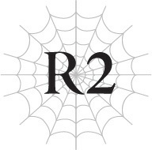
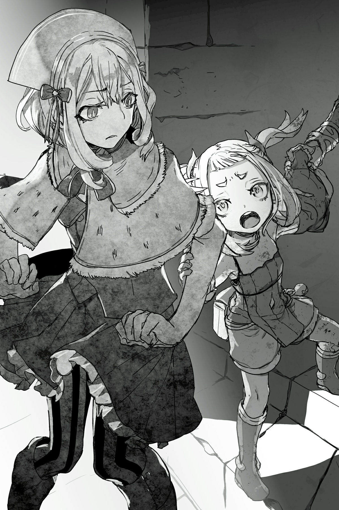

# Chương R2: Lão già chiến đấu với Quỷ
*(The Old Man Fights an Ogre)*

---

“Hừ...”

“Có chuyện gì thế hả Sư phụ? Người định nghẻo luôn vì già quá rồi hay sao?”

Ta cốc thẳng một cú đấm lên đầu đứa đệ tử thứ hai cực kỳ vô lễ của mình.

“Đau quá! Cái quái gì thế hả ông già?! Người mất trí rồi hay sao mà lại cốc đầu một thiếu nữ như con thế hả?! Khoan, không, con xin lỗi. Sư phụ mất trí lâu rồi chứ đâu phải mới đây.”

Ngay cả một cú cốc đầu nhẹ cũng không đủ để chặn cái miệng độc địa của con bé lại. Nó vốn đã thô lỗ từ xưa, nhưng theo ta thấy thì vài năm qua nó chỉ có tệ thêm mà thôi.

Ban đầu ta chỉ thuê Aurel làm trợ lý phụ việc, nhưng sau một chuỗi sự kiện bất ngờ khiến ta nhận ra tiềm năng ma pháp của con bé, ta đã nhận nó làm đệ tử thứ hai.

Cụ thể, chuyện xảy ra khi đệ tử đầu tiên của ta, Julius, đang nửa bước đặt chân vào cửa tử, và Aurel đã dùng `[Ma pháp Trị liệu]` để cứu thằng bé.

Hãy tưởng tượng nỗi kinh ngạc của ta khi chứng kiến Aurel đầm đìa nước mắt tái hiện lại `[Ma pháp Trị liệu]` chỉ dựa vào những gì con bé từng thấy trước đó.

Suy cho cùng, sử dụng ma pháp mà không có sự hỗ trợ của kỹ năng là một kỳ tích mà ta mới chỉ được thấy duy nhất sư phụ thực hiện.

Dù chỉ là trong khoảnh khắc, nhưng khi con bé hét lên, “Ngài Anh hùng, đừng chết!” và tái hiện thành công một phép trị liệu, ta đã vô cùng khâm phục.

Nếu được huấn luyện đầy đủ, con bé có thể mạnh ngang ta—không, có lẽ còn hơn thế nữa.

Vì vậy, ta đã có phần ép buộc con bé làm đệ tử của mình, nhưng thực tế đáng buồn là nó có vẻ hoàn toàn thiếu động lực.

Dù vậy, tài năng của con bé đã vượt qua cả những pháp sư trưởng thành thông thường, nên mắt nhìn người của ta quả không sai.

“Vấn đề là, ông già, cái đầu của người bị nhồi nhét đến nổ tung bởi toàn ba cái ma pháp chết tiệt rồi. Nếu nó thấm vào người rồi làm người phát nổ hay gì đó, thì con đoán là người đang làm việc thiện tích đức cho cả thế giới này đấy.”

…Không, chắc chắn không phải do ta tưởng tượng rồi. Những lời lẽ xấc xược con bé dành cho ta đã phong phú hơn rất nhiều theo năm tháng.

Khi ta lại lặng lẽ giơ nắm đấm lên, đứa đệ tử của ta rú lên một tiếng kỳ lạ rồi né đi, ẩn nấp sau lưng một lão kỵ sĩ mặc giáp vàng.

“Ngài Ronandt! Ngài có nghĩ việc một kỵ sĩ ra tay với một đứa trẻ là có tinh thần hiệp sĩ không hả?!”

Cá nhân mặc giáp đó hét lớn đến mức ta lo cho màng nhĩ của mình.

“Ta có phải kỵ sĩ đâu, nên chuyện đó chẳng can hệ gì đến ta cả. Hơn nữa, đây chỉ là phương pháp dạy dỗ của ta mà thôi. Ngươi chưa từng nghe câu 'thương cho roi cho vọt' sao? Có trách thì trách đứa đệ tử thứ hai này của ta vì đã cố tình bỏ trốn ấy.”

“Ồ hố! Ra là thế!”

Lão kỵ sĩ, người quá dễ dàng bị thuyết phục bởi lời nói của ta, tên là Nyudoz.

Như ngươi có thể đoán, ông ta là một kẻ đầu óc chỉ toàn cơ bắp.

Nói theo cụm từ của Aurel, đầu óc ông ta chẳng có gì ngoài cơ bắp, y hệt như phần còn lại của cơ thể vậy.

Nói cách khác, ông ta là một tên ngốc.

Tuy nhiên, là một cựu binh từng chiến đấu bên cạnh Kiếm Vương tiền nhiệm, sức mạnh của ông ta là không thể bàn cãi.

Ông ta là một bậc thầy kiếm thuật, có lẽ cùng đẳng cấp với chính Kiếm Vương tiền nhiệm.

Mặc dù ông ta cũng lớn tuổi như ta, nhưng ông ta vẫn đang tại ngũ và canh giữ pháo đài phía bắc.

Tất nhiên, đây chỉ là mệnh lệnh từ giới quý tộc, những kẻ không muốn để một Nyudoz xuất thân thấp kém tiếp cận quá gần trung tâm quyền lực, nhưng một kẻ đơn giản như ông ta thì dù sao vẫn thấy hạnh phúc hơn khi được vung kiếm giữa trận chiến hỗn loạn.

Hôm nay, ông ta hỗ trợ ta dẫn đầu cuộc tấn công chống lại con quỷ đó dưới tư cách là chỉ huy thực địa, nhưng ông ta quá khờ khạo để có thể thực sự chỉ huy bất kỳ cái gì.

“Được lắm! Vậy thì đi chịu đòn đi!”

“Cái quái gì thế hả, logic kiểu gì vậy?!”

Nyudoz túm lấy đứa đệ tử thứ hai của ta và đẩy nó ra trước mặt ta.

Ông ta đúng là một tên ngốc mà.

“À, bỏ đi. Nhưng Nyudoz, ngươi có thể hạ bớt âm lượng xuống một chút không? Tai ta sắp chịu không nổi rồi đây.”

“Ồ hố! Thế ta phải làm thế nào để hạ âm lượng xuống đây?”

…À, bỏ đi.

Không hiểu sao gã khờ này lại được tất cả binh lính yêu mến. Quả thật, một số thứ trên thế giới này hoàn toàn vượt ngoài tầm hiểu biết của ta.

Khi ta đang nhìn ông ta đầy ngao ngán, một lính truyền tin chạy tới thông báo rằng binh lính đã vào vị trí.

“Ta hiểu rồi. Vậy là chuẩn bị đã hoàn tất.”

“Đúng thế! Không con quỷ nào có cơ hội chống lại thanh kiếm của ta và ma pháp của ngài cả! Vì những người anh em đã ngã xuống, hãy biến con thú này thành vết rỉ sét trên kiếm của ta!”

Ta không thể không đồng tình hoàn toàn với lời tuyên bố của Nyudoz, dẫu không mấy thích thú với âm lượng của ông ta.

Với Nyudoz ở phía trước và ta ở phía sau, không kẻ thù bình thường nào có lấy một cơ hội nhỏ nhoi.

Tuy nhiên, con quỷ này không phải là một kẻ thù bình thường.

“Đệ tử Hai. Ngươi có nhớ thông tin tình báo chúng ta nhận được về con quỷ này không?”

“Vâng. Sư phụ biết rõ con nhớ mà.”

“Vậy thì, coi như luyện tập, hãy đọc lại các đặc điểm của một con quỷ thông thường và những đặc điểm độc nhất của con này xem.”

Thay vì làm theo hướng dẫn của ta, đứa đệ tử nhìn ta đầy nghi ngờ.

“Có vấn đề gì sao, đứa trẻ kia?”

“Không, không có gì. Con chỉ tự hỏi—không phải sư phụ đã quên sạch những gì hội mạo hiểm giả nói với chúng ta rồi đấy chứ?”

“Nói bậy. Dĩ nhiên là không. Chắc chắn là tên ngốc này quên thôi.”

Ta chỉ vào Nyudoz, và Aurel lập tức hiểu ra.

Nyudoz đang đứng khoanh tay, vẻ mặt đầy nghiêm túc.

Nhưng dù biểu cảm của ông ta có nghiêm nghị thế nào, rõ ràng là ông ta đã quên sạch những gì chúng ta được nghe.

Dù sao thì não của lão ta cũng chỉ toàn cơ bắp. Ta chắc chắn bất kỳ lời giải thích nào cũng chỉ đi từ tai này qua tai kia mà thôi.

Kể cả khi thông tin đó được đổi bằng mạng sống của vô số mạo hiểm giả.

“Hắng giọng. Một con quỷ bình thường thì không có gì to tát, phải không? Chúng là quái vật dạng người, và trí thông minh của chúng thay đổi tùy theo từng con. Nhưng hầu hết chúng được cho là chỉ thông minh ngang một đứa trẻ loài người khoảng ba tuổi, nên chúng không thể làm gì nhiều ngoài việc bập bẽ vài từ đơn giản và vung vẩy vũ khí. Một con quỷ cấp thấp có vóc dáng tương đương một người đàn ông trưởng thành. Khi tiến hóa, chúng sẽ lớn hơn, và nghe nói một Quỷ Vương có chiều cao gấp vài lần con người. Chúng nhìn chung thuộc hệ sức mạnh, đúng như mong đợi, nên chúng không quá nhanh nhưng đòn tấn công lại cực kỳ mạnh. Vì chúng là dạng người nên một vài con có thể có ma pháp hoặc các kỹ năng bất ngờ khác, nhưng loại đó hiếm lắm. Hầu hết các con quỷ di chuyển theo bầy và hiếm khi rời khỏi lãnh thổ của mình. Ừm… con đoán chỉ có thế thôi? Như vậy đủ chưa hả ông già?”

“Quả đúng như vậy.”

Ta gật đầu đồng tình.

Lời giải thích của Đệ tử Hai khá chính xác.

“Vậy thì, dựa trên những điều đó, ngươi có thể mô tả con quỷ chúng ta sắp đối mặt không?”

“Dựa trên những điều đó á? Ý con là, chúng ta có chắc con quái đó thực sự là một con quỷ không thế? Nó hầu như chẳng có đặc điểm nào con vừa liệt kê cả.”

Hửm. Con bé không sai, nhưng ta muốn nó đi thẳng vào lời giải thích hơn.

“Con quỷ này sở hữu cả tá kỹ năng đặc biệt, và có vẻ nó cực kỳ thông minh. Rất nhiều chi tiết vẫn còn nằm trong vòng bí ẩn, nhưng chúng ta biết rằng trong số các kỹ năng của nó có một kỹ năng giúp phục hồi hoàn toàn tức thì. Vết thương, ma lực, và thậm chí cả năng lượng của nó có thể đột ngột hồi đầy trở lại từ hư không. Ngoài ra, các chỉ số của nó cũng có thể tạm thời tăng vọt lên một cách điên cuồng. Theo như chúng ta biết thì hiệu ứng đó không kéo dài lâu, nhưng nó lại cực kỳ nguy hiểm khi kết hợp với khả năng tự phục hồi kia. Và điều quan trọng nhất là nó có vẻ có một kỹ năng cho phép chế tạo ma kiếm.”

“Ngươi bảo ma kiếm cơ à?!”

Tại sao Nyudoz chỉ phản ứng với phần cuối cùng đó chứ?

Thực ra, tại sao ông ta lại phản ứng như thế trong khi chúng ta đã nghe cùng một lời giải thích tại hội mạo hiểm giả rồi?

Lần đầu tiên ông ta cũng phản ứng y hệt, nhưng rõ ràng là bây giờ ông ta đã quên sạch rồi.

“Một con quỷ dùng ma kiếm à, được đấy! Có lẽ thanh bảo kiếm yêu quý của ta đã tìm được một đối thủ xứng tầm rồi!”

Kiếm của Nyudoz cũng là một thanh ma kiếm.

Ta đoán điều này đã khơi dậy máu hiếu thắng của ông ta…

“Dạ, con không nghĩ nó đơn giản thế đâu. Nó không chỉ sở hữu một thanh ma kiếm, mà nó có kỹ năng có thể chế tạo ma kiếm cơ, nhớ không hả?”

Một con quỷ sở hữu ma kiếm thì bản thân điều đó đã đủ đáng ngạc nhiên rồi, nhưng một kỹ năng có thể chế tạo ra ma kiếm thì hoàn toàn là chuyện chưa từng nghe thấy.

“Hửm?! Vậy thì chính xác là nó khác biệt ở chỗ nào cơ chứ?!”

“Nó khác biệt một trời một vực đấy, đồ ngốc.”

Một con quái vật sở hữu ma kiếm đã là tệ rồi, nhưng một con quái vật có thể tự tạo ra ma kiếm bằng kỹ năng thì còn tệ hơn gấp bội.

Nếu nó chỉ tình cờ có được ma kiếm, thì chúng ta chỉ cần lo lắng về khả năng của những thanh kiếm đó mà thôi.

Dù thế nào thì ma kiếm vẫn là vũ khí mạnh mẽ, nhưng khả năng của chúng là có hạn.

Nếu biết một thanh ma kiếm có thể làm được những gì, sẽ có vô số cách để đối phó với nó.

Nhưng nếu con quỷ đó có thể tự do tạo ra ma kiếm, và đặc biệt là nếu nó có thể thay đổi khả năng của những thanh ma kiếm đó theo ý muốn, thì việc chuẩn bị trước là hoàn toàn bất khả thi.

Chúng ta được thông báo rằng con quỷ chiến đấu bằng hai thanh ma kiếm—một thanh hỏa và một thanh lôi—nhưng hoàn toàn có khả năng tình hình đã thay đổi kể từ đó.

Chúng ta không có cách nào biết được đối thủ đang mưu tính điều gì.

Và nếu nó có thể tạo ra ma kiếm, điều đó có nghĩa là nó có thể sở hữu số lượng kiếm vô hạn.

Một thanh ma kiếm đã đủ nguy hiểm rồi, nên sở hữu nhiều hơn một thanh là mối đe dọa nghiêm trọng.

Và con quỷ này thậm chí còn có những thanh ma kiếm mà nó không ngần ngại phá hủy trong quá trình chiến đấu.

Xem ra nó có thể sản xuất ra chúng mà không có giới hạn.

Trên thực tế, những mạo hiểm giả chiến đấu với con quỷ trước đó đã bị quét sạch bởi các thanh ma kiếm phát nổ.

Ma kiếm nhìn chung là quá giá trị để dùng một lần rồi vứt bỏ, nhưng nếu có thể chế tạo chúng với số lượng không giới hạn thì lại là chuyện hoàn toàn khác.

Con quỷ này có thể tạo ra nhiều loại ma kiếm khác nhau và sử dụng chúng như đồ dùng một lần mà không hề do dự.

Thật là một đối thủ phiền phức.

“Ngươi đã hiểu chưa? Hửm. Xem ra là chưa rồi.”

Ta đã cố gắng giải thích tại sao một kỹ năng tạo ra ma kiếm lại nguy hiểm đến thế, nhưng phản ứng duy nhất của Nyudoz là khói bốc ra từ tai khi ông ta cố gắng xử lý thông tin.

Ta cứ nghĩ mình đã diễn đạt một cách đơn giản nhất có thể rồi, nhưng xem ra ngay cả điều đó cũng quá khó khăn đối với một tên ngốc cỡ này.

“Nói cách khác, ta đoán là, kẻ địch này rất mạnh.”

“Ồ hố! Phải rồi, ta đã hiểu hết mọi chuyện rồi!”

Không, ta không nghĩ ngươi hiểu đâu…

“Vậy chúng ta rà soát lại chiến thuật nhé?”

Phớt lờ Nyudoz, ta quay sang nhìn đứa đệ tử thứ hai của mình.

Đệ tử của ta cảm nhận được ý nghĩa đằng sau ánh nhìn đó và bắt đầu giải thích những điểm cơ bản trong chiến thuật của chúng ta.

“Vâng thưa sư phụ. Chiến thuật của chúng ta rất đơn giản. Chúng ta sẽ bố trí binh lính xung quanh khu vực để con quỷ không thể chạy thoát. Sau đó, chúng ta sẽ dội một cơn mưa ma pháp khổng lồ lên đầu gã đó, áp sát tên khốn và kết liễu nó.”

Hửm. Được rồi. Ta đoán thế là đúng.

Tuy nhiên, ta vẫn ước con bé có thể giải thích sâu sắc hơn một chút.

Lý do ta bắt đầu bằng một đòn tấn công ma pháp diện rộng phủ đầu là để vô hiệu hóa những thanh ma kiếm phát nổ đã giết chết hơn một nửa số mạo hiểm giả trong trận chiến trước.

Những thanh kiếm đó rõ ràng đã được chôn dưới lòng đất và sẽ phát nổ khi bị giẫm lên.

Rất có thể một mức độ áp lực nhất định sẽ kích nổ chúng.

Đây là thông tin quý giá được trả bằng máu của biết bao mạo hiểm giả.

Chúng ta không thể biết chính xác kẻ địch sở hữu bao nhiêu quân bài tẩy, nhưng ít nhất chiến thuật này sẽ loại bỏ được một trong số đó.

Thật khó để nói liệu thông tin này có đáng giá bằng mạng sống của tất cả các mạo hiểm giả đã hy sinh hay không, nhưng dù thế nào thì họ cũng đã chết, nên chúng ta phải chấp nhận điều đó và hành động dựa trên thông tin này với lòng thành kính và sự tôn trọng sâu sắc.

“Câu chuyện đại khái là thế đó, Sư phụ. Bọn con trông cậy cả vào người đấy nhé.”

“Ngươi nói gì thế? Đó là việc của ngươi kia mà?”

“Hả?”

Đệ tử Hai chằm chằm nhìn ta một lúc, rồi chậm rãi tự chỉ tay vào mình.

Ta im lặng gật đầu.

“Cái gìii?! Con á?!”

Con bé lại phản ứng thái quá như thường lệ.

Tất cả những gì nó cần làm chỉ là quét sạch khu vực bằng ma pháp mạnh mẽ.

“Con không làm được đâu! Có chết cũng không!”

“Thiếu nữ kia! Cháu không bao giờ được coi điều gì là bất khả thi trước khi thử làm nó! Cháu sẽ không biết mình có thể làm được những gì trừ khi cháu cố gắng!”

Lần này, Nyudoz thực sự đã nói một lời rất có lý.

Quả thật, ta không nghĩ mình đang yêu cầu một điều bất khả thi ở con bé chút nào.

Ta đề xuất việc này chỉ vì tin rằng đệ tử của mình có thể làm được.

“Đúng vậy, thử một chút thì có hại gì đâu. Ngay cả khi ngươi thất bại, điều tồi tệ nhất xảy ra chỉ là ta sẽ cười nhạo ngươi suốt nhiều giờ sau đó thôi.”

“Oa, Sư phụ đúng là kẻ tồi tệ nhất!”

“Ta tin ý ngươi là người thầy tuyệt vời nhất.”

Đệ tử của ta tiếp tục mè nheo thêm một lúc, nhưng cuối cùng con bé cũng nhận ra ta không có ý định nhượng bộ và vừa lầm bầm cằn nhằn vừa bắt đầu vận ma pháp.

Hửm. Có vẻ con bé đã chọn phép `[Thiên Trụy]` của `[Cuồng Phong ma pháp]`.

Đó là một phép tấn công diện rộng, giáng một luồng không khí mạnh xuống mặt đất.

Nó không có tính sát thương cao cho lắm, chỉ đủ mạnh để làm chậm bước tiến của một đội quân, nên đây không phải là một phép thuật quá phổ biến.

Tuy nhiên, khi đạt đến cấp độ năng lực của ta, ngươi có thể dễ dàng nghiền nát ai đó đến chết bằng phép này.

Và ưu điểm của phép này là tiêu hao tương đối ít MP mặc dù có phạm vi rộng lớn.

Đây là phép thuật hoàn hảo để người đệ tử trẻ tuổi của ta có thể bao phủ toàn bộ khu rừng của con quỷ.

Một quyết định sáng suốt.

Tuy nhiên, cấu trúc thuật thức chậm chạp và vụng về của con bé chứng tỏ nó vẫn còn một chặng đường dài phía trước.

Sau một lúc lâu, Đệ tử Hai hoàn thành phép thuật của mình và kích hoạt nó.

Luồng không khí nén đập mạnh xuống đất, làm rung chuyển cả mặt đất.

Các cành cây trong khu vực gãy răng rắc, và tuyết chất đống trên mặt đất bắn tung tóe lên không trung.

Thế rồi, một loạt dư chấn khác chạy dọc mặt đất, khác hẳn với những rung chấn do phép `[Thiên Trụy]` gây ra.

Những cái cây chưa bị phá hủy hoàn toàn bởi phép của đệ tử ta bị gãy gập ngay từ thân trước khi bị thổi bay, và tuyết biến mất trong những vụ nổ lửa phun trào.

Cảnh tượng trông giống như một phép thuật hệ hỏa cực mạnh vừa được triển khai trước mắt chúng ta.

“Trời đất ơi.”

Bất giác, ta lẩm bẩm trong sự ngạc nhiên và ngưỡng mộ.

Phép thuật của Aurel đã kích hoạt các thanh ma kiếm phát nổ mà con quỷ đã đặt dưới đất, đúng như dự kiến.

Tuy nhiên, ta chưa bao giờ ngờ kết quả lại dữ dội đến thế này.

Phải có bao nhiêu thanh ma kiếm chôn dưới đất mới có thể gây ra sức tàn phá khủng khiếp như vậy chứ?

Nếu chúng ta lao vào mà không có kế hoạch, chuyện này chắc chắn sẽ dẫn đến màn kịch thứ hai của thảm kịch đã xảy đến với đội mạo hiểm giả đầu tiên.

Chúng ta sẽ phải bước đi cẩn thận hơn nữa kể từ đây.

Khi trợ lý của ta nhìn đăm đăm vào ngọn lửa trước mặt, con bé khuỵu xuống đất trong sự bàng hoàng.

Mặc dù ta đoán một phần của điều đó là do kiệt sức vì đã tiêu hao quá nhiều ma lực.

“Cơ hội đến rồi! Toàn quân, xông lên!”

Ngay khi các vụ nổ dứt hẳn, Nyudoz hét lớn ra lệnh.

Tiếng hét không lớn bằng các vụ nổ vừa rồi, nhưng chắc chắn tất cả binh lính đều nghe thấy.

Họ bắt đầu di chuyển ngay lập tức.

Nhưng nếu họ nghe thấy, con quỷ chắc chắn cũng đã nghe thấy.

Không nghi ngờ gì nữa, nó sẽ sớm hành động.

“Nyudoz, ta sẽ cùng ngươi lên tuyến đầu. Đệ tử Hai, lùi lại phía sau.”

“Ồ hố!”

“Rõ thưa sư phụ.”

Nyudoz và ta tiến bước cùng các binh lính.

Vì đệ tử của ta đã cạn kiệt ma lực, tốt nhất con bé nên tránh xa tiền tuyến.

Tập trung cao độ các giác quan, ta tiến về phía nơi mà sự hiện diện của con quỷ có vẻ mạnh nhất.

Mặt đất bị cày xới bởi các vụ nổ, những thân cây ngã đổ cũng làm chậm bước tiến của chúng ta.

Băng qua địa hình hiểm trở một cách cẩn thận, chúng ta tiến chậm nhưng chắc về phía con quỷ.

“Hửm?!”

Tuy nhiên, con quỷ sẽ không chỉ đơn giản là đứng đợi chúng ta đến.

Một thứ gì đó bay về phía chúng ta và cắm thẳng xuống đất ngay trước mắt.

“Một thanh ma kiếm sao?!”

Tiếng hét của Nyudoz hoàn toàn chính xác.

“Nó sắp phát nổ đấy! Tránh xa nó ra!”

Tuân theo mệnh lệnh của ông ta, các binh lính đi vòng qua thanh ma kiếm một khoảng rộng.

Tuy nhiên, một điềm báo đáng sợ chợt ập đến, và ta nhanh chóng `[Thẩm định]` thanh kiếm.

“Không! Lùi lại!”

Ngay khi ta hét lên cảnh báo, một thanh ma kiếm khác lại bay tới và cắm xuống đất cách thanh thứ nhất một khoảng.

Và trước khi binh lính kịp phản ứng, một tia sáng chói lòa đã phóng thẳng lên không trung.

“Trễ rồi sao?!”

Nhìn đội tiền phong lùi lại, ta nhận ra lời cảnh báo của mình có lẽ đã không kịp thời.

Thanh kiếm cắm trên đất không phải là loại phát nổ.

Nó mang thuộc tính lôi.

Một dòng điện cực mạnh phóng qua lại giữa thanh kiếm thứ nhất và thanh kiếm thứ hai.

Những binh lính đứng ở tuyến đầu bị đốn gục bởi dòng điện giật.

Mùi thịt cháy khét lẹt lấp đầy không khí.

Những người trúng đòn trực tiếp có lẽ đã chết ngay lập tức.

Sức mạnh thật đáng kinh sợ.

Và đó không phải là điều đáng sợ duy nhất của những thanh ma kiếm này.

Một bức tường lôi điện hiện đang chặn đứng đường tiến của chúng ta, bao phủ mặt đất giữa hai thanh kiếm.

Luồng lôi điện đủ mạnh để giết chết những binh lính đó trong nháy mắt đang chạy liên tục, tạo thành một kết giới đáng gờm.

Nếu cố gắng tiến lên một cách liều lĩnh, chúng ta chỉ càng làm tăng thêm số lượng thương vong mà thôi.

Nhưng chúng ta không thể đơn giản rút lui mà không làm gì cả.

“Hừ! Ta sẽ tự tay nhổ thanh kiếm đó khỏi mặt đất!”

“Ngu ngốc. Ngay cả ngươi chạm vào thanh kiếm đó cũng không thể vô sự đâu.”

Khi ta ngăn Nyudoz lao tới thanh kiếm đang phát ra lôi điện, một thanh ma kiếm mới lại bay xuyên qua bức tường lôi điện.

Khác với những thanh khác, thanh này rõ ràng nhắm thẳng vào chúng ta.

“Coi chừng!”

Ta nhanh chóng niệm phép và phóng thẳng vào thanh ma kiếm.

Một quả `[Hỏa Cầu]`, loại ma pháp ta chuyên dùng nhất, đâm sầm vào thanh kiếm và gây ra một vụ nổ giữa không trung.

Sóng xung kích hất văng vài binh lính ngã xuống đất.

May mắn thay, họ chỉ bị ngã nhào và không bị thương nặng, nhưng ta chắc chắn mọi chuyện đã kết thúc rất khác nếu vụ nổ đó đánh trúng họ trực tiếp.

Vậy là con quỷ có thể ném các thanh kiếm phát nổ cũng như chôn chúng dưới đất.

Điềm báo chẳng lành chút nào.

Nếu chúng ta bị ghim chặt tại chỗ bởi bức tường lôi điện này, cả lũ sẽ thành bia đỡ đạn cho thêm những thanh kiếm phát nổ khác, khiến tổn thất trở nên tồi tệ hơn.

Chúng ta bắt buộc phải hành động.

Ta nhìn xuyên qua kết giới để quan sát phía bên kia.

Mặc dù đáng lẽ mắt thường không thể nhìn thấy được, kỹ năng `[Thiên Lý Nhãn]` của ta cho phép ta định vị được vị trí của con quỷ.

Nó đang cầm một thanh ma kiếm ở mỗi tay, chuẩn bị ném chúng về phía này bất cứ lúc nào.

Thật là một sinh vật khổng lồ.

Những thanh ma kiếm trong tay nó là những thanh trường kiếm cỡ trung bình, nhưng kích thước của con quỷ khiến chúng trông như dao găm.

Lũ quỷ lớn lên mỗi khi tiến hóa.

Trong trường hợp đó, có thể an tâm giả định rằng con quỷ này đã tiến hóa một số lượng lần đáng kể.

Trên thực tế, nó đã tiến hóa thành Quỷ Vương, đỉnh cao của loài quỷ.

Con quỷ ném một thanh ma kiếm đi.

Ta dùng một phép thuật khác chặn nó lại giữa không trung, vụ nổ xảy ra sau đó làm dấy lên thêm những tiếng la hét náo loạn của binh lính.

“Không được hoảng loạn!”

Nhờ sự quát tháo của Nyudoz, họ đã thành công giữ vững đội hình.

Tuy nhiên, nếu cứ tiếp tục bị tấn công một chiều thế này, một số binh lính chắc chắn sẽ sớm bỏ chạy.

Ta không hề có ý định đứng yên chờ đợi kết cục đó xảy ra.

“Chúng ta đã để con thú này lộng hành đủ lâu rồi. Đến lúc dành cho nó một chút bất ngờ rồi đấy.”

Chắc chắn biểu cảm hiện tại của ta trông khá là gian ác.

“Đến lượt ngươi tỏa sáng rồi đấy, Nyudoz.”

“Hửm?!”

Ta đặt một tay lên vai Nyudoz.

Ngay sau đó, ông ta biến mất ngay tại chỗ.

Rồi ông ta lại xuất hiện, ngay sát trước mắt con quỷ.

“Gừ rừ?!”

“Cái gì?!”

Nyudoz và con quỷ đồng thời thốt lên những tiếng kêu kinh ngạc.

`[Không gian ma pháp: Dịch chuyển]`.

Ta đã dùng phép thuật đó để vượt qua bức tường lôi điện và đưa Nyudoz đến ngay chỗ con quỷ.

Có lẽ ta nên cảnh báo Nyudoz trước, nhưng hoàn toàn có khả năng con quỷ sẽ phát hiện ra kế hoạch của chúng ta bằng thính giác được tăng cường hoặc thứ gì đó tương tự, nên ta cảm thấy đây là cách tốt nhất để khiến sinh vật này không kịp phòng bị.

Hơn nữa, Nyudoz hoạt động dựa trên bản năng động vật thuần túy.

Dù thế nào, ta tin ông ta sẽ có hành động thích hợp mà không cần phải suy nghĩ.

Quả đúng như vậy, sự ngạc nhiên của ông ta chỉ kéo dài trong một phần nhỏ của giây trước khi vung kiếm chém về phía con quỷ.

Khi thanh kiếm của Nyudoz áp sát, con quỷ từ bỏ thanh ma kiếm định ném và thay vào đó rút một thanh ma kiếm ở bên hông để đỡ đòn.

Nó chắc hẳn đã thay đổi ý định vì việc dùng thanh kiếm ném để đỡ đòn sẽ khiến nó phát nổ, làm tổn thương chính con quỷ.

Con quái vật có thể phán đoán điều đó trong nháy mắt và bình tĩnh đưa ra biện pháp đối phó thích hợp.

Thật là một sinh vật đáng sợ.

Hai thanh kiếm va vào nhau; rồi cả hai bên đều nhảy lùi lại.

Và cứ thế, trận đấu kiếm giữa Nyudoz và con quỷ chính thức bắt đầu.

Con quỷ vung hai thanh kiếm, chặn đứng các đòn tấn công của Nyudoz.

Các thanh kiếm của nó có hình dáng rất kỳ lạ: lưỡi kiếm hơi cong và chỉ sắc một cạnh.

Chúng trông khá nhỏ so với thân hình khổng lồ của con quỷ, nhưng khi khóa chặt với thanh trường kiếm của Nyudoz, chúng có vẻ có cùng kích thước.

Điều này có vẻ không phù hợp với vóc dáng khổng lồ của con quỷ, nhưng không đủ để tạo ra sơ hở.

Rất có thể sinh vật này đã tiến hóa quá nhanh đến mức vượt trội hơn cả kích thước của những thanh kiếm vốn là cỡ phù hợp từ cách đây không lâu.

Nyudoz, người từng nổi danh là bậc thầy kiếm thuật, có vẻ đang đối phó với nhị kiếm phái của con quỷ một cách dễ dàng.

Dù con quỷ có nhiều vũ khí hơn, nhưng nó hoàn toàn bị áp đảo bởi kiếm thuật xuất sắc của Nyudoz, nên nó không thể thực sự chiếm được ưu thế.

Hửm.

Nếu một thanh kiếm một tay của nó có thể đỡ được đòn tấn công của Nyudoz, thì con quỷ có vẻ đang sở hữu ưu thế về sức mạnh thể chất thô bạo.

Nhưng chắc chắn Nyudoz vượt trội hơn hẳn về kỹ thuật.

Có một sự thô thiển nhất định trong chuyển động của con quỷ.

Cứ như thể nó chưa từng trải qua bất kỳ khóa đào tạo bài bản nào mà chỉ chiến đấu dựa trên phản xạ thuần túy vậy.

Ta đoán điều đó quả thực là như thế.

Làm thế nào một con quỷ có thể trải qua huấn luyện chính quy được chứ?

Nhưng nếu nó có thể đánh ngang ngửa với Nyudoz ngay cả khi không có huấn luyện, sinh vật này sở hữu tiềm năng vô cùng đáng sợ.

Một trận đấu cân tài cân sức sao?

Nhưng Nyudoz được biết đến là một trong những bậc thầy kiếm thuật vĩ đại nhất.

Tuổi già không hề làm giảm sút năng lực của ông ta, và giờ đây khi Kiếm Vương tiền nhiệm đã biến mất, ông ta chắc chắn là kiếm sĩ mạnh nhất đế quốc.

Làm sao con quỷ này có thể cầm cự trước ông ta như vậy chứ?

Nếu chúng ta không làm gì đó với con quái vật này ngay tại đây và bây giờ, nó có thể sớm phát triển vượt ngoài tầm kiểm soát của chúng ta.

Hơn thế nữa, còn có sức mạnh chưa biết mà hội mạo hiểm giả mô tả: sự gia tăng đột ngột, chóng mặt của các chỉ số, cũng như khả năng phục hồi hoàn toàn.

Nyudoz hiện tại đang cầm cự được, nhưng chúng ta vẫn chưa thể lơ là cảnh giác.

Ta kích hoạt `[Thổ ma pháp]`.

Một cây thương đất vọt lên từ mặt đất, đẩy thanh kiếm lôi điện đang cắm ở đó lên cao.

Thanh ma kiếm bị mắc kẹt trên đỉnh của khối đất nhô lên.

Với thanh kiếm ở trên không trung, kết giới lôi điện mà nó phát ra cũng đã bị nâng cao theo.

“Ngay bây giờ! Xông qua khoảng trống đó!”

Vừa hét lớn, ta vừa xử lý những thanh ma kiếm khác theo cách tương tự.

Đó là một giải pháp đơn giản cho phép chúng ta giải quyết những thanh kiếm lôi điện mà không cần chạm vào chúng.

Khi ta dịch chuyển những thanh kiếm còn lại, một con đường mở ra cho các binh lính, họ bắt đầu lao về phía con quỷ.

Dù có mạnh đến đâu, việc bị áp đảo về số lượng chắc chắn sẽ khiến con quái vật rơi vào thế bất lợi.

Nếu nó sở hữu sức mạnh không tưởng được sử dụng bởi thực thể vĩ đại đó thì lại là chuyện khác, nhưng nếu nó chỉ mạnh ngang ngửa Nyudoz, sự hỗ trợ của các binh lính chắc chắn sẽ là trợ lực lớn.

Và tất nhiên, cả sự hỗ trợ của chính ta nữa.

Nếu con quỷ ưa chuộng việc sử dụng hỏa và lôi, có thể an tâm giả định rằng nó có kháng tính cao với sát thương từ những nguyên tố đó.

Trong trường hợp này, lựa chọn tốt nhất của ta cho một đòn tấn công tầm xa có lẽ là quang.

Ta chuẩn bị phép thuật.

Đó là cấp độ thấp nhất của `[Quang ma pháp]`.

Thông thường, nó có lượng tiêu hao ma lực thấp, nhưng ta đã cung cấp cho phép thuật một lượng ma lực cực lớn.

Đó là một kỹ thuật ta đã học được từ bầy nhện kia.

Phải mất hơn hai năm để hoàn thiện, nhưng kết quả là, khả năng làm chủ ma pháp của ta đã được nâng cao vượt bậc.

Giờ đây, ngay cả khi niệm một phép thuật cấp thấp, ta vẫn có thể tăng lượng ma lực sử dụng thành công để khiến nó mạnh lên gấp nhiều lần.

Ấy vậy mà, thời gian để kích hoạt phép vẫn không hề thay đổi.

Ta vẫn còn ở dưới xa cấp độ của vị sư phụ ma pháp đó, nhưng ta đã tiến thêm một bước gần hơn tới `[Cực đỉnh Thần bí]`.

Ngay sau đó, ta kích hoạt phép thuật `[Quang ma pháp]` siêu cường của mình.

Ưu điểm của `[Quang ma pháp]` là nó trúng mục tiêu gần như ngay lập tức sau khi bắn ra, giúp dễ dàng nhắm chính xác vào một khu vực nhỏ.

Nhờ đó, ta có thể né tránh một Nyudoz đang di chuyển nhanh nhẹn và chỉ bắn trúng con quỷ bằng phép thuật của mình.

Đòn `[Quang ma pháp]` trúng ngay bàn chân con quỷ, đúng như ta dự tính.

Cú đánh trực diện làm chậm chuyển động của con quỷ.

Ngay lập tức phát hiện ra sơ hở, Nyudoz tung đòn tấn công táo bạo.

Con quỷ vung thanh kiếm ở tay phải, phóng ra lửa từ mũi kiếm.

Tuy nhiên, ngọn lửa hung dữ không chạm tới được Nyudoz.

Vì thanh kiếm của Nyudoz cũng là một thanh ma kiếm, thanh này mang thuộc tính phong.

Cơn gió thổi mạnh phân tán ngọn lửa trước khi chúng kịp bén vào người ông ta.

Nyudoz vượt thẳng qua nơi ngọn lửa vừa bùng lên, giáng kiếm xuống phía con quỷ, kẻ đã đỡ đòn bằng thanh ma kiếm ở tay trái.

Lôi điện xẹt ra từ lưỡi kiếm thứ hai, và Nyudoz bị thổi bay lùi lại.

Nhưng một đòn nhẹ nhàng như thế không đời nào giết chết được người đàn ông đó.

Khi con quỷ đang tập trung đẩy lui Nyudoz, ta tiếp tục tung thêm đòn `[Quang ma pháp]` vào nó.

Lần này, phép thuật có uy lực mạnh hơn trước.

Luồng sáng đánh thẳng vào đầu con quỷ.

Ngay cả con quái vật hùng mạnh này chắc chắn cũng không thể sống sót nếu mất đầu.

Thân hình con quỷ đổ rạp và ngã xuống.

Khi đang ngã, nó ném thanh kiếm trong tay đi.

Một sự kháng cự vô vọng, nhưng thanh kiếm lôi điện đã găm trúng một trong những binh lính đang tiến lại gần, cướp đi sinh mạng của người đó.

Thật là một linh hồn xui xẻo.

Nhưng mọi chuyện kết thúc ở đây rồi.

Thế nhưng, chỉ một khoảnh khắc sau, con quỷ được bao bọc bởi ánh sáng và đứng bật dậy.

Vết thương ta gây ra trên đầu nó đang dần biến mất.

Không thể nào!

Chúng ta thực sự đã được nghe báo cáo rằng nó có khả năng phục hồi hoàn toàn, nhưng làm thế nào điều đó có thể áp dụng ngay cả với một vết thương chí mạng chứ?!

Thật không tưởng. Chuyện này cứ như thể chúng ta đang chiến đấu với một con thú bất tử vậy.

Nếu khả năng trị liệu của nó có thể cứu nó khỏi vết thương ở đầu, cách duy nhất ta có thể nghĩ ra để đánh bại nó là phải nghiền nát nó hoàn toàn đến mức ngay cả trị liệu cũng không thể tái tạo lại được.

Nếu thế thì ta e rằng một phép thuật cấp thấp sẽ không đủ tác dụng, ngay cả khi được tăng cường thêm ma lực.

Ngay cả phép thuật cấp cao cũng có thể không tiêu diệt được nó trừ khi ta bổ sung thêm lượng ma lực cực lớn.

Ta có thể làm được không?

Có, ta đã đạt đến mức độ tự tin có thể truyền thêm ma lực vào một phép thuật cấp thấp và thực hiện nó một cách hoàn hảo.

Tuy nhiên, khi nói đến ma pháp cao cấp hơn, ta vẫn có chút lo lắng.

Phép thuật duy nhất của ta đủ mạnh để thổi bay thân hình khổng lồ của con quỷ đó rất có thể là `[Hỏa Ngục ma pháp]`, dạng nâng cao của `[Hỏa ma pháp]` mà ta vô cùng xuất sắc.

`[Hỏa Ngục ma pháp]` vốn đã rất khó để niệm và kiểm soát, vậy nếu ta còn thêm lượng ma lực vào đó nữa thì sao?

Nó sẽ gần như là bất khả thi, ngay cả với ta.

Trên thực tế, `[Hỏa Ngục ma pháp]` ngay từ đầu vốn không phải là thứ để một người sử dụng đơn độc.

Nó là một phép thuật thường được xây dựng bởi nhiều pháp sư sử dụng kỹ năng `[Hợp tác]`.

Đệ tử thứ hai của ta thường nói ta hẳn không phải con người mới có thể tự mình sử dụng phép thuật đó, nhưng giờ ta lại phải đối mặt với một nhiệm vụ thậm chí còn bất khả thi hơn: truyền thêm ma lực vào phép thuật này.

Tuy nhiên, ta không thể thất bại nếu muốn có bất kỳ hy vọng nào đánh bại con quỷ đó.

Ta không có lựa chọn nào khác ngoài việc bắt buộc phải thành công!

“Gừ rừ?!”

Con quỷ gầm gừ.

Trong một khoảnh khắc, có vẻ như ánh mắt của nó đã chạm vào mắt ta thông qua kỹ năng `[Thiên Lý Nhãn]`.

Hừm! Thật không may. Có vẻ như nó đã nhận ra ta.

“Nyudoz! Giữ chân nó lại!”

“Rõ!”

Nếu ta bị tấn công khi đang chuẩn bị phép thuật, ta sẽ không có cách nào để tự vệ.

Nyudoz đáp lại mệnh lệnh kiềm chế con quỷ của ta, dũng cảm lao lên tấn công nó.

Các binh lính cũng làm theo sự dẫn dắt của ông ta, từ từ bao vây con quái vật và áp sát.

Không còn nghi ngờ gì nữa, Nyudoz sẽ có thể giữ chân con quỷ đủ lâu để ta hoàn thành phép thuật của mình.

Ngay cả với khả năng phục hồi đáng kinh ngạc của nó, con quỷ cũng không đời nào sống sót qua đòn `[Hỏa Ngục ma pháp]` được truyền thêm lượng ma lực siêu cường.

Đây sẽ là đòn kết liễu!

“GÀOOOOOO!”

Một tiếng gầm từ con quỷ xua tan dòng suy nghĩ của ta.

Đó là một tiếng gầm hoang dã, nhức óc, hoàn toàn trái ngược với hành vi gần như giống con người của con quỷ từ đầu đến giờ.

Và đó không phải là sự thay đổi duy nhất.

Luồng áp lực phát ra từ con quỷ mạnh hơn hẳn so với chỉ vài khoảnh khắc trước.

Luồng áp lực này… Nó tương tự như sự hiện diện của những con Địa Long ta từng chạm trán ở Mê cung Lớn Elroe!

Không, nó còn mạnh hơn thế!

Theo thông tin từ hội mạo hiểm giả, con quỷ bị nghi ngờ sở hữu ba khả năng phi thường.

Một là chế tạo ma kiếm.

Hai là phục hồi hoàn toàn.

Và đây là khả năng cuối cùng: sự tăng vọt chỉ số một cách phi tự nhiên!

Đúng như những lời đồn đại, sự biến đổi ngoạn mục này không thể giải thích được bằng bất kỳ kỹ năng tăng cường cơ thể nào đã biết như `[Ma đấu pháp]` hay `[Ý chí chiến đấu]`.

Vì ta đang quan sát hiện tượng bằng `[Thiên Lý Nhãn]` chứ không phải bằng mắt thường, ta không thể `[Thẩm định]` con quỷ.

Ta không có cách nào biết được các chỉ số của sinh vật này đã tăng lên dữ dội đến mức nào.

Tuy nhiên, đánh giá qua sự hiện diện áp đảo của nó, ta không nghĩ Nyudoz và những người khác có cơ hội chống lại nó.

Trên thực tế, ta nghi ngờ ngay cả bản thân mình cũng không thể hạ gục con thú này.

Nhưng chúng ta không thể quay đầu lại vào lúc này!

Dù đây có thể là một sự kháng cự vô vọng, ta vẫn sẽ giáng đòn `[Hỏa Ngục ma pháp]` lên con quái vật!

“Hửm?!”

Nhưng thật không may, cuối cùng ta lại không thể kích hoạt phép thuật.

Trước khi ta kịp làm vậy, con quỷ quay ngoắt lại và lao đi mất.

Không cho các binh lính đang bao vây nó có thời gian phản ứng, con quỷ đâm sầm trực tiếp xuyên qua hàng ngũ của họ.

Nó di chuyển quá nhanh khiến mắt ta không thể theo kịp.

“Nó… đã chạy trốn sao…?”

Trong vài khoảnh khắc, ta nhìn theo hướng con quỷ đang bỏ chạy trong sự hoài nghi.

Những binh lính khác cũng có vẻ bàng hoàng không kém.

“Hừm! Ta phải thừa nhận rằng sinh vật này chạy trốn rất cừ khôi!”

Nhận xét ngớ ngẩn của Nyudoz kéo ta trở lại thực tại.

Ta quay lại đúng lúc thấy ông ta đang cất thanh kiếm ma pháp mang thuộc tính phong yêu quý của mình đi, một dấu hiệu rõ ràng cho thấy trận chiến đã kết thúc.

Nyudoz cũng biết rõ như ta rằng chúng ta không thể truy đuổi sinh vật này.

Tại sao con quỷ lại chạy trốn, chúng ta không thể biết chắc chắn.

Nhưng bất kể lý do là gì, thật nghi ngờ về việc chúng ta có thể đuổi kịp con quái vật chân nhanh như gió này; ngay cả khi làm được, ta không thể khẳng định chắc chắn liệu chúng ta có thể đánh bại nó hay không.

Khả năng của con quỷ đơn giản là quá kỳ lạ.

Có lẽ ta nên chấp nhận rủi ro nguy hiểm để quan sát nó bằng mắt thường và cố gắng hết sức để `[Thẩm định]` nó.

Nếu biết được chút gì đó về các khả năng bí ẩn của nó, có lẽ chúng ta đã có thể nghĩ ra biện pháp đối phó.

“Vậy thì bây giờ phải làm sao đây?”

Truy đuổi con quỷ sẽ cực kỳ nguy hiểm.

Tuy nhiên, chúng ta không thể đơn giản phớt lờ nó.

Trên hết, ta đã thề với vợ của Buirimus rằng ta sẽ báo thù cho hắn.

Lòng kiêu hãnh của bản thân không cho phép ta nuốt lời hứa đó.

“Ta đoán chúng ta phải tập hợp lại lực lượng và quyết định cách tốt nhất để truy đuổi sinh vật này vào một ngày khác.”

“Điều đó không cần thiết đâu.”

Ta chỉ đang nói một mình, ấy thế mà có một giọng nói trả lời ta.

Một người mặc quần áo đen tuyền đang quỳ gối ngay phía sau ta.

Làm thế nào kẻ đó có thể tiếp cận gần ta đến thế mà ta không hề nhận ra?

Ai…? Không, chỉ có duy nhất một tổ chức nuôi dưỡng những kẻ như thế này.

Ta đã biết danh tính của người này.

“Một con chó săn của Thần Ngôn Giáo phải không?”

“Đúng vậy.”

Bất chấp cách diễn đạt thô lỗ của ta, người đó xác nhận mà không hề do dự.

Giọng nói không chút cảm xúc che giấu suy nghĩ của họ giống như lớp vải đen họ khoác trên người che đi khuôn mặt của họ vậy.

Đó luôn là phong cách của những điệp viên bóng tối được thuê bởi Thần Ngôn Giáo.

Ẩn mình trong bóng tối, những truyền thuyết về họ nói rằng họ chuyên tiêu diệt những kẻ dị giáo, những con quái vật sống trà trộn giữa loài người, vân vân.

Dù thông thường họ chỉ tồn tại trong các lời đồn đại, nhưng giờ đây một kẻ đã xuất hiện trước mặt ta.

“Và một con chó săn như thế muốn gì đây?”

“Xin ngài hãy cho phép chúng tôi xử lý sinh vật đó.”

Mật vụ phản hồi bằng một yêu cầu ngắn gọn.

Vậy là những điệp viên bóng tối này định tự mình đánh bại con quỷ sao?

“Đây là lãnh thổ của đế quốc. Ngươi đưa ra yêu cầu đó trong khi cố tình xâm nhập vào đất đai của chúng ta đấy à?”

Ta lườm mật vụ áo đen, cố gắng nhắc nhở họ về hậu quả dành cho một đặc vụ nước ngoài tự ý hành động trong đế quốc.

Thần Ngôn Giáo có thể là một tổ chức hùng mạnh vượt qua mọi biên giới quốc gia, nhưng nếu họ nhắm mục tiêu can thiệp vào công việc chính thức của quân đội chúng ta, đó chắc chắn sẽ là một vấn đề lớn.

Can thiệp vào công việc nội bộ của một quốc gia khác có thể dễ dàng gây ra một cuộc khủng hoảng ngoại giao quốc tế.

“Vâng. Chúng tôi hiểu.”

Đánh giá qua phản hồi, rõ ràng họ nhận thức được các rủi ro liên quan.

Nói cách khác, Thần Ngôn Giáo hẳn phải có lý do rất mạnh mẽ để làm vậy.

Hoặc có lẽ việc lộ diện trước mặt ta như thế này được coi là một hành động thể hiện thiện chí.

Với khả năng ẩn mật cực cao của mình, chắc chắn họ có thể thực hiện bất cứ điều gì họ đang lên kế hoạch mà không bao giờ để ta nhận ra.

Câu hỏi đặt ra là, nếu ta từ chối yêu cầu của họ, liệu họ có từ bỏ và quay đầu không?

Nếu thay vào đó họ chọn hành động trong bí mật, ta nghi ngờ mình sẽ không có cách nào biết được.

“Và các ngươi định đối phó với sinh vật đó như thế nào?”

“Chúng tôi có thể hứa rằng chuyện này sẽ không gây ra bất lợi nào cho đế quốc.”

Câu trả lời đó chưa hoàn toàn giải đáp câu hỏi của ta.

Có lẽ họ không thể tiết lộ kế hoạch của mình nhưng có thể cam đoan rằng sẽ không có tổn hại nào xảy đến với đế quốc.

“… Được rồi. Chúng ta sẽ giao việc đó cho các ngươi.”

“Cảm ơn sự hợp tác của ngài.”

Ta miễn cưỡng đồng ý với yêu cầu của Thần Ngôn Giáo.

Một phần vì hoàn toàn có khả năng họ sẽ tự ý hành động nếu ta từ chối.

Và hơn hết, sẽ rất khó để đánh bại con quỷ đó chỉ với lực lượng của riêng chúng ta.

Nó có khả năng phục hồi gây sốc, và các chỉ số của nó thậm chí có thể vượt trội hơn cả một con Địa Long.

Vì nó đã bỏ chạy, có thể có một số hạn chế hoặc điểm yếu nào đó để khai thác, nhưng thật dại dột nếu điều động quân đội dựa trên những suy đoán mơ hồ vô căn cứ.

Ta không thể lặp lại sai lầm tương tự như ta đã mắc phải trong mê cung.

…Ta xin lỗi, Buirimus.

Ta muốn tự tay báo thù cho ngươi, nhưng có vẻ điều đó không thể thực hiện được.

Nếu Thần Ngôn Giáo sẵn lòng và có khả năng hoàn thành mục tiêu đó thay thế, ta phải trao cho họ quyền làm việc này, ngay cả khi nó có thể khiến tim ta đau đớn.

“Một lần nữa, ta phải nhắc nhở các ngươi rằng đây là lãnh thổ của đế quốc, và các ngươi phải hành động cho đúng mực. Rõ chưa?”

“Dĩ nhiên rồi.”

Mật vụ mặc đồ đen gật đầu ngay lập tức.

Ta đoán mình không còn lựa chọn nào khác ngoài việc tin tưởng họ.

“Tôi vô cùng xin lỗi khi phải đưa ra thêm một yêu cầu bổ sung, nhưng có một vị nhân vật đặc biệt hiện đang ở tại thị trấn gần đây. Hội mạo hiểm giả có thể yêu cầu ngài làm gì đó với người này, nhưng xin ngài, chúng tôi khẩn thiết yêu cầu ngài không can thiệp.”

Hửm?

Yêu cầu này dường như hoàn toàn không liên quan đến vấn đề trước mắt.

Ấy thế mà, mật vụ có vẻ còn tuyệt vọng về chuyện này hơn cả chuyện con quỷ.

Độ dài và sự lịch thiệp của yêu cầu đã thể hiện rõ ràng điều đó một cách đau đớn.

“Ngươi nói thế là—”

“Hừm! Ai ở đó đấy?!”

Khi ta định cất tiếng hỏi, Nyudoz ngắt lời ta bằng một tiếng hét lớn.

Quay lại, ta thấy ông ta đang lao về hướng chúng ta với tốc độ tối đa.

Ta đoán mình không thể trách ông ta khi thấy một đặc vụ áo đen tuyền xuất hiện đầy khả nghi như thế.

Nyudoz luôn nhanh nhạy phản ứng theo cách đó.

“Cảm ơn vì sự hợp tác lâu dài của ngài.”

“Ơ, khoan đã!”

Phớt lờ tiếng gọi của ta, cá nhân mặc đồ đen biến mất.

Ta không thể không kinh ngạc trước sự linh hoạt như vậy.

“Ngài Ronandt! Ngài có sao không?!”

“Phải, ta ổn. Ta sẽ kể chi tiết cho ngươi nghe khi mọi việc đã ổn thỏa.”

Dù cảm nhận được chút hăng hái quá mức từ Nyudoz, ta vẫn lên đường đi tập hợp binh lính.

---

[◀ Chương trước: Chương V1: Cuộc chạm trán tình cờ với Khắc tinh](v1_a_chance_encounter_with_a_nemesis.md) | [Chương tiếp theo: Chương O3: Quỷ bị truy đuổi ▶](o3_the_ogre_pursued.md)
