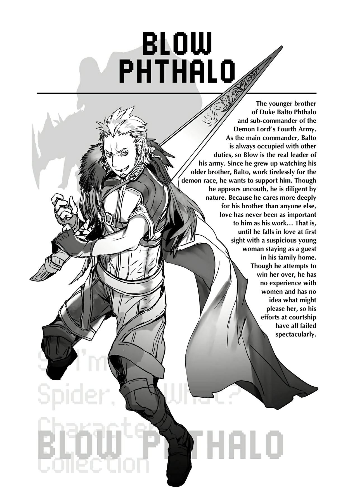

# Chương 3: Kẻ du côn xuất hiện
*(Arrival of the Hooligan)*

Chúng tôi đã sống trong dinh thự công tước được vài ngày rồi.

Cảm giác cho đến nay thế nào á? Phải nói là siêu cấp tuyệt vời!

Ý tôi là, chuyện đó chẳng có gì ngạc nhiên cả. Tôi đã phải sống rong ruổi trên đường suốt một khoảng thời gian dài đằng đẵng, mỗi lần chỉ ở lại các khu cắm trại hay nhà trọ được cùng lắm một hai ngày.

Thế nên dĩ nhiên là những nơi đó không đời nào sánh được với việc sống trong một dinh thự sang trọng rồi.

Vậy nên, cho phép tôi được miêu tả lối sống thanh tao của mình tại dinh thự công tước nhé.

Đầu tiên là thức dậy.

Lúc nào á? À, cái đó thì hên xui.

Tôi có thể ngủ trên chiếc giường êm ái bao lâu tùy thích, và tôi cũng có thể thức trắng đêm nếu hứng chí, thế nên dĩ nhiên lịch trình ngủ nghỉ của tôi hoàn toàn đảo lộn hết cả lên.

Mà cái đó thì đâu có trách tôi được!

Tiếp theo, ngay khi tôi vừa thức dậy, Riel và Fiel sẽ chơi trò thay đồ với tôi một lúc.

Trông có hơi mỉa mai khi một cặp búp bê rối lại dùng tôi làm đồ chơi của chúng đúng không?

But tôi cũng chẳng bận tâm lắm.

Sau khi hai đứa nghịch ngợm đủ trò với quần áo, tóc tai và thậm chí là trang điểm các thứ cho tôi, thì đã đến giờ ăn sáng.

Gia nhân chuẩn bị bữa sáng cho tôi trong lúc Riel và Fiel tha hồ chỉnh sửa diện mạo trong ngày của tôi.

Giờ giấc ngủ dậy của tôi khá là ngẫu hứng, nên dĩ nhiên hầu như ngày nào họ cũng phải làm lại bữa sáng cho tôi.

Dù chuyện đó có hơi phiền phức cho các đầu bếp thật, but cứ coi như đó là một sự hy sinh cần thiết để phục vụ cho lối sống xa hoa mà tôi xứng đáng được hưởng đi.

Tôi ăn sáng ngay tại phòng cùng với Riel và Fiel.

Đúng chất dinh thự công tước, đồ ăn dĩ nhiên là cực ngon rồi. Tuy có hơi mang cảm giác sản xuất hàng loạt một chút, but không sao cả.

Đâu thể bắt các đầu bếp lúc nào cũng phải nấu những món hảo hạng nhất suốt cả ngày đúng không?

Cứ cho là vậy đi.

Tôi tin chắc không phải là các đầu bếp đang căm ghét tôi hay đại loại thế đâu.

Ăn sáng xong là đến giờ làm việc. Mà việc ở đây thực chất chỉ là tạo tơ.

Đây là việc duy nhất tôi thực sự nghiêm túc thực hiện đấy nhé.

Nói thật thì, bản thân việc tạo tơ cực kỳ dễ dàng. Nó diễn ra tự nhiên đến mức lúc này tôi phải tự hỏi tại sao trước khi xảy ra sự cố ở Dãy núi Huyền Bí mình lại không thể làm được chuyện đó.

Hơn nữa, việc này không tốn bao nhiêu công sức. Tôi không hề cảm thấy mệt mỏi dù có tạo ra bao nhiêu tơ đi chăng nữa, và năng lượng bên trong tôi cũng không có vẻ gì là bị giảm sút.

Vì vậy, chỉ riêng việc tạo tơ thôi thì siêu dễ, tôi có thể tạo ra bao nhiêu tùy thích.

But nếu tôi cứ ngồi không rồi tạo tơ vô tội vạ, tôi sẽ chẳng đi đến đâu cả.

Mục tiêu của tôi là lấy lại ít nhất là phần lớn sức mạnh trước đây, hoặc biết đâu là còn mạnh hơn thế nữa.

Hồi còn kỹ năng, chỉ cần sử dụng chúng thường xuyên là cấp độ kỹ năng sẽ tự động tăng lên, but giờ thì không còn như vậy nữa rồi.

Có công mài sắt có ngày nên kim, nên tập luyện chăm chỉ dĩ nhiên chẳng đi đâu mà thiệt, but nếu tôi muốn làm chủ hoàn toàn sức mạnh của mình, thì chỉ tạo tơ đơn thuần là không đủ.

Tôi hy vọng có thể lấy cảm giác đó làm điểm khởi đầu để tìm ra cách sử dụng các năng lực khác của mình, nên tôi cố gắng tập trung vào nó trong lúc làm việc.

...But cho đến nay, việc đó vẫn chưa mang lại kết quả nào.

Việc tôi có thể tạo tơ quá đỗi tự nhiên thực chất lại khiến tôi khó nắm bắt cảm giác đó hơn. Bởi vì tôi có thể tạo ra nó bất cứ khi nào mình muốn, đồng nghĩa với việc tôi có thể làm mà chẳng cần suy nghĩ gì.

Thật khó để nhận thức được cảm giác khi bản thân đang thực hiện một hành động vô thức đúng không?

Có lẽ chuyện này giống như một thiên tài bẩm sinh đang cố gắng dạy học cho người khác và không thể hiểu nổi tại sao học trò của mình lại không hiểu được những điều quá cơ bản vậy.

Thế là tôi thử làm nhiều trò khác nhau trong lúc tạo tơ, but kết quả duy nhất thu được là... lại có thêm tơ.

Xem ra sẽ phải mất một thời gian dài nữa tôi mới có thể tái hiện lại bất kỳ kỹ năng cũ nào khác.

But dù sao thì, Riel và Fiel cũng thu gom đống tơ tôi tạo ra để may quần áo, cuộn thành các cuộn len, gửi mọi thứ cho Ma Vương, vân vân mây mây, nên ít nhất đây cũng không phải là việc hoàn toàn lãng phí thời gian.

Hễ thấy đói bụng là tôi lại tạm nghỉ tay để ăn trưa.

Thức ăn vẫn có cảm giác sản xuất hàng loạt thật đấy, but ừ thì, chuyện nhỏ như con thỏ thôi!

Vào những dịp hiếm hoi tôi thực sự ăn trưa đúng giờ giấc đàng hoàng, sự khác biệt về độ xa hoa là cực kỳ rõ ràng.

Không phải họ đang bớt xén nguyên liệu đâu!

Chỉ tại tôi quá vô kỷ luật với lịch trình của mình mà thôi!

Dẫu sao các đầu bếp vẫn chuẩn bị đồ ăn cho tôi đã là một sự nhân từ lớn rồi!

Phải rồi, cứ cho là như thế đi.

Ăn trưa xong là đến thời gian rảnh rỗi, và tôi sẽ tận dụng nó theo những cách khác nhau tùy thuộc vào tâm trạng từng ngày.

Nói cách khác, thích gì làm nấy.

Ví dụ như đọc sách trong thư viện của dinh thự, hoặc đan lát bằng đống tơ mình tạo ra từ sáng sớm, hoặc tạo dáng thật ngầu trong khi cố gắng luyện tập ma pháp.

Hửm? Cái việc cuối cùng là sao á?

Tôi chịu đấy. Đừng có bận tâm làm gì.

Tôi chắc chắn không hề nhớ việc Riel and Fiel cứ trố mắt nhìn tôi như thể vừa chứng kiến một cảnh tượng cực kỳ thảm hại đâu nhé.

Rõ chưa? Rõ rồi nhé.

Dù sao thì, khoảng thời gian còn lại trong ngày của tôi hoàn toàn rảnh rỗi cho đến tận bữa tối.

Điều nhất tôi phải lưu ý là nếu tôi yêu cầu bữa tối vào những khung giờ oái oăm, chẳng hạn như lúc nửa đêm, chất lượng đồ ăn sẽ bị sụt giảm thê thảm.

Cũng hợp lý thôi. Đến cả các đầu bếp trong dinh thự công tước cũng phải tan ca nghỉ ngơi sau khi đã nấu xong bữa tối vào giờ giấc thông thường chứ.

Nếu yêu cầu đồ ăn sau giờ đó, việc bạn phải tự phục vụ bản thân là hoàn toàn dễ hiểu.

Chà, thực ra chúng tôi không được phép bén mảng vào nhà bếp, nên hầu gái phải làm việc đó thay thế; but cô hầu gái đó cũng đâu biết nấu ăn, nên bữa ăn luôn chỉ toàn là bánh mì hoặc thịt khô hay đại loại thế.

Nói cách khác, toàn là những món không cần chuẩn bị hay chế biến gì phức tạp cả.

Ý tôi là, chúng vẫn rất ngon đấy nhé, biết không?

Dù sao cũng là dinh thự công tước nên tất cả nguyên liệu dự trữ đều thuộc hàng xịn xò cả.

But nếu bạn chỉ quẳng đống đó lên một cái đĩa rồi coi như xong bữa... Bạn hiểu ý tôi chứ?

Thật không thể tin nổi.

Đó là lý do tại sao tôi luôn cố gắng ăn tối vào khung giờ bình thường.

Theo một nghĩa nào đó, đây thậm chí còn là một nhiệm vụ quan trọng hơn cả việc tạo tơ.

Dù sao thì, sau bữa tối, tôi thư giãn một lát rồi đi ngủ.

Hầu hết những ngày trôi qua của tôi đều như thế cả.

Hửm? Bạn bảo tôi chỉ toàn ăn không ngồi rồi, ăn với ngủ thôi á?

Ồ, nếu muốn thì bạn cứ diễn đạt theo cách đó cũng được.

Nghĩa vụ thực tế duy nhất của tôi là tạo tơ theo yêu cầu của Ma Vương, mà việc đó thì đâu có khó khăn gì.

Tôi được tận hưởng một cuộc sống lười biếng vô lo vô nghĩ mỗi ngày.

Nơi này đúng là thiên đường chứ còn gì nữa?!

“Cái quái gì thế này?!”

Ngay lập tức, lối sống lười biếng ngập tràn hạnh phúc của tôi bị phá vỡ một cách thô bạo bởi một tiếng hét lớn.

Riel và Fiel, hai đứa đang chơi trò chuyền tay ném mấy cuộn tơ hay gì đó, lập tức vào thế chiến đấu.

Tôi không thể nhìn thấy chủ nhân của giọng nói vừa rồi.

Có lẽ là vì cánh cửa phòng tôi đã bị che kín bởi một bức tường tơ.

Phảiii, tôi đã giăng tơ phủ kín toàn bộ căn phòng họ giao cho tôi.

Nhìn xem, nếu không làm thế thì tôi sẽ thấy không thoải mái chút nào! Nó giống như là bản năng loài nhện của tôi vậy! Với cả tôi phải chặn ánh nắng chiếu qua cửa sổ vì nó có hại cho làn da của tôi nữa!

Thế nên bạn có thể hiểu tại sao tôi buộc phải biến căn phòng của mình thành một đống tơ nhện hỗn độn rồi đấy.

Điều đó cũng đồng nghĩa với việc không ai có thể bước vào phòng tôi ngoại trừ Riel và Fiel.

Hai đứa có thể dễ dàng gạt đống tơ sang một bên để đi vào, có lẽ vì chúng cũng là nhện giống như tôi. Theo logic đó, tôi đoán là Ael, Sael và Ma Vương cũng có thể vào được.

But cô hầu gái thì dĩ nhiên là chịu chết rồi, thế nên tôi bảo cô ấy cứ để đồ ăn thức uống ở ngay bên ngoài cửa phòng.

Dù sao thì, căn phòng của tôi là khu vực cấm đối với bất kỳ vị khách nào không phải loài nhện, vậy mà hiện tại đang có một kẻ đột nhập cố gắng đi vào. Nghe giọng thì có vẻ là đàn ông.

Tại sao lại gọi hắn là kẻ đột nhập á? Bởi vì hắn thản nhiên mở toang cửa phòng ngủ của một thiếu nữ mà chẳng thèm gõ cửa lấy một tiếng, rõ ràng là một kẻ vô giáo dục.

“Này, đứa nào bên trong đó! Cái đống quái quỷ gì thế này?”

“Dạ... em nghĩ đống này là do vị khách đang nghỉ tại phòng này giăng ra ạ. Chúng em cũng không rõ chi tiết thế nào.”

Tôi có thể nghe thấy kẻ đột nhập đang nói chuyện với một người nghe giọng như cô hầu gái trong khi hắn đang ra sức giật bức tường tơ.

Dựa vào giọng điệu cung kính của cô hầu gái, có vẻ tên này là một nhân vật có máu mặt.

Tôi đoán nếu hắn thực sự là kẻ đột nhập bất hợp pháp, hắn đã không đời nào vượt qua được hệ thống an ninh của dinh thự rồi. Chắc chắn là có ai đó đã cho hắn vào, và thậm chí có khi còn dẫn hắn đến tận đây nữa.

Vậy nên hay là Ma Vương cử hắn đến để gọi chúng tôi đi hay gì đó?

“Cậu chủ nhỏ à, những căn phòng này hiện đang được sử dụng bởi các vị khách quý của người anh trai đáng kính của cậu. Dù cậu là em trai của chủ nhân dinh thự này đi chăng nữa, thần e rằng cậu cũng không thể tự tiện xông vào mà không có sự cho phép trước.”

Ồ hô? Nghe có vẻ như Quản gia trưởng đã tới rồi.

Và theo những gì tôi nghe được, ông ấy đang giáo huấn kẻ đột nhập.

“Đã bảo là đừng có gọi ta là cậu chủ nhỏ nữa rồi mà, chết tiệt!”

“Và như thần tin là mình đã trình bày, thần sẽ rất vui lòng ngừng gọi ngay khi cậu chủ nhỏ thực sự trưởng thành, thưa cậu chủ nhỏ.”

“Ư hự!”

Nghe có vẻ tên đột nhập hoàn toàn không phải là đối thủ của Quản gia trưởng trong việc cãi lý.

Hơn nữa, có vẻ hắn chính là em trai của Balto, chủ nhân dinh thự này.

Vì hắn có liên quan đến nơi này, nên chắc không phải do Ma Vương cử tới rồi. Thật ra, đáng lẽ ngay từ đầu tôi phải biết là Ma Vương sẽ không đời nào giao phó công việc gì cho một kẻ có tính khí cục cằn, thô lỗ như vậy chứ.

“Bỏ đi! Thế thì nói cho ta biết cái đống này là cái vẹo gì!”

Ồ. Xem ra tên đột nhập đã nhận ra rằng trò gọi "cậu chủ nhỏ" kia sẽ không bao giờ chấm dứt, nên hắn quyết định quay lại chủ đề ban đầu.

Đây chỉ là linh cảm thôi, but tôi có thể mường tượng ra cảnh hắn đang chỉ tay vào bức tường tơ từ bên ngoài phòng.

Mà này, dẫu xuất thân từ một gia tộc quý tộc lớn như công tước, giọng điệu của hắn nghe chẳng khác nào một tên du côn đang cố tỏ ra nguy hiểm cả.

Thay vì gọi là "kẻ đột nhập", từ giờ tôi sẽ gọi hắn là "Kẻ Du Côn".

“Đó là nguyên liệu do vị khách quý của chúng ta tạo ra, như thần tin là cô hầu gái tốt bụng này vừa giải thích với cậu chủ nhỏ.”

“Ta biết thừa cái đó rồi, chết tiệt! Ý ta muốn hỏi là tại sao các người lại để bọn họ muốn làm gì thì làm với phòng ốc trong nhà của chúng ta hả?!”

À há. Hóa ra tôi chính là lý do khiến Kẻ Du Côn nổi điên như vậy.

“Với cả ta nghe nói bọn họ cứ ru rú trong đó làm mấy chuyện mờ ám gì đúng không! Tại sao anh trai ta lại cho phép một lũ lập dị đáng nghi ở lại đây chứ?! Chết tiệt!”

“Thần cam đoan với cậu chủ nhỏ rằng chủ nhân đã đích thân cho phép tất cả những chuyện này. Đó không phải việc để cậu phàn nàn đâu, thưa cậu chủ nhỏ.”

“Và ta đang bảo với ông là lý do đó không đủ thuyết phục đấy!”

Có vẻ như hắn và anh trai mình không được hòa thuận cho lắm?

Dựa vào những gì hắn vừa nói, có vẻ như gia nhân trong dinh thự cũng chẳng mấy thiện cảm với các hoạt động của tôi, but điều thực sự làm Kẻ Du Côn này ngứa mắt là việc anh trai hắn đã cho phép chúng tôi muốn làm gì thì làm.

“Nghe cho rõ đây! Đây là dinh thự của gia tộc ta! Các người không thể cứ thích là giăng cái đống rác rưởi này đầy phòng của chúng ta được! Này! Đứa bên trong kia! Ta biết thừa là ngươi nghe thấy tiếng ta đấy nhé!”

“Xin cậu chủ nhỏ hãy dừng tay lại!”

“Câm miệng đi, lão già!”

Phụt! Lão già! Kẻ Du Côn vừa gọi Quản gia trưởng là lão già kìa!

Nghe một cụm từ như thế xen lẫn giữa đống lời chửi thề của hắn đúng là buồn cười không chịu nổi.

“Kẹ-kẹ-kẹ-kẹ-kẹ-kẹ!”

Đột nhiên, tôi nghe thấy một âm thanh kỳ quái phát ra từ ngay bên cạnh mình.

Ngoảnh lại nhìn, tôi thấy hai vai của Riel đang rung bần bật khi cô bé phát ra âm thanh đó.

Ờ, chính xác thì nhóc đang làm cái trò gì thế?

Đó là nhóc đang cười đấy à? Cái gì, câu đó chọc trúng chỗ buồn cười của nhóc hay sao?

Hồi trước tôi có gắn một cơ chế giọng nói thử nghiệm cho lũ nhện rối, but vì chưa bao giờ phát triển nó vượt qua giai đoạn thử nghiệm nên chúng không thể nói chuyện lưu loát cho lắm. Bình thường chúng cũng chẳng thèm cố nói làm gì.

Thế nên nếu Riel cất công phát ra tiếng cười như vậy, chắc chắn là con bé phải thấy chuyện này buồn cười dữ dội lắm. But nói thật thì trông nó cứ ghê rợn thế nào ấy. Thôi đi giùm cái được không?

“Ngươi cười cái quái gì thế hả?!”

Thấy chưa?! Nhóc làm Kẻ Du Côn phát điên lên hơn rồi kìa!

Cái tình huống hỗn loạn gì thế này?

“Xin cậu chủ nhỏ dừng lại ngay đi!”

“Không một ai được phép coi thường ta hết!”

Bức tường tơ rung lên bần bật.

Kẻ Du Côn chắc chắn đã nổi điên và thử đấm vào nó.

“Cái quái gì thế?! Ta bị dính chặt rồi?!”

Ồ, phải rồi. Đó là tơ nhện mà lị.

Chạm vào nó thì dĩ nhiên là phải bị dính chặt lại rồi.

“Chết tiệt!”

Chửi bới om sòm, Kẻ Du Côn lập tức chuyển sang hành động tiếp theo, đó là... LỬA?!

Bức tường tơ đang bốc cháy!

Cái loại đần độn nào lại đi phóng hỏa ngay trong chính ngôi nhà của mình thế hả?!

Ngay cả sau khi tôi được thần hóa, tơ của tôi vẫn giữ nguyên các đặc tính cơ bản.

Nói cách khác, nó vẫn sợ lửa.

Nó có thể chống chịu được ở một mức độ nhất định, but tên du côn ngốc nghếch này chắc hẳn đã chơi lớn rồi, bởi vì ngọn lửa đang thiêu rụi cả khả năng kháng tính của sợi tơ tôi.

Chắc hắn đã dùng một loại kỹ năng hệ hỏa nào đó, và tôi đoán cấp độ kỹ năng của hắn cũng khá cao đấy. Ha ha ha.

Khoan đã, chuyện này chẳng có gì vui cả!

Nhanh lên! Phải dập tắt ngọn lửa này ngay, bằng không tôi sẽ bị thiêu sống mất!

Cả bốn bức tường trong phòng đều bị phủ kín bằng tơ, nên nếu tất cả bốc cháy, tôi sẽ chẳng còn chỗ nào mà chạy trốn nữa!

Hiện tại mới chỉ có khu vực gần cửa là đang cháy thôi, but nếu tôi không hành động nhanh, ngọn lửa chắc chắn sẽ lan ra phần còn lại của căn phòng.

Trong khi tôi đang hoảng loạn tột độ ở bên trong, ba bóng người khác bắt đầu hành động.

Hai trong số đó là Riel và Fiel, thế nên tôi lập tức túm gáy kéo giật hai đứa lại.

Cấm hai nhóc làm bậy nhé!

Tôi không biết chính xác hai đứa đang định làm cái trò gì, but thừa hiểu hai đứa thì chắc chắn chẳng có ý tưởng gì tốt đẹp cả!

Riel trông như thể sắp sửa sử dụng một loại ma pháp nào đó, còn Fiel thì có vẻ như đang định lao thẳng người đâm sầm qua.

Làm thế không những không dập được lửa, mà hai đứa có khi còn giật sập cả tòa dinh thự này ấy chứ!

Mà kể cả không sập, tôi tin chắc Kẻ Du Côn, Quản gia trưởng và cô hầu gái đứng gần đó đều sẽ bị sóng xung kích thổi bay màu sạch sẽ cho mà xem.

Tôi thì chẳng thèm quan tâm đến Kẻ Du Côn làm gì, dù sao đây cũng là lỗi của hắn, but hai người kia sẽ là nạn nhân vô tội, thế nên tôi buộc phải ngăn hai đứa lại ngay lập tức.

Trong lúc tôi còn đang bận cản hai kẻ ngốc này phá hủy mọi thứ xung quanh, Quản gia trưởng đã sử dụng ma pháp hệ thủy để dập tắt ngọn lửa một cách an toàn.

Đúng như mong đợi. Lão đúng là một quản gia ra dáng đấy chứ.

“Cậu chủ nhỏ...”

But lúc này, ông ấy đang lườm Kẻ Du Côn với gân xanh nổi đầy trên trán.

Bạn hỏi tại sao tôi lại biết điều đó á?

Bởi vì bức tường tơ chắn trước cửa phòng đã bị thiêu rụi hoàn toàn, thế nên chẳng còn thứ gì cản trở tầm nhìn của tôi nữa.

Kẻ Du Côn, có lẽ đã nhận thức được mình vừa gây ra một rắc rối lớn, liền né tránh ánh mắt giận dữ của Quản gia trưởng...

...và chạm mắt với tôi.

“Hả?!”

Kẻ Du Côn nín thở và đứng hình mất năm giây.

Ờ, xin lỗi nhé, làm ơn đừng nhìn được không? Dân hikikomori không thích giao tiếp bằng mắt trực tiếp đâu đấy.

Với cả, hiện tại mắt tôi đang chứa đầy con ngươi trông cực kỳ dị hợm, nên tôi không muốn người khác nhìn thấy chúng chút nào.

Không phải vì xấu hổ đâu—chỉ là để tránh rắc rối không đáng có thôi.

Tôi lập tức nhắm chặt mắt lại và quay mặt đi chỗ khác.

Mặc dù hành động đó có thể là bất lịch sự với em trai của chủ nhà thật, but tôi tin chắc cái gã cố tình đột nhập vào phòng của một thiếu nữ rồi phóng hỏa mới là kẻ sai hoàn toàn.

Hơn nữa, tôi cũng chẳng thèm quan tâm nếu có làm phật lòng một kẻ vừa khơi gợi lại ký ức đau buồn về việc nhà của mình bị thiêu rụi thành bình địa!

Trời đất, chỉ nghĩ đến thôi là đã thấy lộn ruột rồi.

Cứ làm ơn tha cho tôi, để tôi yên được không hả?

Trong khi vẫn bị tôi túm cổ áo, Riel và Fiel cùng bước lên một bước, như thể cảm nhận được cảm xúc của tôi.

Cùng lúc đó, những cơ thể nhỏ bé của hai đứa bắt đầu tỏa ra một luồng sát khí mạnh mẽ đến mức nực cười.

“…! Xin cậu chủ nhỏ! Thần khẩn thiết xin cậu hãy rút lui trước khi mọi chuyện vượt ra ngoài tầm kiểm soát!”

Quản gia trưởng vội vàng tóm lấy vai Kẻ Du Côn và dùng lực lôi tuột hắn ra khỏi phòng.

Đối xử với một thành viên của gia tộc đang thuê mình như thế có thực sự ổn không đấy?

But nghĩ lại thì, nếu ông ấy không làm thế, Riel và Fiel có khi đã băm vằn tên du côn kia thành từng mảnh nhỏ rồi, nên đó có lẽ là quyết định hoàn toàn đúng đắn.

“Ờ... được rồi.”

Kẻ Du Côn gật đầu một cách đờ đẫn, ngọn lửa hung hăng của hắn đã bị dập tắt hoàn toàn.

Tôi không thể biết chắc vì đang nhắm mắt, but... là do tôi tưởng tượng hay Kẻ Du Côn thực sự đang lườm tôi cháy mặt thế kia?

“Hãy tiễn cậu chủ nhỏ về phòng đi.”

“D-Dạ vâng. Mời đi lối này, thưa cậu chủ Bloe.”

Nhận lệnh của Quản gia trưởng, cô hầu gái dẫn Kẻ Du Côn đi.

Cuối cùng tôi cũng biết được tên của Kẻ Du Côn.

Hóa ra tên hắn là Bloe.

Nhưng tôi cũng chẳng thèm quan tâm. Gọi hắn là "Kẻ Du Côn" là quá đủ rồi.

Tôi thề là sẽ không bao giờ gọi tên thật của hắn đâu; tôi cam đoan chắc chắn đấy.

“Thần xin thay mặt chủ nhân chân thành xin lỗi vì sự thô lỗ tột cùng của cậu chủ nhỏ.”

Quản gia trưởng đang nói chuyện với tôi.

Hé mắt ra nhìn một chút, tôi thấy ông ấy đang cúi đầu rất sâu.

Thay mặt chủ nhân của mình sao? Quý tộc mà lại xin lỗi dễ dàng thế à? Mà ông ấy tự tiện lấy danh nghĩa của chủ nhân ra xin lỗi như thế có ổn không nhỉ?

Có lẽ Balto cực kỳ tin tưởng vị quản gia này, hoặc có thể là do uy thế của Ma Vương khiến ông ấy phải đứng ra tạ lỗi với tôi như thế. Còn không thì đây chỉ là hành động tự phát của vị quản gia này mà thôi.

Nếu là vế sau, liệu ông ấy có gặp rắc rối không nhỉ?

Hừm. Mà thôi, cái đó không phải việc của tôi.

Lỗi rành rành là ở Kẻ Du Côn rồi.

“Thần tin chắc chủ nhân sẽ sớm đích thân đến xin lỗi quý khách. Thần sẽ dốc hết sức mình để ngăn không cho cậu chủ nhỏ tiếp cận quý khách cùng những người đi cùng. Kính xin quý khách rộng lòng tha thứ, đừng trút cơn thịnh nộ lên gia tộc của chúng thần nếu có thể.”

Quản gia trưởng nói rất nhanh, đầu vẫn cúi gằm xuống.

Tôi biết ông ấy chỉ đang cố che chắn cho chủ nhân của mình, nên thấy ông ấy cứ liên tục xin lỗi thế này tôi cũng thấy hơi ái ngại.

Buông cổ áo của Riel và Fiel ra, tôi nhẹ nhàng vỗ vai hai đứa.

Hiểu ý tôi, hai đứa lập tức thu hồi luồng sát khí dữ dội kia lại và thả lỏng cơ thể.

“Một lần nữa, thần vô cùng xin lỗi vì sự quấy rầy này. Xin quý khách hãy cứ tự nhiên nghỉ ngơi.”

Nói xong, vị quản gia cẩn thận khép cửa phòng lại.

Chà, đúng là một tai nạn từ trên trời rơi xuống, but nghe bảo tôi sẽ không bao giờ phải nhìn thấy cái bản mặt đáng ghét của Kẻ Du Côn kia nữa, nên sao cũng được.

Cứ ngỡ là thế. But ai mà ngờ được, sau đó Kẻ Du Côn cứ liên tục xuất hiện trước mặt chúng tôi hết lần này đến lần khác.

Trong đầu tôi đã thoáng qua ý nghĩ hay là tiễn hắn lên đường luôn cho rảnh nợ, but hãy cứ coi đó là một bí mật nhỏ của chúng ta nhé.

> **BLOE PHTHALO**
> 
> Em trai của Công tước Balto Phthalo và là phó chỉ huy Quân đoàn 4 của Ma Vương. Vì tổng chỉ huy Balto luôn bận rộn với các công việc khác, Bloe là người thực sự lãnh đạo quân đoàn. Lớn lên khi chứng kiến anh trai Balto làm việc không ngừng nghỉ vì ma tộc, cậu ấy luôn muốn hỗ trợ anh mình. Dù vẻ ngoài trông cộc cằn, bản chất cậu ấy rất cần mẫn. 
> 
> Vì quan tâm đến anh trai mình hơn bất kỳ ai khác, tình yêu chưa bao giờ là điều quan trọng đối với cậu ấy so với công việc... Cho đến khi cậu ấy yêu ngay từ cái nhìn đầu tiên với một cô gái trẻ đáng ngờ đang tạm trú tại dinh thự của gia tộc mình. Dù đã cố gắng để chinh phục cô ấy, cậu ấy lại hoàn toàn không có kinh nghiệm gì với phụ nữ và không biết làm thế nào để làm hài lòng cô, thế nên những nỗ lực tán tỉnh của cậu ấy đều thất bại thảm hại.

---

[◀ Chương trước: Đoạn phụ: Trải nghiệm đáng sợ của Lão Quản gia](interlude_the_old_butlers_frightful_experience.md) | [Chương tiếp theo: Đoạn phụ: Nỗi u sầu của Công tước Quỷ ▶](interlude_the_demon_dukes_distress.md)
